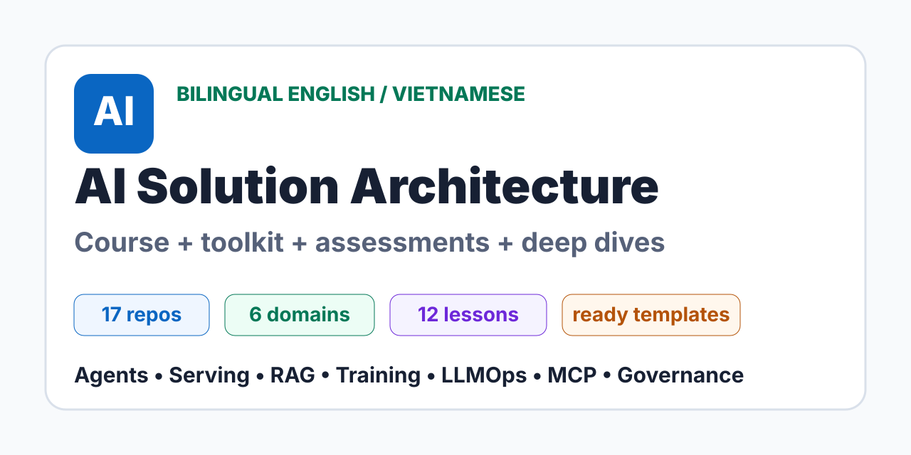
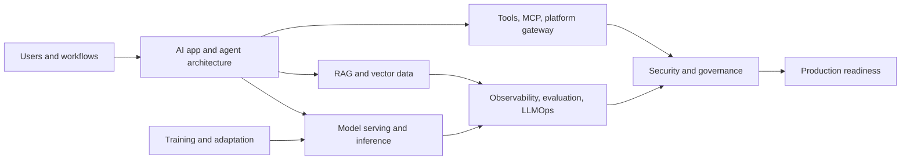
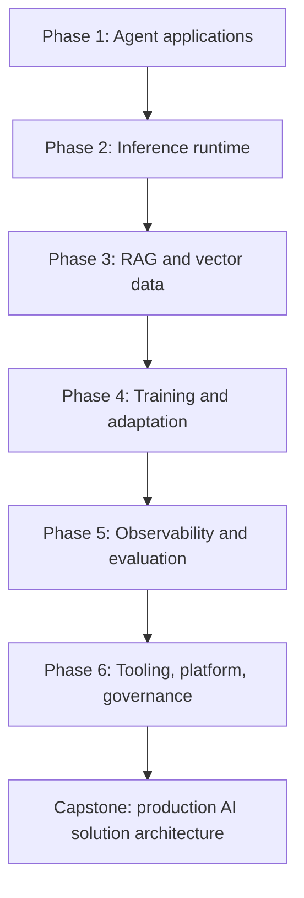

<div align="center">

# AI Solution Architecture Knowledge System

**Most AI systems fail at the architecture boundaries, not at the model call. This bilingual English/Vietnamese repository teaches those boundaries with course material, templates, assessments, and repository-grounded deep dives.**

[](https://anhtnt90dev.github.io/ai-solution-architecture/site/learn/en/)
[](https://anhtnt90dev.github.io/ai-solution-architecture/site/learn/vi/)
[](https://anhtnt90dev.github.io/ai-solution-architecture/)
[](https://anhtnt90dev.github.io/ai-solution-architecture/site/deep-dives/)
[](#architecture-map)
[](https://anhtnt90dev.github.io/ai-solution-architecture/site/learn/en/curriculum.html)
[](https://anhtnt90dev.github.io/ai-solution-architecture/site/templates/)
[](https://github.com/anhtnt90dev/ai-solution-architecture/actions/workflows/validate.yml)

</div>

---



---

## Overview

This repository is a structured knowledge system for learning how to design modern AI solutions end to end. It is built from architecture deep dives across 17 real AI repositories and reorganized into a course-style path for senior developers, solution architects, staff engineers, and technical leads.

The focus is not "how to call an LLM API." The focus is the full system: agent orchestration, model serving, training and adaptation, RAG data architecture, observability, evaluation, tool governance, security, and production operations.

**Live site:** https://anhtnt90dev.github.io/ai-solution-architecture/
**Documentation pages:** https://anhtnt90dev.github.io/ai-solution-architecture/site/learn/en/

---

## Why This Repo Is Different

- **Bilingual by design:** English and Vietnamese learning paths for teams working across local and global engineering contexts.
- **Repository-grounded:** Concepts are tied to real AI repositories instead of abstract slideware.
- **Architect-ready:** Includes templates, capstone, assessment rubrics, production checklists, and governance reviews.
- **Production-first:** Every major topic connects to failure modes, observability, security, and release gates.

---

## Quick Start

| Goal | Start Here |
| --- | --- |
| Read the course landing page | [Learn AI Solution Architecture](https://anhtnt90dev.github.io/ai-solution-architecture/site/learn/) |
| Study in English | [English course homepage](https://anhtnt90dev.github.io/ai-solution-architecture/site/learn/en/) |
| Học bằng tiếng Việt | [Trang khóa học tiếng Việt](https://anhtnt90dev.github.io/ai-solution-architecture/site/learn/vi/) |
| Compare all repositories | [Repository atlas](https://anhtnt90dev.github.io/ai-solution-architecture/site/learn/en/reference-atlas.html) |
| Copy practical templates | [AI architecture toolkit](https://anhtnt90dev.github.io/ai-solution-architecture/site/templates/) |
| Run the capstone | [Enterprise Knowledge Copilot](https://anhtnt90dev.github.io/ai-solution-architecture/site/capstone/) |
| Test your architecture skill | [Assessment pack](https://anhtnt90dev.github.io/ai-solution-architecture/site/assessments/) |
| Share the repo | [Share kit](./SHARE.md) |
| Open detailed repo notes | [Repository architecture docs](https://anhtnt90dev.github.io/ai-solution-architecture/site/deep-dives/) |
| Validate the docs | [Validation scripts](#validation) |

---

## Architecture Map



---

## What You Will Learn

| Domain | Repositories | Core Questions |
| --- | --- | --- |
| AI app and agent architecture | OpenAI Agents Python, LangChain, AutoGen, LlamaIndex | How should agents, workflows, tools, memory, handoffs, and retrieval orchestration be decomposed? |
| Model serving and inference | vLLM, llama.cpp, Transformers | Which runtime fits latency, throughput, memory, streaming, compatibility, and deployment constraints? |
| Fine-tuning and training | PEFT, DeepSpeed | When should you use prompting, RAG, adapters, or distributed training? |
| RAG and vector databases | Qdrant, Chroma | How should embeddings, chunks, metadata, filters, tenancy, durability, and search quality be designed? |
| Observability and LLMOps | Langfuse, Phoenix, MLflow, TruLens | What evidence proves quality, safety, lineage, and production behavior? |
| Tooling and AI platform | MCP servers, Open WebUI | How should tools, provider gateways, admin controls, and self-hosted AI workspaces be governed? |

---

## Learning Path



| Phase | Output |
| --- | --- |
| Agent applications | Agent/workflow/team architecture decision log |
| Inference runtime | Serving runtime comparison and capacity plan |
| RAG and vector data | Retrieval data contract and vector DB operating model |
| Training and adaptation | Fine-tuning decision tree and artifact governance plan |
| Observability and evaluation | Trace schema, evaluation dataset, and promotion gate |
| Platform and governance | Tool policy, MCP boundary, security review, production checklist |

---

## Repository Structure

```text
.
|-- index.html
|   GitHub Pages landing page.
|-- assets/
|   Social preview and visual assets.
|-- learn-ai-solution-architecture/
|   Course-style bilingual knowledge system.
|   |-- docs/en/
|   |   English curriculum, projects, atlas, glossary.
|   |-- docs/vi/
|   |   Vietnamese curriculum, projects, atlas, glossary.
|   `-- validate-knowledge-system.ps1
|-- templates/
|   Copy-ready architecture templates and checklists.
|-- capstone/
|   Enterprise Knowledge Copilot architecture project.
|-- assessments/
|   English and Vietnamese architecture review exams.
|-- repo-architecture-docs/
|   Bilingual deep-dive architecture notes for 17 repositories.
|   `-- validate-docs.ps1
|-- .github/
|   Issue templates and pull request template.
`-- .gitignore
```

The upstream source checkouts used for analysis are intentionally not published in this repository.

---

## Core Reading List

### English

- [Course homepage](https://anhtnt90dev.github.io/ai-solution-architecture/site/learn/en/)
- [Curriculum](https://anhtnt90dev.github.io/ai-solution-architecture/site/learn/en/curriculum.html)
- [Projects](https://anhtnt90dev.github.io/ai-solution-architecture/site/learn/en/projects.html)
- [Repository atlas](https://anhtnt90dev.github.io/ai-solution-architecture/site/learn/en/reference-atlas.html)
- [Glossary](https://anhtnt90dev.github.io/ai-solution-architecture/site/learn/en/glossary.html)
- [Templates](https://anhtnt90dev.github.io/ai-solution-architecture/site/templates/)
- [Capstone](https://anhtnt90dev.github.io/ai-solution-architecture/site/capstone/)
- [Assessments](https://anhtnt90dev.github.io/ai-solution-architecture/site/assessments/)

### Tiếng Việt

- [Trang khóa học](https://anhtnt90dev.github.io/ai-solution-architecture/site/learn/vi/)
- [Chương trình học](https://anhtnt90dev.github.io/ai-solution-architecture/site/learn/vi/curriculum.html)
- [Dự án thực hành](https://anhtnt90dev.github.io/ai-solution-architecture/site/learn/vi/projects.html)
- [Bản đồ repository](https://anhtnt90dev.github.io/ai-solution-architecture/site/learn/vi/reference-atlas.html)
- [Bảng thuật ngữ](https://anhtnt90dev.github.io/ai-solution-architecture/site/learn/vi/glossary.html)
- [Bộ template kiến trúc](https://anhtnt90dev.github.io/ai-solution-architecture/site/templates/)
- [Capstone](https://anhtnt90dev.github.io/ai-solution-architecture/site/capstone/)
- [Bài kiểm tra](https://anhtnt90dev.github.io/ai-solution-architecture/site/assessments/)

---

## Toolkit And Capstone

| Artifact | Purpose |
| --- | --- |
| [Architecture Decision Record](https://anhtnt90dev.github.io/ai-solution-architecture/site/templates/architecture-decision-record.html) | Record decisions, evidence, trade-offs, and failure modes. |
| [Runtime Decision Matrix](https://anhtnt90dev.github.io/ai-solution-architecture/site/templates/runtime-decision-matrix.html) | Choose between hosted APIs, Transformers, vLLM, llama.cpp, or hybrid serving. |
| [RAG Data Contract](https://anhtnt90dev.github.io/ai-solution-architecture/site/templates/rag-data-contract.html) | Define document, chunk, metadata, embedding, query, and access policy. |
| [LLMOps Evaluation Scorecard](https://anhtnt90dev.github.io/ai-solution-architecture/site/templates/llmops-evaluation-scorecard.html) | Gate prompt, model, adapter, retrieval, tool, and workflow changes. |
| [Security And Governance Review](https://anhtnt90dev.github.io/ai-solution-architecture/site/templates/security-governance-review.html) | Review tools, secrets, model artifacts, trace data, and access control. |
| [Production Readiness Checklist](https://anhtnt90dev.github.io/ai-solution-architecture/site/templates/production-readiness-checklist.html) | Decide whether a production AI system is ready to launch. |
| [Enterprise Knowledge Copilot Capstone](https://anhtnt90dev.github.io/ai-solution-architecture/site/capstone/) | Apply the whole architecture map to one concrete enterprise scenario. |
| [Assessment Pack](https://anhtnt90dev.github.io/ai-solution-architecture/site/assessments/) | Test whether you can reason like an AI solution architect. |

---

## Deep-Dive Repository Docs

Each repository has two detailed architecture documents: `README.en.md` and `README.vi.md`. Each document includes source tree maps, Mermaid diagrams, runtime flows, extension points, operations, failure modes, security risks, production readiness guidance, and glossary terms.

| Group | Docs |
| --- | --- |
| AI App / Agent Architecture | [Group 01](https://anhtnt90dev.github.io/ai-solution-architecture/site/deep-dives/01-ai-app-agent-architecture/) |
| Model Serving / Inference | [Group 02](https://anhtnt90dev.github.io/ai-solution-architecture/site/deep-dives/02-model-serving-inference/) |
| Fine-tuning / Training | [Group 03](https://anhtnt90dev.github.io/ai-solution-architecture/site/deep-dives/03-fine-tuning-training/) |
| RAG / Vector Database | [Group 04](https://anhtnt90dev.github.io/ai-solution-architecture/site/deep-dives/04-rag-vector-database/) |
| Observability / Evaluation / LLMOps | [Group 05](https://anhtnt90dev.github.io/ai-solution-architecture/site/deep-dives/05-observability-evaluation-llmops/) |
| Tooling / MCP / AI Platform | [Group 06](https://anhtnt90dev.github.io/ai-solution-architecture/site/deep-dives/06-tooling-mcp-ai-platform/) |

---

## Validation

Run from the repository root:

```powershell
powershell -ExecutionPolicy Bypass -File learn-ai-solution-architecture\validate-knowledge-system.ps1
powershell -ExecutionPolicy Bypass -File repo-architecture-docs\validate-docs.ps1
```

The validation checks that the bilingual knowledge system exists, source deep dives are present, documents include diagrams, and placeholders are absent.

---

## Contribution Identity

The initial repository commit was authored and committed as:

```text
anhtnt90dev <124683165+anhtnt90dev@users.noreply.github.com>
```

This keeps GitHub contribution attribution on the `anhtnt90dev` account.
