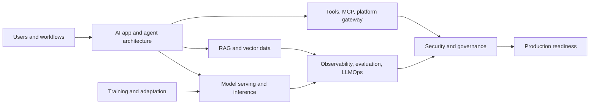
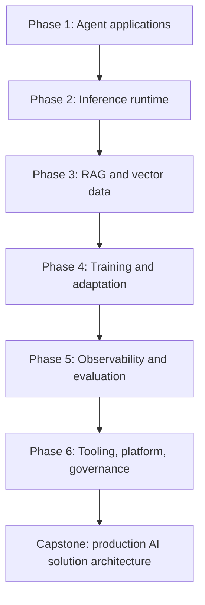

<div align="center">

# AI Solution Architecture Knowledge System

**A bilingual English/Vietnamese learning repository for designing production-grade AI systems.**

[](./learn-ai-solution-architecture/docs/en/README.md)
[](./learn-ai-solution-architecture/docs/vi/README.md)
[](https://anhtnt90dev.github.io/ai-solution-architecture/)
[](./repo-architecture-docs/README.md)
[](#architecture-map)
[](./learn-ai-solution-architecture/docs/en/curriculum.md)

</div>

---

## Overview

This repository is a structured knowledge system for learning how to design modern AI solutions end to end. It is built from architecture deep dives across 17 real AI repositories and reorganized into a course-style path for senior developers, solution architects, staff engineers, and technical leads.

The focus is not "how to call an LLM API." The focus is the full system: agent orchestration, model serving, training and adaptation, RAG data architecture, observability, evaluation, tool governance, security, and production operations.

**Live site:** https://anhtnt90dev.github.io/ai-solution-architecture/

---

## Quick Start

| Goal | Start Here |
| --- | --- |
| Read the course landing page | [Learn AI Solution Architecture](./learn-ai-solution-architecture/README.md) |
| Study in English | [English course homepage](./learn-ai-solution-architecture/docs/en/README.md) |
| Hoc bang tieng Viet | [Trang khoa hoc tieng Viet](./learn-ai-solution-architecture/docs/vi/README.md) |
| Compare all repositories | [Repository atlas](./learn-ai-solution-architecture/docs/en/reference-atlas.md) |
| Open detailed repo notes | [Repository architecture docs](./repo-architecture-docs/README.md) |
| Validate the docs | [Validation scripts](#validation) |

---

## Architecture Map



---

## What You Will Learn

| Domain | Repositories | Core Questions |
| --- | --- | --- |
| AI app and agent architecture | OpenAI Agents Python, LangChain, AutoGen, LlamaIndex | How should agents, workflows, tools, memory, handoffs, and retrieval orchestration be decomposed? |
| Model serving and inference | vLLM, llama.cpp, Transformers | Which runtime fits latency, throughput, memory, streaming, compatibility, and deployment constraints? |
| Fine-tuning and training | PEFT, DeepSpeed | When should you use prompting, RAG, adapters, or distributed training? |
| RAG and vector databases | Qdrant, Chroma | How should embeddings, chunks, metadata, filters, tenancy, durability, and search quality be designed? |
| Observability and LLMOps | Langfuse, Phoenix, MLflow, TruLens | What evidence proves quality, safety, lineage, and production behavior? |
| Tooling and AI platform | MCP servers, Open WebUI | How should tools, provider gateways, admin controls, and self-hosted AI workspaces be governed? |

---

## Learning Path



| Phase | Output |
| --- | --- |
| Agent applications | Agent/workflow/team architecture decision log |
| Inference runtime | Serving runtime comparison and capacity plan |
| RAG and vector data | Retrieval data contract and vector DB operating model |
| Training and adaptation | Fine-tuning decision tree and artifact governance plan |
| Observability and evaluation | Trace schema, evaluation dataset, and promotion gate |
| Platform and governance | Tool policy, MCP boundary, security review, production checklist |

---

## Repository Structure

```text
.
|-- index.html
|   GitHub Pages landing page.
|-- learn-ai-solution-architecture/
|   Course-style bilingual knowledge system.
|   |-- docs/en/
|   |   English curriculum, projects, atlas, glossary.
|   |-- docs/vi/
|   |   Vietnamese curriculum, projects, atlas, glossary.
|   `-- validate-knowledge-system.ps1
|-- repo-architecture-docs/
|   Bilingual deep-dive architecture notes for 17 repositories.
|   `-- validate-docs.ps1
`-- .gitignore
```

The upstream source checkouts used for analysis are intentionally not published in this repository.

---

## Core Reading List

### English

- [Course homepage](./learn-ai-solution-architecture/docs/en/README.md)
- [Curriculum](./learn-ai-solution-architecture/docs/en/curriculum.md)
- [Projects](./learn-ai-solution-architecture/docs/en/projects.md)
- [Repository atlas](./learn-ai-solution-architecture/docs/en/reference-atlas.md)
- [Glossary](./learn-ai-solution-architecture/docs/en/glossary.md)

### Tieng Viet

- [Trang khoa hoc](./learn-ai-solution-architecture/docs/vi/README.md)
- [Chuong trinh hoc](./learn-ai-solution-architecture/docs/vi/curriculum.md)
- [Du an thuc hanh](./learn-ai-solution-architecture/docs/vi/projects.md)
- [Ban do repository](./learn-ai-solution-architecture/docs/vi/reference-atlas.md)
- [Bang thuat ngu](./learn-ai-solution-architecture/docs/vi/glossary.md)

---

## Deep-Dive Repository Docs

Each repository has two detailed architecture documents: `README.en.md` and `README.vi.md`. Each document includes source tree maps, Mermaid diagrams, runtime flows, extension points, operations, failure modes, security risks, production readiness guidance, and glossary terms.

| Group | Docs |
| --- | --- |
| AI App / Agent Architecture | [Group 01](./repo-architecture-docs/01-ai-app-agent-architecture/) |
| Model Serving / Inference | [Group 02](./repo-architecture-docs/02-model-serving-inference/) |
| Fine-tuning / Training | [Group 03](./repo-architecture-docs/03-fine-tuning-training/) |
| RAG / Vector Database | [Group 04](./repo-architecture-docs/04-rag-vector-database/) |
| Observability / Evaluation / LLMOps | [Group 05](./repo-architecture-docs/05-observability-evaluation-llmops/) |
| Tooling / MCP / AI Platform | [Group 06](./repo-architecture-docs/06-tooling-mcp-ai-platform/) |

---

## Validation

Run from the repository root:

```powershell
powershell -ExecutionPolicy Bypass -File learn-ai-solution-architecture\validate-knowledge-system.ps1
powershell -ExecutionPolicy Bypass -File repo-architecture-docs\validate-docs.ps1
```

The validation checks that the bilingual knowledge system exists, source deep dives are present, documents include diagrams, and placeholders are absent.

---

## Contribution Identity

The initial repository commit was authored and committed as:

```text
anhtnt90dev <124683165+anhtnt90dev@users.noreply.github.com>
```

This keeps GitHub contribution attribution on the `anhtnt90dev` account.
