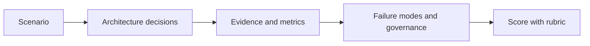

# Assessment Pack

The assessment pack helps learners verify that they can reason like AI solution architects, not only recall tool names.

## Tracks

- [English architecture review exam](./en/architecture-review-exam.md)
- [English answer key](./en/answer-key.md)
- [Bài kiểm tra kiến trúc tiếng Việt](./vi/bai-kiem-tra-kien-truc.md)
- [Đáp án tiếng Việt](./vi/dap-an.md)

## Scoring

| Score | Level | Interpretation |
| --- | --- | --- |
| 0-39 | Beginner | Can name tools but misses architecture boundaries and evidence. |
| 40-69 | Practitioner | Understands layers and common trade-offs but needs stronger production reasoning. |
| 70-89 | Senior engineer | Can connect decisions to evidence, failure modes, and operations. |
| 90-100 | Solution architect | Produces defensible decisions across product, runtime, data, security, evaluation, and operations. |

## Assessment Flow

## How To Run The Assessment

Use the assessment after learners have completed the course path and at least one repository deep dive from each major domain. Give learners a fixed scenario and ask them to produce an architecture review, not a tool comparison. The expected answer should include boundaries, trade-offs, evidence, failure modes, security controls, and operational gates.

For self-study, complete the exam without reading the answer key first. Then compare your answer against the rubric and rewrite the weak sections. For team workshops, split participants into small groups and ask each group to defend a different architectural position. The discussion is more valuable when teams must explain why a reasonable alternative was rejected.

## Expected Submission

A complete submission should include a concise architecture diagram, an Architecture Decision Record, a runtime decision, a RAG or data contract when retrieval is involved, an LLMOps scorecard, and a security/governance review. The answer should also describe what evidence would change the decision. Senior-level work is not defined by naming more tools; it is defined by making sharper trade-offs and creating better verification paths.

## Retake Guidance

If the score is below 70, revisit the curriculum sections for the weakest dimensions and redo the exam with a different scenario. If the score is between 70 and 89, focus on making evidence stronger and failure modes more specific. If the score is above 90, extend the scenario with scale, compliance, multi-tenant retrieval, or tool-governance constraints and review whether the architecture still holds.
