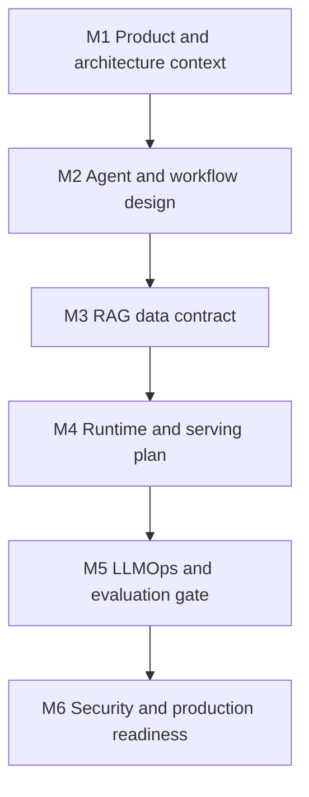
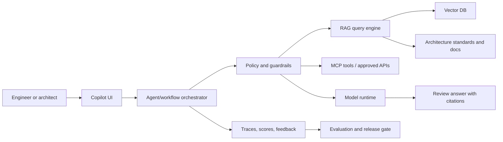

# Capstone: Enterprise Knowledge Copilot For Architecture Review

The capstone is a concrete end-to-end AI solution architecture project. It connects all six course domains into one product scenario.

## Scenario

Your organization wants an internal copilot that helps engineers and architects review architecture proposals, design documents, and production readiness plans. The copilot can retrieve internal knowledge, compare designs against architecture standards, call approved tools, produce review notes, and generate a release readiness summary.

## Success Criteria

- The copilot answers with cited evidence from approved sources.
- Tool calls are governed and auditable.
- Model/runtime choices are justified by latency, cost, and security constraints.
- Evaluation data exists before launch.
- Production readiness has a measurable gate.
- Security review covers prompt injection, data access, traces, tools, and model artifacts.

## Milestones

## Required Artifacts

| Artifact | Template |
| --- | --- |
| Architecture decision record | [ADR](../templates/architecture-decision-record.md) |
| Runtime decision matrix | [Runtime Matrix](../templates/runtime-decision-matrix.md) |
| RAG data contract | [RAG Data Contract](../templates/rag-data-contract.md) |
| LLMOps scorecard | [Evaluation Scorecard](../templates/llmops-evaluation-scorecard.md) |
| Security review | [Security Review](../templates/security-governance-review.md) |
| Production readiness gate | [Production Checklist](../templates/production-readiness-checklist.md) |

## Suggested Stack

| Layer | Candidate Repositories |
| --- | --- |
| Agent/workflow | OpenAI Agents Python, LangChain/LangGraph, LlamaIndex |
| Retrieval | LlamaIndex or LangChain with Qdrant or Chroma |
| Model runtime | Hosted API, vLLM, llama.cpp, or Transformers depending on constraints |
| Adaptation | PEFT if domain style adaptation is needed; DeepSpeed only if scale requires it |
| Observability/evaluation | Langfuse, Phoenix, TruLens, MLflow |
| Tool/platform | MCP servers and Open WebUI for workspace/gateway patterns |

## Architecture Skeleton

## Review Questions

- Which documents can the copilot access?
- What should happen when retrieval confidence is low?
- Which tool calls require human approval?
- What trace fields are required for incident review?
- What evaluation dataset proves the copilot improves architecture review quality?
- What must be true before the copilot can be used for release decisions?

## Vietnamese Summary

Capstone này là bài thiết kế một copilot nội bộ hỗ trợ review kiến trúc. Người học phải thiết kế toàn bộ hệ thống: agent/workflow, RAG, runtime mô hình, evaluation, governance tool, security và production readiness. Đầu ra không phải là demo chat đơn giản, mà là bộ artifact kiến trúc đủ để review trong môi trường enterprise.
