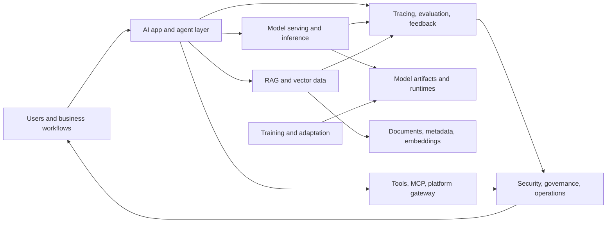
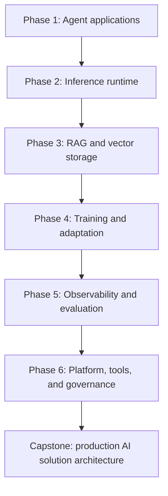
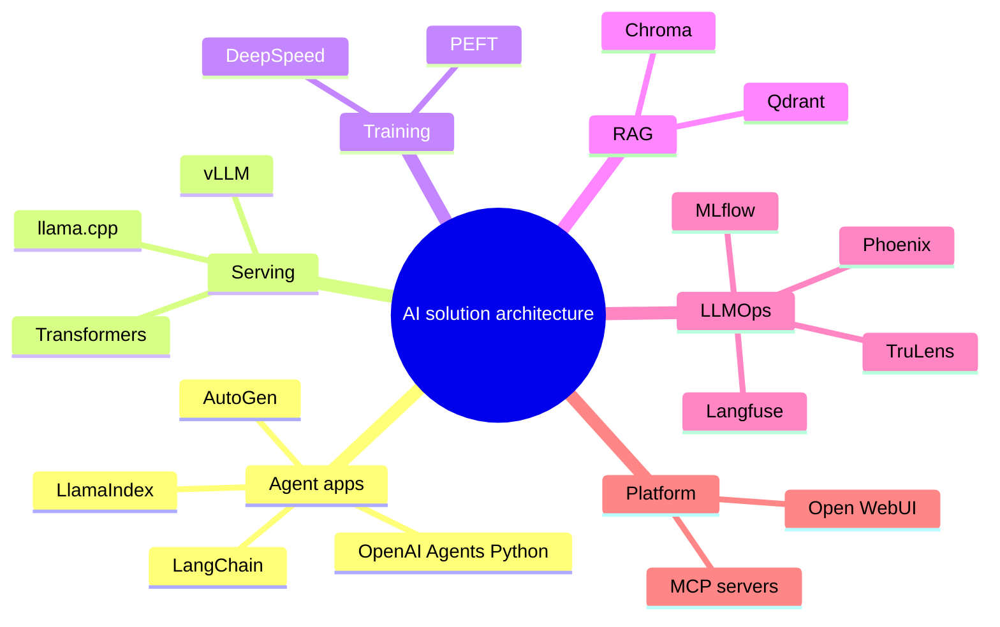

# Learn AI Solution Architecture

A bilingual, repository-grounded course for learning how modern AI systems are designed from agent applications to serving, retrieval, training, observability, tools, and production governance.

[](./docs/en/README.md)
[](./docs/vi/README.md)
[](../repo-architecture-docs/README.md)
[](#the-ai-solution-architecture-map)
[](./docs/en/curriculum.md)
[](./docs/en/projects.md)

> This knowledge system is synthesized from the bilingual deep-dive architecture documents in [`repo-architecture-docs/`](../repo-architecture-docs/README.md). It is written as a learning path, not as another per-repository inventory.

---

## Table Of Contents

- [English](#english)
- [Tiếng Việt](#tiếng-việt)
- [The AI Solution Architecture Map](#the-ai-solution-architecture-map)
- [Quick Start](#quick-start)
- [Learning Path](#learning-path)
- [Syllabus](#syllabus)
- [Projects](#projects)
- [Repository Atlas](#repository-atlas)
- [Local Use](#local-use)

---

## English

The goal is simple: learn how to design a complete AI solution, not just one library call. A production AI system normally needs six cooperating layers:

1. **Application and agent architecture**: agent loops, tools, memory, workflows, human-in-the-loop, orchestration.
2. **Model serving and inference**: model loading, batching, scheduling, token streaming, local or distributed serving.
3. **Training and adaptation**: parameter-efficient tuning, distributed training, checkpointing, optimizer state, reproducibility.
4. **RAG and vector data**: ingestion, embeddings, indexing, hybrid search, metadata filters, tenancy, durability.
5. **Observability, evaluation, and LLMOps**: tracing, scoring, datasets, feedback, prompt/version governance, experiment lineage.
6. **Tooling, MCP, and AI platform**: tool servers, UI gateways, model/provider routing, admin controls, workspace integration.

Read the full English course:

- [Course homepage](./docs/en/README.md)
- [Curriculum](./docs/en/curriculum.md)
- [Projects](./docs/en/projects.md)
- [Repository atlas](./docs/en/reference-atlas.md)
- [Glossary](./docs/en/glossary.md)

---

## Tiếng Việt

Mục tiêu của bộ tài liệu này là giúp bạn học cách thiết kế một **giải pháp AI hoàn chỉnh**, không chỉ gọi một thư viện đơn lẻ. Một hệ thống AI production thường cần sáu lớp phối hợp:

1. **Kiến trúc ứng dụng và agent**: vòng lặp agent, tool, memory, workflow, human-in-the-loop, orchestration.
2. **Serving và inference mô hình**: nạp model, batching, scheduling, streaming token, serving local hoặc distributed.
3. **Training và adaptation**: fine-tuning tiết kiệm tham số, training phân tán, checkpoint, optimizer state, khả năng tái lập.
4. **RAG và dữ liệu vector**: ingestion, embedding, indexing, hybrid search, metadata filter, tenancy, durability.
5. **Observability, evaluation và LLMOps**: tracing, scoring, dataset, feedback, quản trị prompt/version, lineage thí nghiệm.
6. **Tooling, MCP và nền tảng AI**: tool server, UI gateway, routing provider/model, admin control, tích hợp workspace.

Đọc khóa học tiếng Việt:

- [Trang khóa học](./docs/vi/README.md)
- [Chương trình học](./docs/vi/curriculum.md)
- [Dự án thực hành](./docs/vi/projects.md)
- [Bản đồ repository](./docs/vi/reference-atlas.md)
- [Bảng thuật ngữ](./docs/vi/glossary.md)

---

## The AI Solution Architecture Map



The repository set is organized around that map:

| Domain | Repositories | What You Learn |
| --- | --- | --- |
| AI app / agent architecture | OpenAI Agents Python, LangChain, AutoGen, LlamaIndex | Agent loops, workflow graphs, multi-agent boundaries, retrieval orchestration |
| Model serving / inference | vLLM, llama.cpp, Transformers | Runtime selection, scheduling, quantization, token streaming, compatibility |
| Fine-tuning / training | PEFT, DeepSpeed | Adapter tuning, distributed training, memory partitioning, checkpoint governance |
| RAG / vector database | Qdrant, Chroma | Vector search, indexing, tenancy, durability, query semantics |
| Observability / evaluation / LLMOps | Langfuse, Phoenix, MLflow, TruLens | Tracing, scoring, experiment lineage, eval design, feedback loops |
| Tooling / MCP / AI platform | MCP servers, Open WebUI | Tool contracts, provider gateways, admin surfaces, self-hosted AI workspaces |

---

## Quick Start

If you want the fastest path, do this:

1. Read [English course homepage](./docs/en/README.md) or [trang tiếng Việt](./docs/vi/README.md).
2. Use the [repository atlas](./docs/en/reference-atlas.md) to locate the stack you care about.
3. Pick one project from [Projects](./docs/en/projects.md) or [Dự án](./docs/vi/projects.md).
4. Go back to the deep-dive source docs in [`repo-architecture-docs/`](../repo-architecture-docs/README.md) when you need repository-level architecture details.
5. Use the glossary to normalize vocabulary before comparing libraries.

```text
FAST PATH
=========
Course map
  |
  v
Repository atlas --> choose layer --> read deep-dive docs
  |
  v
Project lab --> design decision log --> production checklist
  |
  v
Capstone architecture
```

---

## Learning Path



Each phase has two outputs: a mental model and a practical architecture artifact. Do not stop at reading APIs. The useful skill is knowing where boundaries should be drawn, what failure modes matter, and how to verify that the system is production-ready.

---

## Syllabus

| Lesson | Question | Primary Repositories |
| --- | --- | --- |
| L01 | What does an AI solution architecture contain end to end? | All repositories |
| L02 | How should agent applications be decomposed? | OpenAI Agents Python, LangChain, AutoGen, LlamaIndex |
| L03 | When do you choose workflow graphs, agent loops, or multi-agent teams? | LangChain, AutoGen, OpenAI Agents Python |
| L04 | How do model runtimes change architecture decisions? | Transformers, vLLM, llama.cpp |
| L05 | What makes serving production-grade? | vLLM, llama.cpp, Open WebUI |
| L06 | When should you fine-tune, adapt, or avoid training? | PEFT, DeepSpeed |
| L07 | How should RAG data be modeled and operated? | Qdrant, Chroma |
| L08 | How do retrieval and agent orchestration interact? | LlamaIndex, LangChain, Qdrant, Chroma |
| L09 | What should be traced, scored, and evaluated? | Langfuse, Phoenix, TruLens |
| L10 | How do experiment lineage and model lifecycle fit into LLMOps? | MLflow, Langfuse, Phoenix |
| L11 | How should tools and MCP servers be governed? | MCP servers, Open WebUI, AutoGen |
| L12 | What does a production readiness review look like? | All repositories |

---

## Projects

| Project | Build | Main Decision |
| --- | --- | --- |
| P01 | Agent architecture comparison | Agent loop vs workflow graph vs multi-agent team |
| P02 | Serving runtime selection | Transformers vs vLLM vs llama.cpp |
| P03 | RAG system design | Qdrant vs Chroma, ingestion and query lifecycle |
| P04 | Fine-tuning and deployment plan | PEFT adapters, DeepSpeed scaling, serving handoff |
| P05 | LLMOps and evaluation layer | Langfuse, Phoenix, MLflow, TruLens boundaries |
| P06 | Capstone production AI platform | End-to-end architecture with governance and failure drills |

Open the full project track:

- [English projects](./docs/en/projects.md)
- [Dự án tiếng Việt](./docs/vi/projects.md)

---

## Repository Atlas

The atlas is the fastest way to compare repositories by role, decision point, integration surface, and production risk:

- [English repository atlas](./docs/en/reference-atlas.md)
- [Bản đồ repository tiếng Việt](./docs/vi/reference-atlas.md)



---

## Local Use

This is a Markdown-first documentation set. No build step is required.

Run validation from the workspace root:

```powershell
powershell -ExecutionPolicy Bypass -File learn-ai-solution-architecture\validate-knowledge-system.ps1
```

Source deep dives remain in [`repo-architecture-docs/`](../repo-architecture-docs/README.md). This course layer synthesizes them into a learning system.
