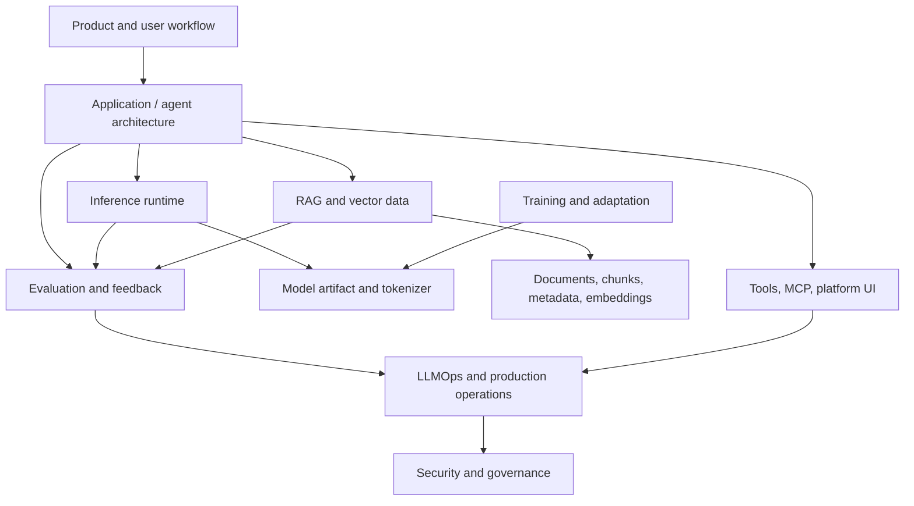

# Learn AI Solution Architecture

This course turns the repository-by-repository architecture notes into one coherent knowledge system. It is for senior developers, solution architects, staff engineers, and technical leads who need to design AI systems that survive production constraints.

The key idea: a real AI solution is not "an LLM plus an app." It is a layered system where agent orchestration, model runtime, retrieval data, adaptation strategy, evaluation, observability, tools, security, and operations all affect each other.

## What You Will Be Able To Do

After working through this course, you should be able to:

- Map an AI product idea into the right architectural layers.
- Choose between agent loops, workflow graphs, multi-agent systems, and retrieval engines.
- Pick an inference runtime based on latency, throughput, memory, quantization, deployment, and compatibility constraints.
- Decide whether to use prompting, RAG, adapters, fine-tuning, or distributed training.
- Design a vector data plane with ingestion, search, filters, tenancy, durability, and failure recovery.
- Add tracing, evaluation, feedback, lineage, and prompt/model governance.
- Govern tool execution, MCP servers, self-hosted UI gateways, and admin surfaces.
- Run a production readiness review that covers security, observability, failure modes, and operational ownership.

## The Knowledge Model



Architecture work happens at the boundaries:

- **Application to runtime**: Can the app tolerate streaming, batching, retries, backpressure, and model-specific prompt formats?
- **Application to retrieval**: Does the orchestration layer know when retrieval is required, how to cite evidence, and how to detect low-confidence context?
- **Runtime to model artifact**: Can the serving layer load, quantize, shard, schedule, and monitor the chosen model?
- **Training to serving**: Are adapters, checkpoints, tokenizer changes, and compatibility constraints controlled?
- **Application to observability**: Are traces, tool calls, retrieval spans, model outputs, scores, and user feedback captured as one lineage?
- **Tools to governance**: Are permissions, audit logs, sandboxing, secrets, and allowed actions explicit?

## Course Structure

| Page | Purpose |
| --- | --- |
| [Curriculum](./curriculum.md) | Twelve conceptual lessons that build a complete mental model. |
| [Projects](./projects.md) | Six hands-on architecture projects, ending in a capstone. |
| [Repository atlas](./reference-atlas.md) | A comparison map for all 17 repositories and their roles. |
| [Glossary](./glossary.md) | Shared vocabulary for architecture reviews and design discussions. |

## Source Deep Dives

The underlying reference notes live in [`repo-architecture-docs`](../../../repo-architecture-docs/README.md). Each repository has an English and Vietnamese architecture document with source tree maps, diagrams, extension points, security risks, operational guidance, failure modes, production readiness checklists, and glossary entries.

Use this course layer when you need the end-to-end system view. Use the source deep dives when you need implementation-level repository detail.

## Domain Map

| Domain | Deep-Dive Docs | Architecture Responsibility |
| --- | --- | --- |
| Agent applications | [Group 01](../../../repo-architecture-docs/01-ai-app-agent-architecture/) | Planning, tool use, workflow control, memory, human escalation, multi-agent coordination |
| Inference serving | [Group 02](../../../repo-architecture-docs/02-model-serving-inference/) | Loading, scheduling, batching, quantization, local/distributed serving, token streaming |
| Training and adaptation | [Group 03](../../../repo-architecture-docs/03-fine-tuning-training/) | Adapter strategy, optimizer state, distributed scaling, checkpoint governance |
| RAG and vector data | [Group 04](../../../repo-architecture-docs/04-rag-vector-database/) | Embeddings, indexing, metadata, tenancy, durability, hybrid retrieval |
| LLMOps and evaluation | [Group 05](../../../repo-architecture-docs/05-observability-evaluation-llmops/) | Tracing, evaluation, experiment tracking, feedback, lineage, model/prompt governance |
| Tooling and platform | [Group 06](../../../repo-architecture-docs/06-tooling-mcp-ai-platform/) | MCP servers, tool gateways, self-hosted chat UI, admin controls, provider routing |

## How To Study

1. Start with the [curriculum](./curriculum.md) and read the lesson summaries in order.
2. For each lesson, open the matching repository deep dives and inspect the diagrams.
3. Capture decisions in a design log: selected layer, alternatives rejected, failure modes, validation plan.
4. Run the matching project from [projects](./projects.md).
5. Return to the [repository atlas](./reference-atlas.md) whenever you need to compare tools.
6. Finish with the capstone production readiness review.

## The Central Pattern

```text
AI SOLUTION ARCHITECTURE
========================
User workflow
  -> AI application boundary
  -> agent / workflow / retrieval decisions
  -> model runtime and data plane
  -> evaluation and feedback loop
  -> operations and governance

The model supplies capability.
The architecture supplies reliability.
The evaluation loop supplies evidence.
The governance layer supplies control.
```

## What This Course Is Not

This is not a prompt engineering checklist, a benchmark leaderboard, or a catalog of every AI library. It is an architecture course built from real repository structures. The expected output is better design judgment: knowing which layer owns which problem, which trade-off matters, and which production failure should be rehearsed before launch.
