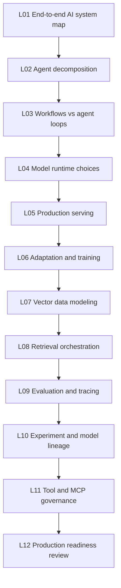
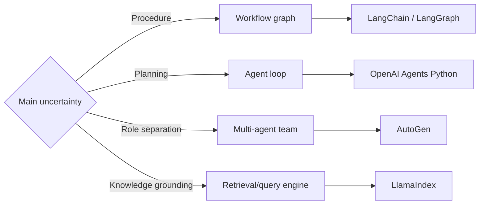
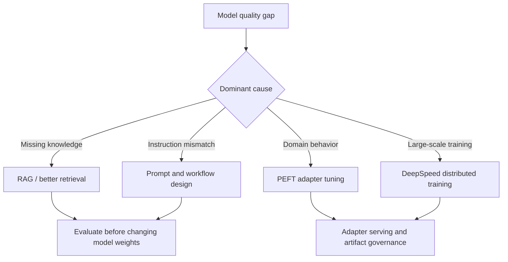
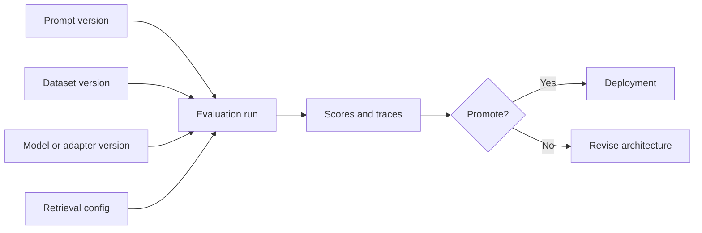

# Curriculum

The curriculum has twelve lessons across six phases. Each lesson asks one architecture question and points to the repositories that make the answer concrete.

## Curriculum Map

## Phase 1: Application And Agent Architecture

### L01: What Does An AI Solution Architecture Contain?

An AI solution architecture contains the user workflow, the application/agent control layer, model runtime, data/retrieval plane, evaluation loop, operations, and governance. The mistake to avoid is treating the LLM as the system. The LLM is one capability provider inside a larger architecture.

Primary repositories: OpenAI Agents Python, LangChain, LlamaIndex, AutoGen, Open WebUI.

Architecture output: draw an end-to-end system context diagram and mark which layer owns user state, tool execution, model calls, retrieval, traces, and human escalation.

### L02: How Should Agent Applications Be Decomposed?

Agent frameworks split responsibilities differently. OpenAI Agents Python emphasizes agents, handoffs, tools, guardrails, and tracing. LangChain separates model interfaces, chains, tools, retrievers, and LangGraph workflows. AutoGen layers Core, AgentChat, extensions, runtime, and multi-agent teams. LlamaIndex centers data-aware agents, indices, query engines, and workflow orchestration.

Architecture output: choose the primary control model: single agent loop, deterministic workflow, multi-agent team, retrieval-first engine, or hybrid.

### L03: When Do You Choose Workflows, Agents, Or Teams?

Use deterministic workflows when the process is auditable and repeatable. Use agent loops when task planning must adapt at runtime. Use multi-agent teams when roles need separate memory, tools, policies, or execution contexts. Use retrieval engines when the main risk is grounding, evidence selection, or data access.

## Phase 2: Model Serving And Runtime

### L04: How Do Model Runtimes Change Architecture Decisions?

Transformers is the compatibility and model API backbone. vLLM is optimized for high-throughput serving with scheduling and KV-cache efficiency. llama.cpp is optimized for local, edge, CPU/GPU hybrid, and quantized inference. The runtime affects prompt format, tokenizer compatibility, latency, throughput, memory footprint, observability, and rollout strategy.

Architecture output: create a runtime decision table with constraints for latency, throughput, memory, deployment environment, supported model formats, streaming behavior, and operational tooling.

### L05: What Makes Serving Production-Grade?

Production serving needs admission control, batching behavior, streaming semantics, capacity planning, health checks, model artifact provenance, rollback, autoscaling, metrics, and incident playbooks. A serving endpoint is not production-ready just because it returns tokens.

Primary repositories: vLLM, llama.cpp, Transformers, Open WebUI.

## Phase 3: Training And Adaptation

### L06: When Should You Fine-Tune, Adapt, Or Avoid Training?

Start with prompting and retrieval when the problem is context or instruction clarity. Use PEFT adapters when you need task/domain adaptation without owning full-model training cost. Use DeepSpeed when distributed training, optimizer sharding, checkpointing, and memory efficiency become central. Avoid training when data quality, evaluation, or deployment governance is not ready.

## Phase 4: RAG And Vector Data

### L07: How Should RAG Data Be Modeled And Operated?

RAG design is data architecture. You must decide chunking, embedding model, metadata schema, collection layout, tenant boundaries, durability, indexing strategy, hybrid search, and deletion/update semantics. Qdrant emphasizes vector search, payload filtering, sharding, segments, WAL, and distributed operation. Chroma emphasizes developer-friendly local/server modes, collection APIs, embedding functions, and evolving distributed components.

Architecture output: create a retrieval data contract: document IDs, chunk IDs, metadata, embedding version, access controls, freshness policy, and query filters.

### L08: How Do Retrieval And Agent Orchestration Interact?

Retrieval can be a pre-step, a tool, a query engine, a memory mechanism, or a routing decision. The orchestrator must know when to retrieve, how to cite, how to merge retrieved evidence, and when to reject low-quality context.

## Phase 5: Observability, Evaluation, And LLMOps

### L09: What Should Be Traced, Scored, And Evaluated?

Trace the full path: user input, planner decisions, tool calls, retrieval spans, model request/response, safety decisions, output, score, feedback, and cost. Langfuse and Phoenix focus on LLM traces, datasets, scores, annotations, and evaluation workflows. TruLens focuses on feedback functions, groundedness, relevance, and application evaluation. MLflow provides experiment tracking, model registry, artifacts, and broader ML lifecycle integration.

### L10: How Do Experiment Lineage And Model Lifecycle Fit Into LLMOps?

LLMOps connects prompts, datasets, model versions, retrieval data, evaluation results, and deployment events. Without lineage, quality regressions become guesswork. With lineage, a team can compare prompt changes, model changes, retrieval changes, and fine-tuned artifacts as controlled system variants.

## Phase 6: Tools, Platform, Governance

### L11: How Should Tools And MCP Servers Be Governed?

Tools turn language output into side effects. MCP servers and platform gateways make those side effects reusable, but they also create permission, audit, sandbox, credential, and data exfiltration risks. Tool design must include input schema, allowed operations, error handling, rate limits, user confirmation, logging, and rollback strategy.

Primary repositories: MCP servers, Open WebUI, AutoGen, OpenAI Agents Python.

### L12: What Does Production Readiness Review Look Like?

Review the full system, not a single library. The checklist should cover ownership, runtime capacity, cost, security, data governance, retrieval correctness, model artifact provenance, evaluation gates, observability, disaster recovery, and rollback.

## Final Review Questions

- Which layer owns the core product risk?
- Which decision is reversible and which is expensive to change?
- Where does untrusted input enter the system?
- What is the measurable definition of answer quality?
- Which traces prove that the system behaved correctly?
- Which failure mode is most likely to trigger an incident?
- What must be true before a model, adapter, prompt, or retrieval change can be promoted?
