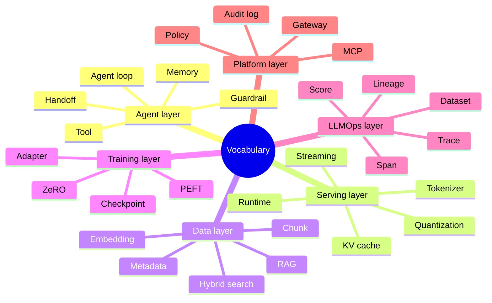

# Glossary

This glossary normalizes vocabulary across agent frameworks, serving runtimes, vector databases, training libraries, and LLMOps tools.

| Term | Meaning |
| --- | --- |
| Agent | A runtime entity that chooses actions, calls tools, manages context, and produces outputs. |
| Agent loop | A repeated cycle of observe, plan, act, inspect result, and continue or stop. |
| Workflow graph | A structured flow of nodes and edges, often more deterministic than an agent loop. |
| Tool | A callable capability exposed to a model or agent, usually with a schema and side effects. |
| Handoff | Transfer of control from one agent or role to another. |
| Guardrail | A policy or validation layer that blocks, routes, or modifies unsafe or invalid behavior. |
| Memory | Persistent or session-level state used by an agent or application. |
| RAG | Retrieval-augmented generation: retrieve external context before or during generation. |
| Embedding | A vector representation of text, image, or other data used for similarity search. |
| Chunk | A document segment indexed for retrieval. |
| Vector database | Storage and query system for embeddings plus metadata. |
| Hybrid search | Retrieval that combines vector similarity with lexical or structured filtering. |
| Payload / metadata | Non-vector fields used for filtering, tenancy, access control, or ranking. |
| Inference runtime | Software that loads a model and executes generation or prediction. |
| Token streaming | Incremental delivery of generated tokens to the caller. |
| KV cache | Cached attention keys and values used to speed autoregressive decoding. |
| Quantization | Reducing model numeric precision to save memory or improve speed. |
| Adapter | A small trainable module attached to a base model for task/domain adaptation. |
| PEFT | Parameter-efficient fine-tuning, including LoRA-style adapter methods. |
| ZeRO | DeepSpeed optimization family that partitions optimizer, gradients, and parameters. |
| Checkpoint | Saved model/training state used for recovery or deployment. |
| Trace | Structured record of an AI interaction, including spans for model calls, tools, retrieval, and scores. |
| Span | One timed operation inside a trace. |
| Evaluation dataset | A set of examples used to measure quality or regressions. |
| Feedback function | A scoring function that measures properties such as groundedness or relevance. |
| Lineage | Provenance chain connecting dataset, prompt, model, adapter, retrieval config, run, and deployment. |
| MCP | Model Context Protocol, a standard interface for connecting models/agents to tools and resources. |
| Gateway | A layer that routes requests to providers, tools, models, or policies. |
| Production readiness | Evidence that a system is safe, observable, governable, scalable, and recoverable enough to operate. |

## Vocabulary By Layer

## Terms That Are Often Confused

| Pair | Distinction |
| --- | --- |
| Agent vs workflow | Agents choose actions dynamically; workflows encode more explicit control flow. |
| RAG vs fine-tuning | RAG changes context at runtime; fine-tuning changes model behavior through training. |
| Trace vs log | A trace preserves structured causality across spans; a log is usually an event stream. |
| Evaluation vs monitoring | Evaluation measures quality against examples or criteria; monitoring watches runtime health and drift. |
| Adapter vs checkpoint | An adapter is a small learned module; a checkpoint may contain full model/training state. |
| Vector search vs hybrid search | Vector search uses embedding similarity; hybrid search mixes vector, lexical, and structured signals. |
| Tool server vs gateway | A tool server exposes actions/resources; a gateway routes and governs access to models/tools/providers. |
