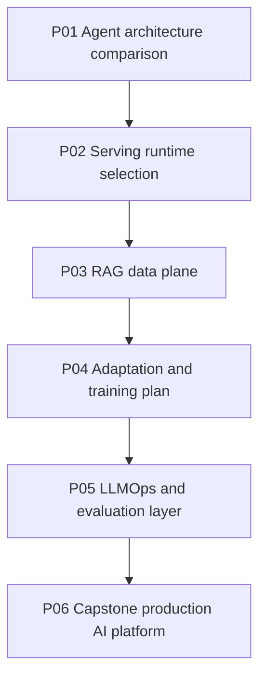
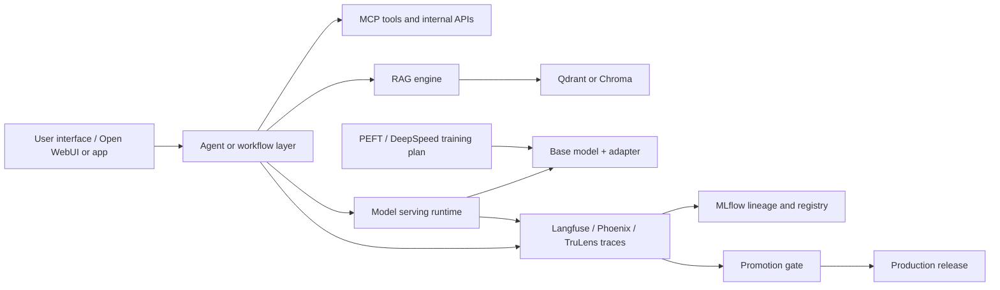

# Projects

The projects convert the curriculum into architecture artifacts. Each project should produce diagrams, a decision log, a risk register, and a verification plan.

## Project Progression

## P01: Agent Architecture Comparison

Build a design comparison for the same assistant use case across OpenAI Agents Python, LangChain/LangGraph, AutoGen, and LlamaIndex.

Deliverables:

- System context diagram.
- Agent/workflow/team comparison matrix.
- Tool and memory boundary map.
- Human escalation policy.
- Failure modes and test plan.

Core decision: choose whether the product should be primarily an agent loop, workflow graph, multi-agent team, retrieval engine, or hybrid.

## P02: Serving Runtime Selection

Design the serving layer for the chosen application. Compare Transformers, vLLM, llama.cpp, and a UI gateway such as Open WebUI.

Deliverables:

- Runtime decision table.
- Capacity assumptions: QPS, token throughput, context length, concurrency, latency SLO.
- Model artifact plan: format, tokenizer, quantization, adapter compatibility, rollback.
- Health check and observability plan.

Core decision: choose the runtime that matches the deployment environment and traffic pattern.

## P03: RAG Data Plane

Design retrieval using Qdrant or Chroma. Define ingestion, chunking, embedding versioning, collection layout, metadata filters, deletion/update semantics, and query routing.

Deliverables:

- Data contract for document, chunk, embedding, metadata, tenant, and access policy.
- Ingestion lifecycle diagram.
- Query lifecycle diagram.
- Vector DB comparison: Qdrant vs Chroma.
- Retrieval evaluation plan.

Core decision: choose the vector store and operating mode that fit durability, scale, developer velocity, and governance needs.

## P04: Adaptation And Training Plan

Decide if the product needs training. Compare prompting, retrieval, PEFT adapters, and DeepSpeed distributed training.

Deliverables:

- Training decision tree.
- Dataset readiness checklist.
- Adapter artifact policy.
- Distributed training risk map.
- Serving handoff checklist.

Core decision: decide whether the quality gap is data, orchestration, retrieval, adapter tuning, or full training.

## P05: LLMOps And Evaluation Layer

Design tracing, scoring, feedback, datasets, experiment lineage, and promotion gates using Langfuse, Phoenix, MLflow, and TruLens.

Deliverables:

- Trace schema covering user input, retrieval, tools, model calls, scores, and feedback.
- Evaluation dataset plan.
- Promotion gate for prompts, models, adapters, and retrieval configs.
- Incident review workflow.

Core decision: define what evidence is required before the system can be called better.

## P06: Capstone Production AI Platform

Design an end-to-end AI solution using all six layers. The capstone can be a customer support assistant, internal knowledge copilot, coding assistant, research assistant, or operations analyst.

Deliverables:

- End-to-end architecture diagram.
- Repository-to-layer mapping.
- Decision log with alternatives rejected.
- Security and governance model.
- Production readiness checklist.
- Failure rehearsal plan.
- Rollback strategy.

## Review Rubric

| Area | Pass Criteria |
| --- | --- |
| Layering | Each layer has a clear owner and boundary. |
| Runtime | Serving choice matches capacity, latency, memory, and deployment constraints. |
| Data | RAG data contract includes versioning, tenancy, deletion, and access policy. |
| Evaluation | Quality is measured with datasets, traces, scores, and promotion gates. |
| Security | Tool execution, secrets, auth, data access, and audit logging are explicit. |
| Operations | Health checks, incidents, rollback, cost, and ownership are defined. |
| Evidence | Every architectural claim links to a repository deep dive or design artifact. |
