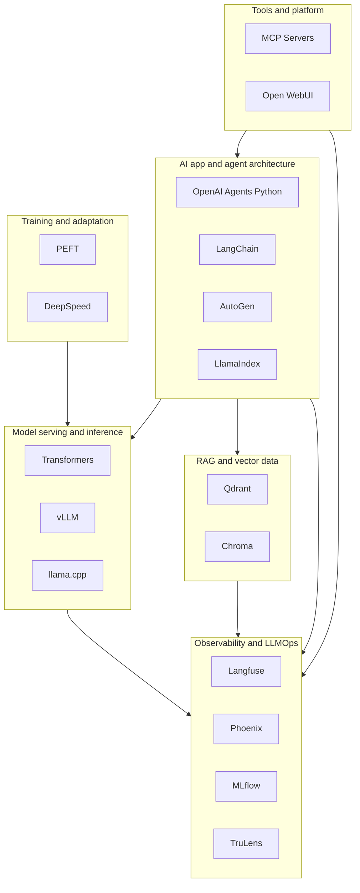
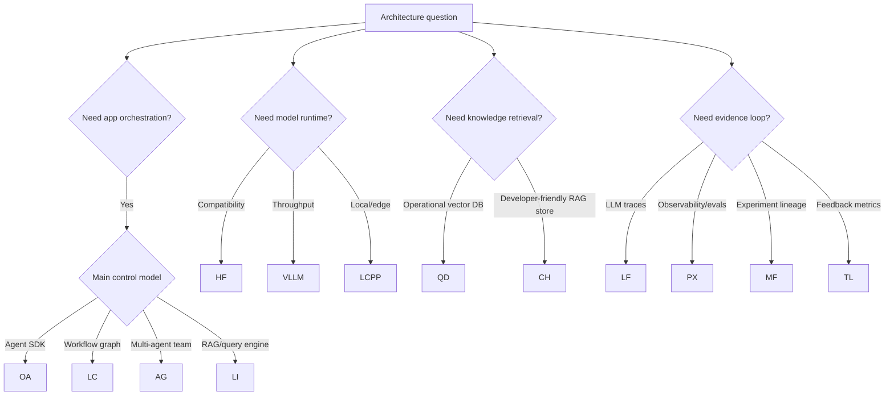

# Repository Atlas

Use this atlas when selecting libraries or explaining how the 17 repositories fit into a complete AI architecture.

## System-Level Placement

## Repository Matrix

| Repository | Primary Role | Use When | Watch For |
| --- | --- | --- | --- |
| OpenAI Agents Python | Agent runtime with tools, handoffs, guardrails, tracing | You want a focused agent SDK with explicit handoff/tool semantics | Tool permissions, guardrail coverage, trace completeness |
| LangChain | Composable app framework and workflow ecosystem | You need chains, retrievers, tools, model abstraction, LangGraph workflows | Over-composition, unclear state boundaries, dependency sprawl |
| AutoGen | Multi-agent framework with Core, AgentChat, extensions | You need role-based agent collaboration or existing AutoGen assets | Maintenance-mode implications, code execution risk, extension governance |
| LlamaIndex | Data-centric agent and retrieval framework | Knowledge ingestion, indices, query engines, RAG workflows | Chunking quality, index freshness, retrieval confidence |
| Transformers | Model API and compatibility backbone | Model experimentation, tokenizer/model loading, pipelines, training utilities | Runtime performance, artifact trust, remote code, memory use |
| vLLM | High-throughput LLM serving runtime | Token throughput, concurrent serving, OpenAI-compatible endpoints | Capacity planning, scheduler behavior, model support, GPU memory |
| llama.cpp | Local and edge inference runtime | CPU/edge/local serving, quantized models, portable binaries | Quantization quality, context limits, API exposure, model conversion |
| PEFT | Parameter-efficient fine-tuning | Domain/task adaptation with adapters instead of full fine-tuning | Adapter compatibility, unsafe artifacts, evaluation before promotion |
| DeepSpeed | Distributed training optimization | Large training jobs, ZeRO, memory partitioning, checkpoint scale | Cluster reliability, optimizer state, checkpoint recovery |
| Qdrant | Vector database with strong search and operations model | Durable vector search, payload filtering, sharding, distributed operation | WAL/segment recovery, filter correctness, tenancy boundaries |
| Chroma | Developer-friendly vector database and RAG store | Local/server RAG development and Python-first workflows | Mode selection, persistence settings, distributed maturity |
| Langfuse | LLM tracing, prompt, dataset, evaluation, feedback platform | Product teams need trace and score visibility | PII retention, project isolation, ClickHouse/Postgres operations |
| Phoenix | LLM observability and evaluation | Trace analysis, datasets, annotations, evaluators | Auth, evaluator safety, trace volume, database isolation |
| MLflow | Experiment tracking, model registry, artifacts | You need ML lifecycle lineage across experiments and models | Artifact access, auth, registry policy, tracking server security |
| TruLens | Feedback functions and LLM app evaluation | You need groundedness, relevance, and app-level eval checks | Eval cost, feedback calibration, metric misuse |
| MCP Servers | Reference tool server patterns | You need tool contracts between models/clients and external systems | Least privilege, schema quality, sandboxing, audit logs |
| Open WebUI | Self-hosted AI workspace and provider gateway | You need a UI, model routing, RAG, tools, admin controls | Admin boundary, tool execution, provider secrets, CORS/auth |

## Decision Guide

## Cross-Cutting Production Risks

| Risk | Appears In | Architecture Response |
| --- | --- | --- |
| Tool side effects | Agents, AutoGen, MCP servers, Open WebUI | Use explicit schemas, approvals, audit logs, sandboxing, and least privilege. |
| Model artifact trust | Transformers, PEFT, llama.cpp, vLLM | Pin artifacts, prefer safe formats, review remote code, track provenance. |
| Retrieval drift | LlamaIndex, LangChain, Qdrant, Chroma | Version embeddings, chunks, metadata, and query configs; evaluate retrieval separately. |
| Trace and PII exposure | Langfuse, Phoenix, TruLens, MLflow | Redact inputs, define retention, isolate tenants, encrypt secrets. |
| Serving overload | vLLM, llama.cpp, Open WebUI | Add admission control, capacity metrics, scaling policy, fallback routing. |
| Training irreproducibility | PEFT, DeepSpeed, MLflow | Track dataset, seed, config, checkpoint, adapter, tokenizer, and evaluation run. |

## How To Use The Atlas In Design Reviews

1. Start from the product workflow, not from a favorite library.
2. Assign each requirement to a layer.
3. Use the matrix to identify candidate repositories.
4. Check the deep-dive docs for source tree, extension points, and failure modes.
5. Document why each rejected alternative was rejected.
6. Define the evidence required to revisit the decision later.
