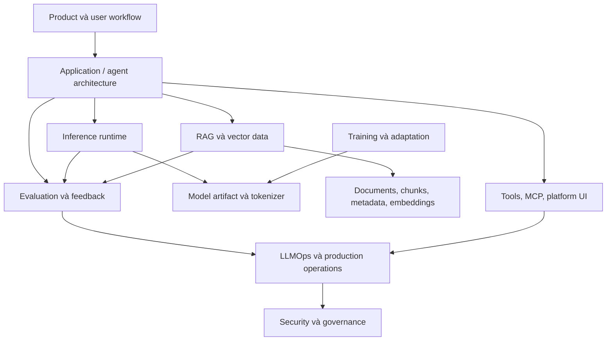

# Học AI Solution Architecture

Bộ tài liệu này biến các ghi chú kiến trúc theo từng repository thành một hệ thống kiến thức thống nhất. Đối tượng chính là senior developer, solution architect, staff engineer và technical lead cần thiết kế hệ thống AI có thể vận hành trong môi trường production.

Ý tưởng cốt lõi: một giải pháp AI thực tế không phải là "một LLM cộng với một ứng dụng". Đó là hệ thống nhiều lớp, trong đó orchestration của agent, runtime mô hình, dữ liệu retrieval, chiến lược adaptation, evaluation, observability, tool, bảo mật và vận hành đều ảnh hưởng lẫn nhau.

## Sau Khóa Này Bạn Sẽ Làm Được Gì

Sau khi đi hết bộ tài liệu, bạn nên có khả năng:

- Chuyển một ý tưởng sản phẩm AI thành các lớp kiến trúc cụ thể.
- Chọn giữa agent loop, workflow graph, multi-agent system và retrieval engine.
- Chọn inference runtime dựa trên latency, throughput, memory, quantization, deployment và compatibility.
- Quyết định khi nào dùng prompting, RAG, adapter, fine-tuning hoặc distributed training.
- Thiết kế data plane vector với ingestion, search, filter, tenancy, durability và recovery.
- Thêm tracing, evaluation, feedback, lineage và governance cho prompt/model.
- Quản trị tool execution, MCP server, self-hosted UI gateway và admin surface.
- Thực hiện production readiness review bao gồm security, observability, failure mode và ownership vận hành.

## Mô Hình Kiến Thức



Công việc kiến trúc diễn ra ở các ranh giới:

- **Application đến runtime**: ứng dụng có chịu được streaming, batching, retry, backpressure và prompt format riêng của model không?
- **Application đến retrieval**: orchestration layer có biết khi nào cần retrieve, cách cite evidence và cách phát hiện context yếu không?
- **Runtime đến model artifact**: serving layer có nạp, quantize, shard, schedule và monitor model được chọn không?
- **Training đến serving**: adapter, checkpoint, tokenizer change và compatibility constraint có được kiểm soát không?
- **Application đến observability**: trace, tool call, retrieval span, output, score và user feedback có nằm trong cùng một lineage không?
- **Tools đến governance**: permission, audit log, sandbox, secret và allowed action có rõ ràng không?

## Cấu Trúc Khóa Học

| Trang | Mục đích |
| --- | --- |
| [Chương trình học](./curriculum.md) | Mười hai bài học khái niệm để xây mental model hoàn chỉnh. |
| [Dự án](./projects.md) | Sáu dự án thực hành kiến trúc, kết thúc bằng capstone. |
| [Bản đồ repository](./reference-atlas.md) | Bản đồ so sánh 17 repository và vai trò của từng repo. |
| [Bảng thuật ngữ](./glossary.md) | Từ vựng dùng chung cho design review và thảo luận kiến trúc. |

## Tài Liệu Deep Dive Nguồn

Các ghi chú tham chiếu nằm trong [`repo-architecture-docs`](../../../repo-architecture-docs/README.md). Mỗi repository có tài liệu tiếng Anh và tiếng Việt với source tree map, diagram, extension point, rủi ro bảo mật, hướng dẫn vận hành, failure mode, production readiness checklist và glossary.

Dùng lớp course này khi bạn cần cái nhìn hệ thống end-to-end. Dùng deep dive nguồn khi bạn cần chi tiết kiến trúc ở mức repository.

## Bản Đồ Miền

| Miền | Tài liệu deep dive | Trách nhiệm kiến trúc |
| --- | --- | --- |
| Agent application | [Group 01](../../../repo-architecture-docs/01-ai-app-agent-architecture/) | Planning, tool use, workflow control, memory, human escalation, multi-agent coordination |
| Inference serving | [Group 02](../../../repo-architecture-docs/02-model-serving-inference/) | Loading, scheduling, batching, quantization, local/distributed serving, token streaming |
| Training và adaptation | [Group 03](../../../repo-architecture-docs/03-fine-tuning-training/) | Adapter strategy, optimizer state, distributed scaling, checkpoint governance |
| RAG và vector data | [Group 04](../../../repo-architecture-docs/04-rag-vector-database/) | Embedding, indexing, metadata, tenancy, durability, hybrid retrieval |
| LLMOps và evaluation | [Group 05](../../../repo-architecture-docs/05-observability-evaluation-llmops/) | Tracing, evaluation, experiment tracking, feedback, lineage, model/prompt governance |
| Tooling và platform | [Group 06](../../../repo-architecture-docs/06-tooling-mcp-ai-platform/) | MCP server, tool gateway, self-hosted chat UI, admin control, provider routing |

## Cách Học

1. Bắt đầu với [chương trình học](./curriculum.md) và đọc các bài theo thứ tự.
2. Với mỗi bài, mở deep dive repository tương ứng và xem diagram.
3. Ghi lại quyết định trong design log: lớp được chọn, phương án bị loại, failure mode, validation plan.
4. Làm dự án tương ứng trong [projects](./projects.md).
5. Quay lại [repository atlas](./reference-atlas.md) khi cần so sánh công cụ.
6. Kết thúc bằng production readiness review của capstone.

## Pattern Trung Tâm

```text
AI SOLUTION ARCHITECTURE
========================
User workflow
  -> AI application boundary
  -> agent / workflow / retrieval decisions
  -> model runtime and data plane
  -> evaluation and feedback loop
  -> operations and governance

Model tạo ra năng lực.
Kiến trúc tạo ra độ tin cậy.
Evaluation loop tạo ra bằng chứng.
Governance layer tạo ra kiểm soát.
```

## Đây Không Phải Là Gì

Đây không phải checklist prompt engineering, bảng xếp hạng benchmark hoặc catalog toàn bộ thư viện AI. Đây là khóa học kiến trúc được xây từ cấu trúc repository thật. Đầu ra mong muốn là năng lực phán đoán thiết kế tốt hơn: biết lớp nào sở hữu vấn đề nào, trade-off nào quan trọng và failure nào phải diễn tập trước khi launch.
