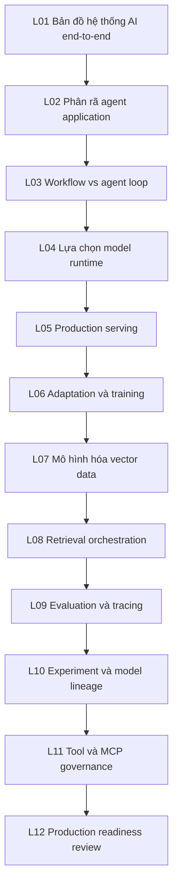
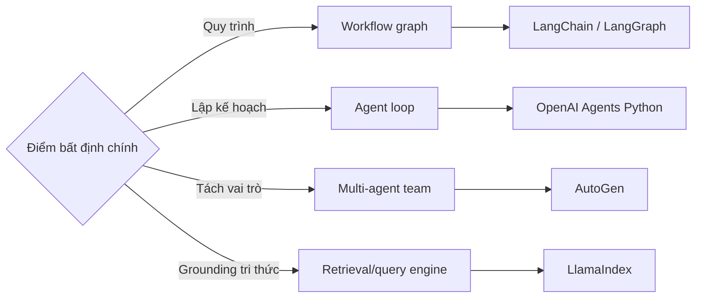
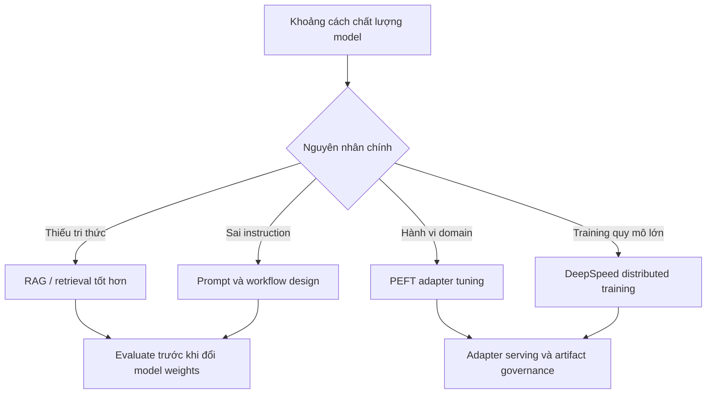
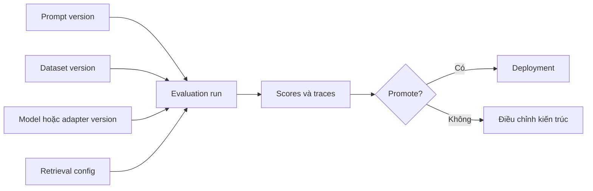

# Chương Trình Học

Chương trình gồm mười hai bài học qua sáu phase. Mỗi bài trả lời một câu hỏi kiến trúc và trỏ đến các repository làm cho câu trả lời trở nên cụ thể.

## Bản Đồ Curriculum

## Phase 1: Application Và Agent Architecture

### L01: Một AI Solution Architecture Gồm Những Gì?

AI solution architecture gồm user workflow, application/agent control layer, model runtime, data/retrieval plane, evaluation loop, operations và governance. Sai lầm cần tránh là xem LLM là toàn bộ hệ thống. LLM chỉ là một capability provider trong kiến trúc lớn hơn.

Repository chính: OpenAI Agents Python, LangChain, LlamaIndex, AutoGen, Open WebUI.

Đầu ra kiến trúc: vẽ system context diagram end-to-end và đánh dấu lớp nào sở hữu user state, tool execution, model call, retrieval, trace và human escalation.

### L02: Nên Phân Rã Agent Application Như Thế Nào?

Các framework agent chia trách nhiệm khác nhau. OpenAI Agents Python nhấn mạnh agent, handoff, tool, guardrail và tracing. LangChain tách model interface, chain, tool, retriever và LangGraph workflow. AutoGen phân lớp Core, AgentChat, extension, runtime và multi-agent team. LlamaIndex tập trung vào data-aware agent, index, query engine và workflow orchestration.

Đầu ra kiến trúc: chọn control model chính: single agent loop, deterministic workflow, multi-agent team, retrieval-first engine hoặc hybrid.

### L03: Khi Nào Chọn Workflow, Agent Hoặc Team?

Dùng deterministic workflow khi quy trình cần audit và lặp lại ổn định. Dùng agent loop khi kế hoạch phải thích nghi ở runtime. Dùng multi-agent team khi vai trò cần memory, tool, policy hoặc execution context riêng. Dùng retrieval engine khi rủi ro chính là grounding, chọn evidence hoặc truy cập dữ liệu.

## Phase 2: Model Serving Và Runtime

### L04: Model Runtime Làm Thay Đổi Quyết Định Kiến Trúc Như Thế Nào?

Transformers là nền tảng compatibility và model API. vLLM tối ưu high-throughput serving với scheduling và KV-cache hiệu quả. llama.cpp tối ưu local, edge, CPU/GPU hybrid và quantized inference. Runtime ảnh hưởng prompt format, tokenizer compatibility, latency, throughput, memory footprint, observability và rollout strategy.

Đầu ra kiến trúc: tạo runtime decision table với constraint về latency, throughput, memory, deployment environment, model format, streaming behavior và operational tooling.

### L05: Điều Gì Làm Serving Đủ Production-Grade?

Production serving cần admission control, batching behavior, streaming semantics, capacity planning, health check, model artifact provenance, rollback, autoscaling, metrics và incident playbook. Một endpoint serving không đủ production-ready chỉ vì nó trả token thành công.

Repository chính: vLLM, llama.cpp, Transformers, Open WebUI.

## Phase 3: Training Và Adaptation

### L06: Khi Nào Nên Fine-Tune, Adapt Hoặc Tránh Training?

Bắt đầu với prompting và retrieval khi vấn đề là context hoặc instruction clarity. Dùng PEFT adapter khi cần task/domain adaptation mà không muốn trả chi phí full-model training. Dùng DeepSpeed khi distributed training, optimizer sharding, checkpointing và memory efficiency trở thành trung tâm. Tránh training khi data quality, evaluation hoặc deployment governance chưa sẵn sàng.

## Phase 4: RAG Và Vector Data

### L07: Nên Mô Hình Hóa Và Vận Hành RAG Data Như Thế Nào?

RAG là data architecture. Bạn phải quyết định chunking, embedding model, metadata schema, collection layout, tenant boundary, durability, indexing strategy, hybrid search và deletion/update semantics. Qdrant nhấn mạnh vector search, payload filtering, sharding, segment, WAL và distributed operation. Chroma nhấn mạnh local/server mode thân thiện với developer, collection API, embedding function và distributed component đang phát triển.

Đầu ra kiến trúc: tạo retrieval data contract gồm document ID, chunk ID, metadata, embedding version, access control, freshness policy và query filter.

### L08: Retrieval Và Agent Orchestration Tương Tác Như Thế Nào?

Retrieval có thể là pre-step, tool, query engine, memory mechanism hoặc routing decision. Orchestrator phải biết khi nào retrieve, cite như thế nào, merge evidence ra sao và khi nào reject context chất lượng thấp.

## Phase 5: Observability, Evaluation Và LLMOps

### L09: Cần Trace, Score Và Evaluate Điều Gì?

Trace toàn bộ đường đi: user input, planner decision, tool call, retrieval span, model request/response, safety decision, output, score, feedback và cost. Langfuse và Phoenix tập trung vào LLM trace, dataset, score, annotation và evaluation workflow. TruLens tập trung vào feedback function, groundedness, relevance và application evaluation. MLflow cung cấp experiment tracking, model registry, artifact và tích hợp ML lifecycle rộng hơn.

### L10: Experiment Lineage Và Model Lifecycle Nằm Ở Đâu Trong LLMOps?

LLMOps kết nối prompt, dataset, model version, retrieval data, evaluation result và deployment event. Không có lineage, quality regression trở thành đoán mò. Có lineage, team có thể so sánh prompt change, model change, retrieval change và fine-tuned artifact như các biến thể hệ thống có kiểm soát.

## Phase 6: Tools, Platform, Governance

### L11: Nên Quản Trị Tool Và MCP Server Như Thế Nào?

Tool biến output ngôn ngữ thành side effect. MCP server và platform gateway làm các side effect đó tái sử dụng được, nhưng cũng tạo ra rủi ro permission, audit, sandbox, credential và data exfiltration. Thiết kế tool phải có input schema, allowed operation, error handling, rate limit, user confirmation, logging và rollback strategy.

Repository chính: MCP servers, Open WebUI, AutoGen, OpenAI Agents Python.

### L12: Production Readiness Review Trông Như Thế Nào?

Review toàn bộ hệ thống, không review một thư viện đơn lẻ. Checklist phải bao gồm ownership, runtime capacity, cost, security, data governance, retrieval correctness, model artifact provenance, evaluation gate, observability, disaster recovery và rollback.

## Câu Hỏi Review Cuối

- Lớp nào sở hữu rủi ro sản phẩm chính?
- Quyết định nào dễ đảo ngược và quyết định nào đắt khi thay đổi?
- Untrusted input đi vào hệ thống ở đâu?
- Định nghĩa đo được của answer quality là gì?
- Trace nào chứng minh hệ thống đã hành xử đúng?
- Failure mode nào dễ gây incident nhất?
- Điều gì phải đúng trước khi promote model, adapter, prompt hoặc retrieval config?
