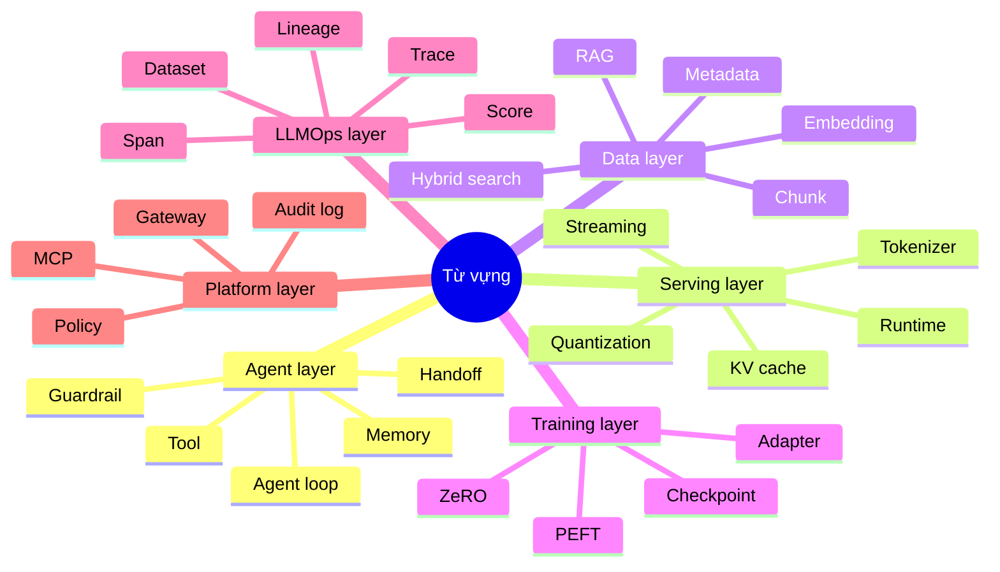

# Bảng Thuật Ngữ

Glossary này chuẩn hóa từ vựng giữa agent framework, serving runtime, vector database, training library và LLMOps tool.

| Thuật ngữ | Ý nghĩa |
| --- | --- |
| Agent | Thực thể runtime chọn hành động, gọi tool, quản lý context và tạo output. |
| Agent loop | Chu trình lặp observe, plan, act, kiểm tra kết quả, rồi tiếp tục hoặc dừng. |
| Workflow graph | Luồng node/edge có cấu trúc, thường deterministic hơn agent loop. |
| Tool | Capability callable được expose cho model hoặc agent, thường có schema và side effect. |
| Handoff | Chuyển quyền điều khiển từ agent hoặc vai trò này sang agent/vai trò khác. |
| Guardrail | Lớp policy hoặc validation để block, route hoặc sửa hành vi không an toàn/không hợp lệ. |
| Memory | State ở mức session hoặc persistent được agent/application dùng. |
| RAG | Retrieval-augmented generation: retrieve context ngoài trước hoặc trong lúc generate. |
| Embedding | Vector biểu diễn text, image hoặc dữ liệu khác để similarity search. |
| Chunk | Đoạn tài liệu được index cho retrieval. |
| Vector database | Hệ thống lưu trữ và query embedding kèm metadata. |
| Hybrid search | Retrieval kết hợp vector similarity với lexical hoặc structured filtering. |
| Payload / metadata | Trường không phải vector dùng cho filtering, tenancy, access control hoặc ranking. |
| Inference runtime | Phần mềm nạp model và thực thi generation/prediction. |
| Token streaming | Trả token sinh ra theo từng phần về caller. |
| KV cache | Cache attention key/value để tăng tốc autoregressive decoding. |
| Quantization | Giảm độ chính xác số của model để tiết kiệm memory hoặc tăng tốc. |
| Adapter | Module trainable nhỏ gắn vào base model để adaptation theo task/domain. |
| PEFT | Parameter-efficient fine-tuning, gồm các phương pháp adapter kiểu LoRA. |
| ZeRO | Nhóm tối ưu DeepSpeed chia optimizer, gradient và parameter. |
| Checkpoint | Model/training state được lưu để recovery hoặc deployment. |
| Trace | Bản ghi có cấu trúc của interaction AI, gồm span cho model call, tool, retrieval và score. |
| Span | Một operation có thời lượng trong trace. |
| Evaluation dataset | Bộ example dùng để đo chất lượng hoặc regression. |
| Feedback function | Hàm scoring đo các thuộc tính như groundedness hoặc relevance. |
| Lineage | Chuỗi provenance nối dataset, prompt, model, adapter, retrieval config, run và deployment. |
| MCP | Model Context Protocol, giao diện chuẩn kết nối model/agent với tool và resource. |
| Gateway | Lớp route request tới provider, tool, model hoặc policy. |
| Production readiness | Bằng chứng rằng hệ thống đủ an toàn, observable, governable, scalable và recoverable để vận hành. |

## Từ Vựng Theo Layer

## Các Cặp Thuật Ngữ Hay Bị Nhầm

| Cặp | Khác biệt |
| --- | --- |
| Agent vs workflow | Agent chọn hành động động; workflow encode control flow rõ hơn. |
| RAG vs fine-tuning | RAG đổi context ở runtime; fine-tuning đổi hành vi model bằng training. |
| Trace vs log | Trace giữ quan hệ nhân quả có cấu trúc qua các span; log thường là event stream. |
| Evaluation vs monitoring | Evaluation đo quality theo example/criteria; monitoring theo dõi health và drift ở runtime. |
| Adapter vs checkpoint | Adapter là module học nhỏ; checkpoint có thể chứa toàn bộ model/training state. |
| Vector search vs hybrid search | Vector search dùng embedding similarity; hybrid search trộn vector, lexical và structured signal. |
| Tool server vs gateway | Tool server expose action/resource; gateway route và govern access tới model/tool/provider. |
