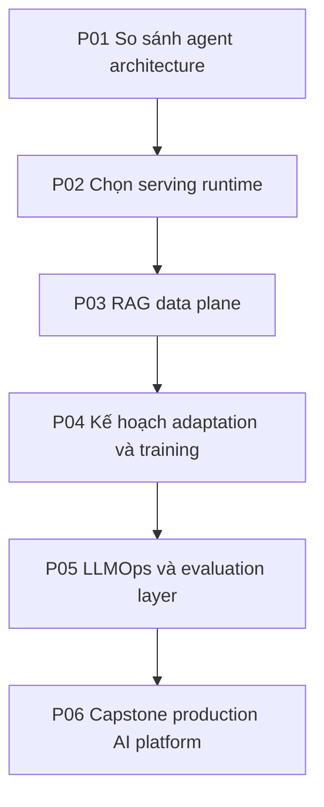
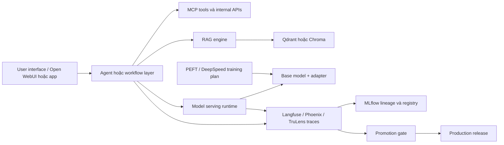

# Dự Án Thực Hành

Các dự án biến curriculum thành artifact kiến trúc. Mỗi dự án nên tạo diagram, decision log, risk register và verification plan.

Hãy dùng các template trong [AI Solution Architecture Toolkit](../../../templates/README.md) khi làm từng dự án.

## Tiến Trình Dự Án

## P01: So Sánh Agent Architecture

Thiết kế cùng một use case assistant trên OpenAI Agents Python, LangChain/LangGraph, AutoGen và LlamaIndex.

Deliverable:

- System context diagram.
- Ma trận so sánh agent/workflow/team.
- Bản đồ boundary cho tool và memory.
- Chính sách human escalation.
- Failure mode và test plan.

Quyết định chính: sản phẩm nên dựa chủ yếu trên agent loop, workflow graph, multi-agent team, retrieval engine hay hybrid.

## P02: Chọn Serving Runtime

Thiết kế serving layer cho ứng dụng đã chọn. So sánh Transformers, vLLM, llama.cpp và UI gateway như Open WebUI.

Deliverable:

- Runtime decision table.
- Giả định capacity: QPS, token throughput, context length, concurrency, latency SLO.
- Kế hoạch model artifact: format, tokenizer, quantization, adapter compatibility, rollback.
- Kế hoạch health check và observability.

Quyết định chính: chọn runtime khớp với deployment environment và traffic pattern.

## P03: RAG Data Plane

Thiết kế retrieval bằng Qdrant hoặc Chroma. Định nghĩa ingestion, chunking, embedding versioning, collection layout, metadata filter, deletion/update semantics và query routing.

Deliverable:

- Data contract cho document, chunk, embedding, metadata, tenant và access policy.
- Ingestion lifecycle diagram.
- Query lifecycle diagram.
- So sánh vector DB: Qdrant vs Chroma.
- Retrieval evaluation plan.

Quyết định chính: chọn vector store và operating mode phù hợp với durability, scale, developer velocity và governance.

## P04: Kế Hoạch Adaptation Và Training

Quyết định sản phẩm có cần training không. So sánh prompting, retrieval, PEFT adapter và DeepSpeed distributed training.

Deliverable:

- Training decision tree.
- Dataset readiness checklist.
- Adapter artifact policy.
- Distributed training risk map.
- Serving handoff checklist.

Quyết định chính: khoảng cách chất lượng đến từ data, orchestration, retrieval, adapter tuning hay full training.

## P05: LLMOps Và Evaluation Layer

Thiết kế tracing, scoring, feedback, dataset, experiment lineage và promotion gate bằng Langfuse, Phoenix, MLflow và TruLens.

Deliverable:

- Trace schema gồm user input, retrieval, tool, model call, score và feedback.
- Kế hoạch evaluation dataset.
- Promotion gate cho prompt, model, adapter và retrieval config.
- Workflow incident review.

Quyết định chính: định nghĩa bằng chứng nào cần có trước khi nói hệ thống tốt hơn.

## P06: Capstone Production AI Platform

Thiết kế một giải pháp AI end-to-end dùng cả sáu lớp. Capstone khuyến nghị là [Enterprise Knowledge Copilot for Architecture Review](../../../capstone/README.md), vì bài này buộc bạn xử lý retrieval, tool governance, evaluation, traceability và production readiness trong cùng một bối cảnh.

Deliverable:

- End-to-end architecture diagram.
- Mapping repository vào từng layer.
- Decision log với các phương án bị loại.
- Security và governance model.
- Production readiness checklist.
- Failure rehearsal plan.
- Rollback strategy.

## Rubric Review

| Khu vực | Tiêu chí đạt |
| --- | --- |
| Layering | Mỗi layer có owner và boundary rõ. |
| Runtime | Serving choice khớp capacity, latency, memory và deployment constraint. |
| Data | RAG data contract có versioning, tenancy, deletion và access policy. |
| Evaluation | Quality được đo bằng dataset, trace, score và promotion gate. |
| Security | Tool execution, secret, auth, data access và audit logging rõ ràng. |
| Operations | Health check, incident, rollback, cost và ownership được định nghĩa. |
| Evidence | Mỗi claim kiến trúc link được tới deep dive repo hoặc design artifact. |
