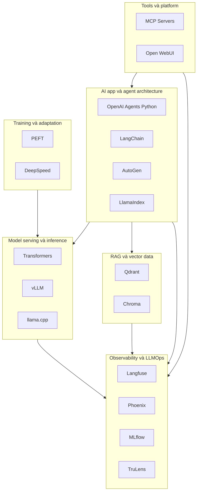
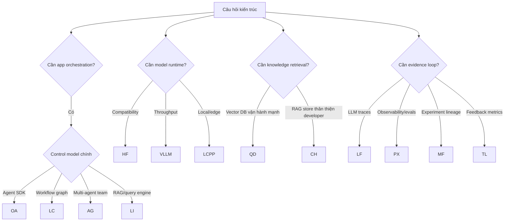

# Bản Đồ Repository

Dùng atlas này khi chọn thư viện hoặc giải thích 17 repository khớp vào kiến trúc AI hoàn chỉnh như thế nào.

## Vị Trí Ở Cấp Hệ Thống

## Ma Trận Repository

| Repository | Vai trò chính | Dùng khi | Cần chú ý |
| --- | --- | --- | --- |
| OpenAI Agents Python | Agent runtime với tool, handoff, guardrail, tracing | Bạn cần agent SDK tập trung với semantics rõ cho handoff/tool | Permission tool, độ phủ guardrail, trace completeness |
| LangChain | Framework composable cho app và workflow | Bạn cần chain, retriever, tool, model abstraction, LangGraph workflow | Over-composition, state boundary không rõ, dependency sprawl |
| AutoGen | Multi-agent framework với Core, AgentChat, extension | Bạn cần collaboration theo vai trò hoặc asset AutoGen hiện hữu | Maintenance mode, rủi ro code execution, governance extension |
| LlamaIndex | Framework data-centric cho agent và retrieval | Knowledge ingestion, index, query engine, RAG workflow | Chunking quality, index freshness, retrieval confidence |
| Transformers | Nền tảng model API và compatibility | Thử nghiệm model, nạp tokenizer/model, pipeline, training utility | Runtime performance, artifact trust, remote code, memory use |
| vLLM | Runtime high-throughput LLM serving | Token throughput, concurrent serving, OpenAI-compatible endpoint | Capacity planning, scheduler behavior, model support, GPU memory |
| llama.cpp | Runtime local và edge inference | CPU/edge/local serving, quantized model, binary portable | Quantization quality, context limit, API exposure, model conversion |
| PEFT | Parameter-efficient fine-tuning | Domain/task adaptation bằng adapter thay vì full fine-tuning | Adapter compatibility, artifact không an toàn, evaluation trước promote |
| DeepSpeed | Tối ưu distributed training | Training job lớn, ZeRO, memory partitioning, checkpoint scale | Độ tin cậy cluster, optimizer state, checkpoint recovery |
| Qdrant | Vector database có search và ops model mạnh | Vector search bền vững, payload filtering, sharding, distributed operation | WAL/segment recovery, filter correctness, tenant boundary |
| Chroma | Vector database thân thiện với developer và RAG | Local/server RAG development, workflow Python-first | Chọn mode, persistence setting, distributed maturity |
| Langfuse | LLM tracing, prompt, dataset, evaluation, feedback | Product team cần nhìn thấy trace và score | PII retention, project isolation, ClickHouse/Postgres ops |
| Phoenix | LLM observability và evaluation | Trace analysis, dataset, annotation, evaluator | Auth, evaluator safety, trace volume, database isolation |
| MLflow | Experiment tracking, model registry, artifact | Cần ML lifecycle lineage cho experiment và model | Artifact access, auth, registry policy, tracking server security |
| TruLens | Feedback function và LLM app evaluation | Cần kiểm tra groundedness, relevance và app-level eval | Eval cost, hiệu chỉnh feedback, dùng metric sai |
| MCP Servers | Pattern tham chiếu cho tool server | Cần tool contract giữa model/client và external system | Least privilege, schema quality, sandboxing, audit log |
| Open WebUI | Self-hosted AI workspace và provider gateway | Cần UI, model routing, RAG, tool, admin control | Admin boundary, tool execution, provider secret, CORS/auth |

## Hướng Dẫn Quyết Định

## Rủi Ro Production Cắt Ngang

| Rủi ro | Xuất hiện ở | Phản ứng kiến trúc |
| --- | --- | --- |
| Tool side effect | Agent, AutoGen, MCP servers, Open WebUI | Dùng schema rõ, approval, audit log, sandboxing và least privilege. |
| Model artifact trust | Transformers, PEFT, llama.cpp, vLLM | Pin artifact, ưu tiên safe format, review remote code, theo dõi provenance. |
| Retrieval drift | LlamaIndex, LangChain, Qdrant, Chroma | Version embedding, chunk, metadata và query config; evaluate retrieval riêng. |
| Trace và PII exposure | Langfuse, Phoenix, TruLens, MLflow | Redact input, định nghĩa retention, tách tenant, mã hóa secret. |
| Serving overload | vLLM, llama.cpp, Open WebUI | Thêm admission control, capacity metric, scaling policy, fallback routing. |
| Training không tái lập | PEFT, DeepSpeed, MLflow | Track dataset, seed, config, checkpoint, adapter, tokenizer và evaluation run. |

## Cách Dùng Atlas Trong Design Review

1. Bắt đầu từ product workflow, không bắt đầu từ thư viện yêu thích.
2. Gán từng requirement vào một layer.
3. Dùng ma trận để xác định repository ứng viên.
4. Kiểm tra deep dive docs để xem source tree, extension point và failure mode.
5. Ghi rõ vì sao phương án bị loại.
6. Định nghĩa bằng chứng cần có để xem lại quyết định trong tương lai.
