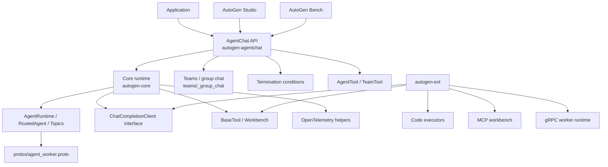
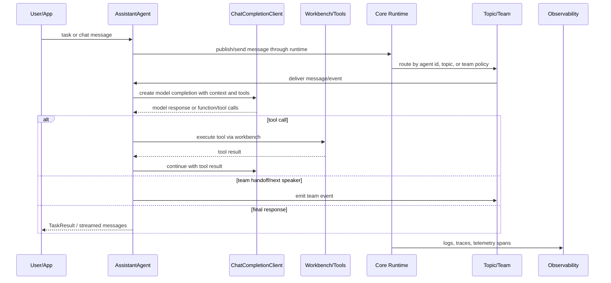
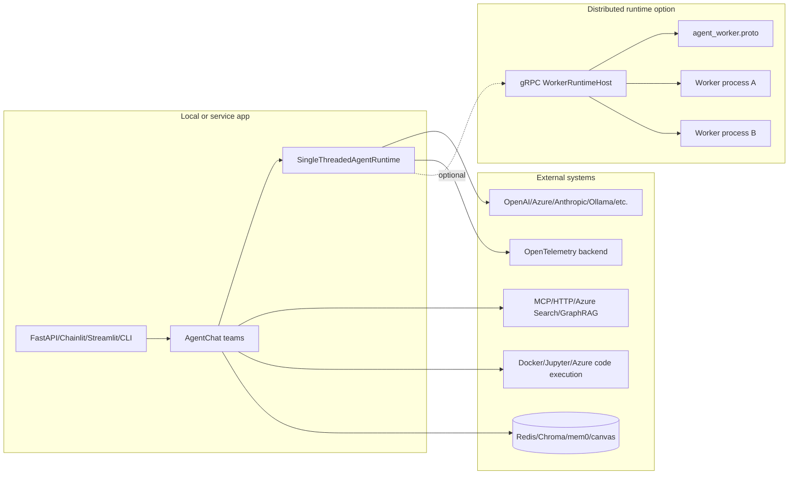
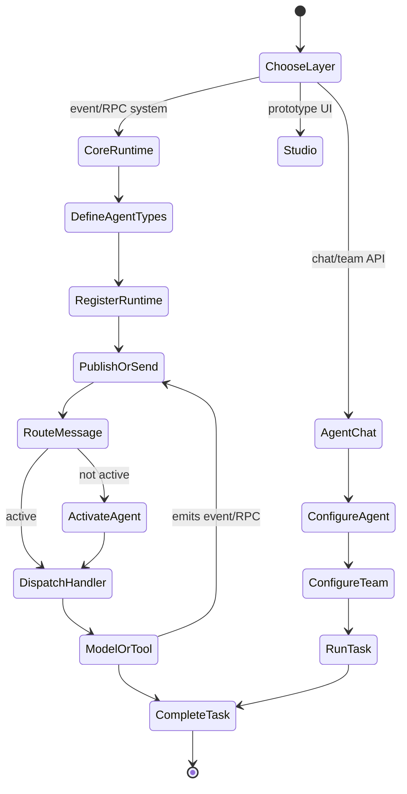
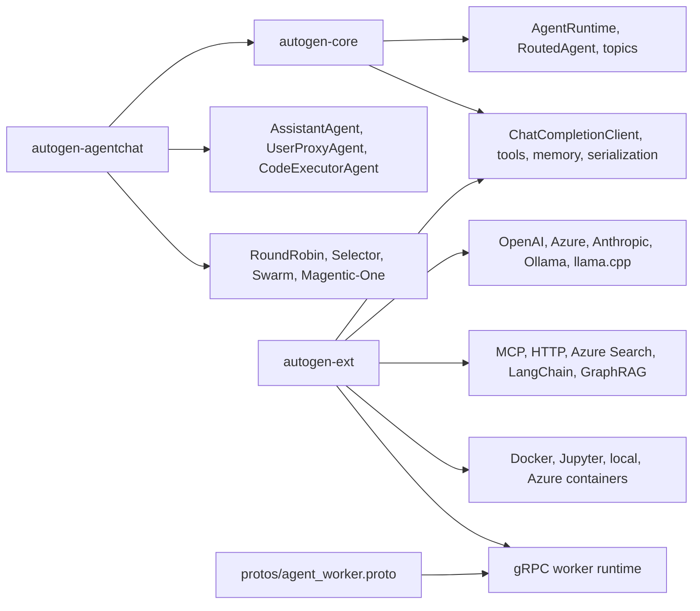
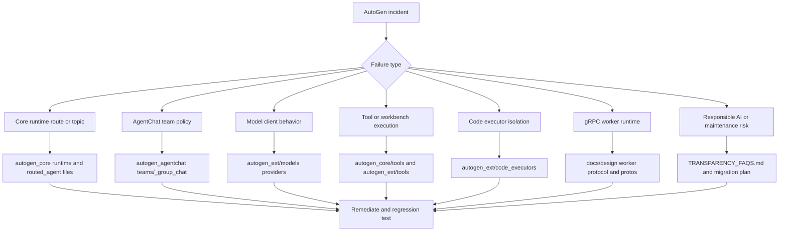
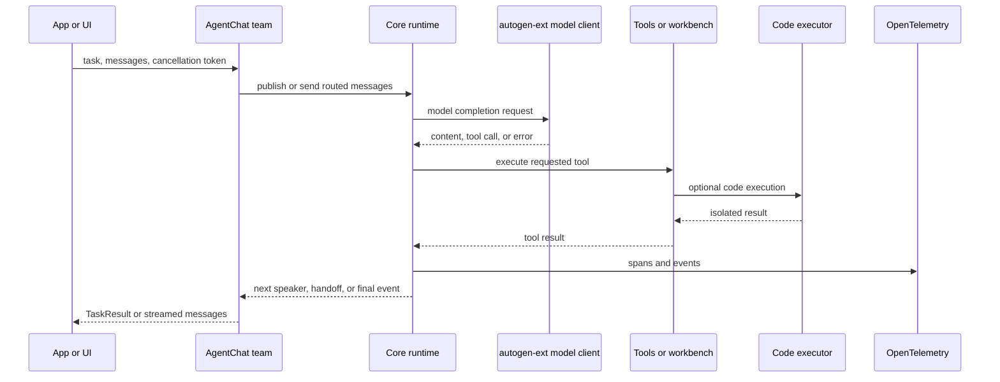

# AutoGen Architecture

## Executive Summary

AutoGen is a framework for multi-agent AI applications that can act autonomously or collaborate with humans. In this checkout, the root `README.md` is explicit that AutoGen is in maintenance mode and that new users are directed to Microsoft Agent Framework. For existing AutoGen users, the repository remains valuable because it contains the layered architecture of AutoGen: a low-level event-driven Core API, a higher-level AgentChat API, Extensions for model clients/tools/runtimes/memory/code execution, developer tools such as Studio and Bench, .NET sources, protobuf contracts, design docs, and samples.

The Python workspace in `python/pyproject.toml` includes packages under `python/packages/*`. `autogen-core`, `autogen-agentchat`, and `autogen-ext` are version `0.7.5`. `autogen-core` provides foundational interfaces and runtime implementation; `autogen-agentchat` builds agent and team chat APIs on top of core; `autogen-ext` packages integrations such as OpenAI, Azure, Anthropic, Ollama, llama.cpp, Semantic Kernel, MCP, Docker/Jupyter/local code execution, Redis/disk cache, Chroma/mem0 memory, web/file/video surfers, and gRPC runtimes.

## Problem Solved

AutoGen solves the orchestration problem for systems with multiple conversable agents. The repository supports two levels of design: a pub-sub and RPC runtime where agents receive events on topics, and an AgentChat facade where developers build assistants, user proxies, code executor agents, group chats, selectors, swarms, handoffs, and teams. It also addresses practical integration concerns: model clients, tool schemas, workbenches, code execution, distributed workers, persistence-oriented memory, UI samples, benchmark tooling, and responsible AI guidance.

## AI Stack Role

| Layer | Repository role | Grounding in repo |
| --- | --- | --- |
| Event runtime | Agent IDs, topics, subscriptions, routed agents, single-threaded runtime | `python/packages/autogen-core/src/autogen_core/` |
| Chat abstraction | AssistantAgent, BaseChatAgent, teams, termination conditions, UI console | `python/packages/autogen-agentchat/src/autogen_agentchat/` |
| Integrations | Model clients, tools, code executors, MCP, memory, gRPC runtime | `python/packages/autogen-ext/src/autogen_ext/` |
| Distributed contracts | Worker protocol and CloudEvent/protobuf contracts | `docs/design/`, `protos/`, `autogen-ext/runtimes/grpc/` |
| Responsible operation | Security policy, transparency FAQ, tests, benchmark package | `SECURITY.md`, `TRANSPARENCY_FAQS.md`, `agbench`, package tests |

## Source Tree Map

```text
autogen/
  README.md                         # project overview, maintenance mode, quickstarts
  TRANSPARENCY_FAQS.md              # responsible AI risks and operational guidance
  SECURITY.md                       # vulnerability reporting
  docs/design/                      # programming model, topics, worker protocol, services
  protos/                           # cloudevent.proto and agent_worker.proto
  dotnet/                           # .NET implementation and documentation
  python/
    pyproject.toml                  # uv workspace, poe tasks, lint/type/test config
    samples/                        # FastAPI, Chainlit, Streamlit, gRPC, group chat samples
    packages/
      autogen-core/                 # event runtime, tools, model client interfaces, telemetry
      autogen-agentchat/            # chat agents, teams, conditions, UI
      autogen-ext/                  # providers, code execution, MCP, memory, runtimes
      autogen-studio/               # no-code UI/prototyping tool
      agbench/                      # benchmark/evaluation tooling
      pyautogen/                    # compatibility package
      autogen-test-utils/           # test helpers
      component-schema-gen/         # schema generation utility
      magentic-one-cli/             # Magentic-One CLI package
```

## Component Diagram



## Core Concepts

- Event-driven programming model: `docs/design/01 - Programming Model.md` describes publish-subscribe agents receiving CloudEvents, publishing events, calling models/tools/memory, and using orchestrator agents when workflows need control logic.
- Topics and subscriptions: `docs/design/02 - Topics.md` defines identifiers, subscriptions, agent instance creation, message types, and well-known topic types.
- Worker protocol: `docs/design/03 - Agent Worker Protocol.md` describes service and worker processes, worker registration, agent placement, activation on events or RPC requests, response routing, timeout behavior, and termination.
- `AgentRuntime`: protocol in `autogen_core/_agent_runtime.py`; `SingleThreadedAgentRuntime` in `_single_threaded_agent_runtime.py` provides local runtime mechanics.
- `RoutedAgent`: class and decorators in `_routed_agent.py` map message handlers, event handlers, and RPC handlers to typed messages.
- `ChatCompletionClient`: model-client interface in `autogen_core/models/_model_client.py`, implemented by extension clients such as `OpenAIChatCompletionClient`.
- `AssistantAgent`: high-level chat agent in `autogen_agentchat/agents/_assistant_agent.py`.
- Teams: `autogen_agentchat/teams/_group_chat/` implements base group chat, round-robin, selector, swarm, sequential routed agent, and Magentic-One group chat variants.
- Workbench and tools: `autogen_core/tools/` and `autogen_ext/tools/` provide schemas, function tools, static workbench, MCP, HTTP, Azure AI Search, GraphRAG, LangChain, and code execution tools.

## Internal Architecture

AutoGen is intentionally layered. Core has no dependency on AgentChat; it defines the runtime, routing, identities, subscriptions, queues, serialization, component configuration, tool contracts, model context, memory interfaces, model clients, and telemetry. AgentChat uses Core to provide human-friendly abstractions such as `AssistantAgent`, `UserProxyAgent`, `CodeExecutorAgent`, `SocietyOfMindAgent`, and teams. Extensions implement concrete infrastructure around those abstractions.

`autogen-ext` is the integration layer. Its `models/` tree includes OpenAI, Azure AI, Anthropic, Ollama, llama.cpp, replay, cache, and Semantic Kernel adapters. Its `tools/` tree includes MCP transports, HTTP tools, Azure AI Search, GraphRAG, LangChain, code execution, and Semantic Kernel adapters. Its `code_executors/` tree includes local, Docker, Docker Jupyter, Jupyter, and Azure container execution. Its `runtimes/grpc/` tree implements distributed worker runtime support based on generated protobufs.

## Runtime and Data Flow



## Extension Points

- Implement new event agents by subclassing `RoutedAgent` and registering message handlers with decorators in `_routed_agent.py`.
- Implement model clients against `ChatCompletionClient` in `autogen_core/models/_model_client.py`.
- Implement tools by extending `BaseTool`, `BaseStreamTool`, `Workbench`, or adapter patterns in `autogen_core/tools/`.
- Add AgentChat agents by implementing `BaseChatAgent` or composing existing `AssistantAgent`, `UserProxyAgent`, and `CodeExecutorAgent`.
- Add group-chat policies under `autogen_agentchat/teams/_group_chat/`.
- Add integrations under `autogen_ext` for models, tools, memory, code executors, runtimes, UI, and agents.
- Add distributed transport by following `protos/agent_worker.proto` and `autogen_ext/runtimes/grpc/`.

## Integrations

The `autogen-ext` optional dependencies expose the intended integration surface: OpenAI, Azure AI, Anthropic, Ollama, llama.cpp, Gemini, Semantic Kernel providers, Docker, Jupyter, Docker Jupyter, Azure code execution, gRPC, MCP, HTTP tools, GraphRAG, ChromaDB, mem0, Redis, diskcache, web/file/video surfers, Magentic-One, and LangChain tools. Samples demonstrate FastAPI, Chainlit, Streamlit, gRPC worker runtime, distributed group chat, semantic router, graph RAG, chess games, async human-in-the-loop, and task-centric memory.

## Deployment and Operations Topology



The local runtime is enough for many applications and samples. Distributed deployments use gRPC worker runtime pieces and the worker protocol design, where service processes coordinate placement and communication while worker processes host agent code. Code execution should be isolated with Docker or managed execution environments, especially when agents can generate code or shell commands.

## Observability, Testing, Evaluation, and Failure Modes

`autogen-core` depends on `opentelemetry-api` and includes `_telemetry/` modules for tracing configuration and propagation. `python/pyproject.toml` and package-level `pyproject.toml` files configure `pytest`, `pytest-asyncio`, `pytest-cov`, `pytest-xdist`, `mypy`, `pyright`, and `ruff`. `autogen-ext` tests cover models, tools, MCP, code executors, cache stores, memory, teams, web/file surfers, and worker runtime. `agbench` exists as a benchmark package, and samples include evaluation-oriented task-centric memory scripts.

Failure modes to design for:

- worker registration, placement, or timeout failure in distributed runtime;
- model-client capability mismatch or provider API changes;
- tool schema conversion errors and unsafe tool execution;
- code executor environment leakage or untrusted generated code;
- group chat termination conditions not firing;
- memory store inconsistency or stale task-centric memory;
- sync/async lifecycle mistakes in UI frameworks;
- migration risk because the root README marks the project as maintenance mode.

## Security and Governance Risks

`TRANSPARENCY_FAQS.md` is explicit that AutoGen was intended for research and experimentation and should not be used downstream without detailed evaluation of robustness, safety, harm, and bias. It calls out LLM risks such as bias, lack of real-world understanding, transparency gaps, content harms, hallucination, misuse, privacy, accountability, trust, and unintended consequences. It also recommends safer code execution practices such as Docker containers, human involvement, modular agents, scoped access, and moderation or safety prompts.

Production governance should include human approval for code execution and high-impact actions, Docker or managed isolation for generated code, trusted-only MCP servers, role-scoped credentials per agent, audit logs for team decisions, model/provider policy review, and migration planning toward a supported successor where appropriate.

## Lifecycle and Decision Diagram



## Configuration, Deployment, and Ops Notes

- Use `autogen-agentchat` plus the required `autogen-ext[...]` extras for most Python applications.
- Use `autogen-core` directly when you need topic routing, typed event handlers, distributed runtime, or custom orchestration semantics.
- Keep model configuration external; samples use `model_config_template.yaml` and environment keys.
- Use `DockerCommandLineCodeExecutor`, Docker Jupyter, or Azure container execution for code, not unrestricted local execution.
- For gRPC workers, align generated Python protobuf files with `protos/agent_worker.proto` and `cloudevent.proto`.
- Treat AutoGen Studio as a prototyping tool; the root README cautions that it is not a production-ready app.
- Plan migration for new feature development because the root README says the repo will not receive new features.

## Reading Guide

1. Read root `README.md` to understand maintenance mode, package layers, and quickstarts.
2. Read `docs/design/01 - Programming Model.md`, `02 - Topics.md`, and `03 - Agent Worker Protocol.md`.
3. Read `python/packages/autogen-core/src/autogen_core/_agent_runtime.py`, `_routed_agent.py`, and `_single_threaded_agent_runtime.py`.
4. Read `python/packages/autogen-agentchat/src/autogen_agentchat/agents/_assistant_agent.py`.
5. Read `python/packages/autogen-agentchat/src/autogen_agentchat/teams/_group_chat/`.
6. Read relevant `autogen-ext` modules for model providers, MCP, code execution, memory, or gRPC.
7. Read `TRANSPARENCY_FAQS.md` before production or user-impacting deployments.

## Learning Path

1. Run the conceptual hello-world pattern from the root README with `AssistantAgent`.
2. Add a function or workbench tool.
3. Convert a specialist agent into an `AgentTool`.
4. Build a team with round-robin or selector group chat.
5. Add termination conditions and human-in-the-loop behavior.
6. Add a code executor with isolation.
7. Explore `autogen-core` routed agents and topics.
8. Prototype gRPC worker runtime only after the local runtime behavior is well understood.

## Production Readiness Checklist

AutoGen needs an extra readiness gate because the root `README.md` marks the project as maintenance mode. For existing users, the safest production posture is to be explicit about which layer is still business-critical and which layer is only a migration bridge.

| Area | Repository anchor | Architecture check |
| --- | --- | --- |
| Maintenance posture | `README.md`, `TRANSPARENCY_FAQS.md` | Record why AutoGen remains acceptable for the workload and define the migration path to a supported successor for new feature work. |
| Layer selection | `python/packages/autogen-core/`, `autogen-agentchat/`, `autogen-ext/` | Use Core for event/RPC semantics, AgentChat for team chat, and Extensions only for integrations that are pinned and tested. |
| Code execution isolation | `python/packages/autogen-ext/src/autogen_ext/code_executors/` | Prefer Docker, Docker Jupyter, Jupyter, or Azure container execution over unrestricted local execution; scope mounts and credentials. |
| Distributed runtime | `docs/design/03 - Agent Worker Protocol.md`, `protos/agent_worker.proto` | Test worker registration, placement, timeout, restart, and protocol compatibility before multi-process deployment. |
| Team termination | `python/packages/autogen-agentchat/src/autogen_agentchat/teams/` | Verify termination conditions, max rounds, speaker selection, handoffs, and human-in-the-loop paths. |
| Observability | `autogen_core/_telemetry/`, package tests, `agbench` | Export OpenTelemetry spans, collect task outcomes, and benchmark team behavior rather than trusting transcripts. |



## Operational Runbook And Failure Triage

For production incidents, distinguish local AgentChat failures from Core runtime routing failures and extension failures. A transcript-only review is not enough; the incident should be correlated with topic routing, model-client calls, tool/workbench execution, code executor logs, and telemetry spans.



The senior reading path should not stop at `AssistantAgent`. Read the design docs in `docs/design/`, then the Core runtime, then AgentChat teams, then only the specific `autogen-ext` modules used by the deployment. This prevents an application team from treating all extensions as equally mature or safe.



## Senior Architect Review Notes

The most important architectural fact about this clone is not only its multi-agent design; it is the maintenance signal in the root `README.md`. Existing deployments can still learn from and operate the repository, but new platform commitments should separate "stable enough for current workload" from "strategic foundation for future features." Record that decision explicitly before building new capabilities on top of `autogen-agentchat` or `autogen-ext`.

For code review, start with Core rather than the chat facade. `python/packages/autogen-core/src/autogen_core/_agent_runtime.py`, `_routed_agent.py`, `_single_threaded_agent_runtime.py`, and the design docs under `docs/design/` explain how identities, topics, subscriptions, handlers, serialization, and runtime lifecycle behave. AgentChat is easier to use, but production incidents often reduce to Core routing, cancellation, timeout, or handler semantics.

Extension modules should be imported deliberately. `autogen-ext` contains model clients, tools, memory providers, code executors, MCP integration, web/file/video surfers, and gRPC runtime pieces. Those capabilities do not share one risk profile. A Docker code executor, an MCP workbench, a Redis cache, and a model client all require different credentials, network access, logs, and failure playbooks. Treat the package boundary as a catalog, not as a blanket approval.

For teams and group chats, require termination tests. Selector, round-robin, swarm, sequential routed agents, and Magentic-One style teams can all loop, stall, or produce plausible but low-value discussion if max rounds, termination conditions, and human handoff rules are weak. The source under `autogen_agentchat/teams/_group_chat/` should be read together with integration tests and samples before a team topology is reused in production.

## Glossary

- AgentRuntime: core protocol for registering agents, sending messages, publishing events, and lifecycle control.
- RoutedAgent: base agent that dispatches typed messages to decorated handlers.
- Topic: event routing address used by pub-sub.
- Agent ID: tuple-like identity using namespace and name concepts from the design docs.
- AssistantAgent: high-level chat agent that calls a model and tools.
- Team: AgentChat orchestration construct for multi-agent collaboration.
- Workbench: abstraction that exposes a set of tools.
- ChatCompletionClient: model-client interface used by agents.
- Worker runtime: distributed runtime where workers host agent code and a service coordinates routing.
- Magentic-One: sample/extension multi-agent team using AgentChat and Extensions.
