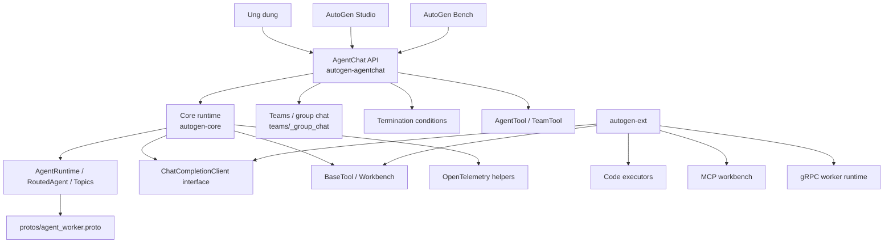
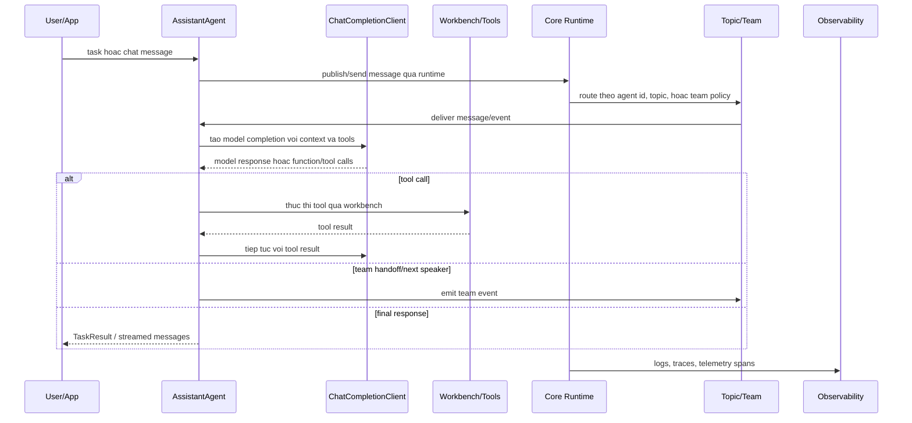
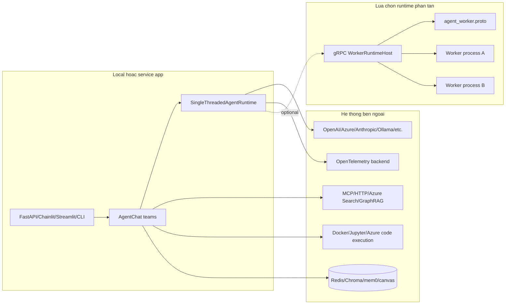
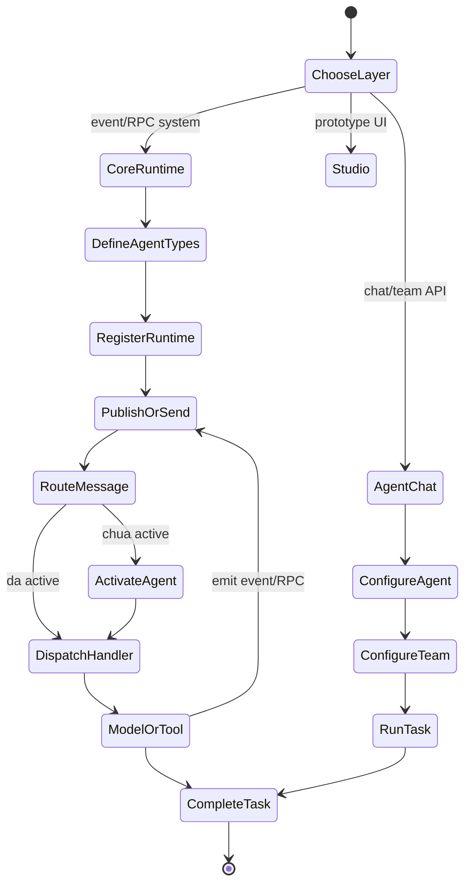
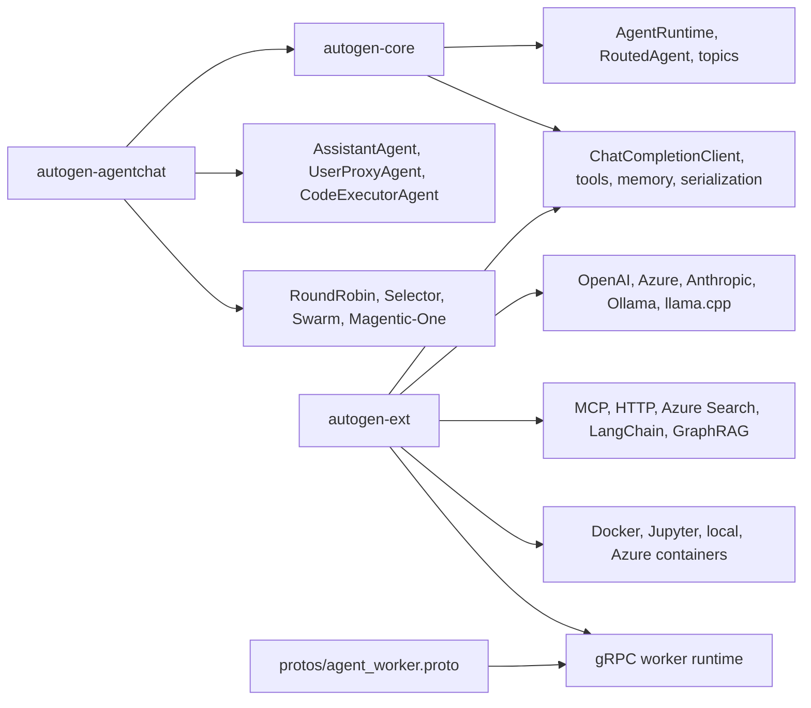
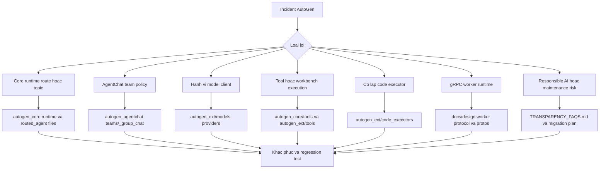
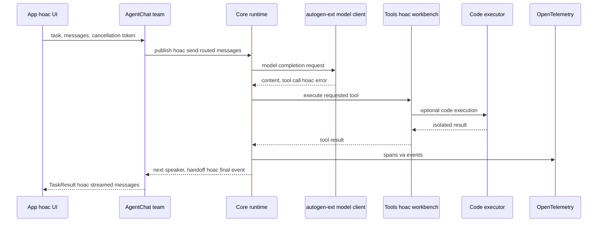

# Kiến trúc AutoGen

## Tóm tắt điều hành

AutoGen là framework cho ứng dụng AI multi-agent có thể hoạt động tự động hoặc phối hợp với con người. Trong checkout này, `README.md` ở root nói rõ AutoGen đang ở trạng thái maintenance mode và người dùng mới được hướng sang Microsoft Agent Framework. Với người dùng AutoGen hiện hữu, repository vẫn có giá trị vì chứa kiến trúc phân lớp của AutoGen: Core API event-driven cấp thấp, AgentChat API cấp cao hơn, Extensions cho model client/tool/runtime/memory/code execution, công cụ developer như Studio và Bench, mã .NET, hợp đồng protobuf, design docs và nhiều sample.

Workspace Python trong `python/pyproject.toml` gồm các package dưới `python/packages/*`. `autogen-core`, `autogen-agentchat` và `autogen-ext` đều ở phiên bản `0.7.5`. `autogen-core` cung cấp interface nền tảng và runtime; `autogen-agentchat` xây API agent/team chat trên core; `autogen-ext` đóng gói integration như OpenAI, Azure, Anthropic, Ollama, llama.cpp, Semantic Kernel, MCP, Docker/Jupyter/local code execution, Redis/disk cache, Chroma/mem0 memory, web/file/video surfer và gRPC runtime.

## Vấn đề được giải quyết

AutoGen giải quyết bài toán điều phối hệ thống có nhiều agent hội thoại. Repository hỗ trợ hai mức thiết kế: runtime pub-sub/RPC nơi agent nhận event trên topic, và facade AgentChat nơi developer xây assistant, user proxy, code executor agent, group chat, selector, swarm, handoff và team. Nó cũng xử lý các mối quan tâm tích hợp thực tế: model client, tool schema, workbench, code execution, distributed worker, memory có tính persistence, UI sample, benchmark tooling và hướng dẫn responsible AI.

## Vai trò trong AI Stack

| Lớp | Vai trò của repository | Căn cứ trong repo |
| --- | --- | --- |
| Event runtime | Agent ID, topic, subscription, routed agent, single-threaded runtime | `python/packages/autogen-core/src/autogen_core/` |
| Chat abstraction | AssistantAgent, BaseChatAgent, teams, termination conditions, UI console | `python/packages/autogen-agentchat/src/autogen_agentchat/` |
| Tích hợp | Model client, tool, code executor, MCP, memory, gRPC runtime | `python/packages/autogen-ext/src/autogen_ext/` |
| Hợp đồng phân tán | Worker protocol và CloudEvent/protobuf contract | `docs/design/`, `protos/`, `autogen-ext/runtimes/grpc/` |
| Vận hành có trách nhiệm | Security policy, transparency FAQ, tests, benchmark package | `SECURITY.md`, `TRANSPARENCY_FAQS.md`, `agbench`, package tests |

## Bản đồ cây nguồn

```text
autogen/
  README.md                         # tổng quan, maintenance mode, quickstart
  TRANSPARENCY_FAQS.md              # rủi ro Responsible AI và hướng dẫn vận hành
  SECURITY.md                       # báo cáo lỗ hổng
  docs/design/                      # programming model, topics, worker protocol, services
  protos/                           # cloudevent.proto và agent_worker.proto
  dotnet/                           # triển khai .NET và tài liệu
  python/
    pyproject.toml                  # uv workspace, poe tasks, lint/type/test config
    samples/                        # FastAPI, Chainlit, Streamlit, gRPC, group chat
    packages/
      autogen-core/                 # event runtime, tools, model client interface, telemetry
      autogen-agentchat/            # chat agents, teams, conditions, UI
      autogen-ext/                  # providers, code execution, MCP, memory, runtimes
      autogen-studio/               # công cụ UI/no-code cho prototype
      agbench/                      # benchmark/evaluation tooling
      pyautogen/                    # package tương thích
      autogen-test-utils/           # test helpers
      component-schema-gen/         # tiện ích sinh schema
      magentic-one-cli/             # package CLI Magentic-One
```

## Sơ đồ thành phần



## Khái niệm lõi

- Programming model event-driven: `docs/design/01 - Programming Model.md` mô tả agent publish-subscribe nhận CloudEvents, publish event, gọi model/tool/memory và dùng orchestrator agent khi workflow cần control logic.
- Topic và subscription: `docs/design/02 - Topics.md` định nghĩa identifier, subscription, tạo agent instance, message type và well-known topic type.
- Worker protocol: `docs/design/03 - Agent Worker Protocol.md` mô tả service và worker process, worker registration, placement agent, activation khi có event hoặc RPC request, routing response, timeout và termination.
- `AgentRuntime`: protocol trong `autogen_core/_agent_runtime.py`; `SingleThreadedAgentRuntime` trong `_single_threaded_agent_runtime.py` cung cấp runtime local.
- `RoutedAgent`: class và decorator trong `_routed_agent.py` ánh xạ message handler, event handler và RPC handler tới typed messages.
- `ChatCompletionClient`: interface model-client trong `autogen_core/models/_model_client.py`, được implement bởi extension client như `OpenAIChatCompletionClient`.
- `AssistantAgent`: chat agent cấp cao trong `autogen_agentchat/agents/_assistant_agent.py`.
- Teams: `autogen_agentchat/teams/_group_chat/` triển khai base group chat, round-robin, selector, swarm, sequential routed agent và biến thể Magentic-One.
- Workbench và tools: `autogen_core/tools/` và `autogen_ext/tools/` cung cấp schema, function tool, static workbench, MCP, HTTP, Azure AI Search, GraphRAG, LangChain và code execution tools.

## Kiến trúc nội bộ

AutoGen được thiết kế phân lớp. Core không phụ thuộc AgentChat; nó định nghĩa runtime, routing, identity, subscription, queue, serialization, component configuration, tool contract, model context, memory interface, model client và telemetry. AgentChat dùng Core để cung cấp abstraction dễ dùng hơn như `AssistantAgent`, `UserProxyAgent`, `CodeExecutorAgent`, `SocietyOfMindAgent` và teams. Extensions triển khai hạ tầng cụ thể quanh các abstraction này.

`autogen-ext` là lớp integration. Cây `models/` gồm adapter OpenAI, Azure AI, Anthropic, Ollama, llama.cpp, replay, cache và Semantic Kernel. Cây `tools/` gồm MCP transports, HTTP tools, Azure AI Search, GraphRAG, LangChain, code execution và adapter Semantic Kernel. Cây `code_executors/` gồm local, Docker, Docker Jupyter, Jupyter và Azure container execution. Cây `runtimes/grpc/` triển khai hỗ trợ distributed worker runtime dựa trên protobuf sinh mã.

## Luồng runtime và dữ liệu



## Điểm mở rộng

- Tạo event agent mới bằng cách subclass `RoutedAgent` và đăng ký message handler với decorator trong `_routed_agent.py`.
- Implement model client theo `ChatCompletionClient` trong `autogen_core/models/_model_client.py`.
- Implement tool bằng cách mở rộng `BaseTool`, `BaseStreamTool`, `Workbench` hoặc adapter pattern trong `autogen_core/tools/`.
- Thêm AgentChat agent bằng cách implement `BaseChatAgent` hoặc compose `AssistantAgent`, `UserProxyAgent` và `CodeExecutorAgent` có sẵn.
- Thêm policy group-chat dưới `autogen_agentchat/teams/_group_chat/`.
- Thêm integration dưới `autogen_ext` cho model, tool, memory, code executor, runtime, UI và agent.
- Thêm distributed transport theo `protos/agent_worker.proto` và `autogen_ext/runtimes/grpc/`.

## Tích hợp

Optional dependencies của `autogen-ext` thể hiện bề mặt tích hợp chính: OpenAI, Azure AI, Anthropic, Ollama, llama.cpp, Gemini, Semantic Kernel providers, Docker, Jupyter, Docker Jupyter, Azure code execution, gRPC, MCP, HTTP tools, GraphRAG, ChromaDB, mem0, Redis, diskcache, web/file/video surfers, Magentic-One và LangChain tools. Samples minh họa FastAPI, Chainlit, Streamlit, gRPC worker runtime, distributed group chat, semantic router, graph RAG, chess games, async human-in-the-loop và task-centric memory.

## Sơ đồ triển khai và vận hành



Runtime local đủ cho nhiều ứng dụng và sample. Triển khai phân tán dùng các phần gRPC worker runtime và thiết kế worker protocol, trong đó service process điều phối placement và communication, còn worker process host agent code. Code execution cần được cô lập bằng Docker hoặc môi trường managed, đặc biệt khi agent có thể sinh code hoặc shell command.

## Observability, testing, evaluation và failure modes

`autogen-core` phụ thuộc `opentelemetry-api` và có module `_telemetry/` cho tracing configuration và propagation. `python/pyproject.toml` cùng `pyproject.toml` ở từng package cấu hình `pytest`, `pytest-asyncio`, `pytest-cov`, `pytest-xdist`, `mypy`, `pyright` và `ruff`. Test của `autogen-ext` bao phủ models, tools, MCP, code executors, cache stores, memory, teams, web/file surfers và worker runtime. `agbench` tồn tại như package benchmark, còn samples có script task-centric memory hướng evaluation.

Các failure mode cần thiết kế:

- lỗi worker registration, placement hoặc timeout trong distributed runtime;
- model-client không khớp capability hoặc provider API thay đổi;
- lỗi chuyển schema tool và thực thi tool không an toàn;
- môi trường code executor bị rò rỉ hoặc chạy code sinh bởi model không tin cậy;
- termination condition của group chat không kích hoạt;
- memory store không nhất quán hoặc task-centric memory stale;
- lỗi lifecycle sync/async trong framework UI;
- rủi ro migration vì root README đánh dấu dự án là maintenance mode.

## Rủi ro bảo mật và governance

`TRANSPARENCY_FAQS.md` nói rõ AutoGen được định hướng cho nghiên cứu và thử nghiệm, không nên dùng downstream nếu chưa đánh giá kỹ robustness, safety, harm và bias. Tài liệu nêu các rủi ro LLM như bias, thiếu hiểu biết thực tế, thiếu minh bạch, content harms, hallucination, misuse, privacy, accountability, trust và unintended consequences. Tài liệu cũng khuyến nghị thực hành code execution an toàn hơn như Docker containers, human involvement, modular agents, quyền truy cập có scope và moderation hoặc safety prompts.

Governance production nên có human approval cho code execution và hành động có tác động cao, Docker hoặc managed isolation cho generated code, chỉ dùng MCP server tin cậy, credential theo role cho từng agent, audit log cho quyết định của team, rà soát policy model/provider và kế hoạch migration sang framework successor được hỗ trợ khi phù hợp.

## Sơ đồ lifecycle và quyết định



## Cấu hình, triển khai và ghi chú ops

- Dùng `autogen-agentchat` cộng với extras `autogen-ext[...]` cần thiết cho đa số ứng dụng Python.
- Dùng trực tiếp `autogen-core` khi cần topic routing, typed event handler, distributed runtime hoặc orchestration semantics tùy biến.
- Đặt model configuration bên ngoài code; nhiều sample dùng `model_config_template.yaml` và environment key.
- Dùng `DockerCommandLineCodeExecutor`, Docker Jupyter hoặc Azure container execution cho code, không chạy local không kiểm soát.
- Với gRPC worker, đồng bộ mã protobuf Python được sinh với `protos/agent_worker.proto` và `cloudevent.proto`.
- Xem AutoGen Studio là công cụ prototype; root README cảnh báo nó không phải app production-ready.
- Lập kế hoạch migration cho feature development mới vì root README nói repo không nhận feature mới.

## Hướng dẫn đọc mã nguồn

1. Đọc root `README.md` để hiểu maintenance mode, các layer package và quickstart.
2. Đọc `docs/design/01 - Programming Model.md`, `02 - Topics.md` và `03 - Agent Worker Protocol.md`.
3. Đọc `python/packages/autogen-core/src/autogen_core/_agent_runtime.py`, `_routed_agent.py` và `_single_threaded_agent_runtime.py`.
4. Đọc `python/packages/autogen-agentchat/src/autogen_agentchat/agents/_assistant_agent.py`.
5. Đọc `python/packages/autogen-agentchat/src/autogen_agentchat/teams/_group_chat/`.
6. Đọc module `autogen-ext` liên quan cho model provider, MCP, code execution, memory hoặc gRPC.
7. Đọc `TRANSPARENCY_FAQS.md` trước khi triển khai production hoặc ảnh hưởng tới người dùng.

## Lộ trình học

1. Chạy pattern hello-world trong root README với `AssistantAgent`.
2. Thêm function hoặc workbench tool.
3. Chuyển specialist agent thành `AgentTool`.
4. Xây team với round-robin hoặc selector group chat.
5. Thêm termination condition và human-in-the-loop.
6. Thêm code executor có isolation.
7. Khám phá routed agents và topics trong `autogen-core`.
8. Chỉ thử gRPC worker runtime sau khi hiểu rõ hành vi local runtime.

## Checklist sẵn sàng production

AutoGen cần một cổng readiness riêng vì `README.md` ở root nói rõ dự án đang ở chế độ maintenance. Với hệ thống đang dùng AutoGen, tư thế production an toàn nhất là xác định lớp nào vẫn còn business-critical và lớp nào chỉ là cầu nối migration.

| Khu vực | Neo theo repository | Kiểm tra kiến trúc |
| --- | --- | --- |
| Tư thế maintenance | `README.md`, `TRANSPARENCY_FAQS.md` | Ghi lại vì sao AutoGen vẫn phù hợp với workload và định nghĩa đường migration sang framework được hỗ trợ cho feature mới. |
| Chọn lớp | `python/packages/autogen-core/`, `autogen-agentchat/`, `autogen-ext/` | Dùng Core cho event/RPC, AgentChat cho team chat và Extensions chỉ cho integration đã pin, đã test. |
| Cô lập code execution | `python/packages/autogen-ext/src/autogen_ext/code_executors/` | Ưu tiên Docker, Docker Jupyter, Jupyter hoặc Azure container thay cho local execution không kiểm soát; scope mount và credential. |
| Distributed runtime | `docs/design/03 - Agent Worker Protocol.md`, `protos/agent_worker.proto` | Test worker registration, placement, timeout, restart và protocol compatibility trước khi triển khai multi-process. |
| Điều kiện dừng của team | `python/packages/autogen-agentchat/src/autogen_agentchat/teams/` | Kiểm tra termination conditions, max rounds, speaker selection, handoffs và human-in-the-loop. |
| Observability | `autogen_core/_telemetry/`, package tests, `agbench` | Export OpenTelemetry spans, thu thập outcome của task và benchmark hành vi team thay vì chỉ tin transcript. |



## Runbook vận hành và phân loại lỗi

Khi có incident production, cần tách lỗi AgentChat local khỏi lỗi routing Core runtime và lỗi extension. Chỉ đọc transcript là chưa đủ; incident phải được đối chiếu với topic routing, model-client calls, tool/workbench execution, log của code executor và telemetry spans.



Đường đọc cho kiến trúc sư cấp cao không nên dừng ở `AssistantAgent`. Hãy đọc `docs/design/`, sau đó Core runtime, rồi AgentChat teams, cuối cùng mới đến đúng module `autogen-ext` mà deployment dùng. Cách này giúp đội ứng dụng không xem mọi extension là có cùng mức trưởng thành hoặc an toàn.



## Ghi chú review cho kiến trúc sư cấp cao

Sự thật kiến trúc quan trọng nhất của clone này không chỉ là thiết kế multi-agent, mà còn là tín hiệu maintenance trong `README.md` ở root. Deployment hiện hữu vẫn có thể học và vận hành từ repository này, nhưng cam kết platform mới nên tách rõ "đủ ổn định cho workload hiện tại" khỏi "nền tảng chiến lược cho feature tương lai". Hãy ghi quyết định đó trước khi xây thêm capability mới trên `autogen-agentchat` hoặc `autogen-ext`.

Khi review code, hãy bắt đầu từ Core thay vì chat facade. `python/packages/autogen-core/src/autogen_core/_agent_runtime.py`, `_routed_agent.py`, `_single_threaded_agent_runtime.py` và design docs dưới `docs/design/` giải thích identity, topic, subscription, handler, serialization và lifecycle runtime. AgentChat dễ dùng hơn, nhưng incident production thường quy về Core routing, cancellation, timeout hoặc handler semantics.

Các extension module cần được import có chủ đích. `autogen-ext` chứa model clients, tools, memory providers, code executors, MCP integration, web/file/video surfers và gRPC runtime. Những capability này không có cùng một risk profile. Docker code executor, MCP workbench, Redis cache và model client cần credential, network access, logs và failure playbook khác nhau. Hãy xem package boundary như một catalog, không phải một blanket approval.

Với teams và group chats, cần test termination. Selector, round-robin, swarm, sequential routed agents và team kiểu Magentic-One đều có thể loop, stall hoặc tạo thảo luận nghe hợp lý nhưng giá trị thấp nếu max rounds, termination conditions và human handoff yếu. Source dưới `autogen_agentchat/teams/_group_chat/` nên được đọc cùng integration tests và samples trước khi tái sử dụng một team topology trong production.

## Thuật ngữ

- AgentRuntime: protocol lõi để register agent, send message, publish event và điều khiển lifecycle.
- RoutedAgent: base agent dispatch typed message tới handler được decorator.
- Topic: địa chỉ routing event dùng bởi pub-sub.
- Agent ID: định danh dạng tuple theo namespace và name trong design docs.
- AssistantAgent: chat agent cấp cao gọi model và tool.
- Team: construct orchestration của AgentChat cho cộng tác multi-agent.
- Workbench: abstraction expose một tập tool.
- ChatCompletionClient: interface model-client được agent sử dụng.
- Worker runtime: runtime phân tán nơi worker host agent code và service điều phối routing.
- Magentic-One: sample/extension multi-agent team dùng AgentChat và Extensions.
