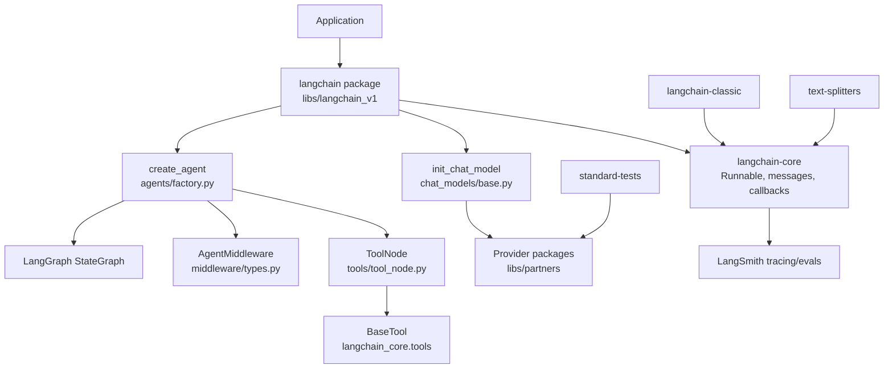
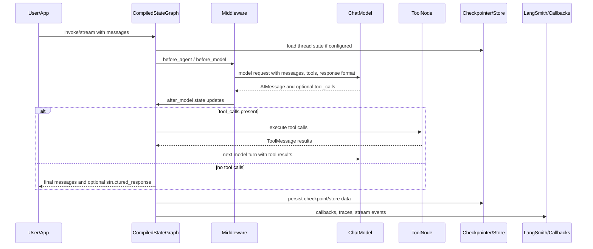
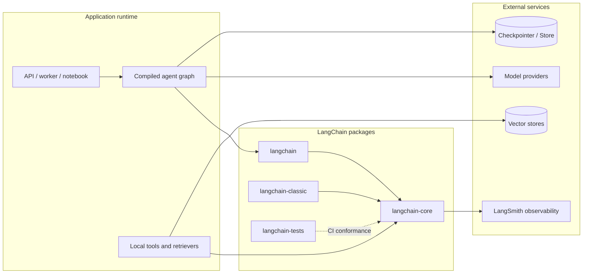
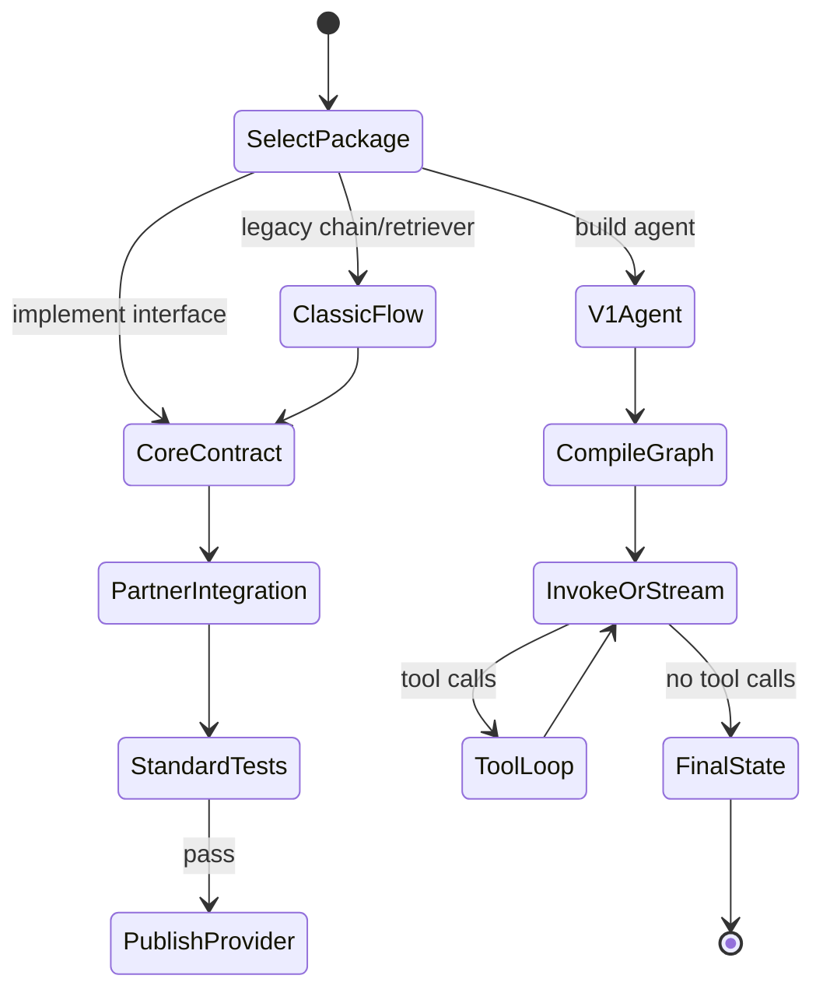
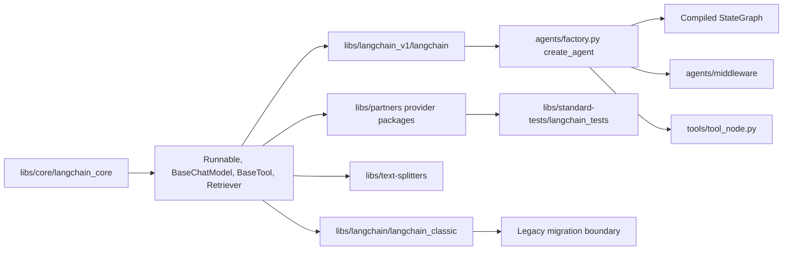
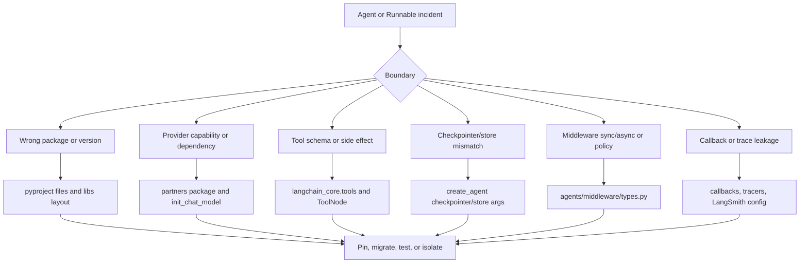
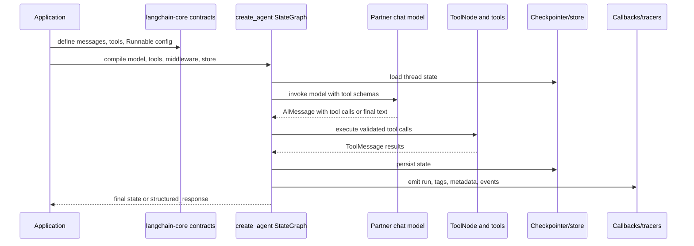

# LangChain Architecture

## Executive Summary

This LangChain checkout is a Python monorepo for agent and LLM application development. The root `README.md` calls LangChain "the agent engineering platform" and frames it as a framework for building agents and LLM-powered applications with interoperable components and third-party integrations. The local `libs/` tree is the real architecture boundary: `core` contains the foundational interfaces, `langchain_v1` contains the current `langchain` package and agent API, `langchain` contains `langchain-classic`, `text-splitters` isolates document chunking, `partners` contains provider packages, and `standard-tests` defines conformance tests for integrations.

Package metadata confirms the split. `libs/langchain_v1/pyproject.toml` publishes `langchain` version `1.3.2` with dependencies on `langchain-core>=1.4.0,<2.0.0`, `langgraph>=1.2.4,<1.3.0`, and `pydantic`. `libs/core/pyproject.toml` publishes `langchain-core` version `1.4.0` and depends on `langsmith`, `tenacity`, `jsonpatch`, `PyYAML`, `pydantic`, and `langchain-protocol`. `libs/langchain/pyproject.toml` publishes `langchain-classic` version `1.0.7`.

## Problem Solved

LangChain solves the integration and composition problem for LLM applications. It gives developers stable interfaces for chat models, messages, prompts, tools, embeddings, retrievers, vector stores, output parsers, callbacks, and runnable workflows. In the v1 package, `create_agent` builds a LangGraph-backed agent loop so users can combine a model, tools, middleware, structured output, checkpointers, stores, interrupts, caching, and stream transformers without hand-writing graph plumbing.

## AI Stack Role

| Layer | Repository role | Grounding in repo |
| --- | --- | --- |
| Agent orchestration | `create_agent` builds a compiled `StateGraph` with model and tools loop | `libs/langchain_v1/langchain/agents/factory.py` |
| Core contracts | Runnable, BaseChatModel, BaseTool, BaseRetriever, callbacks, messages | `libs/core/langchain_core/` |
| Provider abstraction | Optional partner packages and `init_chat_model` provider inference | `libs/partners/`, `libs/langchain_v1/langchain/chat_models/base.py` |
| Classic app patterns | Chains, legacy agents, memory, vectorstores, retrievers, evaluation | `libs/langchain/langchain_classic/` |
| Testing standard | Integration conformance tests for chat models, tools, retrievers, stores | `libs/standard-tests/` |

## Source Tree Map

```text
langchain/
  README.md                         # root overview and ecosystem positioning
  libs/
    README.md                       # monorepo package guide
    core/
      langchain_core/               # Runnable, messages, models, tools, retrievers
      pyproject.toml                # langchain-core package metadata
    langchain_v1/
      langchain/
        agents/                     # create_agent, middleware, structured output
        chat_models/                # init_chat_model provider factory
        embeddings/                 # embedding init helpers
        tools/                      # ToolNode bridge for agent execution
      pyproject.toml                # langchain package metadata
    langchain/
      langchain_classic/            # classic chains, agents, vectorstores, memory
      pyproject.toml                # langchain-classic package metadata
    partners/
      openai, anthropic, groq, xai, qdrant, chroma, ...
    text-splitters/
      langchain_text_splitters/     # character, markdown, html, json, python splitters
    standard-tests/
      langchain_tests/              # standard tests for integrations
```

## Component Diagram



## Core Concepts

- `Runnable`: the central unit of composition in `libs/core/langchain_core/runnables/base.py`. It supports `invoke`, `ainvoke`, `batch`, `stream`, graph composition with `RunnableSequence` and `RunnableParallel`, retries, listeners, config, and schemas.
- `BaseChatModel`: the chat model contract in `libs/core/langchain_core/language_models/chat_models.py`. Provider packages implement or adapt to this interface.
- Messages: `langchain_core.messages` defines AI, human, system, tool, function, and content-block message types, plus provider block translators.
- Tools: `langchain_core.tools` defines tool conversion, rendering, structured tools, retriever tools, and base tool contracts.
- `create_agent`: the v1 agent factory in `libs/langchain_v1/langchain/agents/factory.py`. It returns a compiled `StateGraph` and describes a loop where the model produces tool calls, a tools node executes them, and the model is called again until no tool calls remain.
- Middleware: `AgentMiddleware` in `libs/langchain_v1/langchain/agents/middleware/types.py` provides `before_agent`, `before_model`, `after_model`, `wrap_model_call`, `wrap_tool_call`, dynamic prompts, state schemas, tools, and stream transformers.
- Structured output: `ToolStrategy`, `ProviderStrategy`, and `AutoStrategy` live in `libs/langchain_v1/langchain/agents/structured_output.py`.
- Classic APIs: `libs/langchain/langchain_classic/` keeps older chain, agent, memory, retriever, vectorstore, graph, evaluation, utility, and prompt modules.

## Internal Architecture

LangChain separates stable contracts from orchestration. `langchain-core` owns low-level interfaces that integrations implement. The v1 `langchain` package uses those interfaces and imports `langgraph` to compile agents into executable state graphs. The classic package keeps broader legacy application patterns but depends on core and text splitters.

The agent factory builds several layers: it initializes a chat model if a string model identifier is provided; normalizes tools and built-in provider tools; constructs structured-output tools when a schema is supplied; chains middleware wrappers; builds graph nodes for model execution, tools, and middleware hooks; and compiles the graph with optional checkpointer, store, interrupts, cache, debug flag, name, and stream transformers.

## Runtime and Data Flow



## Extension Points

- Implement `BaseChatModel`, `BaseTool`, `Embeddings`, `BaseRetriever`, or vector store interfaces in `langchain-core`.
- Publish provider-specific packages under `libs/partners/`, following the test contract in `libs/standard-tests/`.
- Add agent middleware by subclassing `AgentMiddleware` or using decorators such as `before_model`, `after_model`, `wrap_model_call`, `wrap_tool_call`, and `dynamic_prompt`.
- Add structured output through Pydantic schemas, `ToolStrategy`, `ProviderStrategy`, or `AutoStrategy`.
- Compose chains and data flows with `RunnableSequence`, `RunnableParallel`, `RunnableLambda`, and `RunnableBinding`.
- Use `checkpointer` for per-thread state and `store` for cross-thread persistence in `create_agent`.

## Integrations

`libs/partners/` includes provider packages such as `anthropic`, `chroma`, `deepseek`, `exa`, `fireworks`, `groq`, `huggingface`, `mistralai`, `nomic`, `ollama`, `openai`, `openrouter`, `perplexity`, `qdrant`, and `xai`. `libs/langchain_v1/pyproject.toml` exposes optional extras for many of those providers. `libs/langchain_classic/vectorstores/` also contains a large set of legacy vector store adapters, while `langchain_core.messages.block_translators/` contains provider-specific content block translation.

## Deployment and Operations Topology



LangChain is deployed inside the host application. Production systems should isolate tool side effects, make model-provider packages explicit, configure checkpointers/stores for long-running or stateful agents, and send callbacks/traces to LangSmith or another callback/tracing sink. Because v1 agents compile to LangGraph graphs, deployment decisions often mirror LangGraph decisions: durable execution, interruption, human review, and state management are explicit topology choices.

## Observability, Testing, Evaluation, and Failure Modes

Observability enters through `langchain_core.callbacks`, `langchain_core.tracers`, and the `langsmith` dependency in `langchain-core`. `Runnable` config supports tags and metadata for tracing. The root README points developers to LangSmith for debugging, observability, evaluation, and deployment workflows.

Testing is not only normal unit tests. `libs/standard-tests/README.md` describes `langchain-tests`, a package of standard test base classes for integrations. For example, a chat model integration should provide unit and integration test classes derived from `ChatModelUnitTests` and `ChatModelIntegrationTests`. The monorepo also uses `ruff`, `mypy`, `pytest`, `pytest-asyncio`, `pytest-socket`, `pytest-xdist`, `syrupy`, and benchmark tooling according to package metadata.

Failure modes to account for:

- provider package missing for a model identifier passed to `init_chat_model`;
- provider capability mismatch for tool calling or structured output;
- middleware sync/async mismatch, explicitly mentioned in `AgentMiddleware` error text;
- tool schema drift or duplicate tool names;
- vector store, retriever, or embedding provider latency and rate limits;
- checkpoint/store mismatch across graph versions;
- callback or tracing leakage of sensitive messages;
- classic API deprecation and migration risk.

## Security and Governance Risks

LangChain makes tool integration easy, so governance must be externalized into application policy. Risks include prompt injection through retrieved content, tool misuse, data exfiltration via model providers, untrusted document loading, SSRF or unsafe HTTP utility use, and accidental persistence of secrets in traces. The `langchain_core/_security/` directory indicates security-specific transport and SSRF policy code exists in core. Production use should combine input validation, tool allowlists, scoped credentials, retrieval filtering, trace redaction, network egress controls, and integration conformance tests.

## Lifecycle and Module Dependency Diagram



## Configuration, Deployment, and Ops Notes

- Install `langchain` for the v1 API and add provider packages explicitly, for example OpenAI, Anthropic, Ollama, Groq, or Qdrant packages.
- Use `langchain-core` when implementing reusable integrations or custom contracts.
- Use `langchain-tests` in CI when publishing a provider or vector store package.
- Keep `langchain-classic` isolated when maintaining legacy chains or migrations.
- Use checkpointers/stores for durable agent state, especially when interrupts or human-in-the-loop workflows are enabled.
- Treat `debug=True` and callback traces as sensitive in regulated environments.

## Reading Guide

1. Read root `README.md`, then `libs/README.md`.
2. Read `libs/core/langchain_core/runnables/base.py` and `language_models/chat_models.py`.
3. Read `libs/langchain_v1/langchain/chat_models/base.py` for model initialization.
4. Read `libs/langchain_v1/langchain/agents/factory.py` and `agents/middleware/types.py`.
5. Read `libs/langchain_v1/langchain/agents/structured_output.py`.
6. For integrations, read the matching package under `libs/partners/` plus `libs/standard-tests/README.md`.
7. For migration or older apps, inspect `libs/langchain/langchain_classic/`.

## Learning Path

1. Create a model with `init_chat_model`.
2. Compose a small `RunnableSequence`.
3. Convert a Python callable into a tool and call it from `create_agent`.
4. Add middleware for prompt shaping, retry, fallback, or PII handling.
5. Add structured output with a Pydantic schema.
6. Add a checkpointer/store and stream the compiled graph.
7. Validate a custom integration with `langchain-tests`.

## Production Readiness Checklist

LangChain production readiness is mostly about controlling the boundaries between `libs/core`, the v1 agent package in `libs/langchain_v1`, provider packages in `libs/partners`, and legacy code under `libs/langchain/langchain_classic`.

| Area | Repository anchor | Architecture check |
| --- | --- | --- |
| Package selection | `libs/langchain_v1/pyproject.toml`, `libs/core/pyproject.toml`, `libs/langchain/pyproject.toml` | Decide whether the service imports v1 `langchain`, reusable `langchain-core`, or `langchain-classic`; do not mix legacy chains into a new agent graph without a migration plan. |
| Provider dependencies | `libs/partners/`, `libs/langchain_v1/langchain/chat_models/base.py` | Install and pin only the provider packages actually used; validate model capability for tools, JSON mode, streaming, and structured output. |
| Agent state | `libs/langchain_v1/langchain/agents/factory.py` | Choose checkpointer and store behavior before shipping long-running agents, interrupts, or human review workflows. |
| Tool safety | `libs/core/langchain_core/tools/`, `libs/langchain_v1/langchain/tools/tool_node.py` | Enforce tool allowlists, schema validation, credential scoping, and safe error propagation from `ToolNode`. |
| Middleware governance | `libs/langchain_v1/langchain/agents/middleware/` | Use middleware for PII scrubbing, prompt shaping, retries, and policy decisions; test sync and async variants. |
| Integration quality | `libs/standard-tests/` | Use `langchain-tests` for provider, retriever, tool, or vector store integrations before relying on them in CI. |



## Operational Runbook And Failure Triage

When an agent run fails, first determine whether the failure came from the graph contract, the model provider, a tool execution, or persistence. `create_agent` hides graph construction for ease of use, so production debugging should include traces from `langchain_core.callbacks`, `langchain_core.tracers`, LangSmith, or an equivalent callback sink.



A senior architect should read LangChain as a contract library first and as an agent framework second. Stable application boundaries should depend on `langchain-core` interfaces and on provider packages that pass standard tests. The v1 `create_agent` path is appropriate when LangGraph durability, middleware, tools, and structured output are needed; `langchain-classic` should be treated as an older compatibility surface, especially for chains, memory, vector stores, and evaluation modules.



## Senior Architect Review Notes

Read this repository as a layered contract system. `libs/core/langchain_core` should be the stable mental model: messages, runnables, tools, retrievers, callbacks, tracers, and model interfaces. The v1 package in `libs/langchain_v1/langchain` composes those contracts into agent graphs, while `libs/partners` implements provider-specific edges. A production application should keep custom business code depending on the smallest stable contract it needs, rather than importing broad legacy modules by habit.

The highest-risk design choice is not whether to use an agent; it is where state and authority live. `libs/langchain_v1/langchain/agents/factory.py` can accept checkpointers, stores, middleware, tools, caches, interrupts, and stream transformers. Each of those is an operational boundary. A checkpointer controls replay and resumability, a store controls cross-thread memory, middleware controls policy and prompt shape, and tools control external side effects. Treat these as separate architecture decisions, not as optional keyword arguments.

Provider integrations should be judged by conformance, not popularity. The `libs/standard-tests/` package exists because chat models, retrievers, vector stores, and tools can all claim compatibility while diverging on streaming, tool calls, async behavior, error semantics, or structured output. Before a custom provider package or partner module becomes part of a platform standard, require standard tests, provider capability documentation, and an incident plan for API drift.

Finally, isolate `libs/langchain/langchain_classic` in modernization work. It is valuable for existing chains, memory, vector stores, and evaluation utilities, but new agent workloads should have a deliberate reason to cross from v1 graph orchestration into classic abstractions. That boundary should appear explicitly in code ownership and dependency review.

For platform teams, define ownership by package boundary. The team that owns reusable integrations should maintain code against `libs/core/langchain_core` contracts and `libs/standard-tests`; the team that owns user workflows should own `libs/langchain_v1` agent configuration, middleware, checkpointers, and stores; the team that owns legacy migration should own `libs/langchain/langchain_classic` usage and removal plans. This separation prevents one application feature from silently changing provider compatibility, graph state behavior, and legacy chain behavior at the same time.

During design reviews, ask for a capability matrix per model provider. A provider package under `libs/partners` may support ordinary chat but not reliable tool calling, JSON schema responses, token streaming, multimodal content blocks, or consistent error typing. If the agent factory receives a string model identifier and infers a provider through `init_chat_model`, that inference should be covered by tests and deployment configuration, not left as an implicit runtime surprise.

## Glossary

- Runnable: composable unit that can invoke, batch, stream, and expose schemas.
- BaseChatModel: core chat-model interface implemented by provider packages.
- ToolNode: graph node that executes tool calls emitted by the model.
- AgentMiddleware: hook and wrapper system around agent, model, and tool execution.
- StateGraph: LangGraph graph compiled by `create_agent`.
- Checkpointer: per-thread persistence for graph state.
- Store: cross-thread persistence for application or agent data.
- Structured output: schema-backed model response using provider-native or tool-call strategy.
- LangSmith: observability, debugging, and evaluation platform integrated through callbacks/tracers.
