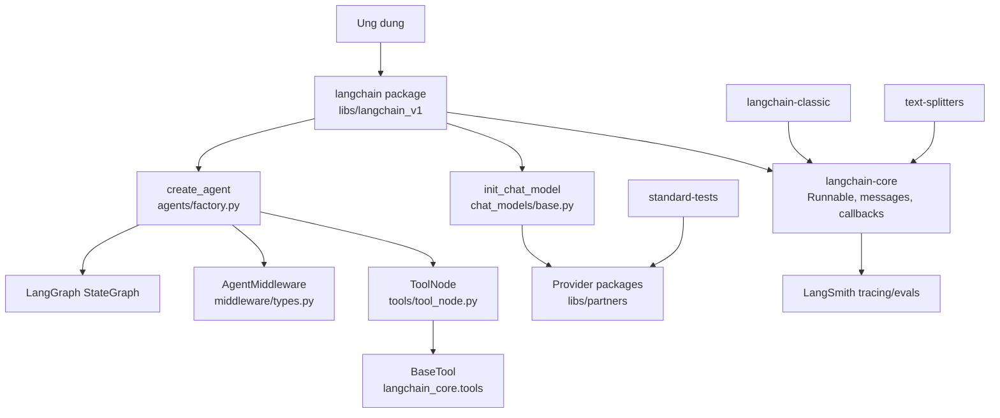
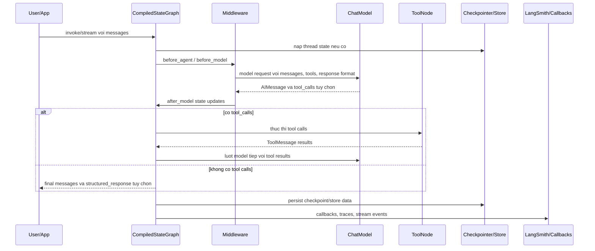
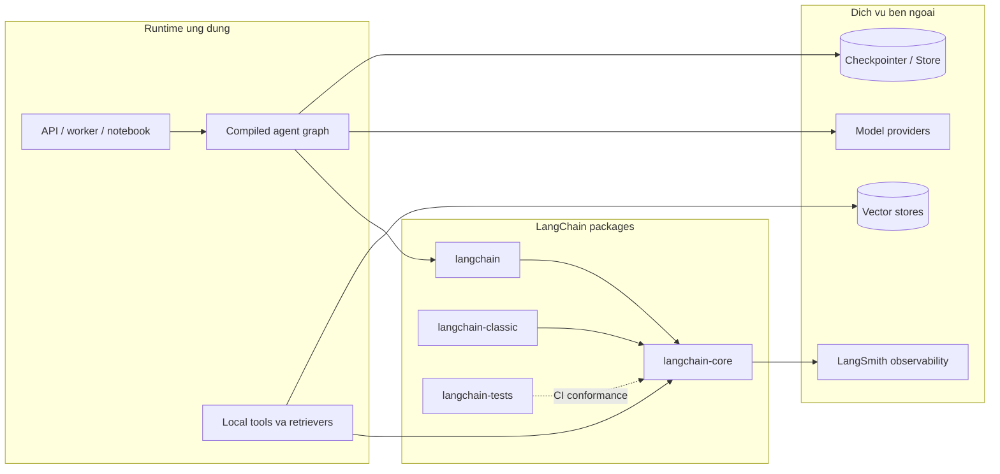
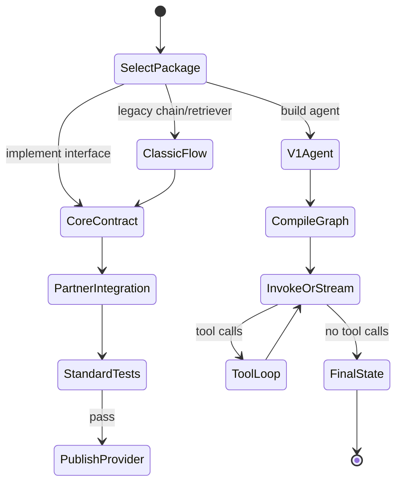
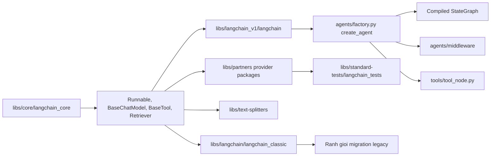
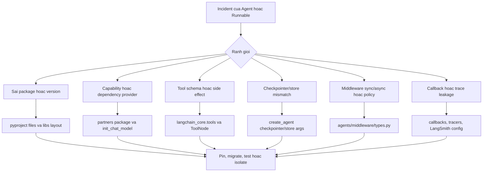
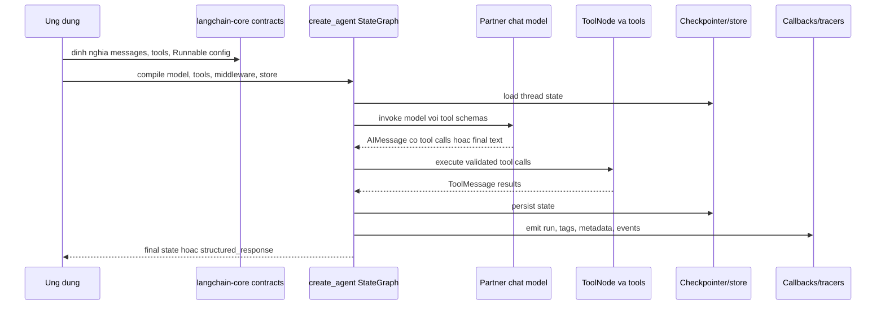

# Kiến trúc LangChain

## Tóm tắt điều hành

Checkout LangChain này là monorepo Python cho phát triển agent và ứng dụng LLM. `README.md` ở root gọi LangChain là "the agent engineering platform" và mô tả nó là framework để xây dựng agent, ứng dụng LLM, component tương tác được với nhau và tích hợp bên thứ ba. Ranh giới kiến trúc thực tế nằm trong `libs/`: `core` chứa interface nền tảng, `langchain_v1` chứa package `langchain` hiện tại và API agent, `langchain` chứa `langchain-classic`, `text-splitters` tách riêng logic chunking tài liệu, `partners` chứa package provider, và `standard-tests` chứa test conformance cho integration.

Metadata package xác nhận cách tách này. `libs/langchain_v1/pyproject.toml` phát hành `langchain` phiên bản `1.3.2`, phụ thuộc `langchain-core>=1.4.0,<2.0.0`, `langgraph>=1.2.4,<1.3.0` và `pydantic`. `libs/core/pyproject.toml` phát hành `langchain-core` phiên bản `1.4.0`, phụ thuộc `langsmith`, `tenacity`, `jsonpatch`, `PyYAML`, `pydantic` và `langchain-protocol`. `libs/langchain/pyproject.toml` phát hành `langchain-classic` phiên bản `1.0.7`.

## Vấn đề được giải quyết

LangChain giải quyết bài toán tích hợp và composition cho ứng dụng LLM. Nó cung cấp interface ổn định cho chat model, message, prompt, tool, embedding, retriever, vector store, output parser, callback và workflow dạng runnable. Trong package v1, `create_agent` xây agent loop dựa trên LangGraph để người dùng kết hợp model, tool, middleware, structured output, checkpointer, store, interrupt, cache và stream transformer mà không cần tự viết toàn bộ graph plumbing.

## Vai trò trong AI Stack

| Lớp | Vai trò của repository | Căn cứ trong repo |
| --- | --- | --- |
| Điều phối agent | `create_agent` tạo compiled `StateGraph` với vòng lặp model và tool | `libs/langchain_v1/langchain/agents/factory.py` |
| Hợp đồng lõi | Runnable, BaseChatModel, BaseTool, BaseRetriever, callbacks, messages | `libs/core/langchain_core/` |
| Trừu tượng provider | Package partner tùy chọn và suy luận provider qua `init_chat_model` | `libs/partners/`, `libs/langchain_v1/langchain/chat_models/base.py` |
| Mẫu ứng dụng classic | Chains, legacy agents, memory, vectorstores, retrievers, evaluation | `libs/langchain/langchain_classic/` |
| Chuẩn kiểm thử | Test conformance cho chat model, tool, retriever, store | `libs/standard-tests/` |

## Bản đồ cây nguồn

```text
langchain/
  README.md                         # tổng quan root và hệ sinh thái
  libs/
    README.md                       # hướng dẫn các package trong monorepo
    core/
      langchain_core/               # Runnable, messages, models, tools, retrievers
      pyproject.toml                # metadata package langchain-core
    langchain_v1/
      langchain/
        agents/                     # create_agent, middleware, structured output
        chat_models/                # init_chat_model provider factory
        embeddings/                 # helper khởi tạo embedding
        tools/                      # ToolNode bridge cho agent execution
      pyproject.toml                # metadata package langchain
    langchain/
      langchain_classic/            # classic chains, agents, vectorstores, memory
      pyproject.toml                # metadata package langchain-classic
    partners/
      openai, anthropic, groq, xai, qdrant, chroma, ...
    text-splitters/
      langchain_text_splitters/     # character, markdown, html, json, python splitters
    standard-tests/
      langchain_tests/              # test chuẩn cho integrations
```

## Sơ đồ thành phần



## Khái niệm lõi

- `Runnable`: đơn vị composition trung tâm trong `libs/core/langchain_core/runnables/base.py`. Nó hỗ trợ `invoke`, `ainvoke`, `batch`, `stream`, composition graph với `RunnableSequence` và `RunnableParallel`, retry, listener, config và schema.
- `BaseChatModel`: hợp đồng chat model trong `libs/core/langchain_core/language_models/chat_models.py`. Các package provider implement hoặc adapt vào interface này.
- Messages: `langchain_core.messages` định nghĩa AI, human, system, tool, function và content-block message, cộng với provider block translator.
- Tools: `langchain_core.tools` định nghĩa tool conversion, rendering, structured tool, retriever tool và base tool contract.
- `create_agent`: agent factory v1 trong `libs/langchain_v1/langchain/agents/factory.py`. Nó trả về compiled `StateGraph`; docstring mô tả vòng lặp model tạo tool call, tools node chạy tool, model được gọi lại cho tới khi không còn tool call.
- Middleware: `AgentMiddleware` trong `libs/langchain_v1/langchain/agents/middleware/types.py` cung cấp `before_agent`, `before_model`, `after_model`, `wrap_model_call`, `wrap_tool_call`, dynamic prompt, state schema, tool và stream transformer.
- Structured output: `ToolStrategy`, `ProviderStrategy` và `AutoStrategy` nằm trong `libs/langchain_v1/langchain/agents/structured_output.py`.
- Classic APIs: `libs/langchain/langchain_classic/` giữ module chain, agent, memory, retriever, vectorstore, graph, evaluation, utility và prompt kiểu cũ.

## Kiến trúc nội bộ

LangChain tách hợp đồng ổn định khỏi orchestration. `langchain-core` sở hữu interface cấp thấp để integration implement. Package `langchain` v1 dùng các interface đó và import `langgraph` để compile agent thành state graph có thể chạy. Package classic giữ các pattern ứng dụng cũ hơn nhưng phụ thuộc vào core và text splitters.

Agent factory xây nhiều lớp: khởi tạo chat model nếu đầu vào là string model identifier; chuẩn hóa tool và built-in provider tool; tạo structured-output tool khi có schema; chain các wrapper middleware; dựng graph node cho model execution, tools và middleware hooks; sau đó compile graph với checkpointer, store, interrupts, cache, debug flag, name và stream transformers tùy chọn.

## Luồng runtime và dữ liệu



## Điểm mở rộng

- Implement `BaseChatModel`, `BaseTool`, `Embeddings`, `BaseRetriever` hoặc interface vector store trong `langchain-core`.
- Phát hành package provider dưới `libs/partners/`, theo contract test trong `libs/standard-tests/`.
- Thêm agent middleware bằng cách subclass `AgentMiddleware` hoặc dùng decorator `before_model`, `after_model`, `wrap_model_call`, `wrap_tool_call` và `dynamic_prompt`.
- Thêm structured output qua Pydantic schema, `ToolStrategy`, `ProviderStrategy` hoặc `AutoStrategy`.
- Compose chain và data flow bằng `RunnableSequence`, `RunnableParallel`, `RunnableLambda` và `RunnableBinding`.
- Dùng `checkpointer` cho state theo thread và `store` cho persistence đa thread trong `create_agent`.

## Tích hợp

`libs/partners/` gồm các package provider như `anthropic`, `chroma`, `deepseek`, `exa`, `fireworks`, `groq`, `huggingface`, `mistralai`, `nomic`, `ollama`, `openai`, `openrouter`, `perplexity`, `qdrant` và `xai`. `libs/langchain_v1/pyproject.toml` expose optional extras cho nhiều provider đó. `libs/langchain_classic/vectorstores/` cũng có nhiều adapter vector store legacy, còn `langchain_core.messages.block_translators/` chứa logic chuyển content block theo provider.

## Sơ đồ triển khai và vận hành



LangChain được deploy bên trong host application. Hệ thống production nên cô lập side effect của tool, khai báo package provider rõ ràng, cấu hình checkpointer/store cho agent dài hạn hoặc có state, và gửi callback/trace tới LangSmith hoặc sink tracing khác. Vì agent v1 compile thành graph LangGraph, quyết định triển khai thường đi cùng quyết định LangGraph: durable execution, interrupt, human review và state management là các lựa chọn topology rõ ràng.

## Observability, testing, evaluation và failure modes

Observability đi qua `langchain_core.callbacks`, `langchain_core.tracers` và phụ thuộc `langsmith` trong `langchain-core`. `Runnable` config hỗ trợ tags và metadata cho tracing. Root README hướng developer tới LangSmith cho debugging, observability, evaluation và deployment workflow.

Testing không chỉ là unit test thông thường. `libs/standard-tests/README.md` mô tả `langchain-tests`, package chứa standard test base classes cho integration. Ví dụ một chat model integration nên có unit và integration test class kế thừa `ChatModelUnitTests` và `ChatModelIntegrationTests`. Monorepo cũng dùng `ruff`, `mypy`, `pytest`, `pytest-asyncio`, `pytest-socket`, `pytest-xdist`, `syrupy` và benchmark tooling theo metadata package.

Các failure mode cần chú ý:

- thiếu package provider khi truyền model identifier vào `init_chat_model`;
- model provider không hỗ trợ tool calling hoặc structured output như kỳ vọng;
- mismatch sync/async trong middleware, được nêu rõ trong error text của `AgentMiddleware`;
- schema tool lệch hoặc trùng tên tool;
- latency và rate limit ở vector store, retriever hoặc embedding provider;
- checkpoint/store không tương thích khi graph thay đổi version;
- callback hoặc tracing làm lộ message nhạy cảm;
- rủi ro deprecation và migration của classic API.

## Rủi ro bảo mật và governance

LangChain làm việc tích hợp tool trở nên dễ dàng, nên governance phải được đặt thành policy của ứng dụng. Rủi ro gồm prompt injection qua nội dung retrieved, misuse tool, data exfiltration qua model provider, document loader không tin cậy, SSRF hoặc HTTP utility không an toàn, và vô tình lưu secret trong trace. Thư mục `langchain_core/_security/` cho thấy core có code policy về transport và SSRF. Production nên kết hợp input validation, tool allowlist, credential có scope hẹp, retrieval filtering, trace redaction, network egress control và test conformance cho integration.

## Sơ đồ lifecycle và phụ thuộc module



## Cấu hình, triển khai và ghi chú ops

- Cài `langchain` cho API v1 và thêm package provider rõ ràng, ví dụ OpenAI, Anthropic, Ollama, Groq hoặc Qdrant.
- Dùng `langchain-core` khi xây integration tái sử dụng hoặc custom contract.
- Dùng `langchain-tests` trong CI khi phát hành provider hoặc vector store package.
- Tách riêng `langchain-classic` khi duy trì chain cũ hoặc migration.
- Dùng checkpointer/store cho agent state bền vững, đặc biệt khi bật interrupt hoặc human-in-the-loop.
- Xem `debug=True` và callback trace là dữ liệu nhạy cảm trong môi trường regulated.

## Hướng dẫn đọc mã nguồn

1. Đọc `README.md` ở root, sau đó `libs/README.md`.
2. Đọc `libs/core/langchain_core/runnables/base.py` và `language_models/chat_models.py`.
3. Đọc `libs/langchain_v1/langchain/chat_models/base.py` để hiểu khởi tạo model.
4. Đọc `libs/langchain_v1/langchain/agents/factory.py` và `agents/middleware/types.py`.
5. Đọc `libs/langchain_v1/langchain/agents/structured_output.py`.
6. Với integration, đọc package tương ứng dưới `libs/partners/` và `libs/standard-tests/README.md`.
7. Với migration hoặc app cũ, xem `libs/langchain/langchain_classic/`.

## Lộ trình học

1. Tạo model bằng `init_chat_model`.
2. Compose một `RunnableSequence` nhỏ.
3. Chuyển Python callable thành tool và gọi qua `create_agent`.
4. Thêm middleware cho prompt shaping, retry, fallback hoặc PII handling.
5. Thêm structured output với Pydantic schema.
6. Thêm checkpointer/store và stream compiled graph.
7. Validate custom integration bằng `langchain-tests`.

## Checklist sẵn sàng production

Sẵn sàng production với LangChain chủ yếu là kiểm soát ranh giới giữa `libs/core`, package agent v1 trong `libs/langchain_v1`, các provider trong `libs/partners` và mã legacy dưới `libs/langchain/langchain_classic`.

| Khu vực | Neo theo repository | Kiểm tra kiến trúc |
| --- | --- | --- |
| Chọn package | `libs/langchain_v1/pyproject.toml`, `libs/core/pyproject.toml`, `libs/langchain/pyproject.toml` | Xác định service dùng v1 `langchain`, reusable `langchain-core` hay `langchain-classic`; không trộn legacy chains vào agent graph mới nếu chưa có kế hoạch migration. |
| Provider dependency | `libs/partners/`, `libs/langchain_v1/langchain/chat_models/base.py` | Chỉ cài và pin provider thật sự dùng; kiểm tra capability cho tool, JSON mode, streaming và structured output. |
| Trạng thái agent | `libs/langchain_v1/langchain/agents/factory.py` | Chọn checkpointer và store trước khi triển khai agent dài hơi, interrupt hoặc human review. |
| An toàn tool | `libs/core/langchain_core/tools/`, `libs/langchain_v1/langchain/tools/tool_node.py` | Áp dụng allowlist tool, validate schema, scope credential và kiểm soát lỗi từ `ToolNode`. |
| Governance bằng middleware | `libs/langchain_v1/langchain/agents/middleware/` | Dùng middleware cho PII scrubbing, định hình prompt, retry và policy; test cả sync và async. |
| Chất lượng integration | `libs/standard-tests/` | Dùng `langchain-tests` cho provider, retriever, tool hoặc vector store trước khi đưa vào CI. |



## Runbook vận hành và phân loại lỗi

Khi một agent run lỗi, hãy xác định trước lỗi đến từ contract của graph, provider model, tool execution hay persistence. `create_agent` che bớt chi tiết dựng graph để dễ dùng, nên debugging production cần trace từ `langchain_core.callbacks`, `langchain_core.tracers`, LangSmith hoặc callback sink tương đương.



Kiến trúc sư cấp cao nên đọc LangChain trước hết như một thư viện contract, sau đó mới như framework agent. Ranh giới ứng dụng ổn định nên phụ thuộc vào interface của `langchain-core` và provider package vượt qua standard tests. Đường v1 `create_agent` phù hợp khi cần LangGraph durability, middleware, tools và structured output; `langchain-classic` nên được xem là bề mặt tương thích cũ, nhất là với chains, memory, vector stores và evaluation modules.



## Ghi chú review cho kiến trúc sư cấp cao

Hãy đọc repository này như một hệ thống contract nhiều lớp. `libs/core/langchain_core` nên là mental model ổn định nhất: messages, runnables, tools, retrievers, callbacks, tracers và model interfaces. Package v1 trong `libs/langchain_v1/langchain` compose các contract đó thành agent graph, còn `libs/partners` hiện thực các cạnh provider-specific. Một production application nên để business code phụ thuộc vào contract nhỏ nhất cần dùng, thay vì import module legacy rộng theo thói quen.

Quyết định rủi ro nhất không phải là có dùng agent hay không, mà là state và authority nằm ở đâu. `libs/langchain_v1/langchain/agents/factory.py` có thể nhận checkpointers, stores, middleware, tools, caches, interrupts và stream transformers. Mỗi thành phần đó là một operational boundary. Checkpointer kiểm soát replay và resumability, store kiểm soát cross-thread memory, middleware kiểm soát policy và prompt shape, còn tools kiểm soát side effect bên ngoài. Hãy xem chúng là các quyết định kiến trúc riêng, không chỉ là optional keyword arguments.

Provider integration nên được đánh giá bằng conformance, không phải độ phổ biến. Package `libs/standard-tests/` tồn tại vì chat model, retriever, vector store và tool đều có thể tuyên bố tương thích nhưng khác nhau ở streaming, tool calls, async behavior, error semantics hoặc structured output. Trước khi một custom provider package hoặc partner module trở thành platform standard, cần yêu cầu standard tests, tài liệu capability của provider và incident plan cho API drift.

Cuối cùng, hãy cô lập `libs/langchain/langchain_classic` trong các dự án modernization. Nó vẫn có giá trị cho chains, memory, vector stores và evaluation utilities hiện hữu, nhưng workload agent mới cần có lý do rõ ràng nếu đi từ v1 graph orchestration sang classic abstractions. Ranh giới đó nên xuất hiện rõ trong code ownership và dependency review.

Với platform team, hãy định nghĩa ownership theo package boundary. Team sở hữu reusable integrations nên duy trì code dựa trên contract của `libs/core/langchain_core` và `libs/standard-tests`; team sở hữu user workflows nên sở hữu cấu hình agent trong `libs/langchain_v1`, middleware, checkpointers và stores; team sở hữu legacy migration nên quản lý usage và kế hoạch loại bỏ `libs/langchain/langchain_classic`. Cách tách này ngăn một feature ứng dụng âm thầm thay đổi provider compatibility, graph state behavior và legacy chain behavior cùng lúc.

Trong design review, cần yêu cầu capability matrix cho từng model provider. Một provider package dưới `libs/partners` có thể hỗ trợ chat thông thường nhưng không hỗ trợ đáng tin cậy cho tool calling, JSON schema responses, token streaming, multimodal content blocks hoặc error typing nhất quán. Nếu agent factory nhận string model identifier và suy luận provider qua `init_chat_model`, việc suy luận đó phải có test và deployment configuration, không nên là bất ngờ runtime.

## Thuật ngữ

- Runnable: đơn vị có thể compose, invoke, batch, stream và expose schema.
- BaseChatModel: interface chat model lõi được implement bởi provider packages.
- ToolNode: graph node thực thi tool call do model phát ra.
- AgentMiddleware: hệ thống hook và wrapper quanh agent, model và tool execution.
- StateGraph: graph LangGraph được `create_agent` compile.
- Checkpointer: persistence theo thread cho graph state.
- Store: persistence đa thread cho dữ liệu ứng dụng hoặc agent.
- Structured output: response model dựa trên schema, dùng provider-native hoặc tool-call strategy.
- LangSmith: nền tảng observability, debugging và evaluation tích hợp qua callbacks/tracers.
