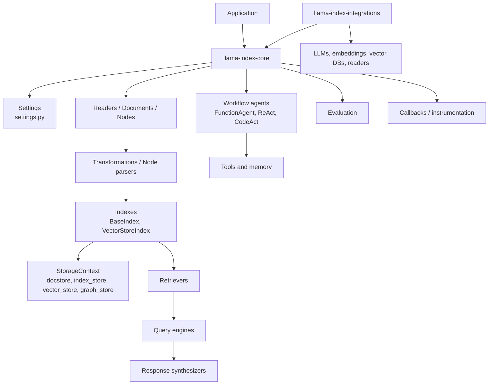
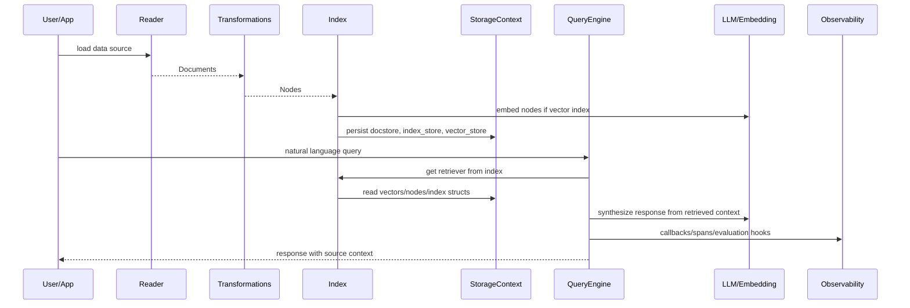
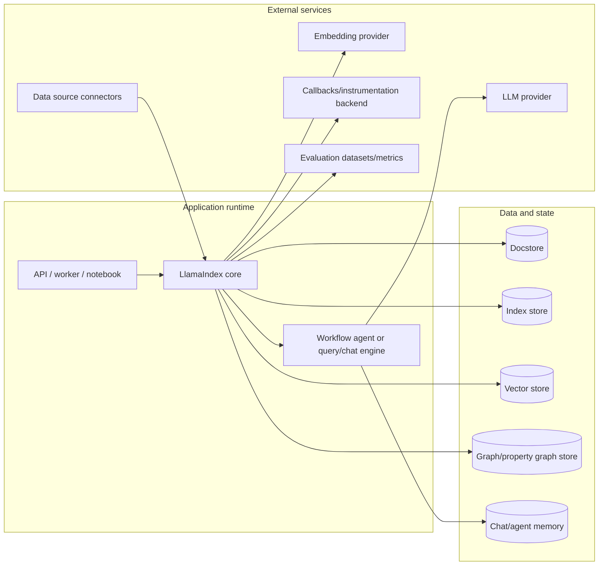
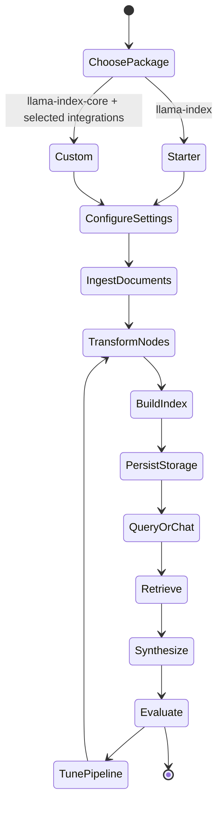
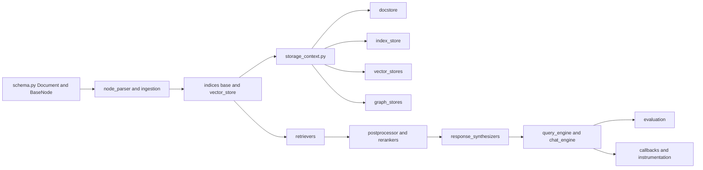
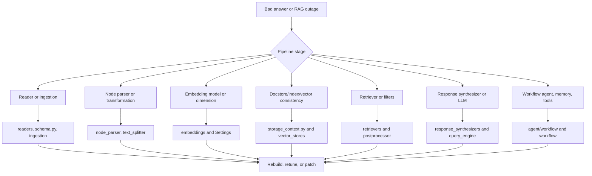
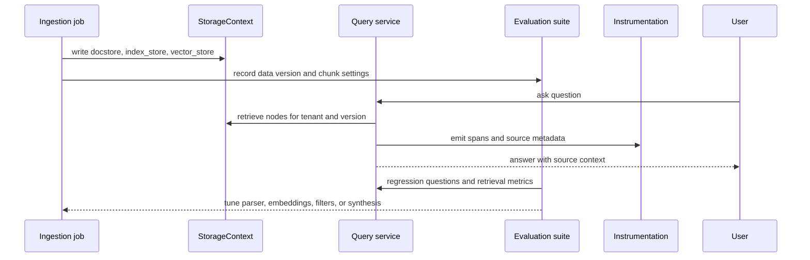

# LlamaIndex Architecture

## Executive Summary

LlamaIndex is an open-source framework for data-backed and agentic LLM applications. The root `README.md` describes it as a toolkit for augmenting LLMs with private data through connectors, indexes, graphs, retrieval/query interfaces, and integrations. In this checkout, the starter distribution `llama-index` is a thin package that depends on `llama-index-core`, OpenAI LLM/embedding integrations, and `nltk`. The architectural center is `llama-index-core/llama_index/core`, while `llama-index-integrations/` contains hundreds of provider-specific packages for LLMs, embeddings, vector stores, readers, tools, memory, graph stores, and more.

`pyproject.toml` publishes `llama-index` version `0.14.22`. `llama-index-core/pyproject.toml` publishes `llama-index-core` version `0.14.22`, requiring Python `>=3.10,<4.0` and depending on SQLAlchemy, fsspec, httpx, nltk, numpy, tenacity, tiktoken, aiohttp, networkx, PyYAML, pydantic, `llama-index-workflows`, and other runtime libraries. `llama-index-instrumentation` is a separate package for observability and spans.

## Problem Solved

LlamaIndex solves the "LLM over my data" problem. It provides ingestion, transformation, indexing, storage, retrieval, query synthesis, chat engines, agents, workflows, evaluation, and observability primitives. A team can use it as a simple five-line RAG framework or as a modular architecture where every step can be replaced: readers, node parsers, embedding models, vector stores, retrievers, rerankers, response synthesizers, tools, memory, and workflow agents.

## AI Stack Role

| Layer | Repository role | Grounding in repo |
| --- | --- | --- |
| Data ingestion | Readers, documents, nodes, transformations, node parsers | `llama-index-core/llama_index/core/readers`, `schema.py`, `node_parser/` |
| Index and retrieval | BaseIndex, VectorStoreIndex, retrievers, query engines | `indices/base.py`, `indices/vector_store/base.py`, `retrievers/`, `query_engine/` |
| Storage | Document store, index store, vector stores, graph stores, storage context | `storage/storage_context.py`, `storage/`, `vector_stores/`, `graph_stores/` |
| Agentic apps | Workflow agents, FunctionAgent, ReAct, CodeAct, tools, memory | `agent/workflow/`, `tools/`, `memory/`, `workflow/` |
| Integration ecosystem | Provider-specific packages across many categories | `llama-index-integrations/` |
| Observability/evaluation | Callbacks, instrumentation, evaluators, retrieval metrics | `callbacks/`, `instrumentation/`, `evaluation/`, `llama-index-instrumentation/` |

## Source Tree Map

```text
llama_index/
  README.md                              # framework overview and examples
  pyproject.toml                         # starter package metadata
  docs/                                  # framework docs, examples, use cases, optimization
  llama-index-core/
    pyproject.toml                       # core package metadata
    llama_index/core/
      schema.py                          # Document, BaseNode, metadata/resource schemas
      settings.py                        # global Settings for LLM, embedding, transformations
      indices/                           # BaseIndex, VectorStoreIndex, graph/list/tree/etc.
      storage/                           # StorageContext, docstore, index_store, chat_store
      vector_stores/                     # core vector store types and simple store
      query_engine/                      # query orchestration modules
      retrievers/                        # retrieval strategies
      response_synthesizers/             # generation over retrieved context
      agent/workflow/                    # workflow-based agents and events
      workflow/                          # event-driven workflow engine
      tools/                             # BaseTool, FunctionTool, query/retriever tools
      evaluation/                        # correctness, faithfulness, relevancy, retrieval metrics
      callbacks/ and instrumentation/     # observability hooks
  llama-index-integrations/
    llms/ embeddings/ vector_stores/ readers/ tools/ memory/ graph_stores/ ...
  llama-index-instrumentation/           # standalone instrumentation package
  llama-index-utils/                     # utility integration packages
  llama-dev/                             # release, package, and CLI tooling
  scripts/                               # publishing, docs sync, integration health checks
```

## Component Diagram



## Core Concepts

- `Document` and `BaseNode`: data objects in `llama_index/core/schema.py`. Documents are ingested and transformed into nodes that can be indexed and retrieved.
- `Settings`: global configuration in `llama_index/core/settings.py`, including default LLM, embedding model, tokenizer, callback manager, and transformations.
- `BaseIndex`: abstract index in `indices/base.py`. It builds index structures from nodes, writes index structures into the `StorageContext`, supports insertion/deletion, and exposes query/chat/retriever conversions.
- `VectorStoreIndex`: concrete vector index in `indices/vector_store/base.py`. It resolves an embedding model, embeds nodes in batches, writes embeddings to a vector store, and can initialize from an existing text-storing vector store.
- `StorageContext`: dataclass in `storage/storage_context.py` that groups docstore, index store, vector stores, graph store, and optional property graph store. It can initialize from in-memory defaults or persisted directories.
- `BaseRetriever` and `BaseQueryEngine`: core query abstractions in `base/base_retriever.py` and `base/base_query_engine.py`.
- `BaseTool` and `AsyncBaseTool`: tool contracts in `tools/types.py`, with metadata, schema, output, sync/async execution, and adapters.
- Workflow agents: `agent/workflow/base_agent.py` combines `Workflow`, Pydantic config, tools, tool retriever, handoff targets, memory, LLM, structured output, streaming, and early stopping.

## Internal Architecture

LlamaIndex core is built as a pipeline of replaceable components. `BaseIndex.from_documents` records document hashes in the docstore, runs configured transformations, constructs nodes, builds an index struct, and stores that struct in the index store. `VectorStoreIndex` specializes this by resolving an embedding model, embedding batches of nodes, adding them to the configured vector store, and storing node metadata in docstore/index structures when the vector store does not store text.

The query side decomposes retrieval from synthesis. Indexes produce retrievers; retrievers return candidate nodes; postprocessors and rerankers can adjust candidates; response synthesizers generate final answers with an LLM. Chat engines add conversational memory over the same data. Agent workflow modules add tool selection, state, handoffs, structured outputs, and event-driven workflow execution.

## Runtime and Data Flow



## Extension Points

- Add readers under `llama-index-integrations/readers/` or implement reader contracts in core.
- Add LLMs or embeddings under `llama-index-integrations/llms/` and `embeddings/`.
- Add vector stores under `llama-index-integrations/vector_stores/` by implementing core vector store types.
- Add retrievers, postprocessors, response synthesizers, output parsers, or selectors under the corresponding core packages.
- Add tools via `BaseTool`, `FunctionTool`, query engine tools, retriever tools, or integration packages.
- Add workflow agents by extending `BaseWorkflowAgent`, `FunctionAgent`, `ReActAgent`, `CodeActAgent`, or `MultiAgentWorkflow`.
- Add instrumentation handlers using `llama-index-instrumentation` or core callbacks.

## Integrations

The local integration tree is broad. `llama-index-integrations/llms/` includes OpenAI, Azure OpenAI, Anthropic, Bedrock, Cohere, DeepSeek, Fireworks, Google GenAI, Groq, HuggingFace, LangChain, LiteLLM, llama.cpp, Mistral, NVIDIA, Ollama, OpenRouter, Perplexity, Vertex, and many others. `vector_stores/` includes Azure AI Search, Chroma, Elasticsearch, FAISS, LanceDB, Milvus, MongoDB, Neo4j, OpenSearch, PGVector/Postgres, Pinecone, Qdrant, Redis, Supabase, Timescale, Vespa, Weaviate, Zep, and more. `readers/` includes connectors for files, cloud storage, databases, GitHub/GitLab, Jira, Confluence, Slack-like systems, LlamaParse, and many SaaS APIs.

## Deployment and Operations Topology



For production, select the minimal package set rather than installing every integration. Use persistent storage for docstore/index/vector/graph state; keep ingestion and query workloads separated when data volume is high; align embedding model, vector store dimension, chunking, and retriever settings; and treat `Settings` as shared global configuration that should be controlled carefully in multi-tenant runtimes.

## Observability, Testing, Evaluation, and Failure Modes

Core observability includes `callbacks/`, `instrumentation/`, and the separate `llama-index-instrumentation` package. The instrumentation package has span handlers, event handlers, dispatcher, base events, and tests for shutdown, propagation, manager, and dispatcher behavior. Core evaluation modules include correctness, faithfulness, relevancy, context relevancy, semantic similarity, pairwise evaluation, batch runner, dataset generation, and retrieval metrics.

Tests in `llama-index-core/tests/` cover agents, callbacks, chat engines, embeddings, evaluation, graph stores, ingestion, indices, LLMs, memory, node parsers, postprocessors, programs, prompts, query engines, readers, response synthesizers, retrievers, schema, storage, tools, vector stores, and voice agents. The root and package `pyproject.toml` files configure pytest, pytest-asyncio, pytest-cov, mypy, ruff, black, pre-commit, and codespell.

Failure modes to design for:

- ingestion connectors returning malformed or oversized documents;
- chunking strategy losing important context;
- embedding model mismatch with persisted vector dimensions;
- vector store not storing text, requiring docstore/index-store consistency;
- stale indexes after document updates;
- retrieval returning irrelevant context;
- response synthesizer hallucination despite retrieval;
- global `Settings` leakage across tenants or tests;
- callback/instrumentation overhead or sensitive-data logging;
- package-version drift across core and integration packages.

## Security and Governance Risks

LlamaIndex is commonly used with private data, so governance concerns are central. Risks include exposing private documents to external model or embedding providers, prompt injection from indexed content, unsafe reader connectors, cross-tenant leakage through shared `Settings` or storage contexts, vector store ACL gaps, stale document deletion, and source attribution failures. The root `README.md` also notes build asset verification for packaged `_static` nltk and tiktoken cache files, which is relevant for supply-chain review.

Production controls should include data classification before ingestion, connector allowlists, tenant-scoped storage contexts, provider-region and retention review, source metadata preservation, retrieval filters, prompt-injection evaluation, trace redaction, and periodic index rebuild or deletion tests.

## Lifecycle and Dependency Diagram



## Configuration, Deployment, and Ops Notes

- Use `llama-index` for quick starts and `llama-index-core` plus selected integrations for controlled deployments.
- Keep LLM and embedding settings explicit through `Settings` or object-level constructor arguments.
- Persist `StorageContext` for production; the default in-memory stores are suitable for prototypes and tests.
- Choose vector store packages based on scale, filtering, metadata, tenancy, and operational ownership.
- Keep ingestion jobs idempotent by tracking document hashes and update/delete behavior.
- Use evaluation modules for faithfulness, relevancy, correctness, semantic similarity, and retrieval metrics before release.
- Review `_static` packaged assets and build provenance expectations when operating in locked-down environments.

## Reading Guide

1. Read root `README.md` and `docs/src/content/docs/framework/getting_started/concepts.mdx`.
2. Read `llama-index-core/pyproject.toml` to understand core dependencies.
3. Read `llama_index/core/schema.py`, `settings.py`, and `storage/storage_context.py`.
4. Read `indices/base.py` and `indices/vector_store/base.py`.
5. Read `base/base_retriever.py`, `base/base_query_engine.py`, `response_synthesizers/`, and `postprocessor/`.
6. Read `agent/workflow/base_agent.py` and `workflow/` for agentic applications.
7. For production, inspect the integration package you plan to use and its tests.

## Learning Path

1. Load local files with a reader and inspect `Document` metadata.
2. Build `VectorStoreIndex.from_documents`.
3. Persist and reload `StorageContext`.
4. Tune chunking, embedding model, and vector store settings.
5. Convert the index to a retriever, query engine, and chat engine.
6. Add postprocessors, rerankers, or custom response synthesis.
7. Add a workflow agent with tools and memory.
8. Add evaluation and instrumentation before deployment.

## Production Readiness Checklist

LlamaIndex production readiness is the discipline of treating ingestion, storage, retrieval, synthesis, agents, and instrumentation as separate contracts. The source tree makes those contracts explicit in `llama-index-core/llama_index/core` and in the provider packages under `llama-index-integrations/`.

| Area | Repository anchor | Architecture check |
| --- | --- | --- |
| Package minimalism | `pyproject.toml`, `llama-index-core/pyproject.toml`, `llama-index-integrations/` | Install `llama-index-core` plus selected integrations for controlled deployments instead of pulling every connector by default. |
| Data lineage | `schema.py`, `readers/`, `node_parser/`, `ingestion/` | Preserve source IDs, metadata, hashes, chunking parameters, and deletion/update semantics. |
| Storage consistency | `storage/storage_context.py`, `vector_stores/`, `graph_stores/` | Confirm docstore, index store, vector store, and graph store are persisted and tenant-scoped together. |
| Retrieval quality | `retrievers/`, `postprocessor/`, `response_synthesizers/`, `evaluation/` | Measure retrieval relevance, source attribution, hallucination, and response quality before release. |
| Global settings | `settings.py` | Avoid accidental cross-tenant or cross-test leakage through global LLM, embedding, tokenizer, callback, or transformation defaults. |
| Instrumentation | `callbacks/`, `instrumentation/`, `llama-index-instrumentation/` | Decide what spans and events may contain; redact private document text and tenant identifiers. |



## Operational Runbook And Failure Triage

Incidents in LlamaIndex commonly arise from stale data, mismatched embeddings, global configuration leakage, or retrieval quality rather than from a single query engine bug. Triage should follow the data path from reader to node to index to store to retriever to synthesizer.



For senior architects, the most important design decision is whether the deployment is a simple query engine or a broader data application platform. If ingestion and query workloads share the same process, high-volume data updates can degrade latency and make freshness hard to reason about. Separate ingestion jobs, versioned storage contexts, and evaluation datasets are usually easier to operate.



## Senior Architect Review Notes

Review LlamaIndex as a data application framework, not only as a retrieval helper. The core path from `schema.py` to `node_parser/`, `indices/`, `storage/storage_context.py`, `retrievers/`, `response_synthesizers/`, and `query_engine/` defines a data product lifecycle. Every production decision should say which data version, parser settings, embedding model, vector store namespace, and response synthesis policy produced a given answer.

Separate ingestion ownership from query ownership early. Ingestion code handles source connectors, document normalization, chunking, embeddings, and persistence. Query code handles tenant filters, retrieval, reranking, source presentation, and answer synthesis. If both live in one API process, operators will struggle to reason about freshness, partial reindexing, and high-latency connector failures. The repository already reflects this separation through `ingestion/`, `readers/`, `storage/`, `retrievers/`, and `query_engine/`; production topology should mirror it.

`Settings` is convenient but dangerous in shared runtimes. `llama_index/core/settings.py` can centralize LLM, embedding, tokenizer, callback manager, and transformations, which is helpful for notebooks and simple apps. In multi-tenant services, prefer explicit object-level configuration or tenant-scoped factories so one request cannot inherit another tenant's provider, callback policy, or embedding model.

Finally, treat evaluation as part of the architecture. The modules under `evaluation/` are not optional polish; they are the feedback loop that tells whether chunking, retrieval filters, reranking, and response synthesis are working. A senior review should ask for retrieval metrics, faithfulness checks, and source-attribution tests before approving a RAG pipeline for user-facing workloads.

## Glossary

- Document: top-level data item loaded from a source.
- Node: chunk or structured unit derived from documents for indexing and retrieval.
- Index: structure that organizes nodes for retrieval or synthesis.
- VectorStoreIndex: index backed by embeddings and a vector store.
- StorageContext: container for docstore, index store, vector stores, graph store, and property graph store.
- Retriever: component that returns candidate nodes for a query.
- QueryEngine: end-to-end query flow that retrieves context and synthesizes an answer.
- ResponseSynthesizer: component that generates an answer from retrieved context.
- WorkflowAgent: agent built on the LlamaIndex workflow engine with tools, memory, and state.
- Settings: global defaults for LLM, embedding, callbacks, tokenizer, and transformations.
