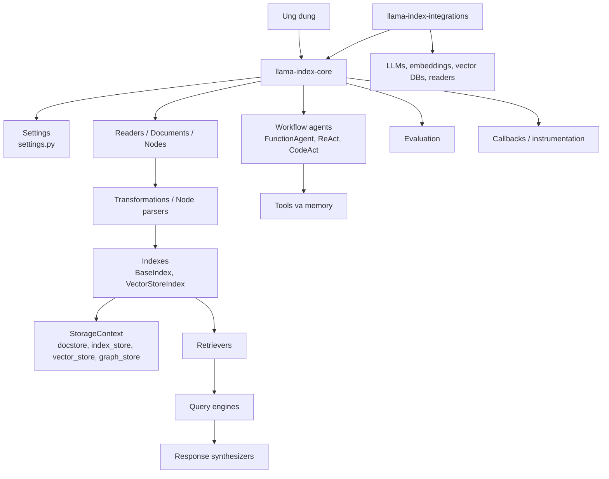
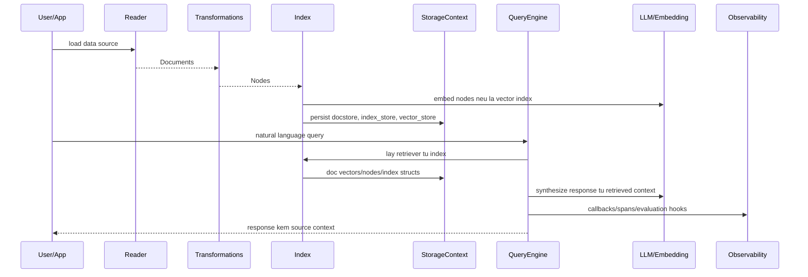
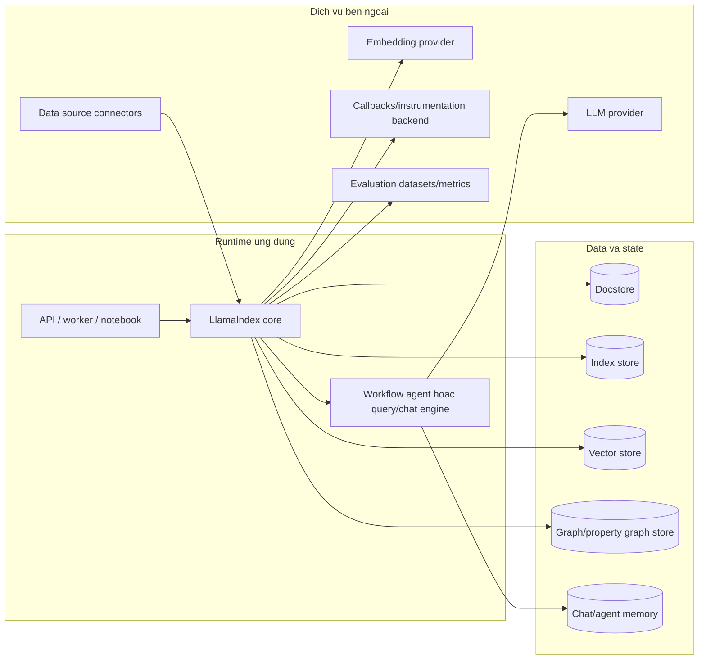
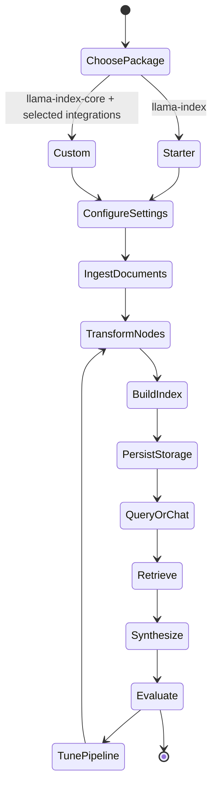
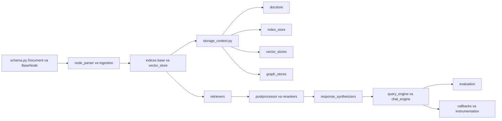
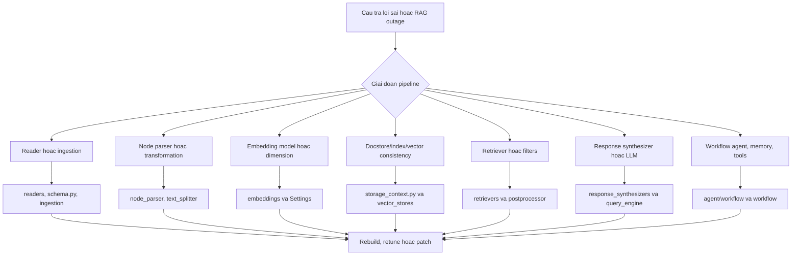
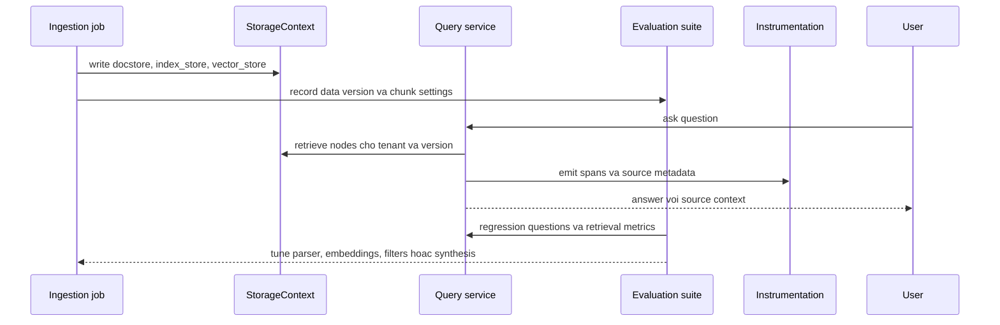

# Kiến trúc LlamaIndex

## Tóm tắt điều hành

LlamaIndex là framework mã nguồn mở cho ứng dụng LLM có dữ liệu riêng và ứng dụng agentic. `README.md` ở root mô tả nó là bộ công cụ để tăng cường LLM bằng private data thông qua connector, index, graph, retrieval/query interface và integration. Trong checkout này, starter distribution `llama-index` là package mỏng phụ thuộc vào `llama-index-core`, integration LLM/embedding OpenAI và `nltk`. Trung tâm kiến trúc là `llama-index-core/llama_index/core`, trong khi `llama-index-integrations/` chứa hàng trăm package provider-specific cho LLM, embedding, vector store, reader, tool, memory, graph store và nhiều loại khác.

`pyproject.toml` phát hành `llama-index` phiên bản `0.14.22`. `llama-index-core/pyproject.toml` phát hành `llama-index-core` phiên bản `0.14.22`, yêu cầu Python `>=3.10,<4.0` và phụ thuộc SQLAlchemy, fsspec, httpx, nltk, numpy, tenacity, tiktoken, aiohttp, networkx, PyYAML, pydantic, `llama-index-workflows` và các thư viện runtime khác. `llama-index-instrumentation` là package riêng cho observability và spans.

## Vấn đề được giải quyết

LlamaIndex giải quyết bài toán "LLM trên dữ liệu của tôi". Nó cung cấp primitive cho ingestion, transformation, indexing, storage, retrieval, query synthesis, chat engine, agent, workflow, evaluation và observability. Một nhóm có thể dùng nó như framework RAG năm dòng code, hoặc như kiến trúc modular nơi từng bước đều có thể thay thế: reader, node parser, embedding model, vector store, retriever, reranker, response synthesizer, tool, memory và workflow agent.

## Vai trò trong AI Stack

| Lớp | Vai trò của repository | Căn cứ trong repo |
| --- | --- | --- |
| Data ingestion | Readers, documents, nodes, transformations, node parsers | `llama-index-core/llama_index/core/readers`, `schema.py`, `node_parser/` |
| Index và retrieval | BaseIndex, VectorStoreIndex, retrievers, query engines | `indices/base.py`, `indices/vector_store/base.py`, `retrievers/`, `query_engine/` |
| Storage | Document store, index store, vector stores, graph stores, storage context | `storage/storage_context.py`, `storage/`, `vector_stores/`, `graph_stores/` |
| Agentic apps | Workflow agents, FunctionAgent, ReAct, CodeAct, tools, memory | `agent/workflow/`, `tools/`, `memory/`, `workflow/` |
| Hệ sinh thái integration | Provider-specific packages trên nhiều category | `llama-index-integrations/` |
| Observability/evaluation | Callbacks, instrumentation, evaluators, retrieval metrics | `callbacks/`, `instrumentation/`, `evaluation/`, `llama-index-instrumentation/` |

## Bản đồ cây nguồn

```text
llama_index/
  README.md                              # tổng quan framework và ví dụ
  pyproject.toml                         # metadata starter package
  docs/                                  # docs framework, examples, use cases, optimizing
  llama-index-core/
    pyproject.toml                       # metadata core package
    llama_index/core/
      schema.py                          # Document, BaseNode, metadata/resource schemas
      settings.py                        # Settings global cho LLM, embedding, transformations
      indices/                           # BaseIndex, VectorStoreIndex, graph/list/tree/etc.
      storage/                           # StorageContext, docstore, index_store, chat_store
      vector_stores/                     # core vector store types và simple store
      query_engine/                      # module điều phối query
      retrievers/                        # chiến lược retrieval
      response_synthesizers/             # generation trên retrieved context
      agent/workflow/                    # workflow-based agents và events
      workflow/                          # event-driven workflow engine
      tools/                             # BaseTool, FunctionTool, query/retriever tools
      evaluation/                        # correctness, faithfulness, relevancy, retrieval metrics
      callbacks/ and instrumentation/     # observability hooks
  llama-index-integrations/
    llms/ embeddings/ vector_stores/ readers/ tools/ memory/ graph_stores/ ...
  llama-index-instrumentation/           # package instrumentation riêng
  llama-index-utils/                     # utility integration packages
  llama-dev/                             # release, package và CLI tooling
  scripts/                               # publish, docs sync, integration health checks
```

## Sơ đồ thành phần



## Khái niệm lõi

- `Document` và `BaseNode`: object dữ liệu trong `llama_index/core/schema.py`. Document được ingest rồi transform thành node để index và retrieve.
- `Settings`: cấu hình global trong `llama_index/core/settings.py`, gồm LLM mặc định, embedding model, tokenizer, callback manager và transformations.
- `BaseIndex`: index abstract trong `indices/base.py`. Nó build index structure từ nodes, ghi index structure vào `StorageContext`, hỗ trợ insert/delete và expose chuyển đổi sang query/chat/retriever.
- `VectorStoreIndex`: vector index cụ thể trong `indices/vector_store/base.py`. Nó resolve embedding model, embed node theo batch, ghi embedding vào vector store và có thể khởi tạo từ vector store đã lưu text.
- `StorageContext`: dataclass trong `storage/storage_context.py`, gom docstore, index store, vector stores, graph store và property graph store tùy chọn. Nó có thể khởi tạo bằng in-memory default hoặc từ thư mục persisted.
- `BaseRetriever` và `BaseQueryEngine`: abstraction query lõi trong `base/base_retriever.py` và `base/base_query_engine.py`.
- `BaseTool` và `AsyncBaseTool`: tool contract trong `tools/types.py`, có metadata, schema, output, thực thi sync/async và adapter.
- Workflow agents: `agent/workflow/base_agent.py` kết hợp `Workflow`, Pydantic config, tools, tool retriever, handoff targets, memory, LLM, structured output, streaming và early stopping.

## Kiến trúc nội bộ

LlamaIndex core được xây như pipeline gồm các component có thể thay thế. `BaseIndex.from_documents` ghi document hash vào docstore, chạy transformations đã cấu hình, tạo nodes, build index struct và lưu struct đó vào index store. `VectorStoreIndex` chuyên biệt hóa bằng cách resolve embedding model, embed batch node, add vào vector store đã cấu hình và lưu node metadata trong docstore/index structure khi vector store không lưu text.

Phía query tách retrieval khỏi synthesis. Index sinh retriever; retriever trả về candidate nodes; postprocessor và reranker có thể chỉnh candidate; response synthesizer tạo câu trả lời cuối bằng LLM. Chat engine thêm conversational memory trên cùng dữ liệu. Module agent workflow thêm tool selection, state, handoff, structured output và event-driven workflow execution.

## Luồng runtime và dữ liệu



## Điểm mở rộng

- Thêm readers dưới `llama-index-integrations/readers/` hoặc implement reader contract trong core.
- Thêm LLM hoặc embedding dưới `llama-index-integrations/llms/` và `embeddings/`.
- Thêm vector store dưới `llama-index-integrations/vector_stores/` bằng cách implement core vector store types.
- Thêm retriever, postprocessor, response synthesizer, output parser hoặc selector dưới package core tương ứng.
- Thêm tools qua `BaseTool`, `FunctionTool`, query engine tools, retriever tools hoặc integration packages.
- Thêm workflow agent bằng cách mở rộng `BaseWorkflowAgent`, `FunctionAgent`, `ReActAgent`, `CodeActAgent` hoặc `MultiAgentWorkflow`.
- Thêm instrumentation handler bằng `llama-index-instrumentation` hoặc core callbacks.

## Tích hợp

Cây integration local rất rộng. `llama-index-integrations/llms/` gồm OpenAI, Azure OpenAI, Anthropic, Bedrock, Cohere, DeepSeek, Fireworks, Google GenAI, Groq, HuggingFace, LangChain, LiteLLM, llama.cpp, Mistral, NVIDIA, Ollama, OpenRouter, Perplexity, Vertex và nhiều provider khác. `vector_stores/` gồm Azure AI Search, Chroma, Elasticsearch, FAISS, LanceDB, Milvus, MongoDB, Neo4j, OpenSearch, PGVector/Postgres, Pinecone, Qdrant, Redis, Supabase, Timescale, Vespa, Weaviate, Zep và nhiều hơn. `readers/` gồm connector cho file, cloud storage, database, GitHub/GitLab, Jira, Confluence, hệ thống dạng Slack, LlamaParse và nhiều SaaS API.

## Sơ đồ triển khai và vận hành



Với production, hãy chọn package set tối thiểu thay vì cài toàn bộ integration. Dùng persistent storage cho docstore/index/vector/graph state; tách ingestion workload và query workload khi volume dữ liệu cao; đồng bộ embedding model, dimension vector store, chunking và retriever settings; và xem `Settings` là cấu hình global dùng chung cần kiểm soát chặt trong runtime multi-tenant.

## Observability, testing, evaluation và failure modes

Observability trong core gồm `callbacks/`, `instrumentation/` và package riêng `llama-index-instrumentation`. Package instrumentation có span handler, event handler, dispatcher, base events và test cho shutdown, propagation, manager, dispatcher. Module evaluation trong core gồm correctness, faithfulness, relevancy, context relevancy, semantic similarity, pairwise evaluation, batch runner, dataset generation và retrieval metrics.

Test trong `llama-index-core/tests/` bao phủ agents, callbacks, chat engines, embeddings, evaluation, graph stores, ingestion, indices, LLMs, memory, node parsers, postprocessors, programs, prompts, query engines, readers, response synthesizers, retrievers, schema, storage, tools, vector stores và voice agents. Root và package `pyproject.toml` cấu hình pytest, pytest-asyncio, pytest-cov, mypy, ruff, black, pre-commit và codespell.

Các failure mode cần thiết kế:

- ingestion connector trả về document malformed hoặc quá lớn;
- chiến lược chunking làm mất context quan trọng;
- embedding model không khớp dimension vector đã persist;
- vector store không lưu text, đòi hỏi docstore/index-store nhất quán;
- index stale sau khi document update;
- retrieval trả context không liên quan;
- response synthesizer hallucinate dù có retrieval;
- `Settings` global bị rò giữa tenant hoặc test;
- callback/instrumentation gây overhead hoặc log dữ liệu nhạy cảm;
- drift version package giữa core và integration packages.

## Rủi ro bảo mật và governance

LlamaIndex thường dùng với private data, nên governance là vấn đề trung tâm. Rủi ro gồm gửi tài liệu riêng tư tới model hoặc embedding provider bên ngoài, prompt injection từ nội dung đã index, reader connector không an toàn, rò dữ liệu giữa tenant qua `Settings` hoặc storage context dùng chung, thiếu ACL ở vector store, xóa document không triệt để, và thiếu source attribution. Root `README.md` cũng nhắc xác minh build asset cho cache `_static` nltk và tiktoken được đóng gói, có liên quan tới rà soát supply chain.

Control production nên gồm data classification trước ingestion, allowlist connector, storage context theo tenant, rà soát region và retention của provider, giữ source metadata, retrieval filters, đánh giá prompt injection, trace redaction và test rebuild/xóa index định kỳ.

## Sơ đồ lifecycle và phụ thuộc



## Cấu hình, triển khai và ghi chú ops

- Dùng `llama-index` cho quick start và `llama-index-core` cộng selected integrations cho deployment kiểm soát tốt.
- Giữ cấu hình LLM và embedding rõ ràng qua `Settings` hoặc constructor argument ở từng object.
- Persist `StorageContext` cho production; default in-memory phù hợp prototype và test.
- Chọn package vector store theo scale, filtering, metadata, tenancy và ownership vận hành.
- Giữ ingestion job idempotent bằng document hash và hành vi update/delete rõ ràng.
- Dùng module evaluation cho faithfulness, relevancy, correctness, semantic similarity và retrieval metrics trước release.
- Rà soát `_static` packaged assets và kỳ vọng build provenance khi vận hành trong môi trường bị khóa chặt.

## Hướng dẫn đọc mã nguồn

1. Đọc root `README.md` và `docs/src/content/docs/framework/getting_started/concepts.mdx`.
2. Đọc `llama-index-core/pyproject.toml` để hiểu phụ thuộc core.
3. Đọc `llama_index/core/schema.py`, `settings.py` và `storage/storage_context.py`.
4. Đọc `indices/base.py` và `indices/vector_store/base.py`.
5. Đọc `base/base_retriever.py`, `base/base_query_engine.py`, `response_synthesizers/` và `postprocessor/`.
6. Đọc `agent/workflow/base_agent.py` và `workflow/` cho agentic applications.
7. Với production, kiểm tra integration package sẽ dùng và tests của nó.

## Lộ trình học

1. Load file local bằng reader và kiểm tra metadata của `Document`.
2. Build `VectorStoreIndex.from_documents`.
3. Persist và reload `StorageContext`.
4. Tuning chunking, embedding model và vector store settings.
5. Chuyển index thành retriever, query engine và chat engine.
6. Thêm postprocessor, reranker hoặc custom response synthesis.
7. Thêm workflow agent với tools và memory.
8. Thêm evaluation và instrumentation trước khi deploy.

## Checklist sẵn sàng production

Sẵn sàng production với LlamaIndex nghĩa là xem ingestion, storage, retrieval, synthesis, agents và instrumentation như các contract tách biệt. Source tree thể hiện rõ các contract này trong `llama-index-core/llama_index/core` và các provider package dưới `llama-index-integrations/`.

| Khu vực | Neo theo repository | Kiểm tra kiến trúc |
| --- | --- | --- |
| Tối thiểu package | `pyproject.toml`, `llama-index-core/pyproject.toml`, `llama-index-integrations/` | Với deployment có kiểm soát, cài `llama-index-core` cộng integration cần dùng thay vì kéo mọi connector mặc định. |
| Lineage dữ liệu | `schema.py`, `readers/`, `node_parser/`, `ingestion/` | Giữ source ID, metadata, hash, tham số chunking và semantics update/delete. |
| Nhất quán storage | `storage/storage_context.py`, `vector_stores/`, `graph_stores/` | Đảm bảo docstore, index store, vector store và graph store được persist cùng version và cùng tenant scope. |
| Chất lượng retrieval | `retrievers/`, `postprocessor/`, `response_synthesizers/`, `evaluation/` | Đo retrieval relevance, source attribution, hallucination và chất lượng câu trả lời trước release. |
| Global settings | `settings.py` | Tránh rò rỉ LLM, embedding, tokenizer, callback hoặc transformation mặc định giữa tenant hoặc test. |
| Instrumentation | `callbacks/`, `instrumentation/`, `llama-index-instrumentation/` | Quyết định span và event có được chứa nội dung tài liệu riêng tư hay tenant ID hay không; redact khi cần. |



## Runbook vận hành và phân loại lỗi

Incident trong LlamaIndex thường đến từ dữ liệu stale, embedding mismatch, rò rỉ global configuration hoặc chất lượng retrieval, không chỉ từ một bug trong query engine. Triage nên đi theo đường dữ liệu: reader, node, index, store, retriever, synthesizer.



Với kiến trúc sư cấp cao, quyết định quan trọng nhất là deployment chỉ là một query engine đơn giản hay là một data application platform rộng hơn. Nếu ingestion và query chạy chung process, cập nhật dữ liệu lớn có thể làm tăng latency và khiến freshness khó kiểm soát. Tách ingestion jobs, version hóa storage context và giữ evaluation dataset thường dễ vận hành hơn.



## Ghi chú review cho kiến trúc sư cấp cao

Hãy review LlamaIndex như một data application framework, không chỉ là retrieval helper. Đường lõi từ `schema.py` sang `node_parser/`, `indices/`, `storage/storage_context.py`, `retrievers/`, `response_synthesizers/` và `query_engine/` định nghĩa lifecycle của một data product. Mọi quyết định production nên trả lời được data version nào, parser settings nào, embedding model nào, vector store namespace nào và response synthesis policy nào đã tạo ra một câu trả lời.

Tách ownership của ingestion khỏi ownership của query từ sớm. Ingestion code xử lý source connectors, document normalization, chunking, embeddings và persistence. Query code xử lý tenant filters, retrieval, reranking, source presentation và answer synthesis. Nếu cả hai sống trong cùng API process, operator sẽ khó kiểm soát freshness, partial reindexing và lỗi connector latency cao. Repository đã phản ánh sự tách lớp này qua `ingestion/`, `readers/`, `storage/`, `retrievers/` và `query_engine/`; production topology nên mirror điều đó.

`Settings` tiện nhưng nguy hiểm trong shared runtime. `llama_index/core/settings.py` có thể tập trung LLM, embedding, tokenizer, callback manager và transformations, rất hữu ích cho notebook và app đơn giản. Trong service multi-tenant, nên ưu tiên cấu hình explicit ở object level hoặc tenant-scoped factories để một request không thừa hưởng provider, callback policy hoặc embedding model của tenant khác.

Cuối cùng, hãy xem evaluation là một phần của kiến trúc. Các module dưới `evaluation/` không phải phần trang trí; chúng là feedback loop cho biết chunking, retrieval filters, reranking và response synthesis có hoạt động không. Một senior review nên yêu cầu retrieval metrics, faithfulness checks và source-attribution tests trước khi phê duyệt RAG pipeline cho workload user-facing.

## Thuật ngữ

- Document: item dữ liệu cấp cao được load từ source.
- Node: chunk hoặc đơn vị có cấu trúc sinh từ document để index và retrieve.
- Index: cấu trúc tổ chức node cho retrieval hoặc synthesis.
- VectorStoreIndex: index dựa trên embedding và vector store.
- StorageContext: container cho docstore, index store, vector stores, graph store và property graph store.
- Retriever: component trả về candidate nodes cho query.
- QueryEngine: luồng query end-to-end, retrieve context và synthesize answer.
- ResponseSynthesizer: component tạo answer từ retrieved context.
- WorkflowAgent: agent xây trên workflow engine của LlamaIndex, có tool, memory và state.
- Settings: default global cho LLM, embedding, callback, tokenizer và transformations.
