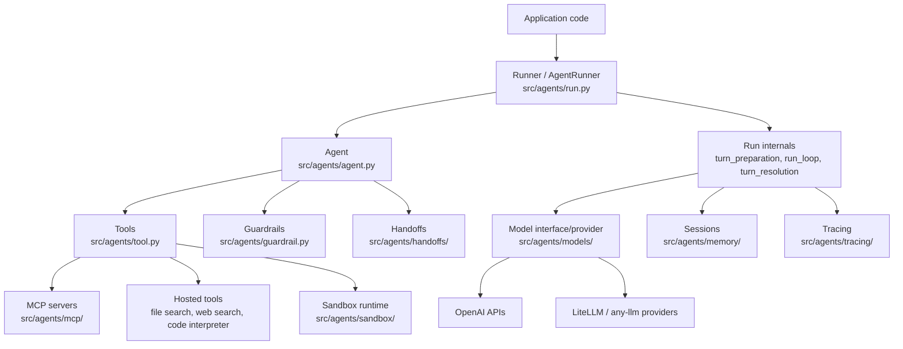
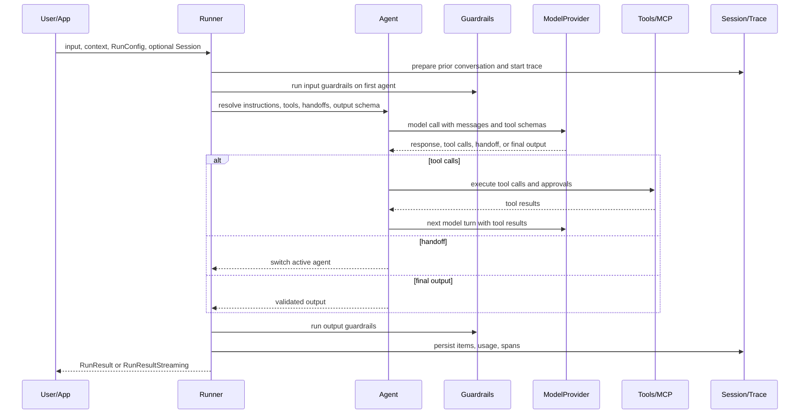
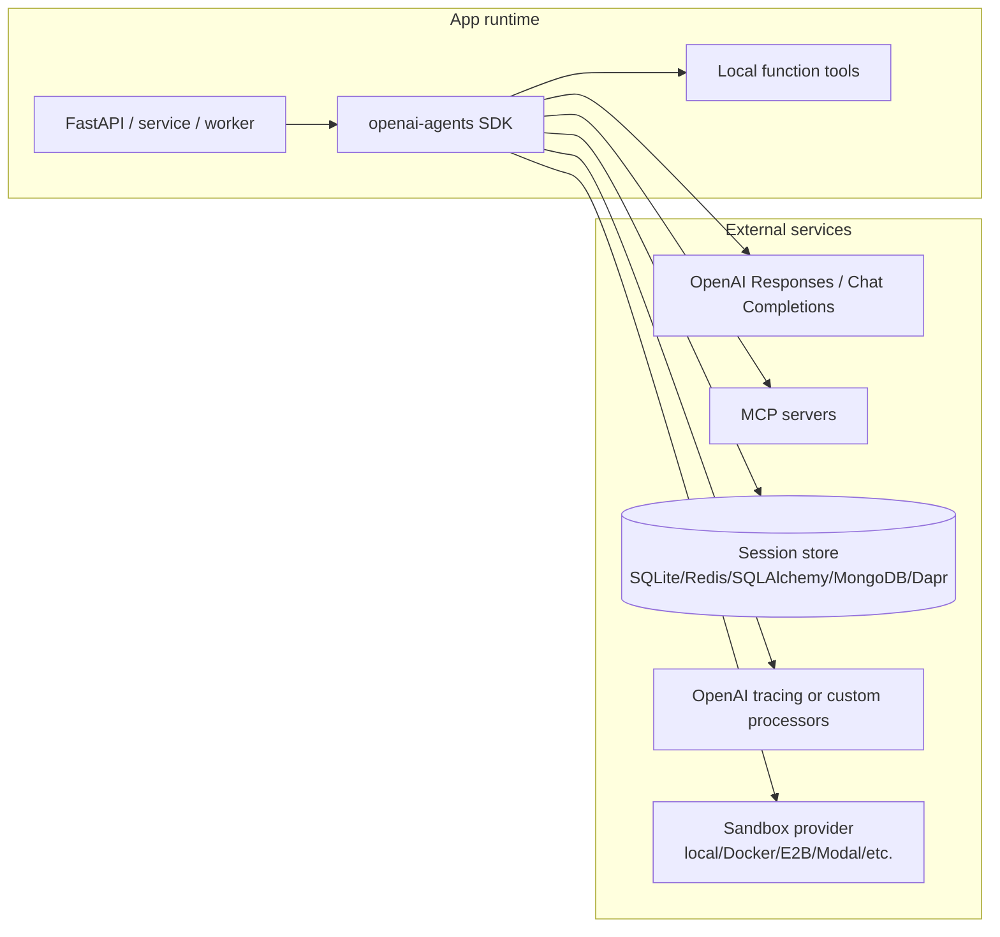
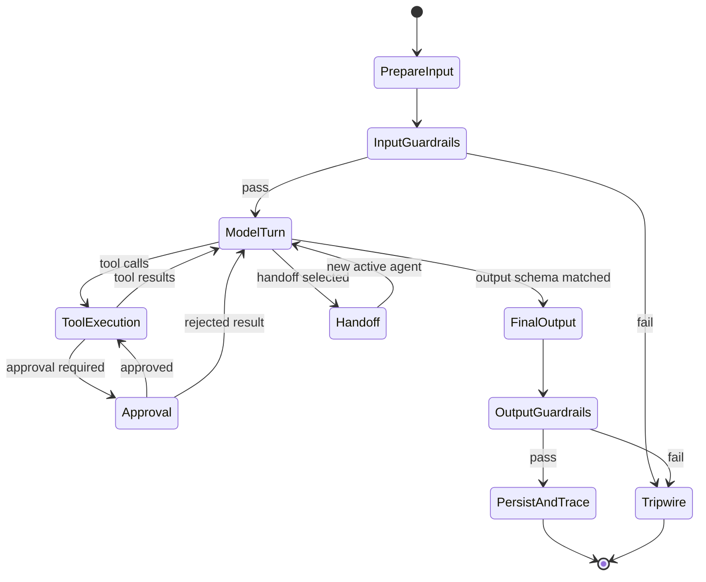
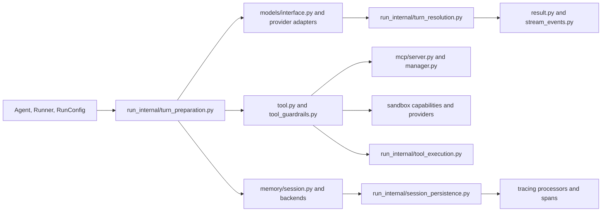
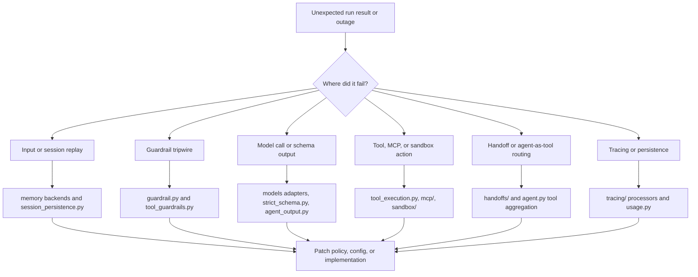
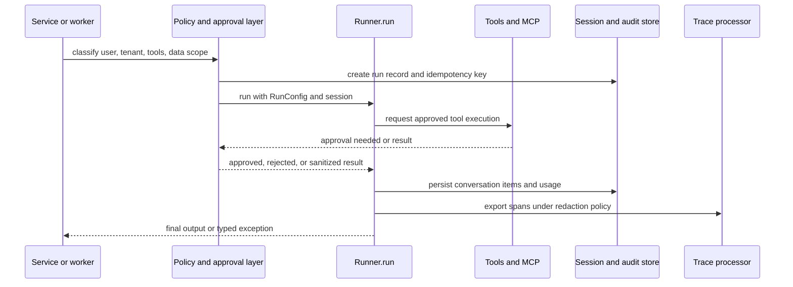

# OpenAI Agents Python Architecture

## Executive Summary

`openai-agents-python` is a Python SDK for building agentic and multi-agent workflows. The repository is organized around a small public API in `src/agents` and a larger set of runtime subsystems for model calls, tool execution, handoffs, sessions, guardrails, tracing, realtime/voice, MCP, and sandboxed long-running work. The local `README.md` positions it as a lightweight but powerful framework that supports the OpenAI Responses API, Chat Completions API, and non-OpenAI models through optional provider adapters.

The package metadata in `pyproject.toml` identifies the distribution as `openai-agents` version `0.17.4`, requiring Python `>=3.10`. Core dependencies include `openai`, `pydantic`, `griffelib`, `requests`, `websockets`, and `mcp`; optional dependency groups add voice, realtime, LiteLLM, any-llm, SQLAlchemy, encryption, Redis, Dapr, MongoDB, Docker, and several sandbox providers.

## Problem Solved

The SDK solves the problem of turning model calls into governed workflows. A typical AI application needs prompt management, structured outputs, tool schemas, model-provider selection, retries, streaming, memory, safety checks, and operational traces. This repository packages those concerns into an agent runtime where an `Agent` defines instructions, tools, guardrails, handoffs, and output type, while `Runner` and `AgentRunner` coordinate the turn loop.

## AI Stack Role

| Layer | Repository role | Grounding in repo |
| --- | --- | --- |
| Application orchestration | Agent loop, handoffs, nested agents, sandbox agents | `src/agents/agent.py`, `src/agents/run.py`, `src/agents/sandbox/` |
| Model abstraction | OpenAI Responses, Chat Completions, multi-provider model interface | `src/agents/models/interface.py`, `openai_responses.py`, `openai_chatcompletions.py`, `multi_provider.py` |
| Tooling | Function tools, hosted tools, shell/apply-patch tools, MCP, computer use | `src/agents/tool.py`, `src/agents/mcp/`, `docs/tools.md` |
| Governance | Input/output/tool guardrails, approval flows, sensitive trace controls | `src/agents/guardrail.py`, `src/agents/tool_guardrails.py`, `docs/guardrails.md` |
| Operations | Tracing, usage, retry, sessions, streaming, sandbox runtime | `src/agents/tracing/`, `usage.py`, `retry.py`, `memory/`, `run_internal/` |

## Source Tree Map

```text
openai-agents-python/
  README.md                    # product overview and quickstart
  pyproject.toml               # package metadata, extras, test/lint/type config
  mkdocs.yml                   # docs site configuration
  docs/                        # user guides for agents, running, tools, MCP, tracing
  examples/
    basic/                     # hello world, streaming, media, retry examples
    agent_patterns/            # routing, guardrails, HITL, agents-as-tools
    memory/                    # SQLite, SQLAlchemy, Redis, MongoDB, Dapr sessions
    mcp/                       # stdio, SSE, streamable HTTP MCP examples
    tools/                     # hosted tools, shell, codex, apply_patch examples
    voice/                     # static and streamed voice examples
  src/agents/
    agent.py                   # Agent, AgentBase, tool aggregation, agent-as-tool helpers
    run.py                     # Runner facade and AgentRunner implementation
    run_internal/              # turn loop, model retry, tool execution, streaming
    models/                    # model/provider abstractions and OpenAI adapters
    tool.py                    # function tools, hosted tools, shell, MCP, approvals
    guardrail.py               # input/output guardrails and tripwire decorators
    memory/                    # session interfaces and built-in session implementations
    mcp/                       # MCP server manager, server transports, tool conversion
    sandbox/                   # filesystem/runtime sandbox agent support
    realtime/                  # realtime agents and sessions
    voice/                     # speech pipeline, STT/TTS model providers
    tracing/                   # trace/span providers and processors
  tests/                       # unit and behavior tests
```

## Component Diagram



## Core Concepts

- `Agent`: the unit of behavior. `src/agents/agent.py` defines `AgentBase` and `Agent`, including name, instructions, tools, MCP servers, handoffs, guardrails, lifecycle hooks, output type, and model settings.
- `Runner`: the public execution facade. `src/agents/run.py` exposes `Runner.run`, `Runner.run_sync`, and streaming variants. The method docstring describes the loop: call the agent, stop on final output, hand off when requested, otherwise execute tools and run again.
- `RunConfig`: global run settings in `src/agents/run_config.py`, including model provider overrides, tracing controls, tool execution policy, sandbox settings, and limits.
- `Model` and `ModelProvider`: abstract model boundaries in `src/agents/models/interface.py`. OpenAI-specific implementations live beside provider adapters.
- `Tool`: a broad union in `src/agents/tool.py` covering function tools, file search, web search, computer use, MCP, code interpreter, image generation, local shell, hosted shell, apply-patch, custom tools, and tool search.
- `Guardrail`: input and output tripwire functions in `src/agents/guardrail.py`; tool guardrails are separated in `src/agents/tool_guardrails.py`.
- `Session`: conversation history abstraction under `src/agents/memory/`, with examples for SQLite, OpenAI conversation state, compaction, Redis, SQLAlchemy, MongoDB, Dapr, and encrypted sessions.
- `SandboxAgent`: a preconfigured long-horizon worker architecture under `src/agents/sandbox/`, surfaced in the `README.md` quickstart and examples.

## Internal Architecture

The public runtime starts in `Runner`, but the implementation is deliberately decomposed in `src/agents/run_internal/`. `turn_preparation.py` resolves model, tools, handoffs, output schema, and model input filters. `run_loop.py` exposes the coordination helpers that `run.py` imports. `turn_resolution.py` interprets model responses into final outputs, tool runs, handoffs, interruptions, or another turn. `tool_execution.py` executes function tools, computer actions, local shell calls, hosted shell calls, apply-patch calls, and computer tools. `session_persistence.py` prepares input from session history and saves run results back.

The SDK uses strong schemas throughout. `function_schema.py`, `strict_schema.py`, `agent_output.py`, and Pydantic-based tool definitions are used to validate tool inputs and structured outputs. The runtime raises domain errors such as max-turn, guardrail tripwire, model behavior, and tool timeout errors rather than leaving all failure handling to application code.

## Runtime and Data Flow



## Extension Points

- Add a function tool with `function_tool` in `src/agents/tool.py`; the SDK builds JSON schemas from Python signatures and docstrings.
- Implement a custom `Model` or `ModelProvider` using `src/agents/models/interface.py`, or use optional LiteLLM and any-llm adapters in `src/agents/extensions/models/`.
- Add lifecycle behavior with `RunHooksBase` and `AgentHooksBase` in `src/agents/lifecycle.py`.
- Add MCP servers through `src/agents/mcp/server.py` and `MCPServerManager` in `src/agents/mcp/manager.py`.
- Customize session storage by implementing `src/agents/memory/session.py`.
- Add tracing processors via `src/agents/tracing/processor_interface.py` and `processors.py`.
- Extend sandbox capability and provider behavior under `src/agents/sandbox/capabilities/`, `src/agents/sandbox/sandboxes/`, and `src/agents/extensions/sandbox/`.

## Integrations

The `pyproject.toml` optional extras show the intended integration surface: `voice`, `realtime`, `litellm`, `any-llm`, `sqlalchemy`, `encrypt`, `redis`, `dapr`, `mongodb`, `docker`, `blaxel`, `daytona`, `cloudflare`, `e2b`, `modal`, `runloop`, `vercel`, `s3`, and `temporal`. The examples directory gives concrete patterns for MCP transports, memory providers, shell and hosted tools, human-in-the-loop, and voice.

## Deployment and Operations Topology



Operationally, treat the SDK as an application library, not as a standalone server. Deploy it inside API services, background workers, notebooks, CLIs, or durable workflow systems. For production systems, pin optional extras deliberately, keep tool-side effects behind approvals, export traces only with sensitive-data policy reviewed, and isolate sandbox execution from the main application process.

## Observability, Testing, Evaluation, and Failure Modes

Tracing is a first-class subsystem under `src/agents/tracing/`. `docs/tracing.md` covers traces, spans, default tracing, custom processors, sensitive data, and integrations for non-OpenAI models. Usage accounting is represented in `src/agents/usage.py` and attached to run results and spans by the runner internals.

The repository uses `pytest`, `pytest-asyncio`, `pytest-xdist`, `coverage`, `ruff`, `mypy`, and `pyright` as declared in `pyproject.toml`. Examples under `examples/agent_patterns/` act as executable design references for guardrails, routing, deterministic flows, human-in-the-loop, and nested agents.

Key failure modes to design for:

- model behavior not matching expected structured output;
- tool JSON parsing or schema validation errors;
- tool timeouts and side-effect failures;
- guardrail tripwires;
- max-turn exhaustion;
- MCP server lifecycle failures;
- session persistence race conditions or partial writes;
- sandbox filesystem or network-policy misconfiguration;
- tracing leakage of sensitive input or output.

## Security and Governance Risks

The main risks are tool authority, MCP trust, sandbox escape or over-permission, data retention in sessions and traces, and accidental execution of model-proposed commands. `docs/mcp.md` explicitly distinguishes hosted MCP, streamable HTTP, SSE, stdio, server managers, approval flows, filtering, caching, and tracing. `docs/tools.md` covers hosted tools, local runtime tools, function tools, agents-as-tools, and approval gates. Production deployments should keep high-risk tools disabled by default, require approval for shell/apply-patch/computer actions, prefix MCP tool names when multiple servers are active, and redact or disable sensitive trace capture when needed.

## Lifecycle and Decision Diagram



## Configuration, Deployment, and Ops Notes

- Environment: set provider credentials such as `OPENAI_API_KEY` outside code. The README quickstart calls this out for sandbox examples.
- Installation: use `openai-agents` for core, and extras only when needed, for example `openai-agents[voice]`, `openai-agents[redis]`, or `openai-agents[litellm]`.
- Type discipline: the project is typed (`py.typed`) and uses strict mypy/pyright settings; downstream code should preserve type hints for tools and outputs.
- Sessions: choose a session backend based on durability, tenancy, and encryption requirements. The examples demonstrate SQLite, SQLAlchemy, Redis, MongoDB, Dapr, OpenAI session, compaction, and encrypted sessions.
- Sandbox: isolate workspace mounts and network policy. Sandbox provider extras have materially different operational risk and cost profiles.
- Streaming: use `RunResultStreaming` and stream events when low latency or nested tool visibility is required.

## Reading Guide

1. Start with `README.md`, `docs/quickstart.md`, and `docs/agents.md`.
2. Read `src/agents/agent.py` and `src/agents/run.py` to understand the public API.
3. Read `src/agents/run_internal/turn_preparation.py`, `turn_resolution.py`, and `tool_execution.py` to understand the runtime.
4. Read `docs/tools.md`, `docs/mcp.md`, `docs/guardrails.md`, and `docs/running_agents.md`.
5. For production, read `docs/tracing.md`, `docs/sessions/*`, and the relevant examples under `examples/memory/`, `examples/tools/`, and `examples/agent_patterns/`.

## Learning Path

1. Build a single `Agent` with a function tool.
2. Add structured output and output guardrails.
3. Add a session backend and inspect run history.
4. Convert a specialist agent into a tool, then compare that with a handoff.
5. Add MCP with static or dynamic tool filtering.
6. Add tracing and usage monitoring.
7. Prototype sandboxed long-horizon work with local or Docker sandbox before using remote providers.

## Production Readiness Checklist

Use this checklist when moving from examples under `examples/` into a service or worker that imports `src/agents`.

| Area | Repository anchor | Architecture check |
| --- | --- | --- |
| Agent loop limits | `src/agents/run.py`, `src/agents/run_config.py`, `src/agents/exceptions.py` | Set max turns, timeout policy, retry behavior, and clear handling for `MaxTurnsExceeded`, model behavior errors, and tool failures. |
| Tool authority | `src/agents/tool.py`, `src/agents/tool_guardrails.py`, `docs/tools.md` | Separate read-only tools, side-effecting tools, local shell tools, hosted tools, and `apply_patch` tools; require approval for high-impact actions. |
| MCP trust boundary | `src/agents/mcp/`, `docs/mcp.md`, `examples/mcp/` | Pin trusted servers, prefix tool names, filter tool catalogs, and treat server startup/lifecycle errors as runtime incidents. |
| Session durability | `src/agents/memory/`, `examples/memory/` | Select SQLite/SQLAlchemy/Redis/MongoDB/Dapr/OpenAI session storage based on tenant isolation, encryption, and replay requirements. |
| Trace safety | `src/agents/tracing/`, `docs/tracing.md` | Decide whether traces may contain prompts, tool arguments, outputs, and usage data; redact or disable sensitive capture where required. |
| Sandbox isolation | `src/agents/sandbox/`, `docs/sandbox_agents.md`, `examples/tools/` | Keep filesystem mounts, network policy, credentials, and provider-specific sandbox cost limits outside the main app trust boundary. |



## Operational Runbook And Failure Triage

The most useful production runbook is organized around the turn loop. A failure is usually not "the agent failed"; it is a specific stage failing: input preparation, guardrail evaluation, model call, tool execution, handoff resolution, session persistence, or tracing export. The files under `src/agents/run_internal/` make that decomposition visible and are the right starting point for incident analysis.



For senior architects, the key design decision is whether this SDK remains a synchronous application library or becomes part of a durable workflow system. If tool calls can mutate external systems, wrap `Runner.run` calls with idempotency keys, approval state, compensating actions, and durable audit records. If the agent is used for long-running sandbox work, store state outside the process and define what happens when a sandbox provider, MCP server, or model provider is unavailable mid-turn.



## Senior Architect Review Notes

Review `openai-agents-python` as a runtime library with explicit trust boundaries rather than as a prompt helper. The public API in `src/agents/agent.py`, `src/agents/run.py`, and `src/agents/run_config.py` is small, but the blast radius comes from the subsystems it can invoke: `src/agents/tool.py`, `src/agents/mcp/`, `src/agents/sandbox/`, `src/agents/memory/`, and `src/agents/tracing/`. In an architecture review, ask which of those subsystems are enabled for each tenant and which are disabled at import, config, or policy time.

Pay special attention to schema ownership. `src/agents/function_schema.py`, `strict_schema.py`, `agent_output.py`, and the model adapters in `src/agents/models/` collectively define how Python types, JSON schemas, model responses, and tool arguments are converted. If an application uses function tools that call financial, security, deployment, or data-modifying systems, schema validation is necessary but not sufficient; the application still needs authorization and business-rule validation outside the model turn.

Treat `Session` and `Trace` as separate governance domains. Session storage under `src/agents/memory/` is part of product state, while spans under `src/agents/tracing/` are operational telemetry. They may have different retention periods, tenant access rules, encryption requirements, and incident response obligations. The examples under `examples/memory/` are useful starting points, but production systems should document replay, deletion, and redaction behavior before agents are exposed to real user data.

## Glossary

- Agent: a configured model actor with instructions, tools, guardrails, handoffs, and output contract.
- Runner: the component that executes the agent loop.
- Turn: one model invocation plus any resulting tool planning and execution.
- Handoff: transfer of control from one agent to another.
- Agent as tool: nested agent execution exposed as a tool call.
- Guardrail: validation logic that can trip a workflow before or after model execution.
- MCP: Model Context Protocol, used to expose external tools and prompts to agents.
- Session: persistent conversation history between runs.
- Trace: structured execution telemetry made of traces and spans.
- Sandbox Agent: an agent configured to operate over a controlled filesystem/runtime.
