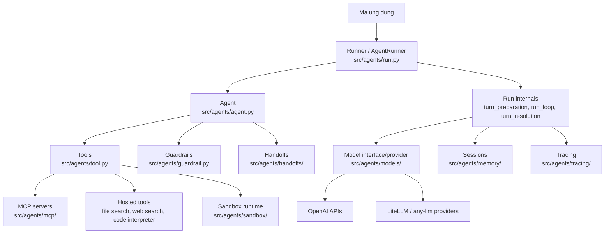
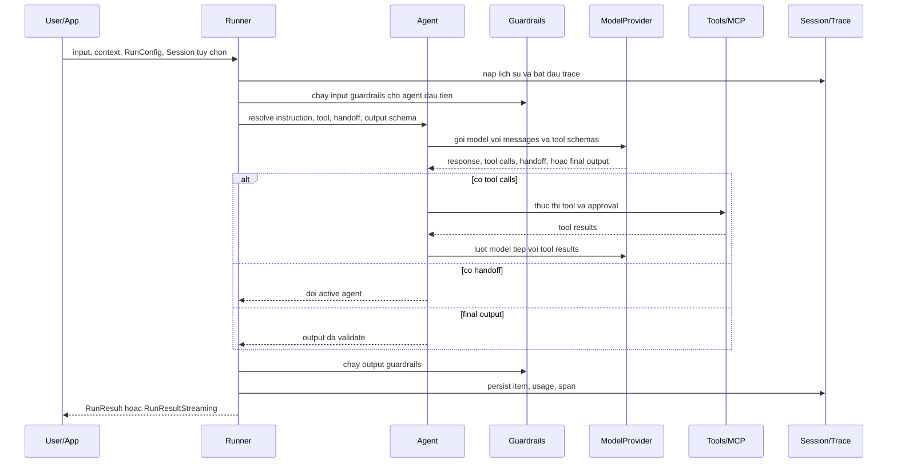
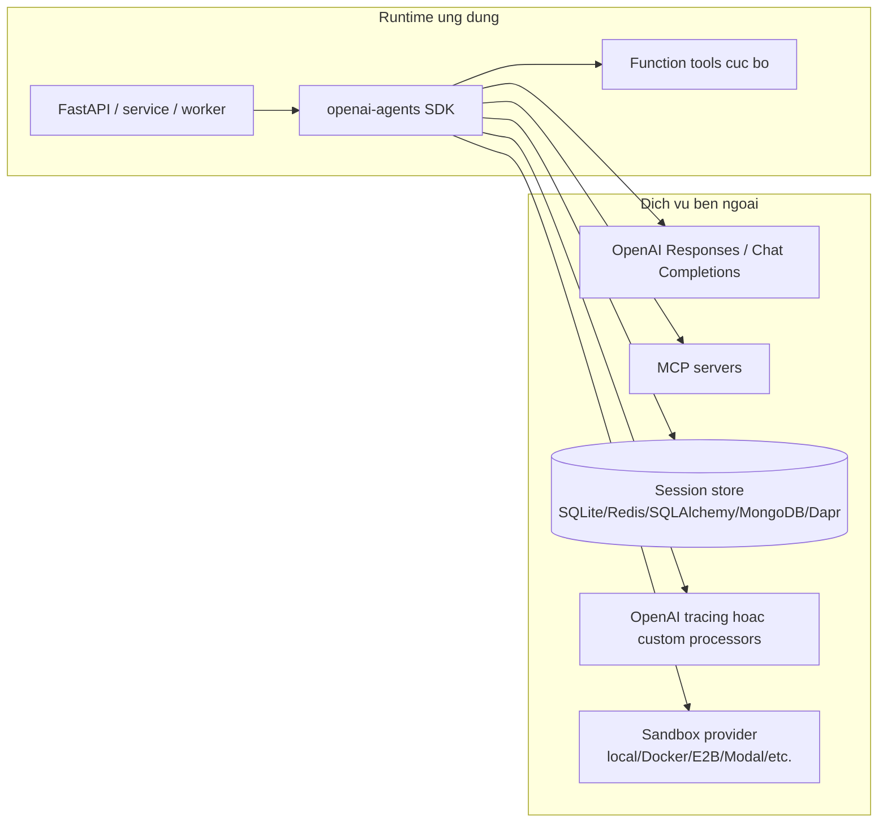
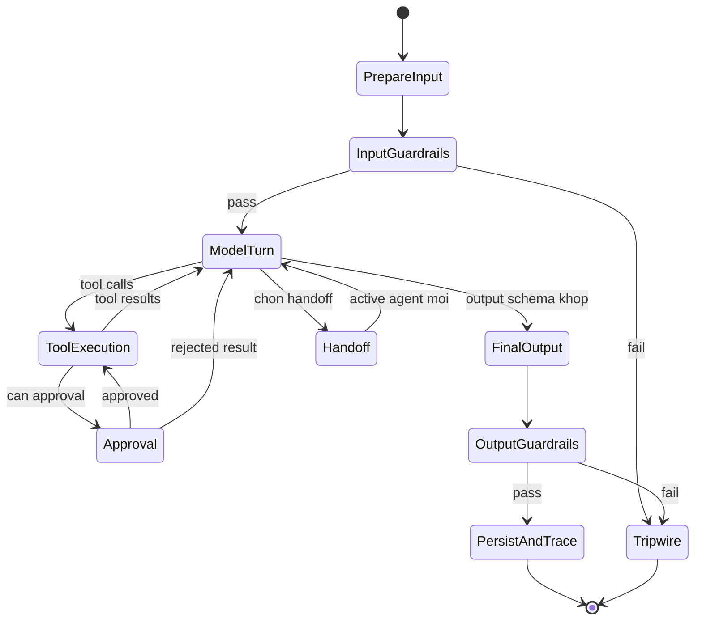
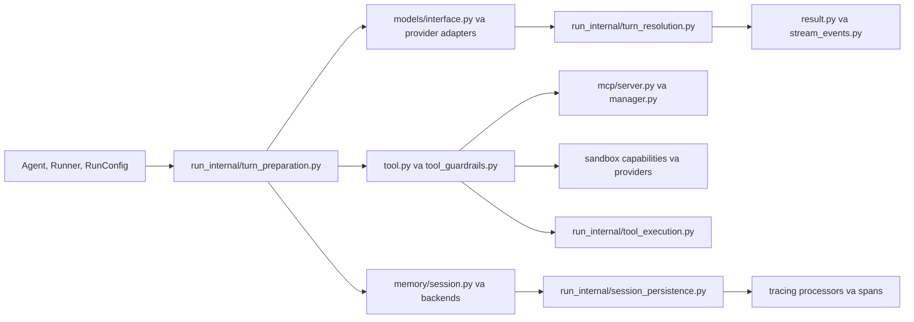
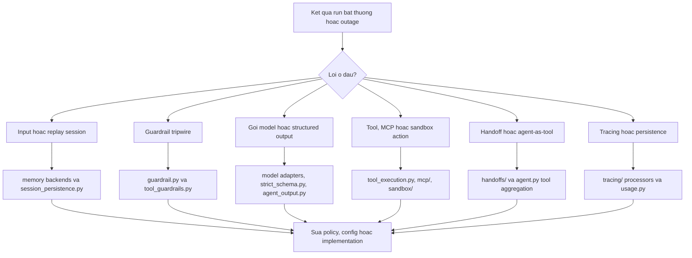
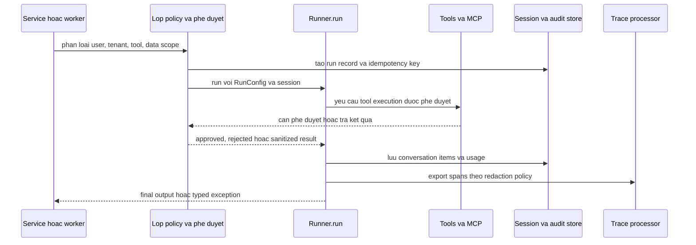

# Kiến trúc OpenAI Agents Python

## Tóm tắt điều hành

`openai-agents-python` là SDK Python để xây dựng workflow agent và multi-agent. Repository này có API công khai tương đối gọn trong `src/agents`, nhưng phía dưới là nhiều phân hệ runtime cho gọi model, thực thi tool, handoff, session, guardrail, tracing, realtime/voice, MCP và sandbox cho tác vụ dài hạn. `README.md` mô tả SDK là framework nhẹ nhưng đủ mạnh, hỗ trợ OpenAI Responses API, Chat Completions API và các model ngoài OpenAI thông qua adapter tùy chọn.

Theo `pyproject.toml`, package phát hành là `openai-agents` phiên bản `0.17.4`, yêu cầu Python `>=3.10`. Phụ thuộc lõi gồm `openai`, `pydantic`, `griffelib`, `requests`, `websockets` và `mcp`. Các nhóm tùy chọn bổ sung voice, realtime, LiteLLM, any-llm, SQLAlchemy, mã hóa, Redis, Dapr, MongoDB, Docker và nhiều provider sandbox.

## Vấn đề được giải quyết

SDK giải quyết bài toán biến lời gọi model thành workflow có kiểm soát. Một ứng dụng AI thực tế cần quản lý prompt, structured output, schema của tool, lựa chọn provider, retry, streaming, bộ nhớ hội thoại, kiểm tra an toàn và trace vận hành. Repository này đóng gói các mối quan tâm đó vào runtime agent: `Agent` định nghĩa instruction, tool, guardrail, handoff và kiểu output; `Runner` và `AgentRunner` điều phối vòng lặp từng lượt.

## Vai trò trong AI Stack

| Lớp | Vai trò của repository | Căn cứ trong repo |
| --- | --- | --- |
| Điều phối ứng dụng | Agent loop, handoff, nested agent, sandbox agent | `src/agents/agent.py`, `src/agents/run.py`, `src/agents/sandbox/` |
| Trừu tượng model | OpenAI Responses, Chat Completions, interface multi-provider | `src/agents/models/interface.py`, `openai_responses.py`, `openai_chatcompletions.py`, `multi_provider.py` |
| Tooling | Function tool, hosted tool, shell/apply-patch, MCP, computer use | `src/agents/tool.py`, `src/agents/mcp/`, `docs/tools.md` |
| Governance | Guardrail input/output/tool, approval flow, kiểm soát dữ liệu nhạy cảm trong trace | `src/agents/guardrail.py`, `src/agents/tool_guardrails.py`, `docs/guardrails.md` |
| Vận hành | Tracing, usage, retry, session, streaming, sandbox runtime | `src/agents/tracing/`, `usage.py`, `retry.py`, `memory/`, `run_internal/` |

## Bản đồ cây nguồn

```text
openai-agents-python/
  README.md                    # tổng quan và quickstart
  pyproject.toml               # metadata package, extras, cấu hình test/lint/type
  mkdocs.yml                   # cấu hình site tài liệu
  docs/                        # hướng dẫn agents, running, tools, MCP, tracing
  examples/
    basic/                     # hello world, streaming, media, retry
    agent_patterns/            # routing, guardrails, HITL, agents-as-tools
    memory/                    # SQLite, SQLAlchemy, Redis, MongoDB, Dapr sessions
    mcp/                       # ví dụ MCP stdio, SSE, streamable HTTP
    tools/                     # hosted tools, shell, codex, apply_patch
    voice/                     # ví dụ voice static và streamed
  src/agents/
    agent.py                   # Agent, AgentBase, gom tool, agent-as-tool
    run.py                     # facade Runner và AgentRunner
    run_internal/              # turn loop, model retry, tool execution, streaming
    models/                    # trừu tượng model/provider và adapter OpenAI
    tool.py                    # function tools, hosted tools, shell, MCP, approval
    guardrail.py               # guardrail input/output và decorator tripwire
    memory/                    # interface session và session tích hợp sẵn
    mcp/                       # MCP server manager, transport, chuyển đổi tool
    sandbox/                   # hỗ trợ agent làm việc trên filesystem/runtime cô lập
    realtime/                  # realtime agents và sessions
    voice/                     # pipeline speech, STT/TTS provider
    tracing/                   # trace/span provider và processor
  tests/                       # test hành vi và unit test
```

## Sơ đồ thành phần



## Khái niệm lõi

- `Agent`: đơn vị hành vi chính. `src/agents/agent.py` định nghĩa `AgentBase` và `Agent`, gồm tên, instruction, tool, MCP server, handoff, guardrail, lifecycle hook, output type và model settings.
- `Runner`: facade thực thi công khai. `src/agents/run.py` cung cấp `Runner.run`, `Runner.run_sync` và các biến thể streaming. Docstring mô tả vòng lặp: gọi agent, dừng khi có final output, chuyển agent khi có handoff, nếu không thì chạy tool rồi gọi model tiếp.
- `RunConfig`: cấu hình toàn run trong `src/agents/run_config.py`, gồm override model provider, tracing, policy thực thi tool, sandbox và limit.
- `Model` và `ModelProvider`: ranh giới trừu tượng của model trong `src/agents/models/interface.py`. Adapter OpenAI và provider khác nằm trong cùng cây `models/`.
- `Tool`: tập hợp rộng trong `src/agents/tool.py`, bao gồm function tool, file search, web search, computer use, MCP, code interpreter, image generation, local shell, hosted shell, apply-patch, custom tool và tool search.
- `Guardrail`: hàm tripwire input/output trong `src/agents/guardrail.py`; guardrail cho tool tách riêng ở `src/agents/tool_guardrails.py`.
- `Session`: trừu tượng lưu lịch sử hội thoại dưới `src/agents/memory/`, với ví dụ SQLite, OpenAI conversation state, compaction, Redis, SQLAlchemy, MongoDB, Dapr và encrypted session.
- `SandboxAgent`: kiến trúc worker dài hạn đã cấu hình sẵn trong `src/agents/sandbox/`, được đưa vào quickstart của `README.md` và thư mục ví dụ.

## Kiến trúc nội bộ

Runtime công khai bắt đầu từ `Runner`, nhưng phần triển khai được chia nhỏ trong `src/agents/run_internal/`. `turn_preparation.py` xử lý model, tool, handoff, output schema và bộ lọc input trước khi gọi model. `run_loop.py` tập hợp helper điều phối mà `run.py` dùng. `turn_resolution.py` diễn giải response của model thành final output, tool run, handoff, interruption hoặc lượt tiếp theo. `tool_execution.py` thực thi function tool, computer action, local shell, hosted shell, apply-patch và computer tool. `session_persistence.py` chuẩn bị input từ session và ghi kết quả trở lại.

SDK dùng schema chặt chẽ ở nhiều điểm. `function_schema.py`, `strict_schema.py`, `agent_output.py` và các định nghĩa tool dựa trên Pydantic dùng để validate input tool và structured output. Runtime có các lỗi domain như vượt max turn, guardrail tripwire, lỗi hành vi model và timeout tool, giúp ứng dụng xử lý có chủ đích hơn.

## Luồng runtime và dữ liệu



## Điểm mở rộng

- Thêm function tool bằng `function_tool` trong `src/agents/tool.py`; SDK tạo JSON schema từ chữ ký hàm và docstring Python.
- Tự triển khai `Model` hoặc `ModelProvider` dựa trên `src/agents/models/interface.py`, hoặc dùng adapter LiteLLM và any-llm trong `src/agents/extensions/models/`.
- Gắn lifecycle behavior bằng `RunHooksBase` và `AgentHooksBase` trong `src/agents/lifecycle.py`.
- Thêm MCP server qua `src/agents/mcp/server.py` và `MCPServerManager` trong `src/agents/mcp/manager.py`.
- Tùy biến session storage bằng cách triển khai `src/agents/memory/session.py`.
- Thêm tracing processor qua `src/agents/tracing/processor_interface.py` và `processors.py`.
- Mở rộng sandbox capability và provider trong `src/agents/sandbox/capabilities/`, `src/agents/sandbox/sandboxes/` và `src/agents/extensions/sandbox/`.

## Tích hợp

Các optional extras trong `pyproject.toml` cho thấy bề mặt tích hợp chính: `voice`, `realtime`, `litellm`, `any-llm`, `sqlalchemy`, `encrypt`, `redis`, `dapr`, `mongodb`, `docker`, `blaxel`, `daytona`, `cloudflare`, `e2b`, `modal`, `runloop`, `vercel`, `s3` và `temporal`. Thư mục `examples/` cung cấp mẫu cụ thể cho MCP transport, memory provider, shell và hosted tool, human-in-the-loop và voice.

## Sơ đồ triển khai và vận hành



Về vận hành, hãy xem SDK là thư viện ứng dụng, không phải server độc lập. Nó có thể chạy trong API service, background worker, notebook, CLI hoặc durable workflow system. Với production, nên pin optional extras có chủ đích, đặt approval trước tool có side effect, rà soát chính sách dữ liệu nhạy cảm khi export trace và tách sandbox execution khỏi process ứng dụng chính.

## Observability, testing, evaluation và failure modes

Tracing là phân hệ hạng nhất trong `src/agents/tracing/`. `docs/tracing.md` trình bày trace, span, default tracing, custom processor, dữ liệu nhạy cảm và tích hợp khi dùng model ngoài OpenAI. Usage accounting nằm trong `src/agents/usage.py` và được runner internals gắn vào kết quả run và span.

Repository dùng `pytest`, `pytest-asyncio`, `pytest-xdist`, `coverage`, `ruff`, `mypy` và `pyright` theo `pyproject.toml`. Các ví dụ trong `examples/agent_patterns/` là tài liệu thiết kế có thể chạy cho guardrail, routing, luồng deterministic, human-in-the-loop và nested agent.

Các failure mode cần thiết kế trước:

- model không tạo structured output đúng schema;
- lỗi parse JSON hoặc validate schema của tool;
- timeout tool và lỗi side effect;
- guardrail tripwire;
- vượt giới hạn max turn;
- lỗi lifecycle của MCP server;
- race condition hoặc ghi thiếu trong session persistence;
- cấu hình sai filesystem hoặc network policy của sandbox;
- rò rỉ dữ liệu nhạy cảm qua tracing.

## Rủi ro bảo mật và governance

Rủi ro chính là quyền hạn của tool, mức tin cậy MCP, sandbox quá rộng quyền hoặc bị escape, lưu giữ dữ liệu trong session/trace và chạy lệnh do model đề xuất. `docs/mcp.md` phân biệt hosted MCP, streamable HTTP, SSE, stdio, server manager, approval flow, filtering, caching và tracing. `docs/tools.md` bao phủ hosted tool, local runtime tool, function tool, agents-as-tools và approval gate. Khi deploy production, nên tắt tool rủi ro cao theo mặc định, yêu cầu approval cho shell/apply-patch/computer action, prefix tên MCP tool khi có nhiều server và redact hoặc tắt sensitive trace khi cần.

## Sơ đồ lifecycle và quyết định



## Cấu hình, triển khai và ghi chú ops

- Môi trường: đặt credential provider như `OPENAI_API_KEY` ngoài code. Quickstart trong `README.md` nhắc điều này cho ví dụ sandbox.
- Cài đặt: dùng `openai-agents` cho lõi, chỉ thêm extras khi cần, ví dụ `openai-agents[voice]`, `openai-agents[redis]` hoặc `openai-agents[litellm]`.
- Type discipline: dự án có `py.typed` và dùng mypy/pyright nghiêm ngặt; code downstream nên giữ type hint cho tool và output.
- Sessions: chọn backend theo độ bền, tenancy và yêu cầu mã hóa. Ví dụ có SQLite, SQLAlchemy, Redis, MongoDB, Dapr, OpenAI session, compaction và encrypted session.
- Sandbox: cô lập workspace mount và network policy. Các provider sandbox có khác biệt lớn về rủi ro vận hành và chi phí.
- Streaming: dùng `RunResultStreaming` và stream events khi cần latency thấp hoặc quan sát nested tool.

## Hướng dẫn đọc mã nguồn

1. Bắt đầu với `README.md`, `docs/quickstart.md` và `docs/agents.md`.
2. Đọc `src/agents/agent.py` và `src/agents/run.py` để hiểu API công khai.
3. Đọc `src/agents/run_internal/turn_preparation.py`, `turn_resolution.py` và `tool_execution.py` để hiểu runtime.
4. Đọc `docs/tools.md`, `docs/mcp.md`, `docs/guardrails.md` và `docs/running_agents.md`.
5. Với production, đọc `docs/tracing.md`, `docs/sessions/*` và ví dụ liên quan trong `examples/memory/`, `examples/tools/`, `examples/agent_patterns/`.

## Lộ trình học

1. Tạo một `Agent` đơn giản với function tool.
2. Thêm structured output và output guardrail.
3. Thêm session backend và xem lịch sử run.
4. Chuyển một specialist agent thành tool, rồi so sánh với handoff.
5. Thêm MCP với static hoặc dynamic tool filtering.
6. Thêm tracing và usage monitoring.
7. Thử sandboxed long-horizon work bằng local hoặc Docker sandbox trước khi dùng provider remote.

## Checklist sẵn sàng production

Dùng checklist này khi chuyển từ các ví dụ trong `examples/` sang service, worker hoặc notebook vận hành thật có import `src/agents`.

| Khu vực | Neo theo repository | Kiểm tra kiến trúc |
| --- | --- | --- |
| Giới hạn vòng lặp agent | `src/agents/run.py`, `src/agents/run_config.py`, `src/agents/exceptions.py` | Cấu hình max turns, timeout, retry và cách xử lý `MaxTurnsExceeded`, lỗi hành vi model, lỗi tool. |
| Quyền hạn của tool | `src/agents/tool.py`, `src/agents/tool_guardrails.py`, `docs/tools.md` | Tách tool chỉ đọc, tool có side effect, local shell, hosted tool và `apply_patch`; yêu cầu phê duyệt cho thao tác rủi ro cao. |
| Ranh giới tin cậy MCP | `src/agents/mcp/`, `docs/mcp.md`, `examples/mcp/` | Chỉ dùng server đáng tin cậy, prefix tên tool, lọc catalog tool và xem lỗi lifecycle server là incident runtime. |
| Độ bền session | `src/agents/memory/`, `examples/memory/` | Chọn SQLite/SQLAlchemy/Redis/MongoDB/Dapr/OpenAI session theo yêu cầu tenant, mã hóa và replay. |
| An toàn trace | `src/agents/tracing/`, `docs/tracing.md` | Quyết định trace có được chứa prompt, tham số tool, output và usage hay không; redact hoặc tắt capture khi cần. |
| Cô lập sandbox | `src/agents/sandbox/`, `docs/sandbox_agents.md`, `examples/tools/` | Kiểm soát mount filesystem, network policy, credential và giới hạn chi phí sandbox ngoài trust boundary của app chính. |



## Runbook vận hành và phân loại lỗi

Runbook production hữu ích nhất nên bám vào turn loop. Một lỗi hiếm khi chỉ là "agent hỏng"; thường nó nằm ở một chặng cụ thể: chuẩn bị input, guardrail, gọi model, chạy tool, handoff, lưu session hoặc export trace. Các file trong `src/agents/run_internal/` thể hiện rõ cách tách lớp này và là điểm đọc đầu tiên khi điều tra incident.



Với kiến trúc sư cấp cao, quyết định quan trọng là SDK này chỉ là thư viện đồng bộ trong ứng dụng hay là một phần của durable workflow. Nếu tool có thể thay đổi hệ thống bên ngoài, hãy bọc `Runner.run` bằng idempotency key, trạng thái phê duyệt, hành động bù trừ và audit record bền vững. Nếu dùng agent cho sandbox dài hơi, cần lưu state ngoài process và định nghĩa rõ hành vi khi sandbox provider, MCP server hoặc model provider lỗi giữa chừng.



## Ghi chú review cho kiến trúc sư cấp cao

Hãy review `openai-agents-python` như một runtime library có trust boundary rõ ràng, không chỉ như helper để viết prompt. Public API trong `src/agents/agent.py`, `src/agents/run.py` và `src/agents/run_config.py` khá nhỏ, nhưng blast radius đến từ các subsystem mà nó có thể gọi: `src/agents/tool.py`, `src/agents/mcp/`, `src/agents/sandbox/`, `src/agents/memory/` và `src/agents/tracing/`. Trong architecture review, cần hỏi subsystem nào được bật cho từng tenant và subsystem nào bị tắt ở mức import, config hoặc policy.

Đặc biệt chú ý quyền sở hữu schema. `src/agents/function_schema.py`, `strict_schema.py`, `agent_output.py` và các model adapter trong `src/agents/models/` cùng định nghĩa cách chuyển đổi Python types, JSON schema, model response và tham số tool. Nếu application dùng function tool gọi hệ thống tài chính, bảo mật, deployment hoặc hệ thống có side effect lên dữ liệu, schema validation là cần thiết nhưng chưa đủ; application vẫn cần authorization và business-rule validation nằm ngoài model turn.

Xem `Session` và `Trace` là hai miền governance khác nhau. Session storage dưới `src/agents/memory/` là product state, còn spans dưới `src/agents/tracing/` là operational telemetry. Chúng có thể có retention period, tenant access rule, yêu cầu mã hóa và nghĩa vụ incident response khác nhau. Các ví dụ trong `examples/memory/` là điểm bắt đầu tốt, nhưng production system nên tài liệu hóa replay, deletion và redaction behavior trước khi agent xử lý dữ liệu người dùng thật.

## Thuật ngữ

- Agent: actor dựa trên model, có instruction, tool, guardrail, handoff và contract output.
- Runner: thành phần thực thi vòng lặp agent.
- Turn: một lần gọi model cộng với lập kế hoạch và thực thi tool phát sinh.
- Handoff: chuyển quyền điều khiển từ agent này sang agent khác.
- Agent as tool: chạy nested agent như một tool call.
- Guardrail: logic validate có thể trip workflow trước hoặc sau khi gọi model.
- MCP: Model Context Protocol, dùng để expose tool và prompt ngoài cho agent.
- Session: lịch sử hội thoại được lưu giữa các run.
- Trace: telemetry thực thi có cấu trúc gồm trace và span.
- Sandbox Agent: agent được cấu hình để thao tác trên runtime/filesystem có kiểm soát.
