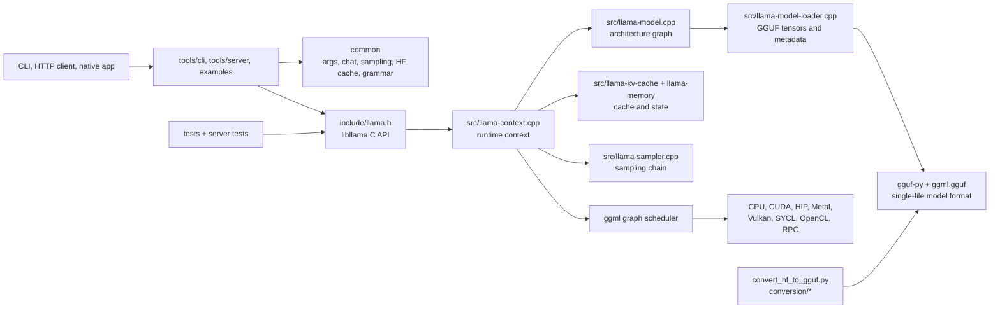
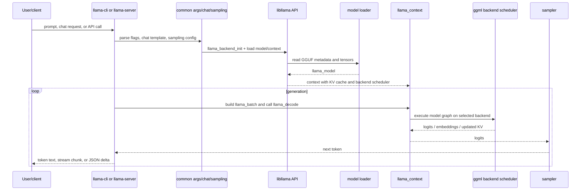
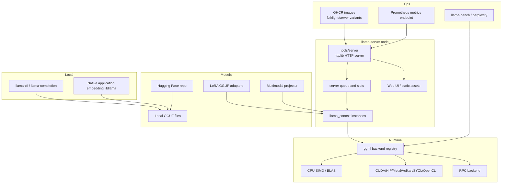
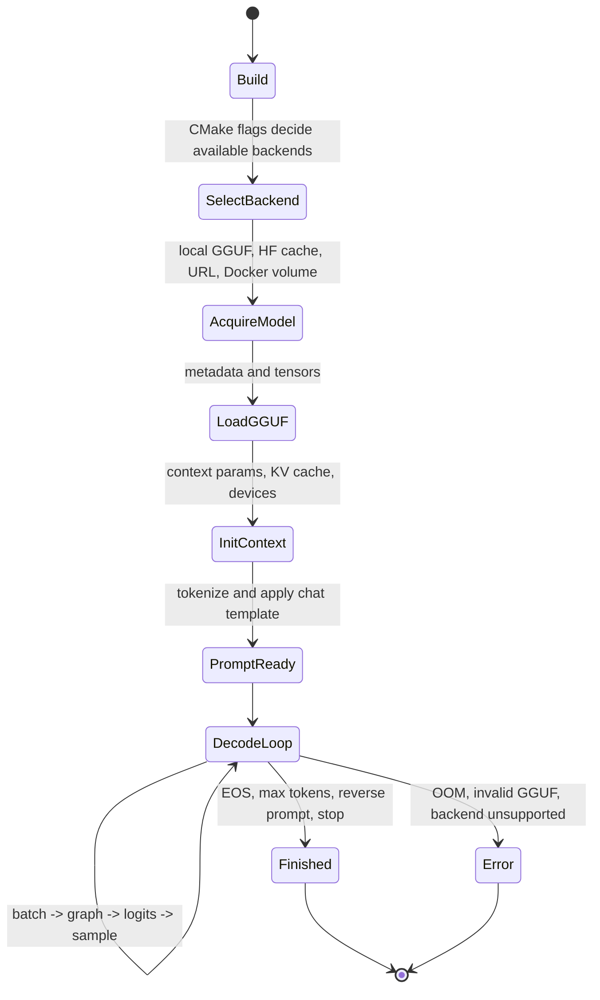
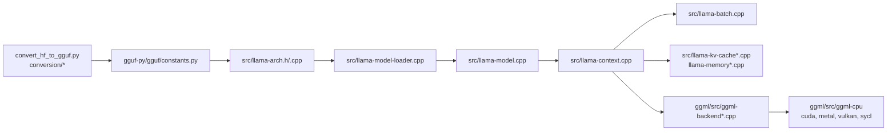
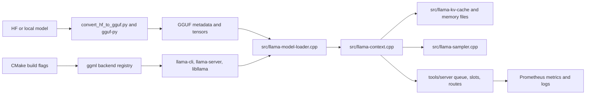
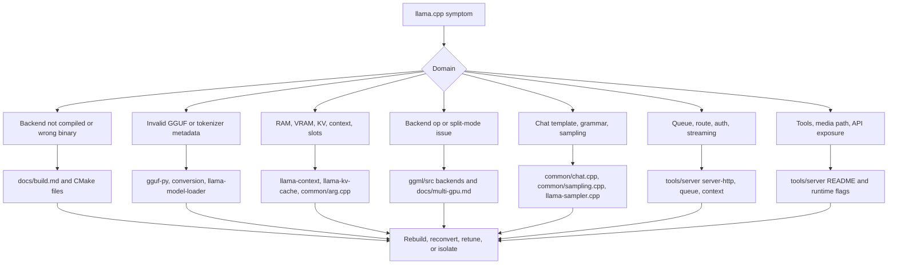

# llama.cpp Architecture

Source snapshot: `github-repos/02-model-serving-inference/llama.cpp` at `bfb4308` (`model : support granite multilingual embeddings R2 ... (#22716)`, tag `b9481`). This document is grounded in the repository files present in that snapshot.

## Executive Summary

llama.cpp is a native C/C++ inference stack for running large language models with minimal setup across local machines, edge devices, and cloud instances. The README summarizes the goal as "LLM inference in C/C++" and emphasizes low dependency count, Apple Silicon support, CPU SIMD paths, many quantization formats, CUDA/HIP/Vulkan/SYCL/OpenCL/Metal and other backends, and CPU/GPU hybrid inference.

The core product is the `llama` library, whose public C API is in `include/llama.h` and C++ RAII helpers are in `include/llama-cpp.h`. Around that core, the repository includes model conversion to GGUF, quantization tools, a command-line client, an OpenAI-compatible HTTP server, benchmarking tools, multimodal support, tests, and the `ggml` tensor/runtime backend library.

For solution architects, llama.cpp is most valuable when the deployment target needs portability, small operational footprint, local or edge execution, strong quantized-model support, or native integration. It can run as a local CLI, embedded library, Docker container, web server, mobile demo, or multi-GPU backend-dependent service. Its tradeoff is that model support, runtime features, and hardware acceleration are tightly coupled to GGUF metadata, graph construction code, backend kernels, and build flags.

## Problem Solved

Model serving often assumes a Python runtime, GPU-heavy deployment, and a managed serving stack. llama.cpp addresses a different operating model:

- Run LLMs from a native executable or library without a full Python serving stack.
- Use single-file GGUF models that bundle metadata and tensors.
- Reduce memory through aggressive quantization.
- Run on CPUs, Apple Silicon, consumer GPUs, mobile devices, and heterogeneous CPU/GPU systems.
- Expose both local CLI workflows and HTTP APIs.
- Provide tooling to convert, quantize, benchmark, inspect, and test models.

Repository anchors include `include/llama.h`, `src/llama.cpp`, `src/llama-context.cpp`, `src/llama-model.cpp`, `src/llama-kv-cache.cpp`, `tools/server/*`, `tools/cli/*`, `tools/quantize/*`, `convert_hf_to_gguf.py`, `gguf-py/gguf/*`, `ggml/src/*`, and `tests/*`.

## AI Stack Role

llama.cpp is an inference runtime and model-serving toolkit. It does not primarily define models for training like Transformers, and it is not a Python-first high-throughput server like vLLM. Its role is closer to a portable native execution layer:

- **Model input:** Hugging Face models converted to GGUF, existing GGUF repos, LoRA GGUF adapters, multimodal projector files.
- **Runtime:** `libllama` plus `ggml` graph execution and backend scheduling.
- **Serving:** `llama-cli`, `llama-server`, OpenAI-compatible routes, Anthropic-compatible messages, web UI, embeddings, reranking, function calling.
- **Operations:** CMake builds, Docker images, backend-specific build flags, benchmarking, Prometheus-compatible server metrics, tests.
- **Ecosystem bridge:** Python conversion scripts depend on `transformers`, `torch`, `sentencepiece`, and the local `gguf-py` package; runtime consumes the converted GGUF assets.

## Source Tree Map

| Path | Role |
|---|---|
| `README.md` | Project overview, quick start, supported model families, hardware support, install/build links. |
| `include/llama.h` | Public C API: model/context params, backend init/free, model loading, `llama_batch`, `llama_encode`, `llama_decode`, samplers, embeddings, KV operations. |
| `include/llama-cpp.h` | C++ RAII helpers for `llama_model`, `llama_context`, and `llama_sampler`. |
| `src/llama.cpp` | Core exported implementation glue for public API. |
| `src/llama-model.cpp`, `src/llama-model.h` | Model representation, architecture-specific graph construction, RoPE/model logic. |
| `src/llama-model-loader.cpp` | GGUF model loading and metadata/tensor handling. |
| `src/llama-context.cpp` | Runtime context, decode/encode execution, output extraction, embeddings, logits, performance behavior. |
| `src/llama-batch.cpp` | Batch allocation and splitting into micro-batches. |
| `src/llama-kv-cache*.cpp`, `src/llama-memory*.cpp` | KV-cache and memory implementations, including hybrid and recurrent paths. |
| `src/llama-sampler.cpp` | Sampling chain and token selection. |
| `src/llama-vocab.cpp`, `src/unicode*.cpp` | Tokenization, vocabulary, Unicode handling. |
| `src/llama-adapter.cpp` | LoRA/control-vector adapter loading and backend buffer handling. |
| `common/*` | Shared utilities for CLI/tools/server: args, sampling, chat templates, HF cache/download, logging, JSON/grammar helpers, speculative decoding. |
| `tools/server/*` | HTTP server based on `httplib` and `nlohmann::json`; OpenAI-compatible, Anthropic-compatible, web UI, slots, queue, model routing. |
| `tools/cli/*`, `tools/completion/*` | Main interactive CLI and completion utilities. |
| `tools/quantize/*`, `tools/imatrix/*`, `tools/gguf-split/*` | Quantization, importance matrix, GGUF splitting, and model tooling. |
| `tools/llama-bench/*`, `tools/perplexity/*` | Benchmarking and quality/perplexity utilities. |
| `tools/mtmd/*` | Multimodal library and model-specific encoder/projector support. |
| `examples/*` | Minimal library usage, batched inference, embeddings, retrieval, speculative decoding, Android/Swift demos, training examples. |
| `ggml/include`, `ggml/src` | Tensor library, graph execution, backend registry, CPU/CUDA/HIP/Metal/Vulkan/SYCL/OpenCL/RPC and other backends. |
| `gguf-py/gguf/*` | Python GGUF reader/writer, constants, quant helpers, metadata utilities, tensor mapping. |
| `conversion/*`, `convert_hf_to_gguf.py`, `convert_lora_to_gguf.py` | Model and adapter conversion from HF/PyTorch formats to GGUF. |
| `docs/*` | Build, install, Docker, multi-GPU, function calling, multimodal, speculative, backend, and model-development guides. |
| `tests/*` | C/C++ and Python tests for backends, GGUF, quantization, tokenizers, chat templates, grammar, thread safety, model load cancel, server tests. |
| `CMakeLists.txt`, `CMakePresets.json`, `Makefile` | Native build system and presets. |
| `pyproject.toml` | Python scripts package metadata; scripts like `llama-convert-hf-to-gguf`; dependencies for conversion tooling. |

## Core Concepts

**GGUF.** GGUF is the single-file model format used by llama.cpp and ggml. The conversion code reads original model configs, tokenizer data, tensor names, and tensor values, then writes standardized metadata and tensors. `gguf-py/gguf/constants.py` and `tensor_mapping.py` are central to this contract.

**libllama API.** `include/llama.h` is the external contract for embedding llama.cpp into other applications. It exposes backend initialization, model/context creation, batches, encode/decode, samplers, embeddings, and metadata APIs.

**ggml graph execution.** llama.cpp builds a graph for the model architecture and delegates tensor operations to `ggml`. Backend implementations under `ggml/src/ggml-cpu`, `ggml-cuda`, `ggml-metal`, `ggml-vulkan`, `ggml-sycl`, and others execute the graph.

**Context.** A `llama_context` owns runtime state for inference: KV cache, backend scheduler, logits/embeddings buffers, batch handling, and decode state.

**Batch and micro-batch.** `llama_batch` can hold one or many sequences. `src/llama-batch.cpp` splits work into micro-batches (`ubatch`) to fit execution and memory constraints.

**KV cache and memory.** `src/llama-kv-cache.cpp`, `llama-memory.cpp`, `llama-memory-hybrid.cpp`, `llama-memory-recurrent.cpp`, and related files manage context memory. Server flags such as `--ctx-size`, `--cache-type-k`, `--cache-type-v`, `--kv-offload`, `--kv-unified`, `--cache-prompt`, and slot controls expose this behavior.

**Quantization.** The project supports many quantization types, reducing memory and improving local feasibility. Runtime quantized ops live in ggml backends, while tools such as `tools/quantize` and scripts such as `convert_hf_to_gguf.py` produce quantized assets.

**Backend selection.** Build flags and runtime flags determine whether CPU, Metal, CUDA, HIP, Vulkan, SYCL, OpenCL, RPC, or other paths are available. `docs/build.md` and `docs/multi-gpu.md` document operational choices.

**Server slots and continuous batching.** `tools/server` supports parallel decoding, multi-user serving, continuous batching, slots monitoring, prompt caching, metrics, and model routing.

## Component/System Diagram

## Internal Architecture

llama.cpp has a native runtime core surrounded by tools.

**Public API layer.** `include/llama.h` is the stable interface consumers compile against. Applications call `llama_backend_init`, load a model, create a context, build batches, call `llama_decode` or `llama_encode`, and inspect logits, embeddings, or tokens. `include/llama-cpp.h` adds C++ ownership helpers.

**Model and metadata layer.** `src/llama-model-loader.cpp` reads GGUF files, tensor metadata, architecture-specific keys, and weight data. `src/llama-arch.h` and `src/llama-arch.cpp` define architecture constants, tensor names, and metadata mappings that must align with `gguf-py/gguf/constants.py`.

**Graph construction layer.** `src/llama-model.cpp` builds ggml graphs for supported architectures. The development guide `docs/development/HOWTO-add-model.md` says new models require conversion support, architecture metadata, graph implementation, and optional multimodal encoder support.

**Runtime context layer.** `src/llama-context.cpp` holds execution state, manages decode/encode calls, extracts logits/embeddings, applies output handling, and calls into the backend scheduler.

**Memory/KV layer.** KV cache and memory are separated into several implementation files so recurrent, hybrid, sliding-window, and standard attention models can be handled.

**Shared tool layer.** `common/arg.cpp`, `common/common.cpp`, `common/sampling.cpp`, `common/chat.cpp`, `common/hf-cache.cpp`, and `common/download.cpp` are reused by CLI, server, and tools. This avoids each binary reimplementing argument parsing, sampling, chat templates, Hugging Face downloads, or logging.

**Backend layer.** `ggml` owns low-level tensor execution and backend registration. `ggml/src/ggml-backend-reg.cpp`, `ggml-backend.cpp`, and backend directories provide implementation-specific ops.

## End-to-End Runtime Flow

## Runtime and Data Flow

1. **Model acquisition.** A user passes `-m model.gguf`, `-hf user/repo`, `--model-url`, or Docker model arguments. `common/hf-cache.cpp`, `common/download.cpp`, and `common_get_model_endpoint()` support model cache and endpoint selection.
2. **Model load.** `llama_model_loader` reads GGUF metadata and tensors, often using memory mapping unless disabled by flags such as `--no-mmap`.
3. **Context initialization.** `llama_context` is created with context parameters, backend devices, KV cache settings, Flash Attention choice, thread settings, and optional offload.
4. **Prompt processing.** CLI/server code tokenizes input, applies chat templates from `common/chat.cpp`, handles grammars/JSON schema, and forms `llama_batch`.
5. **Graph execution.** The architecture-specific graph is constructed and run through ggml. The backend scheduler places tensors and ops on CPU/GPU backends according to build/runtime availability.
6. **KV update.** Attention state is stored in the cache and may be offloaded, quantized, unified, shifted, saved, or restored depending on flags and server slot state.
7. **Sampling.** `src/llama-sampler.cpp` and `common/sampling.cpp` apply sampler chains such as penalties, top-k, top-p, min-p, temperature, Mirostat, grammar constraints, and logit bias.
8. **Output.** CLI prints tokens; server streams or returns JSON through `tools/server/server-http.cpp`, `server-task.cpp`, `server-context.cpp`, and route-specific code.

## Deployment and Operations Topology

Deployment patterns:

- **Single binary local inference:** `llama-cli -m model.gguf`.
- **OpenAI-compatible local service:** `llama-server -m model.gguf --host 0.0.0.0 --port 8080`.
- **Containerized service:** `ghcr.io/ggml-org/llama.cpp:server` or backend-specific images such as `server-cuda`, `server-rocm`, `server-vulkan`, `server-intel`.
- **Embedded native library:** application links against `libllama` and calls `include/llama.h`.
- **Multi-GPU:** `docs/multi-gpu.md` describes `--split-mode none|layer|row|tensor`, `--tensor-split`, `--device`, `--n-gpu-layers`, and backend caveats.
- **Mobile/edge:** examples include Android and SwiftUI demos, and backend docs cover device-specific builds.

## Lifecycle, Decisions, and Module Dependencies

## Extension Points

- **Add a model architecture:** `docs/development/HOWTO-add-model.md` defines the path: update conversion, GGUF constants/tensor mappings, `src/llama-arch.*`, `src/llama-model-loader.cpp`, RoPE logic if needed, and `src/llama-model.cpp` graph construction.
- **Add conversion support:** implement a `TextModel` or `MmprojModel` subclass in `conversion`, update `gguf-py/gguf/constants.py` and `tensor_mapping.py`, and validate tokenizer/tensor mapping.
- **Add backend support:** implement or extend backend code under `ggml/src/ggml-*` and expose it through the backend registry.
- **Add server routes/features:** follow `tools/server/server-http.cpp`, `server-task.cpp`, `server-context.cpp`, `server-queue.cpp`, and protocol-specific helpers.
- **Add multimodal support:** use `tools/mtmd`, its `models` directory, and `docs/multimodal.md`; avoid model-specific CLI behavior when a model-agnostic preprocessor/projector can be used.
- **Add tools:** new tools can reuse `common` for argument parsing, logging, model loading, sampling, and chat templates.
- **Add grammars/function calling:** `common/json-schema-to-grammar.cpp`, `common/llguidance.cpp`, `grammars`, and `docs/function-calling.md` provide the extension area.

## Integrations

- Hugging Face model downloads and cache through `-hf`, `HF_TOKEN`, `HF_ENDPOINT`/`MODEL_ENDPOINT`, and `common/hf-cache.cpp`.
- GGUF conversion from Transformers/PyTorch through `convert_hf_to_gguf.py`, `conversion`, and Python dependencies in `pyproject.toml`.
- OpenAI-compatible server routes documented in `tools/server/README.md`.
- Anthropic Messages API compatibility in server features.
- Prometheus-compatible metrics endpoint behind `--metrics`.
- Docker images for full, light, server, and backend-specific variants documented in `docs/docker.md`.
- Multimodal projector support through `tools/mtmd` and `docs/multimodal.md`.
- LoRA and control vectors through `src/llama-adapter.cpp` and CLI/server flags.
- Speculative decoding through `common/speculative.cpp`, `examples/speculative`, and `docs/speculative.md`.

## Configuration, Deployment, and Ops

llama.cpp configuration is split between build-time and runtime.

**Build-time:** CMake options select backend availability. `docs/build.md` covers CPU, BLAS, Metal, SYCL, CUDA, MUSA, HIP, Vulkan, CANN, ZenDNN, KleidiAI, OpenCL, Android, and OpenVINO. Build flags determine whether a binary can use a backend at all.

**Runtime:** `common/arg.cpp` centralizes flags for threads, CPU affinity, context size, batch/micro-batch size, Flash Attention, RoPE scaling, KV cache types, mmap/mlock/direct I/O, devices, GPU layers, split mode, LoRA, model source, logging, sampling, grammar, server host/port, API key, TLS, metrics, slots, props, prompt cache, and model routing.

Operational practices:

- Use `--list-devices` to validate visible accelerators.
- Tune `--ctx-size`, `--batch-size`, `--ubatch-size`, `--n-gpu-layers`, and KV cache types before exposing a server.
- Use Docker images as a deployment shortcut, but rebuild locally if backend/library versions differ.
- For multi-GPU, prefer `layer` for compatibility and `tensor` only after validating architecture/backend support and interconnect performance.
- Protect server endpoints with `--api-key`, TLS, network policy, and reverse proxy controls.
- Keep `--props`, `--tools`, local media paths, and write-capable tools disabled in untrusted environments unless explicitly governed.

## Observability, Testing, Evaluation, and Failure Modes

Observability and benchmarking:

- `tools/server/README.md` documents `--metrics` for a Prometheus-compatible endpoint.
- `common/log.cpp`, logging flags, verbosity, timestamps, and log files support runtime diagnosis.
- `--perf` and `--no-perf` control internal libllama timing output.
- `tools/llama-bench`, `tools/batched-bench`, `tools/perplexity`, `examples/llama-eval`, and benchmark scripts measure speed and quality.
- `tools/server/bench/prometheus.yml` and server bench files show a monitoring/benchmark setup.

Testing anchors:

- `tests/test-backend-ops.cpp` covers backend operation behavior.
- `tests/test-gguf.cpp`, `tests/test-gguf-model-data.cpp`, and `gguf-py/tests/*` cover GGUF behavior.
- `tests/test-quantize-fns.cpp`, `test-quantize-perf.cpp`, and `test-quant-type-selection.cpp` cover quantization.
- `tests/test-tokenizer-*` and `tests/test-tokenizers-repo.sh` cover tokenizer correctness.
- `tests/test-chat-template.cpp`, `test-chat.cpp`, and `test-chat-auto-parser.cpp` cover chat formatting and parsing.
- `tools/server/tests/*` covers server behavior.
- `tests/test-thread-safety.cpp`, `test-save-load-state.cpp`, and `test-model-load-cancel.cpp` cover runtime reliability scenarios.

Common failure modes:

- **Invalid or unsupported GGUF:** metadata keys, tensor names, architecture mapping, or tokenizer info do not match runtime expectations.
- **Backend not built:** a flag such as `-ngl all` cannot use a GPU if the binary lacks CUDA/Metal/HIP/Vulkan/SYCL support.
- **OOM or poor fit:** model, context, KV cache, parallel slots, or GPU offload exceed memory.
- **Multi-GPU mismatch:** `tensor` split unsupported for an architecture, missing NCCL/RCCL, slow interconnect, or incompatible KV cache type.
- **Quantization quality loss:** smaller formats may reduce output quality or break specific workloads.
- **Chat template mismatch:** function calling, tool use, or role formatting fails if model template is wrong.
- **Server overload:** queue growth, long generations, too many slots, or insufficient circuit breaking.
- **Security exposure:** API keys missing, tools enabled, local media paths exposed, or CORS/web UI deployed broadly.

## Security and Governance Risks

- **Model licensing and provenance:** GGUF files may come from many publishers. Track source, license, quantization method, and conversion script version.
- **Supply chain:** conversion tooling uses Python dependencies and model files; runtime loads native binary data from GGUF.
- **HTTP API exposure:** `llama-server` can expose chat, responses, embeddings, reranking, monitoring, slots, props, static UI, and model routing. Limit surface area.
- **Built-in tools:** server flags can enable file read/write, shell execution, grep, patch, and datetime tools. The server README warns these are experimental and should not be enabled in untrusted environments.
- **Local media paths:** multimodal `file://` access can leak files if `--media-path` is too broad.
- **Prompt/output logging:** logs and metrics can reveal sensitive prompts, completions, model names, and traffic patterns.
- **Quantized safety regression:** changing quantization can change behavior. Governance should include evaluation, not just throughput tests.
- **Native memory safety:** C/C++ serving needs patching discipline, fuzzing/tests, and conservative exposure behind reverse proxies.

## Reading Guide

1. Start with `README.md` for goals, quick start, and supported model/hardware claims.
2. Read `docs/build.md`, `docs/docker.md`, and `docs/multi-gpu.md` to understand deployment constraints.
3. Read `include/llama.h` before reading internal implementation.
4. Trace model loading through `src/llama-model-loader.cpp` and architecture constants in `src/llama-arch.*`.
5. Study `src/llama-context.cpp`, `src/llama-batch.cpp`, and `src/llama-kv-cache.cpp` for runtime behavior.
6. Read `src/llama-model.cpp` for graph construction.
7. Read `ggml/include/ggml.h`, `ggml/include/ggml-backend.h`, and backend directories for execution.
8. Read `tools/server/README.md` and `tools/server/*.cpp` for service operation.
9. Read `docs/development/HOWTO-add-model.md` before adding model support.
10. Use `tests/*` to understand expected behavior before modifying internals.

## Learning Path

1. Build a CPU-only mental model with `examples/simple/simple.cpp`.
2. Follow `tools/cli/main.cpp` into common argument parsing and `libllama`.
3. Inspect how `llama_batch` is created and decoded.
4. Read the sampling chain in `src/llama-sampler.cpp` and `common/sampling.cpp`.
5. Load the server architecture from `tools/server/server.cpp`, queue, context, task, HTTP, and model files.
6. Study GGUF conversion and constants before touching architecture support.
7. Compare backend implementations only after understanding the ggml backend API.
8. Use benchmarks and tests to validate any performance or model-support change.

## Production Readiness And Native Runtime Gate

llama.cpp readiness is split across build-time, model-time, and runtime gates. The important source anchors are `include/llama.h`, `src/llama-model-loader.cpp`, `src/llama-context.cpp`, `src/llama-kv-cache*.cpp`, `src/llama-sampler.cpp`, `common/arg.cpp`, `tools/server/*`, `ggml/src/*`, `convert_hf_to_gguf.py`, `gguf-py/gguf/*`, and `docs/build.md`.

| Gate | What to verify |
|---|---|
| Build | Binary was compiled with the intended backend: CPU BLAS, CUDA, HIP, Metal, Vulkan, SYCL, OpenCL, RPC, or vendor-specific options. |
| GGUF provenance | Source model, conversion script version, tokenizer metadata, quantization type, and license are recorded. |
| Memory fit | `--ctx-size`, `--batch-size`, `--ubatch-size`, KV cache type, `--n-gpu-layers`, slots, and split mode fit RAM/VRAM. |
| Server exposure | `llama-server` is behind auth, TLS/reverse proxy, rate limits, and only required routes/features are enabled. |
| Tool surface | Experimental server tools, local media paths, file access, shell-like actions, and static UI are disabled unless explicitly governed. |
| Observability | `--metrics`, logs, `llama-bench`, perplexity checks, and model-load diagnostics are captured before canary traffic. |

## Failure Isolation Map

Native runtimes fail differently from Python serving stacks. A single symptom such as "slow generation" can be caused by build flags, model format, backend placement, KV cache settings, sampler configuration, server queue pressure, or client misuse.

## Glossary

| Term | Meaning |
|---|---|
| GGUF | Single-file model format containing metadata and tensors for ggml/llama.cpp inference. |
| ggml | Tensor and graph execution library used by llama.cpp. |
| libllama | Native library interface exposed through `include/llama.h`. |
| llama_context | Runtime state for inference, including KV cache, backend scheduler, logits, and embeddings. |
| llama_batch | Input structure containing tokens/embeddings, positions, sequence IDs, and output flags. |
| KV cache | Attention key/value memory from previous tokens. |
| ubatch | Micro-batch produced from a larger `llama_batch`. |
| mmap | Memory mapping model files to reduce load overhead and memory copying. |
| mlock | Request to keep model pages in RAM. |
| n-gpu-layers | Runtime option controlling how many layers are offloaded to GPU. |
| split mode | Multi-GPU strategy such as `layer` or `tensor`. |
| LoRA adapter | Low-rank adapter loaded to modify model behavior without replacing the base model. |
| imatrix | Importance matrix used to guide quantization choices. |
| mtmd | llama.cpp multimodal library/tool area. |
| slot | Server-side concurrent sequence/context lane. |
