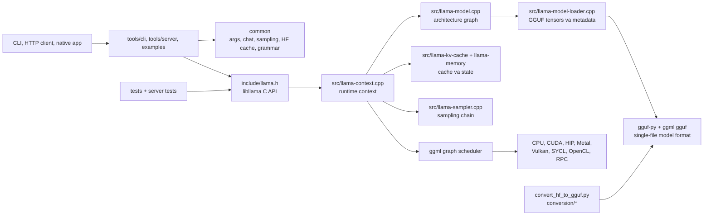
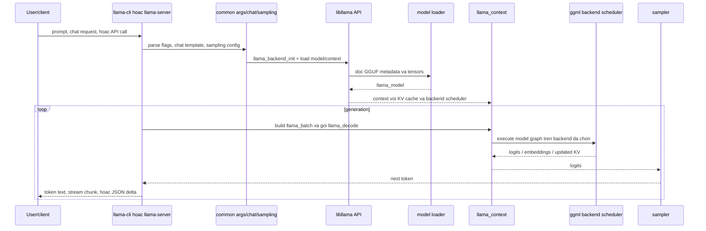
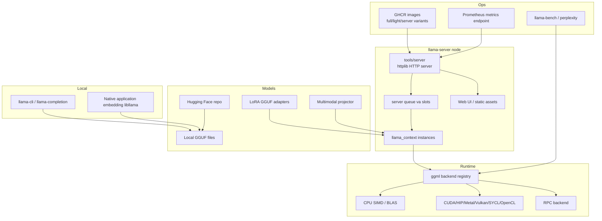
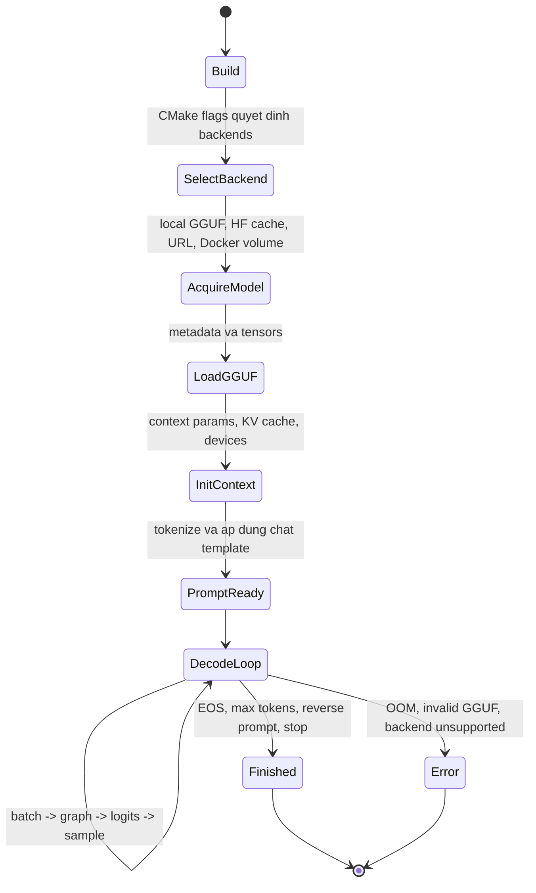
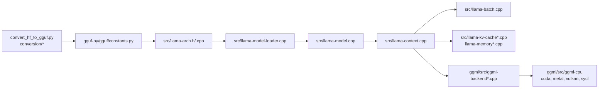
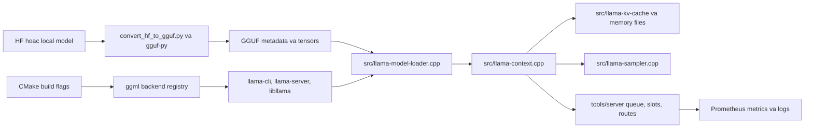
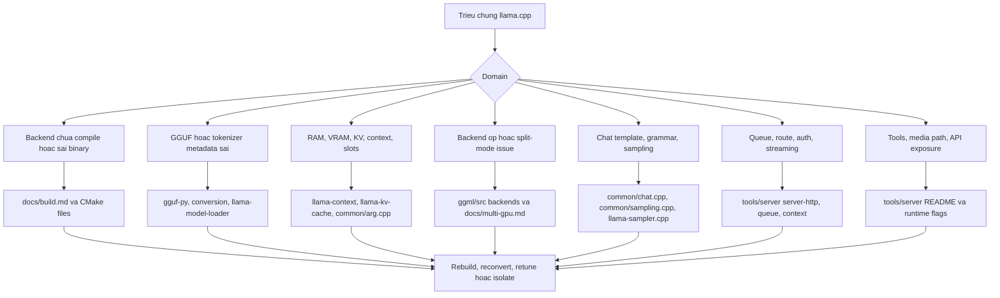

# Kien truc llama.cpp

Anh chup nguon: `github-repos/02-model-serving-inference/llama.cpp` tai commit `bfb4308` (`model : support granite multilingual embeddings R2 ... (#22716)`, tag `b9481`). Tai lieu nay dua tren cac tep va thu muc co trong anh chup do.

## Tom tat dieu hanh

llama.cpp la stack inference C/C++ native de chay LLM voi thiet lap toi thieu tren may local, edge device va cloud instance. README tom tat muc tieu la "LLM inference in C/C++" va nhan manh it dependency, ho tro Apple Silicon, cac duong CPU SIMD, nhieu dinh dang quantization, CUDA/HIP/Vulkan/SYCL/OpenCL/Metal va cac backend khac, cung CPU/GPU hybrid inference.

San pham cot loi la thu vien `llama`, voi public C API trong `include/llama.h` va C++ RAII helpers trong `include/llama-cpp.h`. Xung quanh core do la tooling chuyen model sang GGUF, quantization, CLI, OpenAI-compatible HTTP server, benchmarking, multimodal support, tests va thu vien tensor/runtime `ggml`.

Voi solution architect, llama.cpp co gia tri khi dich trien khai can portability, footprint nho, local/edge execution, quantized-model support manh, hoac native integration. No co the chay nhu CLI local, embedded library, Docker container, web server, mobile demo hoac service multi-GPU tuy backend. Doi lai, model support, runtime features va tang toc phan cung phu thuoc chat vao GGUF metadata, graph construction code, backend kernels va build flags.

## Bai toan duoc giai quyet

Nhieu model serving stack mac dinh can Python runtime, GPU lon va managed server. llama.cpp phuc vu mo hinh khac:

- Chay LLM tu native executable hoac library khong can Python serving stack day du.
- Dung GGUF single-file gom metadata va tensors.
- Giam memory bang quantization manh.
- Chay tren CPU, Apple Silicon, consumer GPU, mobile device va he thong CPU/GPU hybrid.
- Expose ca CLI local va HTTP API.
- Cung cap tool convert, quantize, benchmark, inspect va test model.

Diem neo trong repo gom `include/llama.h`, `src/llama.cpp`, `src/llama-context.cpp`, `src/llama-model.cpp`, `src/llama-kv-cache.cpp`, `tools/server/*`, `tools/cli/*`, `tools/quantize/*`, `convert_hf_to_gguf.py`, `gguf-py/gguf/*`, `ggml/src/*` va `tests/*`.

## Vai tro trong AI stack

llama.cpp la inference runtime va toolkit model serving. No khong chu yeu dinh nghia model cho training nhu Transformers, va khong phai Python-first high-throughput server nhu vLLM. Vai tro cua no gan voi mot portable native execution layer:

- **Model input:** model Hugging Face da convert sang GGUF, repo GGUF san co, LoRA GGUF adapters, multimodal projector files.
- **Runtime:** `libllama` cong `ggml` graph execution va backend scheduling.
- **Serving:** `llama-cli`, `llama-server`, OpenAI-compatible routes, Anthropic-compatible messages, web UI, embeddings, reranking, function calling.
- **Van hanh:** CMake builds, Docker images, backend-specific build flags, benchmarking, Prometheus-compatible server metrics, tests.
- **Cau noi ecosystem:** Python conversion scripts phu thuoc `transformers`, `torch`, `sentencepiece` va package local `gguf-py`; runtime tieu thu GGUF assets da convert.

## Ban do source tree

| Duong dan | Vai tro |
|---|---|
| `README.md` | Tong quan du an, quick start, model families ho tro, hardware support, link install/build. |
| `include/llama.h` | Public C API: model/context params, backend init/free, model loading, `llama_batch`, `llama_encode`, `llama_decode`, samplers, embeddings, KV operations. |
| `include/llama-cpp.h` | C++ RAII helpers cho `llama_model`, `llama_context`, `llama_sampler`. |
| `src/llama.cpp` | Glue implementation cho public API export. |
| `src/llama-model.cpp`, `src/llama-model.h` | Model representation, graph construction theo architecture, logic RoPE/model. |
| `src/llama-model-loader.cpp` | Nap GGUF model va xu ly metadata/tensor. |
| `src/llama-context.cpp` | Runtime context, decode/encode execution, output extraction, embeddings, logits, behavior hieu nang. |
| `src/llama-batch.cpp` | Cap phat batch va chia thanh micro-batch. |
| `src/llama-kv-cache*.cpp`, `src/llama-memory*.cpp` | KV-cache va memory implementations, gom hybrid va recurrent paths. |
| `src/llama-sampler.cpp` | Sampling chain va chon token. |
| `src/llama-vocab.cpp`, `src/unicode*.cpp` | Tokenization, vocabulary, Unicode. |
| `src/llama-adapter.cpp` | Nap LoRA/control-vector adapters va xu ly backend buffer. |
| `common/*` | Utilities dung chung cho CLI/tools/server: args, sampling, chat templates, HF cache/download, logging, JSON/grammar helpers, speculative decoding. |
| `tools/server/*` | HTTP server dua tren `httplib` va `nlohmann::json`; OpenAI-compatible, Anthropic-compatible, web UI, slots, queue, model routing. |
| `tools/cli/*`, `tools/completion/*` | Interactive CLI va completion utilities. |
| `tools/quantize/*`, `tools/imatrix/*`, `tools/gguf-split/*` | Quantization, importance matrix, GGUF splitting va model tooling. |
| `tools/llama-bench/*`, `tools/perplexity/*` | Benchmarking va quality/perplexity utilities. |
| `tools/mtmd/*` | Multimodal library va model-specific encoder/projector support. |
| `examples/*` | Vi du dung library toi thieu, batched inference, embeddings, retrieval, speculative decoding, Android/Swift demos, training examples. |
| `ggml/include`, `ggml/src` | Tensor library, graph execution, backend registry, CPU/CUDA/HIP/Metal/Vulkan/SYCL/OpenCL/RPC va backend khac. |
| `gguf-py/gguf/*` | Python GGUF reader/writer, constants, quant helpers, metadata utilities, tensor mapping. |
| `conversion/*`, `convert_hf_to_gguf.py`, `convert_lora_to_gguf.py` | Chuyen model/adapters tu HF/PyTorch formats sang GGUF. |
| `docs/*` | Build, install, Docker, multi-GPU, function calling, multimodal, speculative, backend va model-development guides. |
| `tests/*` | C/C++ va Python tests cho backends, GGUF, quantization, tokenizers, chat templates, grammar, thread safety, model load cancel, server. |
| `CMakeLists.txt`, `CMakePresets.json`, `Makefile` | Native build system va presets. |
| `pyproject.toml` | Metadata Python scripts; scripts nhu `llama-convert-hf-to-gguf`; dependencies cho conversion tooling. |

## Khai niem cot loi

**GGUF.** GGUF la dinh dang single-file cua llama.cpp va ggml. Conversion code doc config goc, tokenizer data, tensor names va tensor values, roi ghi metadata va tensors chuan hoa. `gguf-py/gguf/constants.py` va `tensor_mapping.py` la hop dong trung tam.

**libllama API.** `include/llama.h` la contract ben ngoai de embed llama.cpp vao ung dung. No expose backend initialization, model/context creation, batches, encode/decode, samplers, embeddings va metadata APIs.

**ggml graph execution.** llama.cpp xay graph cho architecture model va giao tensor operations cho `ggml`. Backend trong `ggml/src/ggml-cpu`, `ggml-cuda`, `ggml-metal`, `ggml-vulkan`, `ggml-sycl` va cac thu muc khac thuc thi graph.

**Context.** `llama_context` giu runtime state cho inference: KV cache, backend scheduler, logits/embeddings buffers, batch handling va decode state.

**Batch va micro-batch.** `llama_batch` co the chua mot hoac nhieu sequence. `src/llama-batch.cpp` chia work thanh micro-batch (`ubatch`) de phu hop execution va memory constraints.

**KV cache va memory.** `src/llama-kv-cache.cpp`, `llama-memory.cpp`, `llama-memory-hybrid.cpp`, `llama-memory-recurrent.cpp` va cac file lien quan quan ly context memory. Server flags nhu `--ctx-size`, `--cache-type-k`, `--cache-type-v`, `--kv-offload`, `--kv-unified`, `--cache-prompt`, slot controls expose hanh vi nay.

**Quantization.** Du an ho tro nhieu quantization types, giam memory va giup local inference kha thi. Runtime quantized ops nam trong ggml backends, con tools nhu `tools/quantize` va scripts nhu `convert_hf_to_gguf.py` tao assets quantized.

**Backend selection.** Build flags va runtime flags quyet dinh CPU, Metal, CUDA, HIP, Vulkan, SYCL, OpenCL, RPC hoac path khac co san hay khong. `docs/build.md` va `docs/multi-gpu.md` mo ta cac lua chon van hanh.

**Server slots va continuous batching.** `tools/server` ho tro parallel decoding, multi-user serving, continuous batching, slots monitoring, prompt caching, metrics va model routing.

## So do thanh phan he thong

## Kien truc noi bo

llama.cpp co native runtime core va cac tool bao quanh.

**Public API layer.** `include/llama.h` la interface on dinh cho consumer compile. Ung dung goi `llama_backend_init`, load model, tao context, build batch, goi `llama_decode` hoac `llama_encode`, roi doc logits, embeddings hoac token. `include/llama-cpp.h` them ownership helpers cho C++.

**Model va metadata layer.** `src/llama-model-loader.cpp` doc GGUF files, tensor metadata, architecture-specific keys va weight data. `src/llama-arch.h` va `src/llama-arch.cpp` dinh nghia architecture constants, tensor names va metadata mappings phai dong bo voi `gguf-py/gguf/constants.py`.

**Graph construction layer.** `src/llama-model.cpp` xay ggml graphs cho architectures duoc ho tro. Guide `docs/development/HOWTO-add-model.md` noi model moi can conversion support, architecture metadata, graph implementation va tuy chon multimodal encoder support.

**Runtime context layer.** `src/llama-context.cpp` giu execution state, quan ly decode/encode calls, trich logits/embeddings, xu ly output va goi backend scheduler.

**Memory/KV layer.** KV cache va memory duoc tach thanh nhieu file de xu ly recurrent, hybrid, sliding-window va standard attention models.

**Shared tool layer.** `common/arg.cpp`, `common/common.cpp`, `common/sampling.cpp`, `common/chat.cpp`, `common/hf-cache.cpp`, `common/download.cpp` duoc CLI, server va tools dung lai. Nho do moi binary khong phai tu cai dat argument parsing, sampling, chat templates, HF downloads hay logging.

**Backend layer.** `ggml` quan ly low-level tensor execution va backend registration. `ggml/src/ggml-backend-reg.cpp`, `ggml-backend.cpp` va backend directories cung cap ops theo implementation.

## Luong runtime dau cuoi

## Runtime va data flow

1. **Lay model.** User truyen `-m model.gguf`, `-hf user/repo`, `--model-url` hoac Docker model args. `common/hf-cache.cpp`, `common/download.cpp`, `common_get_model_endpoint()` ho tro cache va endpoint.
2. **Nap model.** `llama_model_loader` doc GGUF metadata va tensors, thuong dung memory mapping tru khi bi tat boi `--no-mmap`.
3. **Khoi tao context.** `llama_context` duoc tao voi context params, backend devices, KV cache settings, Flash Attention, thread settings va offload tuy chon.
4. **Xu ly prompt.** CLI/server tokenize input, ap dung chat templates tu `common/chat.cpp`, xu ly grammars/JSON schema va tao `llama_batch`.
5. **Graph execution.** Graph theo architecture duoc xay va chay qua ggml. Backend scheduler dat tensors va ops len CPU/GPU backends theo build/runtime availability.
6. **Cap nhat KV.** Attention state duoc luu trong cache va co the offload, quantize, unified, shift, save hoac restore theo flags va server slot state.
7. **Sampling.** `src/llama-sampler.cpp` va `common/sampling.cpp` ap dung sampler chains nhu penalties, top-k, top-p, min-p, temperature, Mirostat, grammar constraints va logit bias.
8. **Output.** CLI in tokens; server stream hoac tra JSON qua `tools/server/server-http.cpp`, `server-task.cpp`, `server-context.cpp` va route-specific code.

## Topology trien khai va van hanh

Cac mau trien khai:

- **Single binary local inference:** `llama-cli -m model.gguf`.
- **OpenAI-compatible local service:** `llama-server -m model.gguf --host 0.0.0.0 --port 8080`.
- **Containerized service:** `ghcr.io/ggml-org/llama.cpp:server` hoac image theo backend nhu `server-cuda`, `server-rocm`, `server-vulkan`, `server-intel`.
- **Embedded native library:** ung dung link voi `libllama` va goi `include/llama.h`.
- **Multi-GPU:** `docs/multi-gpu.md` mo ta `--split-mode none|layer|row|tensor`, `--tensor-split`, `--device`, `--n-gpu-layers` va backend caveats.
- **Mobile/edge:** examples co Android va SwiftUI demos, backend docs co huong dan build theo device.

## Vong doi, quyet dinh va phu thuoc module

## Diem mo rong

- **Them model architecture:** `docs/development/HOWTO-add-model.md` dinh nghia duong di: cap nhat conversion, GGUF constants/tensor mappings, `src/llama-arch.*`, `src/llama-model-loader.cpp`, RoPE logic neu can, va `src/llama-model.cpp` graph construction.
- **Them conversion support:** implement `TextModel` hoac `MmprojModel` subclass trong `conversion`, cap nhat `gguf-py/gguf/constants.py` va `tensor_mapping.py`, validate tokenizer/tensor mapping.
- **Them backend support:** implement hoac mo rong backend code trong `ggml/src/ggml-*` va expose qua backend registry.
- **Them server routes/features:** theo `tools/server/server-http.cpp`, `server-task.cpp`, `server-context.cpp`, `server-queue.cpp` va protocol helpers.
- **Them multimodal support:** dung `tools/mtmd`, thu muc `models` va `docs/multimodal.md`; tranh hanh vi CLI rieng cho tung model neu co the dung preprocessor/projector model-agnostic.
- **Them tool:** tool moi co the dung lai `common` cho argument parsing, logging, model loading, sampling va chat templates.
- **Them grammars/function calling:** `common/json-schema-to-grammar.cpp`, `common/llguidance.cpp`, `grammars`, `docs/function-calling.md` la khu vuc mo rong.

## Tich hop

- Hugging Face downloads va cache qua `-hf`, `HF_TOKEN`, `HF_ENDPOINT`/`MODEL_ENDPOINT`, `common/hf-cache.cpp`.
- GGUF conversion tu Transformers/PyTorch qua `convert_hf_to_gguf.py`, `conversion`, Python dependencies trong `pyproject.toml`.
- OpenAI-compatible server routes duoc document trong `tools/server/README.md`.
- Tuong thich Anthropic Messages API trong server features.
- Prometheus-compatible metrics endpoint sau flag `--metrics`.
- Docker images cho full, light, server va backend-specific variants trong `docs/docker.md`.
- Multimodal projector support qua `tools/mtmd` va `docs/multimodal.md`.
- LoRA va control vectors qua `src/llama-adapter.cpp` va CLI/server flags.
- Speculative decoding qua `common/speculative.cpp`, `examples/speculative`, `docs/speculative.md`.

## Cau hinh, trien khai va ops

Cau hinh llama.cpp tach thanh build-time va runtime.

**Build-time:** CMake options chon backend availability. `docs/build.md` bao phu CPU, BLAS, Metal, SYCL, CUDA, MUSA, HIP, Vulkan, CANN, ZenDNN, KleidiAI, OpenCL, Android va OpenVINO. Build flags quyet dinh binary co dung backend duoc hay khong.

**Runtime:** `common/arg.cpp` tap trung flags cho threads, CPU affinity, context size, batch/micro-batch size, Flash Attention, RoPE scaling, KV cache types, mmap/mlock/direct I/O, devices, GPU layers, split mode, LoRA, model source, logging, sampling, grammar, server host/port, API key, TLS, metrics, slots, props, prompt cache va model routing.

Thuc hanh van hanh:

- Dung `--list-devices` de kiem tra accelerator thay duoc.
- Tune `--ctx-size`, `--batch-size`, `--ubatch-size`, `--n-gpu-layers` va KV cache types truoc khi expose server.
- Dung Docker images nhu loi tat trien khai, nhung rebuild local neu version backend/library khac.
- Voi multi-GPU, uu tien `layer` cho compatibility va chi dung `tensor` sau khi validate architecture/backend support va interconnect performance.
- Bao ve server endpoints bang `--api-key`, TLS, network policy va reverse proxy controls.
- Giu `--props`, `--tools`, local media paths va write-capable tools o trang thai tat trong moi truong khong tin cay, tru khi co governance ro.

## Observability, testing, evaluation va failure modes

Observability va benchmarking:

- `tools/server/README.md` document `--metrics` cho Prometheus-compatible endpoint.
- `common/log.cpp`, logging flags, verbosity, timestamps va log files ho tro diagnosis.
- `--perf` va `--no-perf` dieu khien internal libllama timing output.
- `tools/llama-bench`, `tools/batched-bench`, `tools/perplexity`, `examples/llama-eval` va benchmark scripts do speed va quality.
- `tools/server/bench/prometheus.yml` va server bench files cho thay setup monitoring/benchmark.

Diem neo testing:

- `tests/test-backend-ops.cpp` bao phu backend operation behavior.
- `tests/test-gguf.cpp`, `tests/test-gguf-model-data.cpp`, `gguf-py/tests/*` bao phu GGUF.
- `tests/test-quantize-fns.cpp`, `test-quantize-perf.cpp`, `test-quant-type-selection.cpp` bao phu quantization.
- `tests/test-tokenizer-*` va `tests/test-tokenizers-repo.sh` bao phu tokenizer correctness.
- `tests/test-chat-template.cpp`, `test-chat.cpp`, `test-chat-auto-parser.cpp` bao phu chat formatting va parsing.
- `tools/server/tests/*` bao phu server behavior.
- `tests/test-thread-safety.cpp`, `test-save-load-state.cpp`, `test-model-load-cancel.cpp` bao phu reliability scenarios.

Failure modes pho bien:

- **GGUF invalid hoac chua ho tro:** metadata keys, tensor names, architecture mapping hoac tokenizer info khong khop runtime.
- **Backend chua build:** flag nhu `-ngl all` khong the dung GPU neu binary khong co CUDA/Metal/HIP/Vulkan/SYCL.
- **OOM hoac fit kem:** model, context, KV cache, parallel slots hoac GPU offload vuot memory.
- **Multi-GPU mismatch:** `tensor` split khong ho tro architecture, thieu NCCL/RCCL, interconnect cham, hoac KV cache type khong compatible.
- **Giam chat luong do quantization:** format nho hon co the lam giam output quality hoac pha workload cu the.
- **Chat template mismatch:** function calling, tool use hoac role formatting loi neu template cua model sai.
- **Server overload:** queue tang, generation dai, qua nhieu slots, hoac circuit breaking khong du.
- **Security exposure:** thieu API key, tools bat, local media path lo rong, hoac CORS/web UI trien khai qua rong.

## Rui ro bao mat va governance

- **License va provenance cua model:** GGUF files co the den tu nhieu publisher. Can theo doi source, license, quantization method va conversion script version.
- **Supply chain:** conversion tooling dung Python dependencies va model files; runtime load native binary data tu GGUF.
- **HTTP API exposure:** `llama-server` co the expose chat, responses, embeddings, reranking, monitoring, slots, props, static UI va model routing. Can gioi han be mat.
- **Built-in tools:** server flags co the bat read/write file, shell execution, grep, patch va datetime tools. README server canh bao cac tools nay experimental va khong nen bat trong moi truong khong tin cay.
- **Local media paths:** multimodal `file://` access co the lam lo file neu `--media-path` qua rong.
- **Prompt/output logging:** logs va metrics co the lo prompt, completion, model names va traffic patterns.
- **Quantized safety regression:** doi quantization co the doi behavior. Governance can evaluation, khong chi throughput tests.
- **Native memory safety:** C/C++ serving can patching discipline, fuzzing/tests va expose than trong sau reverse proxy.

## Huong dan doc source

1. Bat dau voi `README.md` de hieu muc tieu, quick start va model/hardware claims.
2. Doc `docs/build.md`, `docs/docker.md`, `docs/multi-gpu.md` de hieu rang buoc trien khai.
3. Doc `include/llama.h` truoc khi doc implementation.
4. Trace model loading qua `src/llama-model-loader.cpp` va constants trong `src/llama-arch.*`.
5. Hoc `src/llama-context.cpp`, `src/llama-batch.cpp`, `src/llama-kv-cache.cpp` cho runtime behavior.
6. Doc `src/llama-model.cpp` cho graph construction.
7. Doc `ggml/include/ggml.h`, `ggml/include/ggml-backend.h` va backend directories cho execution.
8. Doc `tools/server/README.md` va `tools/server/*.cpp` cho service operation.
9. Doc `docs/development/HOWTO-add-model.md` truoc khi them model support.
10. Dung `tests/*` de hieu expected behavior truoc khi sua internals.

## Lo trinh hoc

1. Tao mental model CPU-only voi `examples/simple/simple.cpp`.
2. Theo `tools/cli/main.cpp` vao common argument parsing va `libllama`.
3. Xem cach `llama_batch` duoc tao va decode.
4. Doc sampling chain trong `src/llama-sampler.cpp` va `common/sampling.cpp`.
5. Nap architecture server tu `tools/server/server.cpp`, queue, context, task, HTTP va model files.
6. Hoc GGUF conversion va constants truoc khi cham architecture support.
7. So sanh backend implementations sau khi da hieu ggml backend API.
8. Dung benchmarks va tests de validate moi thay doi ve performance hoac model support.

## Checklist production và cổng runtime native

Readiness của llama.cpp được tách thành gate build-time, model-time và runtime. Các neo source quan trọng gồm `include/llama.h`, `src/llama-model-loader.cpp`, `src/llama-context.cpp`, `src/llama-kv-cache*.cpp`, `src/llama-sampler.cpp`, `common/arg.cpp`, `tools/server/*`, `ggml/src/*`, `convert_hf_to_gguf.py`, `gguf-py/gguf/*` và `docs/build.md`.

| Gate | Cần xác minh |
|---|---|
| Build | Binary được compile với backend mong muốn: CPU BLAS, CUDA, HIP, Metal, Vulkan, SYCL, OpenCL, RPC hoặc option vendor-specific. |
| GGUF provenance | Ghi lại source model, version conversion script, tokenizer metadata, quantization type và license. |
| Memory fit | `--ctx-size`, `--batch-size`, `--ubatch-size`, KV cache type, `--n-gpu-layers`, slots và split mode phải vừa RAM/VRAM. |
| Server exposure | `llama-server` phải đứng sau auth, TLS/reverse proxy, rate limit và chỉ bật route/feature cần thiết. |
| Tool surface | Experimental server tools, local media paths, file access, shell-like actions và static UI phải tắt trừ khi có governance rõ. |
| Observability | `--metrics`, logs, `llama-bench`, perplexity checks và model-load diagnostics cần được thu trước canary traffic. |

## Bản đồ cô lập lỗi

Runtime native lỗi khác với Python serving stack. Một triệu chứng như "generation chậm" có thể đến từ build flags, model format, backend placement, KV cache settings, sampler configuration, áp lực queue ở server hoặc client misuse.

## Bang chu giai

| Thuat ngu | Nghia |
|---|---|
| GGUF | Dinh dang single-file gom metadata va tensors cho inference ggml/llama.cpp. |
| ggml | Thu vien tensor va graph execution duoc llama.cpp su dung. |
| libllama | Native library interface expose qua `include/llama.h`. |
| llama_context | Runtime state cho inference, gom KV cache, backend scheduler, logits va embeddings. |
| llama_batch | Cau truc input gom tokens/embeddings, positions, sequence IDs va output flags. |
| KV cache | Bo nho key/value attention tu token truoc. |
| ubatch | Micro-batch duoc tao tu `llama_batch` lon hon. |
| mmap | Memory mapping model files de giam load overhead va memory copy. |
| mlock | Yeu cau giu model pages trong RAM. |
| n-gpu-layers | Option runtime dieu khien so layer offload len GPU. |
| split mode | Chien luoc multi-GPU nhu `layer` hoac `tensor`. |
| LoRA adapter | Adapter low-rank thay doi hanh vi model ma khong thay base model. |
| imatrix | Importance matrix dung de huong dan quantization. |
| mtmd | Khu vuc library/tool multimodal cua llama.cpp. |
| slot | Lane context/sequence dong thoi phia server. |
