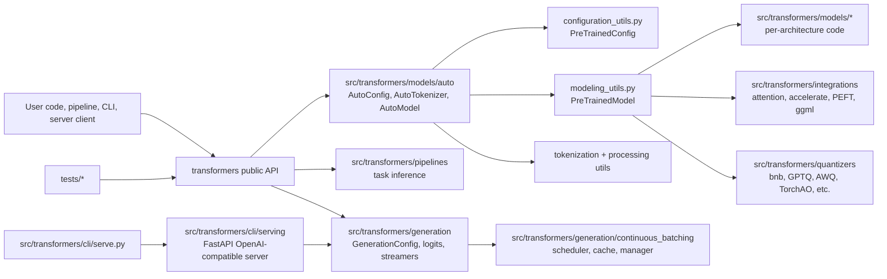
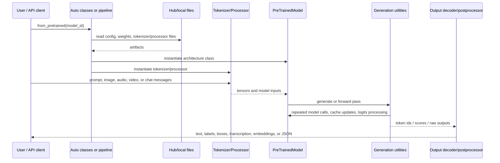
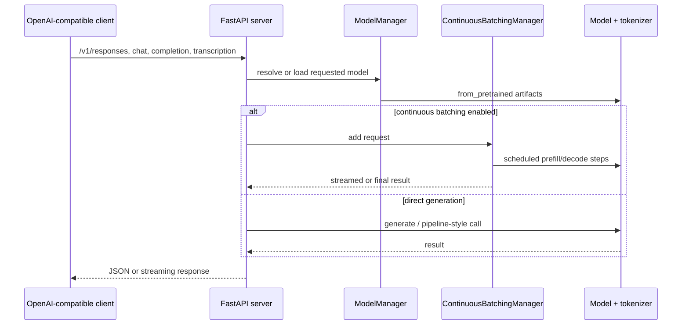
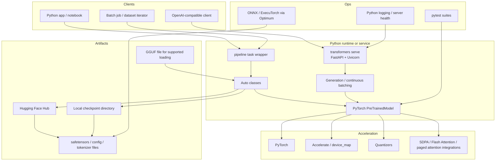
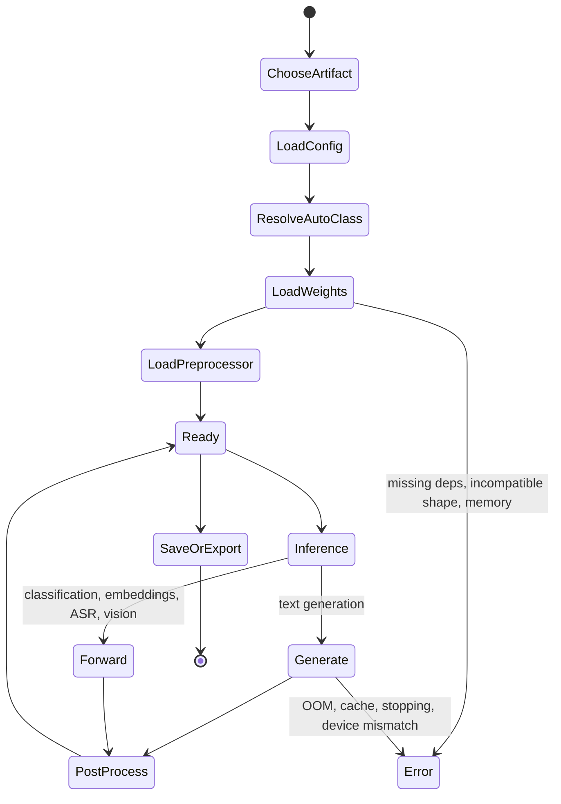
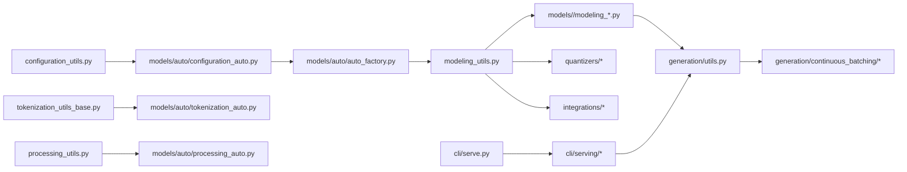
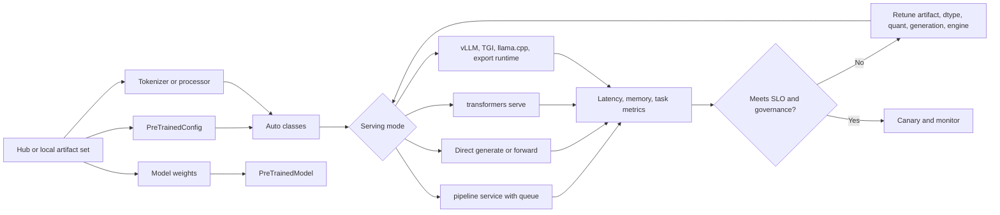
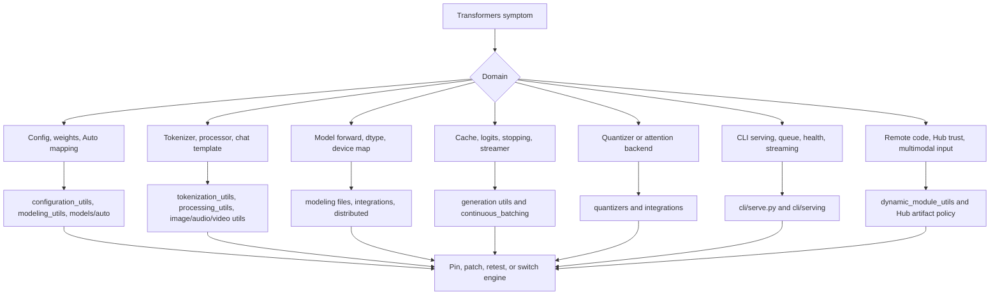

# Transformers Architecture

Source snapshot: `github-repos/02-model-serving-inference/transformers` at `a46a732` (`[docs] contributing (#45465)`). This document is grounded in the repository files present in that snapshot.

## Executive Summary

Hugging Face Transformers is the model-definition framework at the center of a large AI ecosystem. The repository README says Transformers centralizes model definitions so they can be reused by training frameworks, inference engines, and adjacent runtimes such as vLLM, SGLang, TGI, llama.cpp, and MLX. It supports text, vision, audio, video, and multimodal models for inference and training.

Architecturally, Transformers is a layered Python library: configuration classes, pretrained model base classes, tokenizers/processors, Auto classes, per-model implementations, generation utilities, pipelines, trainers, integrations, quantizers, and CLI serving. The core library is in `src/transformers`; model families are in `src/transformers/models`; higher-level task inference is in `src/transformers/pipelines`; generation is in `src/transformers/generation`; and serving CLI code is in `src/transformers/cli` and `src/transformers/cli/serving`.

For model-serving architects, Transformers is both a direct runtime and a canonical compatibility layer. Many serving systems rely on its configs, tokenizers, chat templates, generation configs, model naming conventions, and checkpoint loading. Its newer `generation/continuous_batching` and `transformers serve` code provide an OpenAI-compatible serving path, but the library's broader role remains defining and loading models consistently across the ecosystem.

## Problem Solved

Before a model can be served, a stack must agree on what the model is, how its weights map to code, how inputs are preprocessed, how generation behaves, and how artifacts are saved and shared. Transformers solves these problems:

- A consistent `from_pretrained` / `save_pretrained` interface for models, configs, tokenizers, image processors, feature extractors, and processors.
- Auto classes that map model metadata to implementation classes.
- Per-model code that is readable and self-contained enough for community contribution.
- Generation algorithms, logits processors, stopping criteria, cache utilities, streamers, watermarking, and continuous batching.
- Pipelines for task-oriented inference across text, audio, vision, video, and multimodal workloads.
- Integration points for quantization, distributed training/inference, attention backends, PEFT, Hub, GGUF, ONNX/ExecuTorch export paths, and serving.

Repository anchors include `src/transformers/configuration_utils.py`, `modeling_utils.py`, `tokenization_utils_base.py`, `processing_utils.py`, `models/auto/*`, `generation/*`, `generation/continuous_batching/*`, `pipelines/*`, `quantizers/*`, `integrations/*`, `cli/serve.py`, `cli/serving/*`, and `tests/*`.

## AI Stack Role

Transformers occupies multiple roles:

- **Model-definition layer:** per-model config and modeling files under `src/transformers/models/*`.
- **Artifact contract layer:** `PreTrainedConfig`, `PreTrainedModel`, tokenizers, processors, `save_pretrained`, and Hub-compatible layout.
- **Inference convenience layer:** `pipeline`, `AutoModelFor*`, `GenerationMixin`, `GenerationConfig`, streamers, and chat templates.
- **Serving layer:** `transformers serve` implemented with FastAPI/Uvicorn and OpenAI-compatible APIs under `src/transformers/cli/serving`.
- **Training/fine-tuning layer:** `trainer.py`, `training_args.py`, `trainer_seq2seq.py`, optimization utilities, distributed and integration modules.
- **Ecosystem bridge:** quantization modules, attention implementations, GGUF loading support, export docs, community integration docs, and test contracts.

In a serving architecture, Transformers is often used even when the final engine is not Transformers itself. Tokenizers, config files, chat templates, generation config, and model class definitions frequently originate here.

## Source Tree Map

| Path | Role |
|---|---|
| `README.md` | Project positioning, ecosystem role, pipeline examples, installation and quick-start material. |
| `setup.py` | Package metadata, dependency/extras map, supported Python 3.10-3.14 range, console script `transformers=transformers.cli.transformers:main`. |
| `pyproject.toml` | Ruff, pytest, coverage, ty type-checker configuration and test markers. |
| `src/transformers/__init__.py` | Public import surface with lazy availability checks. |
| `src/transformers/configuration_utils.py` | Base `PreTrainedConfig`, serialization, loading, and config behavior. |
| `src/transformers/modeling_utils.py` | Base `PreTrainedModel`, loading/saving, device/dtype behavior, weight handling. |
| `src/transformers/core_model_loading.py` | Shared model loading helpers. |
| `src/transformers/tokenization_utils_base.py`, `tokenization_utils_tokenizers.py`, `tokenization_utils_sentencepiece.py` | Tokenizer abstractions and fast/slow tokenizer support. |
| `src/transformers/processing_utils.py`, `image_processing_utils.py`, `audio_utils.py`, `video_processing_utils.py` | Processor, image, audio, and video preprocessing foundations. |
| `src/transformers/models/auto/*` | AutoConfig, AutoTokenizer, AutoProcessor, AutoModel, mapping factories. |
| `src/transformers/models/*` | Per-model implementations for many text, vision, audio, and multimodal architectures. |
| `src/transformers/generation/*` | Generation config, logits processors, stopping criteria, streamers, candidate generators, watermarking, utilities. |
| `src/transformers/generation/continuous_batching/*` | Continuous batching manager, scheduler, cache manager, model runner, request states, offloading, distributed helpers. |
| `src/transformers/pipelines/*` | Task-level inference wrappers for text, audio, vision, video, and multimodal tasks. |
| `src/transformers/quantizers/*` | Quantization method integration and automatic quantizer selection. |
| `src/transformers/integrations/*` | Accelerate, DeepSpeed, Flash Attention, SDPA, tensor parallel, ggml, PEFT, quantization libraries, TPU/NPU, and related integrations. |
| `src/transformers/cli/*` | Typer CLI command group, chat/download/system/serve commands. |
| `src/transformers/cli/serving/*` | FastAPI serving implementation: server build, model manager, chat completions, completions, responses, transcriptions, utilities. |
| `docs/source/en/*` | User and developer docs, including continuous batching, serving, adding models/pipelines, GGUF, serialization/export, testing, quantization. |
| `tests/*` | Common model/test mixins, generation tests, continuous batching tests, quantization tests, pipeline tests, model tests, CLI serving tests. |
| `examples`, `notebooks`, `benchmark`, `benchmark_v2` | Usage examples and performance workflows. |

## Core Concepts

**PreTrainedConfig.** A model's blueprint. It stores architecture metadata and hyperparameters, supports serialization, and drives class selection. The base is in `configuration_utils.py`.

**PreTrainedModel.** The base class for PyTorch models. It provides loading, saving, dtype/device handling, weight tying, and compatibility utilities. The base is in `modeling_utils.py`.

**Auto classes.** `src/transformers/models/auto` maps configs and model types to implementation classes. Auto classes let users write `AutoModelForCausalLM.from_pretrained(...)` without importing a specific architecture class.

**Tokenizer / processor.** Tokenizers convert text to token IDs; image/audio/video processors normalize non-text inputs; processors combine multiple modalities. The base utility files are in `tokenization_utils_base.py`, `processing_utils.py`, and modality-specific utilities.

**Per-model folders.** Each model family has files such as `configuration_*.py`, `modeling_*.py`, tokenization/processing files, conversion utilities, and tests. The docs for adding models emphasize self-contained model files and low abstraction depth.

**Generation.** Generation behavior is controlled by `GenerationConfig`, logits processors, stopping criteria, candidate generators, streamers, and model methods. These live under `src/transformers/generation`.

**Continuous batching.** `docs/source/en/continuous_batching.md` and `continuous_batching_architecture.md` describe a serving-oriented generation mode that dynamically reschedules requests, uses paged KV cache, chunked prefill, optional CUDA graphs, async batching, prefix caching, and offloading.

**Pipeline.** `src/transformers/pipelines` provides task-oriented inference wrappers. Pipelines handle preprocessing, model invocation, and postprocessing for common tasks.

**Serve CLI.** `src/transformers/cli/serve.py` exposes `transformers serve`; `src/transformers/cli/serving/*` implements FastAPI routes and model management. `setup.py` exposes the `transformers` console script.

## Component/System Diagram

## Internal Architecture

Transformers uses a set of contracts rather than a single runtime loop.

**Artifact contract.** Config, model, tokenizer, processor, generation config, and safetensors/checkpoint files are saved in a layout that can be reloaded locally or from the Hub. `from_pretrained` and `save_pretrained` form the main artifact contract.

**Auto mapping contract.** Auto classes avoid hardcoding implementation names in user applications. The files `auto_factory.py`, `configuration_auto.py`, `modeling_auto.py`, `tokenization_auto.py`, `processing_auto.py`, and related mapping files control how model type metadata maps to classes.

**Model implementation contract.** The `docs/source/en/add_new_model.md` guide states that model files should be readable, self-contained, and depend directly on `PreTrainedModel`. This keeps new architectures approachable and testable.

**Generation contract.** Causal generation uses a shared set of generation helpers, logits processors, stopping criteria, cache helpers, and streamers. Model-specific code provides forward passes and cache behavior; generation utilities orchestrate decoding strategies.

**Task inference contract.** Pipelines wrap tokenizer/processor, model call, and postprocessing into task-oriented classes such as text generation, ASR, image classification, object detection, and multimodal question answering.

**Serving contract.** The CLI serving layer wraps model loading and generation behind FastAPI. Tests in `tests/cli/test_serve.py` cover server startup, health behavior, streaming, responses, chat completions, continuous batching state, and error handling.

## End-to-End Flow

For `transformers serve`, the API layer sits in front of the same concepts:

## Runtime and Data Flow

1. **Artifact selection.** A model ID or local path is supplied to an Auto class, pipeline, Trainer, or server.
2. **Config load.** `AutoConfig` reads `config.json` and determines model type and architecture mapping.
3. **Class resolution.** Auto factories choose model/tokenizer/processor classes from mappings in `src/transformers/models/auto`.
4. **Weight load.** `PreTrainedModel.from_pretrained` loads safetensors/PyTorch or supported alternate formats, applies dtype/device/quantization choices, and initializes the class.
5. **Preprocessing.** Tokenizer/processor utilities convert input into tensors. Chat templates and multimodal processors may transform role/content structures before tokenization.
6. **Forward/generate.** The model forward pass runs through PyTorch and optional integrations such as SDPA, Flash Attention, tensor parallel, quantization, or custom kernels.
7. **Generation loop.** `GenerationConfig` and logits processors govern token selection, stopping, streaming, assisted decoding, watermarking, or continuous batching.
8. **Postprocessing.** Pipelines or serving utilities decode tokens, format labels/boxes/timestamps, normalize OpenAI-compatible responses, and handle streaming chunks.
9. **Persistence/export.** `save_pretrained`, safetensors, GGUF loading docs, and serialization/export docs define how artifacts move to other runtimes.

## Deployment and Operations Topology

Operationally, Transformers can run in notebooks, batch jobs, web servers, training jobs, and direct serving processes. `docs/source/en/pipeline_webserver.md` warns that web servers are concurrent while PyTorch model execution is memory-heavy and blocking; it recommends a queue and single model worker pattern for simple pipeline servers. For production `transformers serve`, the docs recommend the CLI serving path and mention continuous batching as an optimization.

## Lifecycle, Decisions, and Module Dependencies

## Extension Points

- **Add a model:** `docs/source/en/add_new_model.md` describes adding config, modeling, tests, conversion, docs, and Auto mappings. It emphasizes readable, self-contained model files.
- **Add a modular model:** `docs/source/en/modular_transformers.md` gives the newer modular path for reducing repetitive implementation work.
- **Add a pipeline:** `docs/source/en/add_new_pipeline.md` and `src/transformers/pipelines/base.py` define task pipeline conventions.
- **Add tokenizer/processor support:** tokenizer and processor base utilities plus `models/auto/*_auto.py` handle discovery and loading.
- **Add quantization support:** `src/transformers/quantizers/base.py`, `auto.py`, and method-specific quantizers define how quantization config maps to implementation.
- **Add integrations:** `src/transformers/integrations/*` provides patterns for attention backends, accelerators, tensor parallelism, GGUF, PEFT, and hardware-specific paths.
- **Extend generation:** `generation/logits_process.py`, `stopping_criteria.py`, `candidate_generator.py`, `streamers.py`, and `continuous_batching/*` are extension points for decoding behavior.
- **Extend serve CLI:** `src/transformers/cli/serving/*` contains route and model-manager code for server behavior.

## Integrations

Transformers integrates with:

- Hugging Face Hub for model, tokenizer, processor, and dataset-like artifact retrieval.
- PyTorch as the primary model execution backend in this snapshot.
- Accelerate, DeepSpeed, FSDP, tensor parallel, TPU/NPU, and other distributed/hardware tooling through `src/transformers/integrations`.
- Quantization libraries such as bitsandbytes, AWQ, GPTQ, HQQ, TorchAO, Quanto, Quark, MXFP4, FP8-related methods, and others through `src/transformers/quantizers`.
- Attention implementations such as SDPA, Flash Attention, paged attention/eager paged integrations, and flex attention.
- GGUF loading support through `docs/source/en/gguf.md`, `modeling_gguf_pytorch_utils.py`, and `integrations/ggml.py`; the docs state GGUF is loaded for further training/fine-tuning by dequantizing to fp32.
- Serving dependencies in `setup.py` extras: `openai`, `pydantic`, `uvicorn`, `fastapi`, `starlette`, `rich`, plus torch/accelerate.
- Export paths documented in `docs/source/en/serialization.md`, including ONNX and ExecuTorch via Optimum.

## Configuration, Deployment, and Ops

Configuration sources include:

- `config.json` through `PreTrainedConfig`.
- tokenizer and processor JSON/model files.
- `generation_config.json` and runtime `GenerationConfig`.
- `TrainingArguments` / `Seq2SeqTrainingArguments` for training jobs.
- CLI flags for `transformers serve` in `src/transformers/cli/serve.py`.
- Quantization configs and attention/dtype/device-map parameters.

Deployment patterns:

- **Library inference:** `AutoTokenizer` + `AutoModelFor*` + `generate` or forward calls.
- **Pipeline inference:** task-specific `pipeline(...)` for text/audio/vision/multimodal use.
- **Dataset/batch inference:** pipelines over iterators or datasets, with careful batching.
- **Simple web service:** queue-backed pipeline server as described in `pipeline_webserver.md`.
- **Transformers serve:** FastAPI/Uvicorn OpenAI-compatible server with optional continuous batching.
- **Exported runtime:** ONNX or ExecuTorch via Optimum for optimized production runtimes.
- **External serving engines:** vLLM, SGLang, TGI, llama.cpp, and others consume Transformers configs/model definitions/tokenizers.

Ops considerations:

- Optional dependencies are feature-specific. Missing `tokenizers`, `sentencepiece`, `torch`, `fastapi`, quantization packages, or attention libraries can change behavior.
- `device_map="auto"`, dtype, quantization, and attention implementation choices directly affect memory and latency.
- Pipeline batching is not always faster; `pipeline_webserver.md` warns that dynamic batching needs careful queue and timeout design.
- Continuous batching needs GPU memory budgeting, cache sizing, scheduler choice, and attention compatibility.
- Serving should expose health checks and overload behavior; tests include cases for unhealthy continuous-batching worker state returning 503.

## Observability, Testing, Evaluation, and Failure Modes

Testing is a major part of the repository architecture.

- `tests/test_modeling_common.py`, `test_configuration_common.py`, `test_tokenization_common.py`, `test_processing_common.py`, and related mixins enforce common behavior across models.
- `tests/models/*` contains per-model tests.
- `tests/generation/*` covers generation utilities, logits processors, stopping criteria, streamers, paged attention, flash attention parity, and continuous batching.
- `tests/pipelines/*` covers task-level pipeline behavior.
- `tests/quantization/*` covers quantization paths.
- `tests/cli/test_serve.py`, `test_chat.py`, `test_download.py`, and `test_system.py` cover CLI and serving behavior.
- `pyproject.toml` defines pytest markers such as `generate`, `is_training_test`, `is_tensor_parallel_test`, and flash attention markers.

Observability is more application-dependent than in a dedicated serving engine. Useful anchors are:

- Python logging and warnings in model loading, generation, integrations, and serving utilities.
- `transformers serve` health behavior and HTTP error handling in `cli/serving`.
- Pipeline/webserver docs recommending explicit error handling, queue limits, and circuit breaking.
- Benchmark folders and Optimum benchmark integration for performance evaluation.

Common failure modes:

- **Missing optional dependencies:** tokenizer, processor, quantizer, audio/video, serving, or attention package not installed.
- **Model/config mismatch:** wrong architecture class, missing Auto mapping, bad config, or incompatible checkpoint shape.
- **Tokenizer/processor mismatch:** text or multimodal inputs produce wrong IDs/pixel/audio features.
- **Memory errors:** model too large, dtype too wide, device map wrong, cache too large, or batching too aggressive.
- **Generation surprises:** EOS/stopping criteria, chat template, logits processors, or generation config do not match expected behavior.
- **Quantization issues:** unsupported device/backend, accuracy regression, or incompatible module layout.
- **Serving overload:** PyTorch blocks the main thread, queue grows, continuous batching worker fails, or request cancellation is mishandled.
- **Remote artifact risk:** untrusted model files or remote code settings can execute or load unexpected behavior.

## Security and Governance Risks

- **Model provenance and license:** Hub models are diverse; governance should track model card, license, weights source, revisions, and intended use.
- **Remote code:** `trust_remote_code` can execute repository code. Treat it as privileged code and pin revisions.
- **Sensitive data:** prompts, completions, audio, images, and logs may include regulated data.
- **Serving API exposure:** `transformers serve` should run behind authentication, TLS, rate limiting, and request size controls.
- **Dependency supply chain:** many optional dependencies are loaded for quantization, serving, tokenization, audio/video, and acceleration.
- **Quantization and export drift:** changing dtype, quantization, ONNX/ExecuTorch export, or GGUF conversion can alter model behavior.
- **Evaluation governance:** passing unit tests does not prove model safety, factuality, fairness, or domain suitability.
- **Multimodal input risk:** image/audio/video parsers increase attack surface and resource-exhaustion risk.

## Reading Guide

1. Start with `README.md` for ecosystem role and user-facing examples.
2. Read `setup.py` to understand extras, optional dependencies, and the `transformers` CLI entry point.
3. Read `configuration_utils.py`, `modeling_utils.py`, `tokenization_utils_base.py`, and `processing_utils.py`.
4. Read `src/transformers/models/auto/*` to understand class resolution.
5. Pick one model folder, for example `models/llama`, and compare config/model/tokenizer files with tests.
6. Read `generation/configuration_utils.py`, `generation/utils.py`, `logits_process.py`, `stopping_criteria.py`, and `streamers.py`.
7. Read `generation/continuous_batching/*` and the two continuous batching docs if studying serving throughput.
8. Read `pipelines/base.py` and a few task pipeline files.
9. Read `cli/serve.py` and `cli/serving/*` for direct serving behavior.
10. Review common tests before modifying contracts.

## Learning Path

1. Load a tiny model with `AutoTokenizer` and `AutoModelForCausalLM`.
2. Inspect the downloaded `config.json`, tokenizer files, and generation config.
3. Trace `AutoModelForCausalLM.from_pretrained` into Auto mappings and `PreTrainedModel`.
4. Run generation and identify where logits processors and stopping criteria apply.
5. Use a pipeline for the same task and trace preprocessing/postprocessing.
6. Study one per-model implementation and its tests.
7. Review quantization and attention integration options for deployment.
8. Explore `transformers serve` and continuous batching only after understanding basic generation.
9. Validate production candidates with task metrics, latency, memory, and safety evaluations.

## Production Readiness And Serving Decision Gate

Transformers production readiness starts with the artifact contract: `config.json`, weights, tokenizer, processor, generation config, and optional remote code. The serving path then depends on whether the workload uses direct `generate`, `pipeline`, `transformers serve`, or an external serving engine that still consumes Transformers artifacts. Review `src/transformers/configuration_utils.py`, `modeling_utils.py`, `models/auto/*`, `generation/*`, `generation/continuous_batching/*`, `pipelines/*`, `cli/serving/*`, `quantizers/*`, `integrations/*`, and `tests/cli/test_serve.py`.

| Decision area | What to verify |
|---|---|
| Artifact lock | Pin model revision, config, tokenizer/processor files, generation config, safetensors, and any custom code decision. |
| Dependency set | Install only needed extras: tokenizers, sentencepiece, audio/video, serving, quantization, attention, or acceleration packages. |
| Serving mode | Choose direct library, queue-backed pipeline service, `transformers serve`, export path, or external engine based on latency and throughput needs. |
| Generation contract | Test chat template, EOS/stop tokens, logits processors, streamers, cache implementation, and structured response expectations. |
| Memory/performance | Validate dtype, device map, quantization, attention implementation, batch sizes, and continuous batching cache budget. |
| Governance | Treat `trust_remote_code`, Hub artifacts, multimodal parsers, logs, and model licenses as privileged production decisions. |

## Failure Isolation Map

A Transformers failure can occur before the model ever runs: Auto mapping, optional dependency resolution, tokenizer files, remote code, shape loading, and processor behavior all sit before inference. Triage should isolate artifact, preprocessing, model execution, generation, serving, and security domains.

## Glossary

| Term | Meaning |
|---|---|
| PreTrainedConfig | Serializable model blueprint and hyperparameter container. |
| PreTrainedModel | Base model class with loading, saving, weight, dtype, and device utilities. |
| Auto class | Factory class that selects a concrete config/model/tokenizer/processor from metadata. |
| Tokenizer | Component that maps text to token IDs and back. |
| Processor | Component that wraps one or more modality preprocessors, often for multimodal models. |
| Pipeline | Task-level inference wrapper that handles preprocessing, model call, and postprocessing. |
| GenerationConfig | Configuration object controlling decoding behavior. |
| LogitsProcessor | Hook that modifies logits during generation. |
| StoppingCriteria | Hook that decides when generation should stop. |
| Streamer | Utility for emitting generated text incrementally. |
| Continuous batching | Dynamic serving mode that admits and removes generation requests each step. |
| Paged KV cache | Cache design that stores key/value state in fixed-size pages/blocks. |
| device_map | Mapping of modules to devices, often managed by Accelerate. |
| safetensors | Safe tensor serialization format commonly used for model weights. |
| GGUF | Single-file model format used by ggml/llama.cpp, with loading support in Transformers for selected models. |
