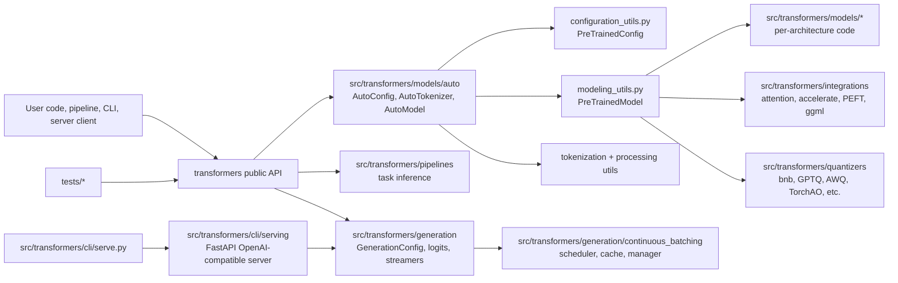
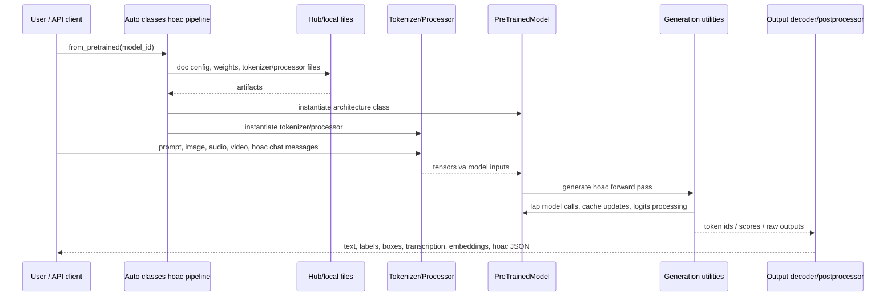
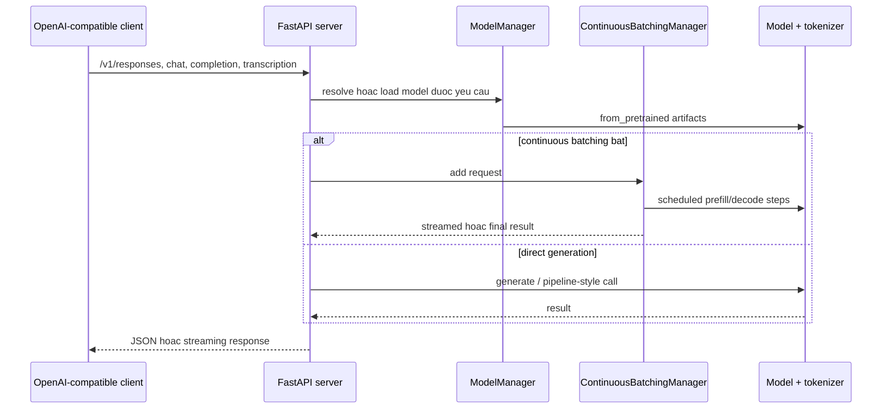
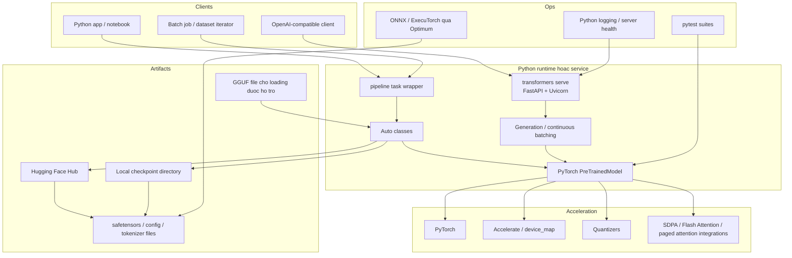
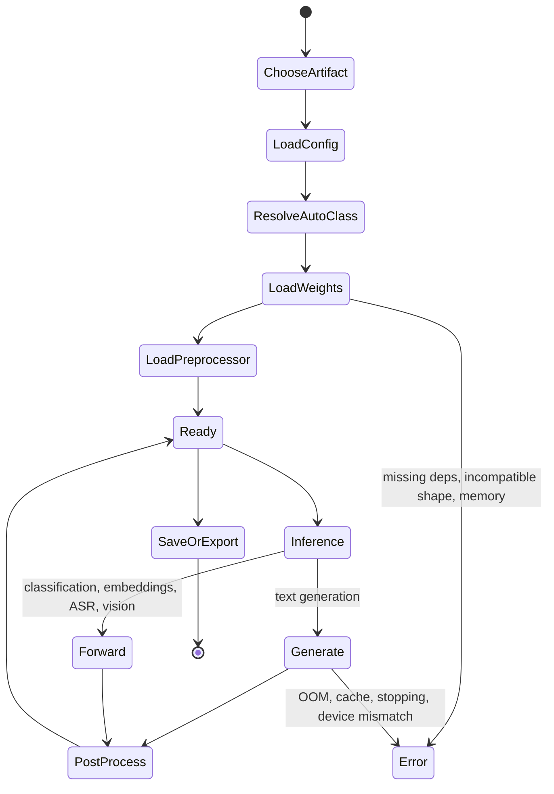
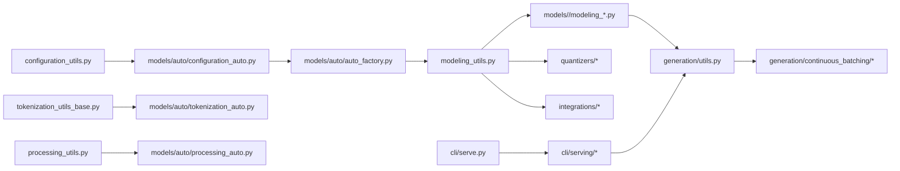
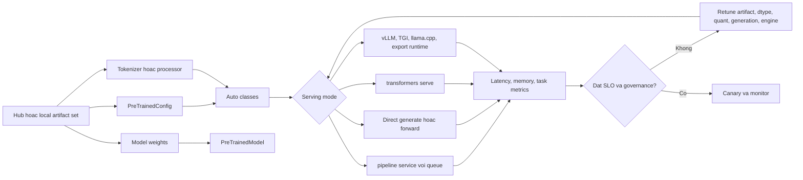
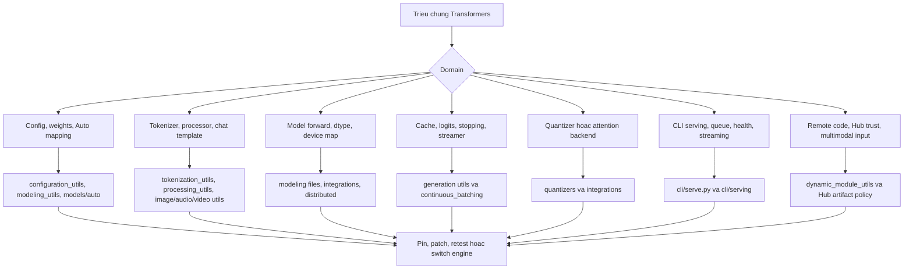

# Kien truc Transformers

Anh chup nguon: `github-repos/02-model-serving-inference/transformers` tai commit `a46a732` (`[docs] contributing (#45465)`). Tai lieu nay dua tren cac tep va thu muc co trong anh chup do.

## Tom tat dieu hanh

Hugging Face Transformers la model-definition framework nam o trung tam ecosystem AI lon. README noi Transformers tap trung dinh nghia model de cac training framework, inference engine va runtime lien quan nhu vLLM, SGLang, TGI, llama.cpp va MLX co the tai su dung. Thu vien ho tro text, vision, audio, video va multimodal models cho inference va training.

Ve kien truc, Transformers la thu vien Python theo lop: configuration classes, pretrained model base classes, tokenizers/processors, Auto classes, per-model implementations, generation utilities, pipelines, trainers, integrations, quantizers va CLI serving. Core library nam trong `src/transformers`; model families trong `src/transformers/models`; task inference cap cao trong `src/transformers/pipelines`; generation trong `src/transformers/generation`; serving CLI trong `src/transformers/cli` va `src/transformers/cli/serving`.

Voi model-serving architect, Transformers vua la runtime truc tiep vua la lop tuong thich chuan. Nhieu serving system dua vao config, tokenizer, chat template, generation config, quy uoc ten model va checkpoint loading cua no. Code moi hon trong `generation/continuous_batching` va `transformers serve` cung cap duong serving OpenAI-compatible, nhung vai tro rong hon cua thu vien van la dinh nghia va load model nhat quan trong ecosystem.

## Bai toan duoc giai quyet

Truoc khi serve mot model, stack phai thong nhat model la gi, weights map vao code ra sao, input duoc preprocess nhu the nao, generation chay theo quy tac gi, artifact duoc luu va chia se ra sao. Transformers giai quyet:

- Interface `from_pretrained` / `save_pretrained` nhat quan cho models, configs, tokenizers, image processors, feature extractors va processors.
- Auto classes map metadata model sang implementation classes.
- Code tung model du ro rang va tu chua de cong dong dong gop.
- Generation algorithms, logits processors, stopping criteria, cache utilities, streamers, watermarking va continuous batching.
- Pipelines cho task inference tren text, audio, vision, video va multimodal.
- Integration points cho quantization, distributed training/inference, attention backends, PEFT, Hub, GGUF, ONNX/ExecuTorch export va serving.

Diem neo trong repo gom `src/transformers/configuration_utils.py`, `modeling_utils.py`, `tokenization_utils_base.py`, `processing_utils.py`, `models/auto/*`, `generation/*`, `generation/continuous_batching/*`, `pipelines/*`, `quantizers/*`, `integrations/*`, `cli/serve.py`, `cli/serving/*` va `tests/*`.

## Vai tro trong AI stack

Transformers dam nhan nhieu vai tro:

- **Model-definition layer:** config va modeling files theo tung model trong `src/transformers/models/*`.
- **Artifact contract layer:** `PreTrainedConfig`, `PreTrainedModel`, tokenizers, processors, `save_pretrained` va layout tuong thich Hub.
- **Inference convenience layer:** `pipeline`, `AutoModelFor*`, `GenerationMixin`, `GenerationConfig`, streamers va chat templates.
- **Serving layer:** `transformers serve` duoc cai dat bang FastAPI/Uvicorn va OpenAI-compatible APIs trong `src/transformers/cli/serving`.
- **Training/fine-tuning layer:** `trainer.py`, `training_args.py`, `trainer_seq2seq.py`, optimization utilities, distributed va integration modules.
- **Cau noi ecosystem:** quantization modules, attention implementations, GGUF loading support, export docs, community integration docs va test contracts.

Trong kien truc serving, Transformers thuong duoc dung ngay ca khi engine cuoi khong phai Transformers. Tokenizers, config files, chat templates, generation config va model class definitions thuong xuat phat tu day.

## Ban do source tree

| Duong dan | Vai tro |
|---|---|
| `README.md` | Dinh vi du an, vai tro ecosystem, vi du pipeline, installation va quick start. |
| `setup.py` | Package metadata, dependency/extras map, Python 3.10-3.14, console script `transformers=transformers.cli.transformers:main`. |
| `pyproject.toml` | Cau hinh Ruff, pytest, coverage, ty type-checker va test markers. |
| `src/transformers/__init__.py` | Public import surface voi lazy availability checks. |
| `src/transformers/configuration_utils.py` | Base `PreTrainedConfig`, serialization, loading va config behavior. |
| `src/transformers/modeling_utils.py` | Base `PreTrainedModel`, loading/saving, device/dtype, weight handling. |
| `src/transformers/core_model_loading.py` | Shared model loading helpers. |
| `src/transformers/tokenization_utils_base.py`, `tokenization_utils_tokenizers.py`, `tokenization_utils_sentencepiece.py` | Tokenizer abstractions va fast/slow tokenizer support. |
| `src/transformers/processing_utils.py`, `image_processing_utils.py`, `audio_utils.py`, `video_processing_utils.py` | Nen tang processor, image, audio va video preprocessing. |
| `src/transformers/models/auto/*` | AutoConfig, AutoTokenizer, AutoProcessor, AutoModel, mapping factories. |
| `src/transformers/models/*` | Per-model implementations cho nhieu architecture text, vision, audio va multimodal. |
| `src/transformers/generation/*` | Generation config, logits processors, stopping criteria, streamers, candidate generators, watermarking, utilities. |
| `src/transformers/generation/continuous_batching/*` | Continuous batching manager, scheduler, cache manager, model runner, request states, offloading, distributed helpers. |
| `src/transformers/pipelines/*` | Task-level inference wrappers cho text, audio, vision, video va multimodal. |
| `src/transformers/quantizers/*` | Tich hop quantization methods va automatic quantizer selection. |
| `src/transformers/integrations/*` | Accelerate, DeepSpeed, Flash Attention, SDPA, tensor parallel, ggml, PEFT, quantization libraries, TPU/NPU va integrations lien quan. |
| `src/transformers/cli/*` | Typer CLI command group, chat/download/system/serve commands. |
| `src/transformers/cli/serving/*` | FastAPI serving implementation: server build, model manager, chat completions, completions, responses, transcriptions, utilities. |
| `docs/source/en/*` | Docs nguoi dung va developer: continuous batching, serving, add model/pipeline, GGUF, serialization/export, testing, quantization. |
| `tests/*` | Common model/test mixins, generation tests, continuous batching tests, quantization tests, pipeline tests, model tests, CLI serving tests. |
| `examples`, `notebooks`, `benchmark`, `benchmark_v2` | Vi du su dung va performance workflows. |

## Khai niem cot loi

**PreTrainedConfig.** Blueprint cua model. No luu metadata architecture va hyperparameters, ho tro serialization va chi phoi class selection. Base nam trong `configuration_utils.py`.

**PreTrainedModel.** Base class cho PyTorch models. No cung cap loading, saving, dtype/device handling, weight tying va compatibility utilities. Base nam trong `modeling_utils.py`.

**Auto classes.** `src/transformers/models/auto` map configs va model types sang implementation classes. Auto classes cho phep user viet `AutoModelForCausalLM.from_pretrained(...)` ma khong import architecture class cu the.

**Tokenizer / processor.** Tokenizer chuyen text thanh token IDs; image/audio/video processor chuan hoa input phi text; processor ket hop nhieu modality. Base utilities nam trong `tokenization_utils_base.py`, `processing_utils.py` va cac utility theo modality.

**Per-model folders.** Moi model family co cac tep nhu `configuration_*.py`, `modeling_*.py`, tokenization/processing files, conversion utilities va tests. Docs them model nhan manh model files tu chua va abstraction it tang.

**Generation.** Hanh vi generation duoc dieu khien boi `GenerationConfig`, logits processors, stopping criteria, candidate generators, streamers va model methods. Cac thanh phan nay nam trong `src/transformers/generation`.

**Continuous batching.** `docs/source/en/continuous_batching.md` va `continuous_batching_architecture.md` mo ta che do generation cho serving: reschedule request dong, paged KV cache, chunked prefill, CUDA graphs tuy chon, async batching, prefix caching va offloading.

**Pipeline.** `src/transformers/pipelines` cung cap task-oriented inference wrappers. Pipeline xu ly preprocessing, model invocation va postprocessing cho cac task pho bien.

**Serve CLI.** `src/transformers/cli/serve.py` expose `transformers serve`; `src/transformers/cli/serving/*` cai dat FastAPI routes va model management. `setup.py` expose console script `transformers`.

## So do thanh phan he thong

## Kien truc noi bo

Transformers dung cac contract thay vi mot runtime loop duy nhat.

**Artifact contract.** Config, model, tokenizer, processor, generation config va safetensors/checkpoint files duoc luu theo layout co the reload local hoac tu Hub. `from_pretrained` va `save_pretrained` la contract artifact chinh.

**Auto mapping contract.** Auto classes tranh hardcode ten implementation trong ung dung. Cac file `auto_factory.py`, `configuration_auto.py`, `modeling_auto.py`, `tokenization_auto.py`, `processing_auto.py` va mapping files lien quan dieu khien cach metadata model type map sang classes.

**Model implementation contract.** Guide `docs/source/en/add_new_model.md` noi model files nen de doc, tu chua va phu thuoc truc tiep vao `PreTrainedModel`. Dieu nay giu architecture moi de tiep can va test.

**Generation contract.** Causal generation dung tap helpers chung, logits processors, stopping criteria, cache helpers va streamers. Model-specific code cung cap forward pass va cache behavior; generation utilities dieu phoi decoding strategies.

**Task inference contract.** Pipelines boc tokenizer/processor, model call va postprocessing thanh cac class theo task nhu text generation, ASR, image classification, object detection va multimodal question answering.

**Serving contract.** CLI serving layer boc model loading va generation sau FastAPI. Tests trong `tests/cli/test_serve.py` bao phu server startup, health behavior, streaming, responses, chat completions, continuous batching state va error handling.

## Luong dau cuoi

Voi `transformers serve`, API layer dung cung cac khai niem do:

## Runtime va data flow

1. **Chon artifact.** Model ID hoac local path duoc dua vao Auto class, pipeline, Trainer hoac server.
2. **Load config.** `AutoConfig` doc `config.json` va xac dinh model type cung architecture mapping.
3. **Resolve class.** Auto factories chon model/tokenizer/processor classes tu mappings trong `src/transformers/models/auto`.
4. **Load weights.** `PreTrainedModel.from_pretrained` load safetensors/PyTorch hoac format thay the duoc ho tro, ap dung dtype/device/quantization va khoi tao class.
5. **Preprocessing.** Tokenizer/processor utilities chuyen input thanh tensors. Chat templates va multimodal processors co the transform role/content structures truoc tokenization.
6. **Forward/generate.** Forward pass chay qua PyTorch va integrations tuy chon nhu SDPA, Flash Attention, tensor parallel, quantization hoac custom kernels.
7. **Generation loop.** `GenerationConfig` va logits processors dieu khien token selection, stopping, streaming, assisted decoding, watermarking hoac continuous batching.
8. **Postprocessing.** Pipelines hoac serving utilities decode tokens, format labels/boxes/timestamps, chuan hoa response OpenAI-compatible va xu ly streaming chunks.
9. **Persistence/export.** `save_pretrained`, safetensors, GGUF loading docs va serialization/export docs dinh nghia cach artifact di sang runtime khac.

## Topology trien khai va van hanh

Ve van hanh, Transformers co the chay trong notebook, batch job, web server, training job va direct serving process. `docs/source/en/pipeline_webserver.md` canh bao web server co concurrency trong khi PyTorch model execution ton memory va blocking; doc goi y pattern queue va mot model worker cho pipeline server don gian. Voi production `transformers serve`, docs khuyen dung CLI serving path va nhac continuous batching nhu mot toi uu.

## Vong doi, quyet dinh va phu thuoc module

## Diem mo rong

- **Them model:** `docs/source/en/add_new_model.md` mo ta them config, modeling, tests, conversion, docs va Auto mappings. Guide nhan manh model files de doc va tu chua.
- **Them modular model:** `docs/source/en/modular_transformers.md` la duong moi hon de giam lap implementation.
- **Them pipeline:** `docs/source/en/add_new_pipeline.md` va `src/transformers/pipelines/base.py` dinh nghia conventions cho task pipeline.
- **Them tokenizer/processor support:** tokenizer va processor base utilities cong `models/auto/*_auto.py` xu ly discovery va loading.
- **Them quantization support:** `src/transformers/quantizers/base.py`, `auto.py` va quantizer theo tung method dinh nghia cach quantization config map sang implementation.
- **Them integrations:** `src/transformers/integrations/*` la pattern cho attention backends, accelerators, tensor parallelism, GGUF, PEFT va hardware-specific paths.
- **Mo rong generation:** `generation/logits_process.py`, `stopping_criteria.py`, `candidate_generator.py`, `streamers.py`, `continuous_batching/*` la extension points cho decoding behavior.
- **Mo rong serve CLI:** `src/transformers/cli/serving/*` chua route va model-manager code cho server behavior.

## Tich hop

Transformers tich hop voi:

- Hugging Face Hub de lay model, tokenizer, processor va artifact tuong tu dataset.
- PyTorch la execution backend chinh trong snapshot nay.
- Accelerate, DeepSpeed, FSDP, tensor parallel, TPU/NPU va tooling distributed/hardware khac qua `src/transformers/integrations`.
- Quantization libraries nhu bitsandbytes, AWQ, GPTQ, HQQ, TorchAO, Quanto, Quark, MXFP4, FP8-related methods va cac thu vien khac qua `src/transformers/quantizers`.
- Attention implementations nhu SDPA, Flash Attention, paged attention/eager paged integrations va flex attention.
- GGUF loading support qua `docs/source/en/gguf.md`, `modeling_gguf_pytorch_utils.py`, `integrations/ggml.py`; docs noi GGUF duoc load cho training/fine-tuning tiep bang cach dequantize sang fp32.
- Serving dependencies trong extras cua `setup.py`: `openai`, `pydantic`, `uvicorn`, `fastapi`, `starlette`, `rich`, cong torch/accelerate.
- Export paths trong `docs/source/en/serialization.md`, gom ONNX va ExecuTorch qua Optimum.

## Cau hinh, trien khai va ops

Nguon cau hinh gom:

- `config.json` qua `PreTrainedConfig`.
- tokenizer va processor JSON/model files.
- `generation_config.json` va runtime `GenerationConfig`.
- `TrainingArguments` / `Seq2SeqTrainingArguments` cho training jobs.
- CLI flags cho `transformers serve` trong `src/transformers/cli/serve.py`.
- Quantization configs va attention/dtype/device-map parameters.

Cac pattern trien khai:

- **Library inference:** `AutoTokenizer` + `AutoModelFor*` + `generate` hoac forward calls.
- **Pipeline inference:** `pipeline(...)` theo task cho text/audio/vision/multimodal.
- **Dataset/batch inference:** pipelines tren iterator hoac dataset, can batching than trong.
- **Simple web service:** pipeline server co queue nhu mo ta trong `pipeline_webserver.md`.
- **Transformers serve:** FastAPI/Uvicorn OpenAI-compatible server voi continuous batching tuy chon.
- **Exported runtime:** ONNX hoac ExecuTorch qua Optimum cho runtime production toi uu.
- **External serving engines:** vLLM, SGLang, TGI, llama.cpp va engine khac tieu thu config/model definitions/tokenizers cua Transformers.

Can nhac ops:

- Optional dependencies theo tung feature. Thieu `tokenizers`, `sentencepiece`, `torch`, `fastapi`, quantization packages hoac attention libraries co the doi behavior.
- `device_map="auto"`, dtype, quantization va attention implementation anh huong truc tiep memory va latency.
- Pipeline batching khong phai luc nao nhanh hon; `pipeline_webserver.md` canh bao dynamic batching can thiet ke queue va timeout ky.
- Continuous batching can GPU memory budgeting, cache sizing, scheduler choice va attention compatibility.
- Serving can health checks va overload behavior; tests co case continuous-batching worker unhealthy tra 503.

## Observability, testing, evaluation va failure modes

Testing la mot phan lon cua kien truc repo.

- `tests/test_modeling_common.py`, `test_configuration_common.py`, `test_tokenization_common.py`, `test_processing_common.py` va mixins lien quan enforce behavior chung qua cac model.
- `tests/models/*` chua tests theo tung model.
- `tests/generation/*` bao phu generation utilities, logits processors, stopping criteria, streamers, paged attention, flash attention parity va continuous batching.
- `tests/pipelines/*` bao phu task-level pipeline behavior.
- `tests/quantization/*` bao phu quantization paths.
- `tests/cli/test_serve.py`, `test_chat.py`, `test_download.py`, `test_system.py` bao phu CLI va serving behavior.
- `pyproject.toml` dinh nghia pytest markers nhu `generate`, `is_training_test`, `is_tensor_parallel_test` va flash attention markers.

Observability phu thuoc ung dung hon so voi dedicated serving engine. Cac diem neo huu ich:

- Python logging va warnings trong model loading, generation, integrations va serving utilities.
- Health behavior va HTTP error handling cua `transformers serve` trong `cli/serving`.
- Pipeline/webserver docs khuyen error handling, queue limits va circuit breaking ro rang.
- Benchmark folders va Optimum benchmark integration cho performance evaluation.

Failure modes pho bien:

- **Thieu optional dependencies:** tokenizer, processor, quantizer, audio/video, serving hoac attention package chua cai.
- **Model/config mismatch:** sai architecture class, thieu Auto mapping, config xau, hoac checkpoint shape khong compatible.
- **Tokenizer/processor mismatch:** text hoac multimodal input tao IDs/pixel/audio features sai.
- **Memory errors:** model qua lon, dtype qua rong, device map sai, cache qua lon, hoac batching qua manh.
- **Generation bat ngo:** EOS/stopping criteria, chat template, logits processors hoac generation config khong khop ky vong.
- **Quantization issues:** device/backend khong ho tro, accuracy regression, hoac module layout incompatible.
- **Serving overload:** PyTorch block main thread, queue tang, continuous batching worker fail, hoac cancel request xu ly sai.
- **Remote artifact risk:** untrusted model files hoac remote code settings co the thuc thi hay load behavior khong mong muon.

## Rui ro bao mat va governance

- **Provenance va license cua model:** Hub models rat da dang; governance can theo doi model card, license, source weights, revisions va intended use.
- **Remote code:** `trust_remote_code` co the execute code trong repo. Xem nhu privileged code va pin revision.
- **Du lieu nhay cam:** prompts, completions, audio, images va logs co the chua regulated data.
- **Serving API exposure:** `transformers serve` nen chay sau authentication, TLS, rate limiting va request size controls.
- **Dependency supply chain:** nhieu optional dependencies duoc load cho quantization, serving, tokenization, audio/video va acceleration.
- **Quantization va export drift:** doi dtype, quantization, ONNX/ExecuTorch export hoac GGUF conversion co the doi hanh vi model.
- **Evaluation governance:** unit tests pass khong chung minh model an toan, dung su that, cong bang hay phu hop domain.
- **Multimodal input risk:** image/audio/video parsers lam tang attack surface va rui ro can kiet tai nguyen.

## Huong dan doc source

1. Bat dau voi `README.md` de hieu vai tro ecosystem va vi du nguoi dung.
2. Doc `setup.py` de hieu extras, optional dependencies va entry point CLI `transformers`.
3. Doc `configuration_utils.py`, `modeling_utils.py`, `tokenization_utils_base.py`, `processing_utils.py`.
4. Doc `src/transformers/models/auto/*` de hieu class resolution.
5. Chon mot model folder, vi du `models/llama`, va so sanh config/model/tokenizer files voi tests.
6. Doc `generation/configuration_utils.py`, `generation/utils.py`, `logits_process.py`, `stopping_criteria.py`, `streamers.py`.
7. Doc `generation/continuous_batching/*` va hai docs continuous batching neu hoc serving throughput.
8. Doc `pipelines/base.py` va mot vai task pipeline.
9. Doc `cli/serve.py` va `cli/serving/*` cho direct serving behavior.
10. Review common tests truoc khi sua contracts.

## Lo trinh hoc

1. Load mot tiny model voi `AutoTokenizer` va `AutoModelForCausalLM`.
2. Kiem tra `config.json`, tokenizer files va generation config da tai.
3. Trace `AutoModelForCausalLM.from_pretrained` vao Auto mappings va `PreTrainedModel`.
4. Chay generation va xac dinh noi logits processors va stopping criteria ap dung.
5. Dung pipeline cho cung task va trace preprocessing/postprocessing.
6. Hoc mot per-model implementation va tests cua no.
7. Review quantization va attention integration options cho deployment.
8. Kham pha `transformers serve` va continuous batching sau khi da hieu generation co ban.
9. Validate ung vien production bang task metrics, latency, memory va safety evaluations.

## Checklist production và cổng quyết định serving

Readiness production của Transformers bắt đầu từ artifact contract: `config.json`, weights, tokenizer, processor, generation config và optional remote code. Sau đó đường serving phụ thuộc workload dùng direct `generate`, `pipeline`, `transformers serve` hay một external serving engine vẫn tiêu thụ artifact của Transformers. Hãy review `src/transformers/configuration_utils.py`, `modeling_utils.py`, `models/auto/*`, `generation/*`, `generation/continuous_batching/*`, `pipelines/*`, `cli/serving/*`, `quantizers/*`, `integrations/*` và `tests/cli/test_serve.py`.

| Khu vực quyết định | Cần xác minh |
|---|---|
| Khóa artifact | Pin model revision, config, tokenizer/processor files, generation config, safetensors và quyết định custom code. |
| Dependency set | Chỉ cài extras cần thiết: tokenizers, sentencepiece, audio/video, serving, quantization, attention hoặc acceleration packages. |
| Serving mode | Chọn direct library, queue-backed pipeline service, `transformers serve`, export path hoặc external engine theo latency/throughput. |
| Generation contract | Test chat template, EOS/stop tokens, logits processors, streamers, cache implementation và structured response expectation. |
| Memory/performance | Validate dtype, device map, quantization, attention implementation, batch sizes và continuous batching cache budget. |
| Governance | Xem `trust_remote_code`, Hub artifacts, multimodal parsers, logs và model licenses là quyết định production có quyền cao. |

## Bản đồ cô lập lỗi

Một lỗi Transformers có thể xảy ra trước khi model chạy: Auto mapping, optional dependency, tokenizer files, remote code, shape loading và processor behavior đều nằm trước inference. Triage nên cô lập domain artifact, preprocessing, model execution, generation, serving và security.

## Bang chu giai

| Thuat ngu | Nghia |
|---|---|
| PreTrainedConfig | Blueprint model co the serialize, chua hyperparameters. |
| PreTrainedModel | Base model class voi loading, saving, weight, dtype va device utilities. |
| Auto class | Factory class chon config/model/tokenizer/processor cu the tu metadata. |
| Tokenizer | Thanh phan map text sang token IDs va nguoc lai. |
| Processor | Thanh phan boc mot hoac nhieu modality preprocessors, thuong cho multimodal models. |
| Pipeline | Task-level inference wrapper xu ly preprocessing, model call va postprocessing. |
| GenerationConfig | Object cau hinh dieu khien decoding behavior. |
| LogitsProcessor | Hook sua logits trong generation. |
| StoppingCriteria | Hook quyet dinh khi nao dung generation. |
| Streamer | Utility phat text sinh ra theo thoi gian thuc. |
| Continuous batching | Che do serving dong them/loai request generation moi step. |
| Paged KV cache | Cache design luu key/value state trong pages/blocks co kich thuoc co dinh. |
| device_map | Mapping module sang device, thuong do Accelerate quan ly. |
| safetensors | Dinh dang serialize tensor an toan, pho bien cho model weights. |
| GGUF | Dinh dang single-file cua ggml/llama.cpp, Transformers ho tro loading cho mot so model. |
