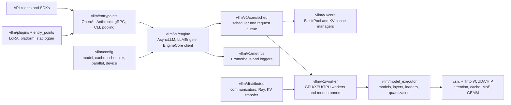
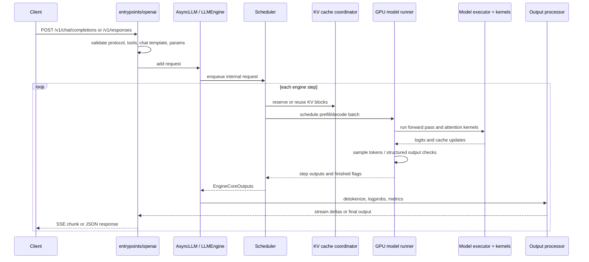
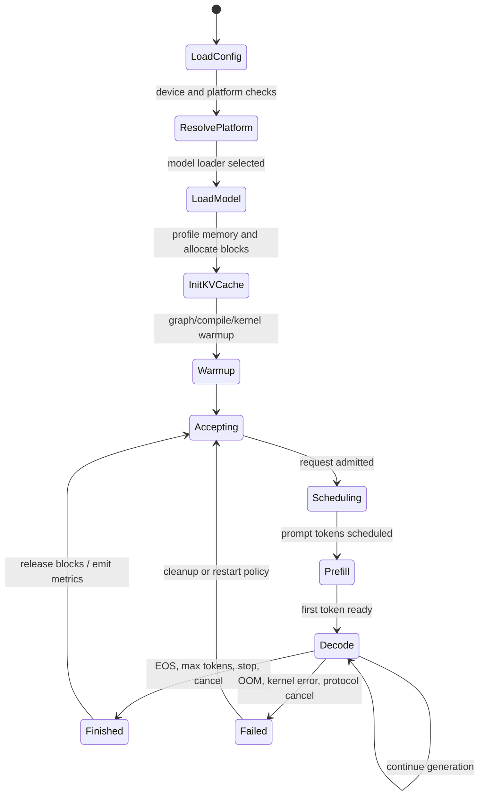
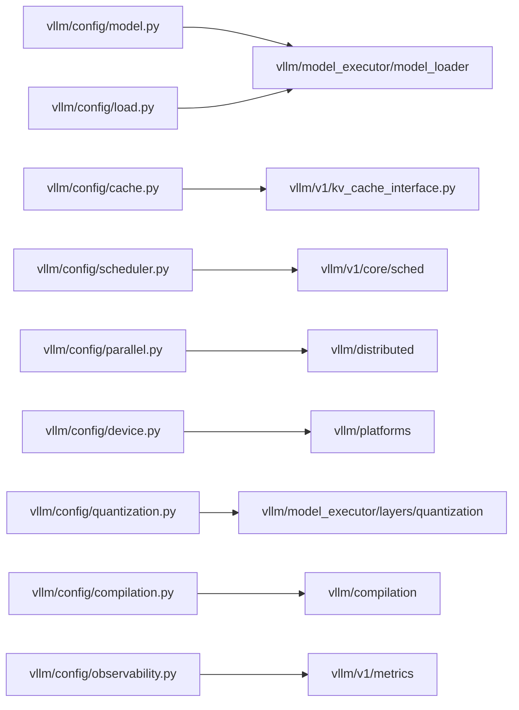
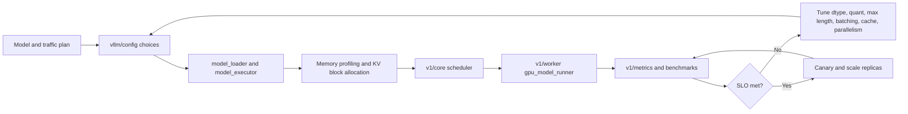
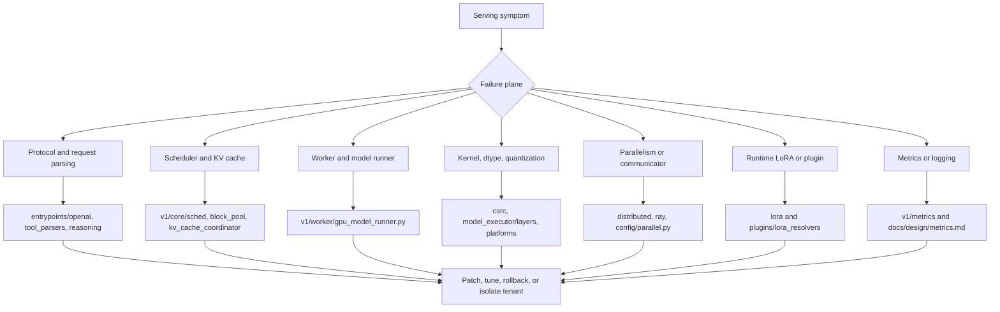

# vLLM Architecture

Source snapshot: `github-repos/02-model-serving-inference/vllm` at `2427094` (`[Feature] Support EPLB for DeepSeek v4 Mega Moe (#43339)`). This document is grounded in the repository files present in that snapshot.

## Executive Summary

vLLM is a high-throughput, memory-efficient inference and serving engine for large language models. Its README describes the project as "easy, fast, and cheap LLM serving" and highlights PagedAttention, continuous batching, chunked prefill, prefix caching, CUDA/HIP graphs, quantization, optimized attention/GEMM/MoE kernels, speculative decoding, multi-LoRA, and OpenAI-compatible serving.

Architecturally, vLLM is not just a Python wrapper around PyTorch models. It is a serving runtime with a request scheduler, KV-cache allocator, model runner abstraction, hardware platform layer, custom kernels, API server layer, plugin system, metrics layer, and a large model registry. The current tree shows both classic engine files in `vllm/engine/*` and the newer V1 runtime in `vllm/v1/*`; production-facing code increasingly centers on `vllm/v1/engine`, `vllm/v1/core`, `vllm/v1/worker`, `vllm/entrypoints`, and `vllm/model_executor`.

For solution architects, vLLM's value is that it turns model weights into a scalable service: HTTP/gRPC APIs, dynamic scheduling, memory-aware batching, distributed execution, quantized kernels, streaming outputs, tool and reasoning parsers, LoRA adaptation, and observability hooks. Its primary design tradeoff is complexity: performance comes from tight coupling among scheduler policy, KV-cache layout, model execution, kernels, and deployment topology.

## Problem Solved

Large language model serving has different constraints from offline model execution:

- Requests arrive continuously and have different prompt and output lengths.
- GPU memory is dominated by model weights and KV cache, not only activations.
- Static batches waste capacity when short requests finish early.
- Long prefills can block low-latency decode traffic.
- Every token requires low-overhead scheduling, sampling, detokenization, and streaming.
- Production APIs need compatibility, monitoring, lifecycle controls, and failure isolation.

vLLM addresses these with a runtime that schedules work every step, allocates KV cache in blocks, reuses prefixes, loads model weights through configurable loaders, selects hardware-specific kernels, and exposes serving APIs. The repository evidence for these concerns appears in `vllm/v1/core/sched/*`, `vllm/v1/core/block_pool.py`, `vllm/v1/core/kv_cache_coordinator.py`, `vllm/model_executor/*`, `csrc/attention/*`, `vllm/entrypoints/openai/*`, `vllm/v1/metrics/*`, and `docs/design/*`.

## AI Stack Role

vLLM sits between model-definition libraries and application/API clients.

- Upstream model sources: Hugging Face model repositories, tensor formats, quantized checkpoints, LoRA adapters, tokenizer/chat-template assets.
- Runtime layer: PyTorch, custom CUDA/HIP/C++/Triton/CuTeDSL kernels, platform plugins, distributed communicators.
- Serving layer: OpenAI-compatible APIs, Anthropic Messages API, gRPC, batch/offline APIs, CLI commands.
- Operations layer: Docker, deployment docs, metrics, logging, profiling, benchmarks, tests.

It is usually selected when an organization wants high-throughput LLM serving without building its own scheduler and KV-cache system. It can serve text generation, embeddings, pooling, classification, reward/scoring, multimodal, speech-to-text, LoRA-enhanced, and structured-output workloads depending on model support and feature flags.

## Source Tree Map

| Path | Role |
|---|---|
| `README.md` | Project positioning, feature list, install guidance, supported model categories, citation and support links. |
| `pyproject.toml` | Python package metadata, build requirements, Python version range, CLI entry point `vllm = vllm.entrypoints.cli.main:main`, plugin entry points for LoRA resolvers, pytest markers. |
| `vllm/entrypoints` | User-facing APIs: CLI, OpenAI-compatible REST, Anthropic API, gRPC server, pooling, speech-to-text, MCP tool server, SageMaker integration. |
| `vllm/engine` | Classic engine classes such as `llm_engine.py`, `async_llm_engine.py`, and engine argument utilities. |
| `vllm/v1/engine` | V1 engine client/core split: `async_llm.py`, `llm_engine.py`, `core.py`, `coordinator.py`, input/output processors, detokenizer, parallel sampling. |
| `vllm/v1/core` | Scheduler, request queue, block pool, KV-cache manager/coordinator, encoder cache manager, cache metrics. |
| `vllm/v1/worker` | Device workers and model runners including `gpu_worker.py`, `gpu_model_runner.py`, XPU and TPU paths, LoRA/KV connector mixins. |
| `vllm/v1/attention` | Attention backend interfaces and implementations used by the V1 worker/runtime. |
| `vllm/model_executor` | Model loading, model definitions, layers, quantization, attention layers, MoE layers, custom ops, offloading, warmup. |
| `vllm/config` | Structured configuration modules for model, scheduler, cache, device, parallelism, LoRA, quantization, compilation, multimodal, observability, profiler, KV transfer. |
| `vllm/distributed` | Distributed execution, device communicators, NCCL/Ray/shared-memory communication, elastic expert parallel pieces, KV transfer, event connectors. |
| `vllm/lora` and `vllm/plugins/lora_resolvers` | LoRA request handling, runtime adapters, filesystem and Hugging Face Hub resolver plugins. |
| `vllm/platforms` | Platform abstraction for NVIDIA/AMD/CPU/TPU/XPU and out-of-tree hardware plugins. |
| `csrc` | Native kernels and torch bindings: attention, cache ops, CUDA utilities, MoE, quantization, ROCm, CPU kernels, all-reduce. |
| `rust` | Rust components for chat rendering, tokenization, tool parsing, text output, and reasoning parser support. |
| `docs/design` | Design notes for PagedAttention, metrics, plugin system, prefix caching, multiprocessing, torch compile, LoRA resolver plugins, model runner V2, multimodal processing. |
| `examples` | Chat templates, OpenAI client examples, tool-calling, observability, pooling, and feature samples. |
| `tests` | Unit, kernel, config, model, entrypoint, distributed, LoRA, evaluation, and regression tests. |
| `benchmarks` and `vllm/benchmarks` | Latency, throughput, serving, startup, dataset, and sweep benchmarks. |
| `docker`, `requirements`, `scripts`, `tools` | Packaging, containerization, dependency sets, developer and release automation. |

## Core Concepts

**Request lifecycle.** A user request becomes an internal request with tokenized inputs, sampling/structured-output constraints, optional multimodal payloads, optional LoRA identity, and API metadata. V1 request structures live in `vllm/v1/request.py`; output forms live in `vllm/v1/outputs.py` and top-level `vllm/outputs.py`.

**Engine vs. engine core.** The outer engine/API side handles request ingress, streaming, detokenization, metrics, cancellation, and user protocol mapping. `vllm/v1/engine/async_llm.py` shows `AsyncLLM` as an engine client; `vllm/v1/engine/core.py` contains `EngineCore`, `EngineCoreProc`, and actor variants. This separation helps isolate the high-performance inner loop.

**Continuous batching.** The scheduler builds a batch at each step instead of waiting for a static batch to finish. The relevant files are `vllm/v1/core/sched/scheduler.py`, `request_queue.py`, `async_scheduler.py`, and `interface.py`.

**Chunked prefill.** Long prompts are split so decode work can continue. The README explicitly lists chunked prefill, and scheduler/cache files show token and block budgeting at runtime.

**Paged KV cache.** vLLM stores KV memory in blocks so requests of different lengths can share a fixed memory pool. `docs/design/paged_attention.md` explains historical kernel concepts and points to `csrc/attention/attention_kernels.cu`; the V1 cache implementation is in `vllm/v1/core/block_pool.py`, `kv_cache_manager.py`, `single_type_kv_cache_manager.py`, and `kv_cache_coordinator.py`.

**Prefix caching.** `docs/design/prefix_caching.md` and V1 cache coordinator/block pool files describe reuse of computed prompt blocks. This improves repeated system prompts, retrieval templates, and multi-turn chat with shared prefixes.

**Model runner.** Worker-side runners prepare input batches, invoke model forward passes, handle KV cache tensors, run sampling, and coordinate GPU graph paths. Key files include `vllm/v1/worker/gpu_model_runner.py`, `gpu_input_batch.py`, `gpu_worker.py`, `gpu/structured_outputs.py`, and `gpu/spec_decode/*`.

**Model executor.** `vllm/model_executor` contains the model loading and layer implementation substrate. It includes attention layers, quantization methods, fused MoE layers, Mamba layers, rotary embeddings, loaders for GGUF/tensorizer/bitsandbytes/default/sharded weights, and many architecture-specific model files in `vllm/model_executor/models`.

**Serving protocols.** `vllm/entrypoints/openai` implements OpenAI-compatible chat/completion/responses/models/engine routes. Other entrypoints include `anthropic`, `grpc_server.py`, `pooling`, `speech_to_text`, and `mcp`.

**Plugins.** `docs/design/plugin_system.md` documents entry point groups such as `vllm.general_plugins`, `vllm.platform_plugins`, `vllm.io_processor_plugins`, and `vllm.stat_logger_plugins`. `pyproject.toml` registers built-in LoRA resolver plugins.

## Component/System Diagram



## Internal Architecture

The architecture has four primary planes.

**Protocol plane.** `vllm/entrypoints` translates external protocols into internal engine calls. `vllm/entrypoints/openai/api_server.py`, `chat_completion/serving.py`, `completion/serving.py`, and `responses/serving.py` define the OpenAI-compatible surface. The Anthropic adapter in `vllm/entrypoints/anthropic/serving.py` converts Anthropic message format to OpenAI-compatible internal requests. Pooling and speech-to-text entrypoints use separate protocol and IO processor modules.

**Scheduling and memory plane.** `vllm/v1/core` owns request admission, scheduling, KV block allocation, cache reuse, and cache metrics. The scheduler must balance running decodes, waiting prefills, token budget, KV budget, and fairness. The block pool keeps free and cached blocks, while cache coordinators handle full-attention, sliding-window, MLA, hybrid, Mamba, encoder-only, and cross-attention cache specs exposed by `vllm/v1/kv_cache_interface.py`.

**Execution plane.** `vllm/v1/worker` owns device initialization, model loading, cache initialization, execution, sampling, structured outputs, LoRA mixing, and graph warmup. `vllm/model_executor` contains reusable layers and model definitions. Custom kernels in `csrc` and generated/Triton kernels are selected based on hardware, dtype, attention type, quantization, and model architecture.

**Operations plane.** Metrics, logging, profiling, benchmarks, deployment docs, Docker files, and tests make the runtime operable. `docs/design/metrics.md` states that V1 exposes Prometheus-compatible metrics with the `vllm:` prefix and favors collecting metrics outside the engine core where possible to reduce inner-loop overhead.

## End-to-End Runtime Flow



## Runtime and Data Flow

1. **Ingress.** A FastAPI route or CLI path accepts the request. OpenAI-compatible code in `vllm/entrypoints/openai/*` validates fields such as model, messages, prompt, tools, streaming, sampling, logprobs, and response format.
2. **Input processing.** Chat templates from `examples/*.jinja`, tokenizer utilities in `vllm/tokenizers` and `vllm/transformers_utils`, multimodal processors in `vllm/multimodal`, and structured-output parsers normalize user input.
3. **Admission.** The engine creates an internal request and enqueues it in the scheduler. Admission depends on token budgets, model length, LoRA status, cache capacity, and parallel configuration.
4. **Prefill.** Prompt tokens are processed and KV cache blocks are written. Long prompts may be chunked.
5. **Decode.** The scheduler repeatedly forms decode batches. Each active sequence usually contributes one query token per step, while cache pages provide context.
6. **Sampling.** `vllm/v1/worker/gpu/sample/*` and top-level sampling parameter modules implement temperature, top-k/top-p/min-p, penalties, logprob extraction, bad words, logit bias, and output states.
7. **Post-processing.** Detokenization, tool-call parsing, reasoning parser output, structured-output validation, and logprob formatting happen outside the innermost kernel path.
8. **Streaming/final response.** The API layer returns SSE chunks or a final JSON payload. Metrics are updated from request and engine events.

## Deployment and Operations Topology

```mermaid
flowchart TB
    subgraph Users
        SDK[OpenAI SDK / curl / app server]
    end
    subgraph Edge
        LB[Load balancer or ingress]
        Auth[API key / TLS / network policy]
    end
    subgraph VLLMNode["vLLM serving node or pod"]
        API[API server process\nvllm serve]
        Core[Engine core process / actor]
        Workers[Worker processes\nGPU model runners]
        Cache[KV cache blocks in GPU memory]
        Metrics[/metrics endpoint]
    end
    subgraph Platform
        GPU[NVIDIA/AMD/TPU/XPU/CPU]
        ModelStore[HF Hub, local disk, object store]
        Adapters[LoRA resolver cache]
        Prom[Prometheus + Grafana]
    end

    SDK --> LB --> Auth --> API
    API --> Core --> Workers --> GPU
    Workers <--> Cache
    API --> ModelStore
    API --> Adapters
    Prom --> Metrics
```

Operationally, vLLM can run as a Python CLI service, containerized API server, Ray-backed distributed deployment, SageMaker endpoint, or specialized topology for data/expert/tensor/pipeline/context parallelism. The docs tree includes `docs/deployment`, `docs/serving`, and `docs/configuration`. Docker assets live under `docker`, and build dependencies are split in `requirements`.

Important production knobs are represented in `vllm/config`: cache sizing and block size, scheduler behavior, model length, dtype, quantization, parallelism, device selection, compilation, LoRA, multimodal limits, observability, profiling, and KV transfer/offload.

## Lifecycle, Decisions, and Module Dependencies





## Extension Points

vLLM is intentionally extensible, but extension quality depends on respecting process boundaries and version compatibility.

- **Model plugins:** `docs/design/plugin_system.md` describes `vllm.general_plugins` for registering out-of-tree model architectures through `ModelRegistry.register_model`.
- **Platform plugins:** `vllm.platform_plugins` can register an out-of-tree platform class with custom worker, attention backend, device communicator, and ops.
- **IO processor plugins:** `vllm.io_processor_plugins` support custom pooling pre/post-processing.
- **Stat logger plugins:** `vllm.stat_logger_plugins` can add custom metric/log sinks.
- **LoRA resolver plugins:** `pyproject.toml` registers `lora_filesystem_resolver` and `lora_hf_hub_resolver`; `docs/design/lora_resolver_plugins.md` documents runtime LoRA discovery through environment variables such as `VLLM_ALLOW_RUNTIME_LORA_UPDATING`, `VLLM_PLUGINS`, and `VLLM_LORA_RESOLVER_CACHE_DIR`.
- **Attention backends and kernels:** `vllm/v1/attention`, `vllm/model_executor/layers/attention`, `csrc/attention`, and `vllm/kernels` provide backend-specific implementation points.
- **Quantization methods:** `vllm/model_executor/layers/quantization` contains AWQ, GPTQ, FP8, MXFP4/MXFP8, GGUF, compressed tensors, TorchAO, bitsandbytes, and related strategies.
- **Serving protocols:** New routes can follow patterns in `vllm/entrypoints/openai/*`, `anthropic/*`, `pooling/*`, or `serve/*`.

## Integrations

The repository shows integrations across the model, hardware, and serving ecosystem:

- Hugging Face model and tokenizer loading via `vllm/transformers_utils`, `vllm/model_executor/model_loader`, and README-supported model architecture categories.
- OpenAI-compatible APIs in `vllm/entrypoints/openai`.
- Anthropic Messages API in `vllm/entrypoints/anthropic`.
- gRPC in `vllm/entrypoints/grpc_server.py`.
- MCP tool serving in `vllm/entrypoints/mcp`.
- SageMaker adapter in `vllm/entrypoints/sagemaker`.
- Ray and distributed communication in `vllm/ray` and `vllm/distributed`.
- Prometheus/Grafana observability through `vllm/v1/metrics` and `examples/observability`.
- LoRA and PEFT-style adapter serving through `vllm/lora`.
- Structured outputs through `vllm/v1/structured_output`, `vllm/config/structured_outputs.py`, `vllm/reasoning`, `vllm/tool_parsers`, and Rust parser components.

## Configuration, Deployment, and Ops

Configuration is layered rather than centralized in one file. `vllm/config` separates model, scheduler, cache, parallel, device, compilation, quantization, LoRA, multimodal, profiler, observability, and transfer concerns. CLI arguments are wired through `vllm/engine/arg_utils.py`, `vllm/entrypoints/cli/*`, and OpenAI CLI argument utilities.

Deployment considerations:

- **Model fit:** choose dtype, quantization, tensor/pipeline/expert/data parallelism, max model length, and KV cache budget before scaling replicas.
- **Latency vs throughput:** continuous batching improves throughput but can raise tail latency if scheduling and prefill budgets are poorly tuned.
- **Long prompts:** chunked prefill and prefix caching reduce blocking and repeated work.
- **Adapter serving:** runtime LoRA updates are powerful but require governance around adapter source, compatibility, and cache directories.
- **Multi-process metrics:** `docs/design/metrics.md` notes that metrics collection location matters; multiprocess mode changes what process metrics are visible.
- **Hardware portability:** platform plugins expand hardware support, but kernel maturity differs by backend.
- **Distributed serving:** tensor, pipeline, data, expert, and context parallelism need network, NCCL/RCCL/communicator, and placement planning.

## Observability, Testing, Evaluation, and Failure Modes

Observability anchors:

- `docs/design/metrics.md` lists V1 Prometheus metrics such as `vllm:num_requests_running`, `vllm:kv_cache_usage_perc`, `vllm:prefix_cache_queries`, `vllm:prefix_cache_hits`, `vllm:prompt_tokens_total`, `vllm:generation_tokens_total`, `vllm:request_success_total`, `vllm:time_to_first_token_seconds`, `vllm:inter_token_latency_seconds`, and `vllm:e2e_request_latency_seconds`.
- `vllm/v1/metrics/prometheus.py`, `stats.py`, `loggers.py`, and `reader.py` implement metrics paths.
- `vllm/logging_utils`, `vllm/logger.py`, `vllm/profiler`, and `vllm/benchmarks` support local diagnosis and capacity work.

Testing anchors:

- `tests/test_config.py`, `tests/test_inputs.py`, `tests/test_outputs.py`, `tests/test_logprobs.py`, and `tests/test_sequence.py` cover core behavior.
- `tests/kernels/*` tests native and Triton kernels.
- `tests/weight_loading/*` covers model load behavior.
- `tests/evals/mrcr/*` provides an evaluation harness for long-context/multi-round correctness.
- `pyproject.toml` defines pytest markers for slow, distributed, optional, CPU, hybrid, and model categories.

Common failure modes:

- **GPU OOM at model load or KV allocation:** model too large, context too long, parallelism mismatch, or cache budget too high.
- **Scheduler starvation or latency spikes:** long prefills, too many concurrent requests, or unbalanced admission policy.
- **Prefix-cache inefficiency:** prompts too unique, block size mismatch, or unsupported cache spec.
- **Kernel incompatibility:** dtype, quantization, architecture, or platform does not support selected attention/GEMM path.
- **Tokenizer/chat-template mismatch:** model output quality or tool calls fail when templates do not match model training.
- **LoRA incompatibility:** adapter base model mismatch, missing files, wrong resolver path, or runtime update disabled.
- **Metrics confusion:** multiprocess deployments can hide default Python/process metrics.
- **Distributed instability:** communicator setup, rank placement, GPU topology, or Ray/process lifecycle failures.

## Security and Governance Risks

- **Model provenance:** serving arbitrary Hub models or custom weights requires license, safety, and supply-chain review.
- **Remote code and plugins:** plugin entry points execute Python in every process. Treat installed plugins as privileged code.
- **LoRA runtime loading:** resolver plugins can pull adapters dynamically. Restrict `VLLM_PLUGINS`, cache directories, Hub tokens, and adapter allow-lists.
- **API exposure:** OpenAI-compatible endpoints can be mistaken for fully managed OpenAI APIs. Enforce authentication, rate limits, network boundaries, and logging.
- **Tool calling and MCP:** tool execution surfaces need explicit sandboxing and audit controls; model-generated tool calls are not inherently trusted.
- **Prompt and output logging:** logs/metrics may contain sensitive prompts, completions, image/audio references, or tenant IDs.
- **Structured output assumptions:** schema-constrained decoding reduces format errors but does not guarantee factuality, policy compliance, or safe tool arguments.
- **Multitenancy:** shared KV cache, LoRA adapters, and request metrics require tenant-aware isolation if deployed for multiple customers.

## Reading Guide

1. Start with `README.md` for the project promise and feature set.
2. Read `pyproject.toml` to understand packaging, CLI entry points, dependency assumptions, and plugin registration.
3. Read `vllm/entrypoints/openai/api_server.py` and the `chat_completion`, `completion`, and `responses` folders to understand serving protocols.
4. Read `vllm/v1/engine/async_llm.py` and `vllm/v1/engine/core.py` for the V1 engine boundary.
5. Read `vllm/v1/core/sched/scheduler.py`, `block_pool.py`, and `kv_cache_coordinator.py` for scheduling and memory.
6. Read `vllm/v1/worker/gpu_model_runner.py` and `vllm/model_executor/model_loader/*` for execution and loading.
7. Read `docs/design/metrics.md`, `plugin_system.md`, `lora_resolver_plugins.md`, `prefix_caching.md`, and `paged_attention.md` for architectural rationale.
8. Skim `tests/kernels`, `tests/weight_loading`, and `tests/evals` to see what the maintainers consider important.

## Learning Path

1. Run simple offline inference conceptually through `vllm/entrypoints/llm.py` and `vllm/engine/llm_engine.py`.
2. Trace a streaming OpenAI chat request through `vllm/entrypoints/openai/chat_completion/serving.py`.
3. Follow the request into `vllm/v1/engine/async_llm.py`, then into `EngineCore`.
4. Study how `scheduler.py` chooses work and how `BlockPool` allocates KV blocks.
5. Inspect `gpu_model_runner.py` to see how batches become device tensors and model calls.
6. Compare quantization layer implementations under `vllm/model_executor/layers/quantization`.
7. Review metrics and benchmark files before making production capacity decisions.
8. Only then add plugins, custom models, custom kernels, or distributed topologies.

## Production Readiness And Capacity Loop

The production question for vLLM is not only "can the model load?" It is whether the scheduler, KV cache, model runner, kernels, API layer, and metrics support the expected tenant mix. Use the following anchors when reviewing an implementation plan: `vllm/entrypoints/openai/*`, `vllm/v1/engine/*`, `vllm/v1/core/sched/scheduler.py`, `vllm/v1/core/block_pool.py`, `vllm/v1/worker/gpu_model_runner.py`, `vllm/model_executor/model_loader/*`, `vllm/config/*`, `vllm/v1/metrics/prometheus.py`, and `docs/design/*`.

| Readiness area | What to verify |
|---|---|
| Model fit | Weights, dtype, quantization, max model length, multimodal limits, LoRA needs, and KV cache budget fit the target hardware. |
| Scheduler policy | Long prefills, chunked prefill, prefix caching, max batched tokens, and admission controls match SLOs for TTFT and inter-token latency. |
| API contract | OpenAI/Responses/Anthropic route behavior, tool parsing, reasoning parsers, stream cancellation, and error format match client expectations. |
| Kernel/platform | Selected attention, quantization, MoE, and GEMM paths are supported for the device backend and model architecture. |
| Observability | Prometheus metrics, request IDs, logs, benchmark baselines, and cache hit ratios are available before traffic ramps. |
| Governance | Runtime LoRA, plugin entry points, Hub access, prompt logging, and structured-output assumptions are covered by policy. |



## Failure Isolation Map

Most vLLM incidents can be narrowed by asking which plane failed: protocol, scheduling/cache, model execution, kernel/platform, distributed coordination, or observability. This is especially important because an API symptom such as slow streaming can originate in prefill starvation, KV pressure, detokenization overhead, or a backend kernel fallback.



## Glossary

| Term | Meaning |
|---|---|
| PagedAttention | vLLM's attention/KV-cache approach that stores key/value memory in blocks rather than one contiguous allocation per request. |
| KV cache | Cached key/value tensors from previous tokens used during autoregressive decoding. |
| Prefill | Processing prompt tokens to populate KV cache before generation begins. |
| Decode | Step-by-step generation of output tokens using the existing KV cache. |
| Continuous batching | Rescheduling requests each step so completed requests leave and new requests join without waiting for a static batch. |
| Chunked prefill | Splitting long prompts across multiple scheduling steps. |
| Prefix caching | Reusing KV blocks for shared prompt prefixes. |
| Engine core | The performance-sensitive inner loop that schedules and executes model steps. |
| Model runner | Worker-side component that builds device batches, invokes the model, updates KV cache, and samples tokens. |
| LoRA resolver | Plugin that finds and loads adapters dynamically from filesystem, Hub, or custom storage. |
| Tensor parallelism | Splitting tensor computation across devices. |
| Pipeline parallelism | Splitting model layers across devices. |
| Expert parallelism | Splitting MoE experts across devices. |
| Structured outputs | Constrained generation using parsers/grammars/schemas to enforce output shape. |
| TTFT | Time to first token, a key serving latency metric. |
| TPOT | Time per output token or inter-token latency. |
