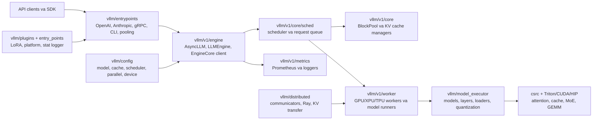
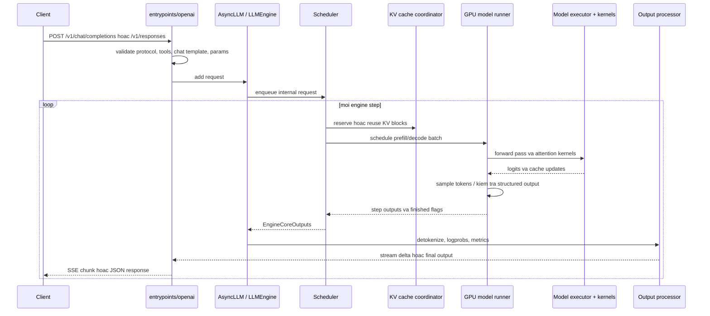
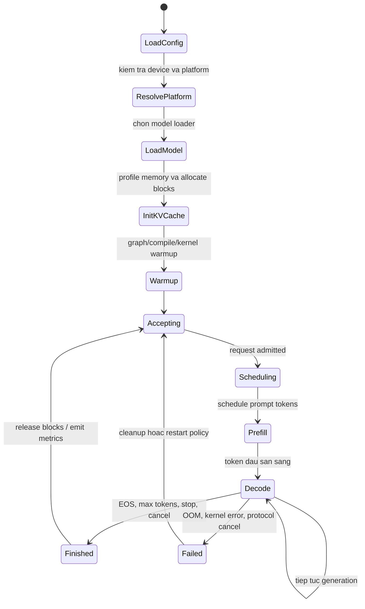
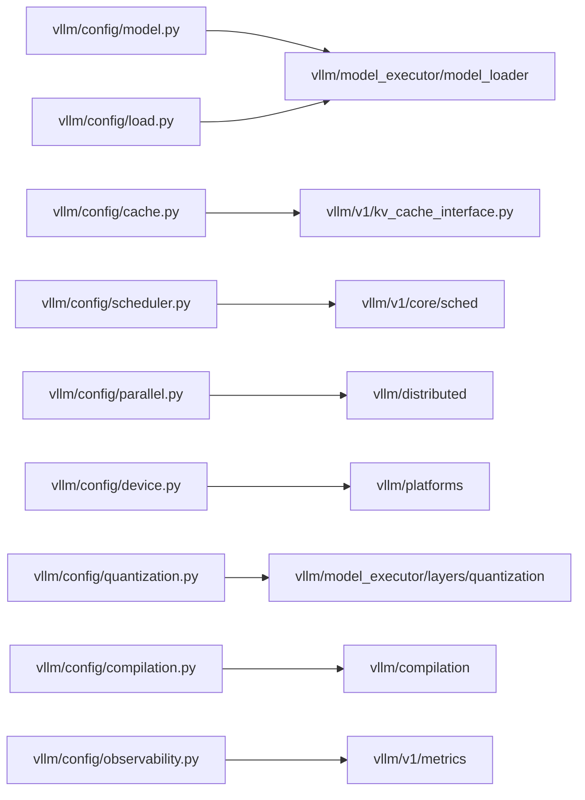
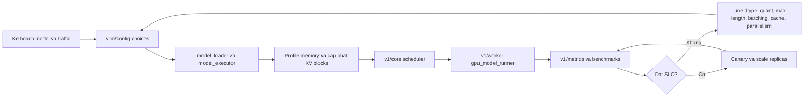
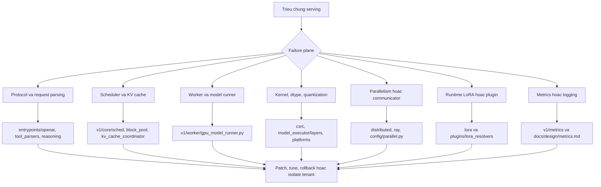

# Kien truc vLLM

Anh chup nguon: `github-repos/02-model-serving-inference/vllm` tai commit `2427094` (`[Feature] Support EPLB for DeepSeek v4 Mega Moe (#43339)`). Tai lieu nay dua tren cac tep va thu muc co trong anh chup do.

## Tom tat dieu hanh

vLLM la mot inference va serving engine cho LLM, toi uu cho thong luong cao va su dung bo nho hieu qua. README cua du an nhan manh PagedAttention, continuous batching, chunked prefill, prefix caching, CUDA/HIP graphs, quantization, cac kernel attention/GEMM/MoE toi uu, speculative decoding, multi-LoRA va API tuong thich OpenAI.

Ve kien truc, vLLM khong chi la lop boc Python quanh PyTorch. No gom scheduler cho request, bo cap phat KV cache, model runner, lop platform phan cung, native kernel, API server, plugin system, metrics va model registry lon. Cay thu muc hien tai co ca engine cu trong `vllm/engine/*` va runtime V1 trong `vllm/v1/*`; cac thanh phan quan trong cho production nam o `vllm/v1/engine`, `vllm/v1/core`, `vllm/v1/worker`, `vllm/entrypoints` va `vllm/model_executor`.

Voi solution architect, gia tri cua vLLM la bien model weights thanh dich vu co the van hanh: HTTP/gRPC APIs, scheduling dong, batching theo bo nho, distributed execution, kernel quantized, streaming output, parser cho tool/reasoning, LoRA adapter va observability. Doi lai, do phuc tap cao vi hieu nang phu thuoc vao su phoi hop chat giua scheduler, KV-cache layout, model execution, kernel va topo trien khai.

## Bai toan duoc giai quyet

Serving LLM khac voi chay model offline:

- Request den lien tuc, prompt va output co do dai khac nhau.
- GPU memory bi chi phoi boi model weights va KV cache.
- Static batch lang phi tai nguyen khi request ngan ket thuc som.
- Prefill dai co the chan luong decode can latency thap.
- Moi token can scheduling, sampling, detokenization va streaming voi overhead rat thap.
- Production API can tuong thich giao thuc, monitoring, lifecycle control va co lap loi.

vLLM giai quyet bang runtime lap lich moi step, cap phat KV cache theo block, tai su dung prefix, nap weights qua loader cau hinh duoc, chon kernel theo phan cung va expose API serving. Bang chung trong repo nam o `vllm/v1/core/sched/*`, `vllm/v1/core/block_pool.py`, `vllm/v1/core/kv_cache_coordinator.py`, `vllm/model_executor/*`, `csrc/attention/*`, `vllm/entrypoints/openai/*`, `vllm/v1/metrics/*` va `docs/design/*`.

## Vai tro trong AI stack

vLLM nam giua model-definition library va application/API client.

- Nguon model: Hugging Face repos, tensor formats, checkpoint quantized, LoRA adapters, tokenizer va chat template.
- Runtime: PyTorch, custom CUDA/HIP/C++/Triton/CuTeDSL kernels, platform plugins, distributed communicators.
- Serving: OpenAI-compatible API, Anthropic Messages API, gRPC, batch/offline API, CLI.
- Van hanh: Docker, deployment docs, metrics, logging, profiling, benchmarks, tests.

Thong thuong, vLLM duoc chon khi to chuc can LLM serving thong luong cao ma khong tu xay scheduler va KV-cache system. Tuy model va flag, no co the phuc vu text generation, embeddings, pooling, classification, reward/scoring, multimodal, speech-to-text, LoRA va structured output.

## Ban do source tree

| Duong dan | Vai tro |
|---|---|
| `README.md` | Dinh vi du an, danh sach tinh nang, cai dat, nhom model ho tro, citation va kenh ho tro. |
| `pyproject.toml` | Metadata package Python, build requirements, khoang Python version, CLI entry point `vllm = vllm.entrypoints.cli.main:main`, entry point plugin LoRA resolver, pytest markers. |
| `vllm/entrypoints` | API nguoi dung: CLI, REST tuong thich OpenAI, Anthropic API, gRPC server, pooling, speech-to-text, MCP tool server, SageMaker. |
| `vllm/engine` | Engine cu nhu `llm_engine.py`, `async_llm_engine.py`, engine arg utilities. |
| `vllm/v1/engine` | Runtime V1: `async_llm.py`, `llm_engine.py`, `core.py`, `coordinator.py`, input/output processors, detokenizer, parallel sampling. |
| `vllm/v1/core` | Scheduler, request queue, block pool, KV-cache manager/coordinator, encoder cache manager, cache metrics. |
| `vllm/v1/worker` | Worker theo device va model runner: `gpu_worker.py`, `gpu_model_runner.py`, XPU/TPU paths, LoRA/KV connector mixins. |
| `vllm/v1/attention` | Interface va backend attention cho runtime V1. |
| `vllm/model_executor` | Model loading, model definitions, layers, quantization, attention layers, MoE layers, custom ops, offloading, warmup. |
| `vllm/config` | Cau hinh co cau truc cho model, scheduler, cache, device, parallelism, LoRA, quantization, compilation, multimodal, observability, profiler, KV transfer. |
| `vllm/distributed` | Distributed execution, device communicators, NCCL/Ray/shared-memory, elastic expert parallel, KV transfer, event connectors. |
| `vllm/lora` va `vllm/plugins/lora_resolvers` | Xu ly LoRA request, runtime adapters, filesystem va Hugging Face Hub resolver plugins. |
| `vllm/platforms` | Abstraction cho NVIDIA/AMD/CPU/TPU/XPU va out-of-tree hardware plugins. |
| `csrc` | Native kernels va torch bindings: attention, cache ops, CUDA utilities, MoE, quantization, ROCm, CPU kernels, all-reduce. |
| `rust` | Thanh phan Rust cho chat rendering, tokenization, tool parsing, text output va reasoning parser. |
| `docs/design` | Ghi chu thiet ke cho PagedAttention, metrics, plugin system, prefix caching, multiprocessing, torch compile, LoRA resolver plugins, model runner V2, multimodal. |
| `examples` | Chat templates, OpenAI client examples, tool-calling, observability, pooling va cac mau tinh nang. |
| `tests` | Unit, kernel, config, model, entrypoint, distributed, LoRA, evaluation va regression tests. |
| `benchmarks` va `vllm/benchmarks` | Benchmark latency, throughput, serving, startup, dataset va sweep. |
| `docker`, `requirements`, `scripts`, `tools` | Packaging, container, dependency sets, automation cho dev/release. |

## Khai niem cot loi

**Vong doi request.** Request cua nguoi dung duoc chuyen thanh request noi bo gom tokenized input, tham so sampling/structured-output, payload multimodal tuy chon, LoRA identity va metadata API. Cau truc request V1 nam o `vllm/v1/request.py`; output nam o `vllm/v1/outputs.py` va `vllm/outputs.py`.

**Engine va engine core.** Lop ngoai xu ly ingress, streaming, detokenization, metrics, cancellation va mapping protocol. `vllm/v1/engine/async_llm.py` co `AsyncLLM`; `vllm/v1/engine/core.py` co `EngineCore`, `EngineCoreProc` va actor variants. Tach lop nay giup co lap vong lap hieu nang cao.

**Continuous batching.** Scheduler tao batch moi o moi step thay vi doi static batch ket thuc. Cac tep lien quan la `vllm/v1/core/sched/scheduler.py`, `request_queue.py`, `async_scheduler.py` va `interface.py`.

**Chunked prefill.** Prompt dai duoc chia nho de decode khong bi chan qua lau. README liet ke chunked prefill, va cac file scheduler/cache cho thay co token va block budget tai runtime.

**Paged KV cache.** vLLM luu KV memory theo block de request co do dai khac nhau dung chung mot pool bo nho. `docs/design/paged_attention.md` giai thich kernel lich su va tro den `csrc/attention/attention_kernels.cu`; implementation V1 nam o `vllm/v1/core/block_pool.py`, `kv_cache_manager.py`, `single_type_kv_cache_manager.py`, `kv_cache_coordinator.py`.

**Prefix caching.** `docs/design/prefix_caching.md` va cac file cache coordinator/block pool mo ta tai su dung block prompt da tinh. Tinh nang nay huu ich voi system prompt lap lai, retrieval template va multi-turn chat co prefix chung.

**Model runner.** Runner phia worker chuan bi input batch, goi forward pass, xu ly KV cache tensors, sampling va GPU graph. Tep chinh gom `vllm/v1/worker/gpu_model_runner.py`, `gpu_input_batch.py`, `gpu_worker.py`, `gpu/structured_outputs.py`, `gpu/spec_decode/*`.

**Model executor.** `vllm/model_executor` la nen tang nap model va layer. No gom attention layers, quantization methods, fused MoE, Mamba, rotary embeddings, loader GGUF/tensorizer/bitsandbytes/default/sharded va nhieu file model architecture trong `vllm/model_executor/models`.

**Serving protocols.** `vllm/entrypoints/openai` cai dat chat/completion/responses/models/engine routes tuong thich OpenAI. Cac entrypoint khac gom `anthropic`, `grpc_server.py`, `pooling`, `speech_to_text`, `mcp`.

**Plugins.** `docs/design/plugin_system.md` mo ta entry point groups nhu `vllm.general_plugins`, `vllm.platform_plugins`, `vllm.io_processor_plugins`, `vllm.stat_logger_plugins`. `pyproject.toml` dang ky san cac LoRA resolver plugins.

## So do thanh phan he thong



## Kien truc noi bo

Kien truc co bon mat phang chinh.

**Mat phang protocol.** `vllm/entrypoints` chuyen protocol ngoai thanh loi goi engine noi bo. `vllm/entrypoints/openai/api_server.py`, `chat_completion/serving.py`, `completion/serving.py`, `responses/serving.py` dinh nghia OpenAI-compatible surface. Adapter Anthropic trong `vllm/entrypoints/anthropic/serving.py` chuyen format message Anthropic sang request noi bo tuong thich OpenAI. Pooling va speech-to-text co protocol va IO processor rieng.

**Mat phang scheduling va memory.** `vllm/v1/core` quan ly admission, scheduling, cap phat KV block, cache reuse va cache metrics. Scheduler phai can bang decode dang chay, prefill dang doi, token budget, KV budget va fairness. Block pool quan ly block trong va block cached; cache coordinators xu ly full-attention, sliding-window, MLA, hybrid, Mamba, encoder-only va cross-attention cache spec tu `vllm/v1/kv_cache_interface.py`.

**Mat phang thuc thi.** `vllm/v1/worker` quan ly init device, load model, init cache, execution, sampling, structured outputs, LoRA mixing va graph warmup. `vllm/model_executor` chua reusable layers va model definitions. Kernel trong `csrc` va kernel generated/Triton duoc chon theo hardware, dtype, attention type, quantization va architecture.

**Mat phang van hanh.** Metrics, logging, profiling, benchmarks, deployment docs, Docker va tests giup runtime co the van hanh. `docs/design/metrics.md` noi V1 expose Prometheus-compatible metrics voi prefix `vllm:` va uu tien dua overhead metrics ra ngoai engine core khi co the.

## Luong runtime dau cuoi



## Runtime va data flow

1. **Ingress.** Route FastAPI hoac CLI nhan request. OpenAI-compatible code trong `vllm/entrypoints/openai/*` validate model, messages, prompt, tools, streaming, sampling, logprobs va response format.
2. **Xu ly input.** Chat templates trong `examples/*.jinja`, tokenizer utilities trong `vllm/tokenizers` va `vllm/transformers_utils`, multimodal processors trong `vllm/multimodal`, structured-output parsers chuan hoa input.
3. **Admission.** Engine tao request noi bo va dua vao scheduler. Admission phu thuoc token budget, model length, LoRA status, cache capacity va parallel config.
4. **Prefill.** Prompt tokens duoc xu ly va KV cache blocks duoc ghi. Prompt dai co the bi chia chunk.
5. **Decode.** Scheduler lien tuc tao decode batch. Moi active sequence thuong dong gop mot query token moi step, con cache pages cung cap context.
6. **Sampling.** `vllm/v1/worker/gpu/sample/*` va sampling params thuc thi temperature, top-k/top-p/min-p, penalties, logprob, bad words, logit bias va output states.
7. **Post-processing.** Detokenization, tool-call parsing, reasoning parser, structured-output validation va logprob formatting dien ra ngoai duong kernel nong.
8. **Streaming/final response.** API layer tra SSE chunks hoac JSON cuoi. Metrics duoc cap nhat tu request va engine events.

## Topology trien khai va van hanh

```mermaid
flowchart TB
    subgraph Users
        SDK[OpenAI SDK / curl / app server]
    end
    subgraph Edge
        LB[Load balancer hoac ingress]
        Auth[API key / TLS / network policy]
    end
    subgraph VLLMNode["vLLM serving node hoac pod"]
        API[API server process\nvllm serve]
        Core[Engine core process / actor]
        Workers[Worker processes\nGPU model runners]
        Cache[KV cache blocks trong GPU memory]
        Metrics[/metrics endpoint]
    end
    subgraph Platform
        GPU[NVIDIA/AMD/TPU/XPU/CPU]
        ModelStore[HF Hub, local disk, object store]
        Adapters[LoRA resolver cache]
        Prom[Prometheus + Grafana]
    end

    SDK --> LB --> Auth --> API
    API --> Core --> Workers --> GPU
    Workers <--> Cache
    API --> ModelStore
    API --> Adapters
    Prom --> Metrics
```

vLLM co the chay nhu Python CLI service, containerized API server, Ray-backed distributed deployment, SageMaker endpoint, hoac topo dac biet cho data/expert/tensor/pipeline/context parallelism. Cay docs co `docs/deployment`, `docs/serving`, `docs/configuration`. Docker assets nam trong `docker`, dependency sets nam trong `requirements`.

Nhung knob production quan trong nam trong `vllm/config`: cache sizing va block size, scheduler behavior, model length, dtype, quantization, parallelism, device selection, compilation, LoRA, multimodal limits, observability, profiling va KV transfer/offload.

## Vong doi, quyet dinh va phu thuoc module





## Diem mo rong

vLLM co nhieu extension point, nhung can ton trong process boundary va version compatibility.

- **Model plugins:** `docs/design/plugin_system.md` mo ta `vllm.general_plugins` de dang ky model architecture ngoai repo qua `ModelRegistry.register_model`.
- **Platform plugins:** `vllm.platform_plugins` dang ky platform class ngoai repo voi worker, attention backend, device communicator va ops rieng.
- **IO processor plugins:** `vllm.io_processor_plugins` ho tro pre/post-processing tuy bien cho pooling.
- **Stat logger plugins:** `vllm.stat_logger_plugins` them sink metric/log tuy bien.
- **LoRA resolver plugins:** `pyproject.toml` dang ky `lora_filesystem_resolver` va `lora_hf_hub_resolver`; `docs/design/lora_resolver_plugins.md` mo ta dynamic LoRA qua `VLLM_ALLOW_RUNTIME_LORA_UPDATING`, `VLLM_PLUGINS`, `VLLM_LORA_RESOLVER_CACHE_DIR`.
- **Attention backend va kernels:** `vllm/v1/attention`, `vllm/model_executor/layers/attention`, `csrc/attention`, `vllm/kernels` la noi them backend/hieu nang.
- **Quantization methods:** `vllm/model_executor/layers/quantization` co AWQ, GPTQ, FP8, MXFP4/MXFP8, GGUF, compressed tensors, TorchAO, bitsandbytes va cac chien luoc lien quan.
- **Serving protocols:** Route moi co the theo pattern trong `vllm/entrypoints/openai/*`, `anthropic/*`, `pooling/*`, `serve/*`.

## Tich hop

Repo the hien tich hop tren ca model, hardware va serving ecosystem:

- Nap model/tokenizer Hugging Face qua `vllm/transformers_utils`, `vllm/model_executor/model_loader` va cac nhom architecture trong README.
- OpenAI-compatible APIs trong `vllm/entrypoints/openai`.
- Anthropic Messages API trong `vllm/entrypoints/anthropic`.
- gRPC trong `vllm/entrypoints/grpc_server.py`.
- MCP tool serving trong `vllm/entrypoints/mcp`.
- SageMaker adapter trong `vllm/entrypoints/sagemaker`.
- Ray va distributed communication trong `vllm/ray` va `vllm/distributed`.
- Prometheus/Grafana observability qua `vllm/v1/metrics` va `examples/observability`.
- LoRA adapter serving qua `vllm/lora`.
- Structured outputs qua `vllm/v1/structured_output`, `vllm/config/structured_outputs.py`, `vllm/reasoning`, `vllm/tool_parsers` va Rust parser.

## Cau hinh, trien khai va ops

Cau hinh duoc tach theo domain thay vi nam trong mot tep duy nhat. `vllm/config` tach model, scheduler, cache, parallel, device, compilation, quantization, LoRA, multimodal, profiler, observability va transfer. CLI arguments duoc noi qua `vllm/engine/arg_utils.py`, `vllm/entrypoints/cli/*` va OpenAI CLI utilities.

Can nhac trien khai:

- **Model co vua hay khong:** chon dtype, quantization, tensor/pipeline/expert/data parallelism, max model length va KV cache budget truoc khi scale replica.
- **Latency so voi throughput:** continuous batching tang throughput nhung co the tang tail latency neu scheduler va prefill budget khong hop ly.
- **Prompt dai:** chunked prefill va prefix caching giam blocking va viec tinh lap.
- **Adapter serving:** runtime LoRA updates rat manh nhung can governance ve nguon adapter, compatibility va cache directories.
- **Multi-process metrics:** `docs/design/metrics.md` luu y vi tri thu thap metrics anh huong toi kha nang quan sat; multiprocess mode thay doi nhung process metrics thay duoc.
- **Hardware portability:** platform plugins mo rong phan cung, nhung do truong thanh kernel khac nhau theo backend.
- **Distributed serving:** tensor, pipeline, data, expert va context parallelism can lap ke hoach network, NCCL/RCCL/communicator va placement.

## Observability, testing, evaluation va failure modes

Diem neo observability:

- `docs/design/metrics.md` liet ke V1 Prometheus metrics nhu `vllm:num_requests_running`, `vllm:kv_cache_usage_perc`, `vllm:prefix_cache_queries`, `vllm:prefix_cache_hits`, `vllm:prompt_tokens_total`, `vllm:generation_tokens_total`, `vllm:request_success_total`, `vllm:time_to_first_token_seconds`, `vllm:inter_token_latency_seconds`, `vllm:e2e_request_latency_seconds`.
- `vllm/v1/metrics/prometheus.py`, `stats.py`, `loggers.py`, `reader.py` cai dat metrics.
- `vllm/logging_utils`, `vllm/logger.py`, `vllm/profiler`, `vllm/benchmarks` ho tro diagnosis va capacity planning.

Diem neo testing:

- `tests/test_config.py`, `tests/test_inputs.py`, `tests/test_outputs.py`, `tests/test_logprobs.py`, `tests/test_sequence.py` bao phu hanh vi cot loi.
- `tests/kernels/*` test native va Triton kernels.
- `tests/weight_loading/*` bao phu model loading.
- `tests/evals/mrcr/*` la evaluation harness cho long-context/multi-round correctness.
- `pyproject.toml` dinh nghia pytest markers cho slow, distributed, optional, CPU, hybrid va model categories.

Failure modes pho bien:

- **GPU OOM khi load model hoac allocate KV:** model qua lon, context qua dai, parallelism sai, hoac cache budget qua cao.
- **Scheduler starvation hoac latency spike:** prefill dai, concurrency qua cao, admission policy khong can bang.
- **Prefix-cache kem hieu qua:** prompt qua doc nhat, block size khong phu hop, hoac cache spec khong ho tro.
- **Kernel incompatible:** dtype, quantization, architecture hoac platform khong ho tro attention/GEMM path da chon.
- **Tokenizer/chat-template mismatch:** chat output hoac tool call sai khi template khong khop cach model duoc train.
- **LoRA incompatible:** adapter khong khop base model, thieu file, resolver path sai, runtime update chua bat.
- **Metrics de hieu sai:** multiprocess deployment co the an default Python/process metrics.
- **Distributed instability:** communicator setup, rank placement, GPU topology, hoac Ray/process lifecycle loi.

## Rui ro bao mat va governance

- **Nguon goc model:** phuc vu model Hub hoac custom weights can review license, safety va supply-chain.
- **Remote code va plugins:** plugin entry points chay Python trong moi process. Xem plugin da cai nhu privileged code.
- **Runtime LoRA loading:** resolver co the keo adapter dong. Can gioi han `VLLM_PLUGINS`, cache directories, Hub tokens va adapter allow-list.
- **API exposure:** endpoint tuong thich OpenAI de bi hieu nham la managed OpenAI API. Can auth, rate limit, network boundary va logging.
- **Tool calling va MCP:** be mat thuc thi tool can sandbox va audit; tool call do model sinh khong mac dinh dang tin.
- **Prompt va output logging:** log/metrics co the chua prompt, completion, tham chieu image/audio hoac tenant ID nhay cam.
- **Structured output assumptions:** constrained decoding giam loi format nhung khong dam bao tinh dung, policy compliance hay argument tool an toan.
- **Multitenancy:** shared KV cache, LoRA adapters va metrics can tenant-aware isolation neu phuc vu nhieu khach hang.

## Huong dan doc source

1. Bat dau voi `README.md` de hieu loi hua va feature set.
2. Doc `pyproject.toml` de hieu packaging, CLI entry point, dependency va plugin registration.
3. Doc `vllm/entrypoints/openai/api_server.py` va cac folder `chat_completion`, `completion`, `responses` de hieu serving protocols.
4. Doc `vllm/v1/engine/async_llm.py` va `vllm/v1/engine/core.py` de hieu boundary cua V1 engine.
5. Doc `vllm/v1/core/sched/scheduler.py`, `block_pool.py`, `kv_cache_coordinator.py` cho scheduling va memory.
6. Doc `vllm/v1/worker/gpu_model_runner.py` va `vllm/model_executor/model_loader/*` cho execution va loading.
7. Doc `docs/design/metrics.md`, `plugin_system.md`, `lora_resolver_plugins.md`, `prefix_caching.md`, `paged_attention.md` de hieu rationale.
8. Luot qua `tests/kernels`, `tests/weight_loading`, `tests/evals` de thay nhung gi maintainer xem la quan trong.

## Lo trinh hoc

1. Hinh dung offline inference qua `vllm/entrypoints/llm.py` va `vllm/engine/llm_engine.py`.
2. Trace mot OpenAI streaming chat request qua `vllm/entrypoints/openai/chat_completion/serving.py`.
3. Theo request vao `vllm/v1/engine/async_llm.py`, roi den `EngineCore`.
4. Hoc cach `scheduler.py` chon work va `BlockPool` cap phat KV blocks.
5. Xem `gpu_model_runner.py` de thay batch tro thanh device tensor va model call.
6. So sanh cac implementation quantization trong `vllm/model_executor/layers/quantization`.
7. Review metrics va benchmark truoc khi ra quyet dinh capacity production.
8. Sau do moi them plugins, custom models, custom kernels hoac distributed topology.

## Checklist production và vòng lặp capacity

Câu hỏi production với vLLM không chỉ là "model có load được không?". Cần kiểm tra scheduler, KV cache, model runner, kernels, API layer và metrics có chịu được tenant mix mong muốn hay không. Các neo source quan trọng gồm `vllm/entrypoints/openai/*`, `vllm/v1/engine/*`, `vllm/v1/core/sched/scheduler.py`, `vllm/v1/core/block_pool.py`, `vllm/v1/worker/gpu_model_runner.py`, `vllm/model_executor/model_loader/*`, `vllm/config/*`, `vllm/v1/metrics/prometheus.py` và `docs/design/*`.

| Khu vực readiness | Cần xác minh |
|---|---|
| Model fit | Weights, dtype, quantization, max model length, multimodal limit, LoRA và KV cache budget phải vừa phần cứng. |
| Scheduler policy | Long prefill, chunked prefill, prefix caching, max batched tokens và admission control phải khớp SLO TTFT/inter-token latency. |
| API contract | OpenAI/Responses/Anthropic routes, tool parsing, reasoning parsers, stream cancellation và error format phải khớp client. |
| Kernel/platform | Attention, quantization, MoE và GEMM path được chọn phải được hỗ trợ trên backend và kiến trúc model. |
| Observability | Prometheus metrics, request ID, logs, benchmark baseline và cache hit ratio cần có trước khi tăng traffic. |
| Governance | Runtime LoRA, plugin entry point, Hub access, prompt logging và structured-output assumption phải có policy. |



## Bản đồ cô lập lỗi

Phần lớn incident vLLM có thể khoanh vùng bằng cách hỏi plane nào lỗi: protocol, scheduling/cache, model execution, kernel/platform, distributed coordination hay observability. Điều này quan trọng vì một triệu chứng API như streaming chậm có thể đến từ prefill starvation, KV pressure, detokenization overhead hoặc backend kernel fallback.



## Bang chu giai

| Thuat ngu | Nghia |
|---|---|
| PagedAttention | Cach attention/KV-cache cua vLLM, luu key/value memory theo block thay vi cap phat lien tuc cho moi request. |
| KV cache | Tensor key/value da cache tu token truoc, dung trong autoregressive decoding. |
| Prefill | Xu ly prompt tokens de dien KV cache truoc khi generation bat dau. |
| Decode | Sinh output token tung buoc dua tren KV cache da co. |
| Continuous batching | Reschedule request moi step de request xong roi khoi batch va request moi vao ngay. |
| Chunked prefill | Chia prompt dai thanh nhieu scheduling steps. |
| Prefix caching | Tai su dung KV blocks cho prefix prompt giong nhau. |
| Engine core | Vong lap noi bo nhay cam hieu nang, lap lich va thuc thi model steps. |
| Model runner | Thanh phan phia worker tao device batch, goi model, cap nhat KV cache va sample token. |
| LoRA resolver | Plugin tim va nap adapter dong tu filesystem, Hub hoac storage tuy bien. |
| Tensor parallelism | Chia tinh toan tensor qua nhieu device. |
| Pipeline parallelism | Chia layer cua model qua nhieu device. |
| Expert parallelism | Chia MoE experts qua nhieu device. |
| Structured outputs | Constrained generation dung parser/grammar/schema de ep dinh dang output. |
| TTFT | Time to first token, metric latency quan trong cua serving. |
| TPOT | Time per output token, con goi la inter-token latency. |
