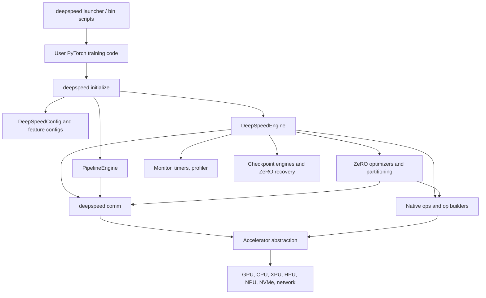
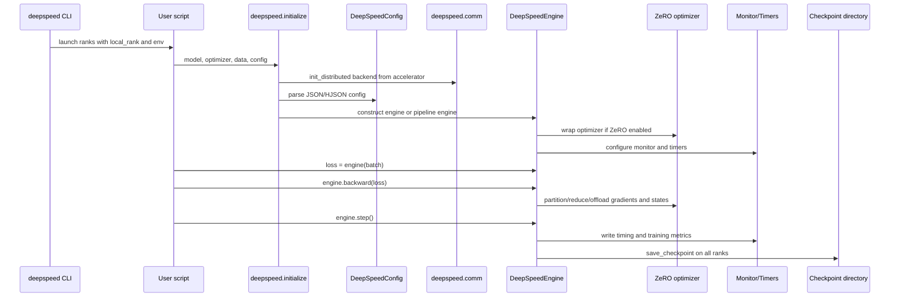
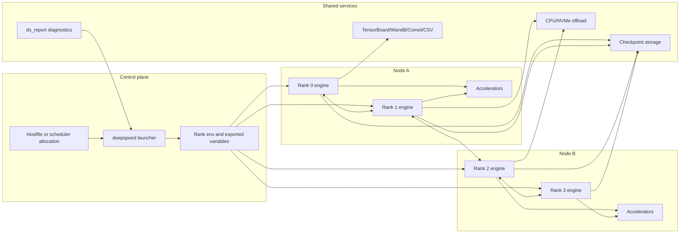
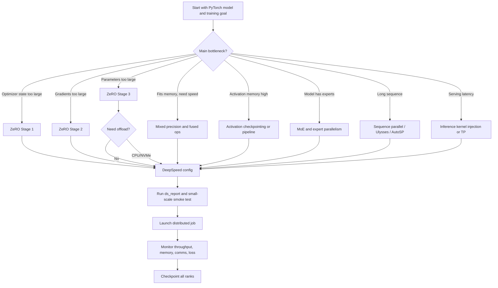
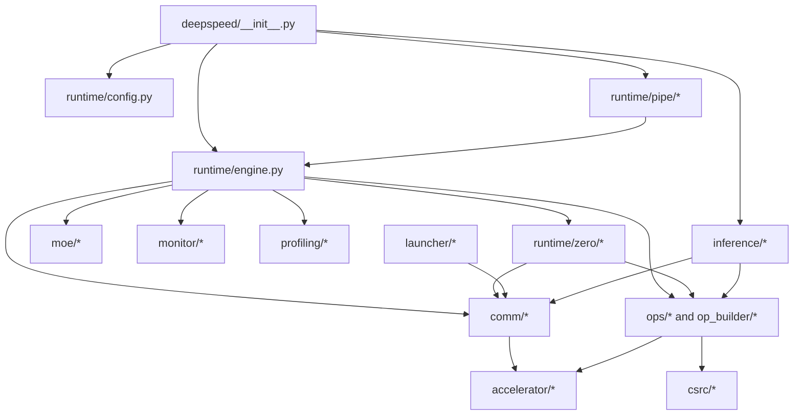
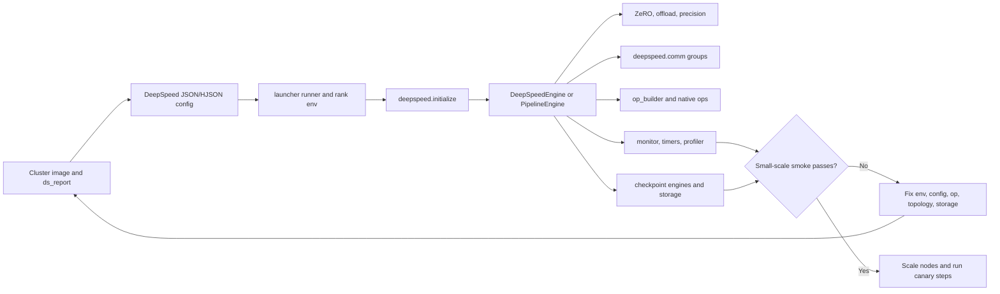
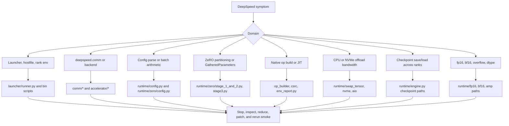

# DeepSpeed Architecture

## Scope And Repository Facts

This document is grounded in the local clone at `github-repos/03-fine-tuning-training/DeepSpeed`, inspected at commit `3e486febfcfc3c843a9066619697344d2cb7b9ec` from 2026-06-01. `version.txt` reports `0.19.2`. The package metadata in `setup.py` names the package `deepspeed`, uses Apache-2.0 licensing, installs the main Python package plus scripts such as `deepspeed`, `ds`, `ds_report`, `ds_bench`, `ds_elastic`, `ds_nvme_tune`, and `ds_io`, and supports Python 3.8 through 3.12.

The local tree contains 696 Python files under `deepspeed`, 295 test files, 334 documentation files, and 193 native/kernel files under `csrc`. Runtime dependencies in `requirements/requirements.txt` include PyTorch 2.0+, pydantic 2+, hjson, ninja, numpy, packaging, psutil, py-cpuinfo, einops, msgpack, and tqdm. Optional requirement sets cover inference, sparse attention, sparse pruning, autotuning, Triton, DeepCompile, readthedocs, development tooling, and one-bit MPI support.

Local project instructions in `AGENTS.md` and `CLAUDE.md` emphasize signed commits, formatting, pre-commit verification for changed files, and using `deepspeed.comm` rather than direct `torch.distributed` imports. This task only reads the source repo and writes documentation outside it.

## Executive Summary

DeepSpeed is a distributed training, inference, and systems-optimization library for large deep learning models. Its central abstraction is the `DeepSpeedEngine`, created by `deepspeed.initialize(...)` in `deepspeed/__init__.py`. The engine wraps a user model, optimizer, scheduler, dataloader, precision policy, communication backend, checkpointing, timers, monitoring, and optional features such as ZeRO, pipeline parallelism, tensor parallelism, MoE, activation checkpointing, offload, and DeepCompile.

The architecture is broader than a single optimizer:

- `deepspeed/runtime/engine.py` implements the training engine lifecycle: forward, backward, step, checkpointing, timers, data loading, precision, optimizer wrapping, monitoring, and feature routing.
- `deepspeed/runtime/config.py` and specialized config modules parse and validate the DeepSpeed JSON/HJSON configuration.
- `deepspeed/runtime/zero/*` implements ZeRO stages, parameter partitioning, offload, optimizer state handling, ZeRO-Infinity-style behavior, MiCS, Muon support, and ZeRO-specific utilities.
- `deepspeed/launcher/*` and `bin/*` launch multi-process and multi-node jobs.
- `accelerator/*` abstracts CUDA, CPU, XPU, NPU, HPU, MLU, MPS, and SDAA backends.
- `deepspeed/comm/*` provides a torch.distributed-compatible communication API with DeepSpeed logging and backend selection.
- `op_builder/*`, `deepspeed/ops/*`, and `csrc/*` manage optional native kernels and JIT/precompiled extensions.
- `deepspeed/monitor`, `deepspeed/profiling`, `deepspeed/inference`, `deepspeed/pipe`, `deepspeed/moe`, `deepspeed/sequence`, `deepspeed/compile`, and `deepspeed/autotuning` add operational and systems features around the core runtime.

The key architectural choice is that users keep their PyTorch model code mostly intact while delegating distributed systems behavior to the engine and config. This reduces application code complexity, but makes config correctness, cluster launch environment, checkpoint discipline, native op compatibility, and distributed failure handling critical.

## Problem Solved

Training and serving frontier-scale models is constrained by GPU memory, interconnect bandwidth, optimizer state size, activation memory, checkpoint volume, and cluster orchestration complexity. DeepSpeed addresses these constraints through:

- ZeRO optimizer stages that partition optimizer states, gradients, and parameters.
- CPU/NVMe offload paths for optimizer state and parameters.
- Mixed precision and low-precision optimizer states.
- Pipeline, tensor, expert, sequence, and data parallelism combinations.
- Custom fused kernels and transformer/inference kernels.
- Launching, hostfile parsing, multi-node execution, and elastic job support.
- Monitoring, profiling, autotuning, and environment reporting.
- Checkpointing utilities, including ZeRO partition recovery and universal checkpointing docs.

In the fine-tuning/training stack, DeepSpeed is the systems layer that lets PEFT, Transformers, TRL, Megatron-style models, and custom PyTorch models run at larger scale than a plain single-process training loop.

## AI Stack Role

DeepSpeed sits below model libraries and above hardware/distributed primitives:

- **Model layer:** PyTorch `nn.Module`, Hugging Face Transformers, Megatron-style models, MoE layers, pipeline modules, LoRA-optimized linear paths.
- **Runtime layer:** `DeepSpeedEngine`, `PipelineEngine`, `InferenceEngine`, ZeRO optimizers, activation checkpointing, data pipeline, scheduler/optimizer integration.
- **Distributed layer:** `deepspeed.comm`, process groups, launcher backends, accelerator abstraction, tensor/pipeline/expert/data parallel groups.
- **Systems layer:** native ops, JIT/precompiled kernels, offload, NVMe/AIO, GDS, timers, profiling, monitoring, checkpoint engines.
- **Operations layer:** `deepspeed` launcher, hostfiles, environment export, `ds_report`, CI/test matrix, Docker/ROCm/Windows guidance.

DeepSpeed is not an experiment tracker, dataset library, or model registry. It provides the runtime and operations substrate that those layers can call.

## Source Tree Map

| Path | Responsibility |
| --- | --- |
| `README.md` | Project overview, news, integrations, installation, environment report, publications, and contribution pointers. |
| `version.txt` | Base package version, `0.19.2` in this clone. |
| `setup.py` | Build metadata, scripts, dependency extras, op precompile behavior, build-time git/version info, Windows packaging branches. |
| `requirements/*` | Runtime and optional dependency sets. |
| `deepspeed/__init__.py` | Public API, `initialize`, `init_inference`, distributed initialization, engine selection, exported runtime classes. |
| `deepspeed/runtime/engine.py` | Core training engine: model wrapping, forward/backward/step, optimizer/scheduler, checkpoints, timers, monitors, ZeRO integration. |
| `deepspeed/runtime/config.py` | Top-level config parser and feature routing for precision, communication, monitoring, profiling, autotuning, checkpointing, tensor parallelism, data efficiency, and compile. |
| `deepspeed/runtime/zero/*` | ZeRO stages, parameter partitioning, offload, optimizer state, partition coordinators, MiCS, tiled linear, Muon, and config. |
| `deepspeed/runtime/pipe/*` | Pipeline parallel module and engine. |
| `deepspeed/moe/*` | Mixture-of-Experts layers, gating, sharded MoE, and expert utilities. |
| `deepspeed/sequence/*` | Sequence parallel and AutoSP components. |
| `deepspeed/inference/*` | Inference engine, kernel injection, tensor parallel inference, quantization and CUDA graph related behavior. |
| `deepspeed/launcher/*` | Hostfile parsing, resource selection, environment propagation, PDSH/OpenMPI/MVAPICH/Slurm/MPICH/IMPI launchers. |
| `accelerator/*` | Build/runtime accelerator abstraction for CUDA, CPU, XPU, NPU, MPS, HPU, MLU, and SDAA. |
| `deepspeed/comm/*` | torch.distributed-compatible communication wrapper, backend selection, comm logging, timed operations. |
| `op_builder/*` | Build-time and runtime builders for optional ops; detects accelerator-specific builders. |
| `deepspeed/ops/*`, `csrc/*` | Python wrappers and native implementation sources for fused optimizers, transformer kernels, sparse attention, AIO, GDS, quantization, random LTD, DeepCompile, and platform-specific ops. |
| `deepspeed/env_report.py` | `ds_report` implementation for op compatibility, installed op state, torch/CUDA/HIP/NPU/system diagnostics, `/dev/shm` warning. |
| `deepspeed/monitor/*` | TensorBoard, W&B, Comet, and CSV monitoring. |
| `deepspeed/profiling/*` | FLOPs profiler and profiling utilities. |
| `docs/_tutorials/*` | User-facing tutorials for getting started, ZeRO, offload, pipeline, MoE, monitor, profiler, autotuning, DeepNVMe, Ulysses, AutoTP, and more. |
| `tests/*` | Unit, runtime, ZeRO, launcher, accelerator, inference, compile, checkpoint, model, one-bit, and performance tests. |
| `examples/sdma_allgather/*` | Local runnable examples around SDMA allgather and ZeRO-3. |

## Component Diagram

## Core Concepts

**DeepSpeedEngine:** the central training wrapper. It is callable for forward passes and exposes `backward`, `step`, `save_checkpoint`, and `load_checkpoint`.

**DeepSpeedConfig:** parsed representation of the JSON/HJSON config. It routes settings for batch size, optimizer, scheduler, precision, ZeRO, communication, monitoring, autotuning, tensor parallelism, checkpointing, and data efficiency.

**ZeRO:** Zero Redundancy Optimizer. Stage 1 partitions optimizer states, Stage 2 also partitions gradients, and Stage 3 also partitions model parameters. `deepspeed/runtime/zero/config.py` represents this as `ZeroStageEnum`.

**Offload:** moving optimizer states and/or parameters to CPU or NVMe to reduce GPU memory pressure. ZeRO-2 supports optimizer offload; ZeRO-3 supports parameter and optimizer offload.

**Accelerator abstraction:** `accelerator/real_accelerator.py` chooses or validates an accelerator through `DS_ACCELERATOR` or auto-detection, then exposes backend-specific device, dtype, stream, communication, and op-builder behavior.

**Communication wrapper:** `deepspeed.comm` keeps compatibility with torch.distributed-style APIs while adding DeepSpeed backend selection and communication logging.

**Launcher:** the `deepspeed` script routes hostfile/resource selection into launcher backends such as PDSH, OpenMPI, MVAPICH, Slurm, MPICH, and IMPI.

**Native ops:** optional C++/CUDA/HIP/SYCL/platform-specific extensions built by `op_builder`. They can be precompiled through setup environment variables or JIT compiled at runtime if compatible.

**Pipeline parallelism:** `PipelineModule` expresses a model as layers; `PipelineEngine` trains micro-batches through scheduled pipeline stages.

**MoE:** mixture-of-experts layers combine expert, data, model, and ZeRO parallelism using expert groups.

**Monitoring and profiling:** Monitor backends, wall-clock timers, comm logging, FLOPs profiler, PyTorch profiler tutorial, and `ds_report` provide operational visibility.

## Internal Architecture

The public entry point is `deepspeed.initialize(...)` in `deepspeed/__init__.py`. It logs version metadata, shuts down any active `zero.Init` context, initializes distributed communication through the current accelerator backend, normalizes config input, optionally initializes mesh devices for sequence/data parallelism, merges tensor-parallel model init settings, builds `DeepSpeedConfig`, then chooses one of three engine paths:

- `DeepSpeedHybridEngine` when hybrid engine is enabled.
- `DeepSpeedEngine` for standard non-pipeline training.
- `PipelineEngine` when the model is a `PipelineModule`.

`DeepSpeedEngine.__init__` in `runtime/engine.py` then validates arguments, configures distributed variables, configures `deepspeed.comm`, creates `MonitorMaster`, configures the distributed model, registers hooks used by DeepCompile, records parameter names, configures timers, sets up optimizer/scheduler/data loader, and wires optional systems features. The class later implements `forward`, `backward`, `step`, `load_checkpoint`, and `save_checkpoint`.

The ZeRO implementation is split by stage. `runtime/zero/stage_1_and_2.py` implements `DeepSpeedZeroOptimizer`, while `runtime/zero/stage3.py` implements `DeepSpeedZeroOptimizer_Stage3`. Stage 3 coordinates parameter gathering/release, gradient partitioning, offload, optimizer state swapping, bucket sizing, persistence thresholds, reduce-scatter, quantized communication options, and special contexts such as `GatheredParameters`.

Config is not a loose dictionary once parsed. `runtime/config.py` imports feature-specific config modules, and `runtime/zero/config.py` uses pydantic models with aliases and deprecated-field migration. `tests/unit/runtime/zero/test_zero_config.py` verifies deprecated fields such as `cpu_offload` and aliases such as `stage3_prefetch_bucket_size`.

Native ops are discovered dynamically. `op_builder/all_ops.py` imports the current accelerator's op-builder package, collects classes ending in `Builder`, creates builder instances, and exposes `ALL_OPS`. `setup.py` uses environment variables such as `DS_BUILD_OPS` and op-specific build vars to decide precompilation. If ops are not preinstalled, `env_report.py` notes that compatible ops can be JIT compiled at runtime.

## End-To-End Training Flow

## Runtime And Data Flow

The simplest training loop from the getting-started docs is:

1. Call `deepspeed.initialize(...)`.
2. Use the returned engine as the model callable for forward.
3. Call `engine.backward(loss)`.
4. Call `engine.step()`.

Under the hood, `engine.backward` handles gradient scaling, gradient averaging or partitioning, and optimizer-specific behavior. `engine.step` applies gradient accumulation boundaries, optimizer updates, learning-rate scheduler steps, timers, monitor events, overflow handling, and ZeRO state transitions.

For ZeRO-3, parameter data is not always resident on every device. The runtime gathers parameters before module computation and releases or partitions them afterward. Offload paths may move parameter or optimizer state between accelerator memory, CPU memory, and NVMe. This means ordinary direct parameter access can be incorrect unless done through documented contexts such as `deepspeed.zero.GatheredParameters`.

For pipeline parallelism, the training loop changes. `PipelineEngine` exposes `train_batch` and `eval_batch` because pipeline scheduling interleaves forward and backward passes over micro-batches. The docs explicitly note that pipeline training cannot be expressed as separate user-level `forward`, `backward`, and `step` calls in the same way as the standard engine.

For inference, `deepspeed/inference/engine.py` builds an `InferenceEngine` around a module and `DeepSpeedInferenceConfig`, optionally replacing transformer layers with optimized kernels, creating tensor-parallel groups, applying injection policies, converting dtype, supporting CUDA graph constraints, and profiling model time.

## Deployment And Operations Topology

Operationally important behaviors:

- The launcher defaults to hostfile discovery but can restrict nodes and slots through `--num_nodes`, `--num_gpus`, `--include`, and `--exclude`.
- `--no_ssh` supports environments such as Kubernetes where each node launches independently.
- Environment propagation includes selected prefixes and `.deepspeed_env`.
- `ds_report` should be used to inspect installed and compatible ops, torch/CUDA/HIP/NPU metadata, and `/dev/shm` warnings.
- All ranks must participate in `save_checkpoint`; the getting-started docs warn that calling it only on rank 0 can hang.
- Native op compatibility depends on PyTorch, CUDA/HIP/SYCL/compiler versions, ninja, and accelerator-specific support.

## Lifecycle And Decision Diagram

## Module Dependency Diagram

## Extension Points

DeepSpeed exposes several extension surfaces:

- **Application integration:** call `deepspeed.initialize` with model, optimizer, parameters, scheduler, data, config path/dict, and optional model-parallel unit.
- **Launcher integration:** use hostfiles, Slurm/MPI launchers, `--no_ssh`, resource include/exclude strings, environment files, and scheduler-provided rank metadata.
- **Config extension:** add or tune feature sections in DeepSpeed config, such as `zero_optimization`, `fp16`, `bf16`, `torch_autocast`, `tensorboard`, `wandb`, `csv_monitor`, `flops_profiler`, `autotuning`, `aio`, and checkpoint settings.
- **Custom optimizer/scheduler:** pass optimizer and scheduler objects or callables to `initialize`, overriding config-defined construction.
- **Accelerator support:** implement the abstract accelerator contract and op builders, then select through `DS_ACCELERATOR` or auto-detection.
- **Native ops:** add an op builder under `op_builder`, sources under `csrc`, Python wrappers under `deepspeed/ops`, and compatibility checks.
- **Parallelism:** use `PipelineModule`, MoE layers, tensor parallel config, sequence parallel settings, and expert group parameters.
- **Monitoring:** configure built-in monitors or instantiate `MonitorMaster(ds_config.monitor_config)` for custom event writes.
- **Inference:** use `init_inference` / `InferenceEngine` with kernel injection, injection policy, tensor parallel size, dtype, quantization, and CUDA graph options.

## Integrations

The README and docs identify integrations with:

- Hugging Face Transformers and Accelerate, commonly through `--deepspeed` config files or Accelerate DeepSpeed configs.
- PyTorch Lightning, MosaicML Composer, Determined, and MMEngine.
- Megatron-style model-parallel training.
- PEFT and QLoRA workflows through Accelerate/Transformers/TRL, especially ZeRO-3 large-model fine-tuning.
- TensorBoard, W&B, Comet, and CSV for monitoring.
- PyTorch Profiler and DeepSpeed FLOPs profiler for performance analysis.
- AzureML examples, Docker/ROCm images, Windows build guidance, and multiple accelerator vendors.

## Configuration, Deployment, And Operations

DeepSpeed is configured primarily by JSON/HJSON. A minimal config includes batch size, optimizer, precision, and ZeRO settings. Larger deployments add bucket sizes, offload device settings, gradient accumulation, checkpoint behavior, monitoring, communication logging, tensor parallelism, and autotuning.

Operational checklist:

- Run `ds_report` before training to verify op compatibility and environment details.
- Validate the config on a small model or reduced dataset before scaling out.
- Confirm `train_batch_size`, `train_micro_batch_size_per_gpu`, and `gradient_accumulation_steps` are consistent.
- Pin PyTorch, CUDA/HIP/toolchain versions when relying on native ops.
- Decide whether ops should be precompiled (`DS_BUILD_OPS` and op-specific vars) or JIT compiled.
- Set `DS_ACCELERATOR` only when auto-detection is wrong or ambiguous.
- For ZeRO-3, tune `stage3_prefetch_bucket_size`, `stage3_param_persistence_threshold`, `stage3_max_live_parameters`, `stage3_max_reuse_distance`, and offload settings based on memory/communication tradeoffs.
- For containers, ensure `/dev/shm` is large enough for distributed communication.
- Ensure checkpoint storage is reachable and performant for all ranks.
- Monitor wall-clock breakdown, throughput, GPU memory, communication timings, and loss curves.
- Treat DeepSpeed config changes as production changes; small changes can alter memory residency, optimizer numerics, checkpoint shape, or communication volume.

## Observability, Testing, Evaluation, And Failure Modes

Observability surfaces include:

- `ds_report` from `deepspeed/env_report.py`.
- `MonitorMaster` and backends in `deepspeed/monitor`.
- `ThroughputTimer`, `SynchronizedWallClockTimer`, and named timers in `deepspeed/utils/timer.py`.
- Communication logging in `deepspeed/comm/comm.py` and `deepspeed/utils/comms_logging.py`.
- FLOPs profiler in `deepspeed/profiling/flops_profiler/profiler.py`.
- PyTorch profiler workflow described in `docs/_tutorials/pytorch-profiler.md`.
- Memory logging via runtime utility calls such as `see_memory_usage`.

Tests in this clone cover accelerator init, launcher argument/resource handling, ZeRO config, ZeRO runtime behavior, compile integration, inference, sequence parallelism, one-bit communication, performance microbenchmarks, and Megatron GPT-2 model scenarios. Representative files include `tests/unit/runtime/zero/test_zero_config.py`, `tests/unit/launcher/*`, `tests/accelerator/test_ds_init.py`, `tests/unit/v1/zero/*`, and `tests/unit/v1/compile/*`.

Common failure modes:

- Config batch-size mismatch causing incorrect gradient accumulation or runtime assertion.
- Calling checkpoint save/load on only one rank.
- Native op build failure because CUDA/HIP/compiler/PyTorch versions do not match.
- `/dev/shm` too small in containers, causing NCCL or shared-memory instability.
- Hostfile, SSH, or scheduler rank mismatch.
- Direct use of `torch.distributed` inside DeepSpeed code instead of `deepspeed.comm`.
- ZeRO-3 direct parameter access without `GatheredParameters`.
- Offload path too slow because CPU/NVMe bandwidth is insufficient.
- Pipeline stage count not divisible by total GPU count.
- Unsupported dtype for the selected accelerator.
- JIT compile latency on first use of optional ops.

Evaluation should include loss quality, samples/sec, tokens/sec, step latency, GPU memory, CPU memory, NVMe bandwidth, communication time, checkpoint time, restart success, and numerical stability across precision and ZeRO-stage choices.

## Security And Governance Risks

DeepSpeed operates close to cluster infrastructure and native code, so governance must cover both ML and systems risks:

- **Native code supply chain:** C++/CUDA/HIP extensions compile and load dynamically; pin versions and validate build provenance.
- **Cluster access:** hostfiles, SSH, scheduler variables, and environment export can expose credentials or launch jobs on unintended nodes.
- **Checkpoint sensitivity:** optimizer states and model weights may contain proprietary or sensitive training signal.
- **Config drift:** a JSON change can alter precision, optimizer, offload, checkpoint format, or communication behavior.
- **Data privacy:** distributed logs and monitor backends can leak metrics, dataset names, prompts, or sample text if custom events are not controlled.
- **Artifact trust:** loading arbitrary checkpoints or custom model code can execute untrusted paths outside DeepSpeed itself.
- **Resource isolation:** offload and NVMe paths can interfere with other workloads if storage quotas and I/O controls are weak.
- **License compliance:** downstream models, datasets, and native dependencies may impose obligations beyond DeepSpeed's Apache-2.0 license.

## Reading Guide

Recommended reading order:

1. `README.md` for project scope, installation, supported accelerators, integrations, and `ds_report`.
2. `docs/_tutorials/getting-started.md` for the minimal engine lifecycle.
3. `deepspeed/__init__.py` for `initialize` and engine selection.
4. `deepspeed/runtime/engine.py` for training runtime internals.
5. `deepspeed/runtime/config.py` and `deepspeed/runtime/zero/config.py` for config semantics.
6. `docs/_tutorials/zero.md`, `zero-offload.md`, and `zeropp.md` for ZeRO stages and offload.
7. `deepspeed/runtime/zero/stage_1_and_2.py`, `stage3.py`, and `partition_parameters.py` for ZeRO implementation.
8. `deepspeed/launcher/runner.py` for multi-node launch behavior.
9. `accelerator/real_accelerator.py` and `deepspeed/comm/comm.py` for backend selection and communication.
10. `op_builder/all_ops.py`, `op_builder/builder.py`, and `deepspeed/env_report.py` for native op lifecycle.
11. `docs/_tutorials/monitor.md`, `pytorch-profiler.md`, and `flops-profiler.md` for observability.
12. Tests under `tests/unit/runtime/zero`, `tests/unit/launcher`, and `tests/accelerator` for expected behavior.

## Learning Path

For application developers:

1. Wrap a small PyTorch model with `deepspeed.initialize`.
2. Use the standard engine loop: forward, `backward`, `step`.
3. Add fp16 or bf16 only after the fp32 path is stable.
4. Enable ZeRO Stage 1, then Stage 2, then Stage 3 as memory pressure requires.
5. Add monitoring and run `ds_report` before scaling to multi-node.
6. Add checkpoint save/load and test restart on all ranks.
7. Introduce offload, pipeline, tensor parallelism, or MoE only when the simpler engine path has measured bottlenecks.

For platform engineers:

1. Read launcher, accelerator, comm, and op-builder code.
2. Standardize hostfiles/scheduler integration and environment propagation.
3. Pre-validate native op compatibility for each cluster image.
4. Define config templates for common model sizes and ZeRO stages.
5. Establish monitoring, checkpoint, and restart policies.
6. Run representative tests and smoke jobs for every PyTorch/CUDA/HIP image update.

## Production Readiness And Distributed Training Gate

DeepSpeed readiness must be checked before a large run, because many failures only appear after multiple ranks, native ops, checkpoint storage, and offload paths are active. The most useful source anchors are `deepspeed/__init__.py`, `deepspeed/runtime/engine.py`, `deepspeed/runtime/config.py`, `deepspeed/runtime/zero/*`, `deepspeed/launcher/*`, `deepspeed/comm/*`, `accelerator/real_accelerator.py`, `op_builder/*`, `deepspeed/env_report.py`, `deepspeed/monitor/*`, and `tests/unit/runtime/zero/*`.

| Readiness area | What to verify |
| --- | --- |
| Environment | `ds_report` confirms accelerator, torch/CUDA/HIP/compiler compatibility, installed/JIT-able ops, and `/dev/shm` health. |
| Config arithmetic | `train_batch_size`, `train_micro_batch_size_per_gpu`, gradient accumulation, world size, precision, and ZeRO stage are consistent. |
| Launcher topology | Hostfile, scheduler allocation, rank env, include/exclude filters, SSH/no-SSH mode, and exported environment are deterministic. |
| ZeRO/offload | Stage, bucket sizes, persistence thresholds, CPU/NVMe bandwidth, and `GatheredParameters` usage are tested on a reduced job. |
| Checkpointing | All ranks save/load, storage bandwidth is adequate, and recovery is tested before a long training run. |
| Monitoring | Timers, throughput, comm logging, memory logs, profiler, and monitor backends are enabled with safe metadata. |

## Failure Isolation Map

Distributed training failures are expensive when the only observable symptom is a hung job. Triage should separate launcher setup, distributed communication, ZeRO partitioning, native ops, precision/overflow, offload storage, checkpointing, and monitoring.

## Glossary

| Term | Meaning |
| --- | --- |
| DeepSpeedEngine | Main runtime wrapper for training. |
| ZeRO | Optimizer, gradient, and parameter partitioning family. |
| ZeRO-1 | Partitions optimizer states. |
| ZeRO-2 | Partitions optimizer states and gradients. |
| ZeRO-3 | Partitions optimizer states, gradients, and parameters. |
| Offload | Moving optimizer or parameter state to CPU/NVMe. |
| `zero.Init` | Memory-scalable model initialization context for large models. |
| `GatheredParameters` | Context for safe access to partitioned ZeRO-3 parameters. |
| PipelineModule | Layer-sequence model representation for pipeline parallelism. |
| PipelineEngine | Engine that schedules pipeline micro-batches. |
| MoE | Mixture of Experts, sparse expert-layer training/inference. |
| Accelerator | DeepSpeed abstraction over CUDA, CPU, XPU, NPU, HPU, MLU, MPS, and SDAA. |
| `deepspeed.comm` | DeepSpeed communication wrapper compatible with torch.distributed-style APIs. |
| Op builder | Python class that builds or JIT-loads native DeepSpeed extensions. |
| `ds_report` | Environment and op compatibility report. |
| Wall-clock breakdown | Timing instrumentation around forward, backward, reduction, and step phases. |
| Autotuning | DeepSpeed feature that searches performance-related config choices. |
| Universal checkpointing | Checkpoint portability concept documented by DeepSpeed for distributed state. |
