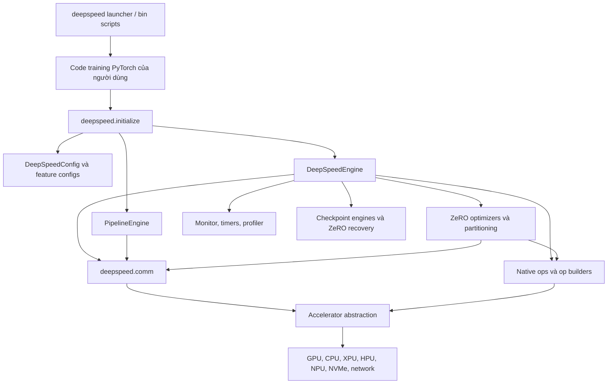
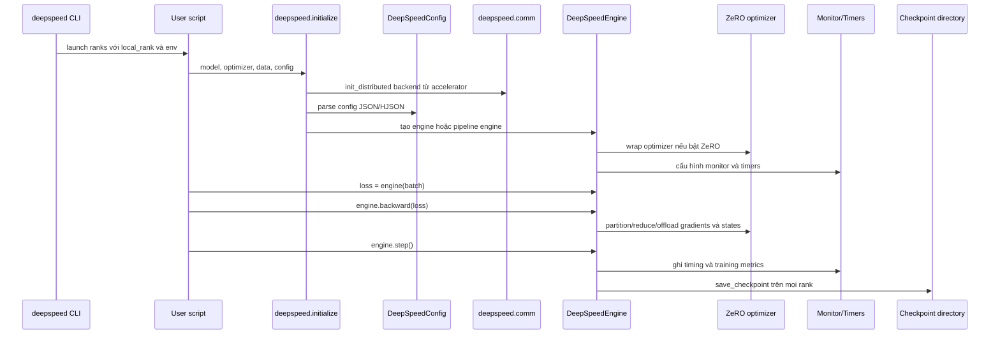
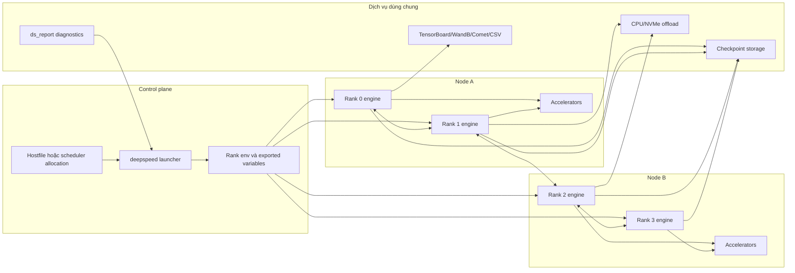
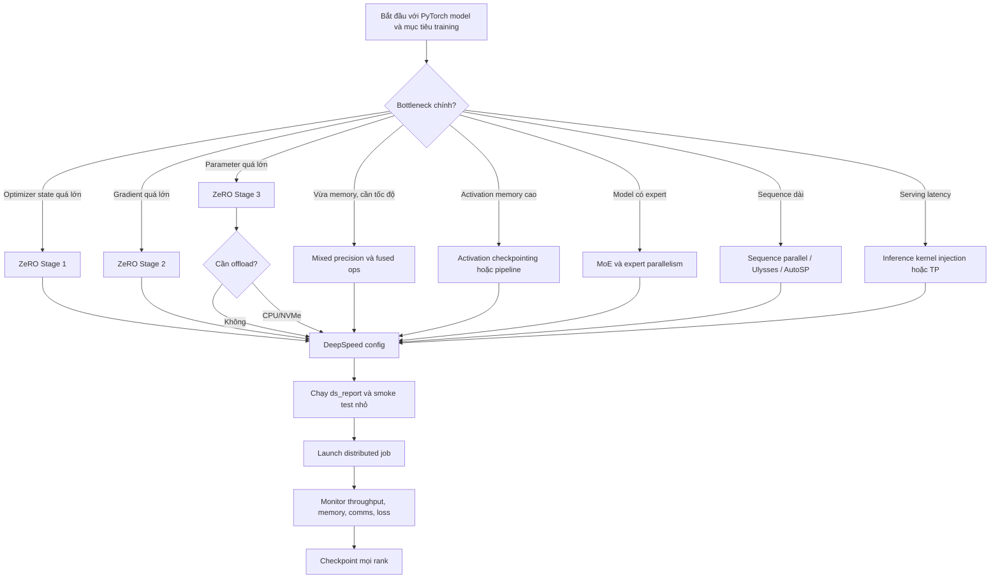
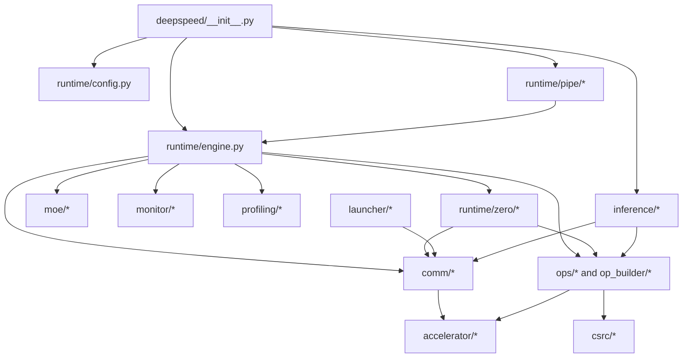
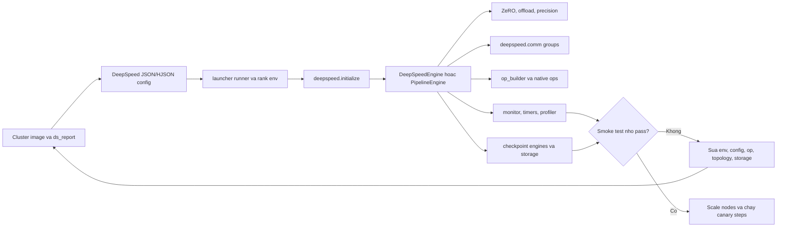
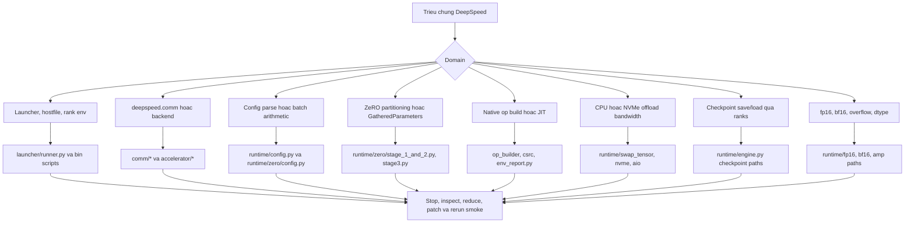

# Kiến trúc DeepSpeed

## Phạm vi và dữ kiện repository

Tài liệu này dựa trên bản clone cục bộ tại `github-repos/03-fine-tuning-training/DeepSpeed`, đã được rà soát ở commit `3e486febfcfc3c843a9066619697344d2cb7b9ec` ngày 2026-06-01. `version.txt` ghi `0.19.2`. Metadata trong `setup.py` đặt tên package là `deepspeed`, dùng license Apache-2.0, cài Python package chính và các script như `deepspeed`, `ds`, `ds_report`, `ds_bench`, `ds_elastic`, `ds_nvme_tune`, `ds_io`, đồng thời hỗ trợ Python 3.8 đến 3.12.

Bản clone cục bộ có 696 file Python dưới `deepspeed`, 295 file test, 334 file tài liệu và 193 file native/kernel dưới `csrc`. Runtime dependency trong `requirements/requirements.txt` gồm PyTorch 2.0+, pydantic 2+, hjson, ninja, numpy, packaging, psutil, py-cpuinfo, einops, msgpack và tqdm. Các requirement tùy chọn bao phủ inference, sparse attention, sparse pruning, autotuning, Triton, DeepCompile, readthedocs, development tooling và one-bit MPI.

Chỉ dẫn cục bộ trong `AGENTS.md` và `CLAUDE.md` nhấn mạnh signed commit, formatting, pre-commit verification cho file thay đổi và dùng `deepspeed.comm` thay vì import trực tiếp `torch.distributed`. Tác vụ này chỉ đọc source repo và ghi tài liệu bên ngoài repo đó.

## Tóm tắt điều hành

DeepSpeed là thư viện distributed training, inference và tối ưu hệ thống cho mô hình deep learning lớn. Abstraction trung tâm là `DeepSpeedEngine`, được tạo bởi `deepspeed.initialize(...)` trong `deepspeed/__init__.py`. Engine bọc user model, optimizer, scheduler, dataloader, precision policy, communication backend, checkpointing, timers, monitoring và các tính năng tùy chọn như ZeRO, pipeline parallelism, tensor parallelism, MoE, activation checkpointing, offload và DeepCompile.

Kiến trúc DeepSpeed rộng hơn một optimizer đơn lẻ:

- `deepspeed/runtime/engine.py` triển khai lifecycle training engine: forward, backward, step, checkpointing, timers, data loading, precision, optimizer wrapping, monitoring và routing tính năng.
- `deepspeed/runtime/config.py` cùng các module config chuyên biệt parse và validate cấu hình JSON/HJSON của DeepSpeed.
- `deepspeed/runtime/zero/*` triển khai các stage ZeRO, parameter partitioning, offload, optimizer state handling, hành vi kiểu ZeRO-Infinity, MiCS, Muon support và utility riêng cho ZeRO.
- `deepspeed/launcher/*` và `bin/*` launch job multi-process và multi-node.
- `accelerator/*` abstract hóa CUDA, CPU, XPU, NPU, HPU, MLU, MPS và SDAA.
- `deepspeed/comm/*` cung cấp API communication tương thích torch.distributed với logging và backend selection của DeepSpeed.
- `op_builder/*`, `deepspeed/ops/*` và `csrc/*` quản lý native kernel tùy chọn và extension JIT/precompiled.
- `deepspeed/monitor`, `deepspeed/profiling`, `deepspeed/inference`, `deepspeed/pipe`, `deepspeed/moe`, `deepspeed/sequence`, `deepspeed/compile` và `deepspeed/autotuning` bổ sung tính năng vận hành và hệ thống quanh runtime lõi.

Lựa chọn kiến trúc chính là người dùng giữ phần lớn code PyTorch model như cũ, còn distributed systems behavior được ủy quyền cho engine và config. Điều này giảm độ phức tạp của application code, nhưng khiến config correctness, môi trường launch cluster, checkpoint discipline, tương thích native op và xử lý lỗi distributed trở nên rất quan trọng.

## Bài toán được giải quyết

Training và serving mô hình frontier-scale bị giới hạn bởi GPU memory, băng thông interconnect, kích thước optimizer state, activation memory, volume checkpoint và độ phức tạp orchestration cluster. DeepSpeed xử lý các giới hạn này bằng:

- ZeRO optimizer stages partition optimizer states, gradients và parameters.
- Đường offload CPU/NVMe cho optimizer state và parameter.
- Mixed precision và low-precision optimizer states.
- Kết hợp pipeline, tensor, expert, sequence và data parallelism.
- Custom fused kernels và transformer/inference kernels.
- Launching, hostfile parsing, multi-node execution và elastic job support.
- Monitoring, profiling, autotuning và environment reporting.
- Checkpointing utilities, bao gồm khôi phục partition ZeRO và tài liệu universal checkpointing.

Trong stack fine-tuning/training, DeepSpeed là lớp hệ thống cho phép PEFT, Transformers, TRL, Megatron-style model và custom PyTorch model chạy ở quy mô lớn hơn vòng lặp training single-process.

## Vai trò trong AI stack

DeepSpeed nằm dưới model library và trên primitive phần cứng/distributed:

- **Lớp model:** PyTorch `nn.Module`, Hugging Face Transformers, Megatron-style model, MoE layer, pipeline module, đường `LoRAOptimizedLinear`.
- **Lớp runtime:** `DeepSpeedEngine`, `PipelineEngine`, `InferenceEngine`, ZeRO optimizer, activation checkpointing, data pipeline, tích hợp scheduler/optimizer.
- **Lớp distributed:** `deepspeed.comm`, process group, launcher backend, accelerator abstraction, nhóm tensor/pipeline/expert/data parallel.
- **Lớp hệ thống:** native ops, JIT/precompiled kernels, offload, NVMe/AIO, GDS, timers, profiling, monitoring, checkpoint engines.
- **Lớp vận hành:** launcher `deepspeed`, hostfile, environment export, `ds_report`, CI/test matrix, hướng dẫn Docker/ROCm/Windows.

DeepSpeed không phải experiment tracker, dataset library hay model registry. Nó cung cấp runtime và nền tảng vận hành để các lớp đó gọi vào.

## Bản đồ source tree

| Đường dẫn | Trách nhiệm |
| --- | --- |
| `README.md` | Tổng quan dự án, tin mới, tích hợp, cài đặt, environment report, publication và hướng dẫn contribution. |
| `version.txt` | Phiên bản package cơ sở, `0.19.2` trong clone này. |
| `setup.py` | Metadata build, scripts, dependency extras, hành vi precompile op, thông tin git/version lúc build, nhánh packaging Windows. |
| `requirements/*` | Dependency runtime và tùy chọn. |
| `deepspeed/__init__.py` | Public API, `initialize`, `init_inference`, distributed initialization, chọn engine, export runtime class. |
| `deepspeed/runtime/engine.py` | Training engine lõi: wrap model, forward/backward/step, optimizer/scheduler, checkpoint, timers, monitor, tích hợp ZeRO. |
| `deepspeed/runtime/config.py` | Parser config cấp cao và routing tính năng cho precision, communication, monitoring, profiling, autotuning, checkpointing, tensor parallelism, data efficiency và compile. |
| `deepspeed/runtime/zero/*` | ZeRO stages, parameter partitioning, offload, optimizer state, partition coordinator, MiCS, tiled linear, Muon và config. |
| `deepspeed/runtime/pipe/*` | Pipeline parallel module và engine. |
| `deepspeed/moe/*` | Mixture-of-Experts layers, gating, sharded MoE và expert utilities. |
| `deepspeed/sequence/*` | Sequence parallel và AutoSP components. |
| `deepspeed/inference/*` | Inference engine, kernel injection, tensor parallel inference, quantization và hành vi liên quan CUDA graph. |
| `deepspeed/launcher/*` | Hostfile parsing, resource selection, environment propagation, launcher PDSH/OpenMPI/MVAPICH/Slurm/MPICH/IMPI. |
| `accelerator/*` | Abstraction accelerator ở build/runtime cho CUDA, CPU, XPU, NPU, MPS, HPU, MLU và SDAA. |
| `deepspeed/comm/*` | Wrapper communication tương thích torch.distributed, backend selection, comm logging, timed operations. |
| `op_builder/*` | Builder build-time và runtime cho optional ops; phát hiện builder theo accelerator. |
| `deepspeed/ops/*`, `csrc/*` | Python wrapper và source native cho fused optimizer, transformer kernel, sparse attention, AIO, GDS, quantization, random LTD, DeepCompile và op theo nền tảng. |
| `deepspeed/env_report.py` | Triển khai `ds_report` cho trạng thái op, compatibility, torch/CUDA/HIP/NPU/system diagnostics và warning `/dev/shm`. |
| `deepspeed/monitor/*` | Monitoring TensorBoard, W&B, Comet và CSV. |
| `deepspeed/profiling/*` | FLOPs profiler và profiling utilities. |
| `docs/_tutorials/*` | Tutorial cho getting started, ZeRO, offload, pipeline, MoE, monitor, profiler, autotuning, DeepNVMe, Ulysses, AutoTP và nhiều chủ đề khác. |
| `tests/*` | Test unit, runtime, ZeRO, launcher, accelerator, inference, compile, checkpoint, model, one-bit và performance. |
| `examples/sdma_allgather/*` | Ví dụ cục bộ về SDMA allgather và ZeRO-3. |

## Sơ đồ component

## Khái niệm cốt lõi

**DeepSpeedEngine:** wrapper training trung tâm. Engine callable cho forward pass và cung cấp `backward`, `step`, `save_checkpoint`, `load_checkpoint`.

**DeepSpeedConfig:** biểu diễn đã parse của config JSON/HJSON. Config route setting cho batch size, optimizer, scheduler, precision, ZeRO, communication, monitoring, autotuning, tensor parallelism, checkpointing và data efficiency.

**ZeRO:** Zero Redundancy Optimizer. Stage 1 partition optimizer states, Stage 2 partition thêm gradients, Stage 3 partition thêm model parameters. `deepspeed/runtime/zero/config.py` biểu diễn bằng `ZeroStageEnum`.

**Offload:** chuyển optimizer state hoặc parameter sang CPU/NVMe để giảm áp lực GPU memory. ZeRO-2 hỗ trợ optimizer offload; ZeRO-3 hỗ trợ parameter và optimizer offload.

**Accelerator abstraction:** `accelerator/real_accelerator.py` chọn hoặc validate accelerator qua `DS_ACCELERATOR` hoặc auto-detection, rồi expose hành vi device, dtype, stream, communication và op-builder theo backend.

**Communication wrapper:** `deepspeed.comm` giữ tương thích với API kiểu torch.distributed, đồng thời thêm backend selection và communication logging của DeepSpeed.

**Launcher:** script `deepspeed` route hostfile/resource selection tới backend launcher như PDSH, OpenMPI, MVAPICH, Slurm, MPICH và IMPI.

**Native ops:** extension C++/CUDA/HIP/SYCL/platform-specific tùy chọn được build bởi `op_builder`. Chúng có thể precompiled qua environment variable khi setup hoặc JIT compile runtime nếu tương thích.

**Pipeline parallelism:** `PipelineModule` biểu diễn model như chuỗi layer; `PipelineEngine` train micro-batch qua các stage pipeline được schedule.

**MoE:** mixture-of-experts layer kết hợp expert, data, model và ZeRO parallelism bằng expert group.

**Monitoring và profiling:** Monitor backend, wall-clock timer, comm logging, FLOPs profiler, PyTorch profiler tutorial và `ds_report` cung cấp visibility vận hành.

## Kiến trúc nội bộ

Entry point công khai là `deepspeed.initialize(...)` trong `deepspeed/__init__.py`. Hàm này log metadata version, shutdown mọi context `zero.Init` đang active, khởi tạo distributed communication qua backend của accelerator hiện tại, chuẩn hóa config input, có thể khởi tạo mesh device cho sequence/data parallelism, merge setting tensor-parallel model init, build `DeepSpeedConfig`, rồi chọn một trong ba đường engine:

- `DeepSpeedHybridEngine` khi hybrid engine được bật.
- `DeepSpeedEngine` cho training non-pipeline tiêu chuẩn.
- `PipelineEngine` khi model là `PipelineModule`.

`DeepSpeedEngine.__init__` trong `runtime/engine.py` tiếp tục validate arguments, cấu hình distributed variables, cấu hình `deepspeed.comm`, tạo `MonitorMaster`, cấu hình distributed model, đăng ký hook dùng bởi DeepCompile, ghi nhận tên parameter, cấu hình timers, thiết lập optimizer/scheduler/data loader và nối các tính năng hệ thống tùy chọn. Class này sau đó triển khai `forward`, `backward`, `step`, `load_checkpoint` và `save_checkpoint`.

Triển khai ZeRO được tách theo stage. `runtime/zero/stage_1_and_2.py` triển khai `DeepSpeedZeroOptimizer`, còn `runtime/zero/stage3.py` triển khai `DeepSpeedZeroOptimizer_Stage3`. Stage 3 điều phối gather/release parameter, gradient partitioning, offload, swapping optimizer state, bucket sizing, persistence threshold, reduce-scatter, tùy chọn quantized communication và context đặc biệt như `GatheredParameters`.

Config không còn là dictionary lỏng sau khi parse. `runtime/config.py` import các module config theo feature, còn `runtime/zero/config.py` dùng pydantic model với alias và migration field deprecated. `tests/unit/runtime/zero/test_zero_config.py` kiểm chứng các field deprecated như `cpu_offload` và alias như `stage3_prefetch_bucket_size`.

Native ops được phát hiện động. `op_builder/all_ops.py` import package op-builder của accelerator hiện tại, thu thập class kết thúc bằng `Builder`, tạo builder instance và expose `ALL_OPS`. `setup.py` dùng environment variable như `DS_BUILD_OPS` và build var riêng từng op để quyết định precompilation. Nếu op chưa được preinstall, `env_report.py` ghi chú rằng op tương thích có thể JIT compile runtime.

## Luồng training end-to-end

## Luồng runtime và dữ liệu

Vòng lặp training đơn giản nhất trong getting-started docs là:

1. Gọi `deepspeed.initialize(...)`.
2. Dùng engine trả về như model callable cho forward.
3. Gọi `engine.backward(loss)`.
4. Gọi `engine.step()`.

Bên dưới, `engine.backward` xử lý gradient scaling, gradient averaging hoặc partitioning, và behavior theo optimizer. `engine.step` xử lý gradient accumulation boundary, optimizer update, learning-rate scheduler step, timers, monitor events, overflow handling và chuyển trạng thái ZeRO.

Với ZeRO-3, dữ liệu parameter không luôn cư trú trên mọi device. Runtime gather parameter trước khi module compute và release hoặc partition lại sau đó. Offload path có thể chuyển parameter hoặc optimizer state giữa accelerator memory, CPU memory và NVMe. Vì vậy truy cập parameter trực tiếp theo cách thông thường có thể sai nếu không dùng context được tài liệu hóa như `deepspeed.zero.GatheredParameters`.

Với pipeline parallelism, vòng lặp training thay đổi. `PipelineEngine` expose `train_batch` và `eval_batch` vì pipeline scheduling interleave forward/backward trên micro-batch. Tài liệu nêu rõ pipeline training không thể được biểu diễn như ba lời gọi cấp người dùng `forward`, `backward`, `step` giống engine tiêu chuẩn.

Với inference, `deepspeed/inference/engine.py` build `InferenceEngine` quanh module và `DeepSpeedInferenceConfig`, tùy chọn thay transformer layer bằng optimized kernel, tạo tensor-parallel group, áp dụng injection policy, đổi dtype, hỗ trợ constraint CUDA graph và profile model time.

## Topology triển khai và vận hành

Hành vi vận hành quan trọng:

- Launcher mặc định tìm hostfile nhưng có thể giới hạn node và slot bằng `--num_nodes`, `--num_gpus`, `--include`, `--exclude`.
- `--no_ssh` hỗ trợ môi trường như Kubernetes, nơi mỗi node launch độc lập.
- Environment propagation bao gồm một số prefix được chọn và `.deepspeed_env`.
- `ds_report` nên được dùng để kiểm tra installed/compatible ops, metadata torch/CUDA/HIP/NPU và warning `/dev/shm`.
- Mọi rank phải tham gia `save_checkpoint`; getting-started docs cảnh báo gọi chỉ trên rank 0 có thể hang.
- Tương thích native op phụ thuộc vào PyTorch, CUDA/HIP/SYCL/compiler versions, ninja và hỗ trợ theo accelerator.

## Vòng đời và sơ đồ quyết định

## Sơ đồ phụ thuộc module

## Điểm mở rộng

DeepSpeed có nhiều bề mặt mở rộng:

- **Tích hợp application:** gọi `deepspeed.initialize` với model, optimizer, parameters, scheduler, data, config path/dict và optional model-parallel unit.
- **Tích hợp launcher:** dùng hostfile, launcher Slurm/MPI, `--no_ssh`, chuỗi include/exclude resource, environment file và metadata rank từ scheduler.
- **Mở rộng config:** thêm hoặc tune các section trong DeepSpeed config như `zero_optimization`, `fp16`, `bf16`, `torch_autocast`, `tensorboard`, `wandb`, `csv_monitor`, `flops_profiler`, `autotuning`, `aio` và checkpoint settings.
- **Custom optimizer/scheduler:** truyền object hoặc callable optimizer/scheduler vào `initialize`, override construction được định nghĩa trong config.
- **Hỗ trợ accelerator:** triển khai contract abstract accelerator và op builders, rồi chọn qua `DS_ACCELERATOR` hoặc auto-detection.
- **Native ops:** thêm op builder dưới `op_builder`, source dưới `csrc`, Python wrapper dưới `deepspeed/ops` và compatibility checks.
- **Parallelism:** dùng `PipelineModule`, MoE layers, tensor parallel config, sequence parallel settings và expert group parameters.
- **Monitoring:** cấu hình monitor built-in hoặc instantiate `MonitorMaster(ds_config.monitor_config)` để ghi custom event.
- **Inference:** dùng `init_inference` / `InferenceEngine` với kernel injection, injection policy, tensor parallel size, dtype, quantization và CUDA graph options.

## Tích hợp

README và docs xác định các tích hợp với:

- Hugging Face Transformers và Accelerate, thường qua config file `--deepspeed` hoặc Accelerate DeepSpeed configs.
- PyTorch Lightning, MosaicML Composer, Determined và MMEngine.
- Training Megatron-style model-parallel.
- Workflow PEFT và QLoRA qua Accelerate/Transformers/TRL, đặc biệt fine-tuning model lớn với ZeRO-3.
- TensorBoard, W&B, Comet và CSV cho monitoring.
- PyTorch Profiler và DeepSpeed FLOPs profiler cho phân tích hiệu năng.
- AzureML examples, Docker/ROCm images, hướng dẫn build Windows và nhiều nhà cung cấp accelerator.

## Cấu hình, triển khai và vận hành

DeepSpeed chủ yếu được cấu hình bằng JSON/HJSON. Config tối thiểu gồm batch size, optimizer, precision và ZeRO settings. Deployment lớn hơn thêm bucket sizes, offload device settings, gradient accumulation, checkpoint behavior, monitoring, communication logging, tensor parallelism và autotuning.

Checklist vận hành:

- Chạy `ds_report` trước training để xác minh op compatibility và chi tiết môi trường.
- Validate config trên model nhỏ hoặc dataset giảm trước khi scale out.
- Xác nhận `train_batch_size`, `train_micro_batch_size_per_gpu` và `gradient_accumulation_steps` nhất quán.
- Pin PyTorch, CUDA/HIP/toolchain versions khi phụ thuộc native ops.
- Quyết định op nên precompiled (`DS_BUILD_OPS` và biến riêng từng op) hay JIT compiled.
- Chỉ đặt `DS_ACCELERATOR` khi auto-detection sai hoặc mơ hồ.
- Với ZeRO-3, tune `stage3_prefetch_bucket_size`, `stage3_param_persistence_threshold`, `stage3_max_live_parameters`, `stage3_max_reuse_distance` và offload settings theo tradeoff memory/communication.
- Với container, đảm bảo `/dev/shm` đủ lớn cho distributed communication.
- Đảm bảo checkpoint storage reachable và đủ hiệu năng cho mọi rank.
- Monitor wall-clock breakdown, throughput, GPU memory, communication timings và loss curves.
- Xem thay đổi DeepSpeed config là thay đổi production; thay đổi nhỏ có thể làm đổi memory residency, optimizer numerics, checkpoint shape hoặc communication volume.

## Observability, test, evaluation và failure mode

Các bề mặt observability gồm:

- `ds_report` từ `deepspeed/env_report.py`.
- `MonitorMaster` và backend trong `deepspeed/monitor`.
- `ThroughputTimer`, `SynchronizedWallClockTimer` và named timers trong `deepspeed/utils/timer.py`.
- Communication logging trong `deepspeed/comm/comm.py` và `deepspeed/utils/comms_logging.py`.
- FLOPs profiler trong `deepspeed/profiling/flops_profiler/profiler.py`.
- Workflow PyTorch profiler mô tả trong `docs/_tutorials/pytorch-profiler.md`.
- Memory logging qua các utility runtime như `see_memory_usage`.

Test trong clone này bao phủ accelerator init, launcher argument/resource handling, ZeRO config, runtime behavior của ZeRO, compile integration, inference, sequence parallelism, one-bit communication, performance microbenchmarks và kịch bản model Megatron GPT-2. File đại diện gồm `tests/unit/runtime/zero/test_zero_config.py`, `tests/unit/launcher/*`, `tests/accelerator/test_ds_init.py`, `tests/unit/v1/zero/*` và `tests/unit/v1/compile/*`.

Failure mode phổ biến:

- Batch-size config mismatch gây gradient accumulation sai hoặc assertion runtime.
- Gọi save/load checkpoint chỉ trên một rank.
- Native op build fail vì CUDA/HIP/compiler/PyTorch versions không khớp.
- `/dev/shm` quá nhỏ trong container, gây bất ổn NCCL hoặc shared-memory.
- Hostfile, SSH hoặc scheduler rank mismatch.
- Dùng trực tiếp `torch.distributed` trong code DeepSpeed thay vì `deepspeed.comm`.
- Truy cập trực tiếp parameter ZeRO-3 mà không dùng `GatheredParameters`.
- Đường offload quá chậm vì băng thông CPU/NVMe không đủ.
- Số pipeline stage không chia hết cho tổng GPU count.
- Dtype không được accelerator đã chọn hỗ trợ.
- Latency JIT compile ở lần đầu dùng optional ops.

Evaluation nên bao gồm chất lượng loss, samples/sec, tokens/sec, step latency, GPU memory, CPU memory, NVMe bandwidth, communication time, checkpoint time, restart success và ổn định số học qua các lựa chọn precision và ZeRO stage.

## Rủi ro bảo mật và governance

DeepSpeed vận hành gần hạ tầng cluster và native code, nên governance phải bao phủ cả rủi ro ML lẫn hệ thống:

- **Supply chain native code:** extension C++/CUDA/HIP được compile và load động; cần pin version và validate provenance build.
- **Truy cập cluster:** hostfile, SSH, scheduler variables và environment export có thể lộ credentials hoặc launch job trên node không mong muốn.
- **Độ nhạy checkpoint:** optimizer states và model weights có thể chứa tín hiệu training proprietary hoặc nhạy cảm.
- **Config drift:** thay đổi JSON có thể đổi precision, optimizer, offload, checkpoint format hoặc communication behavior.
- **Data privacy:** distributed logs và monitor backend có thể lộ metrics, tên dataset, prompt hoặc sample text nếu custom event không được kiểm soát.
- **Artifact trust:** load checkpoint hoặc custom model code tùy ý có thể thực thi đường không tin cậy ngoài bản thân DeepSpeed.
- **Resource isolation:** offload và NVMe path có thể ảnh hưởng workload khác nếu quota storage và kiểm soát I/O yếu.
- **License compliance:** model, dataset và native dependency phía downstream có thể có nghĩa vụ ngoài license Apache-2.0 của DeepSpeed.

## Hướng dẫn đọc source

Thứ tự đọc khuyến nghị:

1. `README.md` để hiểu phạm vi dự án, cài đặt, accelerator hỗ trợ, tích hợp và `ds_report`.
2. `docs/_tutorials/getting-started.md` cho lifecycle engine tối thiểu.
3. `deepspeed/__init__.py` cho `initialize` và chọn engine.
4. `deepspeed/runtime/engine.py` cho nội bộ training runtime.
5. `deepspeed/runtime/config.py` và `deepspeed/runtime/zero/config.py` cho ngữ nghĩa config.
6. `docs/_tutorials/zero.md`, `zero-offload.md` và `zeropp.md` cho ZeRO stages và offload.
7. `deepspeed/runtime/zero/stage_1_and_2.py`, `stage3.py` và `partition_parameters.py` cho implementation ZeRO.
8. `deepspeed/launcher/runner.py` cho hành vi launch multi-node.
9. `accelerator/real_accelerator.py` và `deepspeed/comm/comm.py` cho backend selection và communication.
10. `op_builder/all_ops.py`, `op_builder/builder.py` và `deepspeed/env_report.py` cho lifecycle native op.
11. `docs/_tutorials/monitor.md`, `pytorch-profiler.md` và `flops-profiler.md` cho observability.
12. Test dưới `tests/unit/runtime/zero`, `tests/unit/launcher` và `tests/accelerator` cho behavior mong đợi.

## Lộ trình học

Cho application developer:

1. Wrap một PyTorch model nhỏ bằng `deepspeed.initialize`.
2. Dùng vòng lặp engine tiêu chuẩn: forward, `backward`, `step`.
3. Thêm fp16 hoặc bf16 chỉ sau khi đường fp32 ổn định.
4. Bật ZeRO Stage 1, rồi Stage 2, rồi Stage 3 khi memory pressure yêu cầu.
5. Thêm monitoring và chạy `ds_report` trước khi scale multi-node.
6. Thêm save/load checkpoint và test restart trên mọi rank.
7. Chỉ đưa offload, pipeline, tensor parallelism hoặc MoE vào khi engine path đơn giản đã có bottleneck đo được.

Cho platform engineer:

1. Đọc code launcher, accelerator, comm và op-builder.
2. Chuẩn hóa hostfile/scheduler integration và environment propagation.
3. Pre-validate native op compatibility cho từng image cluster.
4. Định nghĩa template config cho các kích thước model và ZeRO stage phổ biến.
5. Thiết lập chính sách monitoring, checkpoint và restart.
6. Chạy test đại diện và smoke job cho mỗi lần cập nhật image PyTorch/CUDA/HIP.

## Checklist production và cổng distributed training

Readiness của DeepSpeed phải được kiểm tra trước job lớn, vì nhiều lỗi chỉ xuất hiện khi nhiều rank, native ops, checkpoint storage và offload path cùng hoạt động. Các neo source hữu ích nhất gồm `deepspeed/__init__.py`, `deepspeed/runtime/engine.py`, `deepspeed/runtime/config.py`, `deepspeed/runtime/zero/*`, `deepspeed/launcher/*`, `deepspeed/comm/*`, `accelerator/real_accelerator.py`, `op_builder/*`, `deepspeed/env_report.py`, `deepspeed/monitor/*` và `tests/unit/runtime/zero/*`.

| Khu vực readiness | Cần xác minh |
| --- | --- |
| Environment | `ds_report` xác nhận accelerator, torch/CUDA/HIP/compiler compatibility, op đã cài hoặc JIT được, và `/dev/shm` khỏe. |
| Config arithmetic | `train_batch_size`, `train_micro_batch_size_per_gpu`, gradient accumulation, world size, precision và ZeRO stage nhất quán. |
| Launcher topology | Hostfile, scheduler allocation, rank env, include/exclude filters, SSH/no-SSH mode và exported environment phải deterministic. |
| ZeRO/offload | Stage, bucket sizes, persistence thresholds, CPU/NVMe bandwidth và cách dùng `GatheredParameters` được test trên job nhỏ. |
| Checkpointing | Tất cả rank cùng save/load, storage bandwidth đủ và recovery được test trước long run. |
| Monitoring | Timers, throughput, comm logging, memory logs, profiler và monitor backends bật với metadata an toàn. |

## Bản đồ cô lập lỗi

Lỗi distributed training rất tốn kém khi triệu chứng duy nhất là job treo. Triage nên tách launcher setup, distributed communication, ZeRO partitioning, native ops, precision/overflow, offload storage, checkpointing và monitoring.

## Glossary

| Thuật ngữ | Ý nghĩa |
| --- | --- |
| DeepSpeedEngine | Runtime wrapper chính cho training. |
| ZeRO | Họ kỹ thuật partition optimizer, gradient và parameter. |
| ZeRO-1 | Partition optimizer states. |
| ZeRO-2 | Partition optimizer states và gradients. |
| ZeRO-3 | Partition optimizer states, gradients và parameters. |
| Offload | Chuyển optimizer hoặc parameter state sang CPU/NVMe. |
| `zero.Init` | Context khởi tạo model tiết kiệm memory cho model lớn. |
| `GatheredParameters` | Context truy cập an toàn parameter bị partition bởi ZeRO-3. |
| PipelineModule | Biểu diễn model dạng chuỗi layer cho pipeline parallelism. |
| PipelineEngine | Engine schedule pipeline micro-batches. |
| MoE | Mixture of Experts, training/inference layer expert sparse. |
| Accelerator | Abstraction DeepSpeed trên CUDA, CPU, XPU, NPU, HPU, MLU, MPS và SDAA. |
| `deepspeed.comm` | Wrapper communication DeepSpeed tương thích API kiểu torch.distributed. |
| Op builder | Class Python build hoặc JIT-load extension native của DeepSpeed. |
| `ds_report` | Báo cáo environment và op compatibility. |
| Wall-clock breakdown | Instrumentation timing quanh forward, backward, reduction và step. |
| Autotuning | Tính năng DeepSpeed tìm kiếm lựa chọn config liên quan hiệu năng. |
| Universal checkpointing | Khái niệm checkpoint portability được DeepSpeed tài liệu hóa cho distributed state. |
