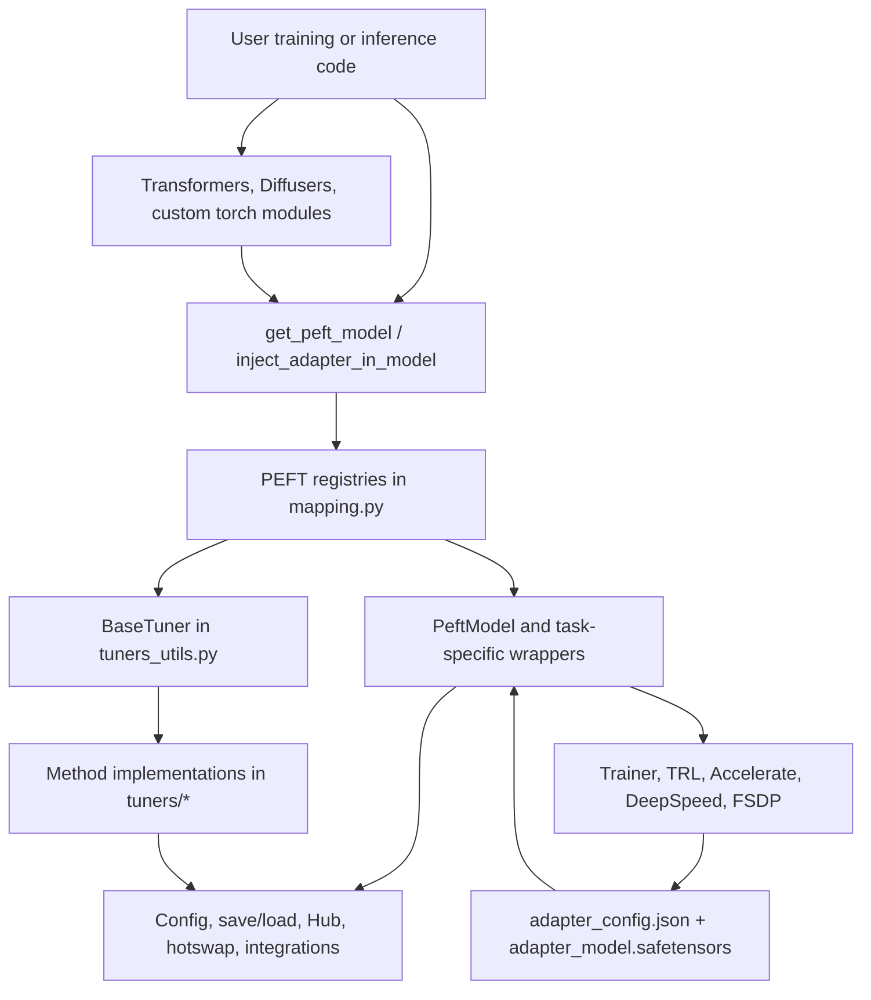
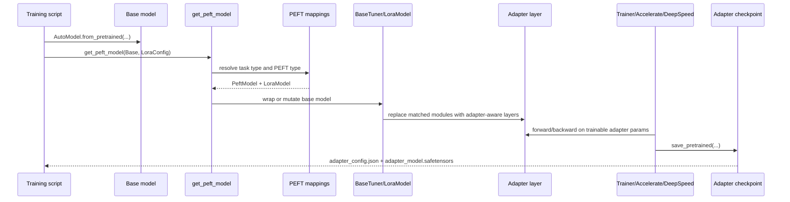
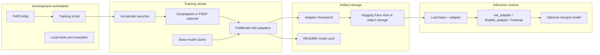
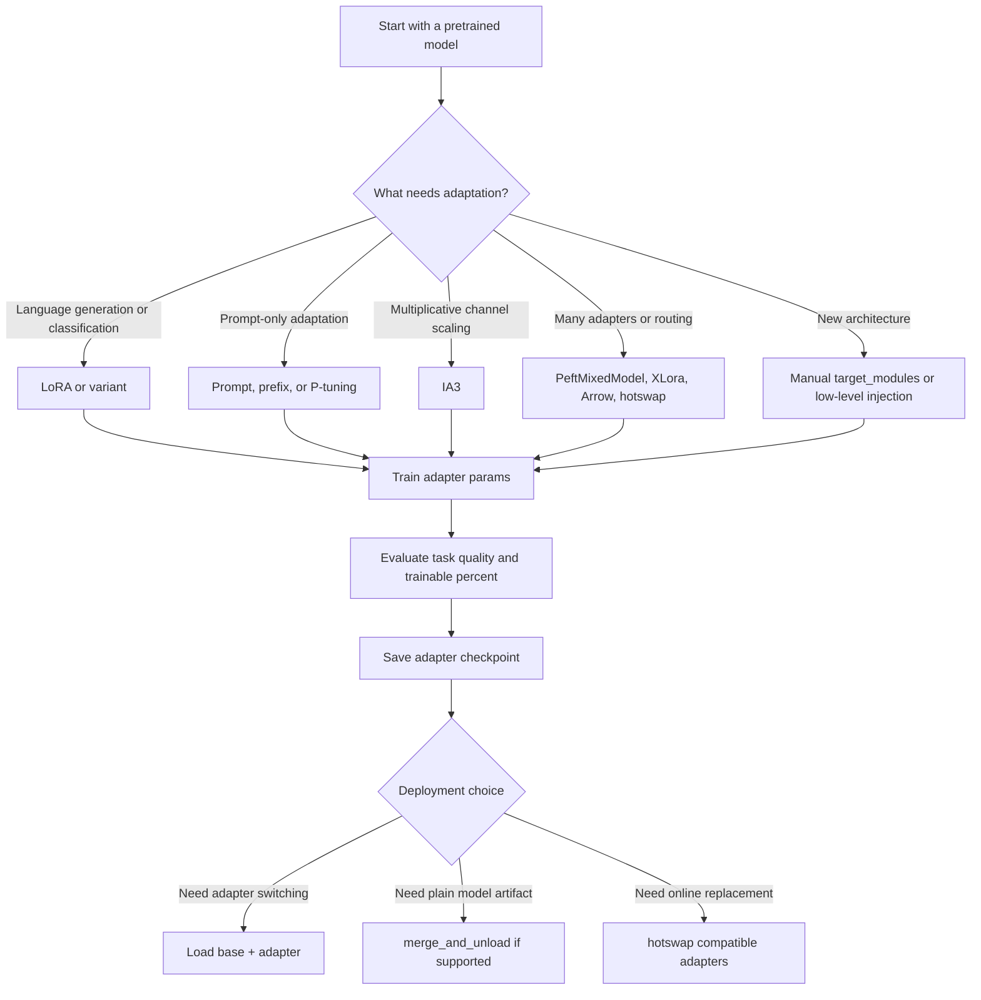
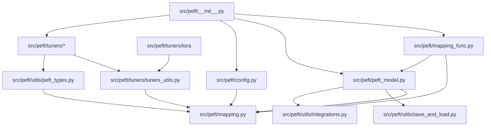
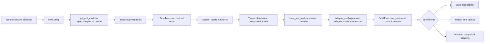
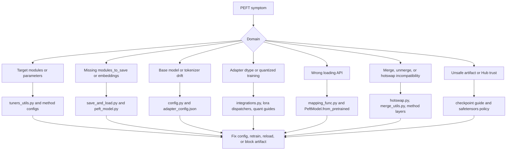

# PEFT Architecture

## Scope And Repository Facts

This document is grounded in the local clone at `github-repos/03-fine-tuning-training/peft`, inspected at commit `4f7ddfabbb0d03c6071e7ba922335bde26da4cf7` from 2026-06-01, with package version `0.19.2.dev0` in `setup.py` and `src/peft/__init__.py`.

PEFT is a Python package under `src/peft` with 232 source files, 62 test files, 78 documentation files, and 215 example files in this clone. Its package metadata in `setup.py` requires Python 3.10+, PyTorch, Transformers, Accelerate, Safetensors, Hugging Face Hub, NumPy, packaging, psutil, PyYAML, and tqdm. Optional development and test extras add pytest, diffusers, datasets, scipy, scikit-learn, sentencepiece, protobuf, torchvision, ruff, black, and doc-builder tooling.

## Executive Summary

PEFT, Parameter-Efficient Fine-Tuning, solves the cost problem of adapting large pretrained models by training compact adapter parameters instead of updating every base-model weight. It is not a training platform by itself; it is the adapter layer and checkpoint format that lets Transformers, Diffusers, Accelerate, DeepSpeed, TRL, and plain PyTorch training loops reuse large frozen backbones while only optimizing a small number of task-specific parameters.

Architecturally, PEFT is organized around a small set of public wrappers and registries:

- `src/peft/mapping_func.py` exposes `get_peft_model`, the main wrapper factory.
- `src/peft/peft_model.py` defines `PeftModel` and task-specific subclasses such as `PeftModelForCausalLM`.
- `src/peft/mapping.py` holds runtime mappings from PEFT type to config class, tuner class, mixed-model class, and parameter prefix.
- `src/peft/tuners/tuners_utils.py` defines the shared `BaseTuner` and `BaseTunerLayer` mechanics for finding target modules, replacing layers, managing adapter state, merging, unloading, and switching adapters.
- `src/peft/tuners/*` implements concrete methods such as LoRA, AdaLoRA, IA3, prompt tuning, prefix tuning, LoHa, LoKr, OFT, BOFT, VeRA, XLora, trainable tokens, and many newer research adapters.
- `src/peft/utils/save_and_load.py`, `src/peft/config.py`, and `src/peft/utils/*` manage adapter config serialization, state-dict filtering, Hub access, quantization helpers, adapter hotswapping, and integration utilities.

The main architectural tradeoff is that PEFT mutates or wraps the base model. That gives excellent compatibility with existing PyTorch and Hugging Face training workflows, but it makes target module selection, checkpoint provenance, dtype handling, and adapter/base-model alignment critical operational concerns.

## Problem Solved

Full fine-tuning of modern LLMs, diffusion models, speech models, and vision-language models is expensive in GPU memory, storage, optimizer state, and retraining time. PEFT reduces this by attaching small trainable modules or prompts to a frozen base model. The README demonstrates the practical result: adapter checkpoints are often MB-scale instead of GB-scale, and LoRA can train models that would otherwise exceed GPU memory.

PEFT addresses four recurring engineering problems:

- **Training cost:** only adapter weights, selected heads, or selected tokens require gradients.
- **Storage cost:** `PeftModel.save_pretrained` stores adapter weights plus `adapter_config.json`, not the full base model.
- **Multi-task reuse:** one frozen base model can host multiple named adapters and switch among them.
- **Ecosystem integration:** adapters can be used from Transformers, Diffusers, Accelerate, DeepSpeed, TRL, and Hugging Face Hub workflows.

## AI Stack Role

PEFT sits between model libraries and training/inference orchestration:

- Upstream: pretrained model loaders such as `transformers.AutoModel*`, Diffusers pipelines, and custom `torch.nn.Module` models.
- Core: PEFT config classes, model wrappers, tuner registries, adapter layers, and save/load utilities.
- Downstream training: Transformers `Trainer`, TRL `SFTTrainer` or DPO workflows, Accelerate launchers, FSDP, DeepSpeed ZeRO, and hand-written PyTorch loops.
- Downstream inference: unmerged adapter inference, merged base-model export, hotswapped adapters, weighted/mixed adapters, and Hub distribution.

PEFT should be treated as a model adaptation and adapter checkpoint layer, not as a data pipeline, experiment tracker, serving gateway, or evaluation framework.

## Source Tree Map

| Path | Responsibility |
| --- | --- |
| `README.md` | Project overview, quickstart, benefits, integrations, and model-support guidance. |
| `setup.py`, `pyproject.toml` | Package version, dependencies, extras, test markers, ruff/pytest settings. |
| `src/peft/__init__.py` | Public API exports for configs, models, utilities, helpers, and all registered methods. |
| `src/peft/mapping.py` | Runtime registries for PEFT type to config, tuner, mixed tuner, and parameter prefix. |
| `src/peft/mapping_func.py` | Main `get_peft_model` factory and routing between `PeftModel`, task-specific wrappers, and `PeftMixedModel`. |
| `src/peft/config.py` | Base config mixin, `PeftConfig`, config save/load, Hub download, version metadata, forward compatibility. |
| `src/peft/peft_model.py` | High-level PEFT wrapper, adapter save/load, add/set/disable adapter, task-specific forward paths, generation helpers. |
| `src/peft/mixed_model.py` | Mixed compatible adapter support through `PeftMixedModel`. |
| `src/peft/tuners/tuners_utils.py` | Shared module matching, adapter injection, layer replacement, merge/unload, trainability and adapter state helpers. |
| `src/peft/tuners/lora/*` | LoRA config/model/layer, quantized dispatchers, Tensor Parallel hooks, LoRA variants, merge utilities. |
| `src/peft/tuners/*` | Method-specific configs, model wrappers, prompt encoders, and adapter layers for many PEFT methods. |
| `src/peft/utils/save_and_load.py` | Adapter-only state dict extraction, loading, key rewriting, embedding save handling. |
| `src/peft/utils/hotswap.py` | Adapter hotswap support and target-shape compatibility checks. |
| `docs/source/_toctree.yml` | Documentation information architecture: tutorials, method guides, developer guides, Accelerate integrations, API references. |
| `docs/source/developer_guides/*` | Checkpoint format, low-level injection, custom models, quantization, model merging, mixed models, torch.compile, troubleshooting. |
| `docs/source/accelerate/*` | DeepSpeed and FSDP integration guidance. |
| `examples/*` | Task and method examples: causal LM, seq2seq, SFT, diffusion, ControlNet, image classification, int8/FP4, multi-adapter, hotswap-style use cases. |
| `tests/*` | Unit, integration, GPU, regression, mapping, low-level API, adapter-specific, quantization, torch.compile, training, and model compatibility tests. |

## Component Diagram

## Core Concepts

**Base model:** the pretrained model being adapted. PEFT usually freezes it and inserts trainable adapter state.

**Adapter:** the trainable parameter set added to the model. For LoRA this is usually low-rank `lora_A` and `lora_B` modules; for prompt methods it can be learned prompt embeddings or prefix encoders.

**PEFT config:** a dataclass-derived object such as `LoraConfig`, `IA3Config`, or `PromptTuningConfig`. It declares method type, task type, target modules, trainable modules, rank, initialization, dropout, inference mode, and method-specific settings.

**Target modules and target parameters:** names, regexes, shorthand values, or state-dict-derived targets that decide where adapters are injected. `BaseTuner` and method-specific models perform the matching.

**Modules to save:** non-adapter modules that must remain trainable and be included in adapter checkpoints. Sequence classification heads and resized embeddings are common examples.

**Named adapters:** adapters are stored in module dictionaries and can be selected with `set_adapter`, disabled, loaded from a checkpoint, or saved selectively.

**Merged vs unmerged inference:** some methods can merge adapter deltas into base weights via `merge_and_unload`; this may improve inference simplicity but sacrifices adapter switching and unmerge flexibility.

**Adapter checkpoint:** PEFT saves `adapter_model.safetensors` or `adapter_model.bin`, `adapter_config.json`, and optionally a generated model card. The docs recommend Safetensors because pickle-backed `.bin` has security risk.

## Internal Architecture

The public API starts in `src/peft/__init__.py`, which re-exports model wrappers, config classes, helper utilities, and every method registered under `src/peft/tuners`. This makes PEFT feel like a flat API while keeping method implementations modular.

The main path is:

1. User creates a base model with Transformers, Diffusers, timm, or custom PyTorch.
2. User creates a `PeftConfig`, commonly `LoraConfig`.
3. `get_peft_model` in `mapping_func.py` inspects task type, model state, and config.
4. The factory chooses `PeftModel`, a task-specific subclass, or `PeftMixedModel`.
5. For non-prompt methods, `PeftModel.__init__` looks up a tuner class in `PEFT_TYPE_TO_TUNER_MAPPING`.
6. `BaseTuner` injects adapter modules by traversing the base model, matching targets, replacing layers, and recording targeted module/parameter names.
7. Method layers such as `LoraLayer` own the adapter weights and forward-time delta logic.
8. Save/load utilities filter adapter parameters from full model state and write/read PEFT checkpoint files.

The extension registry is deliberately simple. `register_peft_method` in `src/peft/utils/peft_types.py` validates the method name, ensures `PeftType` has a corresponding enum value, assigns a unique parameter prefix, and fills the mappings in `mapping.py`. Method packages call it from their `__init__.py`, for example `src/peft/tuners/lora/__init__.py` registers `LORA` with `LoraConfig` and `LoraModel`.

## End-To-End Flow

## Runtime And Data Flow

During training, the base model receives the same input tensors as before. The key change is that selected modules have been replaced by adapter-aware modules. For LoRA, `LoraLayer` holds the original base layer plus trainable low-rank matrices in module dictionaries keyed by adapter name. In the forward path, the base layer result is combined with an adapter delta, with dtype casts and variant hooks applied when needed.

Trainability is managed by PEFT utilities rather than by the user manually freezing every parameter. Adapter parameters and configured `modules_to_save` are marked trainable; most base parameters remain frozen. `print_trainable_parameters`, `get_model_status`, and `get_layer_status` help inspect this state.

Loading is different from creation. A trained adapter should be loaded with `PeftModel.from_pretrained(base_model, adapter_id)` or `load_adapter`, not by calling `get_peft_model` with a fresh config. `tests/test_mapping.py` verifies that repeated wrapping emits a warning and that unloading first avoids that warning.

For low-level use cases, `inject_adapter_in_model` in `mapping.py` mutates any `torch.nn.Module` in place and returns the original model instance instead of a `PeftModel`. `docs/source/developer_guides/low_level_api.md` and `tests/test_low_level_api.py` show that this path is useful for non-Transformers models but gives up higher-level wrapper utilities unless the caller manages save/load explicitly.

## Deployment And Operations Topology

Operationally, PEFT is lightweight compared with DeepSpeed or Accelerate, but it depends on correct model and environment coordination:

- The base model name and revision in `adapter_config.json` must match the model used at inference.
- Adapter dtype behavior matters: PEFT promotes fp16/bf16 adapter weights to fp32 by default for stable training unless `autocast_adapter_dtype=False`.
- For quantized training, call helpers such as `prepare_model_for_kbit_training` before adapter injection.
- For ZeRO-3, FSDP, or low-memory loading, use documented options such as `low_cpu_mem_usage` and the Accelerate/DeepSpeed guidance.
- Saving should use `safe_serialization=True` unless there is a compatibility reason not to.
- Merged exports are easier to serve in plain runtimes but lose multi-adapter controls.

## Lifecycle And Decision Diagram

## Module Dependency Diagram

## Extension Points

The most important extension points are:

- **New PEFT method:** add a `PeftType` enum member in `src/peft/utils/peft_types.py`, implement config/model/layers under `src/peft/tuners/<method>`, and call `register_peft_method` from that method package.
- **New adapter layer behavior:** subclass or mirror `BaseTuner` and `BaseTunerLayer`; implement target detection, `_prepare_adapter_config`, `_create_and_replace`, and method-specific layer logic.
- **New LoRA variant:** use the variant pattern around `LoraVariant` in `src/peft/tuners/lora/layer.py`, where variant hooks can participate in init, merge, unmerge, and forward.
- **Custom models:** set `target_modules`, regex target patterns, `target_parameters`, and `modules_to_save` explicitly. The custom models guide shows MLP, timm, and new Transformers architectures.
- **Low-level injection:** call `inject_adapter_in_model` for arbitrary `torch.nn.Module` models when `PeftModel` wrappers are not appropriate.
- **Checkpoint conversion:** use `get_peft_model_state_dict`, `set_peft_model_state_dict`, and the checkpoint-format guide to map external adapter keys into PEFT format.
- **Serving flexibility:** use `load_adapter`, `set_adapter`, `disable_adapter`, hotswap utilities, or `merge_and_unload` depending on latency, memory, and multi-adapter requirements.

## Integrations

PEFT is intentionally coupled to the Hugging Face ecosystem:

- **Transformers:** direct adapter APIs, task-specific `PeftModelFor*` classes, model loading, generation, classification heads, and Hub conventions.
- **Diffusers:** LoRA and other adapter workflows for DreamBooth, ControlNet, Stable Diffusion, and image generation examples.
- **Accelerate:** distributed launch and device placement; PEFT docs include FSDP and DeepSpeed pages under `docs/source/accelerate`.
- **DeepSpeed:** large-model LoRA and QLoRA workflows with ZeRO-3, CPU offload, and `gather_params_ctx` integration in adapter initialization paths.
- **TRL:** SFT, DPO, and RLHF-style workflows where PEFT config is passed to TRL trainers.
- **Quantization libraries:** bitsandbytes, GPTQ, AQLM, AWQ, HQQ, EETQ, INC, torchao, and Transformer Engine dispatch paths are visible in LoRA implementation files.
- **Hugging Face Hub:** configs inherit `PushToHubMixin`, load via `hf_hub_download`, and save model-card metadata.
- **Safetensors:** default secure adapter serialization through `safe_save_file`.

## Configuration, Deployment, And Operations

PEFT configuration is code-first rather than centralized YAML-first. The adapter config object is the source of truth, and `adapter_config.json` is the persisted runtime contract.

Recommended operational practices:

- Record base model id, revision, tokenizer changes, PEFT version, training data version, and target module selection.
- Prefer explicit `target_modules` for new architectures or custom PyTorch modules.
- Use `task_type` where possible so PEFT can select task wrappers and train/save relevant heads.
- Use `modules_to_save` for randomly initialized heads, resized embeddings, poolers, or task-specific output layers.
- Use `save_embedding_layers=True` or trainable tokens intentionally when tokenizer vocabulary changes.
- Keep adapters unmerged when you need adapter switching, provenance, or composition.
- Merge only after verifying that the method and quantization mode support it and that downstream serving does not need adapter control.
- Run `print_trainable_parameters()` and inspect `targeted_module_names` or layer status before spending GPU time.
- In DeepSpeed/FSDP workflows, follow the specific Accelerate config guidance and ensure all ranks save/checkpoint consistently.

## Observability, Testing, Evaluation, And Failure Modes

The repo has broad tests for adapter methods and integrations:

- `tests/test_low_level_api.py` validates low-level injection, adapter-only state dicts, `modules_to_save`, and state-dict-driven target reconstruction.
- `tests/test_mapping.py` validates repeated wrapping warnings and unload behavior.
- `tests/test_config.py`, `tests/test_auto.py`, and `tests/test_hub_features.py` cover config and Hub-style flows.
- `tests/test_lora_variants.py`, `tests/test_lora_conversion.py`, `tests/test_torch_compile.py`, and many method-specific test files cover implementation behavior.
- `tests/training/*` includes DeepSpeed, FSDP, and tensor-parallel-oriented training configurations.

Observable signals include trainable parameter counts, adapter status helpers, warnings about repeated wrapping or incompatible config, checkpoint key mismatches, missing/unexpected state-dict keys, and Trainer/Accelerate logs.

Common failure modes:

- Loading a trained adapter with `get_peft_model` instead of `PeftModel.from_pretrained`.
- Incorrect `target_modules`, especially on new architectures or custom modules.
- Forgetting `modules_to_save` for classification heads or resized embeddings, leading to random inference heads after reload.
- Adapter/base model mismatch because the base model revision changed.
- Dtype issues with fp16 gradients or disabled adapter autocasting.
- Quantization plus merge incompatibilities or small numerical deviations after merging.
- Hotswapping adapters with incompatible ranks, targets, or shapes.
- Security exposure from pickle-backed `.bin` adapter files or untrusted Hub code.

Evaluation should measure both task quality and systems metrics: validation loss/accuracy, instruction-following score, adapter checkpoint size, trainable parameter percentage, peak GPU memory, throughput, reload reproducibility, and merged-vs-unmerged output drift.

## Security And Governance Risks

PEFT adapters are small but can materially change model behavior. Governance should treat adapter artifacts as model artifacts, not as harmless patches.

Key risks:

- **Untrusted artifacts:** prefer Safetensors; avoid loading pickle-backed `.bin` from untrusted sources.
- **Base-model drift:** adapter behavior depends on exact base weights, tokenizer, and revision.
- **Data leakage:** fine-tuned adapters can memorize sensitive data even when the base model is unchanged.
- **Policy bypass:** a small adapter can override safety or domain behavior in a large base model.
- **License mismatch:** adapter distribution must respect the base model license and training data obligations.
- **Supply chain:** Hub downloads, custom model code, and quantization libraries should be pinned and reviewed.
- **Reproducibility:** save training config, seeds, PEFT version, dependency versions, and target module decisions.

## Reading Guide

Start with:

1. `README.md` for the high-level purpose, quickstart, and ecosystem integrations.
2. `src/peft/mapping_func.py` to understand how `get_peft_model` routes models.
3. `src/peft/peft_model.py` for wrapper lifecycle, save/load, adapter switching, and task-specific behavior.
4. `src/peft/tuners/tuners_utils.py` for the shared adapter injection engine.
5. `src/peft/tuners/lora/config.py`, `model.py`, and `layer.py` for the most important concrete method.
6. `docs/source/developer_guides/checkpoint.md` for artifact format and conversion.
7. `docs/source/developer_guides/low_level_api.md` and `custom_models.md` for custom models and non-wrapper workflows.
8. `docs/source/developer_guides/troubleshooting.md` for dtype, loading, and task-head pitfalls.
9. `tests/test_low_level_api.py`, `tests/test_mapping.py`, and method-specific tests to see expected behavior.

## Learning Path

For application developers:

1. Run the README LoRA quickstart mentally against a small Transformers model.
2. Inspect `LoraConfig` fields and understand `r`, `lora_alpha`, `target_modules`, dropout, bias, and `modules_to_save`.
3. Learn the difference between creating a new adapter and loading a trained adapter.
4. Practice saving, loading, disabling, and merging one adapter.
5. Move to quantized training with `prepare_model_for_kbit_training`.
6. Add distributed training through Accelerate, FSDP, or DeepSpeed only after the single-process adapter path is correct.

For contributors:

1. Read `register_peft_method` and one method package such as `tuners/lora`.
2. Study `BaseTuner` target matching and replacement flow.
3. Study state-dict key naming in the checkpoint guide.
4. Add or modify tests before changing adapter injection, save/load, or dtype behavior.
5. Verify method docs, package reference pages, examples, and test coverage together.

## Production Readiness And Adapter Governance

PEFT production readiness is about treating an adapter as a governed model artifact. The critical source anchors are `src/peft/mapping_func.py`, `src/peft/peft_model.py`, `src/peft/mapping.py`, `src/peft/tuners/tuners_utils.py`, `src/peft/tuners/lora/*`, `src/peft/utils/save_and_load.py`, `src/peft/utils/hotswap.py`, and `docs/source/developer_guides/checkpoint.md`.

| Readiness area | What to verify |
| --- | --- |
| Base-model contract | `adapter_config.json` records the intended base model, but production should also pin revision, tokenizer changes, dtype, and quantization assumptions. |
| Target selection | `target_modules`, `target_parameters`, and `modules_to_save` match the actual architecture and include heads or resized embeddings when needed. |
| Trainability | `print_trainable_parameters`, `get_model_status`, and `get_layer_status` confirm only intended parameters are trainable. |
| Checkpoint format | Prefer `adapter_model.safetensors`, validate key prefixes, and avoid untrusted pickle-backed `.bin` files. |
| Load path | Use `PeftModel.from_pretrained` or `load_adapter` for trained adapters; do not accidentally create a fresh adapter with `get_peft_model`. |
| Serving choice | Decide unmerged, merged, mixed, or hotswapped adapters based on latency, memory, provenance, and compatibility constraints. |

## Failure Isolation Map

PEFT failures often appear as quality drops after reload, but the root cause may be target matching, missing task heads, base-model drift, dtype behavior, or an unsafe merge. Triage should inspect both adapter config and actual module status, not only training logs.

## Glossary

| Term | Meaning |
| --- | --- |
| Adapter | Trainable parameters attached to a frozen or mostly frozen base model. |
| PEFT | Parameter-Efficient Fine-Tuning; the family of techniques and this library. |
| LoRA | Low-Rank Adaptation; uses low-rank matrices to represent weight deltas. |
| IA3 | Adapter method that scales activations through learned vectors. |
| Prompt tuning | Learns virtual prompt embeddings instead of modifying model layers. |
| Prefix tuning | Learns key/value prefixes for attention layers. |
| `PeftConfig` | Base configuration class persisted as `adapter_config.json`. |
| `PeftModel` | High-level wrapper around the base model and adapters. |
| `BaseTuner` | Shared injection and adapter-management base class. |
| `target_modules` | Module names, regexes, or shorthand selecting where adapters attach. |
| `modules_to_save` | Extra non-adapter modules that remain trainable and are checkpointed. |
| `adapter_model.safetensors` | Default adapter weight file. |
| `merge_and_unload` | Merges adapter deltas into base weights and removes PEFT wrappers when supported. |
| Hotswap | Replace adapter weights online without rebuilding the whole model, subject to compatibility. |
| QLoRA | LoRA fine-tuning on quantized base models, commonly with bitsandbytes 4-bit weights. |
| ZeRO | DeepSpeed optimizer-state, gradient, and parameter partitioning used with PEFT for large training runs. |
