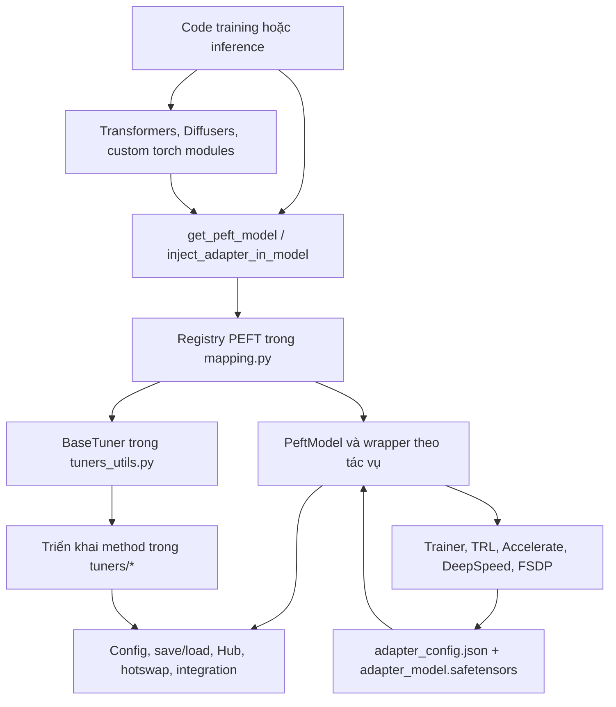
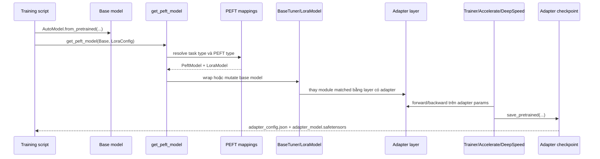
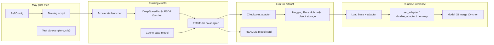
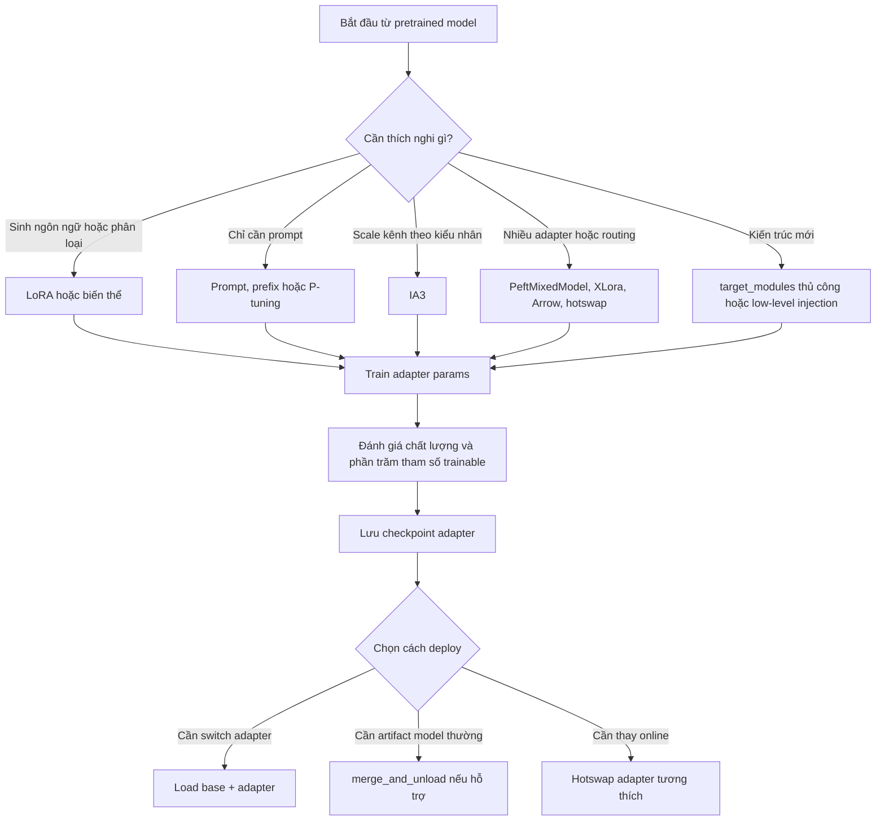
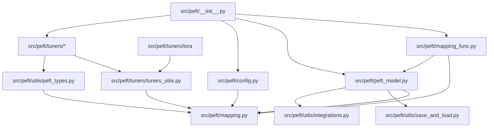
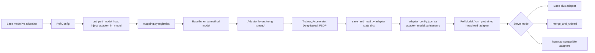
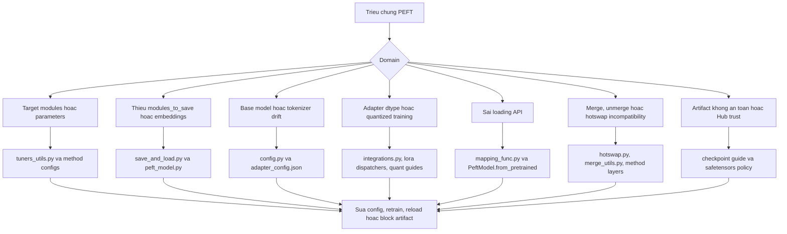

# Kiến trúc PEFT

## Phạm vi và dữ kiện repository

Tài liệu này dựa trên bản clone cục bộ tại `github-repos/03-fine-tuning-training/peft`, đã được rà soát ở commit `4f7ddfabbb0d03c6071e7ba922335bde26da4cf7` ngày 2026-06-01. Phiên bản gói trong `setup.py` và `src/peft/__init__.py` là `0.19.2.dev0`.

PEFT là thư viện Python đặt dưới `src/peft`. Bản clone này có 232 file nguồn, 62 file test, 78 file tài liệu và 215 file ví dụ. Metadata trong `setup.py` yêu cầu Python 3.10+, PyTorch, Transformers, Accelerate, Safetensors, Hugging Face Hub, NumPy, packaging, psutil, PyYAML và tqdm. Các extra cho phát triển và kiểm thử bổ sung pytest, diffusers, datasets, scipy, scikit-learn, sentencepiece, protobuf, torchvision, ruff, black và tooling sinh tài liệu.

## Tóm tắt điều hành

PEFT, Parameter-Efficient Fine-Tuning, giải quyết bài toán chi phí khi tinh chỉnh mô hình pretrained lớn bằng cách chỉ huấn luyện một tập tham số adapter nhỏ thay vì cập nhật toàn bộ trọng số của base model. Đây không phải là một nền tảng training hoàn chỉnh; PEFT là lớp adapter và định dạng checkpoint giúp Transformers, Diffusers, Accelerate, DeepSpeed, TRL và các vòng lặp PyTorch tự viết cùng sử dụng lại backbone lớn trong khi chỉ tối ưu một phần tham số nhỏ cho từng tác vụ.

Về kiến trúc, PEFT xoay quanh một số wrapper và registry quan trọng:

- `src/peft/mapping_func.py` cung cấp `get_peft_model`, factory chính để bọc mô hình.
- `src/peft/peft_model.py` định nghĩa `PeftModel` và các lớp theo tác vụ như `PeftModelForCausalLM`.
- `src/peft/mapping.py` giữ các mapping runtime từ loại PEFT sang config class, tuner class, mixed-model class và prefix tham số.
- `src/peft/tuners/tuners_utils.py` định nghĩa `BaseTuner` và `BaseTunerLayer`, chịu trách nhiệm tìm target module, thay layer, quản lý trạng thái adapter, merge, unload và chuyển adapter.
- `src/peft/tuners/*` triển khai các phương pháp cụ thể như LoRA, AdaLoRA, IA3, prompt tuning, prefix tuning, LoHa, LoKr, OFT, BOFT, VeRA, XLora, trainable tokens và nhiều adapter nghiên cứu mới hơn.
- `src/peft/utils/save_and_load.py`, `src/peft/config.py` và `src/peft/utils/*` xử lý serialize config adapter, lọc state dict, truy cập Hub, hỗ trợ quantization, hotswap adapter và các tiện ích tích hợp.

Đánh đổi kiến trúc chính là PEFT bọc hoặc mutate base model. Cách này tương thích tốt với PyTorch và Hugging Face, nhưng làm cho việc chọn target module, kiểm soát provenance checkpoint, dtype, và sự khớp giữa adapter với base model trở thành vấn đề vận hành rất quan trọng.

## Bài toán được giải quyết

Full fine-tuning cho LLM, diffusion model, speech model và vision-language model hiện đại thường tốn GPU memory, dung lượng optimizer state, chi phí lưu trữ và thời gian huấn luyện lại. PEFT giảm chi phí này bằng cách gắn các module trainable nhỏ hoặc prompt trainable vào base model gần như đóng băng. README của repo cho thấy hệ quả thực tế: checkpoint adapter thường chỉ ở mức MB thay vì GB, và LoRA có thể train những mô hình mà full fine-tuning sẽ vượt quá bộ nhớ GPU.

PEFT giải quyết bốn nhóm vấn đề kỹ thuật:

- **Chi phí training:** chỉ adapter weights, một số head, hoặc một số token được tính gradient.
- **Chi phí lưu trữ:** `PeftModel.save_pretrained` lưu adapter weights cùng `adapter_config.json`, không lưu toàn bộ base model.
- **Tái sử dụng đa tác vụ:** một base model đóng băng có thể chứa nhiều adapter có tên và chuyển đổi giữa chúng.
- **Tích hợp hệ sinh thái:** adapter dùng được trong Transformers, Diffusers, Accelerate, DeepSpeed, TRL và Hugging Face Hub.

## Vai trò trong AI stack

PEFT nằm giữa thư viện mô hình và lớp điều phối training/inference:

- Phía trên: các loader pretrained model như `transformers.AutoModel*`, Diffusers pipeline và model custom `torch.nn.Module`.
- Phần lõi: config class, model wrapper, tuner registry, adapter layer và utility save/load của PEFT.
- Training phía dưới: Transformers `Trainer`, TRL `SFTTrainer` hoặc DPO workflow, Accelerate launcher, FSDP, DeepSpeed ZeRO và vòng lặp PyTorch tự viết.
- Inference phía dưới: inference với adapter chưa merge, export base model đã merge, hotswap adapter, adapter có trọng số hoặc mixed adapter, và phân phối qua Hub.

Nên xem PEFT là lớp thích nghi mô hình và checkpoint adapter, không phải data pipeline, experiment tracker, serving gateway hay evaluation framework.

## Bản đồ source tree

| Đường dẫn | Trách nhiệm |
| --- | --- |
| `README.md` | Tổng quan dự án, quickstart, lợi ích, tích hợp và hướng dẫn model support. |
| `setup.py`, `pyproject.toml` | Phiên bản package, dependencies, extras, marker pytest, cấu hình ruff/pytest. |
| `src/peft/__init__.py` | Public API export cho config, model, utility, helper và tất cả method đã đăng ký. |
| `src/peft/mapping.py` | Registry runtime từ PEFT type sang config, tuner, mixed tuner và prefix tham số. |
| `src/peft/mapping_func.py` | Factory `get_peft_model` và logic route sang `PeftModel`, wrapper theo tác vụ hoặc `PeftMixedModel`. |
| `src/peft/config.py` | Base config mixin, `PeftConfig`, save/load config, tải từ Hub, metadata version, forward compatibility. |
| `src/peft/peft_model.py` | Wrapper PEFT cấp cao, save/load adapter, add/set/disable adapter, forward path theo tác vụ, helper generation. |
| `src/peft/mixed_model.py` | Hỗ trợ adapter hỗn hợp thông qua `PeftMixedModel`. |
| `src/peft/tuners/tuners_utils.py` | Cơ chế chung để match module, inject adapter, thay layer, merge/unload, quản lý trainability và trạng thái adapter. |
| `src/peft/tuners/lora/*` | LoRA config/model/layer, dispatcher cho quantized layer, hook Tensor Parallel, biến thể LoRA, utility merge. |
| `src/peft/tuners/*` | Config, wrapper, prompt encoder và adapter layer theo từng phương pháp. |
| `src/peft/utils/save_and_load.py` | Trích xuất state dict chỉ chứa adapter, load lại, rewrite key, xử lý lưu embedding. |
| `src/peft/utils/hotswap.py` | Hỗ trợ hotswap adapter và kiểm tra tương thích shape/target. |
| `docs/source/_toctree.yml` | Kiến trúc tài liệu: tutorial, method guide, developer guide, tích hợp Accelerate, API reference. |
| `docs/source/developer_guides/*` | Định dạng checkpoint, low-level injection, custom model, quantization, merge model, mixed model, torch.compile, troubleshooting. |
| `docs/source/accelerate/*` | Hướng dẫn tích hợp DeepSpeed và FSDP. |
| `examples/*` | Ví dụ theo tác vụ và phương pháp: causal LM, seq2seq, SFT, diffusion, ControlNet, image classification, int8/FP4, multi-adapter. |
| `tests/*` | Unit, integration, GPU, regression, mapping, low-level API, test theo adapter, quantization, torch.compile, training và tương thích model. |

## Sơ đồ component

## Khái niệm cốt lõi

**Base model:** mô hình pretrained được thích nghi. PEFT thường đóng băng base model và thêm trạng thái adapter trainable.

**Adapter:** tập tham số trainable gắn vào model. Với LoRA, đó thường là các module low-rank `lora_A` và `lora_B`; với prompt method, đó có thể là prompt embedding hoặc prefix encoder học được.

**PEFT config:** object dựa trên dataclass như `LoraConfig`, `IA3Config` hoặc `PromptTuningConfig`. Config khai báo method type, task type, target module, module cần train thêm, rank, cách khởi tạo, dropout, inference mode và tham số riêng của method.

**Target modules và target parameters:** tên, regex, shorthand hoặc target suy ra từ state dict để quyết định adapter được inject vào đâu. `BaseTuner` và model theo method chịu trách nhiệm match.

**Modules to save:** các module không phải adapter nhưng cần train và cần có trong checkpoint adapter. Head classification và embedding sau khi resize là ví dụ phổ biến.

**Named adapters:** adapter được lưu trong module dictionary và có thể chọn bằng `set_adapter`, disable, load từ checkpoint hoặc save có chọn lọc.

**Inference đã merge và chưa merge:** một số method có thể merge delta adapter vào base weights bằng `merge_and_unload`; cách này có thể đơn giản hóa inference nhưng làm mất khả năng switch adapter và unmerge.

**Adapter checkpoint:** PEFT lưu `adapter_model.safetensors` hoặc `adapter_model.bin`, `adapter_config.json` và có thể sinh model card. Tài liệu repo khuyến nghị Safetensors vì `.bin` dựa trên pickle có rủi ro bảo mật.

## Kiến trúc nội bộ

Public API bắt đầu từ `src/peft/__init__.py`, nơi re-export model wrapper, config class, helper utility và mọi method đăng ký dưới `src/peft/tuners`. Điều này làm API bề mặt có cảm giác phẳng, trong khi implementation vẫn được tách theo module.

Luồng chính:

1. Người dùng tạo base model bằng Transformers, Diffusers, timm hoặc PyTorch custom.
2. Người dùng tạo `PeftConfig`, thường là `LoraConfig`.
3. `get_peft_model` trong `mapping_func.py` kiểm tra task type, trạng thái model và config.
4. Factory chọn `PeftModel`, subclass theo tác vụ hoặc `PeftMixedModel`.
5. Với method không phải prompt learning, `PeftModel.__init__` tra tuner class trong `PEFT_TYPE_TO_TUNER_MAPPING`.
6. `BaseTuner` inject adapter bằng cách duyệt base model, match target, thay layer và ghi lại module/parameter đã target.
7. Method layer như `LoraLayer` sở hữu adapter weights và logic tính delta ở forward.
8. Utility save/load lọc adapter parameter khỏi full model state và đọc/ghi checkpoint PEFT.

Registry extension được thiết kế đơn giản. `register_peft_method` trong `src/peft/utils/peft_types.py` validate tên method, yêu cầu `PeftType` có enum tương ứng, gán prefix tham số duy nhất và điền các mapping trong `mapping.py`. Các package method gọi hàm này từ `__init__.py`; ví dụ `src/peft/tuners/lora/__init__.py` đăng ký `LORA` với `LoraConfig` và `LoraModel`.

## Luồng end-to-end

## Luồng runtime và dữ liệu

Trong training, base model vẫn nhận cùng input tensor như trước. Điểm khác biệt là một số module được chọn đã bị thay bằng module hiểu adapter. Với LoRA, `LoraLayer` giữ base layer gốc cùng các ma trận low-rank trainable trong module dictionary theo adapter name. Ở forward path, kết quả base layer được cộng với delta adapter, kèm xử lý dtype và hook của variant khi cần.

Trainability được PEFT quản lý thay vì buộc người dùng tự freeze từng tham số. Adapter parameter và `modules_to_save` được đánh dấu trainable; phần lớn base parameter vẫn frozen. `print_trainable_parameters`, `get_model_status` và `get_layer_status` giúp kiểm tra trạng thái này.

Loading khác với creation. Adapter đã train nên được load bằng `PeftModel.from_pretrained(base_model, adapter_id)` hoặc `load_adapter`, không phải gọi `get_peft_model` với config mới. `tests/test_mapping.py` kiểm chứng rằng wrap lặp lại sẽ phát warning và unload trước sẽ tránh warning.

Với use case cấp thấp, `inject_adapter_in_model` trong `mapping.py` mutate bất kỳ `torch.nn.Module` nào tại chỗ và trả lại instance model ban đầu thay vì `PeftModel`. `docs/source/developer_guides/low_level_api.md` và `tests/test_low_level_api.py` cho thấy đường này hữu ích cho model không thuộc Transformers, nhưng caller phải tự quản save/load nếu cần các tiện ích wrapper cấp cao.

## Topology triển khai và vận hành

Về vận hành, PEFT nhẹ hơn DeepSpeed hoặc Accelerate, nhưng phụ thuộc mạnh vào việc phối hợp đúng model và môi trường:

- Tên và revision của base model trong `adapter_config.json` phải khớp với model dùng khi inference.
- Dtype adapter quan trọng: mặc định PEFT nâng adapter weight fp16/bf16 lên fp32 để ổn định training, trừ khi đặt `autocast_adapter_dtype=False`.
- Với training quantized, gọi helper như `prepare_model_for_kbit_training` trước khi inject adapter.
- Với ZeRO-3, FSDP hoặc low-memory loading, dùng các tùy chọn được tài liệu hóa như `low_cpu_mem_usage` và hướng dẫn Accelerate/DeepSpeed.
- Save nên dùng `safe_serialization=True` nếu không có lý do tương thích đặc biệt.
- Export đã merge dễ serve hơn trong runtime thuần, nhưng mất khả năng điều khiển nhiều adapter.

## Vòng đời và sơ đồ quyết định

## Sơ đồ phụ thuộc module

## Điểm mở rộng

Các extension point quan trọng:

- **Phương pháp PEFT mới:** thêm enum trong `src/peft/utils/peft_types.py`, triển khai config/model/layer dưới `src/peft/tuners/<method>`, rồi gọi `register_peft_method` từ package method đó.
- **Hành vi adapter layer mới:** subclass hoặc mô phỏng `BaseTuner` và `BaseTunerLayer`; triển khai target detection, `_prepare_adapter_config`, `_create_and_replace` và logic layer riêng.
- **Biến thể LoRA mới:** dùng pattern `LoraVariant` trong `src/peft/tuners/lora/layer.py`, nơi variant hook tham gia init, merge, unmerge và forward.
- **Custom model:** khai báo rõ `target_modules`, regex target, `target_parameters` và `modules_to_save`. Developer guide cho custom model có ví dụ MLP, timm và kiến trúc Transformers mới.
- **Low-level injection:** gọi `inject_adapter_in_model` cho `torch.nn.Module` bất kỳ khi wrapper `PeftModel` không phù hợp.
- **Chuyển đổi checkpoint:** dùng `get_peft_model_state_dict`, `set_peft_model_state_dict` và hướng dẫn checkpoint format để map key adapter bên ngoài sang định dạng PEFT.
- **Linh hoạt khi serve:** dùng `load_adapter`, `set_adapter`, `disable_adapter`, hotswap utility hoặc `merge_and_unload` tùy theo latency, memory và nhu cầu multi-adapter.

## Tích hợp

PEFT được thiết kế gắn chặt với hệ sinh thái Hugging Face:

- **Transformers:** API adapter trực tiếp, các class `PeftModelFor*` theo tác vụ, model loading, generation, classification head và quy ước Hub.
- **Diffusers:** workflow LoRA và adapter khác cho DreamBooth, ControlNet, Stable Diffusion và các ví dụ image generation.
- **Accelerate:** distributed launch và device placement; tài liệu PEFT có trang FSDP và DeepSpeed trong `docs/source/accelerate`.
- **DeepSpeed:** workflow LoRA và QLoRA cho model lớn với ZeRO-3, CPU offload và tích hợp `gather_params_ctx` trong các đường khởi tạo adapter.
- **TRL:** workflow SFT, DPO và RLHF-style, nơi PEFT config được truyền vào trainer của TRL.
- **Thư viện quantization:** bitsandbytes, GPTQ, AQLM, AWQ, HQQ, EETQ, INC, torchao và Transformer Engine xuất hiện trong các dispatcher của LoRA.
- **Hugging Face Hub:** config kế thừa `PushToHubMixin`, load qua `hf_hub_download` và lưu metadata model card.
- **Safetensors:** serialize adapter an toàn mặc định qua `safe_save_file`.

## Cấu hình, triển khai và vận hành

Cấu hình PEFT thiên về code-first hơn YAML-first. Object config adapter là nguồn sự thật, còn `adapter_config.json` là hợp đồng runtime được lưu lại.

Thực hành vận hành nên áp dụng:

- Ghi lại base model id, revision, thay đổi tokenizer, version PEFT, version dữ liệu training và lựa chọn target module.
- Ưu tiên `target_modules` rõ ràng với kiến trúc mới hoặc module PyTorch custom.
- Dùng `task_type` khi có thể để PEFT chọn wrapper theo tác vụ và train/save đúng head liên quan.
- Dùng `modules_to_save` cho head khởi tạo ngẫu nhiên, embedding đã resize, pooler hoặc output layer riêng của tác vụ.
- Dùng `save_embedding_layers=True` hoặc trainable tokens một cách chủ đích khi vocabulary tokenizer thay đổi.
- Giữ adapter chưa merge khi cần switch adapter, provenance hoặc composition.
- Chỉ merge sau khi xác nhận method và chế độ quantization hỗ trợ, đồng thời downstream serving không cần điều khiển adapter.
- Chạy `print_trainable_parameters()` và kiểm tra `targeted_module_names` hoặc layer status trước khi tiêu tốn GPU.
- Trong workflow DeepSpeed/FSDP, tuân thủ hướng dẫn Accelerate config và đảm bảo các rank save/checkpoint nhất quán.

## Observability, test, evaluation và failure mode

Repo có test khá rộng cho adapter method và integration:

- `tests/test_low_level_api.py` kiểm chứng low-level injection, state dict chỉ adapter, `modules_to_save` và tái dựng target từ state dict.
- `tests/test_mapping.py` kiểm chứng warning khi wrap lặp lại và hành vi unload.
- `tests/test_config.py`, `tests/test_auto.py` và `tests/test_hub_features.py` bao phủ config và luồng kiểu Hub.
- `tests/test_lora_variants.py`, `tests/test_lora_conversion.py`, `tests/test_torch_compile.py` và nhiều file test theo method bao phủ behavior implementation.
- `tests/training/*` có cấu hình training liên quan DeepSpeed, FSDP và tensor parallel.

Tín hiệu quan sát gồm số tham số trainable, helper trạng thái adapter, warning khi wrap lặp hoặc config không tương thích, mismatch key checkpoint, missing/unexpected key trong state dict và log từ Trainer/Accelerate.

Failure mode phổ biến:

- Load adapter đã train bằng `get_peft_model` thay vì `PeftModel.from_pretrained`.
- `target_modules` sai, đặc biệt với kiến trúc mới hoặc module custom.
- Quên `modules_to_save` cho classification head hoặc embedding đã resize, dẫn đến head ngẫu nhiên khi reload.
- Adapter/base model mismatch vì revision base model đã đổi.
- Lỗi dtype với fp16 gradient hoặc tắt autocast adapter.
- Quantization kết hợp merge không tương thích hoặc drift số học nhỏ sau merge.
- Hotswap adapter có rank, target hoặc shape không tương thích.
- Rủi ro bảo mật từ file adapter `.bin` dựa trên pickle hoặc code Hub không tin cậy.

Evaluation nên đo cả chất lượng tác vụ và metric hệ thống: validation loss/accuracy, điểm instruction-following, kích thước checkpoint adapter, phần trăm tham số trainable, peak GPU memory, throughput, khả năng reload tái lập và drift output giữa merged/unmerged.

## Rủi ro bảo mật và governance

Adapter PEFT nhỏ nhưng có thể thay đổi mạnh hành vi mô hình. Governance nên xem artifact adapter là artifact mô hình, không phải bản vá vô hại.

Rủi ro chính:

- **Artifact không tin cậy:** ưu tiên Safetensors; tránh load `.bin` dựa trên pickle từ nguồn không tin cậy.
- **Base-model drift:** hành vi adapter phụ thuộc vào đúng base weights, tokenizer và revision.
- **Rò rỉ dữ liệu:** adapter fine-tuned vẫn có thể ghi nhớ dữ liệu nhạy cảm dù base model không đổi.
- **Vượt chính sách:** adapter nhỏ có thể thay đổi hành vi an toàn hoặc domain của model lớn.
- **Không khớp license:** phân phối adapter phải tuân thủ license base model và nghĩa vụ dữ liệu training.
- **Supply chain:** Hub download, custom model code và thư viện quantization cần được pin version và review.
- **Tái lập:** lưu training config, seed, version PEFT, dependency version và quyết định target module.

## Hướng dẫn đọc source

Nên bắt đầu theo thứ tự:

1. `README.md` để hiểu mục tiêu, quickstart và tích hợp hệ sinh thái.
2. `src/peft/mapping_func.py` để hiểu cách `get_peft_model` route model.
3. `src/peft/peft_model.py` cho lifecycle wrapper, save/load, switch adapter và behavior theo tác vụ.
4. `src/peft/tuners/tuners_utils.py` cho engine inject adapter dùng chung.
5. `src/peft/tuners/lora/config.py`, `model.py` và `layer.py` cho method cụ thể quan trọng nhất.
6. `docs/source/developer_guides/checkpoint.md` cho định dạng artifact và chuyển đổi.
7. `docs/source/developer_guides/low_level_api.md` và `custom_models.md` cho custom model và workflow không dùng wrapper.
8. `docs/source/developer_guides/troubleshooting.md` cho dtype, loading và lỗi task-head.
9. `tests/test_low_level_api.py`, `tests/test_mapping.py` và test theo method để xem behavior mong đợi.

## Lộ trình học

Cho application developer:

1. Đọc quickstart LoRA trong README và map vào một model Transformers nhỏ.
2. Hiểu các field của `LoraConfig`: `r`, `lora_alpha`, `target_modules`, dropout, bias và `modules_to_save`.
3. Phân biệt tạo adapter mới và load adapter đã train.
4. Thực hành save, load, disable và merge một adapter.
5. Chuyển sang training quantized với `prepare_model_for_kbit_training`.
6. Chỉ thêm distributed training qua Accelerate, FSDP hoặc DeepSpeed sau khi single-process adapter path đã đúng.

Cho contributor:

1. Đọc `register_peft_method` và một package method như `tuners/lora`.
2. Nghiên cứu target matching và replacement flow của `BaseTuner`.
3. Nghiên cứu quy ước đặt key state dict trong checkpoint guide.
4. Thêm hoặc sửa test trước khi đổi adapter injection, save/load hoặc dtype behavior.
5. Kiểm tra đồng thời tài liệu method, package reference, examples và test coverage.

## Checklist production và governance cho adapter

Sẵn sàng production với PEFT nghĩa là xem adapter như một model artifact có governance, không phải chỉ là một "patch" nhỏ. Các neo source quan trọng gồm `src/peft/mapping_func.py`, `src/peft/peft_model.py`, `src/peft/mapping.py`, `src/peft/tuners/tuners_utils.py`, `src/peft/tuners/lora/*`, `src/peft/utils/save_and_load.py`, `src/peft/utils/hotswap.py` và `docs/source/developer_guides/checkpoint.md`.

| Khu vực readiness | Cần xác minh |
| --- | --- |
| Contract base model | `adapter_config.json` ghi base model dự kiến, nhưng production cần pin thêm revision, thay đổi tokenizer, dtype và giả định quantization. |
| Chọn target | `target_modules`, `target_parameters` và `modules_to_save` phải khớp architecture thật, bao gồm head hoặc resized embeddings khi cần. |
| Trainability | `print_trainable_parameters`, `get_model_status` và `get_layer_status` xác nhận chỉ đúng parameter được train. |
| Checkpoint format | Ưu tiên `adapter_model.safetensors`, validate key prefix và tránh `.bin` pickle từ nguồn không tin cậy. |
| Đường load | Dùng `PeftModel.from_pretrained` hoặc `load_adapter` cho adapter đã train; không vô tình tạo adapter mới bằng `get_peft_model`. |
| Chọn serving | Quyết định unmerged, merged, mixed hoặc hotswap adapter theo latency, memory, provenance và compatibility. |

## Bản đồ cô lập lỗi

Lỗi PEFT thường xuất hiện như chất lượng giảm sau khi reload, nhưng nguyên nhân gốc có thể là target matching, thiếu task head, base-model drift, dtype behavior hoặc merge không an toàn. Triage cần xem cả adapter config và trạng thái module thật, không chỉ training logs.

## Glossary

| Thuật ngữ | Ý nghĩa |
| --- | --- |
| Adapter | Tham số trainable gắn vào base model frozen hoặc gần như frozen. |
| PEFT | Parameter-Efficient Fine-Tuning; họ kỹ thuật và cũng là tên thư viện này. |
| LoRA | Low-Rank Adaptation; dùng ma trận low-rank để biểu diễn delta trọng số. |
| IA3 | Method adapter scale activation bằng vector học được. |
| Prompt tuning | Học virtual prompt embedding thay vì sửa layer model. |
| Prefix tuning | Học prefix key/value cho attention layer. |
| `PeftConfig` | Base config class được lưu thành `adapter_config.json`. |
| `PeftModel` | Wrapper cấp cao quanh base model và adapter. |
| `BaseTuner` | Base class chung cho injection và quản lý adapter. |
| `target_modules` | Tên module, regex hoặc shorthand chọn nơi gắn adapter. |
| `modules_to_save` | Module không phải adapter nhưng vẫn trainable và được checkpoint. |
| `adapter_model.safetensors` | File trọng số adapter mặc định. |
| `merge_and_unload` | Merge delta adapter vào base weights và bỏ wrapper PEFT khi method hỗ trợ. |
| Hotswap | Thay adapter weight online mà không dựng lại toàn bộ model, nếu tương thích. |
| QLoRA | Fine-tuning LoRA trên base model quantized, thường dùng bitsandbytes 4-bit. |
| ZeRO | Cơ chế partition optimizer state, gradient và parameter của DeepSpeed dùng cùng PEFT cho training lớn. |
