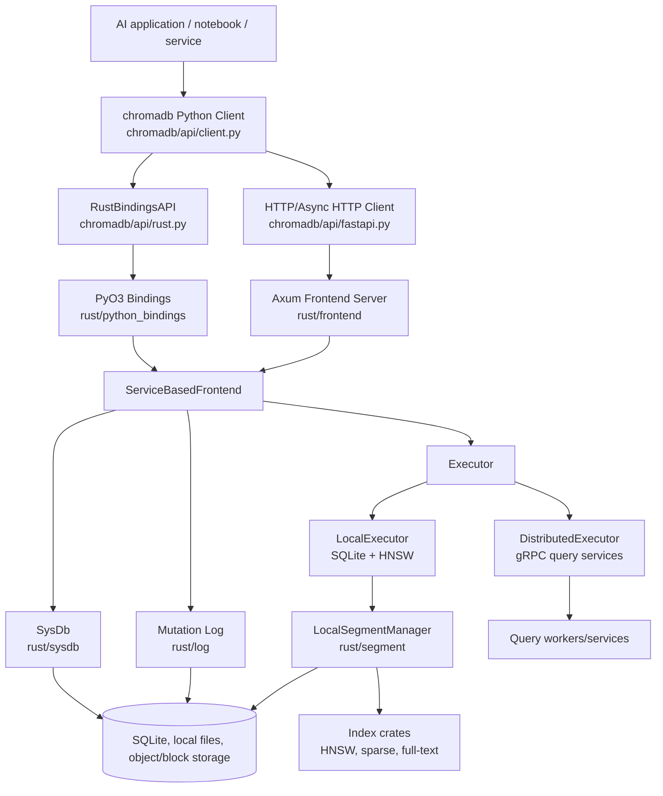
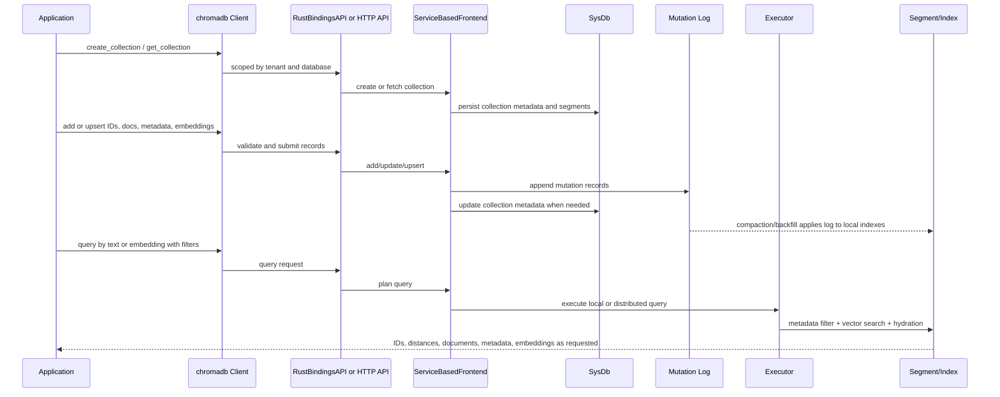
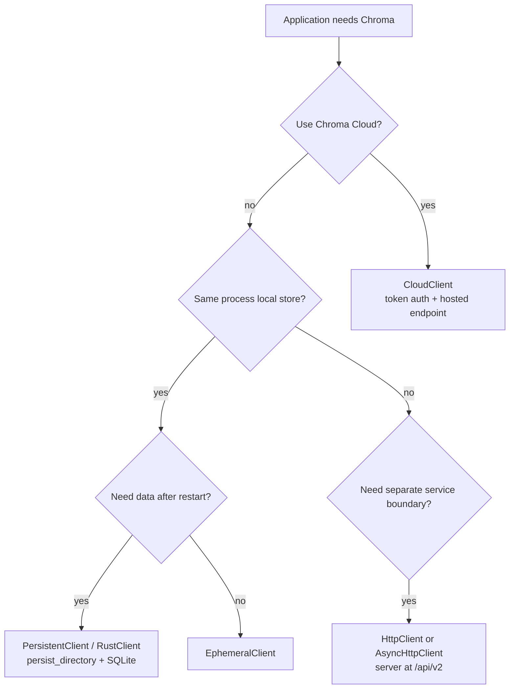
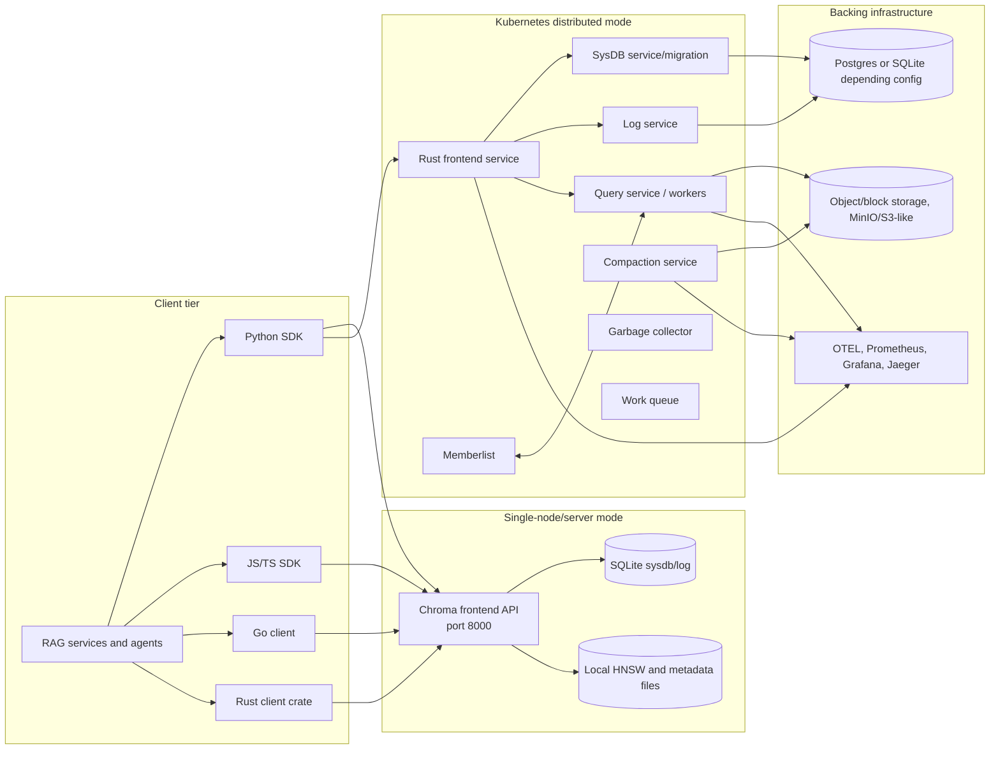
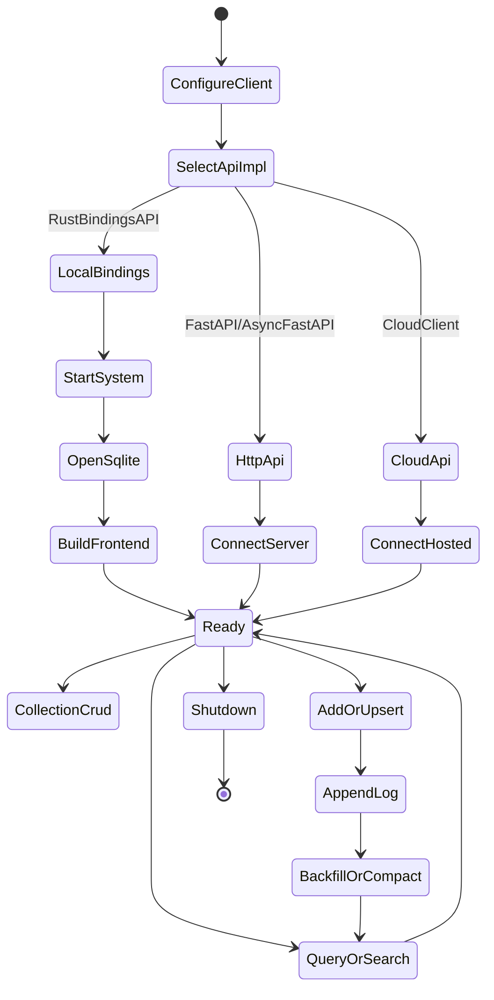
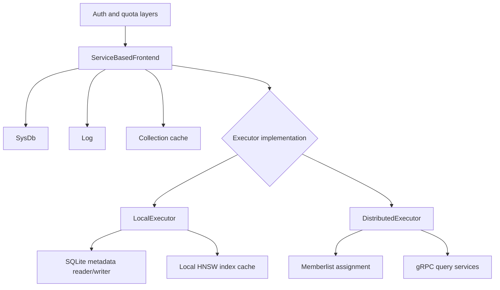
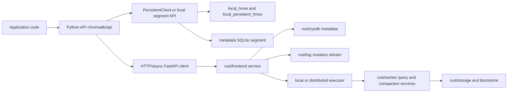
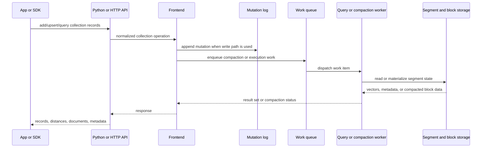
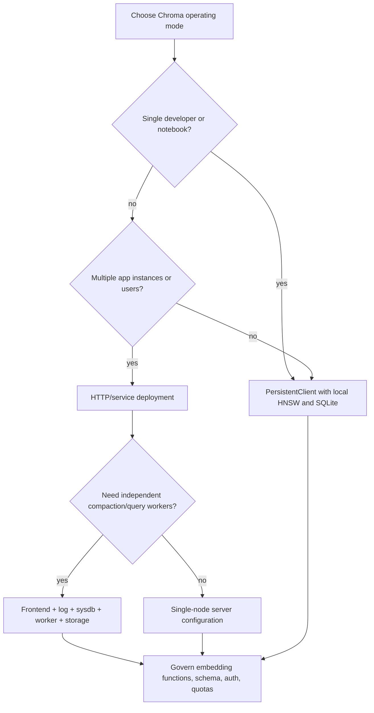

# Chroma Architecture Notes

## Source Basis

This document is based on static inspection of the local repository at `github-repos/04-rag-vector-database/chroma`. The main files and directories used were `README.md`, `DEVELOP.md`, `pyproject.toml`, `Cargo.toml`, `Dockerfile`, `docker-compose.yml`, `chromadb/__init__.py`, `chromadb/config.py`, `chromadb/api/client.py`, `chromadb/api/fastapi.py`, `chromadb/api/rust.py`, `chromadb/test`, `rust/python_bindings`, `rust/frontend`, `rust/log`, `rust/sysdb`, `rust/segment`, `rust/index`, `rust/worker`, `rust/chroma`, `clients`, `go`, `schemas`, `examples`, `deployments`, and `k8s`.

## Executive Summary

Chroma is open-source data infrastructure for AI applications. In a RAG system, it acts as the vector and retrieval data layer for documents, metadata, embeddings, filters, and search. The repository contains both a Python package (`chromadb`) and a large Rust workspace. The Python package provides the developer-facing client API, local clients, HTTP clients, cloud client helpers, configuration, auth adapters, embedding functions, and tests. The Rust workspace implements the modern storage/query core, Python native bindings, HTTP frontend, local and distributed executors, system database, log, segment management, sparse/full-text indexes, workers, and deployment-oriented services.

Architecturally, Chroma supports several operating modes:

- In-process local mode through `PersistentClient`, `EphemeralClient`, and `RustClient`, backed by Rust Python bindings, SQLite, local HNSW indexes, and local segment management.
- Client/server mode through `HttpClient`, `AsyncHttpClient`, and the Rust/Axum frontend API.
- Cloud mode through `CloudClient` and token-authenticated hosted endpoints.
- Distributed development and production-oriented modes through Kubernetes/Helm assets under `k8s`, Rust services such as frontend, worker/query, compaction, sysdb, log, and supporting infrastructure.

The codebase is especially relevant to solution architects because it is not only a vector index wrapper. It includes tenancy, database/collection metadata, embedding ingestion, log-based mutation flow, local and distributed query execution, OpenTelemetry hooks, auth configuration, deployment assets, and multiple SDK surfaces.

## Problem Solved

AI applications need a retrieval substrate that can keep vectors, source text, metadata, filters, and search behavior close to application code without forcing every team to build storage and ANN plumbing. Chroma solves that problem by providing:

- A simple Python-first API for creating collections, adding documents, and querying by text or embeddings.
- Persistent local storage for notebooks, local services, and prototypes.
- HTTP clients and server mode for application/service separation.
- Multi-tenant concepts through tenant and database objects.
- Collection-level document, metadata, embedding, and ID management.
- Dense embedding retrieval, metadata filtering, document filtering, and newer hybrid/full-text/sparse capabilities in the Rust workspace.
- Deployment artifacts for local Docker, Kubernetes, and cloud platforms.

For RAG, the main value is reducing the distance between application code and reliable retrieval. Developers can start locally with a few lines of Python and later move toward server or distributed modes when scale, governance, or operational boundaries require it.

## Role in an AI Stack

Chroma usually fits into the AI stack as follows:

- **Ingestion:** Loaders and chunkers create documents and metadata; embedding functions or external embedding services create vectors; Chroma stores IDs, documents, metadata, and embeddings in collections.
- **Retrieval:** Query services embed user questions, call `query`, `get`, or `search`, and retrieve context chunks.
- **Application memory:** Agents can store durable memories, tool outputs, or conversation artifacts as collection records.
- **Hybrid search:** The Rust workspace includes sparse and full-text index work that can complement dense vector retrieval.
- **Local-first development:** Notebooks and developer tools can use `PersistentClient` without a separate server.
- **Production service boundary:** HTTP and distributed modes allow teams to move retrieval behind a managed service endpoint.

Chroma does not own the whole RAG workflow. Chunking, prompt assembly, model calls, reranking, user authorization, and business governance remain application responsibilities unless explicitly integrated around Chroma.

## Source Tree Map

Important repository areas:

```text
chroma/
  README.md                         Product quick start and high-level API examples.
  DEVELOP.md                        Development setup, tests, distributed dev, Tilt, Kubernetes notes.
  pyproject.toml                    Python package metadata, dependencies, CLI entry point, maturin build.
  Cargo.toml                        Rust workspace and shared crate dependencies.
  Dockerfile, docker-compose.yml    Container/server runtime and local compose example.
  chromadb/
    __init__.py                     Client constructors: Ephemeral, Persistent, Rust, HTTP, Cloud.
    config.py                       Settings, component system, environment-driven implementation selection.
    api/
      client.py                     Python Client and AdminClient facade.
      fastapi.py                    HTTP client adapter for `/api/v2`.
      rust.py                       RustBindingsAPI adapter for local native storage.
    utils/embedding_functions/      Built-in embedding provider integrations.
    test/                           Python, API, auth, config, distributed, property, persistence tests.
  rust/
    python_bindings/                PyO3 bindings exposing Rust core to Python.
    frontend/                       Axum HTTP server, API routes, frontend service implementation.
    log/                            SQLite-backed mutation log implementation.
    sysdb/                          SQLite system database for tenants, DBs, collections, segments.
    segment/                        Local segment manager, metadata reader/writer, HNSW integration.
    index/                          Sparse and full-text index implementations.
    worker/                         Worker/query/compaction-related crate.
    chroma/                         Rust client crate.
    cli/                            Rust CLI entrypoint.
  k8s/                              Helm chart and test infrastructure for distributed Chroma.
  deployments/                      Cloud deployment examples for AWS, Azure, GCP, and others.
  clients/, go/, schemas/, examples/ SDKs, schemas, sample apps, integration examples.
```

## Core Concepts

### Client

The Python package exposes multiple client constructors in `chromadb/__init__.py`: `EphemeralClient`, `PersistentClient`, `RustClient`, `HttpClient`, `AsyncHttpClient`, `CloudClient`, `Client`, and `AdminClient`. These constructors primarily select settings and API implementation.

### Tenant and Database

Chroma models tenants and databases as first-class resources. The Python `Client` stores tenant and database values, validates them through `AdminClient`, and scopes collection operations accordingly.

### Collection

A collection is the user-facing container for records. It owns names, metadata, optional schema/configuration, dimension, and associated segments. Application code uses collections to add, upsert, update, delete, count, get, query, and search records.

### Record

A record can include an ID, document, metadata, embedding, and other fields depending on the operation. RAG systems commonly use one record per chunk or memory item.

### Embedding Function

Embedding functions transform text, images, or other inputs into embeddings. The repository includes provider integrations under `chromadb/utils/embedding_functions`, with support for many external and local providers.

### System and Component

`chromadb/config.py` defines a component system. `System` maps abstract component types to configured implementations, starts dependencies in order, stops them in reverse order, and stores shared settings. This is how Python-side configuration chooses local Rust bindings, HTTP clients, auth components, telemetry, and other implementation pieces.

### Rust Bindings API

`chromadb/api/rust.py` adapts `chromadb_rust_bindings.Bindings` into the Python `ServerAPI` shape. It is the local in-process path for persistent or ephemeral Chroma backed by Rust, SQLite, and local HNSW/segment state.

### System Database

`rust/sysdb` stores metadata about tenants, databases, collections, segments, dimensions, schemas, and collection configuration. The local implementation is SQLite-backed.

### Log

`rust/log` records mutation events. The inspected `sqlite_log.rs` stores records in SQLite `embeddings_queue`, supports pulling records by topic/offset, and coordinates backfill/purge messages for compaction.

### Segment

`rust/segment` manages local indexes and metadata storage. `LocalSegmentManager` caches HNSW indexes and closes file descriptors on eviction. `sqlite_metadata.rs` applies logs to metadata tables and supports filters, full-text metadata, and schema evolution.

### Executor

The frontend delegates reads and searches to an executor. `LocalExecutor` serves local SQLite/HNSW use cases. `DistributedExecutor` routes query plans to query services through memberlist and gRPC clients.

## Component and System Diagram



## Internal Architecture

### Python API Layer

The Python layer gives Chroma its simple developer experience. `chromadb/__init__.py` builds settings for each client type:

- `EphemeralClient` uses non-persistent local state.
- `PersistentClient` sets `persist_directory` and enables persistence.
- `RustClient` explicitly selects `chromadb.api.rust.RustBindingsAPI`.
- `HttpClient` and `AsyncHttpClient` select FastAPI HTTP adapters and configure host, port, SSL, and headers.
- `CloudClient` configures the hosted API endpoint, SSL, tenant/database defaults, and token authentication through `X_CHROMA_TOKEN`.

`chromadb/api/client.py` wraps a `ServerAPI` and exposes collection and admin operations. It also validates tenant and database existence during client initialization.

### Configuration and Component System

`chromadb/config.py` is the central Python configuration model. `Settings` includes API implementation selection, server host/port/SSL, persistence path, reset behavior, auth providers, telemetry controls, migration behavior, distributed service implementation choices, gRPC timeouts, and legacy-configuration validation.

The `System` class is a lightweight dependency container. Components declare dependencies, are started in topological order, and are stopped in reverse dependency order. This matters because the same Python API can point at local Rust bindings, HTTP services, or configured auth/telemetry implementations.

### Local Rust Path

The local path runs through `RustBindingsAPI` and `rust/python_bindings`. The binding constructor builds a Tokio runtime, registry, SQLite system database, SQLite log, local segment manager, local executor, compaction manager, and a `Frontend`. Persistent clients use `persist_directory/chroma.sqlite3` plus local index files. The code also sizes HNSW cache capacity against file-handle limits because each HNSW index opens multiple files.

This path is the default modern local storage route and is critical for notebooks, unit tests, desktop tools, and single-process applications.

### HTTP Frontend

`rust/frontend/src/server.rs` implements the Axum server. It registers `/api/v2` routes for health, heartbeat, preflight, version, identity, reset, tenants, databases, collections, records, query, search, and attached functions. It also exposes `/docs` and `/openapi.json`, supports CORS, body limits, JSON error conversion, tracing layers, auth, quota, metrics, and graceful shutdown on signals.

`rust/frontend/src/lib.rs` loads configuration, applies persist paths to SQLite/local segment settings, creates the frontend, builds scorecard/circuit breaker rules, and starts the server.

### Service-Based Frontend

`rust/frontend/src/impls/service_based_frontend.rs` is the main service implementation. It coordinates collection metadata through `SysDb`, appends mutations to `Log`, invalidates collection caches, emits metering events, applies retries, and delegates read/query/search execution to an executor.

### Local Executor

`rust/frontend/src/executor/local.rs` implements local count, get, and KNN query flow. It can backfill a collection by sending compaction messages, read metadata through SQLite, load embeddings through HNSW readers, and hydrate documents/metadata. Local `search` is explicitly not implemented in the inspected code, which is an important capability distinction.

### Distributed Executor

`rust/frontend/src/executor/distributed.rs` routes count, get, KNN, and search plans to distributed query services. It uses memberlist-based assignment, gRPC clients, retry policies, weighted or uniform selection, replication factor, and cache invalidation/replanning when query services return certain errors.

### Storage and Index Layer

The storage/index layer includes:

- `rust/sysdb`: tenants, databases, collections, segments, collection configuration, dimensions, schemas.
- `rust/log`: mutation log records and pull/purge/backfill behavior.
- `rust/segment`: local segment manager, HNSW cache, SQLite metadata reader/writer, compaction integration.
- `rust/index/src/sparse`: sparse retrieval using Block-Max WAND over blockfile storage.
- `rust/index/src/fulltext`: bitmap-oriented full-text candidate index.

These crates show Chroma moving toward a broad retrieval system: dense vector search, metadata filtering, sparse lexical retrieval, and full-text candidate generation.

## End-to-End Runtime Flow



### Add and Upsert Flow

Application code calls collection methods through the Python client. Depending on settings, requests go to local Rust bindings or to the HTTP API. The frontend validates collection state, appends records to the log, updates system metadata if required, and eventually materializes records into local or distributed segment/index state through compaction and execution paths.

### Query Flow

For local query, the executor reads metadata filters from SQLite, optionally reduces candidates, uses HNSW readers for vector search, then hydrates requested fields. For distributed query, the frontend creates a plan and the distributed executor selects query services by collection and shard assignment.

### Client Mode Decision Flow



## Deployment and Operations Topology



### Local Python

`README.md` shows a minimal Python flow: install `chromadb`, create a client, create a collection, add documents/metadata/IDs, and query. `PersistentClient` and `RustClient` are the core local persistent modes.

### Server Mode

The README shows `chroma run --path /chroma_db_path`. The local `docker-compose.yml` builds the Rust Docker target, persists `/data`, exposes port `8000`, and health-checks `/api/v2/heartbeat`.

### Distributed and Kubernetes

`DEVELOP.md` and `k8s/` show a distributed development story using Docker, Kubernetes, Tilt, Helm, and support services. The Helm chart under `k8s/distributed-chroma` contains templates for frontend, query, compaction, sysdb, log, work queue, garbage collector, memberlist resources, and migrations. `k8s/test` includes Prometheus, Grafana, Jaeger, MinIO, Postgres, Spanner, and OTEL collector assets for integration testing.

### Cloud and Managed Endpoints

`CloudClient` configures hosted API access, default host `api.trychroma.com`, SSL, tenant/database defaults, and token authentication. This code path is useful when the vector data plane is managed outside the application runtime.

## Module Dependency and Lifecycle Diagram





## Extension Points

Chroma extension points are primarily API, configuration, embedding, and service-implementation choices:

- Python, JavaScript/TypeScript, Go, and Rust client surfaces.
- `chromadb/utils/embedding_functions` for provider-specific embedding functions.
- `Settings` in `chromadb/config.py` for API implementation, persistence, auth, telemetry, migrations, and distributed components.
- HTTP API routes under `/api/v2` for service integrations.
- PyO3 bindings for local native storage in Python applications.
- Rust service crates for frontend, log, sysdb, segment, worker, index, and distributed query execution.
- Sparse and full-text index crates for hybrid retrieval features.
- Kubernetes Helm templates and cloud deployment examples under `k8s` and `deployments`.
- OpenTelemetry and auth hooks for platform integration.

## Integrations

The repository shows or supports several integration categories:

- **Embedding providers:** OpenAI, Cohere, VoyageAI, Ollama, Google/Gemini, Hugging Face, Jina, Mistral, Nomic, Together AI, Bedrock, Cloudflare Workers AI, OpenCLIP, and others through embedding-function modules.
- **Application frameworks:** RAG applications can call Chroma directly through Python or through HTTP from any language.
- **SDK ecosystem:** `clients`, `go`, and `rust/chroma` provide non-Python client paths.
- **Cloud infrastructure:** `deployments/aws`, `deployments/azure`, `deployments/gcp`, and Kubernetes manifests support cloud deployment experiments or reference setups.
- **Observability:** OpenTelemetry settings, tracing crates, Docker health checks, and test observability infrastructure support production monitoring designs.
- **Auth:** Client and server auth provider settings in `chromadb/config.py` allow authentication and authorization integration.

## Configuration, Deployment, and Operations

### Python Package and Build

`pyproject.toml` defines the `chromadb` package, Python `>=3.9`, runtime dependencies such as `pydantic`, `uvicorn`, `opentelemetry`, `grpcio`, `bcrypt`, `kubernetes`, `httpx`, and the `chroma` CLI entry point. The build backend is `maturin`, pointing at `rust/python_bindings/Cargo.toml`, which explains why local Python operation depends heavily on Rust native code.

### Rust Workspace

`Cargo.toml` defines a broad workspace containing API types, frontend, worker, sysdb, log, storage, segment, index, Python bindings, JavaScript bindings, CLI, and supporting crates. This is where most newer service and retrieval internals live.

### Runtime Settings

Operational settings include:

- Client API implementation selection (`chroma_api_impl`).
- Server host, port, SSL, headers, CORS, keepalive, and max body size.
- Persistence path and SQLite filename.
- Reset permissions.
- Authn/authz providers and credentials.
- Product telemetry and OpenTelemetry endpoint/headers/service name.
- Migration mode and migration hash validation.
- Distributed service implementation choices for sysdb, producer/consumer, segment manager, executor, memberlist, log service, quota, and rate limits.
- gRPC timeout controls.

### Deployment Practices

- For local development, use `PersistentClient` or `chroma run --path` with a real persistence directory.
- For Docker server mode, persist `/data` or the configured storage path outside the container lifecycle.
- For Kubernetes, treat frontend, sysdb/log, query, compaction, and worker services as separate failure domains.
- Include migrations in rollout planning; the repo contains sysdb migration templates and migration settings.
- Set OpenTelemetry values consistently across services to preserve trace correlation.
- Decide early whether tenant/database separation is operational, security-related, or just organizational.
- Validate max batch size and file-handle limits for high-ingest workloads.

## Observability, Testing, Evaluation, and Failure Modes

### Observability

Chroma includes OpenTelemetry dependencies and settings, tracing in Rust services, HTTP health/heartbeat/preflight routes, Docker health checks, and Kubernetes test infrastructure for Prometheus, Grafana, Jaeger, and OTEL collector. The Rust frontend also includes metrics counters, tracing middleware, scorecard/circuit-breaker concepts, and graceful shutdown.

Useful production signals:

- API request count, latency, and error rate by route.
- Add/upsert/query/search throughput and latency.
- Log queue depth, compaction/backfill delay, and purge behavior.
- SQLite or external database latency and lock contention.
- HNSW cache pressure, file descriptor use, and index load times.
- Distributed query service retries and error categories.
- Tenant/database/collection growth and dimension distribution.
- OpenTelemetry trace completeness across frontend, query, log, and compaction services.

### Testing

The repository has several test layers:

- `chromadb/test` for API, auth, config, persistence, property, stress, cross-version, and distributed tests.
- `chromadb/test/distributed/README.md` for distributed sanity checks.
- Rust crate tests in `rust/frontend`, `rust/log`, `rust/sysdb`, `rust/segment`, and index crates.
- `DEVELOP.md` documents pytest, Tilt, Kubernetes, distributed tests, and Rust debugging workflows.

For RAG evaluation, add workload-specific tests outside the repository defaults: retrieval recall@k, MRR/NDCG, metadata filter correctness, query latency percentiles, stale-read behavior after ingestion, and answer-quality impact after reranking.

### Failure Modes

Important failure modes:

- **Local persistence assumptions:** Ephemeral clients lose state; persistent clients need stable paths and backup policies.
- **SQLite contention:** Local mode and server mode can hit lock or latency issues under high write concurrency.
- **File descriptor pressure:** HNSW indexes use multiple files; cache sizing and OS limits matter.
- **Compaction lag:** Mutations appended to the log may not be immediately reflected in optimized segment/index state.
- **Filter/schema drift:** Metadata type changes and missing keys can affect query behavior; `sqlite_metadata.rs` includes logic for type changes and cleanup.
- **Distributed routing errors:** Query service retries, memberlist assignment, and cache invalidation are critical during scaling or node churn.
- **Feature mismatch:** Local executor support and distributed support are not identical; local `search` is not implemented in the inspected local executor.
- **Auth gaps:** Misconfigured auth providers or headers can expose collections.
- **Migration risk:** System database migrations must be planned and tested before rolling upgrades.

## Security and Governance Risks

- **API keys and tokens:** `CloudClient` and auth settings rely on tokens/headers. Keep credentials out of source control and logs.
- **Tenant isolation:** Chroma has tenant/database concepts, but application authorization must still verify that users can access requested collections and records.
- **Metadata leakage:** Documents and metadata may contain sensitive source text. Filtering and retrieval responses must respect user permissions.
- **Embedding leakage:** Embeddings can reveal semantic information. Treat vector stores as sensitive data stores.
- **Telemetry:** Product telemetry and OpenTelemetry settings must align with privacy and data residency policies.
- **Reset endpoint:** `allow_reset` and reset APIs should be disabled or tightly restricted outside test environments.
- **Cloud boundary:** When using hosted endpoints, understand where vectors, metadata, documents, and logs are stored.
- **Model/version governance:** Store embedding model names, dimensions, and versions in collection metadata or external catalogs to avoid mixing incompatible vector spaces.

## Reading Guide

Recommended reading order:

1. `README.md` for the user-facing API and product positioning.
2. `pyproject.toml` and `chromadb/__init__.py` for packaging and client modes.
3. `chromadb/config.py` for settings, component wiring, auth, telemetry, and distributed knobs.
4. `chromadb/api/client.py`, `chromadb/api/fastapi.py`, and `chromadb/api/rust.py` for Python API boundaries.
5. `rust/python_bindings/src/bindings.rs` for local persistent runtime composition.
6. `rust/frontend/src/server.rs` and `rust/frontend/src/impls/service_based_frontend.rs` for HTTP/server behavior.
7. `rust/sysdb`, `rust/log`, and `rust/segment` for metadata, mutation, and local index storage.
8. `rust/frontend/src/executor/local.rs` and `rust/frontend/src/executor/distributed.rs` for query execution behavior.
9. `rust/index/src/sparse/README.md` and `rust/index/src/fulltext/README.md` for hybrid retrieval internals.
10. `k8s`, `deployments`, and `DEVELOP.md` for distributed development and operations.

## Learning Path

1. Start with the README Python example and create one local collection.
2. Switch from ephemeral to persistent mode and inspect the generated SQLite/index files.
3. Use `HttpClient` against a local server to understand client/server boundaries.
4. Add metadata filters and document filters; test expected and unexpected metadata types.
5. Read `RustBindingsAPI` and `python_bindings` to understand local runtime composition.
6. Follow a record from add/upsert through frontend, log, compaction/backfill, segment, and query.
7. Study `LocalExecutor` and `DistributedExecutor` side by side to understand scale-out behavior.
8. Explore sparse and full-text index READMEs to understand hybrid retrieval direction.
9. Add a RAG evaluation harness with fixed queries, labeled relevant chunks, and latency budgets.
10. Review Kubernetes templates only after the local and server-mode internals are clear.

## Glossary

- **AdminClient:** Python facade for tenant and database administration.
- **Collection:** User-facing container for records, embeddings, documents, metadata, and config.
- **Compaction:** Process that materializes log records into optimized segment/index state.
- **Embedding Function:** Function or provider adapter that converts inputs into embeddings.
- **Executor:** Frontend dependency that runs count, get, KNN, or search operations locally or remotely.
- **Frontend:** Rust service layer that coordinates API requests, sysdb, log, executor, auth, quota, and metrics.
- **HNSW:** Approximate nearest-neighbor index used for vector search.
- **Log:** Mutation record stream used by ingestion and compaction paths.
- **PersistentClient:** Python local client that stores state under a configured path.
- **PyO3:** Rust/Python interop technology used by Chroma's native Python bindings.
- **Record:** Stored item with ID, document, metadata, and embedding fields.
- **Segment:** Storage/index unit for local or distributed retrieval.
- **SysDb:** System database for tenants, databases, collections, and segments.
- **Tenant:** Top-level namespace for isolating databases and collections.
- **Vector Store:** Retrieval data layer that stores embeddings and returns similar records.

## Deep-Dive Addendum: Local, Service, and Distributed Boundaries

Chroma's repository is especially useful for architects because it exposes more than one operating shape. The Python surface under `github-repos/04-rag-vector-database/chroma/chromadb/api/` supports local clients, HTTP clients, async clients, and collection models. The local index path is visible under `chromadb/segment/impl/vector/` and `chromadb/segment/impl/metadata/sqlite.py`. The Rust side separates `rust/frontend/`, `rust/worker/`, `rust/log/`, `rust/sysdb/`, `rust/blockstore/`, `rust/storage/`, and `rust/types/`. That split is the clearest source-grounded way to understand Chroma as both an embedded developer database and a service architecture.



The key design question is where responsibility for durability, indexing, and query execution sits. In local mode, the application process is close to persistence and HNSW state, which is good for simple development and small deployments but makes resource governance part of the application host. In service mode, the frontend, log, sysdb, worker, and storage layers can be reasoned about separately. The repository makes this visible through `rust/frontend/src/impls/in_memory_frontend.rs`, `rust/frontend/src/impls/service_based_frontend.rs`, `rust/frontend/src/executor/local.rs`, `rust/frontend/src/executor/distributed.rs`, and worker binaries such as `rust/worker/src/bin/query_service.rs` and `rust/worker/src/bin/compaction_service.rs`.

### Ingestion, Query, and Compaction Lifecycle



For RAG systems, the important production issue is not only whether `query()` returns similar documents. It is whether the ingestion path, metadata migrations, compaction cadence, and embedding-function configuration are all stable enough to give repeatable retrieval. Files like `chromadb/utils/embedding_functions/`, `chromadb/api/collection_configuration.py`, `chromadb/migrations/`, `rust/sqlite/migrations/`, and `rust/spanner-migrations/` show that model configuration and metadata storage are part of the architecture, not convenience details.

### Operating-Mode Decision Tree



### Production Readiness Checklist

- Decide the operating mode explicitly: local Python persistence, single-node server, or distributed service. Do not let a prototype `PersistentClient` pattern become the accidental production topology.
- Version embedding-function configuration from `chromadb/utils/embedding_functions/` and collection configuration from `chromadb/api/collection_configuration.py`; a changed provider, dimension, or sparse/dense policy changes retrieval semantics.
- Review migrations in `chromadb/migrations/`, `rust/sqlite/migrations/`, and `rust/spanner-migrations/` before upgrading a persisted deployment.
- Test query behavior with realistic metadata filters, not just vector-only similarity. The vector segment and SQLite metadata paths have different scaling risks.
- For service mode, monitor log lag, worker backlog, compaction time, sysdb latency, object-store latency, and frontend request latency.
- Keep auth, rate-limit, quota, and telemetry modules in scope during security review: `chromadb/auth/`, `chromadb/rate_limit/`, `chromadb/quota/`, and `chromadb/telemetry/`.
- Validate backup and restore by replaying a small corpus and comparing count, metadata predicates, and top-k retrieval results against a fixed evaluation set.

### Senior Architect Reading Guide

Start with `chromadb/api/client.py`, `chromadb/api/fastapi.py`, and `chromadb/api/rust.py` to see the API shapes. Then read the local storage pieces under `chromadb/segment/impl/vector/` and `chromadb/segment/impl/metadata/sqlite.py`. After that, move to `rust/frontend/src/`, then `rust/worker/src/`, then `rust/log/src/` and `rust/sysdb/src/`. This order makes the difference between embedded Chroma and service Chroma visible before diving into lower-level block storage or deployment manifests.

### Additional Glossary

- **Compaction lag:** Delay between appended mutations and materialized optimized segment state.
- **Operating mode:** The deployment shape: embedded local client, single-node service, or distributed service components.
- **SysDB migration:** Schema evolution for tenant, database, collection, and segment metadata.
- **Worker backlog:** Queued work for query execution, compaction, or maintenance that can affect freshness and latency.
