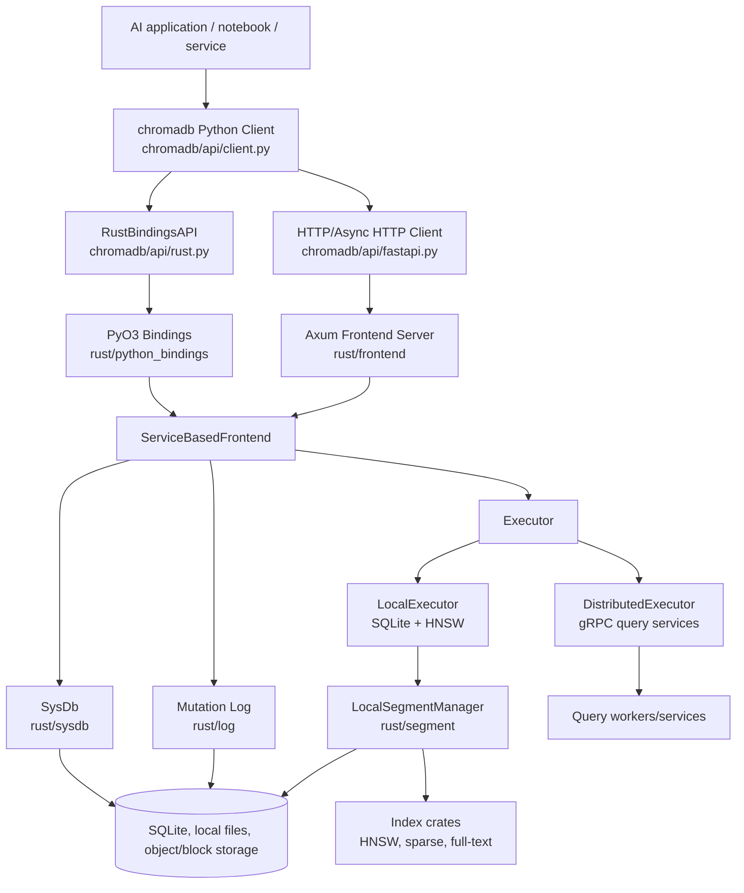
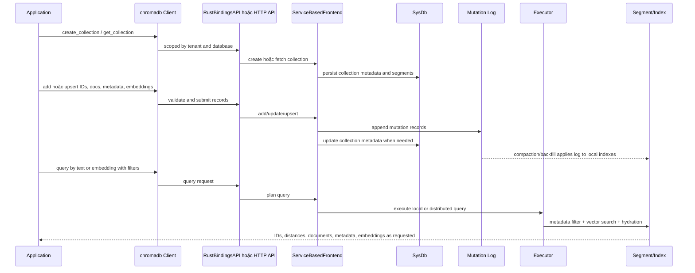
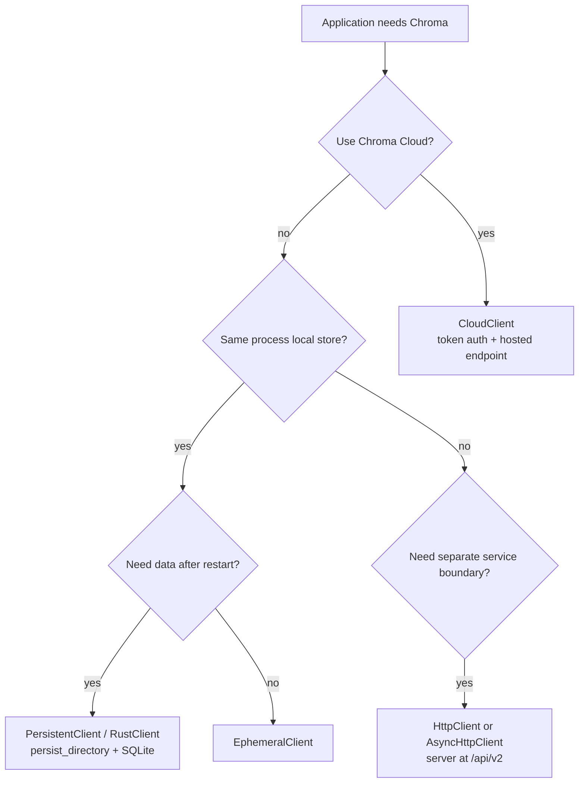
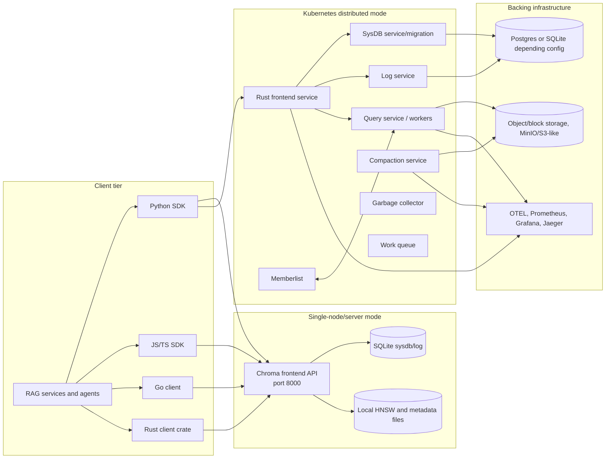
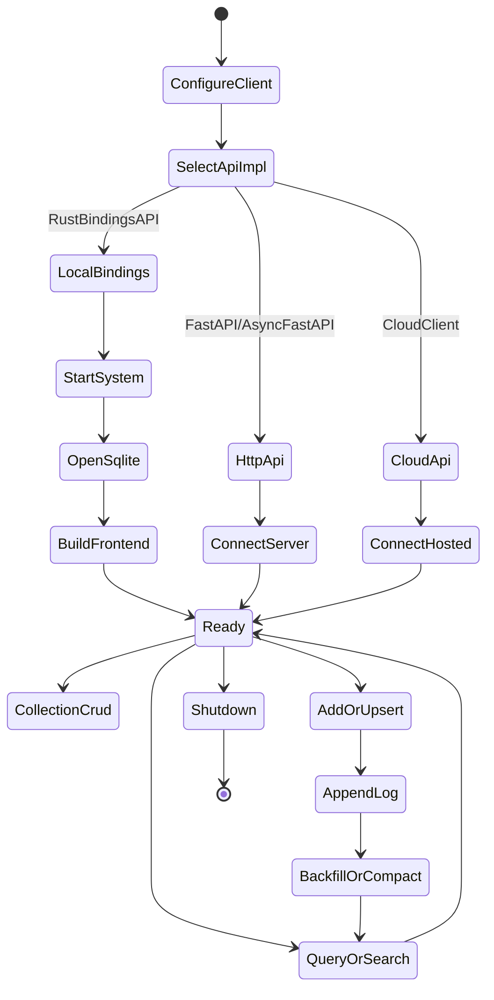
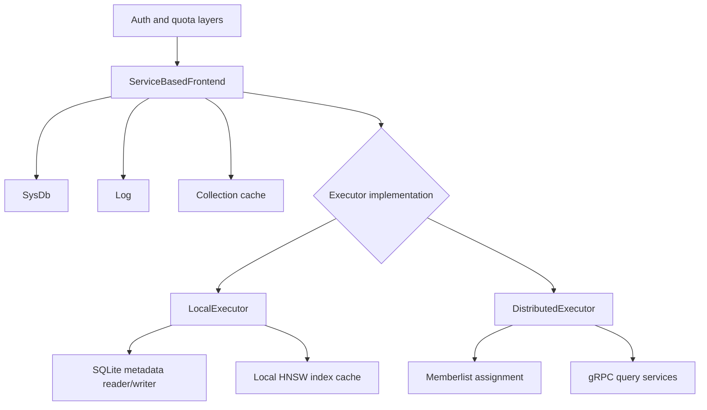
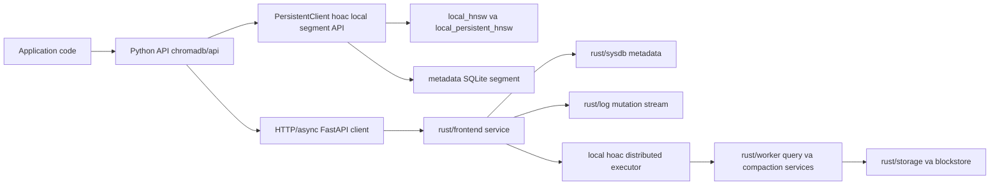
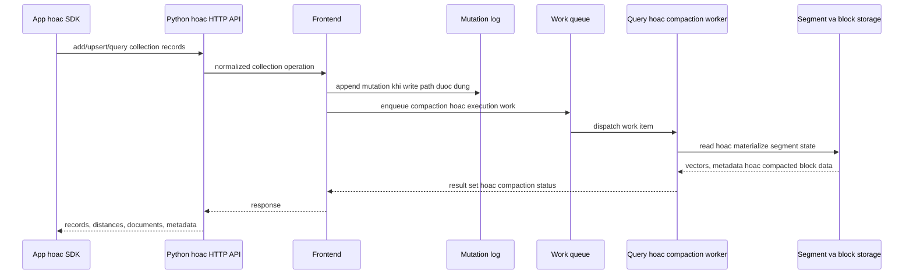
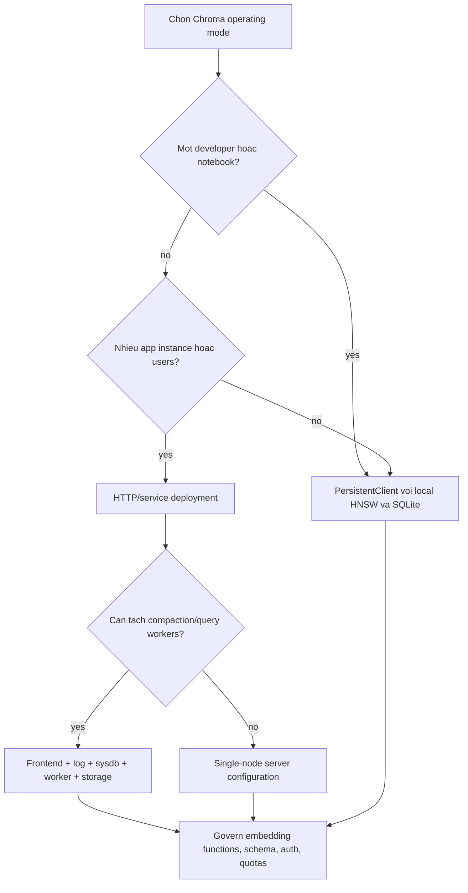

# Ghi Chú Kiến Trúc Chroma

## Cơ Sở Nguồn

Tài liệu này dựa trên việc đọc tĩnh kho mã nguồn tại `github-repos/04-rag-vector-database/chroma`. Các tệp và thư mục chính đã được đối chiếu gồm `README.md`, `DEVELOP.md`, `pyproject.toml`, `Cargo.toml`, `Dockerfile`, `docker-compose.yml`, `chromadb/__init__.py`, `chromadb/config.py`, `chromadb/api/client.py`, `chromadb/api/fastapi.py`, `chromadb/api/rust.py`, `chromadb/test`, `rust/python_bindings`, `rust/frontend`, `rust/log`, `rust/sysdb`, `rust/segment`, `rust/index`, `rust/worker`, `rust/chroma`, `clients`, `go`, `schemas`, `examples`, `deployments`, và `k8s`.

## Tóm Tắt Điều Hành

Chroma là hạ tầng dữ liệu mã nguồn mở cho ứng dụng AI. Trong hệ thống RAG, Chroma đóng vai trò tầng dữ liệu vector và retrieval cho tài liệu, metadata, embeddings, bộ lọc và tìm kiếm. Repository chứa cả package Python (`chromadb`) và một Rust workspace lớn. Package Python cung cấp API hướng lập trình viên, local client, HTTP client, cloud client, cấu hình, auth adapter, embedding functions và test. Rust workspace hiện thực lõi storage/query mới hơn, Python native bindings, HTTP frontend, local/distributed executor, system database, log, segment manager, sparse/full-text index, worker và các service phục vụ triển khai.

Về kiến trúc, Chroma hỗ trợ nhiều chế độ vận hành:

- Local in-process qua `PersistentClient`, `EphemeralClient`, và `RustClient`, dựa trên Rust Python bindings, SQLite, local HNSW index và local segment management.
- Client/server qua `HttpClient`, `AsyncHttpClient` và Rust/Axum frontend API.
- Cloud mode qua `CloudClient` và hosted endpoint có token authentication.
- Distributed development và production-oriented mode qua Kubernetes/Helm assets trong `k8s`, các Rust service như frontend, worker/query, compaction, sysdb, log và hạ tầng hỗ trợ.

Điểm quan trọng với solution architect là Chroma không chỉ bọc một vector index. Codebase có tenancy, database/collection metadata, embedding ingestion, mutation flow dựa trên log, local và distributed query execution, OpenTelemetry hooks, auth configuration, deployment assets và nhiều SDK surface.

## Bài Toán Được Giải Quyết

Ứng dụng AI cần một retrieval substrate có thể giữ vector, source text, metadata, filter và hành vi tìm kiếm gần với application code, nhưng không buộc mỗi nhóm tự xây storage và ANN plumbing. Chroma giải quyết bằng cách cung cấp:

- API Python đơn giản để tạo collection, thêm document và query theo text hoặc embedding.
- Persistent local storage cho notebook, local service và prototype.
- HTTP client và server mode để tách boundary giữa ứng dụng và service.
- Khái niệm multi-tenant thông qua tenant và database.
- Quản lý document, metadata, embedding và ID ở cấp collection.
- Dense embedding retrieval, metadata filtering, document filtering, và các năng lực hybrid/full-text/sparse mới hơn trong Rust workspace.
- Deployment artifacts cho local Docker, Kubernetes và các nền tảng cloud.

Trong RAG, giá trị chính là rút ngắn khoảng cách giữa application code và retrieval đáng tin cậy. Developer có thể bắt đầu local bằng vài dòng Python, rồi chuyển dần sang server hoặc distributed mode khi cần scale, governance hoặc boundary vận hành rõ hơn.

## Vai Trò Trong AI Stack

Chroma thường nằm trong AI stack như sau:

- **Ingestion:** Loader và chunker tạo documents và metadata; embedding function hoặc embedding service bên ngoài tạo vectors; Chroma lưu IDs, documents, metadata và embeddings vào collection.
- **Retrieval:** Query service embed câu hỏi người dùng, gọi `query`, `get` hoặc `search`, rồi lấy context chunks.
- **Application memory:** Agent có thể lưu memories bền vững, tool outputs hoặc conversation artifacts như collection records.
- **Hybrid search:** Rust workspace có các phần sparse và full-text index để bổ sung dense vector retrieval.
- **Local-first development:** Notebook và developer tool có thể dùng `PersistentClient` mà không cần server riêng.
- **Production service boundary:** HTTP và distributed mode cho phép đưa retrieval ra sau một managed service endpoint.

Chroma không sở hữu toàn bộ RAG workflow. Chunking, prompt assembly, model call, reranking, user authorization và business governance vẫn là trách nhiệm của ứng dụng nếu không được tích hợp riêng xung quanh Chroma.

## Bản Đồ Source Tree

Các khu vực quan trọng trong repo:

```text
chroma/
  README.md                         Quick start và ví dụ API cấp cao.
  DEVELOP.md                        Setup dev, tests, distributed dev, Tilt, Kubernetes notes.
  pyproject.toml                    Metadata package Python, dependencies, CLI, maturin build.
  Cargo.toml                        Rust workspace và shared crate dependencies.
  Dockerfile, docker-compose.yml    Runtime container/server và ví dụ compose local.
  chromadb/
    __init__.py                     Client constructors: Ephemeral, Persistent, Rust, HTTP, Cloud.
    config.py                       Settings, component system, chọn implementation bằng environment.
    api/
      client.py                     Python Client và AdminClient facade.
      fastapi.py                    HTTP client adapter cho `/api/v2`.
      rust.py                       RustBindingsAPI adapter cho local native storage.
    utils/embedding_functions/      Tích hợp embedding provider có sẵn.
    test/                           Python, API, auth, config, distributed, property, persistence tests.
  rust/
    python_bindings/                PyO3 bindings expose Rust core cho Python.
    frontend/                       Axum HTTP server, API routes, frontend service implementation.
    log/                            Mutation log dựa trên SQLite.
    sysdb/                          SQLite system database cho tenants, DBs, collections, segments.
    segment/                        Local segment manager, metadata reader/writer, HNSW integration.
    index/                          Sparse và full-text index implementations.
    worker/                         Crate liên quan worker/query/compaction.
    chroma/                         Rust client crate.
    cli/                            Rust CLI entrypoint.
  k8s/                              Helm chart và test infrastructure cho distributed Chroma.
  deployments/                      Ví dụ triển khai cloud cho AWS, Azure, GCP và nền tảng khác.
  clients/, go/, schemas/, examples/ SDKs, schemas, sample apps, integration examples.
```

## Khái Niệm Cốt Lõi

### Client

Package Python expose nhiều constructor trong `chromadb/__init__.py`: `EphemeralClient`, `PersistentClient`, `RustClient`, `HttpClient`, `AsyncHttpClient`, `CloudClient`, `Client` và `AdminClient`. Các constructor này chủ yếu chọn settings và API implementation.

### Tenant và Database

Chroma mô hình hóa tenant và database như tài nguyên cấp một. Python `Client` giữ tenant/database, validate chúng thông qua `AdminClient`, và scope collection operations theo các giá trị này.

### Collection

Collection là container hướng người dùng cho records. Nó có name, metadata, schema/configuration tùy chọn, dimension và các segment liên quan. Application code dùng collection để add, upsert, update, delete, count, get, query và search records.

### Record

Record có thể gồm ID, document, metadata, embedding và các trường khác tùy operation. Trong RAG, một record thường tương ứng với một chunk hoặc memory item.

### Embedding Function

Embedding function biến text, image hoặc input khác thành embedding. Repository có nhiều provider integration trong `chromadb/utils/embedding_functions`.

### System và Component

`chromadb/config.py` định nghĩa component system. `System` map abstract component types sang implementation được cấu hình, start dependencies theo thứ tự topo, stop theo thứ tự ngược, và lưu shared settings. Nhờ đó cùng một Python API có thể trỏ tới local Rust bindings, HTTP service, hoặc auth/telemetry implementation đã cấu hình.

### Rust Bindings API

`chromadb/api/rust.py` chuyển `chromadb_rust_bindings.Bindings` sang hình dạng Python `ServerAPI`. Đây là đường local in-process cho Chroma persistent hoặc ephemeral, dựa trên Rust, SQLite và local HNSW/segment state.

### System Database

`rust/sysdb` lưu metadata về tenants, databases, collections, segments, dimensions, schemas và collection configuration. Implementation local dùng SQLite.

### Log

`rust/log` ghi mutation events. Tệp `sqlite_log.rs` được đọc cho thấy records được lưu trong SQLite `embeddings_queue`, hỗ trợ pull theo topic/offset, và phối hợp backfill/purge message cho compaction.

### Segment

`rust/segment` quản lý local indexes và metadata storage. `LocalSegmentManager` cache HNSW indexes và đóng file descriptors khi eviction. `sqlite_metadata.rs` áp dụng log vào metadata tables và hỗ trợ filter, full-text metadata, schema evolution.

### Executor

Frontend ủy quyền read/search cho executor. `LocalExecutor` phục vụ use case local SQLite/HNSW. `DistributedExecutor` route query plan tới query services qua memberlist và gRPC clients.

## Sơ Đồ Component và Hệ Thống



## Kiến Trúc Nội Bộ

### Tầng Python API

Tầng Python tạo trải nghiệm developer đơn giản của Chroma. `chromadb/__init__.py` xây settings cho từng client type:

- `EphemeralClient` dùng state local không persistent.
- `PersistentClient` đặt `persist_directory` và bật persistence.
- `RustClient` chọn rõ `chromadb.api.rust.RustBindingsAPI`.
- `HttpClient` và `AsyncHttpClient` chọn FastAPI HTTP adapters và cấu hình host, port, SSL, headers.
- `CloudClient` cấu hình hosted API endpoint, SSL, tenant/database mặc định, và token authentication qua `X_CHROMA_TOKEN`.

`chromadb/api/client.py` bọc một `ServerAPI` và expose collection/admin operations. Nó cũng validate tenant và database khi khởi tạo client.

### Configuration và Component System

`chromadb/config.py` là mô hình cấu hình trung tâm của Python. `Settings` gồm lựa chọn API implementation, server host/port/SSL, persistence path, reset behavior, auth providers, telemetry controls, migration behavior, lựa chọn distributed service implementation, gRPC timeouts và legacy-configuration validation.

`System` là dependency container nhẹ. Components khai báo dependencies, được start theo thứ tự topo và stop theo thứ tự ngược. Điều này quan trọng vì cùng Python API có thể chạy qua local Rust bindings, HTTP services, hoặc auth/telemetry implementation đã cấu hình.

### Đường Local Rust

Đường local đi qua `RustBindingsAPI` và `rust/python_bindings`. Binding constructor xây Tokio runtime, registry, SQLite system database, SQLite log, local segment manager, local executor, compaction manager và `Frontend`. Persistent client dùng `persist_directory/chroma.sqlite3` cùng các file index local. Code cũng tính HNSW cache capacity theo file-handle limits vì mỗi HNSW index mở nhiều file.

Đây là đường local storage hiện đại mặc định, quan trọng với notebook, unit test, desktop tool và ứng dụng single-process.

### HTTP Frontend

`rust/frontend/src/server.rs` hiện thực Axum server. Nó đăng ký route `/api/v2` cho health, heartbeat, preflight, version, identity, reset, tenants, databases, collections, records, query, search và attached functions. Nó cũng expose `/docs` và `/openapi.json`, hỗ trợ CORS, body limits, JSON error conversion, tracing layers, auth, quota, metrics và graceful shutdown khi có signal.

`rust/frontend/src/lib.rs` load cấu hình, áp dụng persist path vào SQLite/local segment settings, tạo frontend, xây scorecard/circuit breaker rules và start server.

### Service-Based Frontend

`rust/frontend/src/impls/service_based_frontend.rs` là implementation service chính. Nó điều phối collection metadata qua `SysDb`, append mutation vào `Log`, invalidate collection cache, emit metering events, áp dụng retry và ủy quyền read/query/search execution cho executor.

### Local Executor

`rust/frontend/src/executor/local.rs` hiện thực count, get và KNN query local. Nó có thể backfill collection bằng compaction messages, đọc metadata qua SQLite, load embeddings qua HNSW readers và hydrate documents/metadata. Local `search` chưa được hiện thực trong code đã đọc, đây là điểm khác biệt năng lực cần lưu ý.

### Distributed Executor

`rust/frontend/src/executor/distributed.rs` route count, get, KNN và search plans tới distributed query services. Nó dùng assignment dựa trên memberlist, gRPC clients, retry policies, weighted/uniform selection, replication factor và cache invalidation/replanning khi query service trả về một số lỗi.

### Tầng Storage và Index

Tầng storage/index gồm:

- `rust/sysdb`: tenants, databases, collections, segments, collection configuration, dimensions, schemas.
- `rust/log`: mutation log records và pull/purge/backfill behavior.
- `rust/segment`: local segment manager, HNSW cache, SQLite metadata reader/writer, compaction integration.
- `rust/index/src/sparse`: sparse retrieval dùng Block-Max WAND trên blockfile storage.
- `rust/index/src/fulltext`: bitmap-oriented full-text candidate index.

Các crate này cho thấy Chroma đang là hệ retrieval rộng hơn: dense vector search, metadata filtering, sparse lexical retrieval và full-text candidate generation.

## Luồng Runtime Đầu Cuối



### Luồng Add và Upsert

Application code gọi collection methods qua Python client. Tùy settings, request đi tới local Rust bindings hoặc HTTP API. Frontend validate collection state, append record vào log, cập nhật system metadata khi cần và cuối cùng materialize record vào segment/index state local hoặc distributed thông qua compaction và execution paths.

### Luồng Query

Với query local, executor đọc metadata filters từ SQLite, có thể giảm candidate set, dùng HNSW readers cho vector search, rồi hydrate các trường được yêu cầu. Với query distributed, frontend tạo plan và distributed executor chọn query services theo collection và shard assignment.

### Luồng Quyết Định Client Mode



## Topology Triển Khai và Vận Hành



### Local Python

`README.md` đưa ví dụ Python tối thiểu: install `chromadb`, tạo client, tạo collection, add documents/metadata/IDs và query. `PersistentClient` và `RustClient` là hai đường local persistent quan trọng.

### Server Mode

README cho thấy `chroma run --path /chroma_db_path`. `docker-compose.yml` local build Rust Docker target, persist `/data`, expose port `8000`, và health-check `/api/v2/heartbeat`.

### Distributed và Kubernetes

`DEVELOP.md` và `k8s/` cho thấy luồng distributed development dùng Docker, Kubernetes, Tilt, Helm và support services. Helm chart trong `k8s/distributed-chroma` có templates cho frontend, query, compaction, sysdb, log, work queue, garbage collector, memberlist resources và migrations. `k8s/test` có Prometheus, Grafana, Jaeger, MinIO, Postgres, Spanner và OTEL collector cho integration testing.

### Cloud và Managed Endpoints

`CloudClient` cấu hình hosted API access, default host `api.trychroma.com`, SSL, tenant/database mặc định và token authentication. Đường này phù hợp khi vector data plane được quản lý ngoài application runtime.

## Sơ Đồ Module Dependency và Lifecycle





## Điểm Mở Rộng

Các điểm mở rộng của Chroma chủ yếu nằm ở API, cấu hình, embedding và lựa chọn implementation/service:

- Python, JavaScript/TypeScript, Go và Rust client surfaces.
- `chromadb/utils/embedding_functions` cho provider-specific embedding functions.
- `Settings` trong `chromadb/config.py` cho API implementation, persistence, auth, telemetry, migrations và distributed components.
- HTTP API routes dưới `/api/v2` cho service integrations.
- PyO3 bindings cho local native storage trong Python applications.
- Rust service crates cho frontend, log, sysdb, segment, worker, index và distributed query execution.
- Sparse và full-text index crates cho hybrid retrieval features.
- Kubernetes Helm templates và cloud deployment examples trong `k8s` và `deployments`.
- OpenTelemetry và auth hooks cho platform integration.

## Tích Hợp

Repository cho thấy hoặc hỗ trợ nhiều nhóm tích hợp:

- **Embedding providers:** OpenAI, Cohere, VoyageAI, Ollama, Google/Gemini, Hugging Face, Jina, Mistral, Nomic, Together AI, Bedrock, Cloudflare Workers AI, OpenCLIP và nhiều provider khác qua embedding-function modules.
- **Application frameworks:** Ứng dụng RAG có thể gọi Chroma trực tiếp bằng Python hoặc qua HTTP từ bất kỳ ngôn ngữ nào.
- **SDK ecosystem:** `clients`, `go` và `rust/chroma` cung cấp đường client không phải Python.
- **Cloud infrastructure:** `deployments/aws`, `deployments/azure`, `deployments/gcp` và Kubernetes manifests hỗ trợ triển khai cloud thử nghiệm hoặc tham chiếu.
- **Observability:** OpenTelemetry settings, tracing crates, Docker health checks và test observability infrastructure hỗ trợ thiết kế monitoring production.
- **Auth:** Client/server auth provider settings trong `chromadb/config.py` cho phép tích hợp authentication và authorization.

## Cấu Hình, Triển Khai, Vận Hành

### Python Package và Build

`pyproject.toml` định nghĩa package `chromadb`, Python `>=3.9`, runtime dependencies như `pydantic`, `uvicorn`, `opentelemetry`, `grpcio`, `bcrypt`, `kubernetes`, `httpx` và entry point CLI `chroma`. Build backend là `maturin`, trỏ tới `rust/python_bindings/Cargo.toml`, giải thích vì sao local Python operation phụ thuộc nhiều vào Rust native code.

### Rust Workspace

`Cargo.toml` định nghĩa workspace rộng gồm API types, frontend, worker, sysdb, log, storage, segment, index, Python bindings, JavaScript bindings, CLI và các crate hỗ trợ. Phần lớn service và retrieval internals mới hơn nằm ở đây.

### Runtime Settings

Các thiết lập vận hành gồm:

- Chọn client API implementation (`chroma_api_impl`).
- Server host, port, SSL, headers, CORS, keepalive và max body size.
- Persistence path và SQLite filename.
- Quyền reset.
- Authn/authz providers và credentials.
- Product telemetry và OpenTelemetry endpoint/headers/service name.
- Migration mode và migration hash validation.
- Lựa chọn distributed service implementation cho sysdb, producer/consumer, segment manager, executor, memberlist, log service, quota và rate limits.
- gRPC timeout controls.

### Thực Hành Triển Khai

- Với local development, dùng `PersistentClient` hoặc `chroma run --path` với persistence directory thật.
- Với Docker server mode, persist `/data` hoặc storage path đã cấu hình ngoài vòng đời container.
- Với Kubernetes, xem frontend, sysdb/log, query, compaction và worker services là các failure domain riêng.
- Đưa migrations vào kế hoạch rollout; repo có sysdb migration templates và migration settings.
- Đặt OpenTelemetry values nhất quán giữa services để giữ trace correlation.
- Quyết định sớm tenant/database separation là để vận hành, bảo mật hay chỉ tổ chức.
- Validate max batch size và file-handle limits cho workload ingest cao.

## Observability, Testing, Evaluation và Failure Modes

### Observability

Chroma có OpenTelemetry dependencies/settings, tracing trong Rust services, HTTP health/heartbeat/preflight routes, Docker health checks và Kubernetes test infrastructure cho Prometheus, Grafana, Jaeger và OTEL collector. Rust frontend cũng có metrics counters, tracing middleware, scorecard/circuit-breaker concepts và graceful shutdown.

Các tín hiệu production nên theo dõi:

- API request count, latency và error rate theo route.
- Add/upsert/query/search throughput và latency.
- Log queue depth, compaction/backfill delay và purge behavior.
- SQLite hoặc external database latency và lock contention.
- HNSW cache pressure, file descriptor use và index load times.
- Distributed query service retries và error categories.
- Tăng trưởng tenant/database/collection và phân bố dimension.
- Độ đầy đủ của OpenTelemetry trace giữa frontend, query, log và compaction services.

### Testing

Repository có nhiều tầng test:

- `chromadb/test` cho API, auth, config, persistence, property, stress, cross-version và distributed tests.
- `chromadb/test/distributed/README.md` cho distributed sanity checks.
- Rust crate tests trong `rust/frontend`, `rust/log`, `rust/sysdb`, `rust/segment` và index crates.
- `DEVELOP.md` mô tả pytest, Tilt, Kubernetes, distributed tests và Rust debugging workflows.

Với RAG evaluation, nên thêm test theo workload ngoài repository defaults: retrieval recall@k, MRR/NDCG, metadata filter correctness, query latency percentiles, stale-read behavior sau ingestion và tác động đến answer quality sau reranking.

### Failure Modes

Các failure modes quan trọng:

- **Giả định persistence local:** Ephemeral client mất state; persistent client cần path ổn định và backup policy.
- **SQLite contention:** Local mode và server mode có thể gặp lock hoặc latency khi write concurrency cao.
- **Áp lực file descriptor:** HNSW indexes dùng nhiều file; cache sizing và OS limits quan trọng.
- **Compaction lag:** Mutation được append vào log có thể chưa xuất hiện ngay trong segment/index tối ưu.
- **Filter/schema drift:** Metadata type changes và missing keys ảnh hưởng query behavior; `sqlite_metadata.rs` có logic xử lý type changes và cleanup.
- **Distributed routing errors:** Query service retries, memberlist assignment và cache invalidation rất quan trọng khi scale hoặc node churn.
- **Feature mismatch:** Local executor và distributed support không hoàn toàn giống nhau; local `search` chưa được hiện thực trong local executor đã đọc.
- **Auth gaps:** Auth provider hoặc header sai cấu hình có thể làm lộ collection.
- **Migration risk:** System database migrations cần được lập kế hoạch và test trước rolling upgrade.

## Rủi Ro Bảo Mật và Governance

- **API keys và tokens:** `CloudClient` và auth settings dựa trên tokens/headers. Không đưa credentials vào source control hoặc logs.
- **Tenant isolation:** Chroma có tenant/database concepts, nhưng application authorization vẫn phải xác minh user được quyền truy cập collection và record.
- **Metadata leakage:** Documents và metadata có thể chứa source text nhạy cảm. Filter và response retrieval phải tôn trọng quyền người dùng.
- **Embedding leakage:** Embeddings có thể tiết lộ thông tin semantic. Hãy xem vector store là sensitive data store.
- **Telemetry:** Product telemetry và OpenTelemetry settings phải phù hợp privacy và data residency policies.
- **Reset endpoint:** `allow_reset` và reset APIs nên bị tắt hoặc giới hạn chặt ngoài test environment.
- **Cloud boundary:** Khi dùng hosted endpoints, cần hiểu vectors, metadata, documents và logs được lưu ở đâu.
- **Model/version governance:** Lưu embedding model name, dimension và version trong collection metadata hoặc external catalog để tránh trộn vector spaces không tương thích.

## Hướng Dẫn Đọc Mã Nguồn

Thứ tự đọc đề xuất:

1. `README.md` để hiểu API hướng người dùng và định vị sản phẩm.
2. `pyproject.toml` và `chromadb/__init__.py` để hiểu packaging và client modes.
3. `chromadb/config.py` để hiểu settings, component wiring, auth, telemetry và distributed knobs.
4. `chromadb/api/client.py`, `chromadb/api/fastapi.py` và `chromadb/api/rust.py` để hiểu boundary Python API.
5. `rust/python_bindings/src/bindings.rs` để hiểu local persistent runtime composition.
6. `rust/frontend/src/server.rs` và `rust/frontend/src/impls/service_based_frontend.rs` để hiểu HTTP/server behavior.
7. `rust/sysdb`, `rust/log` và `rust/segment` để hiểu metadata, mutation và local index storage.
8. `rust/frontend/src/executor/local.rs` và `rust/frontend/src/executor/distributed.rs` để hiểu query execution behavior.
9. `rust/index/src/sparse/README.md` và `rust/index/src/fulltext/README.md` để hiểu hybrid retrieval internals.
10. `k8s`, `deployments` và `DEVELOP.md` cho distributed development và operations.

## Lộ Trình Học

1. Bắt đầu với ví dụ Python trong README và tạo một local collection.
2. Chuyển từ ephemeral sang persistent mode và xem các file SQLite/index được tạo.
3. Dùng `HttpClient` với local server để hiểu client/server boundary.
4. Thêm metadata filters và document filters; test các metadata type mong đợi và không mong đợi.
5. Đọc `RustBindingsAPI` và `python_bindings` để hiểu local runtime composition.
6. Lần theo một record từ add/upsert qua frontend, log, compaction/backfill, segment và query.
7. So sánh `LocalExecutor` và `DistributedExecutor` để hiểu scale-out behavior.
8. Đọc README của sparse và full-text index để hiểu hướng hybrid retrieval.
9. Thêm RAG evaluation harness với fixed queries, labeled relevant chunks và latency budgets.
10. Chỉ review Kubernetes templates sau khi đã rõ local và server-mode internals.

## Bảng Thuật Ngữ

- **AdminClient:** Facade Python cho quản trị tenant và database.
- **Collection:** Container hướng người dùng cho records, embeddings, documents, metadata và config.
- **Compaction:** Quá trình materialize log records vào segment/index state tối ưu.
- **Embedding Function:** Hàm hoặc provider adapter biến input thành embedding.
- **Executor:** Dependency của frontend chạy count, get, KNN hoặc search local/remote.
- **Frontend:** Tầng service Rust điều phối API request, sysdb, log, executor, auth, quota và metrics.
- **HNSW:** Approximate nearest-neighbor index dùng cho vector search.
- **Log:** Luồng mutation record dùng bởi ingestion và compaction paths.
- **PersistentClient:** Local Python client lưu state dưới path đã cấu hình.
- **PyO3:** Công nghệ interop Rust/Python dùng cho native Python bindings của Chroma.
- **Record:** Item được lưu với ID, document, metadata và embedding fields.
- **Segment:** Đơn vị storage/index cho retrieval local hoặc distributed.
- **SysDb:** System database cho tenants, databases, collections và segments.
- **Tenant:** Namespace cấp cao để tách databases và collections.
- **Vector Store:** Tầng dữ liệu retrieval lưu embeddings và trả về records tương tự.

## Phụ Lục Deep-Dive: Ranh Giới Local, Service và Distributed

Repository Chroma rất hữu ích cho kiến trúc sư vì nó cho thấy nhiều hình dạng vận hành khác nhau. Bề mặt Python trong `github-repos/04-rag-vector-database/chroma/chromadb/api/` hỗ trợ local client, HTTP client, async client và collection models. Đường index local nằm ở `chromadb/segment/impl/vector/` và `chromadb/segment/impl/metadata/sqlite.py`. Phía Rust tách `rust/frontend/`, `rust/worker/`, `rust/log/`, `rust/sysdb/`, `rust/blockstore/`, `rust/storage/` và `rust/types/`. Ranh giới này là cơ sở source-grounded rõ nhất để hiểu Chroma vừa là database nhúng cho developer, vừa là service architecture.



Câu hỏi thiết kế quan trọng là trách nhiệm durability, indexing và query execution nằm ở đâu. Ở local mode, process ứng dụng rất gần persistence và HNSW state; điều này tốt cho notebook, thử nghiệm và deployment nhỏ, nhưng biến quản trị tài nguyên thành trách nhiệm của host ứng dụng. Ở service mode, frontend, log, sysdb, worker và storage có thể được phân tích riêng. Repository thể hiện điều này qua `rust/frontend/src/impls/in_memory_frontend.rs`, `rust/frontend/src/impls/service_based_frontend.rs`, `rust/frontend/src/executor/local.rs`, `rust/frontend/src/executor/distributed.rs`, cùng các worker binaries như `rust/worker/src/bin/query_service.rs` và `rust/worker/src/bin/compaction_service.rs`.

### Vòng Đời Ingestion, Query và Compaction



Với hệ thống RAG, vấn đề production không chỉ là `query()` trả về tài liệu tương tự. Câu hỏi lớn hơn là ingestion path, metadata migrations, nhịp compaction và cấu hình embedding function có đủ ổn định để retrieval lặp lại được hay không. Các file như `chromadb/utils/embedding_functions/`, `chromadb/api/collection_configuration.py`, `chromadb/migrations/`, `rust/sqlite/migrations/` và `rust/spanner-migrations/` cho thấy model configuration và metadata storage là một phần kiến trúc, không phải chi tiết tiện ích.

### Cây Quyết Định Operating Mode



### Checklist Sẵn Sàng Production

- Chọn operating mode rõ ràng: local Python persistence, single-node server hoặc distributed service. Đừng để pattern `PersistentClient` từ prototype trở thành topology production ngoài ý muốn.
- Version cấu hình embedding function từ `chromadb/utils/embedding_functions/` và collection configuration từ `chromadb/api/collection_configuration.py`; provider, dimension hoặc sparse/dense policy thay đổi sẽ đổi semantics retrieval.
- Review migrations trong `chromadb/migrations/`, `rust/sqlite/migrations/` và `rust/spanner-migrations/` trước khi upgrade deployment có dữ liệu persist.
- Test query với metadata filter thực tế, không chỉ vector-only similarity. Vector segment và SQLite metadata path có rủi ro scale khác nhau.
- Với service mode, monitor log lag, worker backlog, compaction time, sysdb latency, object-store latency và frontend request latency.
- Đưa auth, rate-limit, quota và telemetry vào security review: `chromadb/auth/`, `chromadb/rate_limit/`, `chromadb/quota/` và `chromadb/telemetry/`.
- Validate backup và restore bằng cách replay một corpus nhỏ rồi so count, metadata predicates và top-k retrieval results với evaluation set cố định.

### Hướng Dẫn Đọc Cho Senior Architect

Bắt đầu với `chromadb/api/client.py`, `chromadb/api/fastapi.py` và `chromadb/api/rust.py` để thấy các API shape. Sau đó đọc local storage trong `chromadb/segment/impl/vector/` và `chromadb/segment/impl/metadata/sqlite.py`. Tiếp theo chuyển sang `rust/frontend/src/`, rồi `rust/worker/src/`, rồi `rust/log/src/` và `rust/sysdb/src/`. Thứ tự này làm rõ khác biệt giữa embedded Chroma và service Chroma trước khi đi sâu vào block storage hoặc deployment manifests.

### Bổ Sung Thuật Ngữ

- **Compaction lag:** Độ trễ giữa mutation đã append và segment state tối ưu đã materialize.
- **Operating mode:** Hình dạng deployment: embedded local client, single-node service hoặc distributed service components.
- **SysDB migration:** Tiến hóa schema cho metadata tenant, database, collection và segment.
- **Worker backlog:** Work đang queue cho query execution, compaction hoặc maintenance, có thể ảnh hưởng freshness và latency.
