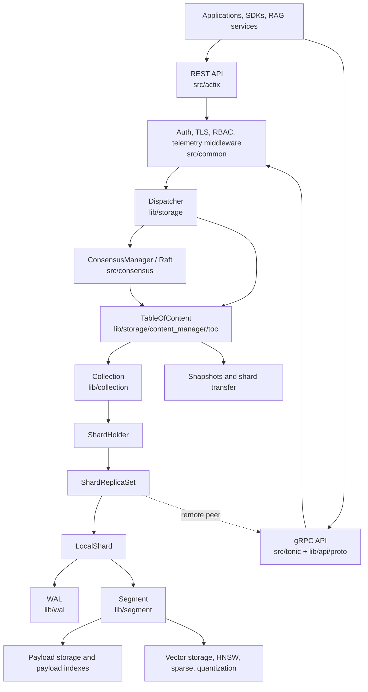
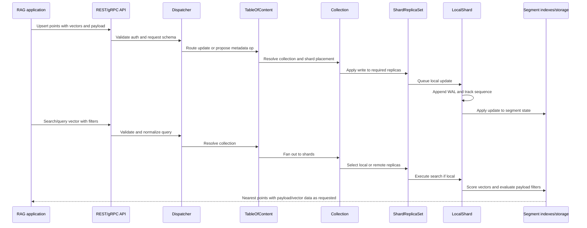
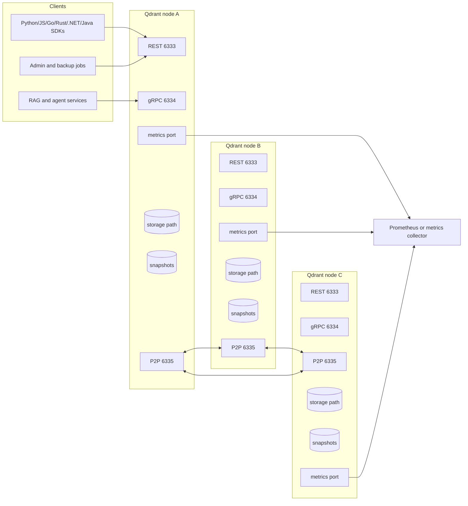
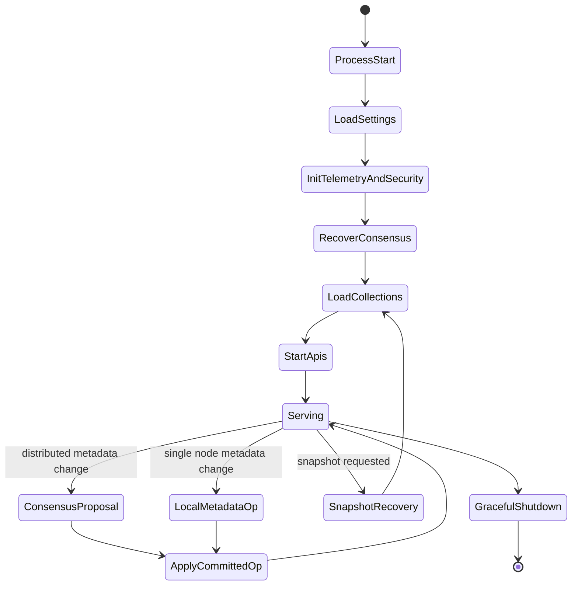
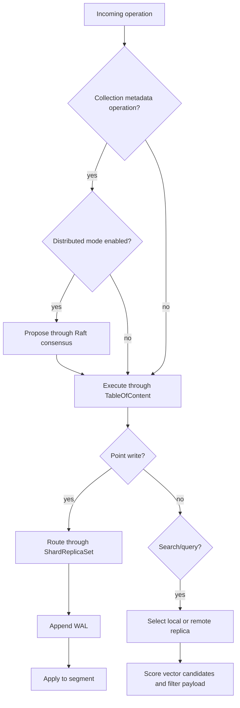
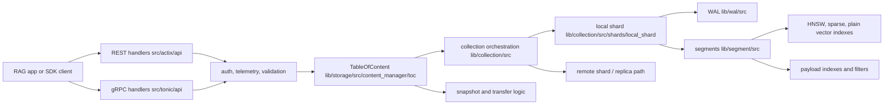
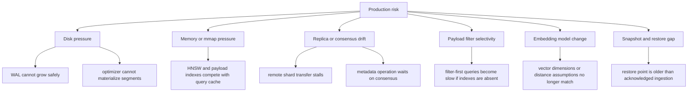

# Qdrant Architecture Notes

## Source Basis

This document is based on static inspection of the local repository at `github-repos/04-rag-vector-database/qdrant`. The main files and directories used were `README.md`, `Cargo.toml`, `Dockerfile`, `config/config.yaml`, `src/main.rs`, `src/settings.rs`, `src/startup.rs`, `src/actix`, `src/tonic`, `lib/storage`, `lib/collection`, `lib/shard`, `lib/segment`, `lib/sparse`, `lib/wal`, `lib/edge`, `openapi`, and `tests/e2e_tests`.

## Executive Summary

Qdrant is a Rust vector database and search engine for AI applications. In a RAG architecture, it is the durable retrieval tier that stores embeddings, payload metadata, sparse vectors, multivectors, and operational state, then serves low-latency nearest-neighbor and filtered retrieval over REST and gRPC.

The repository is organized as a Rust workspace. The executable in `src/main.rs` wires together process configuration, telemetry, authentication, API servers, cluster consensus, shard transfer services, inference, and the main storage facade. Core database behavior is implemented in workspace crates under `lib/`: `storage` owns the `TableOfContent` and dispatch path, `collection` owns collection-level shard orchestration, `shard` and `segment` implement the local data and index structures, and `wal` provides durable write-ahead logging.

Operationally, Qdrant can run as a single Docker process, an embedded/local Qdrant Edge library, or a distributed cluster using peer-to-peer gRPC, Raft consensus, shard replication, and shard transfer. Its architecture is especially relevant when the AI stack needs retrieval with payload filtering, hybrid dense/sparse search, snapshot recovery, multitenancy, and production-grade controls such as TLS, API keys, JWT RBAC, metrics, telemetry, and audit logging.

## Problem Solved

Embedding models convert documents, chunks, images, or user context into vectors. A RAG system then needs a retrieval engine that can:

- Store vector records durably with user-defined metadata.
- Search by dense vector, sparse vector, or multiple named vectors.
- Combine vector similarity with payload filters.
- Keep search latency predictable as data grows.
- Support online updates without rebuilding the whole index.
- Scale beyond one node with shard placement, replication, and recovery.
- Expose stable APIs to application services and SDKs.
- Provide operational hooks for snapshots, health, metrics, and security.

Qdrant solves this problem as a purpose-built vector database rather than a thin library around an ANN index. The repository reflects that difference: request handling, consensus, collection metadata, shard lifecycle, WAL recovery, segment optimization, vector storage, payload indexing, and API schemas are all first-class modules.

## Role in an AI Stack

Qdrant typically sits between application/orchestration services and storage/embedding pipelines:

- Ingestion services call embedding providers or local models, then upsert points into Qdrant.
- RAG query services embed a user query, search Qdrant, apply metadata filters, optionally rerank, and pass retrieved context to an LLM.
- Agents can use Qdrant as long-term memory, semantic cache, document memory, or tool result index.
- Evaluation pipelines can replay query sets against Qdrant collections to measure recall, latency, filtering behavior, and retrieval quality.
- Operations teams manage Qdrant like a stateful data service with backups, API security, resource budgets, and cluster health.

Qdrant does not replace the embedding model, chunking pipeline, reranker, LLM, or governance layer. It is the retrieval and vector-state system those layers depend on.

## Source Tree Map

Important repository areas:

```text
qdrant/
  README.md                         Product overview, quick start, feature summary.
  Cargo.toml                        Rust workspace, binary package, features, crate dependencies.
  Dockerfile                        Multi-stage build and runtime image, GPU variants, exposed ports.
  config/config.yaml                Default service, storage, cluster, TLS, audit, GPU settings.
  openapi/                          REST API schema sources.
  src/
    main.rs                         Process bootstrap and service composition.
    settings.rs                     Configuration model and layered config loading.
    startup.rs                      API server startup helpers.
    actix/                          REST API handlers and middleware.
    tonic/                          gRPC API and service wiring.
    consensus.rs                    Distributed consensus integration.
    snapshots.rs                    Snapshot recovery and startup handling.
    common/                         Auth, telemetry, inference, logging, helpers.
  lib/
    api/                            Shared API types and gRPC proto definitions.
    storage/                        TableOfContent, dispatcher, cluster metadata, snapshots.
    collection/                     Collection object, shard holder, replica set, local shard.
    shard/                          Shard-level abstractions.
    segment/                        Segment storage, vector indexes, payload index, persistence.
    sparse/                         Sparse vector support.
    wal/                            Write-ahead log implementation.
    edge/                           Qdrant Edge embedded/local shard API.
    common/, gridstore/, posting_list/, gpu/ Shared utilities and indexing support.
  tests/
    e2e_tests/                      End-to-end and compatibility tests, TLS and snapshot scenarios.
```

## Core Concepts

### Point

A point is the persisted unit of retrieval. It usually contains one or more vectors, a point identifier, and optional payload metadata. RAG systems commonly map one point to a document chunk, image region, transcript segment, or memory item.

### Vector and Named Vector

Qdrant supports dense vectors, sparse vectors, and multiple named vectors. Named vectors let one collection carry different embedding spaces, such as title embeddings, body embeddings, image embeddings, or separate dense and sparse retrieval signals.

### Payload

Payload is structured metadata attached to points. Payload indexes let Qdrant filter search by attributes such as tenant, document type, timestamp, access group, language, or source system.

### Collection

The `lib/collection` crate treats a collection as a set of points that share vector configuration and payload schema. A collection owns shard metadata, optimizers, runtime handles, and callbacks used by cluster coordination.

### Shard and Replica Set

Collections are partitioned into shards. In distributed mode, a shard can have multiple replicas across peers. The `ShardReplicaSet` tracks local and remote replicas, replica states, write ordering, transfer state, and read/write routing.

### Local Shard

`LocalShard` owns local data for a shard: segments, WAL, update pipeline, optimizers, rate limiters, and consistency checks. It is the bridge between cluster-level orchestration and low-level segment storage.

### Segment

`lib/segment` implements the independent storage and index unit. A segment owns vector storage, vector index structures, quantized vectors, payload storage, payload index, point versioning, and persistence metadata. Segment optimization is how Qdrant compacts and reorganizes data over time.

### WAL

The write-ahead log records updates before they are applied to segment state. This is central to crash recovery and to local shard loading, repair, and consistency checks.

### TableOfContent

`TableOfContent` in `lib/storage/src/content_manager/toc` is the main storage service object. It owns loaded collections, alias persistence, optimizer budgets, internal runtimes, channel service references, and collection lifecycle operations.

### Dispatcher and Consensus

`Dispatcher` routes metadata and update operations through either local execution or distributed consensus. In distributed mode, it proposes collection metadata operations through Raft and waits for expected operation application when necessary.

## Component and System Diagram



## Internal Architecture

### Process Bootstrap

`src/main.rs` is the best entry point for understanding runtime composition. It parses CLI options such as bootstrap URI, peer URI, snapshot recovery, config path, telemetry disabling, stacktrace behavior, and consensus reinitialization. It then loads `Settings`, initializes feature flags, configures logging and panic handling, checks filesystem compatibility, initializes GPU manager when the `gpu` feature is enabled, and recovers or initializes persistent consensus state.

After resource budgets are configured, startup creates a peer `ChannelService`, opens the `TableOfContent`, loads collections, creates a `Dispatcher`, optionally wraps operations with consensus, initializes telemetry and request profiling, starts inference services, and launches REST, metrics, and gRPC servers based on configuration.

### API Layer

The API surface is split between:

- `src/actix`: REST API, static Web UI serving, middleware, and HTTP concerns.
- `src/tonic`: gRPC service wiring.
- `lib/api`: shared API types and protobuf definitions, including `lib/api/src/grpc/proto/qdrant.proto`.

The service exposes the same database concepts through SDK-friendly interfaces. REST defaults to port `6333`; gRPC defaults to `6334`; the peer-to-peer cluster port defaults to `6335`.

### Storage and Metadata Layer

`lib/storage` is the database coordination layer inside one process. `TableOfContent` owns collection instances and aliases, while `Dispatcher` determines whether an operation can execute locally or must go through consensus. This layer also handles collection creation, deletion, alias management, snapshots, shard transfers, cluster metadata, and runtime budget coordination.

### Collection Layer

`lib/collection` owns the collection lifecycle. It loads collection config, version files, shard distribution, shard state, transfer tasks, optimizers, and telemetry. Collection methods coordinate reads and writes across shard holders and replica sets.

### Shard and Replica Layer

The replica-set code explicitly models shard replica state such as initializing, active, listener, dead, and partial states. It persists replica state in `replica_state.json`, manages local and remote shard references, handles transfer and recovery callbacks, and applies write ordering rules. This is the critical layer for distributed correctness.

### Segment and Index Layer

`lib/segment` is where point-level storage and search mechanics live. A segment combines:

- ID tracking.
- Point versions.
- Dense, sparse, multi-vector, and quantized vector storage.
- Vector indexes.
- Payload storage and payload indexes.
- Segment config, persistence, and error status.

Higher layers route operations to segments; segment internals decide how to scan, index, score, filter, and persist.

## End-to-End Runtime Flow



### Write Flow

For a point upsert, API handlers validate the request and authorization context, then submit the operation through the dispatcher and collection hierarchy. Local shard writes are appended to WAL before being applied to segment state. In a replicated collection, the replica set coordinates writes across local and remote replicas according to collection and shard consistency rules.

### Query Flow

For vector search, the API layer parses the query, filters, vector names, limits, and read consistency preferences. Collection logic selects target shards, replica sets select local or remote replicas, and local shards execute scoring across segment indexes. Payload indexes reduce candidate sets when filters are selective; vector indexes accelerate nearest-neighbor lookup; segment results are merged by higher layers.

### Startup and Recovery Flow

On startup, Qdrant loads settings from layered configuration, prepares runtime budgets, opens persistent state, recovers snapshots if requested, initializes or joins cluster consensus, loads all collections into the `TableOfContent`, and starts API servers. Local shard loading reads segment directories, WAL state, payload schemas, and optimizer state, with repair paths for inconsistent or obsolete segment files.

## Deployment and Operations Topology



### Single Node

The quick-start path in `README.md` runs a single Docker container exposing port `6333`. This is the simplest mode for local development, demos, and small deployments. It still uses the same collection, shard, WAL, segment, and snapshot architecture internally.

### Distributed Cluster

Distributed mode adds peer discovery, Raft-backed metadata consensus, shard distribution, replica sets, and peer-to-peer communication. Cluster settings live under `cluster` in `config/config.yaml`; peer service defaults to port `6335`.

### Container Image

`Dockerfile` shows a multi-stage Rust build, optional GPU build variants, generated SBOM support, static Web UI assets, runtime config, and exposed REST/gRPC ports. Runtime images set `RUN_MODE=production` and copy `config/production.yaml` into the image.

### Qdrant Edge

`lib/edge` is a separate embedded/local deployment model. It exposes Rust and Python APIs for local shard use cases and synchronization with Qdrant server. This is useful for edge devices, local-first applications, or architectures that need offline retrieval followed by central synchronization.

## Lifecycle and Decision Diagram





## Extension Points

Qdrant is not a plugin-only system; most extension points are API, configuration, and crate-level seams:

- REST and gRPC APIs in `src/actix`, `src/tonic`, `openapi`, and `lib/api`.
- Client SDKs listed in `README.md` for Python, JavaScript/TypeScript, Go, Rust, .NET, Java, and community PHP.
- Collection configuration for vectors, named vectors, sparse vectors, quantization, sharding, replication, optimizers, HNSW, on-disk payload, and strict mode.
- Payload schema and payload indexes for application-specific filtering.
- Snapshot and recovery workflows for backup/restore integration.
- Metrics and telemetry hooks for monitoring platforms.
- TLS, API keys, read-only API keys, JWT RBAC, and internal-auth settings for security integration.
- GPU feature gates and GPU indexing settings under `GpuConfig`.
- `lib/edge` for local embedded use cases.

## Integrations

Common integration patterns:

- **Embedding providers:** Application code generates embeddings using OpenAI, Azure OpenAI, local models, Hugging Face, or other providers, then writes vectors to Qdrant.
- **RAG frameworks:** LangChain, LlamaIndex, Haystack, Semantic Kernel, and custom orchestrators use Qdrant as a vector store.
- **Model serving:** Qdrant can sit next to a reranker, cross-encoder, or LLM gateway. It returns candidate context; another service decides final answer composition.
- **Observability:** Metrics endpoint and telemetry can feed Prometheus-compatible or centralized monitoring systems.
- **Kubernetes/stateful platforms:** Qdrant can run as a stateful workload with persistent volumes, service discovery, TLS, and backup jobs.
- **Edge deployments:** Qdrant Edge supports local retrieval and sync-oriented designs.

## Configuration, Deployment, and Operations

### Configuration Loading

`src/settings.rs` loads configuration from embedded defaults, `config/config.yaml`, mode-specific files such as `config/{RUN_MODE}`, local overrides, debian package config, a CLI-supplied `--config-path`, and environment variables. Environment variables use the `QDRANT` prefix and `__` as a separator.

### Key Settings

From `config/config.yaml` and `src/settings.rs`:

- `storage.storage_path`, `snapshots_path`, and `temp_path` control state locations.
- `storage.on_disk_payload` controls whether payload data is persisted on disk.
- WAL capacity and segment optimizer settings control update and compaction behavior.
- HNSW defaults include `m`, `ef_construct`, `full_scan_threshold_kb`, indexing threads, and on-disk mode.
- Collection defaults include replication factor, write consistency, vector storage defaults, quantization defaults, and strict mode.
- `service.host`, `http_port`, `grpc_port`, and optional `metrics_port` control network listeners.
- `service.api_key`, `read_only_api_key`, `jwt_rbac`, and `enforce_internal_auth` control authentication and authorization.
- `tls` controls service certificate, key, CA certificate, and reload TTL.
- `cluster` controls peer-to-peer port and consensus settings.
- `gpu` controls optional GPU indexing behavior.
- `audit` controls audit logging and forwarded-header handling.

### Operations Guidance

- Treat `storage_path` and `snapshots_path` as stateful data, not disposable container filesystem paths.
- Enable API authentication before exposing REST or gRPC endpoints outside trusted networks. The README explicitly warns that the quick-start Docker command is insecure without authentication.
- Monitor disk, file descriptors, CPU, memory, vector index build pressure, WAL growth, and optimizer backlog.
- Use snapshots for backup, migration, and disaster recovery. Test restore behavior, not just snapshot creation.
- For distributed deployments, define clear shard count, replication factor, and write consistency policies before production load.
- Validate payload index design against expected filters; unindexed or low-selectivity filters can increase query cost.
- Plan capacity around vector dimensionality, number of vectors per point, payload size, quantization, on-disk settings, and replication.

## Observability, Testing, Evaluation, and Failure Modes

### Observability

Qdrant includes telemetry and metrics concerns in `src/main.rs`, `src/common`, settings, and service startup. Relevant controls include metrics port, hardware reporting, slow query logging, telemetry disabling, request profiling, audit logging, and panic/stacktrace configuration.

Operational dashboards should track:

- Request rate, latency, error rate, and slow queries.
- Search latency by collection and filter type.
- WAL and segment growth.
- Optimizer activity and pending compactions.
- Replica state, shard transfers, and consensus health.
- Disk usage, memory usage, file descriptors, CPU, and GPU use when enabled.
- Snapshot creation, restore, and transfer failures.

### Testing

The repository includes broad tests, with useful starting points in:

- `tests/e2e_tests` for end-to-end API, TLS, compatibility, and snapshot scenarios.
- `lib/collection` tests for collection and shard behavior.
- `lib/segment` tests for vector storage, payload indexing, and segment behavior.
- `lib/storage` tests for metadata and content-manager behavior.
- gRPC and OpenAPI definitions under `lib/api` and `openapi`.

For a RAG workload, repository tests should be supplemented with retrieval evaluation: recall@k, MRR/NDCG, filter correctness, latency percentiles, update freshness, and robustness after restart or snapshot restore.

### Failure Modes

Important failure modes to design for:

- **Misconfigured security:** Public REST/gRPC endpoints without API keys, JWT RBAC, or TLS.
- **Disk pressure:** Segment, WAL, and snapshot growth can exhaust local volumes.
- **Payload filter drift:** Application filters may depend on metadata keys that are missing, unindexed, or inconsistent across ingestion jobs.
- **Replica divergence:** Distributed deployments need monitoring for dead, partial, or transferring replica states.
- **Consensus instability:** Network partitions or bad peer configuration can block metadata operations.
- **Long index builds:** Large collection imports can trigger optimizer pressure and affect latency.
- **Snapshot restore mismatch:** Restoring into incompatible versions or storage layouts requires compatibility testing.
- **Resource overcommit:** Dense vectors, multivectors, sparse indexes, and quantization choices affect RAM, disk, and CPU differently.

## Security and Governance Risks

- **Tenant isolation:** If multiple tenants share collections, payload filters must not be the only security boundary unless enforced consistently in application code and tested.
- **Key management:** API keys, read-only keys, TLS private keys, and JWT secrets must be managed outside source control and rotated.
- **Transport security:** Enable TLS and validate client/server trust for untrusted networks.
- **Authorization design:** JWT RBAC and read-only keys should be mapped to operational roles, not treated as a generic on/off switch.
- **Data retention:** Vectors can leak semantic information about source documents. Deletion, snapshot retention, and backup lifecycle must match governance policies.
- **Audit logging:** Audit settings are present, but logs must be collected, protected, and reviewed. Be careful with forwarded headers; `config/config.yaml` warns about trusting them.
- **Model governance:** Embedding model changes can make existing vector spaces incompatible. Store embedding model/version metadata and plan migrations.

## Reading Guide

Recommended order for senior engineers:

1. `README.md` for product capabilities and supported APIs.
2. `Cargo.toml` for workspace boundaries and feature flags.
3. `config/config.yaml` and `src/settings.rs` for operational shape.
4. `src/main.rs` for process bootstrap and service wiring.
5. `src/actix`, `src/tonic`, and `lib/api` for API boundaries.
6. `lib/storage/src/content_manager/toc` and `lib/storage/src/dispatcher.rs` for operation routing.
7. `lib/collection/src/collection`, `lib/collection/src/shards/replica_set`, and `lib/collection/src/shards/local_shard` for collection and shard behavior.
8. `lib/segment` for actual storage, payload, and vector index internals.
9. `tests/e2e_tests` for deployment-facing behavior and compatibility expectations.
10. `lib/edge` if local embedded retrieval is part of the target architecture.

## Learning Path

1. Run a local single-node container in an isolated development environment and create a collection with one dense vector.
2. Add payload filters and payload indexes, then compare filtered and unfiltered query plans and latency.
3. Add a second named vector or sparse vector to understand hybrid retrieval design.
4. Read `LocalShard` loading and WAL code to understand durability.
5. Read segment vector storage and payload index modules to understand performance tradeoffs.
6. Configure snapshots and test restore into a fresh local instance.
7. Study distributed settings, replica-set state, and consensus flow before designing a cluster.
8. Add workload-specific retrieval evaluation using a fixed query set and labeled relevant chunks.

## Glossary

- **ANN:** Approximate nearest-neighbor search, used to retrieve vectors similar to a query vector.
- **Collection:** Logical container for points with shared vector and payload configuration.
- **Consensus:** Cluster agreement mechanism used for distributed metadata operations.
- **Dispatcher:** Storage-layer router that chooses local execution or consensus-backed execution.
- **HNSW:** Hierarchical Navigable Small World graph index for vector search.
- **LocalShard:** Local durable shard implementation with WAL, segments, updates, and optimizers.
- **Payload:** Metadata attached to points and used for filtering or returning context.
- **Point:** Stored vector record, usually representing a RAG chunk or item.
- **Quantization:** Compression technique for reducing vector memory or disk footprint.
- **Replica Set:** Group of local and remote replicas for a shard.
- **Segment:** Low-level storage and index unit inside a local shard.
- **Shard:** Partition of a collection.
- **Snapshot:** Backup artifact for collection or storage state.
- **Sparse Vector:** Vector representation optimized for lexical or sparse retrieval signals.
- **TableOfContent:** Main in-process storage facade that owns loaded collections.
- **WAL:** Write-ahead log used for durable update recovery.

## Deep-Dive Addendum: Repository-Grounded Operating Model

This addendum is meant to help a senior engineer move from "Qdrant as a vector database" to "Qdrant as a clusterable storage engine with strict operational trade-offs." Keep the following files open while reading the code: `github-repos/04-rag-vector-database/qdrant/src/main.rs` for process entry, `src/startup.rs` and `src/settings.rs` for runtime construction, `src/actix/api/` and `src/tonic/api/` for REST and gRPC surfaces, `lib/storage/src/content_manager/toc/` for the storage facade, `lib/collection/src/shards/local_shard/` for local shard behavior, `lib/segment/src/index/` for vector and payload indexes, `lib/wal/src/` for durability, and `openapi/` for the public REST contract.



The main architectural tension is not just nearest-neighbor performance. It is the balance between ingestion durability, optimizer pressure, query freshness, replica consistency, and memory footprint. The file layout shows this separation clearly: API handlers do not own storage mechanics; `TableOfContent` routes collection operations; collections own shard topology; local shards own WAL, segment mutation, snapshot, and telemetry code; segments own the low-level vector and payload structures. That layering is what lets Qdrant expose both single-node and distributed behavior without making every request handler understand consensus, segment compaction, or HNSW internals.

### Runtime Durability and Consistency Checkpoints

```mermaid
sequenceDiagram
  participant App as Client application
  participant API as REST or gRPC API
  participant TOC as TableOfContent
  participant Shard as LocalShard
  participant WAL as Write-ahead log
  participant Seg as Segment storage
  participant Opt as Optimizer workers
  App->>API: upsert/delete/update points
  API->>TOC: validate collection and route operation
  TOC->>Shard: apply update with ordering policy
  Shard->>WAL: append durable operation
  WAL-->>Shard: operation persisted
  Shard->>Seg: apply to mutable segment state
  Shard-->>TOC: acknowledge by wait/ordering mode
  TOC-->>API: response
  Opt->>Seg: compact, index, quantize, or flush later
```

For production review, inspect whether application write semantics line up with Qdrant's wait and ordering choices. A RAG ingestion pipeline that acknowledges chunks before WAL persistence or before replica transfer is operationally different from one that blocks until updates are visible. The relevant code paths are distributed across `local_shard/wal_ops.rs`, `local_shard/updaters.rs`, `local_shard/query.rs`, and the storage dispatcher under `lib/storage/src/dispatcher.rs`. The right reading strategy is to trace one mutation, then one query, then one snapshot recovery path; otherwise it is easy to confuse API shape with durability semantics.

### Failure-Mode Map



The most important governance risk is silent semantic drift. Qdrant can store vectors, sparse vectors, and payloads, but it cannot know when an embedding model, chunker, metadata schema, or ranking policy has changed in the upstream RAG application. Treat collection configuration, vector size, distance metric, named vector usage, sparse-vector policy, and payload index definitions as governed schema, not as incidental runtime settings.

### Production Readiness Checklist

- Confirm collection schemas in application code match Qdrant collection creation payloads, especially vector dimension, distance metric, named vectors, sparse vectors, and quantization options.
- Define a payload indexing policy before traffic arrives. Fields used in filters, access control, tenant isolation, or reranking should not depend on full scans during peak query load.
- Exercise WAL recovery by killing a node during ingestion and checking restored points, not only by running happy-path API tests.
- Test snapshot creation, transfer, and restore for at least one large collection; include disk-full and partial-transfer cases.
- If clustering is used, document shard count, replica count, write ordering expectations, and the procedure for replacing a node.
- Export and alert on request latency, update latency, collection telemetry, optimizer backlog, disk usage, and per-collection memory pressure from `src/common/telemetry_ops/`.
- Decide whether local inference paths under `src/common/inference/` are allowed in production or whether embeddings must be generated outside Qdrant for stronger model governance.
- Keep `config/production.yaml`, `config/config.yaml`, and deployment manifests under release control; avoid changing optimizer, storage, or cluster settings as ad hoc incident response.

### Senior Architect Reading Guide

Read the repository in four passes. First, map ingress from `src/main.rs`, `src/startup.rs`, `src/actix/api/`, and `src/tonic/api/`. Second, follow storage routing through `lib/storage/src/content_manager/toc/` and `lib/storage/src/dispatcher.rs`. Third, inspect local shard mechanics in `lib/collection/src/shards/local_shard/`, especially WAL, snapshot, query, and update modules. Fourth, go down to `lib/segment/src/index/` and separate vector scoring from payload filtering. This order keeps API, topology, durability, and search quality concerns distinct.

### Additional Glossary

- **Optimizer backlog:** Pending work that must compact or index segments after writes; it affects query latency and disk growth.
- **Payload selectivity:** How strongly a metadata filter narrows candidate points before vector scoring.
- **Semantic drift:** A mismatch between stored vectors/payloads and the current application embedding or chunking policy.
- **Shard transfer:** Movement or replication of shard data during cluster scaling, recovery, or rebalancing.
