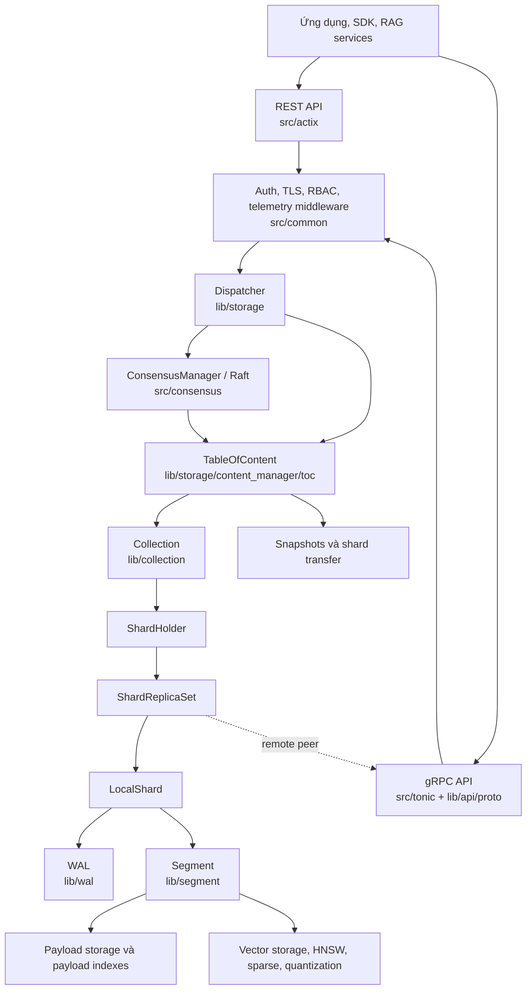
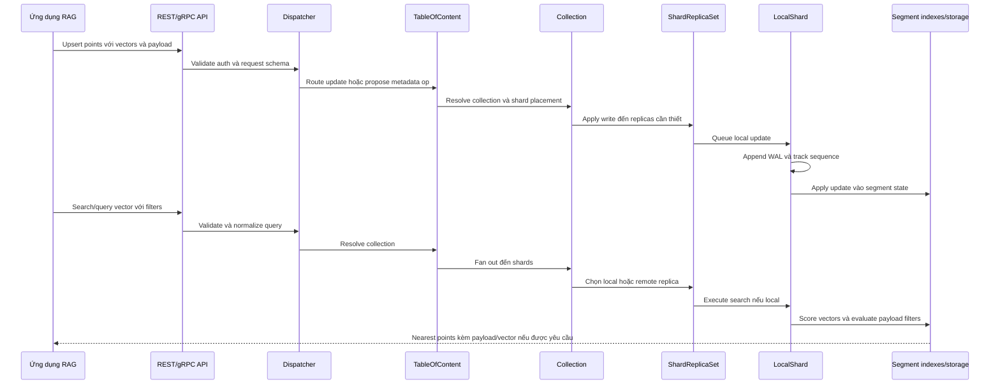
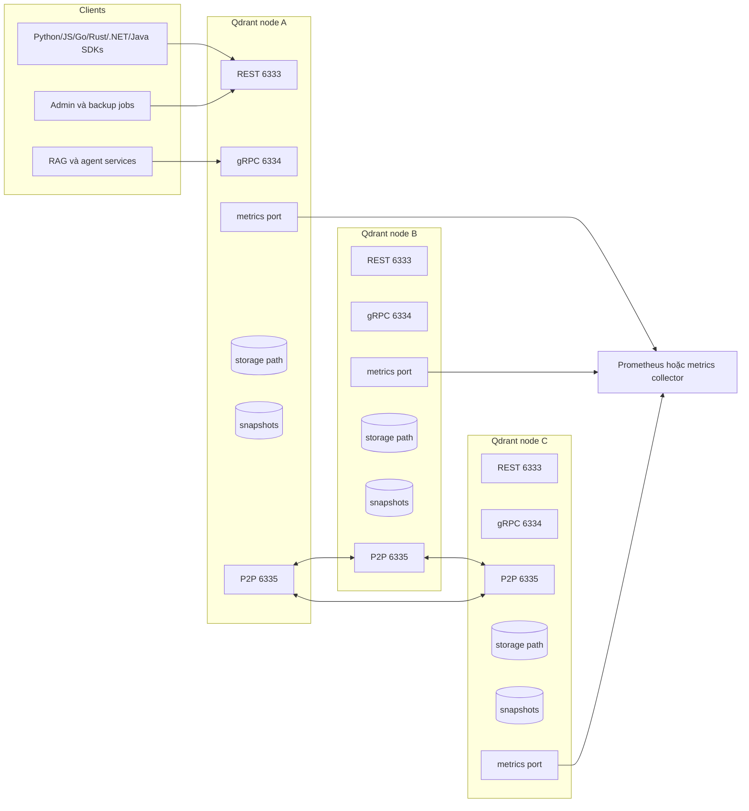
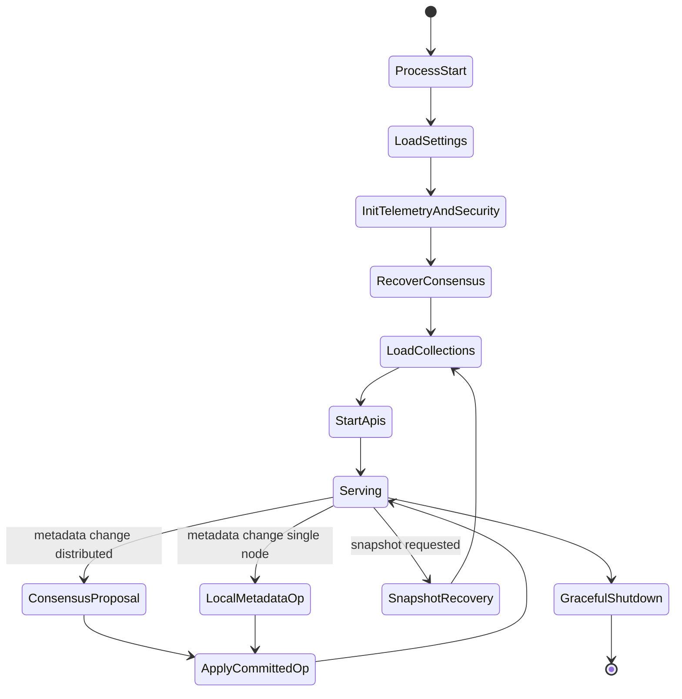
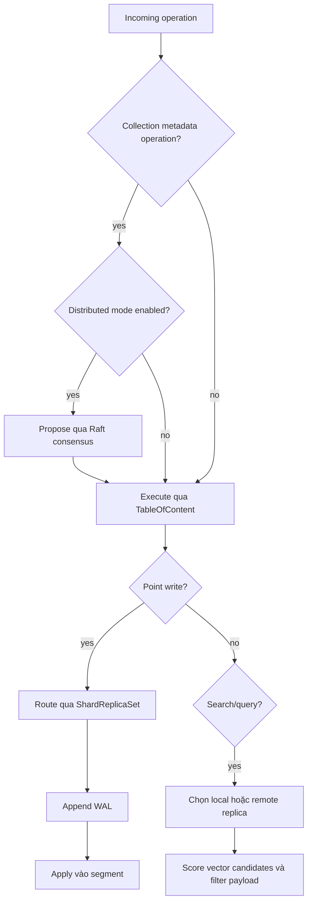
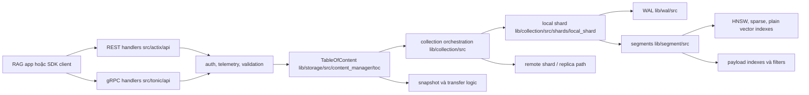
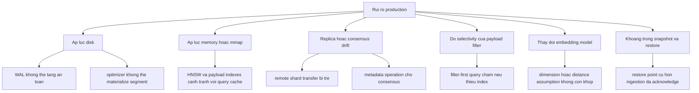

# Ghi Chú Kiến Trúc Qdrant

## Cơ Sở Nguồn

Tài liệu này dựa trên việc đọc tĩnh kho mã nguồn tại `github-repos/04-rag-vector-database/qdrant`. Các tệp và thư mục chính đã được đối chiếu gồm `README.md`, `Cargo.toml`, `Dockerfile`, `config/config.yaml`, `src/main.rs`, `src/settings.rs`, `src/startup.rs`, `src/actix`, `src/tonic`, `src/consensus.rs`, `src/snapshots.rs`, `lib/storage`, `lib/collection`, `lib/shard`, `lib/segment`, `lib/sparse`, `lib/wal`, `lib/edge`, `openapi`, và `tests/e2e_tests`.

## Tóm Tắt Điều Hành

Qdrant là cơ sở dữ liệu vector và công cụ tìm kiếm vector viết bằng Rust, hướng tới các ứng dụng AI thế hệ mới. Trong kiến trúc RAG, Qdrant đóng vai trò tầng truy xuất bền vững: lưu embeddings, payload metadata, sparse vectors, multivectors, trạng thái vận hành, và phục vụ truy vấn nearest-neighbor có độ trễ thấp qua REST và gRPC.

Kho mã nguồn được tổ chức như một Rust workspace. Binary chính trong `src/main.rs` ghép các phần: cấu hình tiến trình, telemetry, xác thực, API server, consensus cho cluster, dịch vụ chuyển shard, inference, và facade lưu trữ chính. Logic cơ sở dữ liệu nằm ở các crate trong `lib/`: `storage` sở hữu `TableOfContent` và đường dispatch, `collection` quản lý collection và shard, `shard` và `segment` hiện thực dữ liệu/index cục bộ, còn `wal` cung cấp write-ahead log để khôi phục sau sự cố.

Về vận hành, Qdrant có thể chạy như một container đơn, như thư viện nhúng cục bộ Qdrant Edge, hoặc như cluster phân tán dùng peer-to-peer gRPC, Raft consensus, shard replication, và shard transfer. Kiến trúc này phù hợp khi hệ thống AI cần retrieval có payload filter, hybrid dense/sparse search, snapshot recovery, multitenancy, TLS, API keys, JWT RBAC, metrics, telemetry, và audit logging.

## Bài Toán Được Giải Quyết

Embedding model biến tài liệu, chunk, ảnh, hoặc ngữ cảnh người dùng thành vector. Hệ thống RAG sau đó cần một retrieval engine có khả năng:

- Lưu vector record bền vững kèm metadata tùy biến.
- Tìm kiếm bằng dense vector, sparse vector, hoặc nhiều named vector.
- Kết hợp vector similarity với payload filter.
- Giữ latency ổn định khi dữ liệu tăng.
- Cập nhật online mà không cần rebuild toàn bộ index.
- Mở rộng qua nhiều node bằng shard placement, replication, và recovery.
- Cung cấp API ổn định cho application service và SDK.
- Hỗ trợ snapshot, health, metrics, và bảo mật cho vận hành production.

Qdrant giải quyết bài toán này như một vector database đúng nghĩa, không chỉ là wrapper mỏng quanh ANN index. Điều này thể hiện rõ trong repo: request handling, consensus, collection metadata, shard lifecycle, WAL recovery, segment optimization, vector storage, payload indexing, và API schema đều là module riêng.

## Vai Trò Trong AI Stack

Qdrant thường nằm giữa tầng ứng dụng/orchestration và các pipeline embedding:

- Ingestion service gọi embedding provider hoặc local model, rồi upsert points vào Qdrant.
- RAG query service embed câu hỏi người dùng, search Qdrant, áp dụng metadata filter, có thể rerank, rồi đưa context vào LLM.
- Agent dùng Qdrant làm long-term memory, semantic cache, document memory, hoặc index kết quả tool.
- Evaluation pipeline replay query set trên collection để đo recall, latency, filter correctness, và chất lượng retrieval.
- Operation team quản lý Qdrant như một stateful data service với backup, API security, resource budget, và cluster health.

Qdrant không thay thế embedding model, chunking pipeline, reranker, LLM, hay governance layer. Nó là hệ thống retrieval và vector-state mà các tầng đó phụ thuộc.

## Bản Đồ Source Tree

Các khu vực quan trọng trong repo:

```text
qdrant/
  README.md                         Tổng quan sản phẩm, quick start, tính năng.
  Cargo.toml                        Rust workspace, binary package, features, crate dependencies.
  Dockerfile                        Multi-stage build, GPU variants, runtime image, exposed ports.
  config/config.yaml                Cấu hình mặc định cho service, storage, cluster, TLS, audit, GPU.
  openapi/                          REST API schema.
  src/
    main.rs                         Bootstrap tiến trình và ghép service.
    settings.rs                     Mô hình cấu hình và layered config loading.
    startup.rs                      Helper khởi động API server.
    actix/                          REST API handlers và middleware.
    tonic/                          gRPC API và service wiring.
    consensus.rs                    Tích hợp distributed consensus.
    snapshots.rs                    Snapshot recovery và startup handling.
    common/                         Auth, telemetry, inference, logging, helper.
  lib/
    api/                            Shared API types và gRPC proto definitions.
    storage/                        TableOfContent, dispatcher, cluster metadata, snapshots.
    collection/                     Collection, shard holder, replica set, local shard.
    shard/                          Abstraction mức shard.
    segment/                        Segment storage, vector indexes, payload index, persistence.
    sparse/                         Hỗ trợ sparse vector.
    wal/                            Write-ahead log.
    edge/                           Qdrant Edge embedded/local shard API.
    common/, gridstore/, posting_list/, gpu/ Utility và indexing support.
  tests/
    e2e_tests/                      End-to-end, TLS, compatibility, snapshot scenarios.
```

## Khái Niệm Cốt Lõi

### Point

Point là đơn vị truy xuất được lưu. Nó thường gồm một hoặc nhiều vector, point identifier, và payload metadata. Trong RAG, một point thường tương ứng với document chunk, vùng ảnh, đoạn transcript, hoặc memory item.

### Vector và Named Vector

Qdrant hỗ trợ dense vector, sparse vector, và nhiều named vector. Named vector cho phép một collection mang nhiều không gian embedding, ví dụ title embedding, body embedding, image embedding, hoặc tách riêng dense và sparse retrieval signals.

### Payload

Payload là metadata có cấu trúc gắn với point. Payload index giúp Qdrant filter theo tenant, loại tài liệu, thời gian, access group, ngôn ngữ, hoặc source system.

### Collection

Crate `lib/collection` xem collection là tập point có cùng cấu hình vector và payload schema. Collection sở hữu shard metadata, optimizers, runtime handles, và callback dùng trong cluster coordination.

### Shard và Replica Set

Collection được chia thành shard. Trong distributed mode, một shard có thể có nhiều replica trên nhiều peer. `ShardReplicaSet` theo dõi local/remote replicas, replica states, write ordering, transfer state, và routing đọc/ghi.

### Local Shard

`LocalShard` sở hữu dữ liệu cục bộ của shard: segments, WAL, update pipeline, optimizers, rate limiters, và consistency checks. Đây là cầu nối giữa orchestration mức cluster và storage/index mức segment.

### Segment

`lib/segment` hiện thực đơn vị storage và index độc lập. Một segment sở hữu vector storage, vector index, quantized vectors, payload storage, payload index, point versioning, và metadata persistence. Segment optimization là cơ chế Qdrant compact và sắp xếp lại dữ liệu theo thời gian.

### WAL

Write-ahead log ghi update trước khi áp dụng vào segment state. Nó là thành phần trung tâm cho crash recovery và quá trình load/repair local shard.

### TableOfContent

`TableOfContent` trong `lib/storage/src/content_manager/toc` là service object chính của storage. Nó sở hữu các collection đã load, alias persistence, optimizer budget, runtime nội bộ, tham chiếu channel service, và thao tác lifecycle collection.

### Dispatcher và Consensus

`Dispatcher` route metadata/update operations qua local execution hoặc distributed consensus. Trong distributed mode, nó đề xuất collection metadata operation qua Raft và chờ đến khi operation dự kiến được áp dụng khi cần.

## Sơ Đồ Component và Hệ Thống



## Kiến Trúc Nội Bộ

### Bootstrap Tiến Trình

`src/main.rs` là điểm bắt đầu tốt nhất để hiểu cách runtime được ghép. Nó parse CLI options như bootstrap URI, peer URI, snapshot recovery, config path, tắt telemetry, stacktrace, và reinit consensus. Sau đó nó load `Settings`, khởi tạo feature flags, cấu hình logging và panic hook, kiểm tra khả năng tương thích filesystem, khởi tạo GPU manager nếu bật feature `gpu`, và khôi phục hoặc khởi tạo persistent consensus state.

Sau khi cấu hình resource budget, startup tạo peer `ChannelService`, mở `TableOfContent`, load collection, tạo `Dispatcher`, tùy chọn bọc operation bằng consensus, khởi tạo telemetry và request profiling, khởi động inference services, rồi start REST, metrics, và gRPC servers theo cấu hình.

### Tầng API

API surface được tách thành:

- `src/actix`: REST API, static Web UI, middleware, và các quan tâm HTTP.
- `src/tonic`: wiring cho gRPC service.
- `lib/api`: shared API types và protobuf definitions, gồm `lib/api/src/grpc/proto/qdrant.proto`.

Service expose cùng các khái niệm database qua nhiều interface phù hợp SDK. REST mặc định ở port `6333`; gRPC mặc định `6334`; peer-to-peer cluster mặc định `6335`.

### Tầng Storage và Metadata

`lib/storage` là tầng điều phối cơ sở dữ liệu trong một process. `TableOfContent` sở hữu collection instances và aliases, còn `Dispatcher` quyết định operation chạy local hay phải qua consensus. Tầng này cũng xử lý create/delete collection, alias management, snapshots, shard transfers, cluster metadata, và runtime budget.

### Tầng Collection

`lib/collection` sở hữu lifecycle của collection. Nó load collection config, version files, shard distribution, shard state, transfer tasks, optimizers, và telemetry. Các method của collection điều phối read/write qua shard holder và replica set.

### Tầng Shard và Replica

Code replica set mô hình hóa rõ các trạng thái replica như initializing, active, listener, dead, và partial. Nó persist replica state trong `replica_state.json`, quản lý local/remote shard references, xử lý transfer/recovery callbacks, và áp dụng write ordering rules. Đây là tầng quan trọng cho correctness trong distributed mode.

### Tầng Segment và Index

`lib/segment` là nơi có cơ chế storage và search mức point. Một segment kết hợp:

- ID tracking.
- Point versions.
- Dense, sparse, multi-vector, và quantized vector storage.
- Vector indexes.
- Payload storage và payload indexes.
- Segment config, persistence, và error status.

Tầng trên route operation đến segment; nội bộ segment quyết định cách scan, index, score, filter, và persist.

## Luồng Runtime Đầu Cuối



### Luồng Ghi

Với point upsert, API handler validate request và authorization context, sau đó gửi operation qua dispatcher và cây collection. Local shard ghi vào WAL trước khi áp dụng vào segment state. Trong replicated collection, replica set điều phối write giữa local và remote replicas theo consistency rules của collection/shard.

### Luồng Truy Vấn

Với vector search, tầng API parse query, filters, vector names, limits, và read consistency. Collection logic chọn target shards, replica set chọn local hoặc remote replicas, và local shard thực thi scoring trên segment indexes. Payload index giảm candidate set khi filter có tính chọn lọc; vector index tăng tốc nearest-neighbor lookup; tầng trên merge kết quả của segment.

### Luồng Startup và Recovery

Khi startup, Qdrant load settings từ layered config, chuẩn bị runtime budget, mở persistent state, recover snapshots nếu được yêu cầu, khởi tạo hoặc join cluster consensus, load tất cả collection vào `TableOfContent`, và start API servers. Local shard loading đọc segment directories, WAL state, payload schema, optimizer state, và có đường repair cho segment file không nhất quán hoặc cũ.

## Topology Triển Khai và Vận Hành



### Single Node

Quick start trong `README.md` chạy một Docker container expose port `6333`. Đây là chế độ đơn giản nhất cho local development, demo, và deployment nhỏ. Bên trong, nó vẫn dùng cùng kiến trúc collection, shard, WAL, segment, và snapshot.

### Distributed Cluster

Distributed mode thêm peer discovery, metadata consensus bằng Raft, shard distribution, replica sets, và peer-to-peer communication. Cấu hình cluster nằm dưới `cluster` trong `config/config.yaml`; peer service mặc định ở port `6335`.

### Container Image

`Dockerfile` cho thấy multi-stage Rust build, optional GPU build variants, SBOM generation, static Web UI assets, runtime config, và REST/gRPC exposed ports. Runtime image đặt `RUN_MODE=production` và copy `config/production.yaml`.

### Qdrant Edge

`lib/edge` là mô hình triển khai embedded/local riêng. Nó expose Rust và Python APIs cho use case local shard và đồng bộ với Qdrant server. Hướng này phù hợp với edge devices, local-first applications, hoặc kiến trúc cần offline retrieval rồi sync về trung tâm.

## Sơ Đồ Lifecycle và Quyết Định





## Điểm Mở Rộng

Qdrant không phải hệ thống plugin thuần túy; các điểm mở rộng chủ yếu nằm ở API, configuration, và ranh giới crate:

- REST và gRPC APIs trong `src/actix`, `src/tonic`, `openapi`, và `lib/api`.
- Client SDKs được liệt kê trong `README.md`: Python, JavaScript/TypeScript, Go, Rust, .NET, Java, và PHP cộng đồng.
- Collection configuration cho vectors, named vectors, sparse vectors, quantization, sharding, replication, optimizers, HNSW, on-disk payload, và strict mode.
- Payload schema và payload indexes cho filter đặc thù của ứng dụng.
- Snapshot và recovery workflows để tích hợp backup/restore.
- Metrics và telemetry hooks cho monitoring platform.
- TLS, API keys, read-only API keys, JWT RBAC, và internal-auth settings cho security integration.
- GPU feature gates và GPU indexing settings trong `GpuConfig`.
- `lib/edge` cho use case embedded/local.

## Tích Hợp

Các mẫu tích hợp phổ biến:

- **Embedding providers:** Application tạo embeddings bằng OpenAI, Azure OpenAI, local models, Hugging Face, hoặc provider khác, rồi ghi vectors vào Qdrant.
- **RAG frameworks:** LangChain, LlamaIndex, Haystack, Semantic Kernel, và custom orchestrators dùng Qdrant như vector store.
- **Model serving:** Qdrant nằm cạnh reranker, cross-encoder, hoặc LLM gateway. Nó trả về context candidates; service khác quyết định answer composition.
- **Observability:** Metrics endpoint và telemetry có thể đưa vào Prometheus-compatible hoặc monitoring tập trung.
- **Kubernetes/stateful platforms:** Qdrant có thể chạy như stateful workload với persistent volumes, service discovery, TLS, và backup jobs.
- **Edge deployments:** Qdrant Edge hỗ trợ local retrieval và thiết kế sync-oriented.

## Cấu Hình, Triển Khai, Vận Hành

### Configuration Loading

`src/settings.rs` load cấu hình từ embedded defaults, `config/config.yaml`, file theo mode như `config/{RUN_MODE}`, local overrides, debian package config, `--config-path` từ CLI, và environment variables. Environment variables dùng prefix `QDRANT` và separator `__`.

### Thiết Lập Quan Trọng

Từ `config/config.yaml` và `src/settings.rs`:

- `storage.storage_path`, `snapshots_path`, và `temp_path` điều khiển vị trí state.
- `storage.on_disk_payload` quyết định payload data có lưu trên disk hay không.
- WAL capacity và segment optimizer settings điều khiển update/compaction behavior.
- HNSW defaults gồm `m`, `ef_construct`, `full_scan_threshold_kb`, indexing threads, và on-disk mode.
- Collection defaults gồm replication factor, write consistency, vector storage defaults, quantization defaults, và strict mode.
- `service.host`, `http_port`, `grpc_port`, và optional `metrics_port` điều khiển network listeners.
- `service.api_key`, `read_only_api_key`, `jwt_rbac`, và `enforce_internal_auth` điều khiển authentication/authorization.
- `tls` điều khiển service certificate, key, CA certificate, và reload TTL.
- `cluster` điều khiển peer-to-peer port và consensus settings.
- `gpu` điều khiển optional GPU indexing.
- `audit` điều khiển audit logging và forwarded-header handling.

### Hướng Dẫn Vận Hành

- Xem `storage_path` và `snapshots_path` là stateful data, không phải filesystem tạm của container.
- Bật API authentication trước khi expose REST/gRPC ra ngoài trusted network. `README.md` cảnh báo lệnh Docker quick-start là insecure nếu không có authentication.
- Monitor disk, file descriptors, CPU, memory, vector index build pressure, WAL growth, và optimizer backlog.
- Dùng snapshots cho backup, migration, và disaster recovery. Cần test restore, không chỉ test tạo snapshot.
- Với distributed deployments, xác định shard count, replication factor, và write consistency trước khi có production load.
- Validate payload index design theo filter thực tế; filter không index hoặc độ chọn lọc thấp có thể tăng chi phí query.
- Lập capacity theo vector dimensionality, số vector trên mỗi point, payload size, quantization, on-disk settings, và replication.

## Observability, Testing, Evaluation, và Failure Modes

### Observability

Qdrant có telemetry và metrics trong `src/main.rs`, `src/common`, settings, và service startup. Các control liên quan gồm metrics port, hardware reporting, slow query logging, tắt telemetry, request profiling, audit logging, và panic/stacktrace configuration.

Dashboard vận hành nên theo dõi:

- Request rate, latency, error rate, và slow queries.
- Search latency theo collection và filter type.
- WAL và segment growth.
- Optimizer activity và pending compactions.
- Replica state, shard transfers, và consensus health.
- Disk usage, memory usage, file descriptors, CPU, và GPU nếu bật.
- Snapshot creation, restore, và transfer failures.

### Testing

Repo có nhiều test, các điểm bắt đầu hữu ích:

- `tests/e2e_tests` cho end-to-end API, TLS, compatibility, và snapshot scenarios.
- `lib/collection` tests cho collection và shard behavior.
- `lib/segment` tests cho vector storage, payload indexing, và segment behavior.
- `lib/storage` tests cho metadata và content-manager behavior.
- gRPC và OpenAPI definitions trong `lib/api` và `openapi`.

Với workload RAG, nên bổ sung retrieval evaluation ngoài repo tests: recall@k, MRR/NDCG, filter correctness, latency percentiles, update freshness, và khả năng đúng sau restart/snapshot restore.

### Failure Modes

Các failure modes cần thiết kế trước:

- **Bảo mật sai cấu hình:** REST/gRPC public không có API keys, JWT RBAC, hoặc TLS.
- **Áp lực disk:** Segment, WAL, và snapshot growth có thể làm đầy volume.
- **Payload filter drift:** Application filters phụ thuộc metadata keys bị thiếu, chưa index, hoặc không nhất quán giữa ingestion jobs.
- **Replica divergence:** Distributed deployments cần monitor replica state dead, partial, hoặc transferring.
- **Consensus instability:** Network partition hoặc peer config sai có thể chặn metadata operations.
- **Index build dài:** Import collection lớn có thể tạo optimizer pressure và ảnh hưởng latency.
- **Snapshot restore mismatch:** Restore vào version/storage layout không tương thích cần compatibility testing.
- **Resource overcommit:** Dense vectors, multivectors, sparse indexes, và quantization ảnh hưởng RAM, disk, CPU theo cách khác nhau.

## Rủi Ro Bảo Mật và Governance

- **Tenant isolation:** Nếu nhiều tenant dùng chung collection, payload filter không nên là security boundary duy nhất trừ khi được enforce nhất quán trong application và được test.
- **Key management:** API keys, read-only keys, TLS private keys, và JWT secrets phải nằm ngoài source control và có quy trình rotate.
- **Transport security:** Bật TLS và validate trust giữa client/server khi qua untrusted network.
- **Authorization design:** JWT RBAC và read-only keys cần map vào role vận hành rõ ràng, không chỉ bật/tắt chung.
- **Data retention:** Vector có thể rò rỉ thông tin semantic của source document. Deletion, snapshot retention, và backup lifecycle phải khớp governance policies.
- **Audit logging:** Audit settings tồn tại, nhưng logs cần được thu thập, bảo vệ, và review. Cần thận trọng với forwarded headers; `config/config.yaml` có cảnh báo về việc trust chúng.
- **Model governance:** Đổi embedding model có thể làm vector space cũ không tương thích. Nên lưu embedding model/version metadata và lập kế hoạch migration.

## Hướng Dẫn Đọc Mã Nguồn

Thứ tự đề xuất cho senior engineer:

1. `README.md` để nắm capabilities và APIs.
2. `Cargo.toml` để hiểu workspace boundary và feature flags.
3. `config/config.yaml` và `src/settings.rs` để hiểu hình dạng vận hành.
4. `src/main.rs` để xem process bootstrap và service wiring.
5. `src/actix`, `src/tonic`, và `lib/api` để hiểu API boundaries.
6. `lib/storage/src/content_manager/toc` và `lib/storage/src/dispatcher.rs` để hiểu operation routing.
7. `lib/collection/src/collection`, `lib/collection/src/shards/replica_set`, và `lib/collection/src/shards/local_shard` để hiểu collection/shard behavior.
8. `lib/segment` để hiểu storage, payload, và vector index internals.
9. `tests/e2e_tests` để xem behavior hướng deployment và compatibility expectations.
10. `lib/edge` nếu kiến trúc mục tiêu cần embedded retrieval cục bộ.

## Lộ Trình Học

1. Chạy single-node container trong môi trường dev riêng và tạo collection có một dense vector.
2. Thêm payload filters và payload indexes, so sánh query có/không filter về latency.
3. Thêm named vector thứ hai hoặc sparse vector để hiểu hybrid retrieval design.
4. Đọc `LocalShard` loading và WAL code để hiểu durability.
5. Đọc segment vector storage và payload index modules để hiểu performance tradeoffs.
6. Cấu hình snapshots và test restore vào instance mới.
7. Nghiên cứu distributed settings, replica-set state, và consensus flow trước khi thiết kế cluster.
8. Thêm retrieval evaluation riêng cho workload bằng query set có nhãn relevant chunks.

## Bảng Thuật Ngữ

- **ANN:** Approximate nearest-neighbor search, dùng để lấy vectors gần query vector.
- **Collection:** Container logic cho points có chung cấu hình vector và payload.
- **Consensus:** Cơ chế đồng thuận cluster cho distributed metadata operations.
- **Dispatcher:** Router tầng storage chọn local execution hoặc consensus-backed execution.
- **HNSW:** Hierarchical Navigable Small World graph index cho vector search.
- **LocalShard:** Hiện thực shard cục bộ với WAL, segments, updates, và optimizers.
- **Payload:** Metadata gắn với point, dùng cho filter hoặc trả về context.
- **Point:** Vector record được lưu, thường đại diện cho RAG chunk/item.
- **Quantization:** Kỹ thuật nén để giảm footprint RAM hoặc disk của vector.
- **Replica Set:** Nhóm local và remote replicas cho một shard.
- **Segment:** Đơn vị storage và index mức thấp trong local shard.
- **Shard:** Phân vùng của collection.
- **Snapshot:** Artifact backup cho collection hoặc storage state.
- **Sparse Vector:** Vector representation cho lexical hoặc sparse retrieval signals.
- **TableOfContent:** Facade storage chính trong process, sở hữu loaded collections.
- **WAL:** Write-ahead log dùng cho durable update recovery.

## Phụ Lục Deep-Dive: Mô Hình Vận Hành Bám Theo Repository

Phần này giúp kiến trúc sư đọc Qdrant như một storage engine có thể chạy cluster, thay vì chỉ xem nó là một vector database. Khi đọc mã nguồn, nên mở song song `github-repos/04-rag-vector-database/qdrant/src/main.rs` cho entry point, `src/startup.rs` và `src/settings.rs` cho quá trình dựng runtime, `src/actix/api/` và `src/tonic/api/` cho REST/gRPC, `lib/storage/src/content_manager/toc/` cho facade lưu trữ, `lib/collection/src/shards/local_shard/` cho hành vi local shard, `lib/segment/src/index/` cho vector/payload indexes, `lib/wal/src/` cho durability, và `openapi/` cho contract REST công khai.



Điểm căng chính của kiến trúc không chỉ là tốc độ nearest-neighbor. Qdrant phải cân bằng durability khi ingest, áp lực optimizer, độ mới của kết quả query, consistency giữa replicas và footprint bộ nhớ. Cấu trúc thư mục thể hiện ranh giới này khá rõ: handler API không sở hữu cơ chế storage; `TableOfContent` route thao tác collection; collection sở hữu topology shard; local shard sở hữu WAL, segment mutation, snapshot và telemetry; segment sở hữu cấu trúc vector/payload cấp thấp. Nhờ vậy Qdrant có thể hỗ trợ single-node và distributed mà không buộc mọi handler phải hiểu consensus, compaction hoặc HNSW internals.

### Checkpoint Về Durability và Consistency Khi Runtime

```mermaid
sequenceDiagram
  participant App as Ung dung client
  participant API as REST hoac gRPC API
  participant TOC as TableOfContent
  participant Shard as LocalShard
  participant WAL as Write-ahead log
  participant Seg as Segment storage
  participant Opt as Optimizer workers
  App->>API: upsert/delete/update points
  API->>TOC: validate collection va route operation
  TOC->>Shard: apply update theo ordering policy
  Shard->>WAL: append durable operation
  WAL-->>Shard: operation da persist
  Shard->>Seg: apply vao mutable segment state
  Shard-->>TOC: acknowledge theo wait/ordering mode
  TOC-->>API: response
  Opt->>Seg: compact, index, quantize hoac flush sau do
```

Khi review production, cần kiểm tra semantics ghi của ứng dụng có khớp với lựa chọn wait và ordering của Qdrant hay không. Một pipeline ingest RAG acknowledge chunk trước khi WAL persist hoặc trước khi replica transfer sẽ có rủi ro khác với pipeline chặn đến khi update visible. Các đường code cần đọc nằm ở `local_shard/wal_ops.rs`, `local_shard/updaters.rs`, `local_shard/query.rs` và dispatcher storage trong `lib/storage/src/dispatcher.rs`. Cách đọc đúng là trace một mutation, rồi một query, rồi một đường snapshot recovery; nếu không rất dễ nhầm API shape với durability semantics.

### Bản Đồ Failure Mode



Rủi ro governance quan trọng nhất là semantic drift im lặng. Qdrant có thể lưu vector, sparse vector và payload, nhưng nó không tự biết khi embedding model, chunker, metadata schema hoặc ranking policy của ứng dụng upstream thay đổi. Vì vậy collection configuration, vector size, distance metric, named vector, sparse-vector policy và payload index phải được quản trị như schema có kiểm soát, không phải setting phụ.

### Checklist Sẵn Sàng Production

- Xác nhận schema collection trong application code khớp payload tạo collection của Qdrant, đặc biệt vector dimension, distance metric, named vectors, sparse vectors và quantization.
- Định nghĩa payload indexing policy trước khi có traffic. Field dùng cho filter, access control, tenant isolation hoặc reranking không nên phụ thuộc vào full scan lúc peak.
- Diễn tập WAL recovery bằng cách kill node trong lúc ingestion rồi kiểm tra points khôi phục, không chỉ chạy happy-path API test.
- Test snapshot creation, transfer và restore với ít nhất một collection lớn; bao gồm tình huống disk đầy và transfer bị ngắt.
- Nếu dùng clustering, ghi rõ shard count, replica count, kỳ vọng write ordering và quy trình thay node.
- Export và alert trên request latency, update latency, collection telemetry, optimizer backlog, disk usage và memory pressure theo collection từ `src/common/telemetry_ops/`.
- Quyết định đường local inference trong `src/common/inference/` có được dùng ở production không, hay embedding bắt buộc tạo ngoài Qdrant để governance model chặt hơn.
- Đưa `config/production.yaml`, `config/config.yaml` và deployment manifests vào release control; tránh đổi optimizer, storage hoặc cluster settings như phản ứng sự cố tùy hứng.

### Hướng Dẫn Đọc Cho Senior Architect

Nên đọc repository theo bốn lượt. Lượt đầu map ingress từ `src/main.rs`, `src/startup.rs`, `src/actix/api/` và `src/tonic/api/`. Lượt hai theo storage routing qua `lib/storage/src/content_manager/toc/` và `lib/storage/src/dispatcher.rs`. Lượt ba đọc local shard mechanics trong `lib/collection/src/shards/local_shard/`, nhất là WAL, snapshot, query và update modules. Lượt bốn đi xuống `lib/segment/src/index/` để tách vector scoring khỏi payload filtering. Thứ tự này giữ API, topology, durability và search quality thành các mối quan tâm riêng.

### Bổ Sung Thuật Ngữ

- **Optimizer backlog:** Công việc compact hoặc index segment còn tồn sau write; ảnh hưởng latency query và tăng trưởng disk.
- **Payload selectivity:** Mức độ metadata filter thu hẹp tập candidate trước khi vector scoring.
- **Semantic drift:** Sự lệch giữa vectors/payloads đã lưu và policy embedding hoặc chunking hiện tại của ứng dụng.
- **Shard transfer:** Di chuyển hoặc replicate dữ liệu shard trong lúc scale cluster, recovery hoặc rebalancing.
