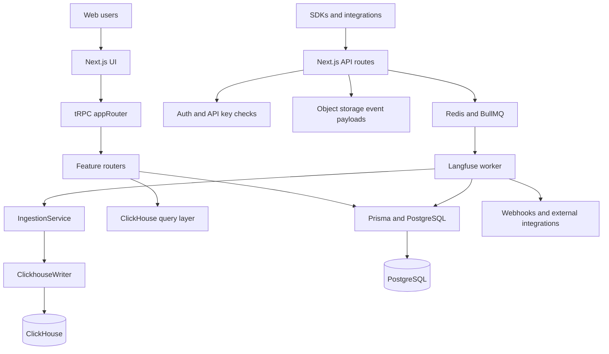
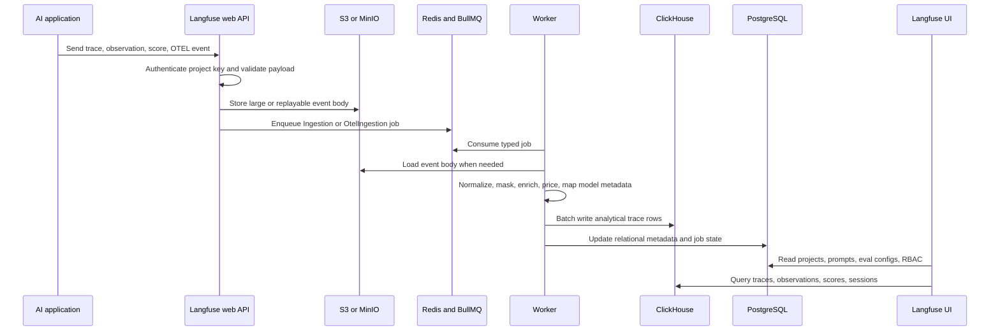
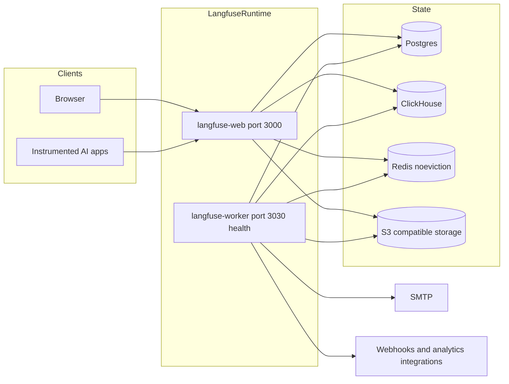
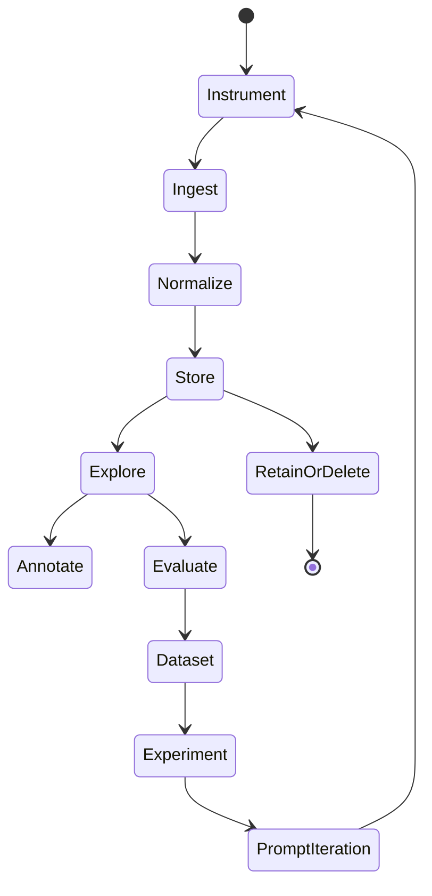
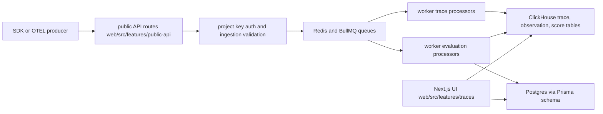
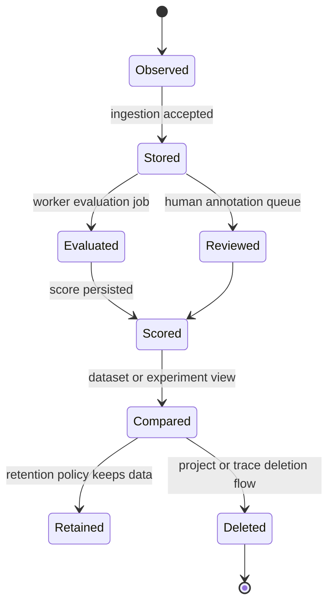
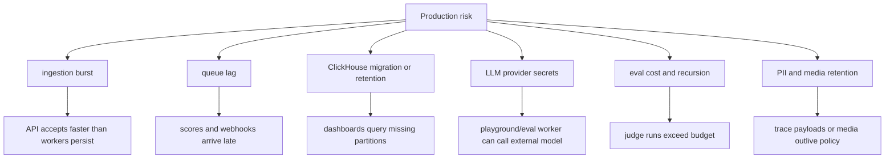

# Langfuse Architecture Notes

## Executive summary

Langfuse is an open source LLM engineering platform for tracing, prompt management, datasets, evaluations, playground workflows, and LLMOps automation. In this repository it is implemented as a TypeScript monorepo: `web/` is the Next.js application and API surface, `worker/` runs asynchronous queue processors, and `packages/shared/` holds common domain schemas, Prisma access, ClickHouse access, ingestion logic, queue definitions, and query builders. The root `package.json` identifies version `3.178.0`, Node `24`, `pnpm@11.1.3`, and Turborepo tasks for build, typecheck, lint, test, development, database migration, and local infrastructure.

The repo is shaped for production LLM observability at high event volume. Operational metadata and identity state live in PostgreSQL through Prisma, analytical trace and event data live in ClickHouse, background work is coordinated through Redis and BullMQ, and large or replayable payloads use S3-compatible object storage. The provided `docker-compose.yml` makes this explicit with `langfuse-web`, `langfuse-worker`, `postgres`, `clickhouse`, `redis`, and `minio` services.

## Problem solved

Langfuse solves the gap between raw application logs and the questions AI product teams ask every day: which prompt version produced this answer, which retrieval step failed, what did a user session cost, which traces need human review, and whether a new prompt or model variant regressed on a dataset. It captures spans, generations, scores, datasets, comments, annotations, prompts, model metadata, and evaluation results as first-class product concepts instead of leaving teams to assemble them from generic logging backends.

## AI stack role

In a broader AI platform, Langfuse sits in the LLMOps control plane:

- It is downstream from applications, agents, RAG pipelines, model gateways, and SDK instrumentation.
- It is upstream from analysts, prompt engineers, evaluators, annotation teams, and incident responders.
- It complements model gateways by observing behavior and quality, while gateways mainly enforce routing, credentials, rate limits, and policy.
- It complements data warehouses by providing trace-shaped, prompt-shaped, and eval-shaped workflows before teams export or archive data.

## Source tree map

Key repository evidence:

- `README.md` describes core features: LLM observability, prompt management, evaluations, datasets, playground, API, SDKs, integrations, cloud and self-hosting.
- `package.json` defines the Turborepo workspace, Node and pnpm versions, and scripts such as `dev`, `build`, `typecheck`, `test`, `infra:dev:up`, `db:migrate`, and `db:seed`.
- `web/src/server/api/root.ts` assembles the main tRPC router with modules for traces, observations, sessions, scores, datasets, prompts, evals, experiments, annotation queues, dashboards, monitors, integrations, billing, RBAC, API keys, audit logs, media, batch exports, and batch actions.
- `web/src/pages/api/trpc/[trpc].ts` exposes the tRPC API handler.
- `web/src/pages/api/public/traces/index.ts` shows the legacy/public ingestion surface.
- `packages/shared/src/db.ts` centralizes Prisma database access.
- `packages/shared/src/server/queues.ts` defines typed queue payloads such as `IngestionEvent`, `OtelIngestionEvent`, batch export, deletion, dataset, eval, retention, and integration jobs, plus `QueueName`, `QueueJobs`, and `TQueueJobTypes`.
- `packages/shared/src/server/ingestion/` contains ingestion validation and batch processing utilities.
- `packages/shared/src/server/clickhouse/` and `packages/shared/src/server/queries/clickhouse-sql/` contain the ClickHouse client, schema helpers, query tracking, SQL fragments, filters, full-text search, and event query builders.
- `worker/src/queues/` contains processors for ingestion, OTEL ingestion, evals, code evals, experiments, webhooks, deletion, data retention, batch export, batch actions, cloud metering, and integrations.
- `worker/src/services/IngestionService/index.ts` and `worker/src/services/ClickhouseWriter/index.ts` are core ingestion write-path services.
- `worker/src/instrumentation.ts` configures OpenTelemetry instrumentation for Prisma and BullMQ.
- `docker-compose.yml` documents the reference self-host topology with Postgres, ClickHouse, Redis, MinIO, web, and worker.

## Core concepts

- **Trace**: a user request or workflow execution, often containing nested observations and model calls.
- **Observation or generation**: a span-like event for model calls, tool calls, retrieval, embeddings, agent actions, or custom application logic.
- **Score**: human, automated, or evaluator-produced quality signal attached to traces, observations, sessions, or dataset runs.
- **Prompt**: managed and versioned prompt asset used by applications and the playground.
- **Dataset and experiment**: reusable examples and runs used for regression testing, prompt comparison, and release gates.
- **Annotation queue**: review workflow for human labeling, triage, and feedback collection.
- **Ingestion event**: typed event accepted by API endpoints, optionally staged through object storage, then processed asynchronously into ClickHouse and relational state.
- **Evaluation job**: batch or trigger-driven execution that applies LLM-as-judge, code evaluators, or observation-level scoring.

## Internal architecture

The web application owns user interaction, authentication, project scoping, and synchronous product APIs. `web/src/server/api/root.ts` is the best starting point because it lists the product modules that become the internal API contract. Feature directories under `web/src/features/` own higher-level domain behavior such as datasets, prompts, experiments, public API keys, RBAC, batch exports, table views, evaluations, LLM tools, and integrations.

`packages/shared/` is the cross-process contract layer. It prevents the web and worker packages from inventing incompatible event shapes. Queue schemas in `packages/shared/src/server/queues.ts` are especially important: an ingestion, deletion, export, or evaluation job must be valid before it can be processed. ClickHouse code in `packages/shared/src/server/clickhouse/` and `packages/shared/src/server/queries/clickhouse-sql/` isolates analytical storage details from feature routers.

The worker owns durability and side effects. It consumes Redis/BullMQ queues, validates job payloads, performs ingestion enrichment, writes to ClickHouse, updates Postgres, executes evals, dispatches webhooks, runs retention and deletion tasks, and gathers queue metrics.

## Runtime and data flow

The most important design decision is the split between ingestion acceptance and ingestion processing. API routes should return quickly after authentication, validation, object upload, and queueing. The worker then handles expensive or failure-prone enrichment and ClickHouse writes. This design supports replay: `worker/src/scripts/replayIngestionEventsV2/README.md` documents replaying failed ingestion from S3 keys through an admin API into `IngestionSecondaryQueue` or `OtelIngestionQueue`.

## Deployment and operations topology

`docker-compose.yml` marks most backing services as localhost-bound and exposes only web and MinIO console-style access by default. Production deployments should preserve that shape: the web/API service is the external entrypoint, while Postgres, Redis, ClickHouse, and object storage stay private. Important configuration families include `DATABASE_URL`, `NEXTAUTH_SECRET`, `SALT`, `ENCRYPTION_KEY`, `CLICKHOUSE_URL`, `CLICKHOUSE_*`, `REDIS_*`, `LANGFUSE_S3_EVENT_UPLOAD_*`, `LANGFUSE_S3_MEDIA_UPLOAD_*`, `LANGFUSE_S3_BATCH_EXPORT_*`, SMTP settings, and initialization variables for first org/project/user creation.

## Lifecycle and module dependency diagram

This lifecycle maps to source modules. Instrumentation enters public API routes. Ingestion validation and transformation live in `packages/shared/src/server/ingestion/` and `worker/src/services/IngestionService/`. Storage uses Prisma/Postgres for relational state and ClickHouse for analytical trace tables. Exploration is implemented through feature routers and UI under `web/src/features/` plus ClickHouse query builders. Annotation queues, eval routers, experiments, datasets, and prompt routers close the loop from production trace to controlled improvement.

## Extension points

- Add a product API capability by creating or extending a feature router and registering it in `web/src/server/api/root.ts`.
- Add a public ingestion or admin route under `web/src/pages/api/` when the route is not naturally a tRPC call.
- Add a durable background job by defining its Zod schema in `packages/shared/src/server/queues.ts`, adding a queue under `worker/src/queues/`, and registering processing in `worker/src/queues/workerManager.ts`.
- Add ingestion transformation or validation in `packages/shared/src/server/ingestion/` and worker ingestion services.
- Add analytical query behavior in `packages/shared/src/server/queries/clickhouse-sql/`.
- Add provider-facing or framework-facing integrations in feature packages and tests, following existing OpenAI, LangChain, LlamaIndex, LiteLLM, Vercel AI SDK, and webhook patterns.
- Add enterprise-only behavior under `ee/` or `web/src/ee/` without mixing license-specific paths into OSS feature code.

## Integrations

The README lists SDK and framework integrations across Python and JS/TS, OpenAI, LangChain, LlamaIndex, Haystack, LiteLLM, Vercel AI SDK, Mastra, Amazon Bedrock, AutoGen, Flowise, Langflow, Dify, OpenWebUI, Promptfoo, CrewAI, and other providers or app builders. In the repository, integration behavior appears in product routers, ingestion adapters, webhook processors, blob storage integration queues, PostHog and Mixpanel integration queues, and tests under `worker/src/__tests__/chatml/` for framework trace conversion.

## Configuration, deployment, and operations

Run modes are encoded in root scripts: local infra through `infra:dev:up`, development through `dev:web` and `dev:worker`, and build/test/typecheck through Turborepo. Database changes are handled through workspace scripts such as `db:migrate`, `db:generate`, and `db:seed`.

Operationally, watch these signals:

- Queue depth and failure rate for ingestion, OTEL ingestion, evals, deletion, retention, webhooks, and batch exports.
- ClickHouse resource errors surfaced through tRPC error handling in `web/src/server/api/trpc.ts`.
- Redis memory policy and connection health because BullMQ depends on Redis and the compose file uses `noeviction`.
- Object storage availability for event upload, media upload, replay, and batch export.
- Postgres migration status and Prisma connection health.
- Worker health and readiness endpoints in `worker/src/api/index.ts`.

## Observability, testing, evaluation, and failure modes

The repository has broad tests under `worker/src/__tests__/`, `worker/src/queues/__tests__/`, `worker/src/services/IngestionService/tests/`, `web/src/__tests__/`, and package-level tests. The test names show the expected risk areas: ingestion masking, process event batch, OTEL conversion, queue processing, eval execution, model matching, secure LLM fetch, outbound connection validation, webhooks, retention cleaning, deletion, batch export, pricing, and ClickHouse writer behavior.

Common failure modes:

- **Ingestion backlog**: Redis queue depth rises, worker concurrency is insufficient, or ClickHouse writes are slow.
- **Partial trace data**: event payload reaches object storage but queue processing fails; replay scripts are the recovery path.
- **ClickHouse pressure**: query resource errors should be exposed cleanly to users and mitigated through query tuning or capacity.
- **Evaluator drift**: LLM-as-judge prompts or model versions change, making scores non-comparable unless evaluator config is versioned.
- **Secret leakage**: traces may include prompts, user input, retrieved documents, tool arguments, or API output; masking and retention are mandatory controls.
- **Webhook or integration loops**: external destination failures can amplify retries without backoff and dead-letter handling.

## Security and governance risks

Treat Langfuse as sensitive production telemetry. It stores user prompts, outputs, tool parameters, retrieval context, model usage, scores, comments, and potentially regulated data. Required controls include project-scoped API keys, strong `NEXTAUTH_SECRET`, rotated `ENCRYPTION_KEY`, private backing services, TLS, RBAC, SSO where needed, audit log review, outbound network validation, retention policies, object storage lifecycle rules, and explicit masking for PII or secrets before ingestion.

The compose file includes several `CHANGEME` placeholders for passwords and cryptographic secrets. Those defaults are for local setup only. Production deployments should also restrict direct ClickHouse, Redis, Postgres, and object storage access to the Langfuse services.

## Reading guide

1. Start with `README.md` for product scope and supported integrations.
2. Read `package.json`, `pnpm-workspace.yaml`, and `turbo.json` to understand the monorepo and build graph.
3. Read `docker-compose.yml` to understand runtime dependencies.
4. Read `web/src/server/api/root.ts` and `web/src/server/api/trpc.ts` for the application API boundary.
5. Read `packages/shared/src/server/queues.ts`, `packages/shared/src/server/ingestion/`, and `packages/shared/src/server/clickhouse/` for cross-process contracts.
6. Read `worker/src/queues/workerManager.ts`, queue processors, `worker/src/services/IngestionService/index.ts`, and `worker/src/services/ClickhouseWriter/index.ts` for asynchronous behavior.
7. Use tests under `worker/src/__tests__/` and `worker/src/queues/__tests__/` to learn failure handling.

## Learning path

1. Run through the README quickstart conceptually: project, API keys, SDK ingestion.
2. Trace one event from public API route to queue schema to worker processor to ClickHouse writer.
3. Study a tRPC feature router, then find the corresponding UI feature and tests.
4. Study one eval path from dataset or observation selection to eval queue and score writeback.
5. Review deployment variables and decide which secrets, retention settings, and storage policies are required in your environment.
6. Only after the architecture is clear, run local dev infrastructure if needed; this documentation task did not install dependencies or start services.

## Glossary

- **BullMQ**: Redis-backed queue library used by workers.
- **ClickHouse**: columnar analytical database used for high-volume trace and event querying.
- **Prisma**: TypeScript ORM used for relational state in Postgres.
- **tRPC**: typed API framework used by the Next.js web application.
- **OTEL**: OpenTelemetry ingestion and internal instrumentation path.
- **Score**: quantitative or categorical quality signal attached to observed AI behavior.
- **Dataset run**: execution of an application or prompt against a dataset for regression and comparison.
- **Annotation queue**: human review workflow for labels and quality feedback.

## Repository-Grounded Deep Dive

Langfuse should be read as a high-volume event system first and a dashboard second. The source tree backs this up: `web/src/features/public-api/` and `web/src/features/traces/` define ingestion and trace-facing product behavior, `worker/src/features/traces/`, `worker/src/features/evaluation/`, `worker/src/features/scores/`, and `worker/src/features/datasets/` process asynchronous work, `packages/shared/prisma/schema.prisma` holds relational project state, and `packages/shared/clickhouse/migrations/` describes the analytical trace/event store. The generated API descriptions under `fern/apis/` and environment examples such as `.env.prod.example` are operational contracts that should be reviewed together.

A trace has two lifecycles: the ingest lifecycle that gets raw observations durable and queryable, and the quality lifecycle that attaches scores, annotations, eval results, or dataset run comparisons. Senior reviewers should keep those paths separate. ClickHouse is optimized for event analytics and trace exploration, while Postgres/Prisma holds organizations, projects, API keys, users, prompts, datasets, score configs, and workflow metadata. Mixing these responsibilities in mental models leads to bad migration and retention decisions.

### Production Readiness Checklist

- Capacity-plan ingestion separately from UI traffic. Public API endpoints, Redis queues, workers, ClickHouse writes, and dashboard queries have different bottlenecks.
- Treat `packages/shared/prisma/schema.prisma` and `packages/shared/clickhouse/migrations/` as jointly versioned state. A deploy that changes one store but not the other can break trace exploration or score joins.
- Put deletion, retention, media cleanup, and project cleanup workers in the incident runbook; relevant code exists under `worker/src/features/batch-project-cleaner/`, `batch-project-media-cleaner/`, `batch-trace-deletion-cleaner/`, and `media-retention-cleaner/`.
- Review outbound model calls from playground and evaluation flows. `worker/src/features/evaluation/`, `web/src/features/playground/`, and `web/src/features/llm-api-key/` are security-sensitive.
- Define masking and PII policy before SDK rollout. Trace payloads often include prompts, retrieved documents, tool arguments, and model outputs.
- Monitor ingestion error rate, queue depth, worker retry count, ClickHouse insert latency, ClickHouse query latency, Postgres connection saturation, and eval spend.
- Confirm annotation queues, score configs, dataset runs, and experiments are included in backup and restore testing, not only raw traces.

### Senior Architect Reading Path

Start with `docker-compose.yml` and `.env.prod.example` to understand runtime dependencies. Then read `packages/shared/prisma/schema.prisma` and `packages/shared/clickhouse/migrations/` to separate relational state from event analytics. After that, trace one ingest endpoint in `web/src/features/public-api/` into worker processors under `worker/src/features/traces/`. Finally, read `web/src/features/evals/`, `worker/src/features/evaluation/`, and `web/src/features/datasets/` to understand how Langfuse turns observed behavior into governed quality signals.

### Operational Scenarios to Rehearse

Before treating Langfuse as production LLMOps infrastructure, rehearse three concrete scenarios. First, send a burst of traces with nested tool calls, media, and scores, then verify queue lag, ClickHouse inserts, dashboard filters, and deletion behavior. Second, run an evaluator against a dataset while an LLM provider is slow or unavailable, then inspect retries, score writeback, and cost reporting. Third, rotate project API keys and provider credentials, then verify ingestion, playground, webhooks, and annotation queues still respect the intended project boundaries.
