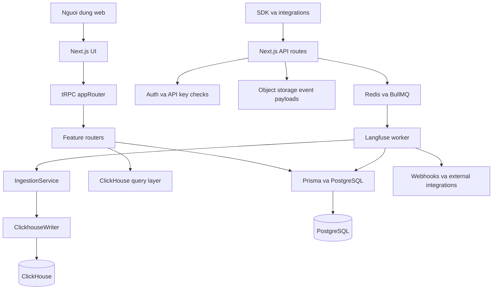
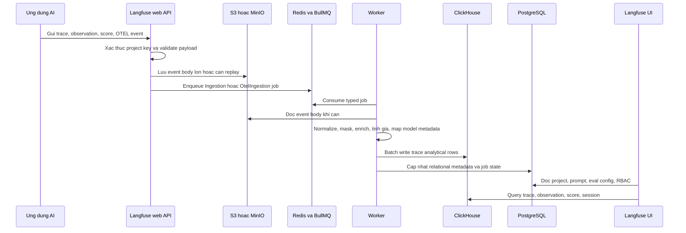
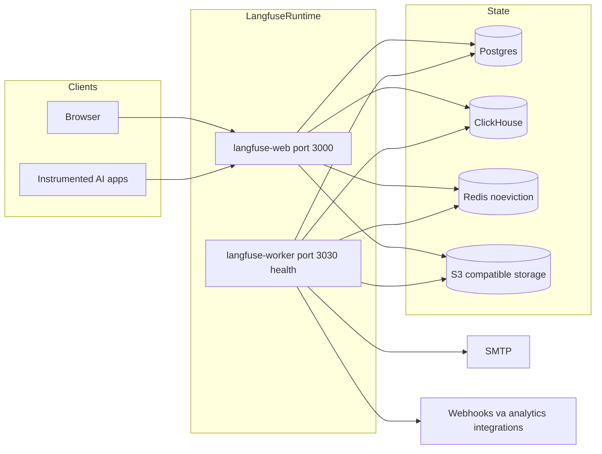
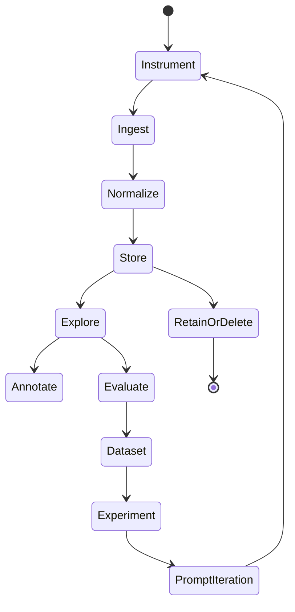
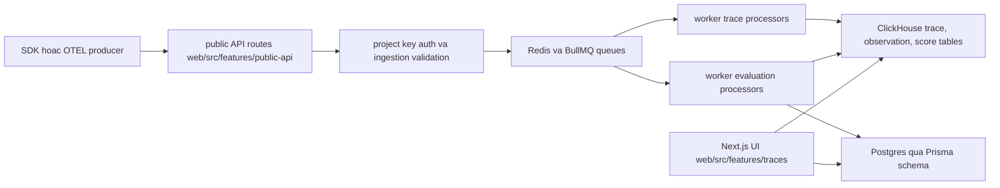
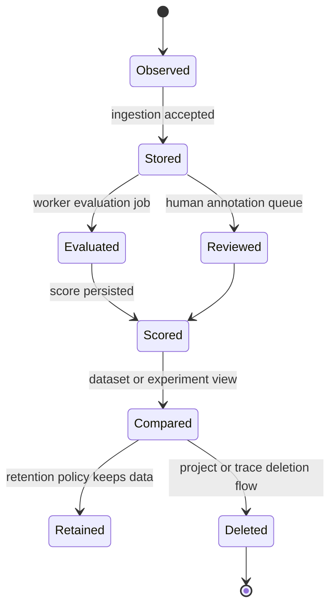
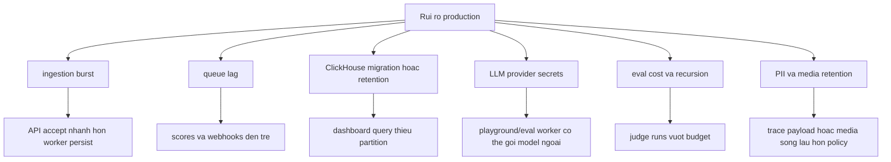

# Ghi chú kiến trúc Langfuse

## Tóm tắt điều hành

Langfuse là nền tảng LLM engineering mã nguồn mở dùng cho tracing, quản lý prompt, dataset, đánh giá, playground và tự động hóa LLMOps. Trong repository này, Langfuse được tổ chức như một TypeScript monorepo: `web/` là ứng dụng Next.js và lớp API, `worker/` xử lý các tác vụ nền qua queue, còn `packages/shared/` chứa schema miền dùng chung, truy cập Prisma, truy cập ClickHouse, logic ingestion, định nghĩa queue và các query builder. File gốc `package.json` cho biết phiên bản `3.178.0`, Node `24`, `pnpm@11.1.3`, cùng các tác vụ Turborepo cho build, typecheck, lint, test, phát triển, migrate database và hạ tầng local.

Kiến trúc repo hướng đến quan sát LLM ở lưu lượng cao. Metadata vận hành, định danh, cấu hình dự án và trạng thái workflow nằm trong PostgreSQL qua Prisma. Dữ liệu trace/event có tính phân tích nằm trong ClickHouse. Công việc nền được điều phối qua Redis và BullMQ. Payload lớn, media, batch export và dữ liệu cần replay đi qua object storage tương thích S3. File `docker-compose.yml` thể hiện rõ topology này với các service `langfuse-web`, `langfuse-worker`, `postgres`, `clickhouse`, `redis` và `minio`.

## Bài toán được giải quyết

Langfuse lấp khoảng trống giữa log ứng dụng thô và các câu hỏi thực tế của nhóm AI: prompt version nào tạo ra câu trả lời này, bước retrieval nào lỗi, session của người dùng tốn bao nhiêu chi phí, trace nào cần người kiểm tra, và liệu biến thể prompt hoặc model mới có làm giảm chất lượng trên dataset kiểm thử hay không. Thay vì buộc đội ngũ ghép dữ liệu từ logging backend tổng quát, Langfuse đưa trace, generation, score, dataset, comment, annotation, prompt, model metadata và evaluation result thành các khái niệm sản phẩm trực tiếp.

## Vai trò trong AI stack

Trong một nền tảng AI lớn hơn, Langfuse nằm ở lớp control plane của LLMOps:

- Nhận dữ liệu từ ứng dụng, agent, pipeline RAG, model gateway và SDK instrumentation.
- Phục vụ analyst, prompt engineer, evaluator, nhóm annotation và người xử lý incident.
- Bổ sung cho model gateway: gateway tập trung vào routing, credential, rate limit và policy; Langfuse tập trung vào hành vi, chất lượng, chi phí và debug.
- Bổ sung cho data warehouse: Langfuse cung cấp workflow có ngữ cảnh trace, prompt và eval trước khi dữ liệu được export hoặc archive.

## Bản đồ source tree

Bằng chứng chính trong repository:

- `README.md` mô tả các năng lực chính: LLM observability, prompt management, evaluations, datasets, playground, API, SDK, integrations, cloud và self-hosting.
- `package.json` định nghĩa Turborepo workspace, phiên bản Node/pnpm, các script `dev`, `build`, `typecheck`, `test`, `infra:dev:up`, `db:migrate`, `db:seed`.
- `web/src/server/api/root.ts` ghép router tRPC chính cho traces, observations, sessions, scores, datasets, prompts, evals, experiments, annotation queues, dashboards, monitors, integrations, billing, RBAC, API keys, audit logs, media, batch exports và batch actions.
- `web/src/pages/api/trpc/[trpc].ts` là handler cho tRPC API.
- `web/src/pages/api/public/traces/index.ts` thể hiện bề mặt public hoặc legacy ingestion.
- `packages/shared/src/db.ts` tập trung hóa truy cập Prisma.
- `packages/shared/src/server/queues.ts` định nghĩa payload queue có kiểu như `IngestionEvent`, `OtelIngestionEvent`, batch export, deletion, dataset, eval, retention, integration jobs, cùng `QueueName`, `QueueJobs` và `TQueueJobTypes`.
- `packages/shared/src/server/ingestion/` chứa tiện ích validate, enrich và xử lý batch ingestion.
- `packages/shared/src/server/clickhouse/` và `packages/shared/src/server/queries/clickhouse-sql/` chứa ClickHouse client, schema helper, query tracking, SQL fragment, filter, full-text search và event query builder.
- `worker/src/queues/` chứa processor cho ingestion, OTEL ingestion, eval, code eval, experiment, webhook, deletion, data retention, batch export, batch action, cloud metering và integration.
- `worker/src/services/IngestionService/index.ts` và `worker/src/services/ClickhouseWriter/index.ts` là lõi của write path ingestion.
- `worker/src/instrumentation.ts` cấu hình OpenTelemetry instrumentation cho Prisma và BullMQ.
- `docker-compose.yml` mô tả topology self-host tham chiếu với Postgres, ClickHouse, Redis, MinIO, web và worker.

## Khái niệm cốt lõi

- **Trace**: một request hoặc workflow của người dùng, thường gồm nhiều observation và model call lồng nhau.
- **Observation hoặc generation**: sự kiện giống span cho model call, tool call, retrieval, embedding, agent action hoặc logic tùy biến của ứng dụng.
- **Score**: tín hiệu chất lượng do người dùng, hệ thống tự động hoặc evaluator tạo ra và gắn vào trace, observation, session hoặc dataset run.
- **Prompt**: tài sản prompt được quản lý, version hóa và dùng bởi ứng dụng hoặc playground.
- **Dataset và experiment**: bộ ví dụ tái sử dụng và các lần chạy dùng cho regression test, so sánh prompt và kiểm soát trước release.
- **Annotation queue**: workflow review cho human labeling, triage và thu thập feedback.
- **Ingestion event**: sự kiện có kiểu được API nhận vào, có thể được lưu qua object storage, sau đó xử lý bất đồng bộ vào ClickHouse và relational state.
- **Evaluation job**: tác vụ batch hoặc trigger-driven áp dụng LLM-as-judge, code evaluator hoặc scoring ở cấp observation.

## Kiến trúc nội bộ

Ứng dụng web chịu trách nhiệm tương tác người dùng, xác thực, phân quyền theo project và các API đồng bộ. `web/src/server/api/root.ts` là điểm đọc tốt nhất vì file này liệt kê các module sản phẩm tạo thành hợp đồng API nội bộ. Các thư mục feature trong `web/src/features/` sở hữu hành vi domain như dataset, prompt, experiment, public API key, RBAC, batch export, table view, evaluation, LLM tool và integration.

`packages/shared/` là lớp hợp đồng giữa web và worker. Lớp này ngăn hai process tự định nghĩa event shape khác nhau. Queue schema trong `packages/shared/src/server/queues.ts` đặc biệt quan trọng: một job ingestion, deletion, export hoặc evaluation phải hợp lệ trước khi được xử lý. Phần ClickHouse trong `packages/shared/src/server/clickhouse/` và `packages/shared/src/server/queries/clickhouse-sql/` cô lập chi tiết analytical storage khỏi feature router.

Worker chịu trách nhiệm độ bền và side effect. Nó consume Redis/BullMQ queue, validate payload, enrich ingestion, ghi ClickHouse, cập nhật Postgres, chạy eval, gửi webhook, thực thi retention/deletion và thu thập queue metrics.

## Luồng runtime và dữ liệu

Quyết định kiến trúc quan trọng nhất là tách bước nhận ingestion khỏi bước xử lý ingestion. API route nên trả lời nhanh sau khi xác thực, validate, upload object và đưa job vào queue. Worker xử lý phần tốn tài nguyên hoặc dễ lỗi như enrich và ghi ClickHouse. Thiết kế này hỗ trợ replay: `worker/src/scripts/replayIngestionEventsV2/README.md` mô tả cách replay ingestion lỗi từ S3 key qua admin API vào `IngestionSecondaryQueue` hoặc `OtelIngestionQueue`.

## Topology triển khai và vận hành

`docker-compose.yml` ràng buộc hầu hết backing service vào localhost và chỉ để web cùng MinIO ở dạng có thể truy cập trực tiếp trong kịch bản local. Production nên giữ nguyên tinh thần đó: web/API là entrypoint bên ngoài, còn Postgres, Redis, ClickHouse và object storage nằm trong mạng riêng. Các nhóm cấu hình quan trọng gồm `DATABASE_URL`, `NEXTAUTH_SECRET`, `SALT`, `ENCRYPTION_KEY`, `CLICKHOUSE_URL`, `CLICKHOUSE_*`, `REDIS_*`, `LANGFUSE_S3_EVENT_UPLOAD_*`, `LANGFUSE_S3_MEDIA_UPLOAD_*`, `LANGFUSE_S3_BATCH_EXPORT_*`, SMTP và biến khởi tạo org/project/user đầu tiên.

## Vòng đời và phụ thuộc module

Vòng đời này ánh xạ trực tiếp vào source. Instrumentation đi vào public API routes. Validate và transform ingestion nằm trong `packages/shared/src/server/ingestion/` và worker ingestion services. Storage dùng Prisma/Postgres cho relational state và ClickHouse cho bảng trace phân tích. Exploration nằm trong feature router, UI dưới `web/src/features/` và ClickHouse query builder. Annotation queue, eval router, experiment, dataset và prompt router khép kín vòng lặp từ trace production đến cải tiến có kiểm soát.

## Điểm mở rộng

- Thêm năng lực API sản phẩm bằng cách tạo hoặc mở rộng feature router và đăng ký trong `web/src/server/api/root.ts`.
- Thêm public ingestion hoặc admin route dưới `web/src/pages/api/` khi route đó không phù hợp với tRPC.
- Thêm background job bền vững bằng cách định nghĩa Zod schema trong `packages/shared/src/server/queues.ts`, thêm queue trong `worker/src/queues/` và đăng ký xử lý ở `worker/src/queues/workerManager.ts`.
- Thêm transform hoặc validate ingestion trong `packages/shared/src/server/ingestion/` và worker ingestion services.
- Thêm query phân tích trong `packages/shared/src/server/queries/clickhouse-sql/`.
- Thêm integration hướng provider hoặc framework theo các mẫu OpenAI, LangChain, LlamaIndex, LiteLLM, Vercel AI SDK và webhook hiện có.
- Đặt hành vi enterprise-only trong `ee/` hoặc `web/src/ee/` để không trộn mã theo license vào đường OSS.

## Tích hợp

README liệt kê SDK và framework integration cho Python và JS/TS, OpenAI, LangChain, LlamaIndex, Haystack, LiteLLM, Vercel AI SDK, Mastra, Amazon Bedrock, AutoGen, Flowise, Langflow, Dify, OpenWebUI, Promptfoo, CrewAI và nhiều provider hoặc app builder khác. Trong repository, hành vi integration xuất hiện ở product router, ingestion adapter, webhook processor, blob storage integration queue, PostHog/Mixpanel integration queue và các test chuyển đổi framework trace trong `worker/src/__tests__/chatml/`.

## Cấu hình, triển khai và vận hành

Các run mode nằm trong script gốc: hạ tầng local qua `infra:dev:up`, phát triển qua `dev:web` và `dev:worker`, build/test/typecheck qua Turborepo. Thay đổi database đi qua các script workspace như `db:migrate`, `db:generate` và `db:seed`.

Khi vận hành, cần theo dõi:

- Độ sâu queue và tỷ lệ lỗi của ingestion, OTEL ingestion, eval, deletion, retention, webhook và batch export.
- ClickHouse resource error được xử lý trong tRPC error handling tại `web/src/server/api/trpc.ts`.
- Memory policy và kết nối Redis vì BullMQ phụ thuộc Redis và compose dùng `noeviction`.
- Tính sẵn sàng của object storage cho event upload, media upload, replay và batch export.
- Trạng thái migration Postgres và sức khỏe kết nối Prisma.
- Health và readiness endpoint của worker trong `worker/src/api/index.ts`.

## Observability, testing, evaluation và failure modes

Repository có nhiều test trong `worker/src/__tests__/`, `worker/src/queues/__tests__/`, `worker/src/services/IngestionService/tests/`, `web/src/__tests__/` và test ở package. Tên test cho thấy các vùng rủi ro được kiểm soát: ingestion masking, process event batch, OTEL conversion, queue processing, eval execution, model matching, secure LLM fetch, outbound connection validation, webhook, retention cleaning, deletion, batch export, pricing và ClickHouse writer.

Các failure mode thường gặp:

- **Ingestion backlog**: queue Redis tăng, worker concurrency thiếu hoặc ghi ClickHouse chậm.
- **Trace bị thiếu một phần**: payload đã vào object storage nhưng queue processing lỗi; replay script là đường khôi phục.
- **Áp lực ClickHouse**: lỗi tài nguyên khi query cần được hiển thị rõ và xử lý bằng tuning hoặc tăng capacity.
- **Evaluator drift**: prompt hoặc model version của LLM-as-judge thay đổi làm score khó so sánh nếu evaluator config không được version hóa.
- **Rò rỉ secret**: trace có thể chứa prompt, input người dùng, retrieved document, tool argument hoặc API output; masking và retention là kiểm soát bắt buộc.
- **Vòng lặp webhook hoặc integration**: đích bên ngoài lỗi có thể khuếch đại retry nếu thiếu backoff và dead-letter handling.

## Rủi ro bảo mật và quản trị

Hãy xem Langfuse như telemetry production nhạy cảm. Nó lưu prompt người dùng, output, tham số tool, retrieval context, mức sử dụng model, score, comment và có thể cả dữ liệu chịu quy định. Kiểm soát cần có gồm API key theo project, `NEXTAUTH_SECRET` mạnh, xoay vòng `ENCRYPTION_KEY`, backing service trong mạng riêng, TLS, RBAC, SSO khi cần, review audit log, outbound network validation, retention policy, object storage lifecycle rule và masking PII/secret trước ingestion.

File compose có nhiều giá trị mẫu `CHANGEME` cho password và secret mật mã. Các giá trị mặc định đó chỉ dành cho local setup. Production cũng phải chặn truy cập trực tiếp vào ClickHouse, Redis, Postgres và object storage, chỉ cho phép các service Langfuse kết nối.

## Hướng dẫn đọc

1. Bắt đầu với `README.md` để nắm phạm vi sản phẩm và integration được hỗ trợ.
2. Đọc `package.json`, `pnpm-workspace.yaml` và `turbo.json` để hiểu monorepo và build graph.
3. Đọc `docker-compose.yml` để hiểu phụ thuộc runtime.
4. Đọc `web/src/server/api/root.ts` và `web/src/server/api/trpc.ts` để thấy biên API của ứng dụng.
5. Đọc `packages/shared/src/server/queues.ts`, `packages/shared/src/server/ingestion/` và `packages/shared/src/server/clickhouse/` để nắm hợp đồng giữa process.
6. Đọc `worker/src/queues/workerManager.ts`, các queue processor, `worker/src/services/IngestionService/index.ts` và `worker/src/services/ClickhouseWriter/index.ts` để hiểu xử lý bất đồng bộ.
7. Dùng test trong `worker/src/__tests__/` và `worker/src/queues/__tests__/` để học cách hệ thống xử lý lỗi.

## Lộ trình học

1. Đi qua quickstart trong README ở mức khái niệm: project, API key, SDK ingestion.
2. Theo dấu một event từ public API route đến queue schema, worker processor và ClickHouse writer.
3. Nghiên cứu một tRPC feature router, rồi tìm UI feature và test tương ứng.
4. Nghiên cứu một luồng eval từ lựa chọn dataset hoặc observation đến eval queue và score writeback.
5. Review biến triển khai và quyết định secret, retention setting, storage policy nào cần cho môi trường của bạn.
6. Chỉ chạy hạ tầng dev local sau khi đã rõ kiến trúc; tác vụ tài liệu này không cài dependency và không khởi động service.

## Thuật ngữ

- **BullMQ**: thư viện queue dựa trên Redis dùng bởi worker.
- **ClickHouse**: cơ sở dữ liệu cột dùng cho truy vấn trace và event lưu lượng cao.
- **Prisma**: ORM TypeScript dùng cho relational state trong Postgres.
- **tRPC**: framework API có kiểu dùng bởi ứng dụng Next.js.
- **OTEL**: đường OpenTelemetry cho ingestion và instrumentation nội bộ.
- **Score**: tín hiệu chất lượng dạng số hoặc nhãn gắn vào hành vi AI đã quan sát.
- **Dataset run**: lần chạy ứng dụng hoặc prompt trên dataset để regression và so sánh.
- **Annotation queue**: workflow review của con người cho label và quality feedback.

## Deep Dive Bám Theo Repository

Nên đọc Langfuse trước hết như một hệ thống event lưu lượng cao, sau đó mới là dashboard. Cấu trúc source củng cố cách nhìn này: `web/src/features/public-api/` và `web/src/features/traces/` định nghĩa ingestion và hành vi sản phẩm xoay quanh trace; `worker/src/features/traces/`, `worker/src/features/evaluation/`, `worker/src/features/scores/` và `worker/src/features/datasets/` xử lý công việc bất đồng bộ; `packages/shared/prisma/schema.prisma` giữ relational state cho project; còn `packages/shared/clickhouse/migrations/` mô tả analytical store cho trace/event. API sinh từ `fern/apis/` và ví dụ môi trường như `.env.prod.example` là contract vận hành cần review cùng nhau.

Một trace có hai vòng đời: vòng đời ingest để raw observations trở nên durable và queryable, và vòng đời chất lượng để gắn score, annotation, eval result hoặc so sánh dataset run. Reviewer senior nên tách hai đường này. ClickHouse tối ưu cho event analytics và khám phá trace, còn Postgres/Prisma giữ organizations, projects, API keys, users, prompts, datasets, score configs và workflow metadata. Nếu nhập nhằng hai trách nhiệm này, quyết định migration và retention sẽ dễ sai.

### Checklist Sẵn Sàng Production

- Capacity-plan ingestion tách khỏi UI traffic. Public API endpoints, Redis queues, workers, ClickHouse writes và dashboard queries có bottleneck khác nhau.
- Xem `packages/shared/prisma/schema.prisma` và `packages/shared/clickhouse/migrations/` như state được version chung. Deploy đổi một store mà không đổi store kia có thể làm hỏng trace exploration hoặc score joins.
- Đưa deletion, retention, media cleanup và project cleanup worker vào runbook sự cố; code liên quan nằm ở `worker/src/features/batch-project-cleaner/`, `batch-project-media-cleaner/`, `batch-trace-deletion-cleaner/` và `media-retention-cleaner/`.
- Review outbound model calls từ playground và evaluation flows. `worker/src/features/evaluation/`, `web/src/features/playground/` và `web/src/features/llm-api-key/` là vùng nhạy cảm bảo mật.
- Định nghĩa masking và PII policy trước khi rollout SDK. Trace payload thường chứa prompt, retrieved document, tool argument và model output.
- Monitor ingestion error rate, queue depth, worker retry count, ClickHouse insert latency, ClickHouse query latency, Postgres connection saturation và eval spend.
- Xác nhận annotation queues, score configs, dataset runs và experiments nằm trong backup/restore test, không chỉ raw traces.

### Hướng Dẫn Đọc Cho Senior Architect

Bắt đầu với `docker-compose.yml` và `.env.prod.example` để hiểu runtime dependencies. Sau đó đọc `packages/shared/prisma/schema.prisma` và `packages/shared/clickhouse/migrations/` để tách relational state khỏi event analytics. Tiếp theo trace một ingest endpoint trong `web/src/features/public-api/` vào worker processors ở `worker/src/features/traces/`. Cuối cùng đọc `web/src/features/evals/`, `worker/src/features/evaluation/` và `web/src/features/datasets/` để hiểu cách Langfuse biến hành vi quan sát được thành quality signal có governance.

### Kịch Bản Vận Hành Cần Diễn Tập

Trước khi xem Langfuse là hạ tầng LLMOps production, nên diễn tập ba kịch bản cụ thể. Thứ nhất, gửi burst traces có nested tool calls, media và scores, rồi kiểm tra queue lag, ClickHouse inserts, dashboard filters và deletion behavior. Thứ hai, chạy evaluator trên dataset trong lúc LLM provider chậm hoặc unavailable, rồi inspect retries, score writeback và cost reporting. Thứ ba, rotate project API keys và provider credentials, rồi xác nhận ingestion, playground, webhooks và annotation queues vẫn tôn trọng project boundaries dự kiến.
