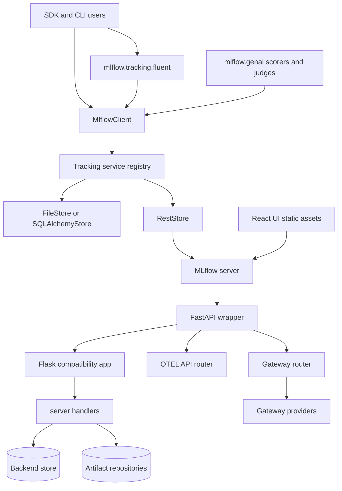
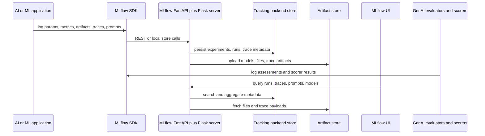
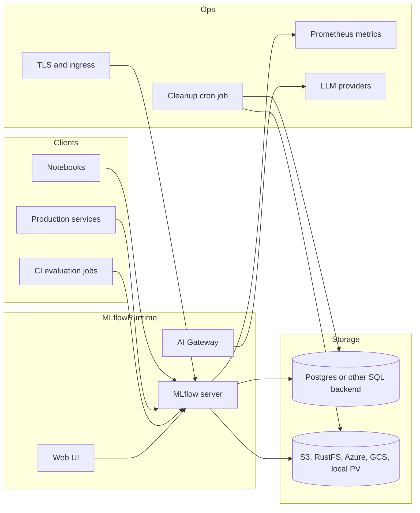
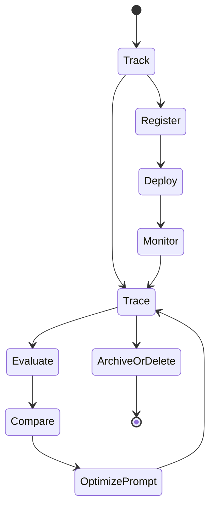
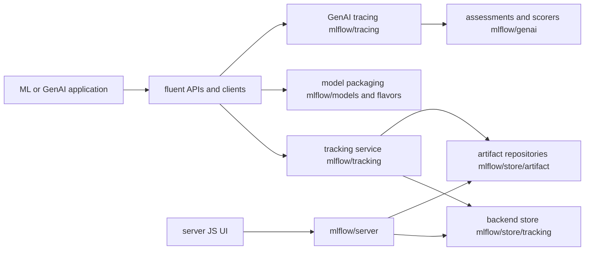
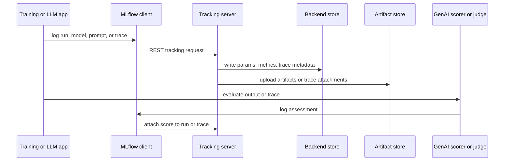
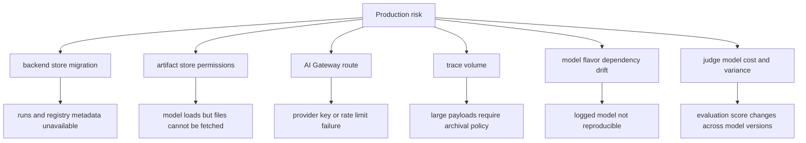

# MLflow Architecture Notes

## Executive summary

MLflow is a broad AI engineering platform for agents, LLM applications, and traditional ML models. The README positions it as a platform for debugging, evaluation, monitoring, prompt management, prompt optimization, AI Gateway governance, experiment tracking, model registry, and deployment. The repository is correspondingly large: `mlflow/` contains the Python package, `docs/` contains documentation, `examples/` demonstrates workflows, `tests/` mirrors the package structure, `charts/` provides Kubernetes deployment, and `docker-compose/` provides a local Postgres plus S3-compatible artifact store setup.

The root `pyproject.toml` identifies version `3.13.1.dev0`, Python `>=3.10`, and dependencies including Flask, FastAPI, SQLAlchemy, Alembic, OpenTelemetry, Huey, Databricks SDK, Docker, Graphene, Pydantic, Uvicorn, and many integration libraries. MLflow is not a single-purpose observability tool. It is a platform with a tracking server, artifact stores, model registry, prompt registry, tracing APIs, GenAI evaluation, scorers, judges, gateway routing, deployment providers, and a React UI served by the Python server.

## Problem solved

MLflow solves lifecycle fragmentation. AI teams need to track runs and metrics, store artifacts, manage models, inspect LLM traces, compare prompts, evaluate agent quality, govern model-provider access, and deploy assets. Without a platform, these concerns scatter across notebooks, object stores, model APIs, APM tools, spreadsheets, and custom dashboards. MLflow provides a common tracking API, server, storage model, UI, and extension system that spans classic ML and modern GenAI workflows.

## AI stack role

In an AI solution architecture, MLflow can play several roles:

- **Experiment system of record** for parameters, metrics, tags, artifacts, datasets, and runs.
- **Model and prompt registry** for lifecycle, versioning, aliases, lineage, and promotion.
- **LLM tracing backend** for OpenTelemetry-compatible traces, spans, assessments, sessions, and trace metrics.
- **Evaluation platform** through `mlflow.genai.evaluation`, built-in scorers, third-party scorer integrations, and judges.
- **Gateway** for provider routing, rate limits, traffic splitting, credential indirection, guardrails, and OpenAI-compatible style access.
- **Deployment bridge** to cloud and serving systems through deployment and model flavor integrations.

## Source tree map

Repository evidence:

- `README.md` describes MLflow for agents, LLMs, and ML models, with observability, evaluation, prompt management, prompt optimization, AI Gateway, tracking, model registry, and deployment.
- `pyproject.toml` defines package metadata, dependencies, optional extras, CLI entrypoint `mlflow = "mlflow.cli:cli"`, and entry points for `mlflow.app`, `mlflow.app.client`, and `mlflow.deployments`.
- `mlflow/server/__init__.py` creates the Flask app, initializes security middleware, registers handler endpoints, serves UI assets, exposes health/version endpoints, serves artifacts, exposes trace artifacts, and optionally activates Prometheus exporter.
- `mlflow/server/fastapi_app.py` wraps the Flask app in FastAPI, adds FastAPI security, workspace middleware, gateway timing middleware, OTEL API router, job API router, gateway router, assistant router, then mounts Flask at root for compatibility.
- `mlflow/gateway/app.py` defines `GatewayAPI`, dynamic endpoints, traffic routes, rate limits, provider lookup, chat/completions/embeddings handlers, config loading from path or environment, and Swagger support.
- `mlflow/store/tracking/abstract_store.py` defines the tracking store contract for experiments, runs, traces, trace archival, sessions, assessments, prompts, datasets, and trace metrics.
- `mlflow/store/tracking/sqlalchemy_store.py`, `file_store.py`, and `rest_store.py` implement store backends.
- `mlflow/tracking/client.py` defines `MlflowClient`, while `mlflow/tracking/fluent.py` provides the user-facing fluent API.
- `mlflow/tracing/`, `mlflow/entities/span.py`, and trace entity modules represent tracing concepts.
- `mlflow/genai/` contains evaluation, scorers, judges, datasets, prompts, prompt optimization, discovery, scheduled scorers, and online scoring processors.
- `mlflow/genai/scorers/` includes built-ins plus integrations with Phoenix, Ragas, Deepeval, TruLens, Google ADK, guardrails, and online trace/session processors.
- `mlflow/gateway/providers/` contains provider implementations for OpenAI, Anthropic, Bedrock, Databricks, Gemini, Groq, Hugging Face, LiteLLM, Mistral, Ollama, OpenRouter, Together AI, Vertex AI, and others.
- `docker-compose/docker-compose.yml` runs local MLflow with Postgres and RustFS S3-compatible storage.
- `charts/` contains Helm templates and values for Kubernetes, backend store URI, artifact destination, Prometheus exposure, TLS, and cleanup cron jobs.

## Core concepts

- **Experiment**: logical namespace for runs and traces.
- **Run**: execution record with parameters, metrics, tags, artifacts, datasets, and models.
- **Artifact**: file or object stored under a run or model version; can be local, S3, Azure Blob, GCS, DBFS, or another supported store.
- **Tracking store**: metadata backend implemented by file, SQLAlchemy, REST, or workspace-aware stores.
- **Trace and span**: GenAI/agent execution telemetry with nested calls, timing, inputs, outputs, attributes, assessments, and linked prompts or runs.
- **Assessment or scorer result**: evaluation signal logged against a trace or span.
- **Prompt version**: managed prompt registry entity, often linked to traces and evaluations.
- **Gateway endpoint or route**: configured model-provider access point, optionally with traffic split, rate limit, and guardrails.
- **Flavor**: model packaging integration for a framework or model type.

## Internal architecture

MLflow deliberately preserves backward compatibility. `mlflow/server/__init__.py` still owns the Flask app and registers the long-standing REST and AJAX handlers. `mlflow/server/fastapi_app.py` wraps that Flask app with FastAPI so newer routers can take precedence for OTEL, jobs, gateway, and assistant functionality. This layered approach allows modern GenAI endpoints to evolve without breaking existing tracking clients.

The store contract is central. `AbstractStore` defines experiment/run operations but also newer trace APIs such as `start_trace`, `get_trace`, `search_traces`, trace deletion, archival, trace metrics, assessment logging, session queries, prompt-to-trace links, and run-to-trace links. Concrete stores decide whether they support each operation and how persistence is implemented.

## Runtime and data flow

The same client abstractions can target local file stores, database stores, Databricks-backed stores, or a remote MLflow server. In a local script, store calls may not cross a network boundary. In a shared deployment, the SDK talks to the tracking server, and the server writes metadata to a backend database while storing large artifacts in object storage.

For GenAI tracing, model-provider integrations and autologging can emit spans and traces. The server exposes trace artifacts for UI rendering, and `mlflow.genai` can attach assessments through scorers and judges. Prompt versions can be linked to traces so quality regressions have lineage.

## Deployment and operations topology

The local `docker-compose/` topology runs Postgres, RustFS as S3-compatible artifact storage, an initialization container for the bucket, and the MLflow server. Key variables include `MLFLOW_BACKEND_STORE_URI`, `MLFLOW_ARTIFACTS_DESTINATION`, `MLFLOW_S3_ENDPOINT_URL`, `AWS_ACCESS_KEY_ID`, `AWS_SECRET_ACCESS_KEY`, `MLFLOW_HOST`, and `MLFLOW_PORT`.

The Helm chart in `charts/` supports a Kubernetes server with backend store URI, registry store URI, default artifact root, artifacts destination, env injection, Prometheus exposure, TLS, persistence for local storage, and a cleanup cron job for deleted runs/experiments/artifacts. The chart README explicitly warns that SQLite and local file storage are not suitable for production or high concurrency.

## Lifecycle and module dependency diagram

This lifecycle spans both traditional ML and GenAI. Classic tracking logs experiments and runs. Registry and deployment promote models or prompts. Tracing captures online behavior. Evaluation and scorers attach quality signals. Prompt optimization and discovery modules feed new versions back into the loop. Archive/delete paths protect storage and governance requirements.

## Extension points

- Add tracking behavior by extending store implementations or store registries under `mlflow/store/` and `mlflow/tracking/_tracking_service/`.
- Add server APIs through handlers, FastAPI routers, or app entry points declared in `pyproject.toml`.
- Add AI Gateway providers in `mlflow/gateway/providers/` and register them through provider lookup.
- Add scorers, judges, or evaluator integrations in `mlflow/genai/scorers/` and `mlflow/genai/judges/`.
- Add model framework support as a flavor under a dedicated `mlflow/<framework>/` package.
- Add deployment targets through `mlflow.deployments` entry points.
- Add artifact storage by implementing artifact repositories and registering schemes.
- Add UI behavior through `mlflow/server/js/` assets and corresponding server routes.

## Integrations

MLflow has one of the broadest integration surfaces in this group. Source directories include OpenAI, Anthropic, Bedrock, Gemini, Groq, LiteLLM, LlamaIndex, LangChain, LangGraph, CrewAI, AutoGen, DSPy, Pydantic AI, Semantic Kernel, Transformers, PyTorch, TensorFlow, sklearn, Spark, XGBoost, Azure, SageMaker, Kubernetes, Databricks, MCP, and many more. Gateway providers cover major LLM providers, while GenAI scorer integrations include Phoenix, Ragas, Deepeval, TruLens, Google ADK, guardrails, and online trace/session scoring.

## Configuration, deployment, and operations

Important configuration groups:

- Tracking server: backend store URI, registry store URI, artifact root, artifacts destination, serve-artifacts mode, host, port, worker/server options.
- Security: allowed hosts, CORS/host protections, Flask and FastAPI security middleware, basic auth plugin entrypoint, request auth/header providers.
- Artifacts: S3, Azure Blob, GCS, DBFS, local filesystem, RustFS/MinIO-compatible endpoints.
- Gateway: gateway config path, dynamic endpoints, traffic routes, rate limits storage URI, API key resolution from env or file.
- Observability: Prometheus exporter path, OpenTelemetry APIs, gateway timing headers, server health endpoint.
- Cleanup and retention: trace archival, deleted run/artifact cleanup, cron job templates.

Production deployments should use a relational backend such as Postgres or MySQL for metadata, object storage for artifacts, TLS at ingress, configured allowed hosts, explicit authentication, and secret-backed credentials. Local SQLite and local artifacts are useful for experiments but are not a production design.

## Observability, testing, evaluation, and failure modes

The `tests/` directory mirrors most package areas: tracking, stores, server, gateway, GenAI, tracing, model flavors, integrations, artifacts, deployment, and CLI. The source itself includes observability hooks: Prometheus exporter activation in `mlflow/server/__init__.py`, OTEL API routing in `fastapi_app.py`, gateway timing middleware, trace metrics store APIs, and online scoring processors in `mlflow/genai/scorers/online/`.

Failure modes to plan for:

- **Backend store contention**: high-concurrency tracking and trace search can overload SQLite or undersized SQL databases.
- **Artifact inconsistency**: metadata can exist while object storage writes fail, especially with custom S3 endpoints.
- **Trace payload growth**: large prompts, tool outputs, or documents increase storage and UI fetch cost.
- **Gateway provider failures**: provider latency, streaming errors, credentials, and rate limits must be surfaced separately from MLflow overhead.
- **Evaluator non-determinism**: LLM judges and third-party metrics can drift across model versions.
- **Store capability mismatch**: not every store supports every newer trace, prompt, workspace, or archival feature.
- **Security misconfiguration**: host header, CORS, auth, and artifact serving settings can expose sensitive tracking data.

## Security and governance risks

MLflow can store model artifacts, datasets, prompt text, traces, tool inputs, generated outputs, provider credentials, and experiment metadata. Governance controls should include authentication and authorization, isolated artifact buckets, secret-backed store URIs, TLS, host allowlists, auditability around model/prompt promotion, retention policies, and clear separation between local dev and shared production tracking.

For GenAI, the biggest data risk is trace content. Inputs, retrieved context, tool arguments, and model outputs may include sensitive customer or enterprise data. Teams should define logging filters, retention windows, and access rules before enabling automatic tracing in production.

## Reading guide

1. Read `README.md` for product scope and quickstart.
2. Read `pyproject.toml` for dependencies, extras, and entry points.
3. Read `mlflow/server/__init__.py` and `mlflow/server/fastapi_app.py` for server architecture.
4. Read `mlflow/store/tracking/abstract_store.py` before reading concrete stores.
5. Read `mlflow/tracking/client.py` and `mlflow/tracking/fluent.py` to understand user-facing APIs.
6. Read `mlflow/tracing/` and trace entities for LLM observability.
7. Read `mlflow/genai/` for evaluation, scorers, judges, prompts, optimization, and online scoring.
8. Read `mlflow/gateway/app.py` and `mlflow/gateway/providers/` for model-provider governance.
9. Read `docker-compose/README.md` and `charts/README.md` for deployment tradeoffs.

## Learning path

1. Start with a basic run: parameters, metrics, artifacts.
2. Add a model or prompt registry workflow.
3. Add LLM tracing and inspect how traces are stored and rendered.
4. Add a scorer or judge and log assessments against traces.
5. Add an AI Gateway route and study provider routing and rate limits.
6. Move from local file/SQLite storage to a server with SQL backend and object storage.

## Glossary

- **Backend store**: database or file store for MLflow metadata.
- **Artifact store**: storage location for model files, run artifacts, and large trace artifacts.
- **Flavor**: framework-specific model packaging convention.
- **Gateway route**: configured path that forwards model requests to a provider or traffic split.
- **Assessment**: evaluation result attached to a trace or span.
- **Scorer**: reusable evaluator that produces metrics or labels.
- **Judge**: LLM-backed evaluator that applies a rubric or prompt.
- **Trace archival**: moving trace payloads out of the primary store for retention and cost control.

## Repository-Grounded Deep Dive

MLflow is not a single service boundary; it is a set of tracking, registry, artifact, model packaging, gateway, and GenAI tracing subsystems that can be run locally or behind a tracking server. The repository shows these boundaries in `github-repos/05-observability-evaluation-llmops/mlflow/mlflow/tracking/`, `mlflow/store/`, `mlflow/server/`, `mlflow/models/`, `mlflow/tracing/`, `mlflow/genai/`, `mlflow/gateway/`, and `mlflow/evaluation/`. Deployment assets in `docker/`, `docker-compose/`, and `charts/` should be read as operational examples, not as the architecture itself.

The core operational distinction is between metadata and bulk artifacts. Run parameters, metrics, tags, model versions, prompt registry entries, trace indexes, and assessments belong to backend stores. Model files, datasets, logs, media, and large trace attachments belong to artifact stores. If a production design does not name both stores and their backup policies, it is incomplete.

### Production Readiness Checklist

- Specify backend store, artifact store, tracking server, registry policy, and trace retention as separate design decisions.
- Review `mlflow/store/db_migrations/` before upgrading a SQL-backed tracking server; validate migration against a copy of production metadata.
- Test artifact access from the same runtime that serves models. A successful metadata read does not prove artifact credentials are valid.
- For GenAI tracing, review `mlflow/tracing/`, `mlflow/tracing/otel/translation/`, and `mlflow/genai/` to decide how traces, assessments, and archived payloads should be governed.
- If using AI Gateway, review `mlflow/gateway/config.py`, `provider_registry.py`, `providers/`, `budget.py`, and `guardrails.py`; provider routing is a security and cost boundary.
- Pin model flavors, environment files, and dependency constraints for production model promotion.
- Monitor tracking API latency, backend DB saturation, artifact upload/download failures, trace ingestion volume, gateway provider errors, and judge/evaluator spend.

### Senior Architect Reading Path

Start with `mlflow/tracking/` and `mlflow/server/` to understand API and server shape. Then read `mlflow/store/` to separate backend metadata stores from artifact repositories. Move to `mlflow/models/` and selected flavor packages for model packaging. Only then read `mlflow/tracing/`, `mlflow/genai/`, `mlflow/evaluation/`, and `mlflow/gateway/` to understand modern LLMOps features on top of the tracking substrate. Finish with `charts/`, `docker/`, and `tests/` to connect source behavior to deployment and compatibility checks.

### Operational Scenarios to Rehearse

Validate MLflow with workflows that cross subsystem boundaries. Log a run with parameters, metrics, a model artifact, and a dataset, then restore it from a different runtime to prove backend and artifact stores both work. Log a GenAI trace with attachments and assessments, then test archival and search behavior under retention limits. Route a gateway request through at least two providers with budget controls enabled, then observe how provider errors, guardrails, and tracking records appear in the same operational view.
