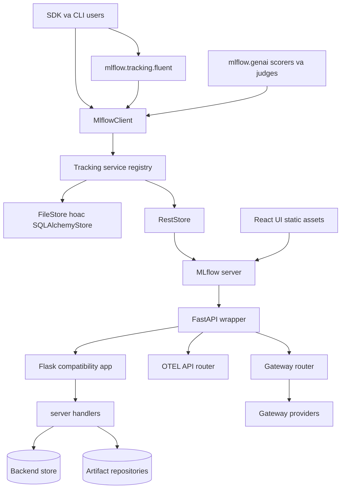
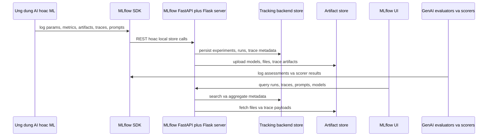
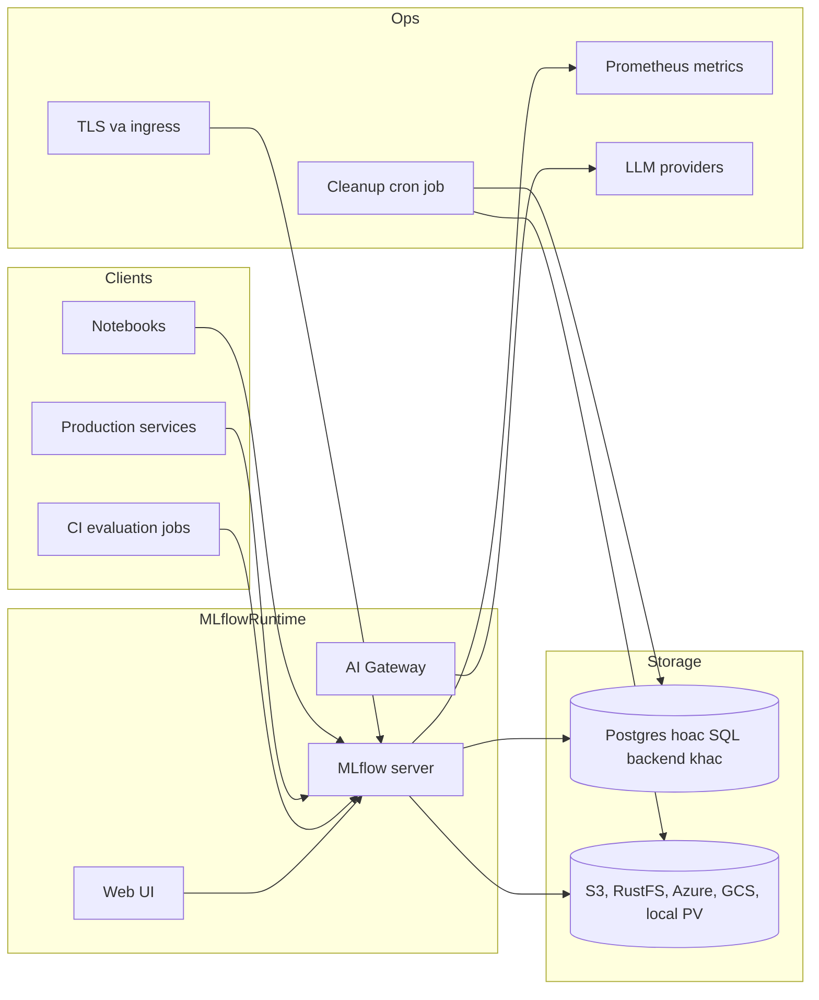
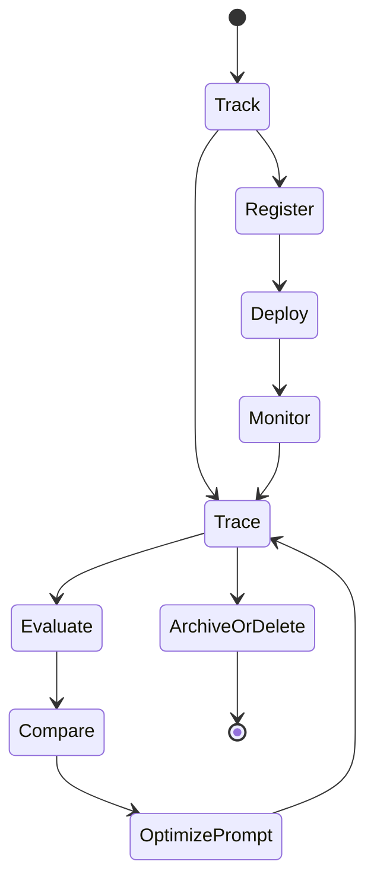
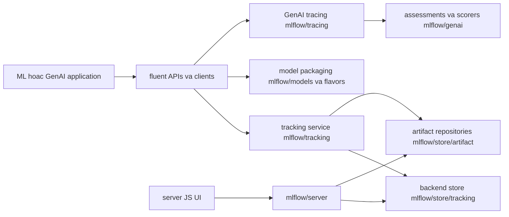
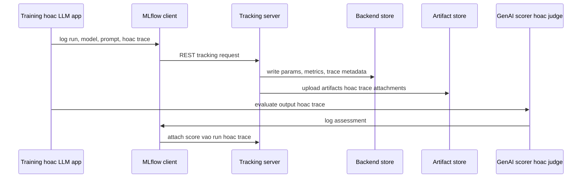
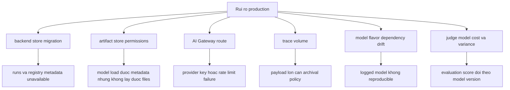

# Ghi chú kiến trúc MLflow

## Tóm tắt điều hành

MLflow là nền tảng AI engineering rộng cho agent, ứng dụng LLM và mô hình ML truyền thống. README định vị MLflow như nền tảng cho debugging, evaluation, monitoring, prompt management, prompt optimization, AI Gateway governance, experiment tracking, model registry và deployment. Repository vì vậy rất lớn: `mlflow/` chứa package Python, `docs/` chứa tài liệu, `examples/` minh họa workflow, `tests/` phản chiếu cấu trúc package, `charts/` cung cấp triển khai Kubernetes, còn `docker-compose/` cung cấp setup local với Postgres và object store tương thích S3.

File `pyproject.toml` cho biết phiên bản `3.13.1.dev0`, Python `>=3.10`, và dependency gồm Flask, FastAPI, SQLAlchemy, Alembic, OpenTelemetry, Huey, Databricks SDK, Docker, Graphene, Pydantic, Uvicorn cùng nhiều thư viện integration. MLflow không phải công cụ observability đơn mục đích. Nó là một platform với tracking server, artifact store, model registry, prompt registry, tracing API, GenAI evaluation, scorer, judge, gateway routing, deployment provider và React UI được phục vụ bởi Python server.

## Bài toán được giải quyết

MLflow giải quyết sự phân mảnh vòng đời. Nhóm AI cần tracking run và metric, lưu artifact, quản lý model, xem LLM trace, so sánh prompt, đánh giá chất lượng agent, quản trị truy cập model provider và deploy asset. Nếu thiếu nền tảng chung, các mảng này bị tách ra notebook, object store, model API, APM tool, spreadsheet và dashboard tự viết. MLflow cung cấp tracking API, server, storage model, UI và cơ chế extension chung cho cả ML truyền thống và workflow GenAI hiện đại.

## Vai trò trong AI stack

Trong kiến trúc giải pháp AI, MLflow có thể đảm nhận nhiều vai trò:

- **System of record cho experiment**: parameter, metric, tag, artifact, dataset và run.
- **Model và prompt registry**: lifecycle, versioning, alias, lineage và promotion.
- **LLM tracing backend**: trace, span, assessment, session và trace metric tương thích OpenTelemetry.
- **Evaluation platform**: qua `mlflow.genai.evaluation`, built-in scorer, integration scorer bên thứ ba và judge.
- **Gateway**: routing provider, rate limit, traffic splitting, credential indirection, guardrail và kiểu truy cập tương thích OpenAI.
- **Deployment bridge**: kết nối cloud và serving system qua deployment integration và model flavor.

## Bản đồ source tree

Bằng chứng trong repository:

- `README.md` mô tả MLflow cho agent, LLM và ML model, với observability, evaluation, prompt management, prompt optimization, AI Gateway, tracking, model registry và deployment.
- `pyproject.toml` định nghĩa package metadata, dependency, optional extra, CLI entrypoint `mlflow = "mlflow.cli:cli"`, entry point cho `mlflow.app`, `mlflow.app.client` và `mlflow.deployments`.
- `mlflow/server/__init__.py` tạo Flask app, khởi tạo security middleware, đăng ký handler endpoint, phục vụ UI asset, expose health/version endpoint, phục vụ artifact, expose trace artifact và có thể bật Prometheus exporter.
- `mlflow/server/fastapi_app.py` bọc Flask app bằng FastAPI, thêm FastAPI security, workspace middleware, gateway timing middleware, OTEL API router, job API router, gateway router, assistant router, rồi mount Flask ở root để giữ tương thích.
- `mlflow/gateway/app.py` định nghĩa `GatewayAPI`, dynamic endpoint, traffic route, rate limit, provider lookup, handler chat/completion/embedding, load config từ path hoặc environment và Swagger support.
- `mlflow/store/tracking/abstract_store.py` định nghĩa hợp đồng tracking store cho experiment, run, trace, trace archival, session, assessment, prompt, dataset và trace metric.
- `mlflow/store/tracking/sqlalchemy_store.py`, `file_store.py` và `rest_store.py` triển khai backend store.
- `mlflow/tracking/client.py` định nghĩa `MlflowClient`, còn `mlflow/tracking/fluent.py` cung cấp API fluent cho người dùng.
- `mlflow/tracing/`, `mlflow/entities/span.py` và các trace entity module biểu diễn khái niệm tracing.
- `mlflow/genai/` chứa evaluation, scorer, judge, dataset, prompt, prompt optimization, discovery, scheduled scorer và online scoring processor.
- `mlflow/genai/scorers/` gồm built-in scorer cùng integration Phoenix, Ragas, Deepeval, TruLens, Google ADK, guardrails và online trace/session processors.
- `mlflow/gateway/providers/` chứa implementation cho OpenAI, Anthropic, Bedrock, Databricks, Gemini, Groq, Hugging Face, LiteLLM, Mistral, Ollama, OpenRouter, Together AI, Vertex AI và nhiều provider khác.
- `docker-compose/docker-compose.yml` chạy MLflow local với Postgres và RustFS S3-compatible storage.
- `charts/` chứa Helm template và values cho Kubernetes, backend store URI, artifact destination, Prometheus exposure, TLS và cleanup cron job.

## Khái niệm cốt lõi

- **Experiment**: namespace logic cho run và trace.
- **Run**: bản ghi thực thi gồm parameter, metric, tag, artifact, dataset và model.
- **Artifact**: file hoặc object lưu dưới run hoặc model version; có thể ở local, S3, Azure Blob, GCS, DBFS hoặc store được hỗ trợ khác.
- **Tracking store**: backend metadata được triển khai bằng file, SQLAlchemy, REST hoặc workspace-aware store.
- **Trace và span**: telemetry thực thi GenAI/agent với call lồng nhau, timing, input, output, attribute, assessment và liên kết prompt/run.
- **Assessment hoặc scorer result**: tín hiệu evaluation được log vào trace hoặc span.
- **Prompt version**: entity trong prompt registry, thường được link với trace và evaluation.
- **Gateway endpoint hoặc route**: điểm truy cập model-provider được cấu hình, có thể có traffic split, rate limit và guardrail.
- **Flavor**: integration đóng gói model cho framework hoặc loại model.

## Kiến trúc nội bộ

MLflow cố ý giữ tương thích ngược. `mlflow/server/__init__.py` vẫn sở hữu Flask app và đăng ký các REST/AJAX handler lâu đời. `mlflow/server/fastapi_app.py` bọc Flask app bằng FastAPI để các router mới có ưu tiên cho OTEL, job, gateway và assistant. Cách phân lớp này cho phép endpoint GenAI hiện đại phát triển mà không phá client tracking cũ.

Hợp đồng store là trung tâm. `AbstractStore` định nghĩa operation experiment/run nhưng cũng gồm trace API mới như `start_trace`, `get_trace`, `search_traces`, trace deletion, archival, trace metrics, assessment logging, session query, prompt-to-trace link và run-to-trace link. Store cụ thể quyết định capability nào được hỗ trợ và persistence được thực hiện ra sao.

## Luồng runtime và dữ liệu

Cùng một lớp client abstraction có thể trỏ đến local file store, database store, store của Databricks hoặc remote MLflow server. Trong script local, store call có thể không đi qua network. Trong deployment dùng chung, SDK nói chuyện với tracking server, server ghi metadata vào backend database và lưu artifact lớn trong object storage.

Với GenAI tracing, model-provider integration và autologging có thể emit span và trace. Server expose trace artifact để UI render, còn `mlflow.genai` gắn assessment qua scorer và judge. Prompt version có thể link vào trace để regression chất lượng có lineage rõ ràng.

## Topology triển khai và vận hành

Topology local trong `docker-compose/` chạy Postgres, RustFS làm S3-compatible artifact storage, container khởi tạo bucket và MLflow server. Biến chính gồm `MLFLOW_BACKEND_STORE_URI`, `MLFLOW_ARTIFACTS_DESTINATION`, `MLFLOW_S3_ENDPOINT_URL`, `AWS_ACCESS_KEY_ID`, `AWS_SECRET_ACCESS_KEY`, `MLFLOW_HOST` và `MLFLOW_PORT`.

Helm chart trong `charts/` hỗ trợ Kubernetes server với backend store URI, registry store URI, default artifact root, artifacts destination, env injection, Prometheus exposure, TLS, persistence cho local storage và cleanup cron job cho run/experiment/artifact đã xóa. Chart README cảnh báo rõ SQLite và local file storage không phù hợp production hoặc high concurrency.

## Vòng đời và phụ thuộc module

Vòng đời này bao phủ cả ML truyền thống và GenAI. Classic tracking log experiment và run. Registry và deployment promote model hoặc prompt. Tracing ghi nhận hành vi online. Evaluation và scorer gắn tín hiệu chất lượng. Prompt optimization và discovery module tạo phiên bản mới quay lại vòng lặp. Archive/delete bảo vệ chi phí lưu trữ và yêu cầu governance.

## Điểm mở rộng

- Thêm tracking behavior bằng cách mở rộng store implementation hoặc store registry dưới `mlflow/store/` và `mlflow/tracking/_tracking_service/`.
- Thêm server API qua handler, FastAPI router hoặc app entry point khai báo trong `pyproject.toml`.
- Thêm AI Gateway provider trong `mlflow/gateway/providers/` và đăng ký qua provider lookup.
- Thêm scorer, judge hoặc evaluator integration trong `mlflow/genai/scorers/` và `mlflow/genai/judges/`.
- Thêm hỗ trợ framework model như một flavor dưới package `mlflow/<framework>/`.
- Thêm deployment target qua entry point `mlflow.deployments`.
- Thêm artifact storage bằng cách triển khai artifact repository và đăng ký scheme.
- Thêm hành vi UI qua asset `mlflow/server/js/` và route server tương ứng.

## Tích hợp

MLflow có bề mặt integration rộng nhất trong nhóm này. Source directory bao gồm OpenAI, Anthropic, Bedrock, Gemini, Groq, LiteLLM, LlamaIndex, LangChain, LangGraph, CrewAI, AutoGen, DSPy, Pydantic AI, Semantic Kernel, Transformers, PyTorch, TensorFlow, sklearn, Spark, XGBoost, Azure, SageMaker, Kubernetes, Databricks, MCP và nhiều hệ khác. Gateway provider bao phủ các LLM provider lớn, trong khi GenAI scorer integration gồm Phoenix, Ragas, Deepeval, TruLens, Google ADK, guardrails và online trace/session scoring.

## Cấu hình, triển khai và vận hành

Các nhóm cấu hình quan trọng:

- Tracking server: backend store URI, registry store URI, artifact root, artifacts destination, serve-artifacts mode, host, port, worker/server options.
- Security: allowed hosts, CORS/host protection, Flask và FastAPI security middleware, basic auth plugin entrypoint, request auth/header provider.
- Artifacts: S3, Azure Blob, GCS, DBFS, local filesystem, endpoint tương thích RustFS/MinIO.
- Gateway: gateway config path, dynamic endpoint, traffic route, rate limits storage URI, cách resolve API key từ env hoặc file.
- Observability: Prometheus exporter path, OpenTelemetry APIs, gateway timing headers, server health endpoint.
- Cleanup và retention: trace archival, cleanup run/artifact đã xóa, cron job template.

Production nên dùng relational backend như Postgres hoặc MySQL cho metadata, object storage cho artifact, TLS tại ingress, allowed hosts được cấu hình, authentication rõ ràng và credential qua secret. SQLite và artifact local hữu ích cho thí nghiệm nhưng không phải thiết kế production.

## Observability, testing, evaluation và failure modes

Thư mục `tests/` phản chiếu hầu hết vùng package: tracking, store, server, gateway, GenAI, tracing, model flavor, integration, artifact, deployment và CLI. Bản thân source có hook observability: bật Prometheus exporter trong `mlflow/server/__init__.py`, OTEL API routing trong `fastapi_app.py`, gateway timing middleware, API trace metrics trong store và online scoring processor trong `mlflow/genai/scorers/online/`.

Failure mode cần dự phòng:

- **Contention backend store**: tracking và trace search concurrency cao có thể quá tải SQLite hoặc SQL database nhỏ.
- **Artifact inconsistency**: metadata đã tồn tại nhưng object storage write lỗi, nhất là với S3 endpoint tùy biến.
- **Trace payload tăng lớn**: prompt, tool output hoặc document dài làm tăng chi phí storage và UI fetch.
- **Gateway provider failure**: latency provider, lỗi streaming, credential và rate limit phải được tách khỏi overhead của MLflow.
- **Evaluator không deterministic**: LLM judge và metric bên thứ ba có thể drift theo version model.
- **Store capability mismatch**: không phải store nào cũng hỗ trợ mọi tính năng mới về trace, prompt, workspace hoặc archival.
- **Sai cấu hình security**: host header, CORS, auth và artifact serving có thể làm lộ tracking data nhạy cảm.

## Rủi ro bảo mật và quản trị

MLflow có thể lưu model artifact, dataset, prompt text, trace, tool input, generated output, provider credential và experiment metadata. Kiểm soát governance nên gồm authentication và authorization, artifact bucket tách biệt, store URI lấy từ secret, TLS, host allowlist, audit quanh model/prompt promotion, retention policy và phân biệt rõ local dev với tracking production dùng chung.

Với GenAI, rủi ro dữ liệu lớn nhất là nội dung trace. Input, retrieved context, tool argument và model output có thể chứa dữ liệu khách hàng hoặc doanh nghiệp nhạy cảm. Team nên định nghĩa logging filter, retention window và access rule trước khi bật automatic tracing trong production.

## Hướng dẫn đọc

1. Đọc `README.md` để nắm phạm vi sản phẩm và quickstart.
2. Đọc `pyproject.toml` để hiểu dependency, extra và entry point.
3. Đọc `mlflow/server/__init__.py` và `mlflow/server/fastapi_app.py` để hiểu server architecture.
4. Đọc `mlflow/store/tracking/abstract_store.py` trước khi đọc concrete store.
5. Đọc `mlflow/tracking/client.py` và `mlflow/tracking/fluent.py` để hiểu API hướng người dùng.
6. Đọc `mlflow/tracing/` và trace entities cho LLM observability.
7. Đọc `mlflow/genai/` cho evaluation, scorer, judge, prompt, optimization và online scoring.
8. Đọc `mlflow/gateway/app.py` và `mlflow/gateway/providers/` cho governance model-provider.
9. Đọc `docker-compose/README.md` và `charts/README.md` cho tradeoff triển khai.

## Lộ trình học

1. Bắt đầu với run cơ bản: parameter, metric, artifact.
2. Thêm workflow model registry hoặc prompt registry.
3. Thêm LLM tracing và xem trace được lưu/render như thế nào.
4. Thêm scorer hoặc judge và log assessment vào trace.
5. Thêm AI Gateway route và nghiên cứu provider routing cùng rate limit.
6. Chuyển từ file/SQLite local sang server có SQL backend và object storage.

## Thuật ngữ

- **Backend store**: database hoặc file store cho metadata MLflow.
- **Artifact store**: vị trí lưu model file, run artifact và trace artifact lớn.
- **Flavor**: quy ước đóng gói model theo framework.
- **Gateway route**: path được cấu hình để forward model request đến provider hoặc traffic split.
- **Assessment**: kết quả evaluation gắn vào trace hoặc span.
- **Scorer**: evaluator tái sử dụng tạo metric hoặc label.
- **Judge**: evaluator dùng LLM áp dụng rubric hoặc prompt.
- **Trace archival**: chuyển trace payload ra khỏi primary store để kiểm soát retention và chi phí.

## Deep Dive Bám Theo Repository

MLflow không phải một service boundary duy nhất; nó là tập hợp các subsystem tracking, registry, artifact, model packaging, gateway và GenAI tracing, có thể chạy local hoặc sau tracking server. Repository thể hiện các ranh giới này trong `github-repos/05-observability-evaluation-llmops/mlflow/mlflow/tracking/`, `mlflow/store/`, `mlflow/server/`, `mlflow/models/`, `mlflow/tracing/`, `mlflow/genai/`, `mlflow/gateway/` và `mlflow/evaluation/`. Tài sản deployment trong `docker/`, `docker-compose/` và `charts/` nên được đọc như ví dụ vận hành, không phải toàn bộ kiến trúc.

Phân biệt vận hành cốt lõi là metadata và bulk artifacts. Run parameters, metrics, tags, model versions, prompt registry entries, trace indexes và assessments thuộc backend store. Model files, datasets, logs, media và trace attachments lớn thuộc artifact store. Nếu một thiết kế production không nêu rõ cả hai store và chính sách backup của chúng, thiết kế đó chưa đủ.

### Checklist Sẵn Sàng Production

- Chỉ định backend store, artifact store, tracking server, registry policy và trace retention như các quyết định thiết kế riêng.
- Review `mlflow/store/db_migrations/` trước khi upgrade tracking server dùng SQL; validate migration trên bản sao metadata production.
- Test artifact access từ đúng runtime dùng để serve model. Metadata read thành công không chứng minh artifact credentials hợp lệ.
- Với GenAI tracing, review `mlflow/tracing/`, `mlflow/tracing/otel/translation/` và `mlflow/genai/` để quyết định governance cho traces, assessments và archived payloads.
- Nếu dùng AI Gateway, review `mlflow/gateway/config.py`, `provider_registry.py`, `providers/`, `budget.py` và `guardrails.py`; provider routing là boundary bảo mật và chi phí.
- Pin model flavors, environment files và dependency constraints cho quy trình promote model lên production.
- Monitor tracking API latency, backend DB saturation, artifact upload/download failures, trace ingestion volume, gateway provider errors và judge/evaluator spend.

### Hướng Dẫn Đọc Cho Senior Architect

Bắt đầu với `mlflow/tracking/` và `mlflow/server/` để hiểu API và server shape. Sau đó đọc `mlflow/store/` để tách backend metadata store khỏi artifact repositories. Tiếp theo đọc `mlflow/models/` và các flavor package liên quan cho model packaging. Chỉ sau đó mới đọc `mlflow/tracing/`, `mlflow/genai/`, `mlflow/evaluation/` và `mlflow/gateway/` để hiểu các tính năng LLMOps hiện đại nằm trên tracking substrate. Kết thúc bằng `charts/`, `docker/` và `tests/` để nối hành vi source với deployment và compatibility checks.

### Kịch Bản Vận Hành Cần Diễn Tập

Hãy validate MLflow bằng workflow đi qua nhiều subsystem. Log một run có parameters, metrics, model artifact và dataset, rồi restore từ runtime khác để chứng minh backend store và artifact store đều hoạt động. Log một GenAI trace có attachments và assessments, rồi test archival và search behavior dưới retention limit. Route một gateway request qua ít nhất hai providers với budget controls bật, sau đó quan sát provider errors, guardrails và tracking records xuất hiện như thế nào trong cùng operational view.

### Dấu Hiệu Cần Review Lại Kiến Trúc

Cần review lại kiến trúc MLflow nếu team chỉ nói "tracking server" mà không chỉ rõ backend store, artifact store, registry policy và trace retention. Một rủi ro phổ biến là model metadata có thể đọc được nhưng artifact không tải được ở runtime phục vụ; rủi ro khác là GenAI trace tăng nhanh hơn chính sách archival. Với Gateway, mọi thay đổi provider, budget, guardrail hoặc route cần được xem như thay đổi production control plane, vì nó ảnh hưởng bảo mật, chi phí và khả năng tái hiện request.
