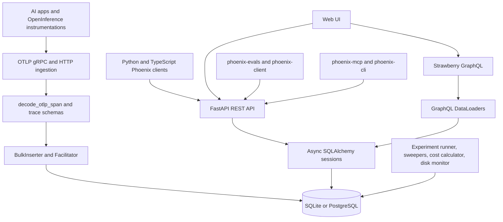
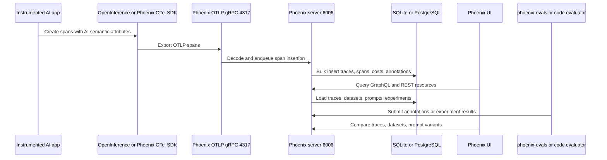
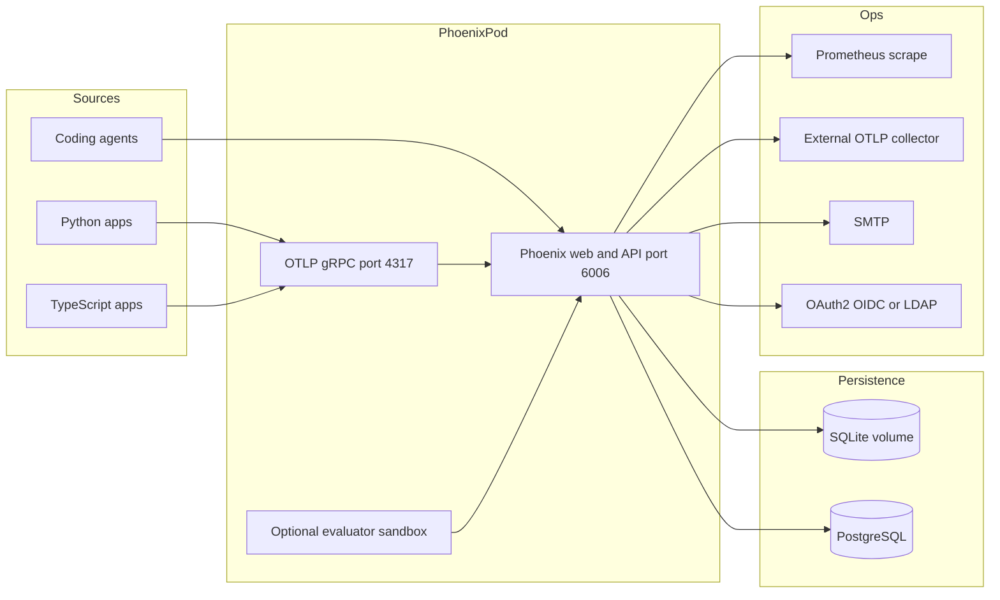
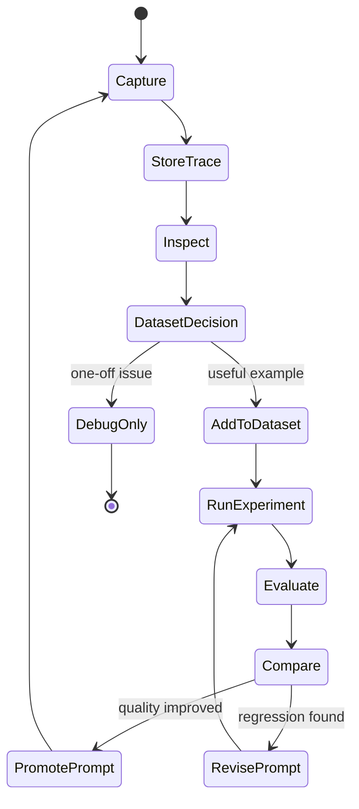
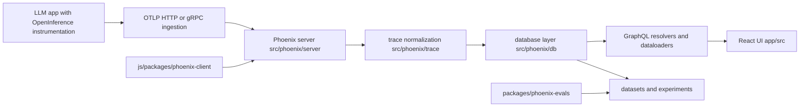
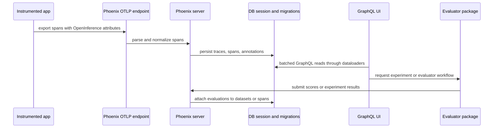
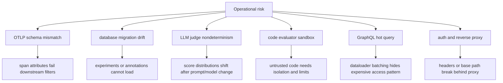

# Phoenix Architecture Notes

## Executive summary

Phoenix is an open source AI observability and evaluation platform from Arize. The repository describes Phoenix as a platform for tracing, evaluation, datasets, experiments, playground prompt iteration, and prompt management. The implementation is a mixed Python and TypeScript product: `src/phoenix/` contains the server, tracing, database, datasets, sessions, metrics, and utilities; `app/` and frontend assets provide the web UI; `packages/` contains Python subpackages such as `phoenix-client`, `phoenix-evals`, and `phoenix-otel`; `js/packages/` contains TypeScript packages such as `phoenix-otel`, `phoenix-client`, `phoenix-evals`, `phoenix-mcp`, and `phoenix-cli`.

The root `pyproject.toml` identifies the package as `arize-phoenix`, licensed under Elastic-2.0, requiring Python `>=3.10,<3.15`, and depending on FastAPI, Starlette, Uvicorn, Strawberry GraphQL, SQLAlchemy async, Alembic, OpenTelemetry, OpenInference semantic conventions, gRPC, Prometheus, Authlib, LDAP, and Phoenix client/eval/OTel packages. The main server can run locally, in notebooks, in containers, or in Kubernetes. The included Docker, Compose, Helm, and Kustomize files make the intended topology clear: Phoenix web/API on port `6006`, OTLP gRPC ingestion on port `4317`, and SQLite or PostgreSQL persistence.

## Problem solved

Phoenix solves the AI debugging loop around traces, evaluations, and experiments. For LLM and agent systems, generic APM often captures latency but not prompt variables, retrieval documents, token/cost details, tool calls, evaluator labels, dataset examples, or experiment lineage. Phoenix receives OpenTelemetry/OpenInference spans, stores them in an AI-aware schema, exposes trace and span analysis in the UI, and connects that telemetry to datasets, experiments, playground runs, code evaluators, LLM-as-judge evaluators, and prompt versions.

## AI stack role

Phoenix is an observability and evaluation workbench in the AI stack:

- It receives telemetry from applications, agents, RAG systems, model providers, and OpenInference instrumentations.
- It provides a workspace for debugging traces, comparing experiments, authoring evaluators, and iterating prompts.
- It can be used as a local development tool, notebook companion, self-hosted production service, or managed cloud service.
- Its Python and TypeScript client packages make it useful both to application developers and to automated coding agents through `phoenix-mcp` and `phoenix-cli`.

## Source tree map

Repository evidence:

- `README.md` describes Phoenix features: OpenTelemetry-based tracing, LLM evaluation, versioned datasets, experiments, playground, prompt management, provider/framework integrations, and coding-agent skills.
- `pyproject.toml` defines `arize-phoenix`, dependencies, script entrypoints `arize-phoenix` and `phoenix`, optional deployment extras, and dev dependencies.
- `src/phoenix/server/app.py` composes FastAPI, Strawberry GraphQL, gRPC, authentication, data loaders, database facilitators, background daemons, redaction, encryption, telemetry, fixture loading, and static UI serving.
- `src/phoenix/server/api/routers/` contains REST routers, with `v1` as the visible API version directory.
- `src/phoenix/server/grpc_server.py` provides the OTLP gRPC ingest server.
- `src/phoenix/db/` contains async database models, Alembic migrations, bulk insertion, facilitator logic, and optional AWS RDS IAM authentication.
- `src/phoenix/trace/` contains span schemas, OpenTelemetry attribute flattening/unflattening, span JSON encode/decode, trace datasets, fixtures, projects, and evaluations.
- `packages/phoenix-otel/` provides the Python Phoenix-aware OpenTelemetry wrapper.
- `packages/phoenix-client/` provides the Python client and resources for traces, spans, sessions, datasets, and experiments.
- `packages/phoenix-evals/` provides Python LLM evaluation templates, adapters, wrappers, generated classification evaluator configs, and evaluator tests.
- `js/packages/phoenix-mcp/` exposes Phoenix data and operations to coding agents through MCP tools for traces, spans, datasets, experiments, prompts, projects, sessions, and annotation configs.
- `Dockerfile` exposes `6006` and `4317`, and includes WASM sandbox setup.
- `docker-compose.yml` runs Phoenix plus Postgres, setting `PHOENIX_SQL_DATABASE_URL`.
- `helm/` and `kustomize/` provide Kubernetes deployment paths with auth, persistence, PostgreSQL, health checks, Prometheus annotations, TLS, and OTLP instrumentation settings.

## Core concepts

- **OpenInference span**: OpenTelemetry span decorated with AI-specific semantic conventions for LLM calls, retrieval, tools, documents, prompts, costs, and errors.
- **Project**: namespace for traces and related telemetry.
- **Trace and span**: execution graph of an LLM application or agent workflow.
- **Dataset**: versioned set of examples used for evaluation, experimentation, or fine-tuning.
- **Experiment**: run of a task, prompt, model, or agent over dataset examples, with output and evaluator annotations.
- **Evaluation**: LLM-as-judge, code evaluator, classification metric, or retrieval/response quality signal.
- **Playground**: prompt and model experimentation surface that can replay or compare traced calls.
- **Prompt version**: managed prompt state used for systematic iteration and comparison.

## Internal architecture

`src/phoenix/server/app.py` is the architectural hub. It imports FastAPI, GraphQL router support, gRPC interceptors, data loaders, `BulkInserter`, `Facilitator`, `GrpcServer`, `DbDiskUsageMonitor`, `ExperimentRunner`, `ExperimentSweeper`, `GenerativeModelStore`, `SpanCostCalculator`, `TraceDataSweeper`, authentication backends, redaction, encryption, sandbox session management, and OpenTelemetry server instrumentation. This is not a thin API wrapper; it is the composition root for the product.

The database layer is asynchronous and migration-aware. `src/phoenix/db/alembic.ini` and `src/phoenix/db/migrations/` indicate schema migration discipline. `src/phoenix/db/aws_auth.py` shows cloud-specific database authentication support. Phoenix can use local SQLite for light deployments or PostgreSQL for durable multi-user/self-host deployments.

The trace layer is deliberately OpenTelemetry-aligned. `src/phoenix/trace/attributes.py` documents flattening and unflattening OTEL attributes while preserving nested structures, and `src/phoenix/trace/schemas.py` defines span data structures inspired by OpenTelemetry.

## Runtime and data flow

The ingestion path is optimized for observability payloads rather than generic metrics. Phoenix receives OpenTelemetry spans, decodes them into Phoenix trace models, inserts them through the database facilitator/bulk inserter, then exposes them through GraphQL dataloaders and REST resources. Evaluation and experiment workflows can originate from the UI, client packages, or agent tooling; their results land back in the database as annotations, experiment runs, or evaluator outputs.

## Deployment and operations topology

The simplest Compose topology runs `phoenix` and `db`, maps `6006:6006` and `4317:4317`, and sets `PHOENIX_SQL_DATABASE_URL=postgresql://postgres:postgres@db:5432/postgres`. Kubernetes options are more mature: `helm/README.md` and `helm/values.yaml` expose authentication, CORS, CSRF trusted origins, brute-force login protection, OAuth2/OIDC, LDAP, PostgreSQL settings, read replicas, retention policy, health checks, server host/port/root URL, `PHOENIX_MAX_SPANS_QUEUE_SIZE`, OTLP instrumentation export endpoints, SMTP, TLS, and sandbox provider allowlists. `kustomize/base/phoenix.yaml` includes Prometheus scrape annotations and readiness probes.

## Lifecycle and decision diagram

Phoenix is strongest when traces are not the end of the workflow. A production trace can become a dataset example, a dataset can drive experiments, an experiment can be scored by evaluators, and scored outputs can guide prompt or model changes. The repo reflects that loop through `src/phoenix/trace/`, `src/phoenix/datasets/`, GraphQL dataloaders for experiment and dataset state, and `packages/phoenix-evals/`.

## Extension points

- Add REST resources under `src/phoenix/server/api/routers/v1/` and register them through router creation.
- Add GraphQL fields, mutations, or dataloaders through `src/phoenix/server/api/schema.py`, `context.py`, and dataloader modules.
- Add trace parsing or semantic handling in `src/phoenix/trace/`.
- Add database models or migrations under `src/phoenix/db/`.
- Add Python client resources in `packages/phoenix-client/src/phoenix/client/`.
- Add evaluation templates, adapters, metrics, or generated config support in `packages/phoenix-evals/src/phoenix/evals/`.
- Add TypeScript client/eval/OTel behavior in `js/packages/`.
- Add coding-agent integration tools in `js/packages/phoenix-mcp/src/`.
- Add deployment knobs in `helm/values.yaml`, Helm templates, or Kustomize overlays.

## Integrations

The README lists broad framework and provider support through OpenInference: OpenAI Agents SDK, Claude Agent SDK, LangGraph, Vercel AI SDK, Mastra, CrewAI, LlamaIndex, DSPy, OpenAI, Anthropic, Google GenAI, Google ADK, Bedrock, OpenRouter, LiteLLM, and more. Phoenix also provides Python subpackages for OTel, client, and evals; TypeScript packages for OTel, client, evals, MCP, and CLI; and coding-agent skills in `.agents/skills/`.

The package design shows a deliberate split: the server owns storage and UI, `phoenix-otel` owns instrumentation defaults, `phoenix-client` owns API interaction, `phoenix-evals` owns metric execution, and `phoenix-mcp`/`phoenix-cli` expose Phoenix data to agent workflows.

## Configuration, deployment, and operations

Important configuration families:

- Server: `PHOENIX_HOST`, `PHOENIX_PORT`, `PHOENIX_GRPC_PORT`, `PHOENIX_ROOT_URL`, `PHOENIX_WORKING_DIR`, `PHOENIX_MAX_SPANS_QUEUE_SIZE`, `PHOENIX_TELEMETRY_ENABLED`.
- Database: `PHOENIX_SQL_DATABASE_URL`, Postgres host/user/password/db/schema, read replica URL, AWS RDS IAM, Azure managed identity.
- Auth: `PHOENIX_ENABLE_AUTH`, `PHOENIX_SECRET`, admin secrets, OAuth2/OIDC providers, LDAP settings, password policy, CSRF trusted origins, allowed CORS origins.
- Retention and safety: default trace retention days, database usage blocking thresholds, redaction, encryption, TLS.
- Evaluation sandbox: WASM, E2B, Daytona, Vercel, Deno, Modal allowlists and provider credentials.
- Instrumentation: server OTLP collector endpoints for exporting Phoenix's own telemetry.

Operationally, the highest-risk capacity setting is `PHOENIX_MAX_SPANS_QUEUE_SIZE`; Helm notes that queued spans consume memory and should be sized against database throughput. Watch database disk usage, migration status, span queue rejections, experiment runner health, sandbox availability, and auth configuration drift.

## Observability, testing, evaluation, and failure modes

Phoenix includes unit, integration, and package tests across `tests/`, `packages/phoenix-client/tests/`, `packages/phoenix-evals/tests/`, and `js/packages/*/test/`. Test names cover client resources for traces/spans/sessions/datasets/experiments, evaluator prompts and adapters, rate limiters, concurrency controllers, OTel registration, MCP trace/span/project/dataset utilities, and ATIF trajectory conversion.

Failure modes to design for:

- **Span overload**: OTLP ingestion can exceed database write throughput, filling the in-memory span queue and causing rejections.
- **Database pressure**: SQLite is convenient but unsuitable for shared high-concurrency production; Postgres should be used for durable deployments.
- **Migration mismatch**: server version and database schema must advance together.
- **Evaluator sandbox risk**: code evaluators and agent tools require sandbox controls, provider allowlists, and resource limits.
- **Provider credential exposure**: playground and evaluators can call external LLM providers; secrets need encryption and strict admin controls.
- **Trace data sensitivity**: prompts, documents, tool arguments, and outputs can include PII or secrets.
- **Auth misconfiguration**: disabling auth or weak default admin credentials is acceptable only in isolated local development.

## Security and governance risks

Phoenix stores AI telemetry, evaluator outputs, prompt versions, dataset examples, annotations, and provider configuration. Security controls should include authentication in shared environments, SSO/OIDC or LDAP where appropriate, strong `PHOENIX_SECRET`, TLS for HTTP and gRPC, database network isolation, encrypted secrets, redaction rules, trace retention, least-privilege database credentials, and sandbox restrictions for code evaluators.

Governance teams should treat datasets and experiments as quality records. If evaluator definitions change, results should be interpreted by evaluator version. If prompt versions are promoted from playground work, teams should preserve trace links and experiment evidence.

## Reading guide

1. Read `README.md` for the product workflow and integrations.
2. Read `pyproject.toml` for dependencies, package entrypoints, and optional extras.
3. Read `src/phoenix/server/app.py` to understand the application composition root.
4. Read `src/phoenix/trace/attributes.py`, `schemas.py`, and `trace_dataset.py` for trace representation.
5. Read `src/phoenix/db/`, especially models, migrations, bulk inserter, and facilitator.
6. Read `packages/phoenix-otel/`, `packages/phoenix-client/`, and `packages/phoenix-evals/` for external SDK roles.
7. Read `helm/README.md`, `helm/values.yaml`, and `kustomize/base/phoenix.yaml` for production configuration.
8. Use tests in `packages/` and `js/packages/` to understand edge cases.

## Learning path

1. Start a mental trace from OpenInference instrumentation to OTLP gRPC ingestion.
2. Follow how a span becomes a database record and then a GraphQL UI query.
3. Learn dataset and experiment concepts from README, `src/phoenix/datasets/`, and dataloaders.
4. Study `packages/phoenix-evals` to understand LLM judge and classification evaluator construction.
5. Study `js/packages/phoenix-mcp` if you want Phoenix data available to coding agents.
6. Review Helm security settings before using Phoenix outside a local environment.

## Glossary

- **OpenInference**: AI-focused semantic conventions and instrumentation built on OpenTelemetry.
- **OTLP**: OpenTelemetry Protocol used for span ingestion.
- **Strawberry GraphQL**: Python GraphQL framework used by the Phoenix API/UI layer.
- **DataLoader**: batching and caching helper for efficient GraphQL reads.
- **Evaluator**: function, model judge, or classification metric that scores outputs.
- **Sandbox**: isolated runtime for code evaluator execution.
- **Prompt version**: immutable or versioned prompt state for comparison and release.
- **ATIF**: agent trajectory interchange fixture format used in Phoenix client tests.

## Repository-Grounded Deep Dive

Phoenix is best understood as an OpenTelemetry-native LLMOps application with a Python server, a TypeScript UI, and separate evaluator/client packages. The core runtime lives under `github-repos/05-observability-evaluation-llmops/phoenix/src/phoenix/`, with important boundaries in `server/`, `trace/`, `db/`, `datasets/`, and `metrics/`. The UI is under `app/src/`. Evaluator packages live in `packages/phoenix-evals/` and JavaScript client/OTEL packages live under `js/packages/phoenix-client/` and `js/packages/phoenix-otel/`. Deployment examples are visible in `kustomize/`, `helm/`, and `scripts/docker/devops/`.

The architectural split matters because Phoenix is both an ingestion system and an analysis workbench. OTLP/OpenInference spans are the raw evidence. GraphQL and DataLoader logic shape that evidence for UI exploration. Datasets, experiments, annotations, prompt versions, and evaluators convert observations into regression assets. If the team only monitors span ingestion, it can miss the health of experiment comparison, evaluator execution, prompt release, or dataset mutation paths.

### Production Readiness Checklist

- Treat OpenInference attributes as contract. Before broad rollout, send representative spans and verify trace tree, token/cost fields, tool spans, retrieval spans, and annotations render correctly.
- Run database migrations and schema generation checks before deployment; `src/phoenix/db/`, `scripts/ddl/`, and `schemas/openapi.json` are part of the operational contract.
- Load test GraphQL views with realistic trace sizes. UI performance depends on resolver and DataLoader behavior, not only database indexes.
- For evaluator workflows, pin judge prompts, judge models, concurrency limits, and retry policies. Use `packages/phoenix-evals/tests/` as a guide for evaluator edge cases.
- Review sandbox and code-evaluator settings before allowing user-authored evaluators in shared environments.
- Verify reverse proxy, base URL, auth, and TLS behavior using the examples in `examples/reverse-proxy/`, `scripts/docker/devops/`, `kustomize/`, and `helm/`.
- Include datasets, experiments, prompt versions, annotations, and traces in backup and restore tests.

### Senior Architect Reading Path

Read `src/phoenix/server/` first to understand ingestion and API boundaries. Then read `src/phoenix/trace/` and `src/phoenix/db/` to see how spans become queryable records. Move to `app/src/` for the UI concepts, especially trace and experiment screens. Finally, inspect `packages/phoenix-evals/`, `packages/phoenix-otel/`, `js/packages/phoenix-client/`, and the deployment manifests. This order keeps telemetry, persistence, product workflow, SDK behavior, and operations separate.

### Operational Scenarios to Rehearse

Run one scenario for each Phoenix plane. For ingestion, export traces from a framework integration and confirm OpenInference attributes survive OTLP parsing, persistence, GraphQL reads, and UI rendering. For evaluation, create a dataset, run an experiment with a pinned evaluator, and verify that annotations and scores remain comparable after a server restart. For operations, place Phoenix behind the reverse-proxy examples, then check base URL handling, auth headers, TLS termination, and large trace pagination.
