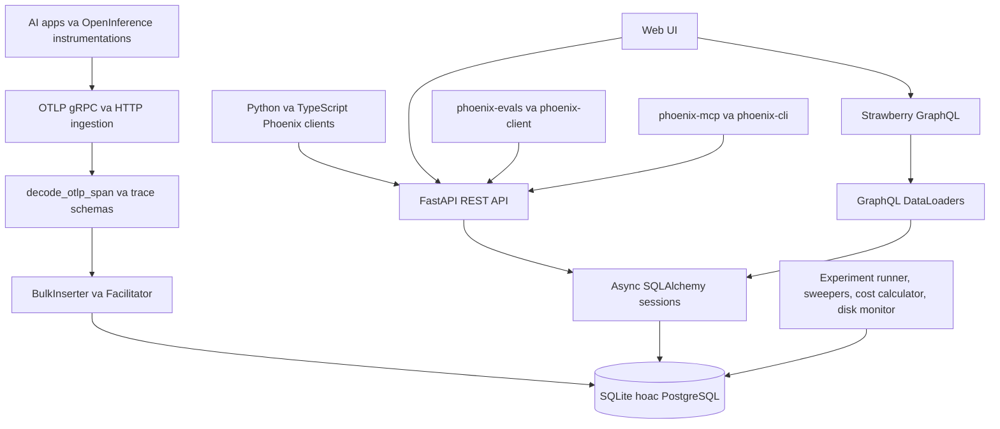
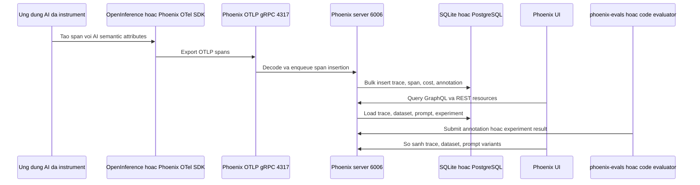
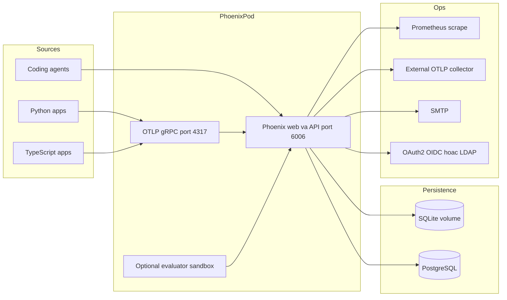
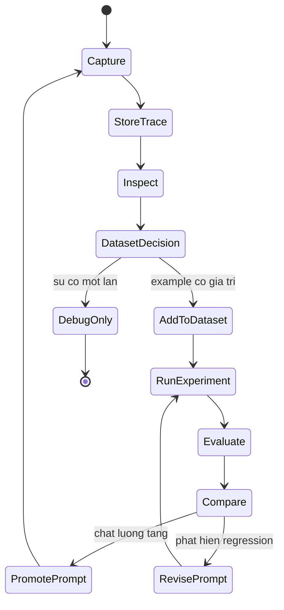
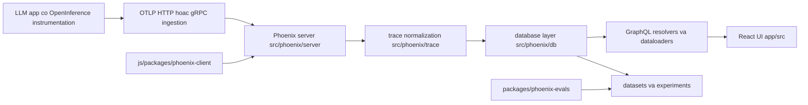
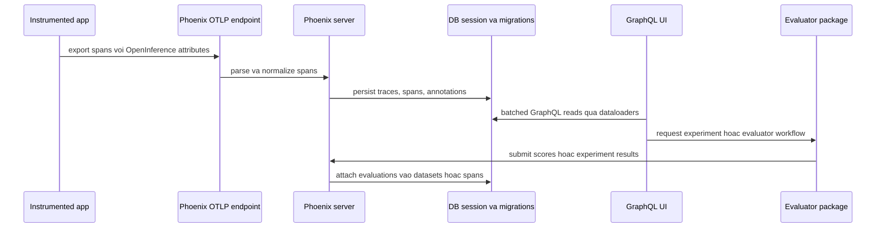
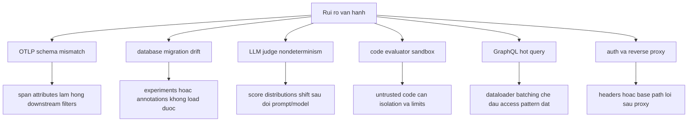

# Ghi chú kiến trúc Phoenix

## Tóm tắt điều hành

Phoenix là nền tảng observability và evaluation mã nguồn mở cho AI của Arize. Repository mô tả Phoenix như một nền tảng cho tracing, evaluation, dataset, experiment, playground để lặp prompt và prompt management. Phần triển khai là sản phẩm kết hợp Python và TypeScript: `src/phoenix/` chứa server, tracing, database, dataset, session, metrics và utilities; `app/` cùng tài sản frontend cung cấp web UI; `packages/` chứa subpackage Python như `phoenix-client`, `phoenix-evals`, `phoenix-otel`; `js/packages/` chứa package TypeScript như `phoenix-otel`, `phoenix-client`, `phoenix-evals`, `phoenix-mcp` và `phoenix-cli`.

File gốc `pyproject.toml` định nghĩa package `arize-phoenix`, license Elastic-2.0, yêu cầu Python `>=3.10,<3.15`, và phụ thuộc FastAPI, Starlette, Uvicorn, Strawberry GraphQL, SQLAlchemy async, Alembic, OpenTelemetry, OpenInference semantic conventions, gRPC, Prometheus, Authlib, LDAP cùng các package client/eval/OTel của Phoenix. Server chính có thể chạy local, trong notebook, trong container hoặc Kubernetes. Docker, Compose, Helm và Kustomize trong repo thể hiện topology dự kiến: web/API Phoenix ở port `6006`, OTLP gRPC ingestion ở port `4317`, persistence bằng SQLite hoặc PostgreSQL.

## Bài toán được giải quyết

Phoenix giải quyết vòng lặp debug AI quanh trace, evaluation và experiment. Với LLM và agent system, APM tổng quát thường chỉ thấy latency mà không hiểu prompt variable, retrieval document, token/cost detail, tool call, evaluator label, dataset example hoặc lineage của experiment. Phoenix nhận span OpenTelemetry/OpenInference, lưu chúng trong schema hiểu ngữ cảnh AI, hiển thị phân tích trace/span trong UI và kết nối telemetry đó với dataset, experiment, playground run, code evaluator, LLM-as-judge evaluator và prompt version.

## Vai trò trong AI stack

Phoenix là workbench quan sát và đánh giá trong AI stack:

- Nhận telemetry từ ứng dụng, agent, hệ thống RAG, model provider và OpenInference instrumentation.
- Cung cấp không gian debug trace, so sánh experiment, viết evaluator và lặp prompt.
- Có thể dùng như công cụ local development, companion trong notebook, dịch vụ self-host production hoặc cloud managed.
- Các package Python và TypeScript giúp Phoenix hữu ích cho cả developer ứng dụng và coding agent thông qua `phoenix-mcp` và `phoenix-cli`.

## Bản đồ source tree

Bằng chứng trong repository:

- `README.md` mô tả tính năng Phoenix: tracing dựa trên OpenTelemetry, LLM evaluation, dataset có version, experiment, playground, prompt management, integration với provider/framework và coding-agent skills.
- `pyproject.toml` định nghĩa `arize-phoenix`, dependency, entrypoint script `arize-phoenix` và `phoenix`, optional extra triển khai và dev dependency.
- `src/phoenix/server/app.py` ghép FastAPI, Strawberry GraphQL, gRPC, authentication, data loader, database facilitator, background daemon, redaction, encryption, telemetry, fixture loading và static UI serving.
- `src/phoenix/server/api/routers/` chứa REST router, trong đó `v1` là thư mục API version rõ ràng.
- `src/phoenix/server/grpc_server.py` cung cấp OTLP gRPC ingest server.
- `src/phoenix/db/` chứa async database model, Alembic migration, bulk insertion, facilitator logic và tùy chọn AWS RDS IAM authentication.
- `src/phoenix/trace/` chứa span schema, flatten/unflatten OpenTelemetry attribute, encode/decode span JSON, trace dataset, fixture, project và evaluation.
- `packages/phoenix-otel/` cung cấp wrapper OpenTelemetry có default phù hợp Phoenix cho Python.
- `packages/phoenix-client/` cung cấp Python client và resource cho trace, span, session, dataset, experiment.
- `packages/phoenix-evals/` cung cấp template LLM evaluation Python, adapter, wrapper, generated classification evaluator config và evaluator tests.
- `js/packages/phoenix-mcp/` mở dữ liệu và thao tác Phoenix cho coding agent qua MCP tools cho trace, span, dataset, experiment, prompt, project, session và annotation config.
- `Dockerfile` expose `6006` và `4317`, đồng thời có setup WASM sandbox.
- `docker-compose.yml` chạy Phoenix cùng Postgres và đặt `PHOENIX_SQL_DATABASE_URL`.
- `helm/` và `kustomize/` cung cấp đường triển khai Kubernetes với auth, persistence, PostgreSQL, health check, Prometheus annotation, TLS và cấu hình OTLP instrumentation.

## Khái niệm cốt lõi

- **OpenInference span**: span OpenTelemetry có semantic convention riêng cho AI như LLM call, retrieval, tool, document, prompt, cost và error.
- **Project**: namespace cho trace và telemetry liên quan.
- **Trace và span**: đồ thị thực thi của ứng dụng LLM hoặc agent workflow.
- **Dataset**: tập example có version dùng cho evaluation, experimentation hoặc fine-tuning.
- **Experiment**: lần chạy task, prompt, model hoặc agent trên dataset example, kèm output và evaluator annotation.
- **Evaluation**: LLM-as-judge, code evaluator, classification metric hoặc tín hiệu chất lượng cho retrieval/response.
- **Playground**: bề mặt thử prompt và model, có thể replay hoặc so sánh traced call.
- **Prompt version**: trạng thái prompt được quản lý để lặp và so sánh có hệ thống.

## Kiến trúc nội bộ

`src/phoenix/server/app.py` là trung tâm kiến trúc. File này import FastAPI, GraphQL router support, gRPC interceptor, data loader, `BulkInserter`, `Facilitator`, `GrpcServer`, `DbDiskUsageMonitor`, `ExperimentRunner`, `ExperimentSweeper`, `GenerativeModelStore`, `SpanCostCalculator`, `TraceDataSweeper`, authentication backend, redaction, encryption, sandbox session management và OpenTelemetry server instrumentation. Đây không phải wrapper API mỏng mà là composition root của sản phẩm.

Lớp database là async và có kỷ luật migration. `src/phoenix/db/alembic.ini` và `src/phoenix/db/migrations/` cho thấy schema được quản lý bằng migration. `src/phoenix/db/aws_auth.py` cho thấy hỗ trợ xác thực database theo cloud. Phoenix có thể dùng SQLite local cho triển khai nhẹ hoặc PostgreSQL cho self-host nhiều người dùng và production.

Lớp trace bám sát OpenTelemetry. `src/phoenix/trace/attributes.py` mô tả cách flatten và unflatten OTEL attributes mà vẫn giữ cấu trúc nested, còn `src/phoenix/trace/schemas.py` định nghĩa span data structure lấy cảm hứng từ OpenTelemetry.

## Luồng runtime và dữ liệu

Đường ingestion được tối ưu cho payload observability AI chứ không chỉ metric tổng quát. Phoenix nhận span OpenTelemetry, decode thành trace model của Phoenix, insert qua database facilitator/bulk inserter, rồi hiển thị qua GraphQL dataloader và REST resource. Workflow evaluation và experiment có thể xuất phát từ UI, client package hoặc agent tooling; kết quả quay lại database dưới dạng annotation, experiment run hoặc evaluator output.

## Topology triển khai và vận hành

Topology Compose đơn giản chạy `phoenix` và `db`, map `6006:6006` và `4317:4317`, đặt `PHOENIX_SQL_DATABASE_URL=postgresql://postgres:postgres@db:5432/postgres`. Các tùy chọn Kubernetes hoàn thiện hơn: `helm/README.md` và `helm/values.yaml` phơi bày authentication, CORS, CSRF trusted origins, brute-force login protection, OAuth2/OIDC, LDAP, PostgreSQL settings, read replica, retention policy, health checks, server host/port/root URL, `PHOENIX_MAX_SPANS_QUEUE_SIZE`, endpoint export OTLP instrumentation, SMTP, TLS và allowlist sandbox provider. `kustomize/base/phoenix.yaml` có Prometheus scrape annotation và readiness probe.

## Vòng đời và quyết định

Phoenix mạnh nhất khi trace không phải điểm kết thúc. Một trace production có thể trở thành dataset example, dataset có thể chạy experiment, experiment có thể được evaluator chấm điểm, và output đã chấm điểm hướng dẫn thay đổi prompt hoặc model. Repository phản ánh vòng lặp này qua `src/phoenix/trace/`, `src/phoenix/datasets/`, GraphQL dataloader cho trạng thái experiment/dataset và `packages/phoenix-evals/`.

## Điểm mở rộng

- Thêm REST resource dưới `src/phoenix/server/api/routers/v1/` và đăng ký qua router creation.
- Thêm GraphQL field, mutation hoặc dataloader qua `src/phoenix/server/api/schema.py`, `context.py` và các module dataloader.
- Thêm xử lý semantic hoặc parsing trace trong `src/phoenix/trace/`.
- Thêm database model hoặc migration dưới `src/phoenix/db/`.
- Thêm Python client resource trong `packages/phoenix-client/src/phoenix/client/`.
- Thêm evaluation template, adapter, metric hoặc generated config support trong `packages/phoenix-evals/src/phoenix/evals/`.
- Thêm TypeScript client/eval/OTel behavior trong `js/packages/`.
- Thêm tool tích hợp coding-agent trong `js/packages/phoenix-mcp/src/`.
- Thêm cấu hình triển khai trong `helm/values.yaml`, Helm template hoặc Kustomize overlay.

## Tích hợp

README liệt kê hỗ trợ rộng qua OpenInference: OpenAI Agents SDK, Claude Agent SDK, LangGraph, Vercel AI SDK, Mastra, CrewAI, LlamaIndex, DSPy, OpenAI, Anthropic, Google GenAI, Google ADK, Bedrock, OpenRouter, LiteLLM và nhiều hệ khác. Phoenix cũng có Python subpackage cho OTel, client và evals; TypeScript package cho OTel, client, evals, MCP và CLI; cùng coding-agent skills trong `.agents/skills/`.

Thiết kế package cho thấy sự tách vai trò rõ: server sở hữu storage và UI, `phoenix-otel` sở hữu instrumentation default, `phoenix-client` sở hữu tương tác API, `phoenix-evals` sở hữu thực thi metric, còn `phoenix-mcp`/`phoenix-cli` đưa dữ liệu Phoenix vào workflow của agent.

## Cấu hình, triển khai và vận hành

Các nhóm cấu hình quan trọng:

- Server: `PHOENIX_HOST`, `PHOENIX_PORT`, `PHOENIX_GRPC_PORT`, `PHOENIX_ROOT_URL`, `PHOENIX_WORKING_DIR`, `PHOENIX_MAX_SPANS_QUEUE_SIZE`, `PHOENIX_TELEMETRY_ENABLED`.
- Database: `PHOENIX_SQL_DATABASE_URL`, Postgres host/user/password/db/schema, read replica URL, AWS RDS IAM, Azure managed identity.
- Auth: `PHOENIX_ENABLE_AUTH`, `PHOENIX_SECRET`, admin secret, OAuth2/OIDC provider, LDAP settings, password policy, CSRF trusted origins, allowed CORS origins.
- Retention và safety: default trace retention days, ngưỡng database usage blocking, redaction, encryption, TLS.
- Evaluation sandbox: allowlist và credential cho WASM, E2B, Daytona, Vercel, Deno, Modal.
- Instrumentation: endpoint OTLP collector để export telemetry của chính Phoenix server.

Trong vận hành, cài đặt capacity rủi ro nhất là `PHOENIX_MAX_SPANS_QUEUE_SIZE`; Helm ghi chú rằng span đang queue tiêu thụ memory và phải được sizing theo throughput database. Cần theo dõi disk usage database, trạng thái migration, span queue rejection, sức khỏe experiment runner, sandbox availability và drift cấu hình auth.

## Observability, testing, evaluation và failure modes

Phoenix có unit, integration và package test trong `tests/`, `packages/phoenix-client/tests/`, `packages/phoenix-evals/tests/` và `js/packages/*/test/`. Tên test bao phủ client resource cho trace/span/session/dataset/experiment, evaluator prompt và adapter, rate limiter, concurrency controller, OTel registration, MCP trace/span/project/dataset utilities và chuyển đổi ATIF trajectory.

Các failure mode cần thiết kế:

- **Quá tải span**: OTLP ingestion vượt throughput ghi database, làm đầy in-memory span queue và gây rejection.
- **Áp lực database**: SQLite tiện lợi nhưng không phù hợp production nhiều người dùng hoặc concurrency cao; deployment bền vững nên dùng Postgres.
- **Lệch migration**: phiên bản server và schema database phải được nâng cùng nhau.
- **Rủi ro sandbox evaluator**: code evaluator và agent tool cần sandbox control, provider allowlist và resource limit.
- **Lộ credential provider**: playground và evaluator có thể gọi external LLM provider; secret cần encryption và admin control nghiêm ngặt.
- **Dữ liệu trace nhạy cảm**: prompt, document, tool argument và output có thể chứa PII hoặc secret.
- **Sai cấu hình auth**: tắt auth hoặc dùng default admin yếu chỉ phù hợp trong local development cô lập.

## Rủi ro bảo mật và quản trị

Phoenix lưu AI telemetry, evaluator output, prompt version, dataset example, annotation và cấu hình provider. Kiểm soát bảo mật nên gồm authentication trong môi trường dùng chung, SSO/OIDC hoặc LDAP khi phù hợp, `PHOENIX_SECRET` mạnh, TLS cho HTTP và gRPC, cô lập network database, mã hóa secret, redaction rule, trace retention, credential database least privilege và giới hạn sandbox cho code evaluator.

Đội governance nên xem dataset và experiment như hồ sơ chất lượng. Nếu evaluator definition thay đổi, kết quả phải được diễn giải theo evaluator version. Nếu prompt version được promote từ playground, team nên giữ liên kết trace và bằng chứng experiment.

## Hướng dẫn đọc

1. Đọc `README.md` để nắm workflow sản phẩm và integration.
2. Đọc `pyproject.toml` để biết dependency, package entrypoint và optional extra.
3. Đọc `src/phoenix/server/app.py` để hiểu composition root của ứng dụng.
4. Đọc `src/phoenix/trace/attributes.py`, `schemas.py` và `trace_dataset.py` để hiểu biểu diễn trace.
5. Đọc `src/phoenix/db/`, nhất là model, migration, bulk inserter và facilitator.
6. Đọc `packages/phoenix-otel/`, `packages/phoenix-client/`, `packages/phoenix-evals/` để hiểu vai trò SDK bên ngoài.
7. Đọc `helm/README.md`, `helm/values.yaml` và `kustomize/base/phoenix.yaml` cho cấu hình production.
8. Dùng test trong `packages/` và `js/packages/` để hiểu edge case.

## Lộ trình học

1. Theo dấu một trace từ OpenInference instrumentation đến OTLP gRPC ingestion.
2. Xem cách một span thành database record rồi thành GraphQL query cho UI.
3. Học khái niệm dataset và experiment từ README, `src/phoenix/datasets/` và dataloader.
4. Nghiên cứu `packages/phoenix-evals` để hiểu cách dựng LLM judge và classification evaluator.
5. Nghiên cứu `js/packages/phoenix-mcp` nếu muốn đưa dữ liệu Phoenix vào coding agent.
6. Review cấu hình bảo mật Helm trước khi dùng Phoenix ngoài local environment.

## Thuật ngữ

- **OpenInference**: semantic convention và instrumentation tập trung vào AI, xây trên OpenTelemetry.
- **OTLP**: OpenTelemetry Protocol dùng để ingest span.
- **Strawberry GraphQL**: framework GraphQL Python dùng ở lớp API/UI của Phoenix.
- **DataLoader**: helper batching và caching cho GraphQL read hiệu quả.
- **Evaluator**: function, model judge hoặc classification metric chấm điểm output.
- **Sandbox**: runtime cô lập để chạy code evaluator.
- **Prompt version**: trạng thái prompt bất biến hoặc có version để so sánh và release.
- **ATIF**: định dạng fixture trao đổi agent trajectory dùng trong test Phoenix client.

## Deep Dive Bám Theo Repository

Nên hiểu Phoenix như một ứng dụng LLMOps đặt OpenTelemetry làm nền, gồm Python server, TypeScript UI và các package evaluator/client riêng. Runtime lõi nằm trong `github-repos/05-observability-evaluation-llmops/phoenix/src/phoenix/`, với ranh giới quan trọng ở `server/`, `trace/`, `db/`, `datasets/` và `metrics/`. UI nằm ở `app/src/`. Package evaluator nằm trong `packages/phoenix-evals/`, còn JavaScript client/OTEL nằm dưới `js/packages/phoenix-client/` và `js/packages/phoenix-otel/`. Ví dụ deployment nằm trong `kustomize/`, `helm/` và `scripts/docker/devops/`.

Ranh giới kiến trúc quan trọng vì Phoenix vừa là ingestion system vừa là analysis workbench. OTLP/OpenInference spans là bằng chứng thô. GraphQL và DataLoader định hình bằng chứng đó để UI khám phá. Datasets, experiments, annotations, prompt versions và evaluators biến observation thành tài sản regression. Nếu team chỉ monitor span ingestion, họ có thể bỏ sót sức khỏe của experiment comparison, evaluator execution, prompt release hoặc dataset mutation.

### Checklist Sẵn Sàng Production

- Xem OpenInference attributes như contract. Trước khi rollout rộng, gửi span đại diện và kiểm tra trace tree, token/cost fields, tool spans, retrieval spans và annotations render đúng.
- Chạy kiểm tra migration database và schema trước deployment; `src/phoenix/db/`, `scripts/ddl/` và `schemas/openapi.json` là một phần contract vận hành.
- Load test GraphQL views với trace size thực tế. Hiệu năng UI phụ thuộc resolver và DataLoader, không chỉ database index.
- Với evaluator workflows, pin judge prompts, judge models, concurrency limits và retry policies. Dùng `packages/phoenix-evals/tests/` để hiểu edge case của evaluator.
- Review sandbox và code-evaluator settings trước khi cho phép user-authored evaluator trong môi trường dùng chung.
- Xác thực reverse proxy, base URL, auth và TLS bằng các ví dụ trong `examples/reverse-proxy/`, `scripts/docker/devops/`, `kustomize/` và `helm/`.
- Đưa datasets, experiments, prompt versions, annotations và traces vào backup/restore tests.

### Hướng Dẫn Đọc Cho Senior Architect

Đọc `src/phoenix/server/` trước để hiểu ingestion và API boundaries. Sau đó đọc `src/phoenix/trace/` và `src/phoenix/db/` để xem spans thành records queryable như thế nào. Tiếp theo chuyển sang `app/src/` cho product concepts, nhất là trace và experiment screens. Cuối cùng inspect `packages/phoenix-evals/`, `packages/phoenix-otel/`, `js/packages/phoenix-client/` và deployment manifests. Thứ tự này giữ telemetry, persistence, product workflow, SDK behavior và operations thành các lớp riêng.

### Kịch Bản Vận Hành Cần Diễn Tập

Hãy chạy một kịch bản cho từng plane của Phoenix. Với ingestion, export traces từ một framework integration và xác nhận OpenInference attributes đi qua OTLP parsing, persistence, GraphQL reads và UI rendering. Với evaluation, tạo dataset, chạy experiment bằng evaluator đã pin, rồi kiểm tra annotations và scores vẫn so sánh được sau khi server restart. Với operations, đặt Phoenix sau các reverse-proxy examples, sau đó kiểm tra base URL handling, auth headers, TLS termination và phân trang trace lớn.

### Dấu Hiệu Cần Review Lại Kiến Trúc

Cần review lại kiến trúc Phoenix nếu trace tree hiển thị đúng nhưng dataset/experiment không liên kết được với span gốc, nếu evaluator chạy thành công nhưng score distribution thay đổi mà không có version note, hoặc nếu GraphQL UI chậm dù OTLP ingestion vẫn ổn. Những dấu hiệu này cho thấy vấn đề nằm ở lớp phân tích và workflow, không nhất thiết ở ingestion. Trong môi trường production, hãy tách dashboard health, database migration health, evaluator health và OTLP ingestion health thành các tín hiệu vận hành độc lập.

Một kiểm tra hữu ích là chọn một trace phức tạp có tool call, retrieval và annotation, rồi lần lượt truy xuất nó qua UI, GraphQL/API client và evaluator workflow. Nếu ba đường này không kể cùng một câu chuyện dữ liệu, tài liệu vận hành cần ghi rõ nguồn sự thật và quyền ưu tiên của từng store.
