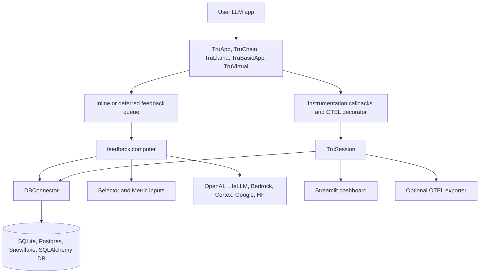
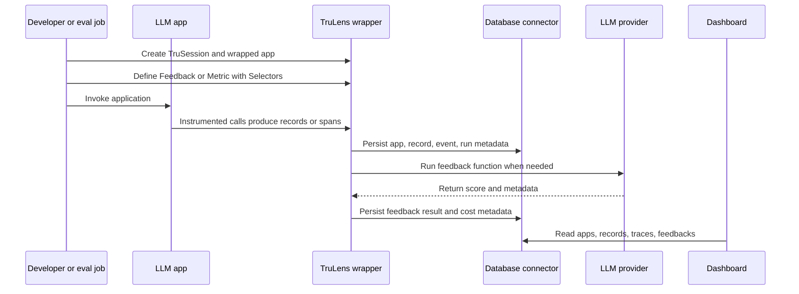
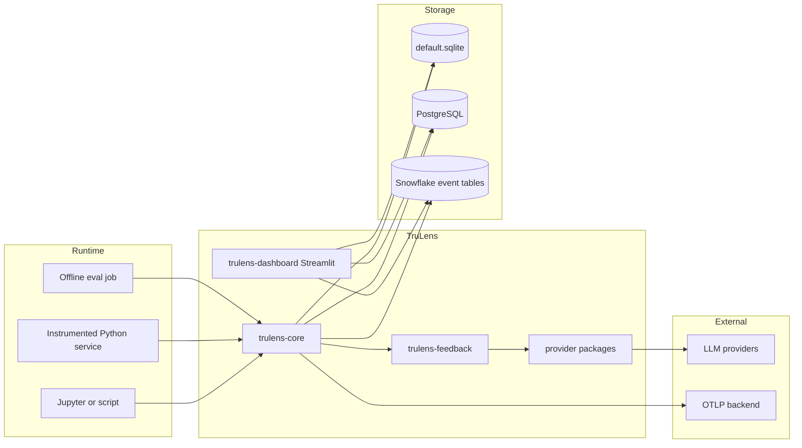
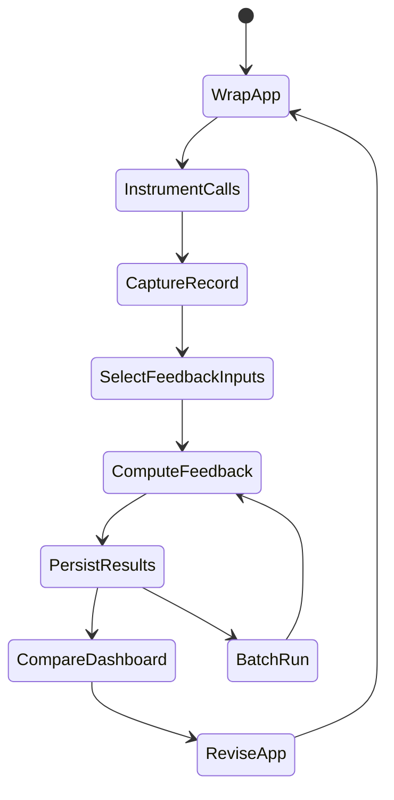
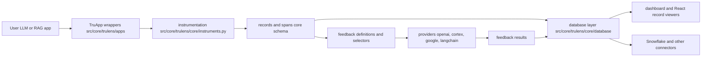
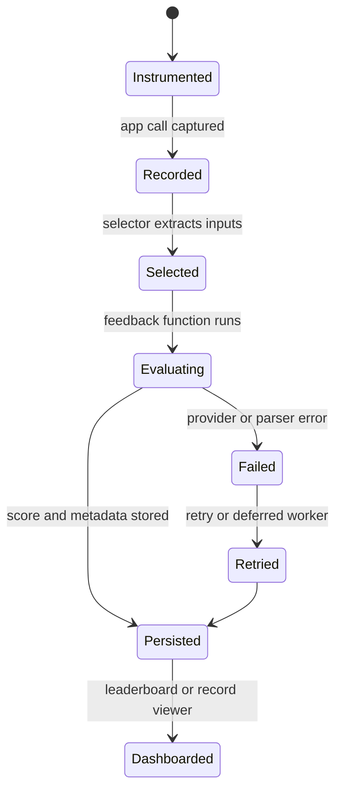
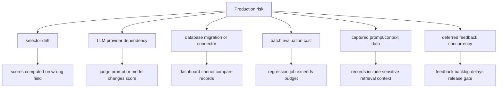

# TruLens Architecture Notes

## Executive summary

TruLens is a Python-first library and dashboard ecosystem for systematically tracing, evaluating, and comparing LLM applications. The README emphasizes fine-grained stack-agnostic instrumentation, OpenTelemetry-based tracing, feedback functions, RAG evaluation, agentic evaluations, batch and inline evaluation, MCP span support, and a Selector API. Unlike server-first platforms, TruLens is primarily embedded into the application or notebook that is being evaluated, then logs records, spans, feedback definitions, feedback results, datasets, and runs to a local or external database that the dashboard can read.

The root `pyproject.toml` identifies `trulens` version `2.8.1`, Python `^3.10`, MIT license, and a modular package layout. The top-level package depends on `trulens-core`, `trulens-feedback`, `trulens-dashboard`, `trulens-otel-semconv`, and a deprecated compatibility package `trulens_eval`. Development groups reveal the real architecture: app integrations under `src/apps/`, providers under `src/providers/`, connectors under `src/connectors/`, core under `src/core/`, feedback under `src/feedback/`, dashboard under `src/dashboard/`, semantic conventions under `src/otel/semconv/`, and tests under `tests/`.

## Problem solved

TruLens solves the "is my LLM app actually good" problem close to the developer workflow. It instruments application calls, captures records or OpenTelemetry spans, lets teams define feedback functions over selected parts of a trace, runs those feedbacks inline, deferred, or in batch, and provides a dashboard to compare app versions and records. This is especially useful for RAG and agent systems where answer quality depends on retrieval relevance, groundedness, tool behavior, reasoning consistency, safety, and cost.

## AI stack role

TruLens is best understood as an evaluation and instrumentation SDK with an optional UI:

- It sits inside Python application code, notebooks, or evaluation jobs.
- It wraps frameworks such as LangChain, LangGraph, LlamaIndex, custom Python apps, and virtual/existing traces.
- It calls LLM providers to compute feedback through provider packages.
- It stores evaluation data in SQLite, SQLAlchemy-compatible databases, Postgres, or Snowflake-backed connectors.
- It can export or interoperate through OpenTelemetry semantic conventions.
- It complements server-first observability tools by giving developers a programmable evaluation layer.

## Source tree map

Repository evidence:

- `README.md` introduces TruLens for systematic LLM experiment tracking and evaluation, OpenTelemetry-based tracing, agentic evaluators, inline/batch evaluation, MCP span support, and the Selector API.
- `pyproject.toml` defines the aggregate `trulens` package and workspace dependency groups for apps, providers, connectors, dashboard, feedback, core, and Snowflake.
- `src/core/trulens/core/session.py` defines `TruSession`, the main entry point for logging app prompts/outputs/metadata, feedback functions, and dashboards. It defaults to `default.sqlite` but accepts a SQLAlchemy-compatible `database_url` through connectors.
- `src/core/trulens/core/app.py` defines the base `App` recorder, app metadata, feedbacks, instrumented methods, recording contexts, pending feedback queues, and run support.
- `src/core/trulens/core/instruments.py` and `src/core/trulens/core/otel/instrument.py` implement instrumentation callbacks and the OpenTelemetry `instrument` decorator.
- `src/core/trulens/core/schema/` defines app, record, feedback, event, dataset, groundtruth, and selection schemas.
- `src/core/trulens/core/database/` contains database abstractions, SQLAlchemy implementation, ORM definitions, and Alembic migrations for records, events, ground truth, app versions, and runs.
- `src/core/trulens/core/feedback/` and `src/core/trulens/core/metric/` define `Feedback`, `Metric`, selectors, providers, and endpoint abstractions.
- `src/feedback/trulens/feedback/computer.py` computes feedback by selecting inputs from span/record graphs, running feedback functions, tracking provider costs, and recording feedback computation spans.
- `src/feedback/trulens/feedback/templates/` contains safety, RAG, quality, and agent prompt templates.
- `src/apps/langchain/`, `src/apps/langgraph/`, `src/apps/llamaindex/`, `src/apps/gepa/`, and `src/core/trulens/apps/` provide framework-specific and generic wrappers such as `TruChain`, `TruLlama`, `TruBasicApp`, `TruApp`, and `TruVirtual`.
- `src/providers/` contains provider packages for OpenAI, LiteLLM, Google, Bedrock, Cortex, Hugging Face, and LangChain.
- `src/connectors/snowflake/` provides Snowflake connector, Snowflake event table support, server-side evaluation artifacts, and Streamlit-in-Snowflake dashboard artifacts.
- `src/dashboard/` defines `trulens-dashboard`, based on Streamlit, Plotly, pandas, and Jupyter dependencies.
- `docs/blog/posts/trulens_otel.md` and release posts document the OpenTelemetry direction, Postgres support, dashboard updates, and Run API improvements.
- `tests/` contains unit, integration, e2e, legacy, load, util, and docs notebook tests.

## Core concepts

- **TruSession**: singleton-style entry point that owns the database connector, feedback evaluator lifecycle, dashboard process, and optional OpenTelemetry exporter.
- **App recorder**: wrapper around a target app that instruments calls and records behavior.
- **Record**: captured application invocation, historically stored as a structured record and increasingly represented through OTEL spans/events.
- **Span**: OpenTelemetry unit of work with TruLens semantic attributes for app, record, input, output, retrieval, tool, MCP, and feedback computation.
- **Feedback or Metric**: evaluator function with selectors that extract inputs from records/spans and produce a score or score plus metadata.
- **Selector**: declarative mapping from record/span attributes to feedback function arguments.
- **Provider**: LLM or embedding backend used to compute feedback.
- **Run API**: batch evaluation path over datasets or tables with separate invocation and metric worker concurrency.
- **Dashboard**: Streamlit UI for comparing apps, records, traces, and feedback scores.

## Internal architecture

The architecture is library-first. `TruSession` is the process-level coordinator, not a remote server. `App` in `src/core/trulens/core/app.py` wraps the target app, attaches instrumentation, manages context variables for recording, tracks pending feedback results, and can connect to run-level DAO support. Framework packages subclass or adapt this base for LangChain, LangGraph, LlamaIndex, basic functions, custom objects, virtual traces, and GEPA optimization workflows.

Feedback computation is separate from recording. `src/feedback/trulens/feedback/computer.py` builds record graphs from events, maps `record_id` to roots, uses selectors to produce feedback inputs, validates ambiguity, calls feedback functions, tracks provider costs, and records evaluation spans through `OtelFeedbackComputationRecordingContext`. This separation lets TruLens run feedback inline with the app, in a background/deferred evaluator, or in offline batch runs.

## Runtime and data flow

The common local workflow starts with `TruSession`, a framework wrapper, and one or more feedbacks. During app invocation, instrumentation captures the main method and selected internal calls. Feedbacks may run immediately, in the app thread, deferred by evaluator threads/processes, or later via batch run configuration. The dashboard reads from the same database; it does not require an external collector service.

## Deployment and operations topology

TruLens deployment is usually packaging and database selection, not standing up a central web service. Local and notebook workflows can use `default.sqlite`. Shared teams can use a SQLAlchemy URL, Postgres, or Snowflake connectors. The dashboard is a Streamlit process started from a session or imported through `trulens.dashboard.run`. Snowflake deployments can use connector artifacts for server-side evaluation and Streamlit-in-Snowflake paths, although some SiS dashboard setup paths are marked deprecated in the connector code and release notes.

## Lifecycle and module dependency diagram

This lifecycle maps directly to modules. App wrapping lives in `src/core/trulens/core/app.py` and `src/apps/`. Instrumentation lives in `src/core/trulens/core/instruments.py` and `src/core/trulens/core/otel/instrument.py`. Persistence lives in `src/core/trulens/core/database/` and connectors. Feedback selection and computation live in `src/core/trulens/core/feedback/`, `src/core/trulens/core/metric/`, and `src/feedback/trulens/feedback/computer.py`. Visualization lives in `src/dashboard/`.

## Extension points

- Add a new app integration under `src/apps/<framework>/`, usually adapting the base `App` recorder.
- Add a custom app by using `TruApp` or method-level `@instrument` instead of writing a package.
- Add a new feedback metric by implementing a `Metric` or `Feedback` with selectors.
- Add prompt templates under `src/feedback/trulens/feedback/templates/`.
- Add provider support under `src/providers/<provider>/` with provider and endpoint implementations.
- Add database or warehouse integration under `src/connectors/`.
- Add OTEL semantic attributes in `src/otel/semconv/` when introducing new span concepts.
- Add dashboard behavior in `src/dashboard/trulens/dashboard/` when the UI needs new views.

## Integrations

TruLens integrates with LangChain, LangGraph, LlamaIndex, custom Python apps, virtual traces, GEPA optimization, OpenAI/Azure OpenAI, LiteLLM, Google Gemini, Bedrock, Snowflake Cortex, Hugging Face, LangChain models, Snowflake connectors, MCP span semantics, and OpenTelemetry-compatible tracing backends. The deprecated `trulens_eval` package remains as a compatibility bridge while newer imports live under `trulens.core`, `trulens.feedback`, `trulens.dashboard`, `trulens.apps`, `trulens.providers`, and `trulens.connectors`.

## Configuration, deployment, and operations

Important configuration choices:

- Database connector: default SQLite, SQLAlchemy URL, Postgres, or Snowflake connector.
- Feedback mode: inline, app-thread, deferred, or batch.
- Provider credentials: OpenAI, LiteLLM, Bedrock, Cortex, Google, Hugging Face, or LangChain providers.
- OpenTelemetry: enabled by default in current docs/blog guidance, with environment controls such as `TRULENS_OTEL_TRACING` mentioned in documentation.
- Dashboard: local Streamlit process, notebook display, or Snowflake-oriented deployment.
- Concurrency: Run API options such as invocation and metric worker counts, plus deferred evaluator retry intervals from `TruSession`.

Operations are mostly application operations: make sure instrumentation does not add unacceptable latency, feedback calls respect provider rate limits and cost budgets, database migrations run before dashboard reads, and evaluation jobs are reproducible by app version, prompt version, dataset, and metric version.

## Observability, testing, evaluation, and failure modes

TruLens tests are organized under `tests/docs_notebooks`, `tests/e2e`, `tests/integration`, `tests/unit`, `tests/load`, `tests/legacy`, and utility folders. The root `pyproject.toml` configures pytest markers for required-only, optional, Snowflake, and Hugging Face tests. The repository also includes `docker/test-database.yaml` for database testing with Postgres and MySQL.

Failure modes:

- **Missed instrumentation**: if the main method or nested framework calls are not wrapped, records appear incomplete.
- **Selector ambiguity**: selectors can match multiple spans or no spans, producing ambiguous feedback inputs.
- **Provider instability**: LLM judge calls can fail, rate limit, drift, or become expensive.
- **Deferred evaluator stalls**: `TruSession` includes retry intervals for running or failed feedback jobs because background work can stall.
- **Database mismatch**: dashboard and evaluator code require schema migrations compatible with the package version.
- **Dashboard performance**: large record tables can require query limits, aggregation, and database tuning.
- **OTEL transition complexity**: old record-based and newer span/event-based paths can coexist during migration.

## Security and governance risks

TruLens often sees raw prompts, retrieved context, tool arguments, model outputs, user identifiers, and evaluator reasoning. Feedback functions may send selected parts of that data to external LLM providers. Teams should review selectors carefully, redact sensitive fields, control provider credentials, restrict dashboard access, set database retention, and keep Snowflake/Postgres credentials least-privilege.

Governance should treat feedback definitions as versioned evaluation policy. A groundedness score from one provider, model, or prompt template is not automatically comparable to another. Dataset specifications, app versions, prompt versions, and metric definitions should be logged together.

## Reading guide

1. Read `README.md` for the product workflow and quick examples.
2. Read `pyproject.toml` to understand the modular package layout.
3. Read `src/core/trulens/core/session.py` for `TruSession`.
4. Read `src/core/trulens/core/app.py` for app recording behavior.
5. Read `src/core/trulens/core/otel/instrument.py` for OpenTelemetry instrumentation.
6. Read `src/core/trulens/core/schema/` and `src/core/trulens/core/database/` for persistence.
7. Read `src/feedback/trulens/feedback/computer.py` and templates for feedback execution.
8. Read one framework package under `src/apps/` and one provider package under `src/providers/`.
9. Read `src/dashboard/` and docs/blog posts for dashboard and operational direction.

## Learning path

1. Wrap a simple function with `TruBasicApp` or `@instrument`.
2. Add one feedback metric with a simple selector.
3. Move to a RAG triad feedback set: context relevance, groundedness, answer relevance.
4. Run the dashboard against local SQLite.
5. Try a framework wrapper such as LangChain or LlamaIndex.
6. Move storage to Postgres or Snowflake for shared evaluation.
7. Add batch runs and concurrency controls for regression testing.

## Glossary

- **Feedback function**: evaluator callable that returns a score or score plus metadata.
- **Selector**: expression that chooses record/span fields for evaluator inputs.
- **RAG Triad**: context relevance, groundedness, and answer relevance evaluation pattern.
- **TruSession**: coordinator for database, dashboard, feedback evaluator, and OTEL exporter.
- **TruApp**: generic wrapper for custom apps.
- **TruVirtual**: wrapper for existing captured data without a live app object.
- **OTEL semantic conventions**: attribute names and span types used for interoperable telemetry.
- **Deferred feedback**: evaluation mode where feedback work happens after the app call.

## Repository-Grounded Deep Dive

TruLens is a feedback-computation and instrumentation framework more than a centralized trace warehouse. The repository expresses this through packages under `github-repos/05-observability-evaluation-llmops/trulens/src/core/`, `src/feedback/`, `src/providers/`, `src/dashboard/`, `src/connectors/`, and `src/otel/semconv/`. The core package contains app wrappers, sessions, database abstractions, selectors, schema objects, and instrumentation. The feedback package contains evaluator prompts, output schemas, LLM provider abstractions, RAG/quality/safety templates, and feedback computers. Provider packages integrate model APIs, while connectors and dashboard code make results visible and shareable.

The key design issue is that feedback functions have their own runtime behavior. A feedback can be synchronous, deferred, batched, LLM-backed, embedding-backed, or ground-truth-backed. It may select context chunks, generated answers, tool outputs, or full records. That makes selector correctness and evaluator cost as important as trace capture. The relevant files are `src/core/trulens/core/feedback/selector.py`, `src/core/trulens/core/feedback/feedback.py`, `src/feedback/trulens/feedback/templates/rag.py`, `src/feedback/trulens/feedback/llm_provider.py`, and `src/feedback/trulens/feedback/groundtruth.py`.

### Production Readiness Checklist

- Version feedback definitions, selectors, evaluator prompts, provider model names, and output schemas together. A score is only meaningful if all of these are stable.
- Test selectors against real records, including missing context, streaming outputs, tool calls, and multi-step agent traces.
- Put cost and concurrency limits around LLM-backed feedback, especially batch and deferred evaluations.
- Choose storage deliberately: local SQLite is useful for development, while Postgres or Snowflake-backed workflows need migration and access-control review.
- Review `src/otel/semconv/` and experimental OTEL tracing before integrating TruLens with a broader observability platform.
- Include dashboard and connector behavior in validation. A feedback result that persists but cannot be compared in the dashboard is not operationally useful.
- Use `tests/e2e/`, `tests/integration/`, and examples under `examples/quickstart/` and `examples/experimental/` as scenario coverage references.

### Senior Architect Reading Path

Start in `src/core/trulens/apps/` and `src/core/trulens/core/instruments.py` to understand capture. Move to `src/core/trulens/core/schema/` and `src/core/trulens/core/database/` for persisted objects. Then read `src/core/trulens/core/feedback/` and `src/feedback/trulens/feedback/` for evaluator definition and execution. After that, inspect `src/providers/`, `src/connectors/snowflake/`, `src/dashboard/`, and `src/otel/semconv/` to understand production integration surfaces.

### Operational Scenarios to Rehearse

Rehearse TruLens by proving score meaning, not only score creation. Capture a RAG call, inspect the record tree, and manually confirm selectors pick the intended context and answer fields. Run the same feedback set with a changed judge model or prompt and compare distributions before accepting the new evaluator version. Finally, run deferred feedback with provider throttling and verify backlog, retry behavior, persisted metadata, dashboard comparison, and release-gate decisions.
