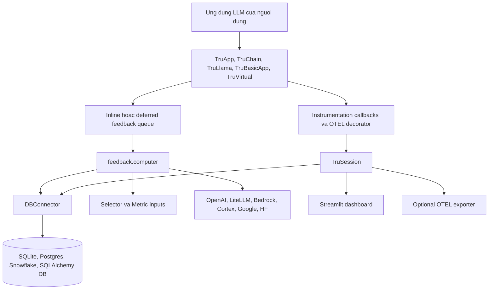
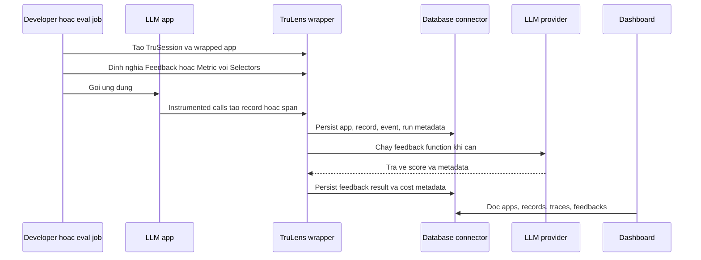
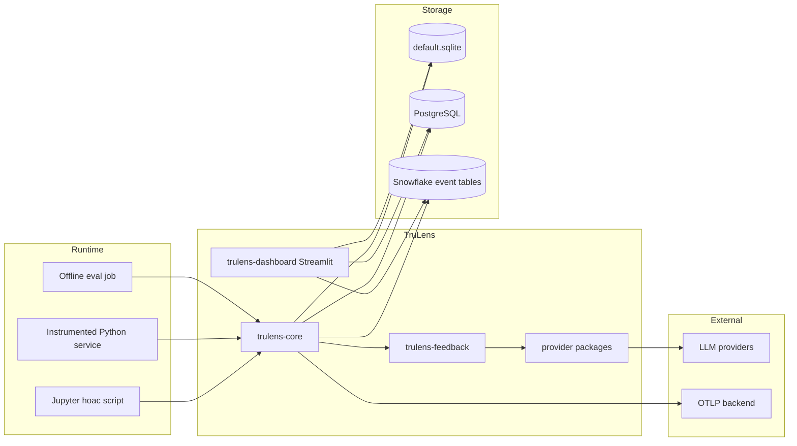
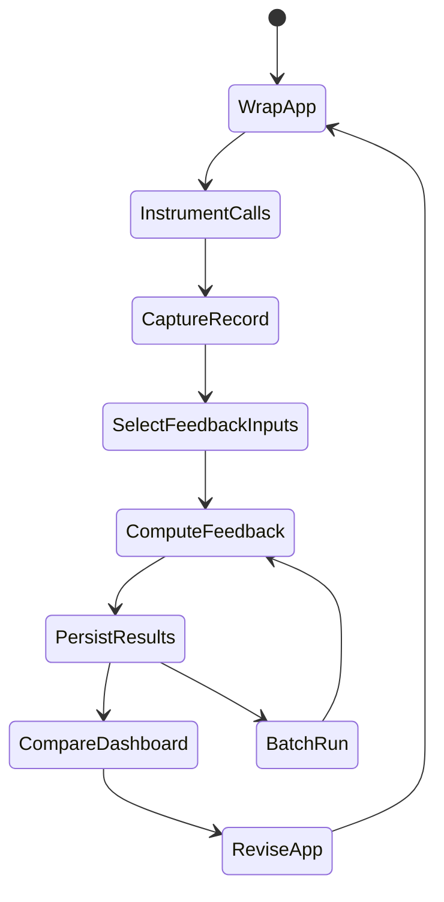
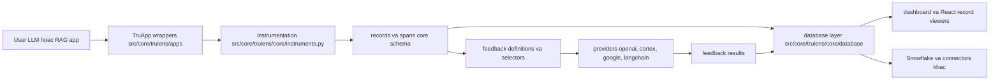
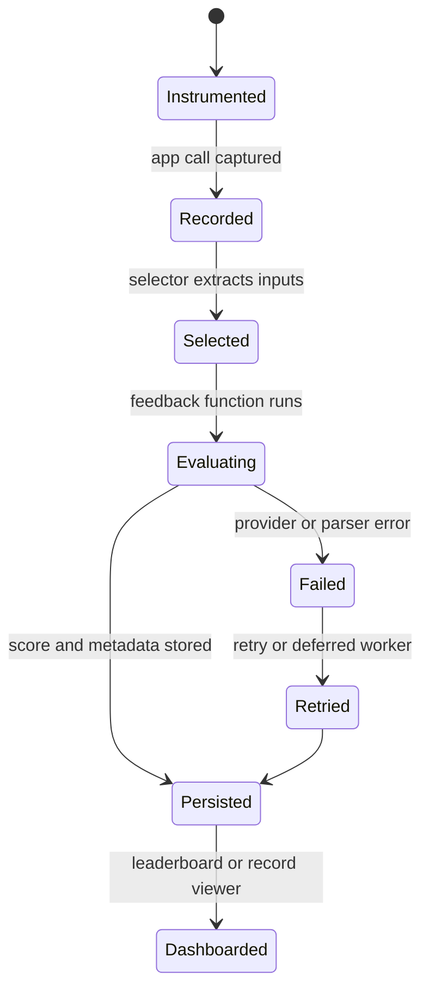
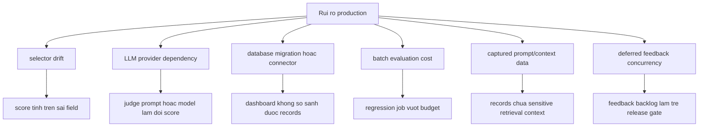

# Ghi chú kiến trúc TruLens

## Tóm tắt điều hành

TruLens là hệ sinh thái thư viện và dashboard ưu tiên Python để trace, evaluate và so sánh ứng dụng LLM một cách có hệ thống. README nhấn mạnh fine-grained stack-agnostic instrumentation, tracing dựa trên OpenTelemetry, feedback functions, đánh giá RAG, agentic evaluations, batch và inline evaluation, hỗ trợ MCP span và Selector API. Khác với các platform đặt server làm trung tâm, TruLens thường được nhúng trực tiếp vào ứng dụng hoặc notebook cần đánh giá, sau đó log record, span, feedback definition, feedback result, dataset và run vào database local hoặc bên ngoài để dashboard đọc.

File gốc `pyproject.toml` xác định `trulens` phiên bản `2.8.1`, Python `^3.10`, license MIT và layout package module hóa. Package top-level phụ thuộc `trulens-core`, `trulens-feedback`, `trulens-dashboard`, `trulens-otel-semconv` và package tương thích cũ `trulens_eval`. Các dependency group cho thấy kiến trúc thực: app integration dưới `src/apps/`, provider dưới `src/providers/`, connector dưới `src/connectors/`, core dưới `src/core/`, feedback dưới `src/feedback/`, dashboard dưới `src/dashboard/`, semantic convention dưới `src/otel/semconv/` và test dưới `tests/`.

## Bài toán được giải quyết

TruLens giải quyết câu hỏi "ứng dụng LLM của tôi có thực sự tốt không" ngay gần workflow của developer. Nó instrument call của ứng dụng, capture record hoặc OpenTelemetry span, cho phép team định nghĩa feedback function trên các phần được chọn của trace, chạy feedback inline, deferred hoặc batch, rồi cung cấp dashboard để so sánh app version và record. Điều này đặc biệt hữu ích cho RAG và agent system, nơi chất lượng câu trả lời phụ thuộc retrieval relevance, groundedness, tool behavior, reasoning consistency, safety và cost.

## Vai trò trong AI stack

TruLens nên được hiểu là SDK instrumentation và evaluation kèm UI tùy chọn:

- Nằm bên trong Python application code, notebook hoặc evaluation job.
- Bọc framework như LangChain, LangGraph, LlamaIndex, custom Python app và virtual/existing trace.
- Gọi LLM provider để tính feedback qua provider package.
- Lưu evaluation data vào SQLite, database tương thích SQLAlchemy, Postgres hoặc connector Snowflake.
- Có thể export hoặc tương tác qua OpenTelemetry semantic conventions.
- Bổ sung cho công cụ observability đặt server làm trung tâm bằng một lớp evaluation lập trình được.

## Bản đồ source tree

Bằng chứng trong repository:

- `README.md` giới thiệu TruLens cho tracking và evaluation experiment LLM, OpenTelemetry-based tracing, agentic evaluator, inline/batch evaluation, MCP span support và Selector API.
- `pyproject.toml` định nghĩa package tổng hợp `trulens` và các workspace dependency group cho apps, providers, connectors, dashboard, feedback, core và Snowflake.
- `src/core/trulens/core/session.py` định nghĩa `TruSession`, entrypoint chính để log prompt/output/metadata của app, feedback function và dashboard. Mặc định dùng `default.sqlite` nhưng chấp nhận `database_url` tương thích SQLAlchemy qua connector.
- `src/core/trulens/core/app.py` định nghĩa base `App` recorder, app metadata, feedbacks, instrumented methods, recording contexts, pending feedback queue và run support.
- `src/core/trulens/core/instruments.py` và `src/core/trulens/core/otel/instrument.py` triển khai instrumentation callback và decorator OpenTelemetry `instrument`.
- `src/core/trulens/core/schema/` định nghĩa schema app, record, feedback, event, dataset, groundtruth và selection.
- `src/core/trulens/core/database/` chứa database abstraction, SQLAlchemy implementation, ORM definition và Alembic migration cho record, event, ground truth, app version và run.
- `src/core/trulens/core/feedback/` và `src/core/trulens/core/metric/` định nghĩa `Feedback`, `Metric`, selector, provider và endpoint abstraction.
- `src/feedback/trulens/feedback/computer.py` tính feedback bằng cách chọn input từ graph span/record, chạy feedback function, track chi phí provider và ghi span của feedback computation.
- `src/feedback/trulens/feedback/templates/` chứa template safety, RAG, quality và agent.
- `src/apps/langchain/`, `src/apps/langgraph/`, `src/apps/llamaindex/`, `src/apps/gepa/` và `src/core/trulens/apps/` cung cấp wrapper theo framework và wrapper tổng quát như `TruChain`, `TruLlama`, `TruBasicApp`, `TruApp`, `TruVirtual`.
- `src/providers/` chứa package provider cho OpenAI, LiteLLM, Google, Bedrock, Cortex, Hugging Face và LangChain.
- `src/connectors/snowflake/` cung cấp Snowflake connector, Snowflake event table support, artifact cho server-side evaluation và artifact cho Streamlit-in-Snowflake dashboard.
- `src/dashboard/` định nghĩa `trulens-dashboard`, dựa trên Streamlit, Plotly, pandas và Jupyter dependencies.
- `docs/blog/posts/trulens_otel.md` và release posts mô tả hướng OpenTelemetry, hỗ trợ Postgres, dashboard update và cải tiến Run API.
- `tests/` chứa test unit, integration, e2e, legacy, load, util và docs notebook.

## Khái niệm cốt lõi

- **TruSession**: entrypoint kiểu singleton sở hữu database connector, vòng đời feedback evaluator, dashboard process và optional OpenTelemetry exporter.
- **App recorder**: wrapper quanh target app để instrument call và record hành vi.
- **Record**: invocation của ứng dụng đã capture, trước đây lưu như structured record và ngày càng được biểu diễn qua OTEL span/event.
- **Span**: đơn vị OpenTelemetry với semantic attribute TruLens cho app, record, input, output, retrieval, tool, MCP và feedback computation.
- **Feedback hoặc Metric**: evaluator function có selector để trích input từ record/span và tạo score hoặc score kèm metadata.
- **Selector**: mapping khai báo từ thuộc tính record/span sang argument của feedback function.
- **Provider**: backend LLM hoặc embedding dùng để tính feedback.
- **Run API**: đường batch evaluation trên dataset hoặc table với concurrency riêng cho invocation worker và metric worker.
- **Dashboard**: UI Streamlit để so sánh app, record, trace và feedback score.

## Kiến trúc nội bộ

Kiến trúc của TruLens là library-first. `TruSession` là coordinator cấp process, không phải remote server. `App` trong `src/core/trulens/core/app.py` bọc target app, gắn instrumentation, quản lý context variable cho recording, theo dõi pending feedback result và có thể kết nối run-level DAO. Các package framework subclass hoặc adapt base này cho LangChain, LangGraph, LlamaIndex, function cơ bản, object tùy biến, virtual trace và workflow tối ưu GEPA.

Feedback computation được tách khỏi recording. `src/feedback/trulens/feedback/computer.py` dựng record graph từ event, map `record_id` tới root, dùng selector để tạo feedback input, validate ambiguity, gọi feedback function, track chi phí provider và ghi evaluation span qua `OtelFeedbackComputationRecordingContext`. Sự tách biệt này cho phép TruLens chạy feedback inline cùng app, trong background/deferred evaluator hoặc trong offline batch run.

## Luồng runtime và dữ liệu

Workflow local phổ biến bắt đầu với `TruSession`, một wrapper framework và một hoặc nhiều feedback. Khi app chạy, instrumentation capture main method và các call nội bộ đã chọn. Feedback có thể chạy ngay, trong app thread, deferred bởi evaluator thread/process hoặc muộn hơn qua batch run configuration. Dashboard đọc cùng database; không cần collector service bên ngoài.

## Topology triển khai và vận hành

Triển khai TruLens thường là chọn package và database chứ không dựng web service trung tâm. Local và notebook workflow có thể dùng `default.sqlite`. Team dùng chung có thể dùng SQLAlchemy URL, Postgres hoặc Snowflake connector. Dashboard là process Streamlit được khởi động từ session hoặc import qua `trulens.dashboard.run`. Deployment Snowflake có artifact connector cho server-side evaluation và đường Streamlit-in-Snowflake, dù một số đường setup SiS dashboard đã được đánh dấu deprecated trong code connector và release notes.

## Vòng đời và phụ thuộc module

Vòng đời này ánh xạ trực tiếp vào module. App wrapping nằm trong `src/core/trulens/core/app.py` và `src/apps/`. Instrumentation nằm trong `src/core/trulens/core/instruments.py` và `src/core/trulens/core/otel/instrument.py`. Persistence nằm trong `src/core/trulens/core/database/` và connector. Feedback selection và computation nằm trong `src/core/trulens/core/feedback/`, `src/core/trulens/core/metric/` và `src/feedback/trulens/feedback/computer.py`. Visualization nằm trong `src/dashboard/`.

## Điểm mở rộng

- Thêm app integration mới dưới `src/apps/<framework>/`, thường adapt base `App` recorder.
- Thêm custom app bằng `TruApp` hoặc `@instrument` ở cấp method thay vì viết package mới.
- Thêm feedback metric bằng cách triển khai `Metric` hoặc `Feedback` với selector.
- Thêm prompt template dưới `src/feedback/trulens/feedback/templates/`.
- Thêm provider support dưới `src/providers/<provider>/` với provider và endpoint implementation.
- Thêm database hoặc warehouse integration dưới `src/connectors/`.
- Thêm OTEL semantic attribute trong `src/otel/semconv/` khi có span concept mới.
- Thêm behavior dashboard trong `src/dashboard/trulens/dashboard/` khi UI cần view mới.

## Tích hợp

TruLens tích hợp với LangChain, LangGraph, LlamaIndex, custom Python app, virtual trace, GEPA optimization, OpenAI/Azure OpenAI, LiteLLM, Google Gemini, Bedrock, Snowflake Cortex, Hugging Face, LangChain models, Snowflake connector, MCP span semantics và backend tracing tương thích OpenTelemetry. Package deprecated `trulens_eval` vẫn là cầu tương thích, trong khi import mới nằm dưới `trulens.core`, `trulens.feedback`, `trulens.dashboard`, `trulens.apps`, `trulens.providers` và `trulens.connectors`.

## Cấu hình, triển khai và vận hành

Các lựa chọn cấu hình quan trọng:

- Database connector: SQLite mặc định, SQLAlchemy URL, Postgres hoặc Snowflake connector.
- Feedback mode: inline, app-thread, deferred hoặc batch.
- Provider credentials: OpenAI, LiteLLM, Bedrock, Cortex, Google, Hugging Face hoặc LangChain providers.
- OpenTelemetry: theo tài liệu/blog hiện tại được bật mặc định, có điều khiển môi trường như `TRULENS_OTEL_TRACING`.
- Dashboard: process Streamlit local, hiển thị notebook hoặc triển khai hướng Snowflake.
- Concurrency: tùy chọn Run API như số worker invocation và metric, cùng retry interval của deferred evaluator trong `TruSession`.

Vận hành chủ yếu là vận hành ứng dụng: đảm bảo instrumentation không tạo latency quá mức, feedback call tôn trọng rate limit và cost budget của provider, database migration chạy trước khi dashboard đọc, và evaluation job có thể tái lập theo app version, prompt version, dataset và metric version.

## Observability, testing, evaluation và failure modes

Test TruLens được tổ chức dưới `tests/docs_notebooks`, `tests/e2e`, `tests/integration`, `tests/unit`, `tests/load`, `tests/legacy` và các thư mục tiện ích. Root `pyproject.toml` cấu hình pytest marker cho required-only, optional, Snowflake và Hugging Face tests. Repository cũng có `docker/test-database.yaml` cho test database với Postgres và MySQL.

Failure mode:

- **Missed instrumentation**: nếu main method hoặc call framework lồng nhau không được wrap, record sẽ thiếu.
- **Selector ambiguity**: selector có thể match nhiều span hoặc không match span nào, làm input feedback mơ hồ.
- **Provider instability**: LLM judge call có thể fail, rate limit, drift hoặc tốn chi phí.
- **Deferred evaluator stall**: `TruSession` có retry interval cho feedback job đang chạy hoặc đã fail vì background work có thể đứng.
- **Database mismatch**: dashboard và evaluator code cần migration schema tương thích với package version.
- **Dashboard performance**: bảng record lớn cần query limit, aggregation và tuning database.
- **Độ phức tạp chuyển đổi OTEL**: đường record-based cũ và đường span/event mới có thể cùng tồn tại trong giai đoạn migration.

## Rủi ro bảo mật và quản trị

TruLens thường thấy prompt thô, retrieved context, tool argument, model output, định danh người dùng và reasoning của evaluator. Feedback function có thể gửi các phần dữ liệu được selector chọn tới external LLM provider. Team cần review selector cẩn thận, redact field nhạy cảm, kiểm soát provider credential, hạn chế truy cập dashboard, đặt retention cho database và giữ credential Snowflake/Postgres theo least privilege.

Governance nên xem feedback definition như policy evaluation có version. Một groundedness score từ provider, model hoặc prompt template này không tự động so sánh được với cái khác. Dataset specification, app version, prompt version và metric definition nên được log cùng nhau.

## Hướng dẫn đọc

1. Đọc `README.md` cho workflow sản phẩm và ví dụ nhanh.
2. Đọc `pyproject.toml` để hiểu layout package module hóa.
3. Đọc `src/core/trulens/core/session.py` cho `TruSession`.
4. Đọc `src/core/trulens/core/app.py` cho hành vi app recording.
5. Đọc `src/core/trulens/core/otel/instrument.py` cho OpenTelemetry instrumentation.
6. Đọc `src/core/trulens/core/schema/` và `src/core/trulens/core/database/` cho persistence.
7. Đọc `src/feedback/trulens/feedback/computer.py` và template cho feedback execution.
8. Đọc một framework package dưới `src/apps/` và một provider package dưới `src/providers/`.
9. Đọc `src/dashboard/` và docs/blog posts cho dashboard và hướng vận hành.

## Lộ trình học

1. Wrap một function đơn giản bằng `TruBasicApp` hoặc `@instrument`.
2. Thêm một feedback metric với selector đơn giản.
3. Chuyển sang bộ RAG triad: context relevance, groundedness, answer relevance.
4. Chạy dashboard trên SQLite local.
5. Thử wrapper framework như LangChain hoặc LlamaIndex.
6. Chuyển storage sang Postgres hoặc Snowflake cho evaluation dùng chung.
7. Thêm batch run và concurrency control cho regression testing.

## Thuật ngữ

- **Feedback function**: evaluator callable trả về score hoặc score kèm metadata.
- **Selector**: biểu thức chọn field record/span làm input evaluator.
- **RAG Triad**: mẫu đánh giá context relevance, groundedness và answer relevance.
- **TruSession**: coordinator cho database, dashboard, feedback evaluator và OTEL exporter.
- **TruApp**: wrapper tổng quát cho custom app.
- **TruVirtual**: wrapper cho dữ liệu đã capture mà không có live app object.
- **OTEL semantic conventions**: tên attribute và span type dùng cho telemetry liên thông.
- **Deferred feedback**: chế độ evaluation chạy sau app call.

## Deep Dive Bám Theo Repository

TruLens là framework instrumentation và feedback-computation hơn là một trace warehouse tập trung. Repository thể hiện điều này qua các package dưới `github-repos/05-observability-evaluation-llmops/trulens/src/core/`, `src/feedback/`, `src/providers/`, `src/dashboard/`, `src/connectors/` và `src/otel/semconv/`. Core package chứa app wrappers, sessions, database abstractions, selectors, schema objects và instrumentation. Feedback package chứa evaluator prompts, output schemas, LLM provider abstractions, RAG/quality/safety templates và feedback computers. Provider packages tích hợp model APIs, còn connectors và dashboard code làm kết quả có thể xem và chia sẻ.

Vấn đề thiết kế chính là feedback functions có runtime behavior riêng. Một feedback có thể synchronous, deferred, batched, LLM-backed, embedding-backed hoặc ground-truth-backed. Nó có thể chọn context chunks, generated answers, tool outputs hoặc toàn bộ records. Vì vậy độ đúng của selector và chi phí evaluator quan trọng không kém việc capture trace. Các file nên đọc gồm `src/core/trulens/core/feedback/selector.py`, `src/core/trulens/core/feedback/feedback.py`, `src/feedback/trulens/feedback/templates/rag.py`, `src/feedback/trulens/feedback/llm_provider.py` và `src/feedback/trulens/feedback/groundtruth.py`.

### Checklist Sẵn Sàng Production

- Version feedback definitions, selectors, evaluator prompts, provider model names và output schemas cùng nhau. Một score chỉ có nghĩa khi tất cả thành phần này ổn định.
- Test selectors trên records thật, gồm missing context, streaming outputs, tool calls và multi-step agent traces.
- Đặt giới hạn cost và concurrency cho LLM-backed feedback, nhất là batch và deferred evaluations.
- Chọn storage có chủ đích: SQLite local hữu ích cho development, còn Postgres hoặc Snowflake-backed workflows cần review migration và access control.
- Review `src/otel/semconv/` và experimental OTEL tracing trước khi tích hợp TruLens vào observability platform rộng hơn.
- Đưa dashboard và connector behavior vào validation. Feedback result persist thành công nhưng không so sánh được trong dashboard thì chưa hữu ích về vận hành.
- Dùng `tests/e2e/`, `tests/integration/` và ví dụ dưới `examples/quickstart/` và `examples/experimental/` làm tham chiếu scenario coverage.

### Hướng Dẫn Đọc Cho Senior Architect

Bắt đầu ở `src/core/trulens/apps/` và `src/core/trulens/core/instruments.py` để hiểu capture. Tiếp theo đọc `src/core/trulens/core/schema/` và `src/core/trulens/core/database/` cho persisted objects. Sau đó đọc `src/core/trulens/core/feedback/` và `src/feedback/trulens/feedback/` để hiểu evaluator definition và execution. Cuối cùng inspect `src/providers/`, `src/connectors/snowflake/`, `src/dashboard/` và `src/otel/semconv/` để hiểu các bề mặt tích hợp production.

### Kịch Bản Vận Hành Cần Diễn Tập

Diễn tập TruLens bằng cách chứng minh ý nghĩa score, không chỉ chứng minh score được tạo. Capture một RAG call, inspect record tree và xác nhận thủ công selectors chọn đúng context và answer fields. Chạy cùng feedback set với judge model hoặc prompt đã đổi và so sánh distributions trước khi chấp nhận evaluator version mới. Cuối cùng, chạy deferred feedback trong tình huống provider throttling và kiểm tra backlog, retry behavior, persisted metadata, dashboard comparison và release-gate decisions.

### Dấu Hiệu Cần Review Lại Kiến Trúc

Cần review lại kiến trúc TruLens nếu selector phụ thuộc vào cấu trúc record không ổn định, nếu feedback function vừa đổi prompt vừa đổi model nhưng vẫn dùng cùng tên metric, hoặc nếu dashboard chỉ hiển thị score mà không cho biết evaluator version. Với RAG và agent, score sai field có thể nguy hiểm hơn không có score, vì nó tạo cảm giác kiểm soát giả. Vì vậy release gate nên kiểm tra cả trace capture, selector binding, evaluator configuration, provider availability và dashboard comparison.

Một kịch bản thực tế là cùng một câu hỏi RAG có context bị thiếu, context sai và context đúng. Bộ feedback phải phân biệt được ba trường hợp này qua selector và evaluator, không chỉ trả về một score trung bình. Khi kết quả dùng cho quyết định release, hãy lưu cả record mẫu, cấu hình feedback, provider version và dashboard query để người khác tái kiểm tra sau này.

Ngoài ra, cần phân biệt lỗi ứng dụng với lỗi evaluator. Nếu app trả lời sai nhưng evaluator cũng chọn sai context, kết quả review sẽ không giúp cải thiện hệ thống. Vì vậy log vận hành nên giữ trạng thái app call, trạng thái feedback call, lỗi provider, thời gian chạy và metadata selector trong cùng một chuỗi điều tra.
