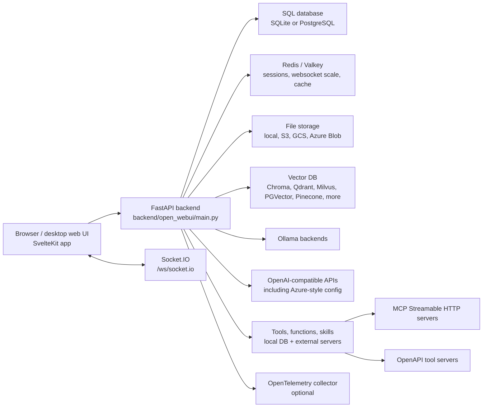
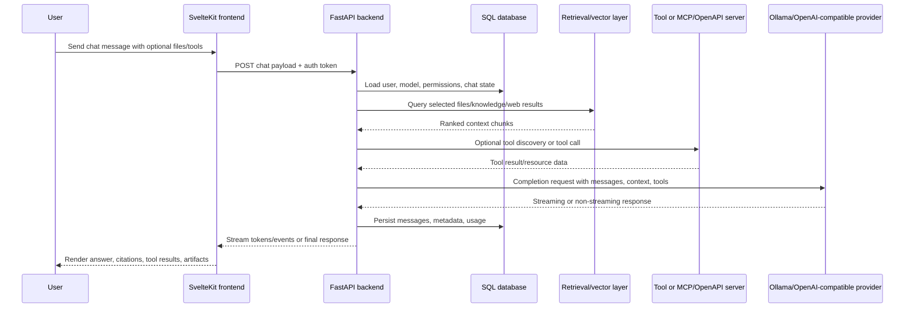
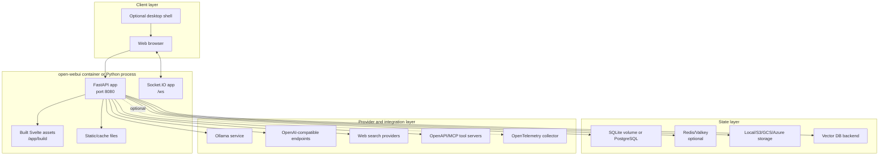
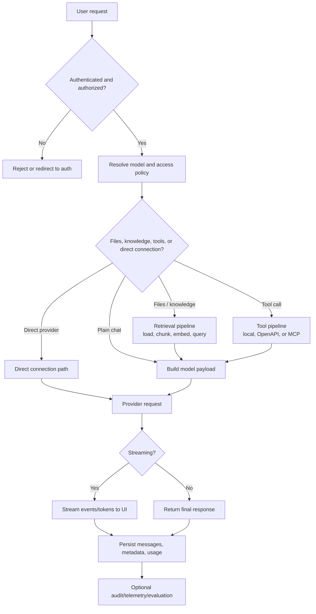
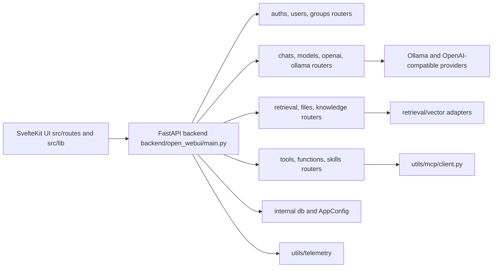
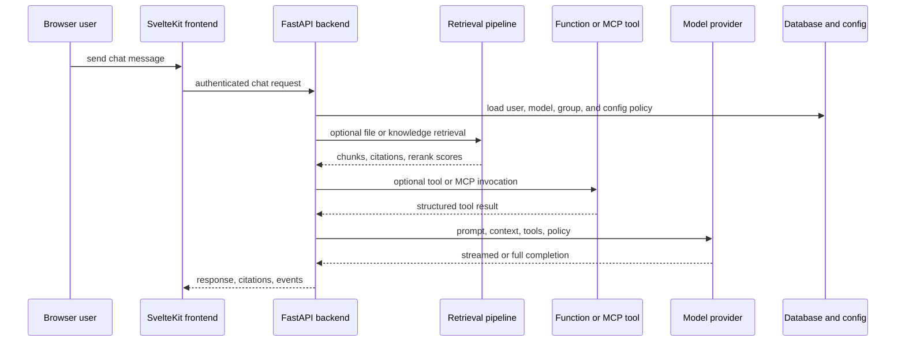
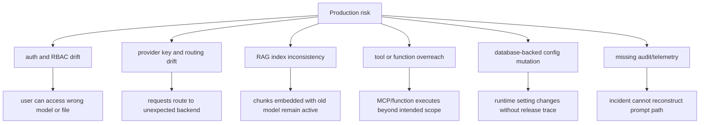

# Open WebUI - Architecture Notes

## Executive summary

`github-repos/06-tooling-mcp-ai-platform/open-webui` is a full-stack, self-hosted AI platform. It combines a SvelteKit frontend, a FastAPI backend, database-backed configuration, model-provider gateways, RAG pipelines, tool execution, MCP/OpenAPI tool server integrations, file storage, optional Redis-based scale-out, and optional OpenTelemetry instrumentation.

The repository is much larger than a chat UI. It acts as an AI workbench and control plane: users can chat with local or remote models, upload and index documents, manage model access, run tools and functions, connect external tool servers, administer users/groups, configure retrieval, expose pipelines, and deploy through Docker or Python packaging. The codebase is organized around a clear separation: frontend routes and stores in `src/`, backend routers/models/utilities in `backend/open_webui/`, and deployment/runtime configuration through `.env.example`, `Dockerfile`, `docker-compose.yaml`, and `pyproject.toml`.

## Problem solved

Open WebUI solves the gap between raw model APIs and a governed, self-hosted AI workspace. Raw APIs expose completion endpoints, but teams also need:

- A browser-based chat and workspace experience.
- Centralized user, role, group, and model access management.
- Multi-provider model routing for Ollama, OpenAI-compatible APIs, Azure/OpenAI-style deployments, and other SDK-backed providers.
- Document ingestion, vector search, hybrid search, reranking, web search, and knowledge collections.
- Tool/function execution, including OpenAPI and MCP tool server connections.
- Operational controls: persistent configuration, health checks, Redis, file storage backends, audit logging, and OpenTelemetry.

The repo implements these as one deployable application rather than scattered scripts.

## AI stack role

Open WebUI sits at the platform layer. It is not just a model client; it is a user-facing AI application gateway, retrieval orchestrator, tool broker, and administration surface.

## Source tree map

| Path | Role |
| --- | --- |
| `README.md` | Product overview, supported features, install paths, Docker/pip examples, offline mode notes, and provider support. |
| `package.json` | Frontend package metadata and scripts for SvelteKit/Vite, checks, linting, frontend tests, and Pyodide asset fetch. |
| `pyproject.toml` | Python package metadata, FastAPI backend dependencies, optional vector DB dependencies, and `open-webui` app entry point. |
| `.env.example` | Environment variable examples for providers, CORS, telemetry opt-out, and vector DB configuration. |
| `Dockerfile` | Multi-stage frontend/backend image build, optional CUDA/Ollama/slim behavior, model prefetching, healthcheck, and runtime command. |
| `docker-compose.yaml` | Default local deployment with `ollama`, `open-webui`, data volume, port mapping, and `OLLAMA_BASE_URL`. |
| `docker-compose.otel.yaml` | OpenTelemetry/Grafana LGTM deployment example. |
| `TROUBLESHOOTING.md` | Operational explanation of the backend reverse proxy to Ollama and Docker networking guidance. |
| `docs/SECURITY.md` | Security policy, especially around tool/function code execution and admin trust boundaries. |
| `src/` | SvelteKit frontend routes, components, stores, API clients, workers, and workspace/admin views. |
| `backend/open_webui/main.py` | FastAPI app construction, lifespan startup/shutdown, middleware, router mounting, config endpoint, health/readiness endpoints, and static app serving. |
| `backend/open_webui/config.py` | Persistent configuration defaults, environment parsing, provider URLs, feature flags, RAG settings, auth settings, and storage/cache paths. |
| `backend/open_webui/env.py` | Environment loading, logging setup, version/data directories, DB/Redis options, safe mode, audit logging, and telemetry env flags. |
| `backend/open_webui/internal/` | Database engines/sessions and database-backed runtime configuration state. |
| `backend/open_webui/models/` | SQLAlchemy/Pydantic data models for users, chats, files, tools, functions, groups, memories, prompts, knowledge, and more. |
| `backend/open_webui/routers/` | FastAPI routers for auth, users, chats, models, Ollama, OpenAI, retrieval, tools, functions, files, evaluations, pipelines, SCIM, terminals, and admin utilities. |
| `backend/open_webui/retrieval/` | Document loading, embeddings, reranking, vector DB abstraction, web search, and RAG query helpers. |
| `backend/open_webui/storage/` | Local and cloud storage providers. |
| `backend/open_webui/utils/` | Chat pipeline, middleware, model/provider helpers, MCP client, OpenAPI tool conversion, telemetry, and many integration utilities. |
| `backend/open_webui/socket/` | Socket.IO integration used by the frontend for realtime events and browser-executed tasks. |

## Core concepts

### Self-hosted AI workspace

The application is designed to run under the operator's control. It supports local Ollama deployments, OpenAI-compatible endpoints, offline mode, local data volumes, and external storage/vector providers when needed. This makes it a platform component rather than a simple hosted API wrapper.

### Model gateway

Backend routers `routers/ollama.py` and `routers/openai.py` aggregate and proxy model APIs. The application can list models, route chat completions, handle streaming responses, call embeddings APIs, and expose compatibility routes such as OpenAI-style chat/completions and response endpoints. `utils/chat.py` and `utils/middleware.py` coordinate model selection, direct connections, arena models, functions, files, tools, and response post-processing.

### RAG and knowledge

`routers/retrieval.py`, `retrieval/vector/factory.py`, and `retrieval/vector/main.py` implement the retrieval layer. Documents and web results can be chunked, embedded, stored in collections, and queried through vector or hybrid search. The factory supports many vector backends, including Chroma, Qdrant, Milvus, Pinecone, PGVector, OpenSearch, Elasticsearch, Oracle, Weaviate, S3 vector storage, and Valkey.

### Tools, functions, skills, and tool servers

Open WebUI has local tools/functions stored in the application database and external tool server support. `utils/tools.py` handles access checks, built-in tool catalogs, OpenAPI conversion, HTTP operation execution, and MCP tool server discovery. `utils/mcp/client.py` implements a Streamable HTTP MCP client with initialization, tool listing, tool calling, resource listing, and resource reading.

### Persistent configuration

Configuration is not only environment variables. `internal/config.py` defines database-backed `ConfigVar` and `AppConfig` state, with optional Redis synchronization. `main.py` populates `app.state.config` with model provider settings, auth settings, feature toggles, RAG options, web search providers, image/audio options, tool server connections, terminal server connections, and more.

### Realtime browser integration

The frontend root layout opens a Socket.IO connection and stores it in Svelte stores. It also initializes a Pyodide worker for browser-side Python execution and handles session-targeted events such as Python execution, tool execution, and direct chat completion requests.

## Internal architecture

### Backend bootstrap

`backend/open_webui/main.py` is the central runtime entry point. Its lifespan handler:

- Initializes application loop and instance ID.
- Runs startup configuration and optional safe mode behavior.
- Creates an initial admin user from environment when configured and no users exist.
- Connects to Redis when configured and starts a Redis task command listener.
- Initializes base model cache, tool servers, and terminal servers.
- Marks `/ready` as available by setting `startup_complete`.
- Cleans up background listener tasks on shutdown.

The same file mounts middleware, routers, static assets, the Socket.IO app, health endpoints, config/version endpoints, OAuth client callback routes, and the SPA fallback.

### Data and configuration layer

`internal/db.py` sets up both synchronous and asynchronous SQLAlchemy engines. The sync engine supports startup tasks, migrations, health checks, and configuration reads. The async engine is used by runtime FastAPI dependencies. SQLite, SQLCipher, and PostgreSQL paths are handled, including SQLite WAL pragmas and PostgreSQL async driver configuration.

`internal/config.py` stores application configuration as database-backed JSON state. This is important operationally because administrators can update settings at runtime without rebuilding images.

### Frontend structure

The frontend lives under `src/`:

- `src/routes/+layout.svelte` loads backend config, creates sockets, handles version/deployment changes, initializes Pyodide, and coordinates global browser behavior.
- `src/routes/(app)/+layout.svelte` builds the authenticated application shell, loads workspace data, manages settings/sidebar state, and handles app-level shortcuts.
- `src/routes/(app)/+page.svelte` renders the main chat view.
- `src/lib/stores/index.ts` centralizes Svelte stores for user/config, sockets, models, chats, tools, knowledge, functions, UI state, workers, and workspace resources.
- `src/lib/apis/*` contains typed fetch helpers for backend APIs, direct model connections, Ollama, OpenAI, tool servers, and generated task endpoints.

### Router and model boundaries

Backend routers mirror user-facing capabilities:

- Access and identity: `auths.py`, `users.py`, `groups.py`, `scim.py`.
- AI conversation: `chats.py`, `models.py`, `ollama.py`, `openai.py`, `tasks.py`.
- Retrieval and files: `retrieval.py`, `knowledge.py`, `files.py`.
- Workspace assets: `tools.py`, `functions.py`, `skills.py`, `prompts.py`, `folders.py`, `memories.py`.
- Collaboration and productivity: `channels.py`, `notes.py`, `automations.py`, `calendar.py`.
- Operations and administration: `configs.py`, `analytics.py`, `evaluations.py`, `utils.py`, `terminals.py`, `pipelines.py`.

SQL/data models under `backend/open_webui/models/` provide the persistent shape behind these routers.

## End-to-end flow

## Runtime and data flow

### Authentication and session flow

The frontend gets `/api/config`, authenticates through the backend, stores user state in Svelte stores, and opens a Socket.IO connection with the token. Backend middleware handles auth tokens, sessions, CORS, security headers, optional audit logging, and optional Redis-backed session storage.

### Chat flow

The runtime chat path is coordinated by:

- `src/lib/apis/*` for frontend requests and direct provider calls.
- `backend/open_webui/main.py` for route mounting and `CHAT_COMPLETION_HANDLER` registration.
- `backend/open_webui/utils/chat.py` for provider dispatch.
- `backend/open_webui/utils/middleware.py` for payload processing, files, tools, filters, code interpreter tags, streaming event handling, and response post-processing.
- `routers/ollama.py` and `routers/openai.py` for provider-specific proxying.

### RAG ingestion and query flow

1. User uploads a file, supplies text, enters a URL, or triggers web search.
2. `routers/files.py` and `routers/retrieval.py` store the file and extract text.
3. Retrieval helpers chunk documents and call embedding functions.
4. `retrieval/vector/factory.py` selects the configured vector backend.
5. Collections are created or updated with `VectorItem` records.
6. Chat-time retrieval queries collections, optionally applies hybrid search/reranking, and injects selected context into the model payload.

### Tool and MCP flow

External tool connections are represented in app configuration. `utils/tools.py` can read OpenAPI specs, convert operations into tool payloads, execute HTTP operations, and cache server data. For MCP servers, `utils/mcp/client.py` initializes a Streamable HTTP MCP session, lists tools/resources, and calls tools. Local DB-backed tools and functions are still subject to access checks before execution.

### File and object storage flow

`storage/provider.py` abstracts storage. The default provider is local storage, but the same interface supports S3, Google Cloud Storage, and Azure Blob Storage. Cloud providers support explicit credentials or platform identity patterns, depending on the provider.

## Deployment and operations topology

## Extension points

### Backend routes and data models

New backend capabilities usually require:

- A router under `backend/open_webui/routers/`.
- A persistent model under `backend/open_webui/models/` if state is required.
- Configuration entries in `config.py` or database-backed `AppConfig` when administrators must tune behavior.
- Frontend API helpers under `src/lib/apis/`.
- Store updates under `src/lib/stores/index.ts` if global UI state is needed.

### Provider integrations

Provider work typically extends `routers/openai.py`, `routers/ollama.py`, `utils/chat.py`, or provider-specific utility modules. The existing pattern is to normalize provider differences at the backend boundary so the frontend can stay centered on chat/model abstractions.

### Retrieval and vector DBs

Vector DB support is intentionally pluggable. To add another vector backend, implement the `VectorDBBase` contract from `retrieval/vector/main.py` and wire it into `retrieval/vector/factory.py`. Keep collection naming, tenant behavior, search result shape, and delete/reset semantics consistent.

### Tool servers and MCP

External tools can enter through:

- OpenAPI specs converted by `utils/tools.py`.
- MCP Streamable HTTP connections through `utils/mcp/client.py`.
- Local DB-backed tool/function definitions managed by workspace routes.
- Built-in tool categories such as knowledge, web search, image generation, code execution, notes, channels, automations, and calendar.

### Frontend application

The frontend extension pattern is route-first. Add a route under `src/routes/`, a reusable component under `src/lib/components/`, API helpers under `src/lib/apis/`, and stores only when state must be shared across screens.

## Integrations

Open WebUI integrates with many systems, visible in source and package metadata:

- Model providers: Ollama, OpenAI-compatible endpoints, Azure OpenAI-style credentials, Anthropic, Google GenAI, and provider SDKs available through backend dependencies.
- Vector stores: Chroma, Qdrant, Milvus, Pinecone, PGVector, OpenSearch, Elasticsearch, Oracle, Weaviate, S3 vector storage, Valkey, and others through optional dependencies.
- Document processing: PDF, Office, markdown, OCR, loaders, web extraction, and embeddings/reranking engines.
- Tools: local tools/functions, OpenAPI tool servers, MCP tool servers, terminal servers, and code execution.
- Auth and identity: local auth, OAuth/OIDC patterns, LDAP, SCIM, trusted headers, RBAC/groups.
- Storage: local filesystem, S3, Google Cloud Storage, Azure Blob Storage.
- Operations: Redis/Valkey, Docker Compose, OpenTelemetry, Grafana LGTM example, health/readiness endpoints.

## Configuration, deployment, and operations

### Packaging and startup

- Docker is the primary production-friendly path. `Dockerfile` builds frontend assets with Node 22 and packages the backend in a Python 3.11 runtime.
- `docker-compose.yaml` runs `ollama` and `open-webui`, maps `${OPEN_WEBUI_PORT-3000}:8080`, and persists `/app/backend/data`.
- The Python package exposes `open-webui = open_webui:app` through `pyproject.toml`.
- The Docker healthcheck calls `/health`.

### High-value environment settings

| Setting area | Examples and source grounding |
| --- | --- |
| Model backends | `OLLAMA_BASE_URL`, `OLLAMA_BASE_URLS`, `OPENAI_API_BASE_URL`, `OPENAI_API_BASE_URLS`, `OPENAI_API_KEY` from `.env.example` and backend config. |
| Secrets | `WEBUI_SECRET_KEY`, provider keys, OAuth secrets, storage credentials. |
| Data | Docker volume `/app/backend/data`, `DATA_DIR`, `DATABASE_URL`, upload/cache directories. |
| Redis | `REDIS_URL`, websocket/session settings, Redis task listener, config sync. |
| RAG | Embedding/reranking engines, vector DB selection, web search provider settings, document loader settings. |
| Tooling | Tool server connections, MCP initialization timeout, terminal server connections, code interpreter settings. |
| Security | CORS, trusted forwarded headers, safe mode, audit logging, OAuth/LDAP/SCIM settings. |
| Telemetry | `ENABLE_OTEL`, `ENABLE_OTEL_METRICS`, OTLP endpoint settings in `docker-compose.otel.yaml` and telemetry utilities. |

### Operational endpoints

- `/health`: basic application health.
- `/ready`: startup completion plus database and Redis readiness checks.
- `/health/db`: database health.
- `/api/config`: frontend-visible application configuration.
- `/api/version`: version reporting.
- `/ws/socket.io`: realtime channel for browser events.

### Scaling notes

For a single-node installation, SQLite plus local storage is the simplest path. For horizontal or more durable deployments, use PostgreSQL, Redis/Valkey, external object storage, and an external vector DB. Redis is especially important when websocket coordination, sessions, task commands, or multiple application instances are required.

## Observability, testing, evaluation, and failure modes

### Observability

The backend has optional OpenTelemetry instrumentation in `backend/open_webui/utils/telemetry`. It instruments FastAPI, SQLAlchemy, Redis, requests, HTTP clients, logging, and system metrics, and sends OTLP data to a collector. `docker-compose.otel.yaml` provides a Grafana LGTM example. The backend also supports JSON-style logging and optional audit logging through middleware.

### Testing and quality gates

Repository metadata shows these quality entry points:

- Frontend: `npm run check`, `npm run lint`, and `npm run test:frontend`.
- Backend: Python dev dependencies include pytest and ruff tooling; backend lint script references ruff.
- Evaluation: `routers/evaluations.py` and evaluation-related configuration support model and response evaluation workflows.

No dependencies were installed and no long builds were run for this documentation pass.

### Failure modes

- Provider misconfiguration: wrong base URL, invalid API key, unreachable Ollama container, or Azure/OpenAI credential mismatch.
- Startup readiness failure: database unavailable, Redis unavailable when configured, failed migration, or missing secret.
- RAG inconsistency: vector DB schema mismatch, embedding model unloaded, collection access failure, or large file extraction errors.
- Tool risk or outage: external OpenAPI/MCP server unreachable, OAuth/token failure, malformed OpenAPI schema, long-running tool, or unsafe local function.
- Websocket problems: missing Redis coordination in scale-out, token expiry, reverse proxy not forwarding websocket upgrades.
- Storage problems: volume permissions, cloud credential issues, object key conflicts, or cache directory exposure.
- Offline mode gaps: required models or embedding artifacts not pre-downloaded when network access is disabled.

## Security and governance risks

Open WebUI is a powerful administrative surface. Its security posture depends heavily on deployment configuration and role assignment.

Key risks and controls:

- Tool/function execution is intentionally powerful. `docs/SECURITY.md` states that granting tool creation/execution capabilities to non-admins is equivalent to giving highly privileged control. Keep `workspace.tools` restricted.
- Admin trust is central. Malicious admin actions and malicious external servers are outside the intended security boundary, so production deployments need strong admin identity governance.
- Provider secrets and user data are stored or referenced by the application. Protect `WEBUI_SECRET_KEY`, API keys, OAuth secrets, database credentials, Redis credentials, and storage credentials.
- RBAC, groups, model access, and route-level access checks must align. A model access policy is only useful if tool and retrieval access are also scoped.
- CORS and trusted forwarded headers should only be relaxed behind a trusted reverse proxy.
- Direct connections and browser-executed tasks can bypass parts of the backend control plane if not governed carefully.
- External MCP/OpenAPI tool servers expand the trust boundary. Treat their schemas, OAuth flows, and returned content as untrusted.
- File uploads, generated artifacts, caches, and vectorized documents may contain sensitive data. Backups, retention, deletion, and storage encryption need explicit policy.

## Lifecycle and dependency diagram

## Reading guide

Recommended reading order:

1. `README.md`, `.env.example`, `docker-compose.yaml`, and `Dockerfile` for product scope and runtime assumptions.
2. `backend/open_webui/main.py` to understand application startup, middleware, routers, and health endpoints.
3. `backend/open_webui/config.py`, `env.py`, `internal/db.py`, and `internal/config.py` for configuration and persistence.
4. `backend/open_webui/routers/openai.py`, `routers/ollama.py`, `utils/chat.py`, and `utils/middleware.py` for chat/model flow.
5. `backend/open_webui/routers/retrieval.py` and `retrieval/vector/*` for RAG.
6. `backend/open_webui/utils/tools.py` and `utils/mcp/client.py` for tool server integration.
7. `src/routes/+layout.svelte`, `src/routes/(app)/+layout.svelte`, `src/lib/stores/index.ts`, and `src/lib/apis/*` for frontend behavior.
8. `docs/SECURITY.md` before enabling tools/functions for broad user groups.

## Learning path

1. Start with a single-user Docker deployment using local storage and one Ollama or OpenAI-compatible provider.
2. Add a persistent database and inspect how chats, users, models, and files map to backend models.
3. Configure one knowledge collection and trace upload-to-vector-to-chat retrieval.
4. Add one external OpenAPI or MCP tool server and inspect access checks.
5. Enable Redis and review websocket/session behavior.
6. Add OpenTelemetry and audit logging before moving toward shared or production-like usage.
7. Finally, tune RBAC, groups, model access, storage retention, and backup policy.

## Glossary

| Term | Meaning in this repository |
| --- | --- |
| Open WebUI | The full-stack self-hosted AI workspace implemented by this repo. |
| SvelteKit | Frontend framework used under `src/`. |
| FastAPI | Backend framework used under `backend/open_webui/`. |
| Ollama router | Backend proxy/router for local or remote Ollama instances. |
| OpenAI router | Backend proxy/router for OpenAI-compatible model APIs. |
| RAG | Retrieval-augmented generation using files, web content, embeddings, vector search, and reranking. |
| Vector DB | Storage/search backend for embedded chunks. |
| Tool server | External OpenAPI or MCP server that exposes callable tools. |
| Function | Local executable extension managed by Open WebUI. |
| AppConfig | Database-backed runtime configuration wrapper. |
| Redis/Valkey | Optional cache/session/websocket/task coordination layer. |
| OTEL | OpenTelemetry instrumentation and export. |

## Repository-Grounded Deep Dive

Open WebUI is a full-stack AI control plane: SvelteKit frontend, FastAPI backend, model-provider routers, RAG pipeline, tool/function execution, MCP client integration, database-backed configuration, and optional telemetry/cache infrastructure. The key source boundaries are `github-repos/06-tooling-mcp-ai-platform/open-webui/src/` for frontend routes and components, `backend/open_webui/main.py` for backend bootstrap, `backend/open_webui/routers/` for API domains, `backend/open_webui/retrieval/` for ingestion and retrieval, `backend/open_webui/retrieval/vector/` for vector database adapters, `backend/open_webui/utils/mcp/client.py` for MCP integration, `backend/open_webui/utils/telemetry/` for OTEL, and `docker-compose*.yaml` for runtime topology examples.

The main architectural issue is that chat, retrieval, tool execution, and provider routing all meet at the user conversation boundary. A single prompt can traverse auth policy, model access policy, file permissions, vector search, reranking, function execution, MCP calls, and outbound model requests. That means production review must include data governance and action governance, not only model-provider configuration.

### Production Readiness Checklist

- Treat `.env.example`, `backend/open_webui/config.py`, `backend/open_webui/env.py`, and database-backed `AppConfig` values as a single configuration system. Runtime UI settings can be as important as environment variables.
- Review auth, SCIM, users, groups, model access, and file access together: `routers/auths.py`, `routers/scim.py`, `routers/users.py`, `routers/groups.py`, `routers/models.py`, and `utils/access_control/`.
- For RAG, pin embedding model, chunking policy, vector database adapter, reranker, file loader, and retention policy. The relevant source spans `backend/open_webui/retrieval/`, `retrieval/vector/dbs/`, and `utils/embeddings.py`.
- For tools and MCP, define allowed servers, tool scopes, network reachability, secret handling, and audit behavior. Review `routers/tools.py`, `routers/functions.py`, `routers/skills.py`, `tools/`, and `utils/mcp/client.py`.
- Monitor model latency, streaming disconnects, vector DB errors, file ingestion failures, websocket/socket health, Redis/Valkey health if enabled, task failures, and OTEL export status.
- Validate backup and restore for database state, uploaded files, vector indexes, user/group/model policies, prompts, functions, and knowledge collections.
- Exercise provider failover and rate-limit scenarios for `routers/openai.py`, `routers/ollama.py`, and any configured external model endpoints.

### Senior Architect Reading Path

Start with `backend/open_webui/main.py`, `backend/open_webui/config.py`, and `backend/open_webui/internal/db.py` to understand process and state. Then read routers by operational domain: auth/users/groups, models/openai/ollama, chats, retrieval/files/knowledge, and tools/functions/skills. Move next to `backend/open_webui/retrieval/vector/` and `backend/open_webui/utils/mcp/client.py`. Finish with frontend paths under `src/routes/`, `src/lib/apis/`, `src/lib/stores/`, and `src/lib/components/` to see how backend capabilities become user workflows.
