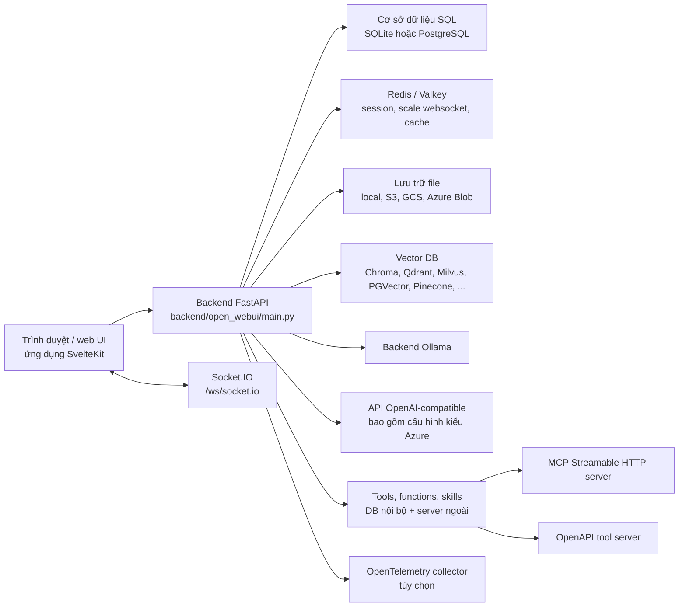
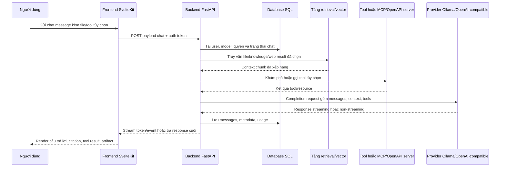
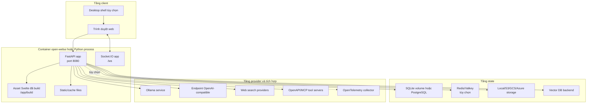
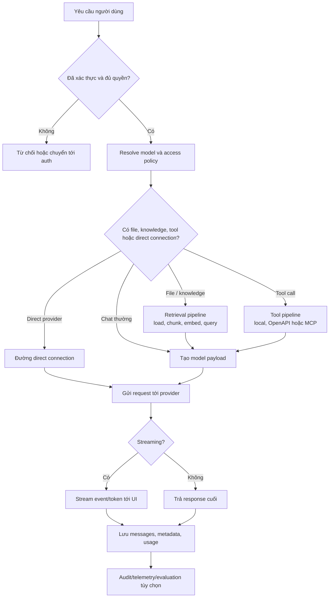
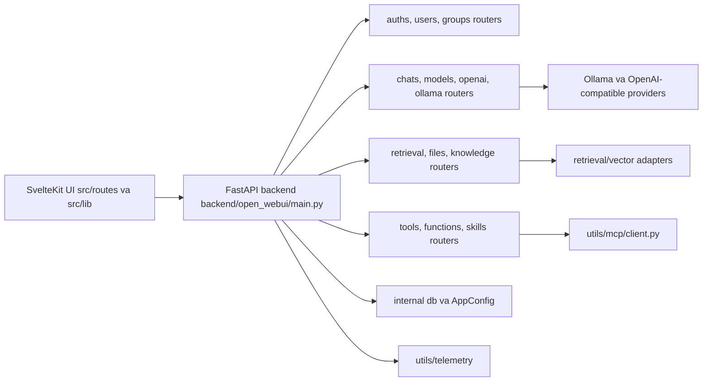
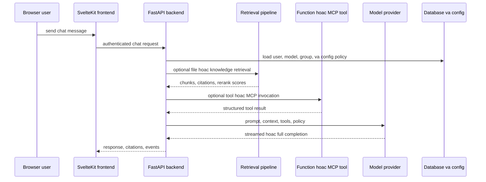
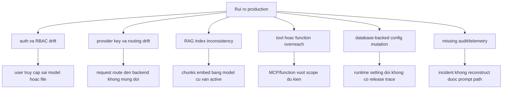

# Open WebUI - Ghi chú kiến trúc

## Tóm tắt điều hành

`github-repos/06-tooling-mcp-ai-platform/open-webui` là một nền tảng AI tự host theo mô hình full-stack. Repo kết hợp frontend SvelteKit, backend FastAPI, cấu hình lưu trong cơ sở dữ liệu, gateway tới nhiều nhà cung cấp mô hình, pipeline RAG, thực thi tool/function, tích hợp tool server qua OpenAPI/MCP, lưu trữ file, mở rộng bằng Redis, và quan sát hệ thống bằng OpenTelemetry.

Đây không chỉ là một giao diện chat. Open WebUI đóng vai trò như một workbench và control plane cho AI: người dùng có thể chat với mô hình local hoặc remote, upload và lập chỉ mục tài liệu, quản lý quyền truy cập mô hình, chạy tool và function, kết nối tool server bên ngoài, quản trị user/group, cấu hình retrieval, dùng pipeline, và triển khai qua Docker hoặc Python package. Ranh giới kiến trúc chính khá rõ: frontend ở `src/`, backend ở `backend/open_webui/`, cấu hình và triển khai ở `.env.example`, `Dockerfile`, `docker-compose.yaml`, và `pyproject.toml`.

## Vấn đề được giải quyết

API mô hình thô chỉ cung cấp endpoint sinh văn bản hoặc embedding. Một nhóm sản phẩm hoặc nền tảng cần nhiều hơn:

- Giao diện web để chat, quản lý workspace và làm việc lặp lại hằng ngày.
- Quản lý tập trung user, role, group và quyền truy cập mô hình.
- Điều phối nhiều nhà cung cấp mô hình như Ollama, OpenAI-compatible API, Azure/OpenAI-style deployment và các SDK provider khác.
- Ingestion tài liệu, vector search, hybrid search, reranking, web search và knowledge collection.
- Thực thi tool/function, bao gồm tool server OpenAPI và MCP.
- Năng lực vận hành: cấu hình bền vững, health check, Redis, backend lưu trữ file, audit logging và OpenTelemetry.

Repo hiện thực các năng lực này trong một ứng dụng có thể triển khai, thay vì tách rời thành nhiều script riêng lẻ.

## Vai trò trong AI stack

Open WebUI nằm ở tầng nền tảng ứng dụng. Nó vừa là giao diện người dùng, vừa là AI gateway, retrieval orchestrator, tool broker và bề mặt quản trị.

## Bản đồ cây nguồn

| Đường dẫn | Vai trò |
| --- | --- |
| `README.md` | Tổng quan sản phẩm, tính năng, cách cài đặt, ví dụ Docker/pip, offline mode và hỗ trợ provider. |
| `package.json` | Metadata frontend, script SvelteKit/Vite, kiểm tra, lint, test frontend và tải asset Pyodide. |
| `pyproject.toml` | Metadata Python package, dependency backend FastAPI, optional dependency cho vector DB và entry point `open-webui`. |
| `.env.example` | Ví dụ biến môi trường cho provider, CORS, opt-out telemetry và cấu hình vector DB. |
| `Dockerfile` | Build image nhiều stage, build frontend bằng Node, runtime Python 3.11, tùy chọn CUDA/Ollama/slim, prefetch model và healthcheck. |
| `docker-compose.yaml` | Triển khai local mặc định với `ollama`, `open-webui`, volume data, port mapping và `OLLAMA_BASE_URL`. |
| `docker-compose.otel.yaml` | Ví dụ triển khai OpenTelemetry/Grafana LGTM. |
| `TROUBLESHOOTING.md` | Giải thích backend reverse proxy tới Ollama và hướng dẫn network khi chạy Docker. |
| `docs/SECURITY.md` | Chính sách bảo mật, đặc biệt về code execution của tool/function và ranh giới tin cậy của admin. |
| `src/` | Frontend SvelteKit: routes, component, store, API client, worker, workspace/admin views. |
| `backend/open_webui/main.py` | Tạo app FastAPI, lifespan startup/shutdown, middleware, router mounting, config endpoint, health/readiness và phục vụ static SPA. |
| `backend/open_webui/config.py` | Default cấu hình bền vững, parse môi trường, provider URL, feature flag, RAG settings, auth settings và đường dẫn storage/cache. |
| `backend/open_webui/env.py` | Load `.env`, logging, version/data directory, DB/Redis options, safe mode, audit logging và telemetry env flags. |
| `backend/open_webui/internal/` | Database engine/session và cấu hình runtime lưu trong database. |
| `backend/open_webui/models/` | Model dữ liệu cho users, chats, files, tools, functions, groups, memories, prompts, knowledge và nhiều thực thể khác. |
| `backend/open_webui/routers/` | Router FastAPI cho auth, users, chats, models, Ollama, OpenAI, retrieval, tools, functions, files, evaluations, pipelines, SCIM, terminals và admin utilities. |
| `backend/open_webui/retrieval/` | Document loading, embeddings, reranking, vector DB abstraction, web search và helper RAG query. |
| `backend/open_webui/storage/` | Provider lưu trữ local và cloud. |
| `backend/open_webui/utils/` | Chat pipeline, middleware, helper provider/model, MCP client, chuyển OpenAPI thành tool, telemetry và nhiều utility tích hợp. |
| `backend/open_webui/socket/` | Tích hợp Socket.IO dùng bởi frontend cho sự kiện realtime và tác vụ chạy trong trình duyệt. |

## Khái niệm cốt lõi

### Workspace AI tự host

Ứng dụng được thiết kế để chạy dưới quyền kiểm soát của operator. Nó hỗ trợ Ollama local, endpoint OpenAI-compatible, offline mode, volume dữ liệu local, và các backend lưu trữ/vector bên ngoài khi cần. Vì vậy Open WebUI là một thành phần nền tảng, không chỉ là wrapper cho API được host sẵn.

### Gateway mô hình

`routers/ollama.py` và `routers/openai.py` gom và proxy API mô hình. Ứng dụng có thể list model, route chat completion, xử lý response streaming, gọi embedding API và expose các endpoint tương thích như OpenAI-style chat/completions hoặc responses. `utils/chat.py` và `utils/middleware.py` điều phối model selection, direct connection, arena model, function, file, tool và post-processing response.

### RAG và knowledge

`routers/retrieval.py`, `retrieval/vector/factory.py` và `retrieval/vector/main.py` tạo nên tầng retrieval. Tài liệu và web result có thể được chunk, embed, lưu vào collection và truy vấn bằng vector hoặc hybrid search. Factory hỗ trợ nhiều backend như Chroma, Qdrant, Milvus, Pinecone, PGVector, OpenSearch, Elasticsearch, Oracle, Weaviate, S3 vector storage và Valkey.

### Tool, function, skill và tool server

Open WebUI có tool/function nội bộ lưu trong database và hỗ trợ tool server bên ngoài. `utils/tools.py` xử lý access check, built-in tool catalog, chuyển OpenAPI operation thành tool payload, thực thi HTTP operation và khám phá MCP tool server. `utils/mcp/client.py` hiện thực MCP client qua Streamable HTTP với initialize, list tools, call tool, list resources và read resource.

### Cấu hình bền vững

Cấu hình không chỉ đến từ biến môi trường. `internal/config.py` định nghĩa `ConfigVar` và `AppConfig` lưu trong database, có thể đồng bộ qua Redis. `main.py` nạp `app.state.config` với provider settings, auth settings, feature toggles, RAG options, web search provider, image/audio settings, tool server connection, terminal server connection và nhiều cấu hình khác.

### Realtime và browser execution

Root layout của frontend mở kết nối Socket.IO và lưu vào Svelte store. Nó cũng khởi tạo Pyodide worker để chạy Python phía trình duyệt, đồng thời xử lý các event theo session như `execute:python`, `execute:tool` và direct chat completion request.

## Kiến trúc nội bộ

### Khởi động backend

`backend/open_webui/main.py` là entry point runtime quan trọng nhất. Lifespan handler thực hiện:

- Khởi tạo event loop và instance ID.
- Chạy startup configuration và safe mode nếu bật.
- Tạo admin user từ environment khi được cấu hình và chưa có user.
- Kết nối Redis nếu có và khởi động Redis task command listener.
- Khởi tạo cache model cơ sở, tool servers và terminal servers.
- Đánh dấu `/ready` sẵn sàng bằng `startup_complete`.
- Hủy background listener task khi shutdown.

Cùng file này cũng mount middleware, routers, static assets, Socket.IO app, health endpoint, config/version endpoint, OAuth client callback route và fallback cho SPA.

### Tầng dữ liệu và cấu hình

`internal/db.py` tạo cả engine SQLAlchemy sync và async. Engine sync phục vụ startup task, migration, health check và đọc cấu hình. Engine async được dùng bởi dependency FastAPI trong runtime. Code có nhánh cho SQLite, SQLCipher và PostgreSQL, bao gồm SQLite WAL pragma và cấu hình async driver cho PostgreSQL.

`internal/config.py` lưu cấu hình ứng dụng dưới dạng JSON trong database. Đây là điểm quan trọng về vận hành vì admin có thể cập nhật cấu hình lúc runtime mà không cần build lại image.

### Cấu trúc frontend

Frontend nằm trong `src/`:

- `src/routes/+layout.svelte` tải config backend, tạo socket, xử lý thay đổi version/deployment, khởi tạo Pyodide và điều phối hành vi global của trình duyệt.
- `src/routes/(app)/+layout.svelte` dựng shell cho user đã đăng nhập, tải dữ liệu workspace, quản lý settings/sidebar và shortcut cấp ứng dụng.
- `src/routes/(app)/+page.svelte` render màn hình chat chính.
- `src/lib/stores/index.ts` tập trung Svelte store cho user/config, socket, models, chats, tools, knowledge, functions, UI state, worker và resource workspace.
- `src/lib/apis/*` chứa fetch helper cho backend API, direct model connection, Ollama, OpenAI, tool server và endpoint tạo task.

### Ranh giới router và model

Router backend phản ánh các capability của sản phẩm:

- Truy cập và định danh: `auths.py`, `users.py`, `groups.py`, `scim.py`.
- Hội thoại AI: `chats.py`, `models.py`, `ollama.py`, `openai.py`, `tasks.py`.
- Retrieval và file: `retrieval.py`, `knowledge.py`, `files.py`.
- Tài nguyên workspace: `tools.py`, `functions.py`, `skills.py`, `prompts.py`, `folders.py`, `memories.py`.
- Cộng tác và productivity: `channels.py`, `notes.py`, `automations.py`, `calendar.py`.
- Vận hành và quản trị: `configs.py`, `analytics.py`, `evaluations.py`, `utils.py`, `terminals.py`, `pipelines.py`.

Các model trong `backend/open_webui/models/` định nghĩa lớp dữ liệu bền vững đứng sau các router này.

## Luồng end-to-end

## Runtime và data flow

### Authentication và session

Frontend gọi `/api/config`, xác thực với backend, lưu user state trong Svelte store và mở Socket.IO connection kèm token. Backend middleware xử lý auth token, session, CORS, security headers, audit logging tùy chọn và session storage qua Redis nếu được bật.

### Luồng chat

Đường runtime của chat được phối hợp bởi:

- `src/lib/apis/*` cho request từ frontend và direct provider call.
- `backend/open_webui/main.py` để mount route và đăng ký `CHAT_COMPLETION_HANDLER`.
- `backend/open_webui/utils/chat.py` để dispatch provider.
- `backend/open_webui/utils/middleware.py` để xử lý payload, file, tool, filter, code interpreter tag, streaming event và post-processing response.
- `routers/ollama.py` và `routers/openai.py` cho proxy provider cụ thể.

### Luồng ingestion và truy vấn RAG

1. User upload file, nhập text, cung cấp URL hoặc kích hoạt web search.
2. `routers/files.py` và `routers/retrieval.py` lưu file và trích xuất text.
3. Retrieval helper chunk tài liệu và gọi embedding function.
4. `retrieval/vector/factory.py` chọn vector backend theo cấu hình.
5. Collection được tạo hoặc cập nhật bằng các record `VectorItem`.
6. Khi chat, retrieval query collection, có thể áp dụng hybrid search/reranking, rồi inject context đã chọn vào model payload.

### Luồng tool và MCP

Kết nối tool bên ngoài được lưu trong cấu hình ứng dụng. `utils/tools.py` có thể đọc OpenAPI spec, chuyển operation thành tool payload, thực thi HTTP operation và cache dữ liệu server. Với MCP server, `utils/mcp/client.py` khởi tạo MCP session qua Streamable HTTP, list tools/resources và call tools. Tool/function nội bộ trong DB vẫn phải đi qua access check trước khi thực thi.

### Luồng file và object storage

`storage/provider.py` định nghĩa abstraction cho storage. Mặc định là local storage, nhưng cùng interface hỗ trợ S3, Google Cloud Storage và Azure Blob Storage. Provider cloud hỗ trợ credential tường minh hoặc identity của nền tảng, tùy provider.

## Topology triển khai và vận hành

## Điểm mở rộng

### Backend route và data model

Một capability backend mới thường cần:

- Router trong `backend/open_webui/routers/`.
- Model bền vững trong `backend/open_webui/models/` nếu cần state.
- Cấu hình trong `config.py` hoặc `AppConfig` nếu admin cần điều chỉnh hành vi.
- API helper phía frontend trong `src/lib/apis/`.
- Store trong `src/lib/stores/index.ts` nếu state phải dùng chung trên nhiều màn hình.

### Tích hợp provider

Tích hợp provider thường mở rộng `routers/openai.py`, `routers/ollama.py`, `utils/chat.py` hoặc utility riêng theo provider. Pattern hiện tại là normalize khác biệt provider ở backend boundary để frontend vẫn tập trung vào abstraction chat/model.

### Retrieval và vector DB

Vector DB được thiết kế để cắm thêm. Để thêm backend mới, cần implement contract `VectorDBBase` trong `retrieval/vector/main.py` rồi wire vào `retrieval/vector/factory.py`. Cần giữ nhất quán collection naming, tenant behavior, shape của search result và semantics của delete/reset.

### Tool server và MCP

External tool có thể đi vào hệ thống qua:

- OpenAPI spec được chuyển đổi bởi `utils/tools.py`.
- MCP Streamable HTTP connection qua `utils/mcp/client.py`.
- Định nghĩa tool/function nội bộ lưu trong DB và quản lý bởi workspace routes.
- Built-in tool category như knowledge, web search, image generation, code execution, notes, channels, automations và calendar.

### Frontend application

Pattern mở rộng frontend là route-first. Thêm route trong `src/routes/`, component dùng lại trong `src/lib/components/`, API helper trong `src/lib/apis/`, và chỉ thêm store khi state cần chia sẻ giữa nhiều màn hình.

## Tích hợp

Các tích hợp chính được thể hiện qua source và metadata package:

- Model provider: Ollama, OpenAI-compatible endpoint, cấu hình kiểu Azure OpenAI, Anthropic, Google GenAI và các SDK provider trong dependency backend.
- Vector store: Chroma, Qdrant, Milvus, Pinecone, PGVector, OpenSearch, Elasticsearch, Oracle, Weaviate, S3 vector storage, Valkey và các backend tùy chọn khác.
- Xử lý tài liệu: PDF, Office, markdown, OCR, loader, web extraction, embedding và reranking engine.
- Tooling: tool/function nội bộ, OpenAPI tool server, MCP tool server, terminal server và code execution.
- Auth và identity: local auth, OAuth/OIDC pattern, LDAP, SCIM, trusted headers, RBAC/groups.
- Storage: filesystem local, S3, Google Cloud Storage, Azure Blob Storage.
- Operations: Redis/Valkey, Docker Compose, OpenTelemetry, ví dụ Grafana LGTM, health/readiness endpoint.

## Cấu hình, triển khai và vận hành

### Packaging và startup

- Docker là đường triển khai thân thiện nhất cho production-like usage. `Dockerfile` build asset frontend bằng Node 22 và đóng gói backend trong runtime Python 3.11.
- `docker-compose.yaml` chạy `ollama` và `open-webui`, map `${OPEN_WEBUI_PORT-3000}:8080`, đồng thời persist `/app/backend/data`.
- Python package expose `open-webui = open_webui:app` qua `pyproject.toml`.
- Docker healthcheck gọi `/health`.

### Nhóm cấu hình quan trọng

| Nhóm | Ví dụ và nguồn trong repo |
| --- | --- |
| Model backend | `OLLAMA_BASE_URL`, `OLLAMA_BASE_URLS`, `OPENAI_API_BASE_URL`, `OPENAI_API_BASE_URLS`, `OPENAI_API_KEY` từ `.env.example` và backend config. |
| Secret | `WEBUI_SECRET_KEY`, provider keys, OAuth secrets, storage credentials. |
| Dữ liệu | Docker volume `/app/backend/data`, `DATA_DIR`, `DATABASE_URL`, upload/cache directories. |
| Redis | `REDIS_URL`, websocket/session settings, Redis task listener, config sync. |
| RAG | Embedding/reranking engine, vector DB selection, web search provider settings, document loader settings. |
| Tooling | Tool server connections, MCP initialize timeout, terminal server connections, code interpreter settings. |
| Security | CORS, trusted forwarded headers, safe mode, audit logging, OAuth/LDAP/SCIM settings. |
| Telemetry | `ENABLE_OTEL`, `ENABLE_OTEL_METRICS`, OTLP endpoint trong `docker-compose.otel.yaml` và telemetry utilities. |

### Endpoint vận hành

- `/health`: health cơ bản của ứng dụng.
- `/ready`: startup completion cùng kiểm tra database và Redis khi có cấu hình.
- `/health/db`: health của database.
- `/api/config`: cấu hình ứng dụng mà frontend được phép thấy.
- `/api/version`: thông tin version.
- `/ws/socket.io`: kênh realtime cho browser event.

### Ghi chú mở rộng quy mô

Với cài đặt một node, SQLite và local storage là đường đơn giản nhất. Khi cần tính bền vững hoặc horizontal scale, nên dùng PostgreSQL, Redis/Valkey, object storage ngoài và vector DB ngoài. Redis đặc biệt quan trọng cho websocket coordination, session, task command và nhiều instance ứng dụng.

## Observability, testing, evaluation và failure modes

### Observability

Backend có OpenTelemetry tùy chọn trong `backend/open_webui/utils/telemetry`. Instrumentation bao gồm FastAPI, SQLAlchemy, Redis, requests, HTTP client, logging và system metrics, sau đó gửi OTLP tới collector. `docker-compose.otel.yaml` cung cấp ví dụ Grafana LGTM. Backend cũng hỗ trợ JSON-style logging và audit logging tùy chọn qua middleware.

### Testing và quality gate

Metadata repo cho thấy các điểm kiểm tra chính:

- Frontend: `npm run check`, `npm run lint`, `npm run test:frontend`.
- Backend: dev dependency Python có pytest và ruff; script lint backend dùng ruff.
- Evaluation: `routers/evaluations.py` và cấu hình liên quan hỗ trợ workflow đánh giá model/response.

Trong lượt tài liệu này không cài dependency và không chạy build dài.

### Failure modes thường gặp

- Sai cấu hình provider: base URL sai, API key không hợp lệ, container Ollama không reachable, hoặc credential Azure/OpenAI không khớp.
- Startup readiness lỗi: database không sẵn sàng, Redis lỗi khi đã cấu hình, migration lỗi, hoặc thiếu secret.
- RAG không nhất quán: schema vector DB lệch, embedding model chưa tải, lỗi quyền collection, hoặc lỗi extract file lớn.
- Tool lỗi hoặc rủi ro: OpenAPI/MCP server ngoài không reachable, OAuth/token lỗi, OpenAPI schema sai, tool chạy quá lâu, hoặc local function không an toàn.
- Websocket lỗi: thiếu Redis coordination khi scale-out, token hết hạn, reverse proxy không forward websocket upgrade.
- Storage lỗi: quyền volume, credential cloud, xung đột object key, hoặc lộ cache directory.
- Offline mode thiếu artifact: model hoặc embedding artifact chưa được pre-download khi network bị tắt.

## Rủi ro bảo mật và governance

Open WebUI là một bề mặt quản trị mạnh. Mức an toàn phụ thuộc nhiều vào cấu hình triển khai và phân quyền.

Rủi ro và kiểm soát chính:

- Thực thi tool/function có chủ đích là quyền rất mạnh. `docs/SECURITY.md` nêu rõ cấp quyền tạo/thực thi tool cho non-admin tương đương trao quyền kiểm soát rất cao. Nên giữ `workspace.tools` bị giới hạn.
- Niềm tin vào admin là ranh giới cốt lõi. Hành động độc hại của admin và server ngoài độc hại nằm ngoài boundary bảo mật mong muốn, nên production cần governance định danh admin chặt.
- Provider secret và dữ liệu user được lưu hoặc tham chiếu bởi ứng dụng. Cần bảo vệ `WEBUI_SECRET_KEY`, API key, OAuth secret, credential database, credential Redis và credential storage.
- RBAC, group, quyền model và access check theo route phải đồng bộ. Chính sách model không đủ nếu tool và retrieval không được scope tương ứng.
- CORS và trusted forwarded headers chỉ nên nới lỏng sau reverse proxy đáng tin cậy.
- Direct connection và tác vụ chạy trong browser có thể bypass một phần control plane backend nếu không quản trị kỹ.
- Tool server MCP/OpenAPI bên ngoài mở rộng trust boundary. Cần coi schema, OAuth flow và nội dung trả về là không đáng tin cho tới khi được kiểm soát.
- Upload file, artifact sinh ra, cache và tài liệu đã vector hóa có thể chứa dữ liệu nhạy cảm. Backup, retention, deletion và mã hóa storage cần có policy rõ.

## Vòng đời và sơ đồ phụ thuộc

## Hướng dẫn đọc repo

Thứ tự đọc khuyến nghị:

1. `README.md`, `.env.example`, `docker-compose.yaml` và `Dockerfile` để hiểu phạm vi sản phẩm và giả định runtime.
2. `backend/open_webui/main.py` để hiểu startup, middleware, routers và health endpoints.
3. `backend/open_webui/config.py`, `env.py`, `internal/db.py` và `internal/config.py` để hiểu cấu hình và persistence.
4. `backend/open_webui/routers/openai.py`, `routers/ollama.py`, `utils/chat.py` và `utils/middleware.py` để hiểu luồng chat/model.
5. `backend/open_webui/routers/retrieval.py` và `retrieval/vector/*` để hiểu RAG.
6. `backend/open_webui/utils/tools.py` và `utils/mcp/client.py` để hiểu tích hợp tool server.
7. `src/routes/+layout.svelte`, `src/routes/(app)/+layout.svelte`, `src/lib/stores/index.ts` và `src/lib/apis/*` để hiểu frontend.
8. `docs/SECURITY.md` trước khi bật tool/function cho nhóm user rộng.

## Lộ trình học tập

1. Bắt đầu với triển khai Docker một user, local storage và một provider Ollama hoặc OpenAI-compatible.
2. Thêm database bền vững và xem chats, users, models, files map vào backend models thế nào.
3. Cấu hình một knowledge collection và trace luồng upload-to-vector-to-chat.
4. Thêm một OpenAPI hoặc MCP tool server bên ngoài và kiểm tra access check.
5. Bật Redis và quan sát websocket/session behavior.
6. Bật OpenTelemetry và audit logging trước khi dùng chung hoặc tiến gần production.
7. Cuối cùng tinh chỉnh RBAC, groups, model access, storage retention và backup policy.

## Bảng thuật ngữ

| Thuật ngữ | Nghĩa trong repo này |
| --- | --- |
| Open WebUI | Nền tảng AI tự host full-stack được repo này hiện thực. |
| SvelteKit | Framework frontend dùng trong `src/`. |
| FastAPI | Framework backend dùng trong `backend/open_webui/`. |
| Ollama router | Router/proxy backend cho các instance Ollama local hoặc remote. |
| OpenAI router | Router/proxy backend cho API mô hình OpenAI-compatible. |
| RAG | Retrieval-augmented generation dùng file, web content, embedding, vector search và reranking. |
| Vector DB | Backend lưu trữ/tìm kiếm các chunk đã embed. |
| Tool server | Server OpenAPI hoặc MCP bên ngoài expose tool có thể gọi. |
| Function | Extension có thể thực thi, được Open WebUI quản lý nội bộ. |
| AppConfig | Wrapper cấu hình runtime lưu trong database. |
| Redis/Valkey | Tầng cache/session/websocket/task coordination tùy chọn. |
| OTEL | OpenTelemetry instrumentation và export. |

## Deep Dive Bám Theo Repository

Open WebUI là control plane AI full-stack: frontend SvelteKit, backend FastAPI, router cho model provider, pipeline RAG, thực thi tool/function, tích hợp MCP client, cấu hình lưu trong database và hạ tầng telemetry/cache tùy chọn. Các ranh giới source quan trọng gồm `github-repos/06-tooling-mcp-ai-platform/open-webui/src/` cho frontend routes/components, `backend/open_webui/main.py` cho backend bootstrap, `backend/open_webui/routers/` cho các domain API, `backend/open_webui/retrieval/` cho ingestion/retrieval, `backend/open_webui/retrieval/vector/` cho vector database adapters, `backend/open_webui/utils/mcp/client.py` cho MCP integration, `backend/open_webui/utils/telemetry/` cho OTEL và `docker-compose*.yaml` cho topology runtime mẫu.

Vấn đề kiến trúc chính là chat, retrieval, tool execution và provider routing đều gặp nhau tại boundary của cuộc hội thoại người dùng. Một prompt có thể đi qua auth policy, model access policy, file permissions, vector search, reranking, function execution, MCP calls và outbound model requests. Vì vậy review production phải bao gồm data governance và action governance, không chỉ cấu hình model provider.

### Checklist Sẵn Sàng Production

- Xem `.env.example`, `backend/open_webui/config.py`, `backend/open_webui/env.py` và các giá trị `AppConfig` lưu trong database như một hệ cấu hình duy nhất. Runtime UI settings có thể quan trọng ngang environment variables.
- Review auth, SCIM, users, groups, model access và file access cùng nhau: `routers/auths.py`, `routers/scim.py`, `routers/users.py`, `routers/groups.py`, `routers/models.py` và `utils/access_control/`.
- Với RAG, pin embedding model, chunking policy, vector database adapter, reranker, file loader và retention policy. Source liên quan trải qua `backend/open_webui/retrieval/`, `retrieval/vector/dbs/` và `utils/embeddings.py`.
- Với tools và MCP, định nghĩa allowed servers, tool scopes, network reachability, secret handling và audit behavior. Review `routers/tools.py`, `routers/functions.py`, `routers/skills.py`, `tools/` và `utils/mcp/client.py`.
- Monitor model latency, streaming disconnects, vector DB errors, file ingestion failures, websocket/socket health, Redis/Valkey health nếu bật, task failures và OTEL export status.
- Validate backup/restore cho database state, uploaded files, vector indexes, user/group/model policies, prompts, functions và knowledge collections.
- Diễn tập provider failover và rate-limit scenarios cho `routers/openai.py`, `routers/ollama.py` và mọi external model endpoint được cấu hình.

### Hướng Dẫn Đọc Cho Senior Architect

Bắt đầu với `backend/open_webui/main.py`, `backend/open_webui/config.py` và `backend/open_webui/internal/db.py` để hiểu process và state. Sau đó đọc routers theo domain vận hành: auth/users/groups, models/openai/ollama, chats, retrieval/files/knowledge và tools/functions/skills. Tiếp theo đọc `backend/open_webui/retrieval/vector/` và `backend/open_webui/utils/mcp/client.py`. Kết thúc với frontend paths dưới `src/routes/`, `src/lib/apis/`, `src/lib/stores/` và `src/lib/components/` để thấy backend capabilities thành user workflows như thế nào.
