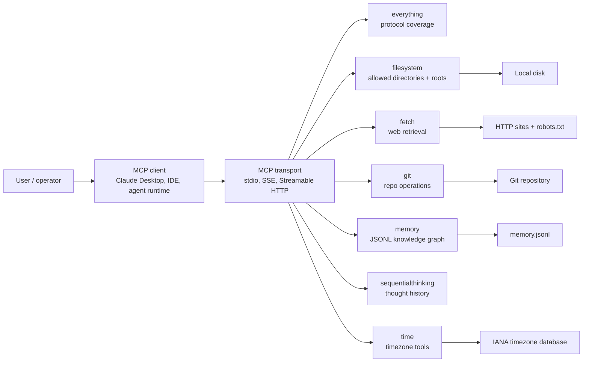
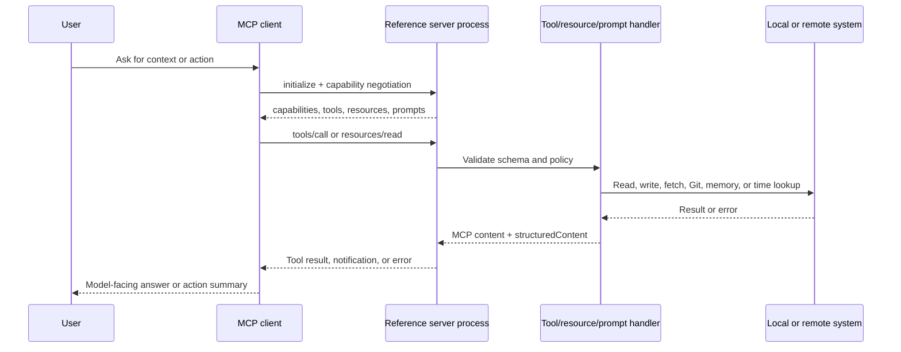
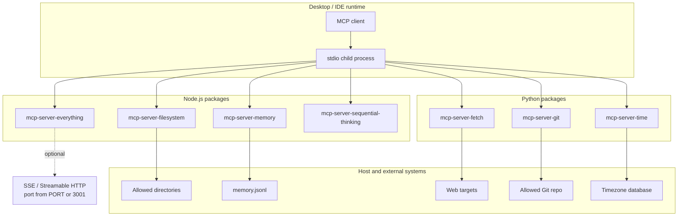
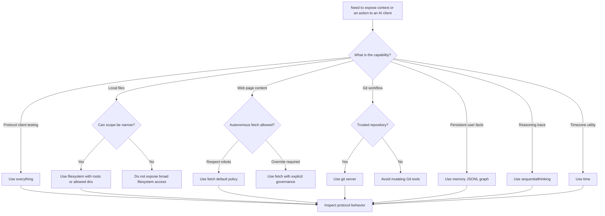
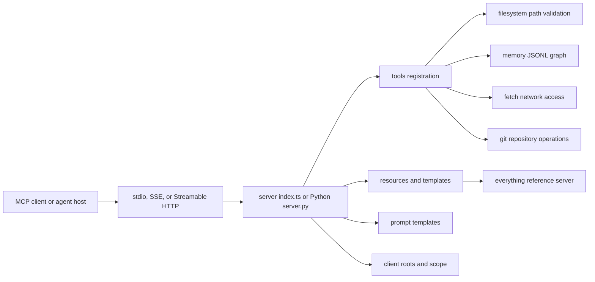
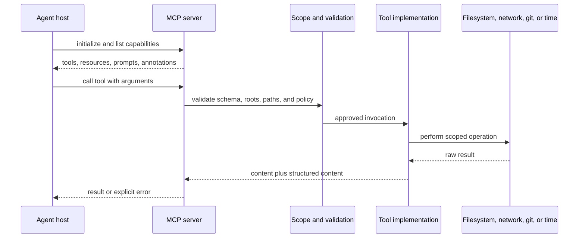
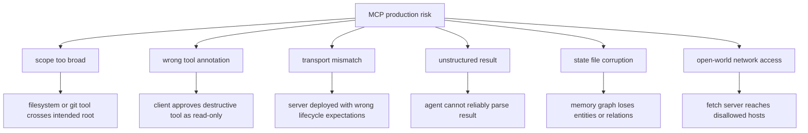

# Model Context Protocol Servers - Architecture Notes

## Executive summary

`github-repos/06-tooling-mcp-ai-platform/servers` is the Model Context Protocol reference server collection. It is organized as a monorepo with TypeScript and Python packages that demonstrate common MCP server roles: conformance testing, filesystem access, web fetching, Git operations, persistent memory, sequential reasoning, and timezone utilities.

The repository should be treated as a reference and learning asset, not as a hardened production platform. The top-level `README.md` explicitly positions these servers as educational/reference implementations, and each package keeps the implementation small enough for MCP client authors and tool builders to study. The strongest architectural value is that the repo shows several MCP interaction shapes side by side: stdio-only tools, HTTP transports, roots-aware authorization, task notifications, structured tool outputs, prompts, resources, and capability negotiation.

## Problem solved

MCP clients need realistic servers to verify that protocol primitives work end to end. This repo solves that by providing:

- A broad conformance-style server in `src/everything`.
- Narrow task-focused servers for local files, Git repositories, web retrieval, memory, reasoning traces, and time conversion.
- Concrete examples for both Node.js/TypeScript and Python MCP SDK usage.
- Package metadata and command names suitable for `npx`, `uvx`, Docker, and desktop client configuration.

The result is a catalog of small servers that explain the protocol by running it.

## AI stack role

In an AI system, these servers sit between an MCP client or agent runtime and external context systems. They do not host a model. Instead, they expose controlled capabilities that a model-facing client can call:

- Local context: `filesystem`, `git`, and `memory`.
- Remote or semi-remote context: `fetch`.
- Reasoning scaffolding: `sequentialthinking`.
- Utility context: `time`.
- Protocol feature validation: `everything`.

## Source tree map

| Path | Role |
| --- | --- |
| `README.md` | Repository overview, maintained reference servers, client configuration examples, and reference-only warning. |
| `package.json` | Private Node workspace for TypeScript server packages under `src/*`. |
| `.mcp.json` | Local MCP documentation server configuration pointing at the public MCP docs endpoint. |
| `ADDITIONAL.md` | Curated ecosystem list: frameworks, third-party servers, clients, and community resources. |
| `src/everything` | TypeScript test/reference server that exercises tools, prompts, resources, subscriptions, tasks, sampling, elicitation, and multiple transports. |
| `src/filesystem` | TypeScript server for controlled local filesystem access with path validation, roots support, structured outputs, and edit helpers. |
| `src/memory` | TypeScript JSONL-backed knowledge graph server. |
| `src/sequentialthinking` | TypeScript reasoning trace server with branch/revision metadata and optional thought logging suppression. |
| `src/fetch` | Python web fetch server using HTTPX, readability extraction, markdown conversion, and robots.txt checks. |
| `src/git` | Python Git server built on GitPython, with repository scoping and read/write/destructive annotations. |
| `src/time` | Python timezone server using IANA names, `zoneinfo`, and local timezone discovery. |

## Core concepts

### MCP primitives

The repo demonstrates the main MCP primitives:

- Tools: callable actions such as `read_text_file`, `git_status`, `fetch`, `create_entities`, `sequentialthinking`, and `convert_time`.
- Resources: content addressable by URI, mostly demonstrated in `src/everything/resources`.
- Prompts: reusable prompt templates, shown in `src/everything/prompts` and `src/fetch/server.py`.
- Roots: client-provided filesystem or repository scopes, used by `filesystem` and `git`.
- Notifications and subscriptions: `everything` simulates resource and logging updates.
- Structured content: many TypeScript tools return both text content and typed `structuredContent`.
- Tool annotations: read-only, destructive, idempotent, and open-world hints are used to help clients reason about risk.

### Reference server pattern

The servers intentionally keep narrow responsibilities. Each package starts a server, registers tools/resources/prompts, and connects to a transport. Most packages use stdio because it is the easiest transport for desktop MCP clients. `everything` adds HTTP transports so client authors can test Streamable HTTP, SSE compatibility, event replay, session IDs, and cleanup behavior.

### Client-governed scope

The repo repeatedly shows that an MCP server should not assume full local authority. `filesystem` accepts explicit allowed directories or client roots. `git` validates that requested repositories sit inside the configured repository or client roots. `fetch` consults robots.txt for autonomous tool calls unless explicitly disabled. These are reference-level controls, but they illustrate the right shape of governance.

## Internal architecture

### Monorepo shape

The root Node workspace covers the TypeScript servers. Python packages under `src/fetch`, `src/git`, and `src/time` are independent Python projects with their own `pyproject.toml`. There is no shared application runtime across all servers; each package is separately invokable.

### Server-by-server architecture

**`src/everything`**

- `index.ts` dispatches between `stdio`, `sse`, and `streamableHttp`.
- `server/index.ts` creates the `McpServer`, declares capabilities, registers tools/resources/prompts, manages subscriptions, and handles cleanup.
- `tools`, `resources`, `prompts`, and `tasks` are split into modules so protocol features can be studied independently.
- `transports/streamableHttp.ts` implements `/mcp` POST/GET/DELETE handling, session IDs, CORS headers, and event replay through an in-memory event store.

**`src/filesystem`**

- `index.ts` parses allowed directories, reacts to roots change notifications, and registers filesystem tools.
- `lib.ts` contains most filesystem behavior: path validation, symlink checks, directory tree generation, atomic write/edit logic, search, and file metadata.
- `path-validation.ts` and `roots-utils.ts` isolate path normalization and root parsing.

**`src/memory`**

- `index.ts` contains the `KnowledgeGraphManager` and tool registrations.
- Persistence is JSONL, selected by `MEMORY_FILE_PATH` or defaulting to the package output directory.
- Entities, relations, and observations are simple records, which keeps the graph easy to inspect and migrate.

**`src/sequentialthinking`**

- `index.ts` registers the `sequentialthinking` tool and validates/coerces inputs.
- `lib.ts` maintains in-memory thought history and branches, formats logs with `chalk`, and supports disabling thought logging through `DISABLE_THOUGHT_LOGGING`.

**`src/fetch`**

- `server.py` extracts readable content, converts HTML to markdown, checks robots.txt through Protego, and exposes both a tool and a prompt.
- Tool calls use an autonomous user agent and respect robots.txt unless `--ignore-robots-txt` is supplied.
- Prompt usage is treated as manual/user-directed fetching.

**`src/git`**

- `server.py` defines Git tool schemas, uses GitPython for repository operations, and validates repository scope.
- Mutating operations such as add, reset, commit, branch creation, and checkout are clearly distinguishable through annotations.
- Inputs that might become command flags are rejected as defense in depth.

**`src/time`**

- `server.py` wraps timezone lookup, current time, and same-day time conversion.
- It uses IANA timezone names and reports DST state, UTC offset, ISO datetime, and day-of-week data.

## End-to-end flow

The following sequence shows the common stdio path. HTTP transport adds session management and request routing, but the server-side registration and handler model stays the same.

## Runtime and data flow

### Tool call flow

1. The client launches the server process or connects to the HTTP endpoint.
2. The server advertises capabilities and registered handlers.
3. The client lists tools/resources/prompts or calls a known item.
4. The server validates input through SDK schemas, Zod, or Pydantic.
5. The package-specific handler performs a scoped operation.
6. The server returns MCP content blocks, structured data, or protocol errors.

### State and persistence

| Server | State model |
| --- | --- |
| `everything` | In-memory tasks, subscriptions, simulated updates, and event replay cache. |
| `filesystem` | No durable state, but allowed directories are runtime state and may change through roots notifications. |
| `memory` | Durable JSONL graph file. |
| `sequentialthinking` | In-memory thought history and branch map for the server process lifetime. |
| `fetch` | Mostly stateless; HTTP responses and robots checks are per request. |
| `git` | Durable state lives in the target Git repository. |
| `time` | Stateless, derived from system timezone data. |

### Error handling patterns

- TypeScript servers generally throw or return SDK-compatible errors after validation fails.
- Python servers use Pydantic validation and `McpError` where protocol-level error codes are appropriate.
- `filesystem` is the most defensive local server because it validates requested paths, symlinks, parent directories, and allowed scopes before file operations.
- `fetch` surfaces HTTP, extraction, and robots.txt failures while also supporting continuation through `start_index`.

## Deployment and operations topology

## Extension points

### Adding or changing TypeScript servers

Follow the existing package pattern under `src/<server>`:

- `package.json` with a bin entry and build/test scripts.
- `src/index.ts` that creates an MCP server and connects a transport.
- Tool schemas with Zod and clear annotations.
- Focused tests in `*.test.ts`.

`everything` is the best guide for advanced protocol features. `filesystem` is the best guide for local system access and defensive path validation.

### Adding or changing Python servers

Use the pattern in `fetch`, `git`, or `time`:

- Define a `pyproject.toml` package with a console script.
- Use Pydantic models for input validation.
- Register tools through the Python MCP server.
- Keep side effects explicit and annotate mutating operations.

### Tool design guidance from the repo

- Make the least-privilege scope visible in both configuration and runtime validation.
- Return structured output when a client may need machine-readable data.
- Use text content blocks for human-readable summaries.
- Prefer small, composable tools over broad, ambiguous actions.
- Declare destructive and read-only behavior so clients can present useful trust decisions.

## Integrations

The top-level README and package metadata show the expected integrations:

- MCP clients: Claude Desktop, IDE integrations, Codex-style agents, and the MCP Inspector.
- Package runners: `npx` for Node packages and `uvx` for Python packages.
- Containers: Docker examples in the repository README for selected servers.
- Local systems: filesystem, Git repositories, timezone database, and JSONL memory storage.
- Remote systems: HTTP websites for `fetch`.
- MCP ecosystem: `ADDITIONAL.md` catalogs additional frameworks, clients, registries, and community servers.

## Configuration, deployment, and operations

| Area | Practical notes |
| --- | --- |
| Transport | Most servers use stdio. `everything` additionally supports deprecated SSE and Streamable HTTP. |
| `everything` port | HTTP transports read `PORT`, defaulting to `3001` in the inspected transport code. |
| Filesystem scope | Pass allowed directories on the command line or provide MCP roots. Empty scope fails initialization. |
| Memory path | `MEMORY_FILE_PATH` overrides the default `memory.jsonl` location. |
| Sequential logging | `DISABLE_THOUGHT_LOGGING=true` suppresses formatted thought logs. |
| Fetch policy | CLI flags configure user agents, proxy, and whether autonomous fetches ignore robots.txt. |
| Git scope | Start with an explicit repository or rely on client roots; requested repo paths are validated. |
| Timezone | `time` supports a local timezone override and expects IANA timezone names. |

Operationally, each server should be managed as a separate capability boundary. For example, do not give a general chat client both wide filesystem access and mutating Git access unless the user workflow really requires it.

## Observability, testing, evaluation, and failure modes

### Observability

The repo is intentionally lightweight. Observability is mostly process logs, protocol responses, and client-side inspection. Useful places to inspect are:

- `everything` logging and resource update simulations.
- `filesystem` stderr messages around allowed directories and roots changes.
- `fetch` HTTP and robots failures.
- `git` repository validation and GitPython exceptions.
- `sequentialthinking` formatted thought logging, when enabled.

For production use, wrap these servers with process supervision, log collection, and explicit audit trails for mutating tools.

### Testing and evaluation

The repository includes focused tests rather than large integration suites:

- TypeScript packages use Vitest in packages such as `everything`, `filesystem`, `memory`, and `sequentialthinking`.
- Python packages use pytest-style tests in `fetch`, `git`, and `time`.
- `everything` acts as a practical evaluation target for MCP client conformance because it combines tools, prompts, resources, subscriptions, HTTP transports, and task-like behavior.

No dependency installation or test execution is required to understand the architecture.

### Common failure modes

- Client lacks roots and no explicit filesystem directories were supplied.
- Filesystem paths resolve through symlinks outside the allowed directory set.
- Fetch target blocks access through robots.txt, network timeout, invalid HTML, or content length truncation.
- Git tool is pointed at a path outside the allowed repository boundary.
- Memory graph file is missing, unwritable, or migrated from an older JSON format.
- Sequential thinking state is lost when the server process exits.
- HTTP `everything` sessions are lost when the process restarts because session/event state is in memory.

## Security and governance risks

This repo is a reference implementation set, so production hardening is the responsibility of the adopter.

Key risks:

- `filesystem` can read, write, edit, move, and search local files inside its allowed scope. Scope selection is the main governance decision.
- `git` exposes mutating repository operations, including add, reset, commit, branch creation, and checkout.
- `fetch` can access URLs. The README warns about the risk of local/internal IP access; robots.txt checks do not solve SSRF by themselves.
- `memory` persists user-provided entity and observation data in a local JSONL file that may contain sensitive information.
- `sequentialthinking` logs reasoning traces unless disabled. Treat logs as sensitive.
- `everything` includes deliberately broad test capabilities such as environment inspection, sampling, elicitation, and permissive CORS in HTTP test transports.
- Docker bind mounts and client configuration files can accidentally widen server authority.

Governance recommendations:

- Configure one server per purpose instead of exposing every server to every user.
- Prefer explicit roots and narrow directories.
- Run mutating servers in trusted workspaces only.
- Treat logs, memory files, and Git diffs as sensitive artifacts.
- Put network egress controls around `fetch` if it is used outside a trusted local environment.

## Lifecycle and decision diagram

## Reading guide

Start with:

1. `README.md` for the maintained server list, intent, and client setup examples.
2. `src/everything/README.md` and `src/everything/docs/*` for protocol features.
3. `src/filesystem/src/lib.ts` and `src/filesystem/src/path-validation.ts` for defensive local access.
4. `src/fetch/src/mcp_server_fetch/server.py` for HTTP retrieval and robots policy.
5. `src/git/src/mcp_server_git/server.py` for repository scoping and Git tool annotations.
6. `src/memory/index.ts`, `src/sequentialthinking/src/lib.ts`, and `src/time/src/mcp_server_time/server.py` for compact examples.

## Learning path

1. Run or inspect `time` first; it is the smallest stateless example.
2. Read `memory` to understand durable tool state.
3. Read `filesystem` to learn validation and roots negotiation.
4. Read `fetch` to understand network governance and truncation.
5. Read `git` to compare read-only and destructive tool annotations.
6. Read `everything` last; it combines most protocol surfaces and is easiest after the smaller servers are clear.

## Glossary

| Term | Meaning in this repository |
| --- | --- |
| MCP | Model Context Protocol, the client/server protocol these packages implement. |
| Client | The host application or agent runtime that launches or connects to a server. |
| Tool | A callable operation exposed to the client. |
| Resource | Addressable content exposed by URI. |
| Prompt | A reusable prompt template returned by the server. |
| Root | A client-declared scope, usually a filesystem or repository boundary. |
| Transport | The communication channel, such as stdio, SSE, or Streamable HTTP. |
| Structured content | Machine-readable result data returned with human-readable content. |
| Annotation | Metadata that describes whether a tool is read-only, destructive, idempotent, or open-world. |
| JSONL | Newline-delimited JSON format used by the memory server. |

## Repository-Grounded Deep Dive

This repository is a set of reference implementations for MCP capability design. The TypeScript servers under `github-repos/06-tooling-mcp-ai-platform/servers/src/everything/`, `src/filesystem/`, `src/memory/`, and `src/sequentialthinking/` show different levels of capability surface, while Python servers under `src/fetch/`, `src/git/`, and `src/time/` show how smaller tools expose external systems. The most important architectural lesson is that MCP servers should be judged by scope control, tool annotations, transport assumptions, and result structure, not just by how many tools they expose.

The `everything` server is best read as a protocol exerciser: `src/everything/tools/`, `resources/`, `prompts/`, `transports/`, and `server/` demonstrate breadth. The smaller servers are better production examples. `src/filesystem/path-validation.ts`, `src/filesystem/roots-utils.ts`, and `src/filesystem/lib.ts` show root-scoped filesystem access. `src/memory/index.ts` shows a persisted knowledge graph backed by JSONL. `src/sequentialthinking/lib.ts` shows stateful reasoning data. The Python `fetch`, `git`, and `time` servers show how to bind external APIs or command-like operations to MCP without requiring a full monorepo service.

### Production Readiness Checklist

- For every server, document transport, lifecycle, and trust boundary: local stdio helper, remote HTTP service, or sidecar tool server.
- Review tool annotations and destructive behavior. The client may rely on read-only, destructive, idempotent, and open-world hints for approval and UX decisions.
- For filesystem and git servers, test path traversal, symlinks, Windows path normalization, root changes, and denied paths using the existing tests under `src/filesystem/__tests__/` and `src/git/tests/`.
- For `fetch`, define host allow/deny policy, content truncation policy, timeout policy, and how fetched content is attributed.
- For `memory`, protect the JSONL state location, validate concurrent writes, and define backup or export behavior.
- Prefer structured content for machine-readable outputs. Human-readable text alone makes downstream agent behavior brittle.
- Keep example servers separated from production servers. The `everything` server is valuable for protocol coverage but too broad to use as a default production capability set.

### Senior Architect Reading Path

Read `src/filesystem/` first because it demonstrates the most important production pattern: client roots plus local validation. Then read `src/memory/` for persistent state, `src/sequentialthinking/` for stateful tool data, and the Python `src/fetch/`, `src/git/`, and `src/time/` packages for external operation design. Finish with `src/everything/` to understand the full protocol surface after the narrower safety patterns are clear.
