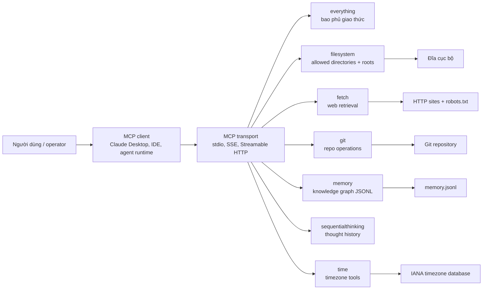
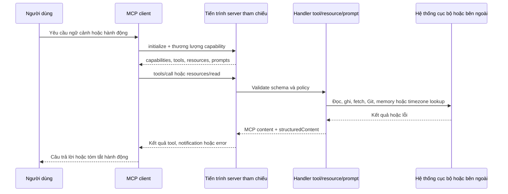
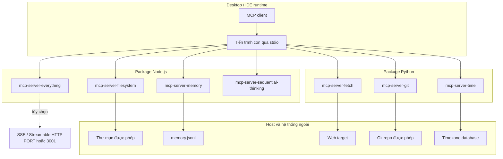
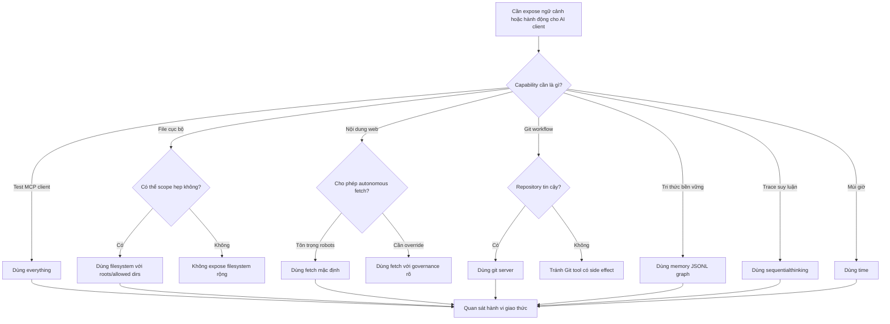
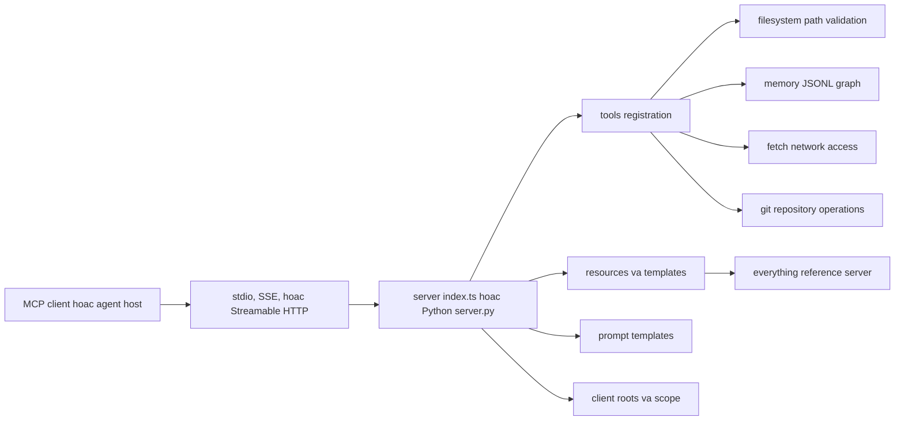
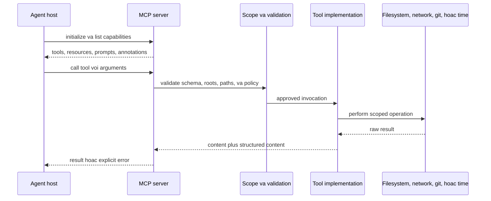
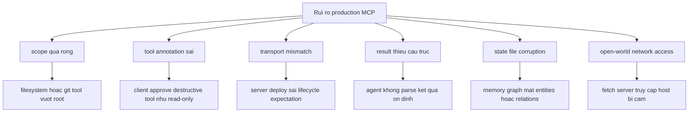

# Model Context Protocol Servers - Ghi chú kiến trúc

## Tóm tắt điều hành

`github-repos/06-tooling-mcp-ai-platform/servers` là tập hợp các server tham chiếu cho Model Context Protocol. Repo được tổ chức như một monorepo gồm các package TypeScript và Python, mỗi package minh họa một vai trò MCP riêng: kiểm thử tính tương thích, truy cập filesystem, lấy nội dung web, thao tác Git, bộ nhớ dạng knowledge graph, suy luận theo bước và tiện ích múi giờ.

Repo này nên được xem là tài sản học tập và tham chiếu, không phải nền tảng đã harden cho production. `README.md` cấp cao nêu rõ các server này mang tính giáo dục/reference. Giá trị kiến trúc chính là repo cho thấy nhiều kiểu tương tác MCP cạnh nhau: stdio, SSE, Streamable HTTP, roots, tools, resources, prompts, notifications, structured output, task-like behavior, sampling và elicitation.

## Vấn đề được giải quyết

MCP client cần server thực tế để kiểm tra primitive của giao thức từ đầu đến cuối. Repo này giải quyết nhu cầu đó bằng cách cung cấp:

- `src/everything`: server tham chiếu rộng để kiểm thử feature và client conformance.
- `src/filesystem`: server truy cập file/thư mục có scope bằng allowed directories hoặc MCP roots.
- `src/fetch`: server lấy nội dung URL, chuyển HTML thành markdown và tôn trọng robots.txt cho autonomous fetch.
- `src/git`: server thao tác Git repository bằng GitPython và validation scope.
- `src/memory`: server knowledge graph bền vững bằng JSONL.
- `src/sequentialthinking`: server lưu trace suy luận có revision và branch.
- `src/time`: server lấy thời gian hiện tại và chuyển đổi múi giờ.

Nói ngắn gọn, repo biến đặc tả MCP thành các ví dụ nhỏ, có thể chạy, đọc và mở rộng.

## Vai trò trong AI stack

Các server này không host model. Chúng nằm giữa MCP client hoặc agent runtime và các hệ thống cung cấp ngữ cảnh/hành động. Client có thể cho model gọi các capability này để đọc file, lấy web content, truy vấn memory, thao tác Git hoặc tra cứu thời gian.

## Bản đồ cây nguồn

| Đường dẫn | Vai trò |
| --- | --- |
| `README.md` | Tổng quan repo, danh sách server tham chiếu được duy trì, ví dụ cấu hình client và cảnh báo reference-only. |
| `package.json` | Node workspace private cho các package TypeScript trong `src/*`. |
| `.mcp.json` | Cấu hình MCP docs server cục bộ trỏ tới endpoint tài liệu MCP công khai. |
| `ADDITIONAL.md` | Danh sách hệ sinh thái: framework, server bên thứ ba, client và tài nguyên cộng đồng. |
| `src/everything` | Server TypeScript để kiểm thử/học MCP: tools, prompts, resources, subscriptions, tasks, sampling, elicitation và nhiều transport. |
| `src/filesystem` | Server TypeScript cho truy cập filesystem có kiểm soát, path validation, roots, structured output và edit helper. |
| `src/memory` | Server TypeScript lưu knowledge graph bằng JSONL. |
| `src/sequentialthinking` | Server TypeScript ghi nhận suy luận theo bước, branch/revision và tùy chọn tắt log. |
| `src/fetch` | Server Python lấy nội dung web bằng HTTPX, readability extraction, markdown conversion và robots.txt. |
| `src/git` | Server Python dùng GitPython, có giới hạn repository và annotation cho thao tác đọc/ghi/nguy hiểm. |
| `src/time` | Server Python cho thời gian/múi giờ bằng IANA timezone và `zoneinfo`. |

## Khái niệm cốt lõi

### Primitive của MCP

Repo này minh họa các primitive chính của MCP:

- Tool: thao tác có thể gọi như `read_text_file`, `git_status`, `fetch`, `create_entities`, `sequentialthinking`, `convert_time`.
- Resource: nội dung có địa chỉ URI, thể hiện rõ nhất trong `src/everything/resources`.
- Prompt: mẫu prompt có thể tái sử dụng, có trong `src/everything/prompts` và `src/fetch/server.py`.
- Root: scope do client khai báo, thường là thư mục hoặc repository.
- Notification và subscription: `everything` mô phỏng logging/resource updates.
- Structured content: nhiều tool TypeScript trả về dữ liệu có cấu trúc bên cạnh text cho người đọc.
- Annotation: metadata cho biết tool read-only, destructive, idempotent hoặc open-world để client trình bày quyết định tin cậy tốt hơn.

### Mẫu server tham chiếu

Mỗi server giữ trách nhiệm hẹp. Package tạo MCP server, đăng ký tool/resource/prompt, rồi kết nối transport. Phần lớn server dùng stdio vì đây là transport phổ biến cho desktop MCP client. Riêng `everything` bổ sung SSE và Streamable HTTP để client author kiểm thử session, event replay, CORS, cleanup và endpoint HTTP.

### Scope do client và cấu hình kiểm soát

Một bài học lặp lại trong repo là MCP server không nên mặc định có toàn quyền trên host. `filesystem` cần allowed directories hoặc roots. `git` xác thực repository nằm trong scope cho phép. `fetch` tôn trọng robots.txt cho tool call tự động, trừ khi operator chủ động bỏ qua. Đây chưa phải hardening production, nhưng thể hiện đúng hướng least privilege.

## Kiến trúc nội bộ

### Dạng monorepo

Node workspace ở root bao phủ các server TypeScript. Các server Python như `fetch`, `git` và `time` là project độc lập có `pyproject.toml` riêng. Không có runtime dùng chung cho toàn bộ repo; mỗi server là một tiến trình/capability độc lập.

### Kiến trúc theo server

**`src/everything`**

- `index.ts` chọn transport `stdio`, `sse` hoặc `streamableHttp`.
- `server/index.ts` tạo `McpServer`, khai báo capability, đăng ký tools/resources/prompts, quản lý subscriptions và cleanup.
- `tools`, `resources`, `prompts` và `tasks` được tách module để dễ đọc từng phần của giao thức.
- `transports/streamableHttp.ts` xử lý `/mcp` POST/GET/DELETE, session ID, CORS header và event replay bằng in-memory event store.

**`src/filesystem`**

- `index.ts` parse allowed directories, phản ứng với roots change notification và đăng ký filesystem tools.
- `lib.ts` chứa logic chính: validate path, kiểm tra symlink, tạo directory tree, write/edit atomically, search và metadata.
- `path-validation.ts` và `roots-utils.ts` tách riêng normalize path và parse roots.

**`src/memory`**

- `index.ts` chứa `KnowledgeGraphManager` và đăng ký tools.
- Persistence là file JSONL, chọn bằng `MEMORY_FILE_PATH` hoặc mặc định trong output của package.
- Entity, relation và observation là record đơn giản, dễ đọc và dễ migrate.

**`src/sequentialthinking`**

- `index.ts` đăng ký tool `sequentialthinking` và validate/coerce input.
- `lib.ts` giữ thought history và branches trong bộ nhớ, format log bằng `chalk`, và cho phép tắt log bằng `DISABLE_THOUGHT_LOGGING`.

**`src/fetch`**

- `server.py` rút trích nội dung dễ đọc từ HTML, chuyển sang markdown, kiểm tra robots.txt bằng Protego, và expose cả tool lẫn prompt.
- Tool call dùng autonomous user agent và tôn trọng robots.txt trừ khi có `--ignore-robots-txt`.
- Prompt được xem như fetch thủ công theo yêu cầu người dùng và có cách xử lý lỗi riêng.

**`src/git`**

- `server.py` khai báo schema cho Git tools, dùng GitPython và validate repository scope.
- Các thao tác mutating như add, reset, commit, create branch và checkout được annotation rõ.
- Input có thể bị diễn giải thành command flag được reject như lớp phòng vệ bổ sung.

**`src/time`**

- `server.py` bao bọc timezone lookup, current time và chuyển đổi giờ trong cùng ngày.
- Server dùng IANA timezone name và trả về DST state, UTC offset, ISO datetime và day of week.

## Luồng end-to-end

Sơ đồ dưới mô tả đường stdio phổ biến. Với HTTP, server có thêm session management và routing endpoint, nhưng mô hình handler vẫn tương tự.

## Runtime và data flow

### Luồng gọi tool

1. Client khởi chạy tiến trình server hoặc kết nối HTTP endpoint.
2. Server công bố capabilities và handler đã đăng ký.
3. Client liệt kê tool/resource/prompt hoặc gọi trực tiếp item đã biết.
4. Server validate input bằng SDK schema, Zod hoặc Pydantic.
5. Handler của package thực hiện thao tác trong scope cho phép.
6. Server trả về content block, structured data hoặc protocol error.

### Trạng thái và persistence

| Server | Mô hình trạng thái |
| --- | --- |
| `everything` | In-memory tasks, subscriptions, simulated updates và event replay cache. |
| `filesystem` | Không có durable state; allowed directories là runtime state và có thể đổi theo roots notification. |
| `memory` | File graph JSONL bền vững. |
| `sequentialthinking` | Thought history và branch map trong bộ nhớ của tiến trình. |
| `fetch` | Gần như stateless; HTTP response và robots check theo từng request. |
| `git` | State bền vững nằm trong Git repository mục tiêu. |
| `time` | Stateless, suy ra từ timezone data của hệ thống. |

### Xử lý lỗi

- Server TypeScript thường validate bằng Zod/SDK và trả lỗi tương thích MCP.
- Server Python dùng Pydantic và `McpError` khi cần protocol-level error code.
- `filesystem` phòng vệ nhiều nhất vì validate path, symlink, parent directory và allowed scope trước khi thao tác file.
- `fetch` bộc lộ lỗi HTTP, robots.txt, extraction và truncate nội dung qua `start_index`.

## Topology triển khai và vận hành

## Điểm mở rộng

### Thêm hoặc sửa server TypeScript

Pattern hiện có là tạo `src/<server>` với:

- `package.json` có bin entry và script build/test.
- `src/index.ts` tạo MCP server và gắn transport.
- Tool schema bằng Zod và annotation rõ ràng.
- Test tập trung trong `*.test.ts`.

`everything` là tài liệu sống cho tính năng giao thức nâng cao. `filesystem` là ví dụ tốt nhất về truy cập hệ thống cục bộ có phòng vệ.

### Thêm hoặc sửa server Python

Pattern trong `fetch`, `git` và `time` gồm:

- `pyproject.toml` với console script.
- Pydantic model cho input validation.
- Đăng ký tool qua Python MCP server.
- Làm rõ side effect và annotation cho thao tác ghi/nguy hiểm.

### Bài học thiết kế tool

- Scope least privilege phải xuất hiện cả trong cấu hình lẫn runtime validation.
- Trả structured output khi client cần dữ liệu machine-readable.
- Trả text content để người dùng dễ đọc.
- Ưu tiên tool nhỏ, rõ mục đích, ít mơ hồ.
- Khai báo read-only/destructive/idempotent để client có quyết định trust tốt hơn.

## Tích hợp

Các tích hợp chính:

- MCP client: Claude Desktop, IDE integration, agent runtime và MCP Inspector.
- Package runner: `npx` cho Node package, `uvx` cho Python package.
- Container: ví dụ Docker trong `README.md` cấp cao.
- Hệ thống cục bộ: filesystem, Git repository, timezone database và file JSONL.
- Hệ thống từ xa: HTTP website cho `fetch`.
- Hệ sinh thái MCP: `ADDITIONAL.md` liệt kê framework, client, registry và community server.

## Cấu hình, triển khai và vận hành

| Hạng mục | Ghi chú thực tế |
| --- | --- |
| Transport | Đa số server dùng stdio. `everything` có thêm SSE cũ và Streamable HTTP. |
| Cổng của `everything` | HTTP transport đọc `PORT`, mặc định `3001`. |
| Scope filesystem | Truyền allowed directories qua command line hoặc dùng MCP roots. Không có scope thì initialization lỗi. |
| Đường dẫn memory | `MEMORY_FILE_PATH` ghi đè vị trí `memory.jsonl`. |
| Log suy luận | `DISABLE_THOUGHT_LOGGING=true` tắt formatted thought logs. |
| Chính sách fetch | CLI flags cấu hình user agent, proxy và việc bỏ qua robots.txt cho autonomous fetch. |
| Scope Git | Khởi động với repository rõ ràng hoặc dùng client roots; repo path được validate. |
| Timezone | `time` cho phép override local timezone và yêu cầu IANA timezone name. |

Về vận hành, hãy coi mỗi server là một ranh giới capability riêng. Không nên cấp đồng thời filesystem rộng và mutating Git tools cho cùng một client nếu workflow không thật sự cần.

## Observability, testing, evaluation và failure modes

### Observability

Repo giữ thiết kế nhẹ. Observability chủ yếu đến từ log tiến trình, protocol response và client-side inspection:

- `everything` có logging/resource update simulation.
- `filesystem` ghi stderr về allowed directories và roots change.
- `fetch` bộc lộ lỗi HTTP và robots.
- `git` bộc lộ lỗi validate repository và GitPython.
- `sequentialthinking` có formatted thought logging nếu không tắt.

Nếu đưa vào production, nên bọc các server bằng process supervision, log collection và audit trail cho tool có side effect.

### Testing và evaluation

Repo có test tập trung:

- Package TypeScript dùng Vitest, bao gồm `everything`, `filesystem`, `memory`, `sequentialthinking`.
- Package Python dùng pytest-style tests trong `fetch`, `git`, `time`.
- `everything` có giá trị như target evaluation cho MCP client vì kết hợp tools, prompts, resources, subscriptions, HTTP transports và task-like behavior.

Lượt tài liệu này không yêu cầu cài dependency hoặc chạy test.

### Failure modes phổ biến

- Client không cung cấp roots và server filesystem không nhận allowed directories.
- Path filesystem resolve qua symlink ra ngoài allowed scope.
- Target web bị chặn bởi robots.txt, timeout, HTML lỗi hoặc nội dung bị truncate.
- Git tool được trỏ tới đường dẫn ngoài repository được phép.
- File graph memory bị mất, không ghi được hoặc cần migrate từ định dạng JSON cũ.
- State của `sequentialthinking` mất khi tiến trình server dừng.
- Session HTTP của `everything` mất khi process restart vì session/event state nằm trong memory.

## Rủi ro bảo mật và governance

Đây là repo tham chiếu, vì vậy production hardening thuộc về người áp dụng.

Rủi ro chính:

- `filesystem` có thể đọc, ghi, sửa, di chuyển và tìm file trong scope được phép. Chọn scope là quyết định governance quan trọng nhất.
- `git` expose thao tác mutating như add, reset, commit, create branch và checkout.
- `fetch` có thể truy cập URL; README cảnh báo rủi ro truy cập IP nội bộ/cục bộ. Robots.txt không phải biện pháp chống SSRF đầy đủ.
- `memory` lưu entity/observation vào JSONL cục bộ, có thể chứa thông tin nhạy cảm.
- `sequentialthinking` ghi log reasoning trace nếu không tắt; log này nên được xem là nhạy cảm.
- `everything` có capability test rộng như đọc env, sampling, elicitation và CORS thoáng trong HTTP transport test.
- Docker bind mount và file cấu hình client có thể vô tình mở rộng quyền server.

Khuyến nghị governance:

- Cấu hình server theo từng mục đích thay vì cấp mọi server cho mọi user.
- Ưu tiên roots và allowed directories hẹp.
- Chỉ dùng mutating server trong workspace tin cậy.
- Xem logs, memory files và Git diffs là artifact nhạy cảm.
- Đặt network egress control cho `fetch` nếu dùng ngoài môi trường cục bộ tin cậy.

## Vòng đời và sơ đồ quyết định

## Hướng dẫn đọc repo

Nên đọc theo thứ tự:

1. `README.md` để nắm mục tiêu, danh sách server và ví dụ cấu hình client.
2. `src/everything/README.md` và `src/everything/docs/*` để thấy đầy đủ primitive MCP.
3. `src/filesystem/src/lib.ts` và `src/filesystem/src/path-validation.ts` để học local access có phòng vệ.
4. `src/fetch/src/mcp_server_fetch/server.py` để hiểu web retrieval và robots policy.
5. `src/git/src/mcp_server_git/server.py` để hiểu repository scoping và annotation.
6. `src/memory/index.ts`, `src/sequentialthinking/src/lib.ts`, `src/time/src/mcp_server_time/server.py` để xem các ví dụ nhỏ gọn.

## Lộ trình học tập

1. Bắt đầu với `time` vì nó nhỏ và stateless.
2. Đọc `memory` để hiểu durable state cho tool.
3. Đọc `filesystem` để học validation và roots negotiation.
4. Đọc `fetch` để hiểu network governance và truncate nội dung.
5. Đọc `git` để so sánh tool read-only và destructive.
6. Đọc `everything` sau cùng vì nó tổng hợp hầu hết bề mặt giao thức.

## Bảng thuật ngữ

| Thuật ngữ | Nghĩa trong repo này |
| --- | --- |
| MCP | Model Context Protocol, giao thức client/server mà các package implement. |
| Client | Ứng dụng host hoặc agent runtime khởi chạy/kết nối server. |
| Tool | Thao tác có thể gọi từ client. |
| Resource | Nội dung có URI để truy cập. |
| Prompt | Mẫu prompt server trả về để tái sử dụng. |
| Root | Scope do client khai báo, thường là thư mục hoặc repository. |
| Transport | Kênh giao tiếp như stdio, SSE hoặc Streamable HTTP. |
| Structured content | Dữ liệu machine-readable trả về cùng với nội dung cho người đọc. |
| Annotation | Metadata mô tả tool read-only, destructive, idempotent hay open-world. |
| JSONL | Định dạng JSON mỗi dòng một record, được `memory` sử dụng. |

## Deep Dive Bám Theo Repository

Repository này là tập hợp implementation tham chiếu cho thiết kế capability MCP. Các server TypeScript dưới `github-repos/06-tooling-mcp-ai-platform/servers/src/everything/`, `src/filesystem/`, `src/memory/` và `src/sequentialthinking/` thể hiện các mức độ capability khác nhau, trong khi server Python dưới `src/fetch/`, `src/git/` và `src/time/` cho thấy cách expose hệ thống bên ngoài qua tool nhỏ hơn. Bài học kiến trúc quan trọng nhất là MCP server phải được đánh giá bằng scope control, tool annotations, transport assumptions và result structure, không chỉ bằng số lượng tool.

Server `everything` nên được đọc như bộ exerciser cho protocol: `src/everything/tools/`, `resources/`, `prompts/`, `transports/` và `server/` minh họa bề rộng. Các server nhỏ mới là ví dụ production tốt hơn. `src/filesystem/path-validation.ts`, `src/filesystem/roots-utils.ts` và `src/filesystem/lib.ts` cho thấy filesystem access bị giới hạn bởi root. `src/memory/index.ts` cho thấy knowledge graph persist bằng JSONL. `src/sequentialthinking/lib.ts` cho thấy dữ liệu suy luận có trạng thái. Các server Python `fetch`, `git` và `time` cho thấy cách bind external API hoặc operation kiểu command vào MCP mà không cần service monorepo lớn.

### Checklist Sẵn Sàng Production

- Với mỗi server, document transport, lifecycle và trust boundary: local stdio helper, remote HTTP service hoặc sidecar tool server.
- Review tool annotations và destructive behavior. Client có thể dựa vào read-only, destructive, idempotent và open-world hints cho approval và UX.
- Với filesystem và git servers, test path traversal, symlink, Windows path normalization, root changes và denied paths bằng các test dưới `src/filesystem/__tests__/` và `src/git/tests/`.
- Với `fetch`, định nghĩa host allow/deny policy, content truncation policy, timeout policy và cách attribution nội dung fetch.
- Với `memory`, bảo vệ vị trí JSONL state, validate concurrent writes và định nghĩa backup hoặc export behavior.
- Ưu tiên structured content cho output machine-readable. Chỉ trả text cho người đọc khiến downstream agent behavior dễ vỡ.
- Tách example server khỏi production server. `everything` hữu ích cho protocol coverage nhưng quá rộng để dùng làm capability set production mặc định.

### Hướng Dẫn Đọc Cho Senior Architect

Đọc `src/filesystem/` trước vì nó minh họa pattern production quan trọng nhất: client roots cộng với local validation. Sau đó đọc `src/memory/` cho persistent state, `src/sequentialthinking/` cho stateful tool data, và các package Python `src/fetch/`, `src/git/`, `src/time/` cho thiết kế external operation. Kết thúc bằng `src/everything/` để hiểu toàn bộ protocol surface sau khi đã rõ các safety pattern hẹp hơn.
