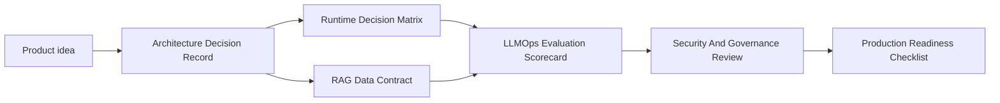

# AI Solution Architecture Toolkit

These templates turn the course into practical artifacts. Use them during design reviews, architecture workshops, production readiness checks, and post-incident reviews.

## Templates

| Template | Use When |
| --- | --- |
| [Architecture Decision Record](./architecture-decision-record.md) | You need to record an architectural decision and rejected alternatives. |
| [Runtime Decision Matrix](./runtime-decision-matrix.md) | You are choosing between Transformers, vLLM, llama.cpp, hosted APIs, or hybrid serving. |
| [RAG Data Contract](./rag-data-contract.md) | You are designing ingestion, embeddings, metadata, vector stores, and retrieval policy. |
| [LLMOps Evaluation Scorecard](./llmops-evaluation-scorecard.md) | You need a promotion gate for prompts, models, adapters, retrieval, or tools. |
| [Production Readiness Checklist](./production-readiness-checklist.md) | You are reviewing whether an AI system can go live. |
| [Security And Governance Review](./security-governance-review.md) | You need to review tool execution, data access, secrets, model artifacts, and auditability. |

## Recommended Flow

## Review Rule

Every AI architecture decision should answer:

- What layer owns this concern?
- What alternatives were rejected?
- What evidence will prove the decision worked?
- What failure mode should be rehearsed?
- What must be true before this can be promoted to production?

## How To Use The Toolkit

Use the templates as review artifacts, not as paperwork. A good AI architecture review should make the hidden assumptions visible: which team owns each boundary, which runtime or data choice is being made, which metric proves the choice, and which incident would expose the weakness. Start with the Architecture Decision Record when the team is still debating direction. Move to the runtime matrix, RAG contract, and evaluation scorecard when the decision needs evidence. Finish with security governance and production readiness before the solution reaches users.

For workshops, assign one owner to each artifact and keep the discussion anchored to measurable claims. Avoid generic statements such as "the model is good" or "RAG improves accuracy." Replace them with claims like "the candidate retrieval configuration improves grounded answer success from 72 percent to 86 percent on the finance policy evaluation set while keeping p95 latency under 4 seconds." This style turns architecture into an inspectable engineering discipline.

## Quality Bar

An artifact is ready for review when it has a named owner, a clear scope, real alternatives, measurable evidence, and at least one explicit rollback or mitigation path. It is not ready when it only lists tools, omits operational ownership, ignores security impact, or treats evaluation as a one-time benchmark. Senior reviewers should be able to read the artifact and understand what will break first, who will notice, and what the team will do next.

## Mapping To Course Domains

The ADR links product goals to architecture boundaries. The runtime matrix covers model serving and inference. The RAG data contract covers retrieval architecture, vector databases, metadata, tenancy, and deletion workflows. The evaluation scorecard covers LLMOps, observability, prompt changes, model changes, and release gates. The security review covers agents, tools, model artifacts, secrets, audit logs, and data governance. The production checklist ties every domain together into a release decision.
